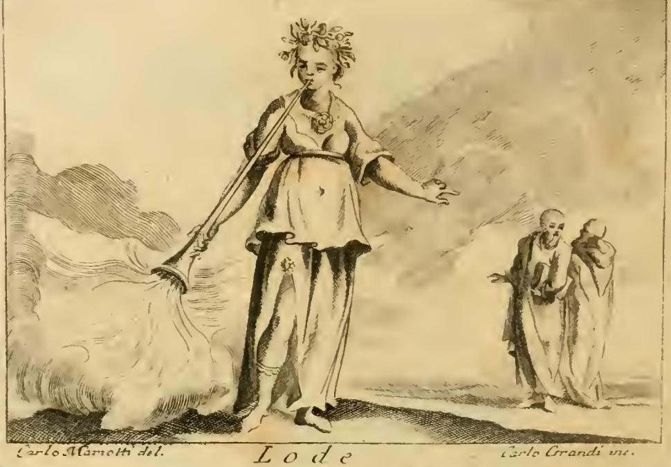

# '칭찬(Lode)' 항목의 신화 사례 — 칸다울레스와 기게스

> **Q.** '칭찬' 항목의 신화 사례(칸다울레스 이야기)는?
>
> **A.** 리디아 왕 칸다울레스는 아내의 아름다움을 지나치게 자랑한 나머지 총신 기게스에게 아내의 나신을 몰래 보게 했다. 이를 안 왕비는 복수를 위해 기게스에게 왕을 죽이게 했고, 기게스는 왕을 죽이고 왕비와 결혼했다(헤로도토스 『역사』 클리오).

---

## 1. 이 사례가 놓인 자리 — 『Iconologia』 '칭찬' 항목의 구조

체사레 리파(Cesare Ripa) 『Iconologia』의 체사레 오를란디(Cesare Orlandi) 개정판(1764–67, 페루자) 계열에서는 각 알레고리 항목이 **① 도상 기술(figura) → ② 지물 하나하나의 해설 → ③ 세 종류의 실제 사례**로 마무리된다. 세 사례의 고정 틀은 이렇다.

| 표제 | 성격 | '칭찬(LODE)' 항목의 내용 |
|---|---|---|
| **FATTO STORICO SAGRO** | 성경에서 뽑은 사례 | 솔로몬의 잠언 27:2 — *"Laudet te alienus, et non os tuum: extraneus, et non labia tua"*(남이 너를 칭찬하게 하고 네 입으로 하지 말며, 타인이 하게 하고 네 입술로 하지 말라) |
| **FATTO STORICO PROFANO** | 세속 역사·일화 | **핀다로스**가 "당신을 칭찬하기를 결코 멈추지 않겠다"고 자꾸 되뇌는 사람에게 답하기를 — "그 말 참으로 고맙소. 그 호의에 보답하는 뜻으로, *당신이 거짓말한 게 아니라는 사실이 언제나 확인되도록* 내가 그렇게 살아 보겠소"(파올로 마누치오 『아포프테그마타』 6권) |
| **FATTO FAVOLOSO** | 신화·우화 사례 ← **이 카드** | **칸다울레스와 기게스** (헤로도토스 『클리오』) |

즉 카드가 말하는 '신화 사례'는 원문의 **`FATTO FAVOLOSO`**(우화적/신화적 사례) 항목 그 자체다. 세 사례가 모두 **하나의 논지**를 향한다는 점이 핵심이다: **칭찬은 남이 해주는 것이며, 자기(또는 자기 소유)를 스스로 자랑하면 파멸한다.** 잠언 27:2가 계명으로 그것을 말하고, 핀다로스 일화가 겸손의 모범을 보이며, 칸다울레스가 **반례(경고 사례)** 로 그 대가를 보여준다.

---

## 2. 원문 (asset: `02 Letters to Lust.md` 430행, `FATTO FAVOLOSO`)

OCR 상태의 이탈리아어 원문을 정자로 복원하면 다음과 같다.

> CAndaulo, da alcuni chiamato ancora **Mirsilo**, figlio di **Mirso**, ed ultimo degli Eraclidi. Costui amava tanto la sua moglie, che non cessava tutto giorno d'innalzarne soprammodo con chiunque il merito. Giunse a tanto nel lodarla, che acciò fosse pienamente creduto da un certo suo favorito, di nome **Gige**, a cui esaltava la sua straordinaria bellezza, s'indusse a fargliela mirare totalmente nuda. Si sdegnò fortemente la Regina dell'atto inonesto. La veduta, più che le lodi, fece breccia nel cuore di Gige, recandone al maggior segno invaghito. Da ciò ne avvenne, che la Regina per vendicarsi, mostrò di corrispondere a Gige, e gli ordinò che uccidesse Candaulo. Ubbidì Gige, e sposò la sua Signora. — **Erodoto, Clio.**

**번역.** 칸다울레스는 어떤 이들이 미르실로스라고도 부르는, 미르소스의 아들이자 헤라클레스 후손(에라클리다이) 왕조의 마지막 왕이다. 그는 아내를 어찌나 사랑했던지 온종일 누구를 만나든 아내의 뛰어남을 지나치게 치켜세우기를 그치지 않았다. 칭찬이 하도 지나쳐, 그 비상한 미모를 자랑해 온 총신 기게스에게 **완전히 믿게 하려고** 아내를 알몸으로 보게 하는 데까지 이르렀다. 왕비는 이 부정한 짓에 크게 분노했다. 그런데 **칭찬의 말보다 실제로 본 광경이** 기게스의 마음을 뚫어, 그는 극도로 반해 버렸다. 그리하여 왕비는 복수하려고 기게스에게 마음을 받아주는 척하며 칸다울레스를 죽이라 명했다. 기게스는 복종했고, 자기 주인(왕비)과 결혼했다. — 헤로도토스, 『클리오』.

**세부 확인 포인트**

- `Marsilo/Marfillo`는 OCR 오독이며 실제로는 **Mirsilo(미르실로스)**. 헤로도토스 1.7이 "칸다울레스를 그리스인들은 **미르실로스**라 부른다"고 한 것을 그대로 옮긴 것이다.
- `Mirso` = **미르소스(Myrsus)**, 칸다울레스의 아버지.
- `Clio` = 헤로도토스 『역사』의 **제1권**. 아홉 권을 아홉 무사(Muse) 이름으로 부르는 후대 관행에 따른 표기(1권 클리오, 2권 에우테르페 …).
- `s'indusse a fargliela mirare` — "**보게 하도록 스스로를 몰아갔다**". 아래에서 보듯 헤로도토스에서는 오히려 왕이 기게스를 **강권**한다.

---

## 3. 헤로도토스 원전(『역사』 1.8–1.13)과 대조

리파/오를란디의 요약은 매우 압축돼 있어 원전의 결정적 대목이 몇 개 빠져 있다. 배경으로 채워두면 카드가 훨씬 입체적으로 이해된다.

**1.8** 칸다울레스는 "자기 아내에게 반해서"(ἠράσθη τῆς ἑωυτοῦ γυναικός) 그녀가 세상에서 가장 아름답다고 믿었다. 그는 창을 든 호위병 중 가장 아끼던 **다스킬로스의 아들 기게스**에게 아내의 미모를 늘 늘어놓았고, 마침내 이렇게 말한다 — *"기게스, 내 아내의 미모를 말로 하니 자네가 믿는 것 같지 않군. **귀는 눈보다 믿을 수 없는 것**이니, 알몸의 그녀를 보도록 하게."*

**1.9** 기게스는 경악하며 사양한다. *"주인님, 무슨 병든 말씀입니까? 여인은 옷을 벗을 때 수치심도 함께 벗습니다."* 그러나 왕은 **명령으로 강권**한다("두려워 말라, 나도 아내도 자네를 해치지 않을 계책을 세웠으니"). 침실 문 뒤에 기게스를 숨기는 계획은 **왕이 직접 설계**한 것이다.

**1.10** 왕비는 옷을 벗어 의자에 놓는 순간 빠져나가는 기게스를 **알아보았지만**, 그 자리에서 소리치지 않고 침묵으로 복수를 준비한다.

**1.11** 이튿날 왕비는 기게스를 불러 유명한 **양자택일**을 제시한다 — *"두 길이 열려 있으니 어느 쪽이든 택하라. **칸다울레스를 죽이고 나와 리디아 왕국을 차지하든지, 아니면 지금 당장 네가 죽든지.** 보아서는 안 될 것을 본 자는 살 수 없다."* 기게스는 애원하다 결국 첫 번째를 택한다.

**1.12** 같은 침실, 같은 문 뒤에서 — 이번에는 **왕비가 기게스에게 단검을 주어** 숨긴다. 잠든 칸다울레스를 기게스가 살해한다. **자기 자랑을 위해 마련한 그 은닉처가 자기 죽음의 자리가 된다**는 아이러니가 서사의 핵심 장치다.

**1.13** 리디아인들이 무장하고 반발하자 양측은 **델포이 신탁**에 판정을 맡긴다. 신탁이 기게스를 왕으로 인정하여 왕권이 확정되지만, 무녀는 한 마디를 덧붙인다 — **"헤라클레스의 후손들은 5대 뒤에 기게스에게 복수를 받을 것이다."** 이렇게 **메름나드(Mermnadae) 왕조**가 505년/22대의 헤라클레이다이 왕조를 대체했고, 신탁의 응보는 5대 뒤 **크로이소스**의 몰락(페르시아 키루스에게 패망)으로 실현된다. 헤로도토스 1권 전체가 이 예고로 짜여 있다.

> **논점 강화:** 즉 헤로도토스에서 칸다울레스의 '지나친 칭찬'은 **개인의 파멸을 넘어 왕조 하나를 무너뜨리고 5대에 걸친 응보를 남긴다.** 리파의 '칭찬' 항목이 이 이야기를 반례로 고른 이유가 여기에 있다. 자화자찬(또는 자기 소유의 자랑)은 실없는 결례가 아니라, 그 자체로 파괴적 인과의 시작이다.

**작은 정정 두 가지**

- 왕비의 이름은 **헤로도토스에서는 나오지 않는다.** 후대 전승이 **뉘시아(Nyssia)** 로, 다마스쿠스의 니콜라오스는 **투도(Tudo)** 로 부른다.
- 카드 답변의 "몰래 보게 했다"는 **기게스 쪽에서만** 몰래다. 왕에게는 몰래가 아니라 **왕의 발안·왕의 강권**이었다는 점이 '칭찬' 항목의 논지에 결정적이다.

---

## 4. 판화와 함께 보기 — 도상이 그 자체로 논지다

'칭찬' 항목의 판화(`_page_47_Picture_3.jpeg`, 원문 378행)를 보면 텍스트의 지물 해설과 정확히 대응한다.

| 그림에서 보이는 것 | 원문의 해설 |
|---|---|
| **흰 옷**의 아름다운 여인 | 참된 칭찬은 **순수하고 진실**해야 한다 — 진실의 원수인 아첨(adulazione)과 대립 |
| 머리의 **장미 화관** | 장미는 향기롭고 아름다워 **타인의 호의를 얻는** 인간적 칭찬을, 화관·왕관은 시작도 끝도 없는 구형이므로 **영원한 신적 칭찬**을 뜻함 |
| 가슴의 **보석(야스피데=벽옥)** | 플리니우스 37권의 초록빛 보석. 지닌 자가 **은총·호의(grazia)** 를 얻는다는 속성 |
| 입에 문 **나팔**과 왼쪽 아래로 뿜어나오는 **거대한 빛/구름 같은 광휘** | 칭찬받기에 참으로 합당한 이들의 **명성과 이름의 밝음**. 로마인이 사투르누스 신전 정상에 꼬리를 감춘 트리톤 나팔수를 세운 것과 같은 뜻 |
| 뻗은 **왼팔과 집게손가락**이 오른쪽의 **다른 인물(노인) 쪽을 가리킴** | *"laus est sermo dilucidans magnitudinem virtutis alicuius"*(토마스 아퀴나스). 페르시우스 『풍자시』 1권 — *"손가락으로 가리켜져 '이 사람이다'라고 말해지는 것은 아름다운 일"* |

**여기가 카드와 판화가 맞물리는 지점이다.** 그림에서 여인은 **나팔은 자기 입으로 불되, 손가락은 자기가 아니라 저 건너의 남을 가리킨다.** 즉 도상 자체가 **칭찬의 주체(부는 자)와 대상(가리켜지는 자)의 분리**를 그려 놓았다. 칸다울레스는 이 구조를 어긴 인물이다 — 자기 나팔을 불면서 손가락이 **자기 침실**을 향했다. 잠언 27:2("남이 너를 칭찬하게 하라")가 명령으로 말하는 것을, 판화는 손가락의 방향으로 말하고, 칸다울레스 이야기는 그 위반의 결말로 말한다. 세 층이 같은 말을 하는 셈이다.

참고로 원문은 아리스토텔레스 『수사학』 1권을 들어 "칭찬은 덕의 탁월함과 위대함을 드러내는 말"이라 하고, **"laus proprie respicit opera"(칭찬은 본래 *행위*를 향한다)** 는 원칙에서 — *로마에서 악덕을 추방한 카토가 아프리카에서 카르타고를 이긴 스키피오보다 더 칭찬받을 만하다* 는 판단을 끌어낸다. 칸다울레스가 자랑한 것은 **행위(opera)** 가 아니라 **자기 소유물의 외모**였다는 점에서, 리파의 기준으로는 애초에 칭찬의 대상 자격조차 없었다.

---

## 5. 반드시 구별할 두 가지

### (1) '신화'로 분류돼 있으나 실은 역사 서술이다

이 카드가 '신화 사례'인 것은 오를란디판의 편집 표제가 **`FATTO FAVOLOSO`**(우화적 사례)이기 때문이다. 그러나 인용 출처는 **헤로도토스 『역사』 1권** — 신화집이 아니라 **역사 서술(historiography)** 이다. 18세기 편집자가 이 이야기를 '우화' 칸에 넣은 것은, ㉠ 리디아 왕조사가 당시 유럽에서 아득한 전설적 과거로 받아들여졌고, ㉡ 세 칸 틀에서 '성경'과 '세속사'가 이미 채워진 뒤 **이교 고대의 교훈담**을 담을 칸이 `FAVOLOSO`였던 편집 관행 때문이다. 시험식으로 정리하면: **분류상 신화 사례, 출처상 헤로도토스의 역사 기술.**

### (2) 플라톤 『국가』의 '기게스의 반지'는 같은 인물의 **다른 전승 계열**

| | 헤로도토스 『역사』 1.8–13 (= 이 카드) | 플라톤 『국가』 2권 359d–360b |
|---|---|---|
| 주인공 | **기게스** 본인, 왕의 창수(호위병) | 기게스의 **선조**, 리디아의 **목자** |
| 발단 | **왕이 자기 아내를 자랑해** 알몸을 보게 함 | 지진으로 갈라진 땅에서 **투명해지는 반지**를 얻음 |
| 수단 | 침실 문 뒤의 은닉, 왕비의 단검 | **마법 반지의 투명 능력** |
| 결말 | 왕비의 양자택일 → 왕 살해 → 왕비와 결혼 → 메름나드 왕조 | 궁에 잠입, 왕비를 유혹, 왕을 죽이고 왕위 탈취 |
| 논지 | **자기 자랑의 파멸**, 그리고 5대 뒤 응보의 예고 | **들키지 않는다면 누구나 부정을 저지르는가** — 정의의 동기 문제 |

두 이야기 모두 "리디아, 기게스, 왕비, 왕 살해, 왕위 탈취"라는 뼈대를 공유하지만, **리파가 '칭찬' 항목에 인용한 것은 반지 쪽이 아니라 헤로도토스 쪽**이다. 반지 버전에는 애초에 '칭찬'이라는 요소가 없으므로 이 항목에 쓸 수 없다. 시험에서 "기게스" 하나만 보고 '기게스의 반지'로 끌려가지 않도록 주의.

---

## 6. 한 줄 압축

> 리파 '칭찬(Lode)' 항목의 `FATTO FAVOLOSO`는 헤로도토스 1권의 칸다울레스 이야기다. 리디아 왕 칸다울레스가 아내의 미모를 과하게 **자기 입으로** 자랑해 총신 기게스에게 알몸을 보게 하자, 이를 알아챈 왕비가 기게스에게 "왕을 죽이든 네가 죽든" 양자택일을 강요했고, 기게스는 왕을 죽이고 왕비와 결혼해 **메름나드 왕조**를 세웠다(델포이 신탁은 5대 뒤 응보를 예고, 크로이소스에서 실현). 판화가 **나팔은 입에 물고 손가락은 남을 가리키는** 여인으로 형상화한 원칙 — **"칭찬은 남이 해야 한다"(잠언 27:2)** — 의 **반례**로 쓰인 것이다.

---

### 출처

- 원문: `.fm/assets/02 Letters to Lust.md`, 374–432행 (`LODE` 항목 전체, `FATTO FAVOLOSO`는 430행)
- 판화: `.fm/assets/Iconologia (Cesare Ripa)/_page_47_Picture_3.jpeg` (본문 `fig-1.jpeg`)
- [Herodotus, *Histories* Book 1 (Duke, 영역 전문)](https://people.duke.edu/~wj25/ereserves/Herodotus_Book1.pdf)
- [Herodotus on Candaules, his wife, and Gyges — Livius.org](https://www.livius.org/sources/content/herodotus/candaules-his-wife-and-gyges/)
- [Candaules and Gyges (§§7–14) — Discourses on the First Book of Herodotus](https://viva.pressbooks.pub/arieti-herodotus/chapter/candaules-and-gyges/)
- [Candaules — Wikipedia](https://en.wikipedia.org/wiki/Candaules)
- [The Ring of Gyges — Plato's *Republic* II](https://www.plato-dialogues.org/tetra_4/republic/gyges.htm)
- [Gyges — Britannica](https://www.britannica.com/biography/Gyges)
- ["Candaules, whom the Greeks name Myrsilus…" J. A. S. Evans, *GRBS*](https://grbs.library.duke.edu/index.php/grbs/article/download/5191/5355/15241)
