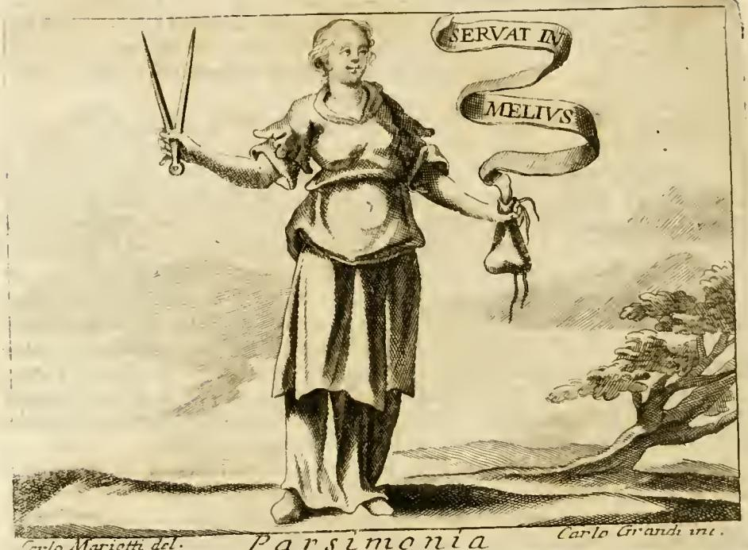

# 검약 (Parsimonia) — 체사레 리파 『이코놀로지아』

## 한눈에 보기

| 요소 | 도상 | 의미 |
|---|---|---|
| 나이 | 장년(età virile) | 이성이 완성된 나이 — 이익과 명예를 판단해 행동할 수 있음 |
| 옷 | 장식 없는 소박한 옷(abito semplice, senza ornamento alcuno) | 헛되고 불필요한 지출과 거리가 먼 덕 |
| 오른손 | 컴퍼스(compasso) | 모든 일에서의 질서와 절도 — 원주를 벗어나지 않듯 정직·합리의 선을 넘지 않음 |
| 왼손 | 끈으로 묶은 돈주머니(borsa piena di denari legata) | 이미 가진 것을 지켜냄. 열려 쏟아지는 게 아니라 **묶여 있는** 것이 핵심 |
| 두루마리 | IN MELIUS SERVAT | "더 나은 때를 위해 간직한다" |

## 원문 도판

판화(Carlo Marietti 그림 / Carlo Grandi 판각, 하단 캡션 `Parsimonia`)에서 실제로 관찰되는 것:

- **오른손**: 팔을 옆으로 뻗어 **벌어진 컴퍼스(디바이더)** 를 곧게 세워 들고 있다. 다리가 벌어진 상태 그대로 고정되어 "정해진 반경을 넘지 않는다"는 뜻을 시각화한다.
- **왼손**: 아래로 늘어뜨린 채 **목을 끈으로 조여 맨 작은 자루(돈주머니)** 를 손가락에 걸고 있다. 주머니가 작고 아래로 처져 있어 "쏟아붓지 않고 잠가 둔다"는 인상을 준다.
- **옷차림**: 장신구·보석·왕관이 전혀 없고 허리를 한 번 묶은 단색 긴 튜닉과 겉옷, 맨발에 가까운 소박한 신발. 머리도 장식 없이 단순하게 묶었다.
- **두루마리**: 오른쪽 위에서 감겨 내려오는 리본에 두 줄로 글자가 새겨져 있다. 판화의 실제 각자 순서는 `SERVAT IN / MELIVS`이고, 본문 서술은 `IN MELIUS SERVAT`이다 — **어순만 다르고 같은 표어**다(라틴어라 어순이 자유롭다). "더 나은 (때/쓰임)을 위하여 간직한다".
- 배경은 텅 빈 들판과 오른쪽의 나무 한 그루뿐. 부(富)의 상징물(보물, 궁전)이 없다는 점 자체가 검약의 성격을 말해 준다.

## 본문 논증의 흐름

리파의 설명은 다음 순서로 전개된다.

1. **정의**: "검약은 관후함(liberalità)의 두 주요 부분 중 하나로, 필수적이지 않은 지출을 스스로 삼가는 데 있다(consiste nel ritenersi dalle spese che non sono il mezzo)."
   - 호라티우스 『풍자시』 2권 3편의 `Maiorem censu... cultum define`를 인용해 "수입보다 큰 과도한 지출을 그만두라"로 풀이한다.
2. **프루덴티아와의 연결**: 운(fortuna)의 재화에 관한 **분별(prudenza)의 네 부분** — ① 재화를 얻음(acquista) ② 지킴(conserva) ③ 늘림(accresce) ④ 지혜롭게 씀(prudentemente utitur) — 가운데 검약은 **셋을 가진다**(지키고, 늘리고, 지혜롭게 쓴다). 즉 검약은 소극적 절약이 아니라 재산 운용의 분별 그 자체에 가깝다.
3. **격언**: 소크라테스 학파 아이스키네스가 "생활비를 줄임으로써 자기 자신에게서 이자를 받았다"는 일화, 그리고 `Magnum vectigal parsimonia`("검약은 큰 수입원이다", 키케로 계열 격언)를 든다.
4. **정치경제적 적용**: 아리스토텔레스를 무레투스 번역으로 인용해, 국가·가정은 먼저 수입을 파악하고 불필요하거나 분수에 넘치는 지출을 없애야 한다고 한다. "재산에 무언가를 더하는 자만이 아니라 지출에서 덜어내는 자도 더 부유해진다."
5. **세네카** 『마음의 평정에 관하여』: "검약이 먼저 마음에 들지 않으면 어떤 재산도 충분하지 않다(sine qua nullae opes sufficiunt)."
6. **개별 상징 해설**: 장년 → 이성, 소박한 옷 → 헛된 지출과의 거리(암브로시우스: "필요한 것이 무엇인지 아는 것보다 더 필요한 것은 없다"), 컴퍼스 → 질서와 절도, 돈주머니+표어 → **"없는 것을 새로 얻는 것보다 가진 것을 지키는 것이 더 큰 노력이며 더 큰 명예"**.
   - 클라우디아누스 『스틸리코 찬가』 2권: `Plus est servasse repertum, quam quaesisse decus novum`(찾아낸 것을 지킨 것이 새 영광을 구한 것보다 크다).
   - 오비디우스 『사랑의 기술』 2권: `Non minor est virtus, quam quaerere, parta tueri`(얻은 것을 지키는 것은 구하는 것에 못지않은 덕이다) — 구하는 데는 우연이 작용하지만 지키는 데는 기술이 필요하다.

## 관후함(Liberalità)과 짝지어 읽기

『이코놀로지아』의 **관후함** 항목(같은 판본, 리파)과 나란히 두면 검약의 위치가 분명해진다.

- 관후함은 **흰옷**을 입고 머리에 **독수리**를 얹었으며, 오른손에 **컴퍼스와 함께** 기울인 코르누코피아를 들어 보석·돈·목걸이를 **쏟아내고**, 왼손에는 과일과 꽃이 담긴 또 하나의 코르누코피아를 든다.
- 즉 **컴퍼스는 두 덕이 공유하는 속성**이다. 관후함 쪽 해설은 "관후함은 자기가 가진 재산과 상대의 자격에 맞게 재어야 한다"는 뜻으로 컴퍼스를 쓴다. 검약 쪽 해설은 같은 컴퍼스를 "정직·합리의 한도를 넘지 않음"으로 쓴다.
- 차이는 손에 든 **그릇**이다. 관후함은 아래로 기울여 쏟는 코르누코피아, 검약은 **끈으로 묶은 주머니**. 리파에게 관후함은 "지출에서의 중용(mediocrità nello spendere)"이고, 그 중용의 두 축이 곧 **적절히 내주는 쪽**과 **삼가고 지키는 쪽(= 검약)**이다.
- 그래서 검약은 인색(avarizia)과 구별된다. 인색은 관후함의 결핍이라는 **악덕**이고, 검약은 관후함을 성립시키는 **구성 부분**이다. 도판에서 검약이 돈주머니를 감추거나 끌어안지 않고 남들이 볼 수 있게 손가락에 걸어 늘어뜨린 것도 이 점과 통한다.

## 암기 포인트

- 나이: **장년** (소녀 아님, 노파 아님)
- 옷: **무장식 소박한 옷**
- 오른손 **컴퍼스** / 왼손 **묶은 돈주머니** (좌우 혼동 주의)
- 표어: **IN MELIUS SERVAT** = 더 나은 때를 위해 간직한다
- 상위 개념: **관후함(liberalità)의 두 주요 부분 중 하나**, 프루덴티아의 네 부분 중 **셋**을 가짐
