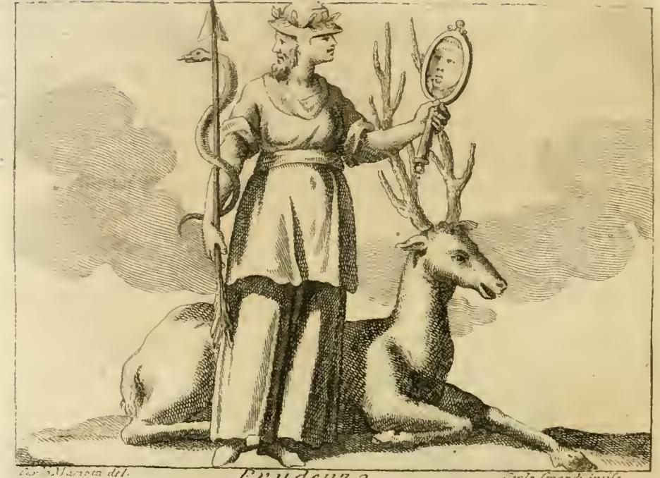
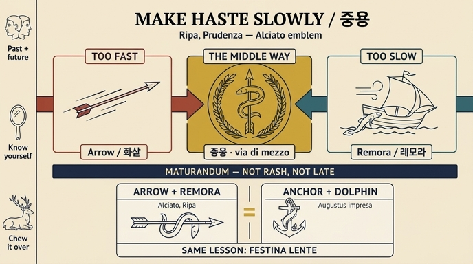

# 화살에 감긴 레모라(Remora) — 「신중(Prudenza)」의 표지

## 한눈에 보기

| 요소 | 상징 | 방향 |
|---|---|---|
| 프레차(frezza, 화살·투창) | 활에서 튕겨 나가는 살 = **빠름·성급함** | 너무 빠름 |
| 에크네이데/레모라(Ecneide, Remora) | 배에 붙어 항해를 멈추는 물고기 = **느림·지체** | 너무 느림 |
| 둘이 하나로 감긴 형상 | 두 극단의 결합 = **중용(via di mezzo)** | 중간 길 |

핵심 교훈: **"말과 행동에서 중간 길을 가라"** — 지체도 해롭고, 가볍게 서두름도 해롭다.

---

## 리파의 원문 근거

체사레 리파 『이코놀로지아』의 **PRUDENZA(신중)** 항목 첫 번째 도상 기술:

> "Nella deftra mano terrà una frezza, intorno alla quale vi farà rivolto un Pefce detto Ecneide, ovvero Remora, che così è chiamato da' Latini, il quale ferive Plinio, che attaccandofi alla Nave, ha forza di fermarla; e perciò è potto per la tardanza."
>
> (오른손에는 화살을 들고, 그 주위에 에크네이데 또는 라틴어로 레모라라 불리는 물고기가 감겨 있다. 플리니우스가 쓴 바, 이 물고기는 배에 달라붙어 배를 멈추게 하는 힘이 있으므로 **느림(tardanza)**을 나타내기 위해 놓인 것이다.)

이어 리파는 화살+물고기 조합이 **알치아토**의 엠블럼에서 왔음을 밝히며 이탈리아어 8행시(ottava rima)를 인용한다.

> "Ch'esser si debba in ogni impresa molto / Saggio al parlar, e nell'oprar intento, / il Pesce il mostra alla saetta avvolto, / Che suol Nave fermar nel maggior vento: / Vola dall'arco, e dalla mano sciolto / Il dardo: è l'altro troppo pigro, e lento: / **Nuoce il tardar, come esser presto e lieve: / La via di mezzo seguitar si deve.**"
>
> (모든 일에서 말에는 매우 신중하고 행동에는 집중해야 함을 — 화살에 감긴 저 물고기가 보여준다. 그것은 가장 센 바람 속에서도 배를 멈추곤 하는 물고기다. 활에서, 손에서 풀려난 창은 날아가고, 다른 하나[물고기]는 너무 게으르고 느리다. **지체함도 해롭고 빠르고 가벼움도 해롭다. 중간 길을 따라가야 한다.**)

리파는 같은 대목에서 화살+레모라의 의미를 **한 걸음 더 확장**한다: "**알려진 선(善)에 자신을 적용하는 데 너무 늦어서는 안 된다**(non fi deve efler troppo tardo nell'applicarfi al bene conofciuto)". 즉 단순한 속도 조절이 아니라 *선을 실행할 때의 적기(適期) 판단*이 신중의 핵심이라는 것이다.

---

## 판화에서 실제로 보이는 것

판화를 요소별로 대조해 읽으면 본문 기술과 정확히 일치한다.

1. **머리** — 금빛 투구(elmo dorato)에 잎으로 된 화관. 두 얼굴(야누스처럼 앞뒤를 동시에 보는 얼굴)이 겹쳐 있어, 오른쪽 뺨 옆으로 두 번째 얼굴의 윤곽선이 뚜렷하다.
2. **오른손(화면 왼쪽)** — 바닥까지 닿는 긴 창대 모양의 **화살(frezza/dardo)**을 곧게 세워 쥐고 있고, 그 축을 따라 **뱀장어처럼 길고 구불구불한 물고기**가 위아래로 감겨 있다. 머리는 창끝 근처에서 왼쪽으로 뻗고, 몸통은 두 번 크게 감긴 뒤 아래로 늘어진다. 이것이 **레모라(에크네이스)** — 판화가가 뱀에 가깝게 그렸지만, 고대 문헌의 에크네이스가 "민달팽이/작은 뱀장어 같은 물고기"로 기술된 데 부합한다. **판화 한 장에 '가장 빠른 것'과 '가장 느린 것'이 한 축에 묶여 있는 것이 이 도상의 핵심 시각적 역설**이다.
3. **왼손(화면 오른쪽)** — 손잡이 달린 **거울**을 얼굴 높이로 들고 있고, 거울면 안에 얼굴이 반사되어 그려져 있다. 리파: 자기 결점을 알고 고치지 않으면 행위를 규율할 수 없다(소크라테스가 제자들에게 매일 아침 거울을 보라고 권한 뜻).
4. **발밑** — **긴 뿔의 사슴**이 엎드려 되새김질(ruminare)하는 자세. 리파의 설명: 길고 날렵한 다리는 달리기를 재촉하지만 무거운 뿔은 지체시키고 숲에서 걸릴 위험이 있으니, **사슴은 화살+물고기와 같은 것(빠름과 느림의 동시 견제)을 보여준다.** 되새김질은 결단(risoluzione) 전에 앞서는 숙고(discorso)에 대응한다.
5. **화관** — 뽕나무(moro) 잎. 리파가 인용한 알치아토의 다른 엠블럼 **"Morus"**(뽕나무, 엠블럼 209/210)에서 온 것: "*Serior at morus numquam nisi frigore lapso germinat*"(뽕나무는 늦되어, 추위가 물러가야 비로소 싹을 낸다). 라틴어 morus가 그리스어 μῶρος(바보)와 겹치는 어원 유희에도 불구하고 이 나무는 '현명한' 나무 — 때를 기다린다.

요컨대 이 한 장의 판화에는 **때를 판단하는 세 장치**가 겹쳐 있다: 뽕나무(때를 기다림), 화살+레모라(속도의 중용), 사슴(숙고 후 결단), 그리고 이를 가능케 하는 **자기 인식**(거울)과 **과거·미래를 함께 봄**(두 얼굴).

---

## 출처 1: 알치아토 엠블럼 "Maturandum"

안드레아 알치아토(Andrea Alciato, 1492–1550)의 『Emblematum liber』, 모토 **"Maturandum"**(때에 맞게 하라 / 서둘러 익혀라). 표준 판본(1608 Plantin, 1621 Padua 등)에서 **엠블럼 20번**.

**라틴 원문**

> Maturare iubent properè et cunctarier omnes,
> Ne nimium praeceps, neu mora longa nimis.
> Hoc tibi declaret connexum echeneide telum:
> Haec tarda est, volitant spicula missa manu.

**번역**

> 모두가 서둘러 일을 익히라 하면서 동시에 머뭇거리라 한다 —
> 너무 성급하지도, 너무 오래 지체하지도 말라고.
> **에크네이스가 감긴 창(telum)**이 이것을 네게 보여줄 것이다:
> 이 물고기는 느리지만, 손에서 놓인 살은 날아간다.

라틴어 대비가 정교하다: **`properè`(서둘러) ↔ `cunctarier`(머뭇거리다)**, **`nimium praeceps`(너무 곤두박질) ↔ `mora longa nimis`(너무 긴 지체)**. 여기서 `mora`는 '지체'라는 뜻이면서 동시에 물고기 이름 **remora/mora**를 겹쳐 읽게 하는 **말놀이(pun)**다. 리파의 이탈리아어 8행시("Nuoce il tardar, come esser presto e lieve")는 이 대구를 그대로 옮긴 것으로, 1549년 리옹에서 나온 알치아토 이탈리아어 번역본 계열의 ottava rima 판본에서 유래한다.

---

## 출처 2: 플리니우스 『자연사』의 에크네이스/레모라

### 9권 41장 (§ 79) — 이름의 유래

작은 물고기로 바위 사이에 산다. 배의 **용골(keel)에 달라붙으면 배의 진행이 방해받는다**고 믿어졌고, 그 이름이 여기서 나왔다. 그리스어 **ἐχενηΐς(echeneis) = ἔχειν(붙잡다) + ναῦς(배)** → "배를 붙잡는 것". 라틴어 **remora** = "지체시키는 것"(re- + mora). 같은 장에서 플리니우스는 이 물고기가 **사랑의 미약(媚藥)**과 **재판·소송을 지연시키는 주술**에 쓰인다고 덧붙인다 — '멈춤·지체'라는 관념이 자연사에서 주술로 확장된 셈이다. 아리스토텔레스는 지느러미 구조 때문에 이 물고기에 발이 있다고 보았다고 전한다. 트레비우스 니게르는 길이가 한 자(약 1피트) 남짓이라 했다.

### 32권 1장 — 악티움 해전의 일화

플리니우스가 가장 웅변적으로 다루는 대목이다.

> 악티움 해전에서 이런 종류의 물고기 하나가 **안토니우스의 기함(旗艦)**을 멈춰 세웠다. 그가 병사들을 격려하려 배에서 배로 옮겨 다니던 바로 그 순간이었고, 그래서 그는 자기 배를 버리고 다른 배로 옮겨 타야 했다. 이로써 **카이사르(옥타비아누스)의 함대가 첫 돌격에서 유리해졌다.**
>
> 반 피트도 채 안 되는 작은 물고기가 안토니우스의 기함을 그 자리에 못 박아 붙일 수 있었다니 …
>
> 우리 저술가 일부는 이 물고기에 **"mora"**라는 라틴 이름을 붙였다.

플리니우스는 칼리굴라 암살과 관련된 조짐에도 이 물고기를 암시한다. 즉 이 물고기는 고대에 **"제국의 운명을 바꾼 지체"의 상징**이었고, 르네상스 엠블럼 작가들이 '느림'의 최강 이미지로 채택한 이유도 여기에 있다.

**실제 생물학**: 오늘날의 빨판상어(remora, *Echeneis naucrates* 등)는 머리 위 흡반으로 상어·거북·선체에 붙는다. 그러나 아주 작은 보트조차 멈춰 세울 힘은 없다. 악티움에서 안토니우스 함대의 기동이 둔했던 것은 얕은 수심·해저 지형과 대형 함선의 구조 문제로 설명된다(수심 효과에 관한 현대 연구도 있다).

---

## 출처 3: 'festina lente' 토포스와 돌고래-닻 임프레사

리파는 마지막에 **대체 도상**을 제시한다.

> "화살 대신 **닻**에 손을 얹게 하고 그 닻에 **돌고래**가 감겨 있게 해도, 레모라라는 물고기가 감긴 화살과 **같은 뜻**을 드러낸다. 그리고 돌고래가 감긴 그 닻은 **아우구스투스의 임프레사**였으며 신중(Prudenza)을 뜻했다. 세바스티아노 에리초의 메달에 관한 논고를 보라."

즉 **화살+레모라 ≡ 닻+돌고래**. 둘 다 "빠른 것 + 느린 것/붙잡는 것"의 결합이다.

| 대비 축 | 화살 + 레모라 | 닻 + 돌고래 |
|---|---|---|
| 빠름 | 화살(saetta/telum) | 돌고래(바다에서 가장 빠른 짐승) |
| 느림·정지 | 레모라(배를 멈춤) | 닻(배를 세움) |
| 합의 | 중용, 적기 판단 | *festina lente* |

### 계보

- **그리스어 σπεῦδε βραδέως (speûde bradéōs)** — "천천히 서둘러라". 라틴어 **festina lente**는 이 그리스어 격언의 직역이다.
- **수에토니우스, 『아우구스투스』 25.4** — 아우구스투스는 지휘관의 경솔함(temeritas)을 무엇보다 싫어했고, σπεῦδε βραδέως를 즐겨 인용했다고 전한다. 리파가 이 임프레사를 아우구스투스에게 돌린 것은 이 문헌 전통에 기댄 것이다.
- **주의(고증상의 단서)** — 아우구스투스의 실제 화폐 도상은 삼지창·돌고래 계열이며, **돌고래가 닻을 감은 도상이 확실히 확인되는 것은 티투스(서기 80년경) 데나리우스** 등 이후 황제 화폐다. 즉 리파의 "아우구스투스의 임프레사"는 16세기 고전학(세바스티아노 에리초 『Discorso sopra le medaglie』 등)의 귀속을 따른 것으로, 오늘날 화폐학의 판단과 정확히 일치하지는 않는다. 다만 *festina lente*의 **관념**이 아우구스투스에게 속한다는 점은 수에토니우스로 뒷받침된다.
- **알두스 마누티우스(Aldus Manutius)** — 베네치아의 인문주의 출판인. 친구 **피에트로 벰보**로부터 이 도상이 새겨진 로마 화폐를 받고, **돌고래가 닻을 감은 인장(printer's device)**을 자기 출판사의 표장으로 채택했다. "빠르게 그러나 정확하게"라는 출판 윤리의 표어가 된 것.
- **에라스무스, 『아디아기아』 II.i.1 "Festina lente"** — 이 격언을 장문의 에세이로 확장하며 돌고래-닻 도상과 알두스를 함께 논했다. 이 텍스트가 16세기 유럽에 토포스를 확산시킨 결정적 통로였고, 알치아토 → 리파로 이어지는 엠블럼 전통의 배경이 된다.

---

## 시험에 나올 포인트 정리

1. **레모라는 무엇의 표지인가** → 느림·지체(tardanza). 근거는 **플리니우스**(배에 붙어 배를 멈추게 함).
2. **화살은 무엇의 표지인가** → 빠름. 활/손에서 풀려나 날아가는 살.
3. **둘을 결합한 교훈은 누구의 것인가** → **알치아토**, 엠블럼 **"Maturandum"**(20번). "지체도 해롭고 성급함도 해롭다 — **중간 길**을 가라."
4. **어디에 적용되는가** → **말(parlare)과 행동(operare)** 양쪽. 나아가 "알려진 선에 자신을 적용하는 일"에 너무 늦지 말 것.
5. **대체 도상은** → **닻에 감긴 돌고래**. 리파는 이를 **아우구스투스의 임프레사**로 소개(세바스티아노 에리초 참조). 같은 뜻 = *festina lente*.
6. **같은 판화의 다른 요소** → 금빛 투구(현명한 조언으로 무장한 지혜), 뽕나무 화관(때를 기다림, 알치아토 "Morus"), 두 얼굴(과거+미래), 거울(자기 인식), 되새김질하는 긴 뿔의 사슴(빠름을 억제하는 무게 + 결단 전 숙고).

## 참고 자료

- Alciato at Glasgow, Emblem "Maturandum": https://www.emblems.arts.gla.ac.uk/alciato/emblem.php?id=A34b052 , https://www.emblems.arts.gla.ac.uk/alciato/emblem.php?id=A21a020
- Alciato at Glasgow, Emblem "Morus": https://www.emblems.arts.gla.ac.uk/alciato/emblem.php?id=A91a209
- Pliny, *Natural History* 9.41 (echeneis): https://peterburk.github.io/pliny/ChaptersHtml/9.%20Book%20IX.%20The%20Natural%20History%20Of%20Fishes./41.%20Chap.%2041.%20(25.)-The%20Echeneis,%20And%20Its%20Uses%20In%20Enchantments..html
- Pliny, *Natural History* 32.1 (Actium, "mora"): https://www.gutenberg.org/files/62704/62704-h/62704-h.htm
- Echeneis (개관): https://en.wikipedia.org/wiki/Echeneis
- Festina lente / 돌고래-닻: https://bigthink.com/the-learning-curve/festina-lente/ , http://www.adamghooks.net/2011/03/festina-lente.html
- 악티움 해전의 수심 효과와 '배를 붙잡는 자' 신화: https://arxiv.org/abs/1905.13024

## 인포그래픽

