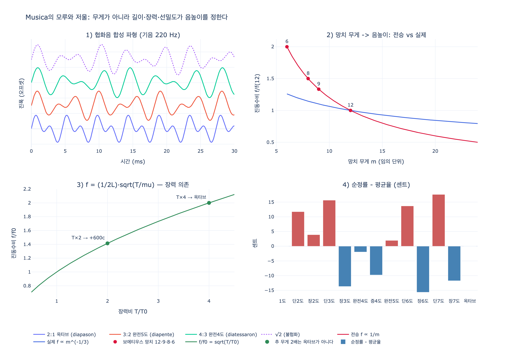

# 음악(Musica) 도상의 모루와 저울 속 망치

**질문**: 음악 도상에서 모루와 저울 속 망치들은 무엇을 뜻하는가?

**답**: 모루는 음악이 대장간에서 기원했다는 전승으로, 아비첸나가 모루 소리로 음정의 조화와 척도를 깨달아 기록했다고 전해진다. 저울은 다른 감각이 무게를 판별하듯 귀의 판단으로 음의 정확함(정률)을 재야 함을 뜻한다.

---

## 1. 원문: 리파가 지시한 Musica의 모습

출전은 자료의 `09 Music to Nymphs.md` 첫 항목 **MUSICA / Di Cesare Ripa**(체사레 리파, 오를란디 판 『Iconologia』 제4권 pp. 201~202)이다. 도상 지시문(원문 5행)은 이렇다.

> *Donna giovane a sedere sopra una palla di color celeste, con una penna in mano. Tenga gli occhi fissi in una carta di musica, posata sopra un incudine, con bilance a' piedi, dentro alle quali siano alcuni martelli di ferro.*
>
> — 하늘색 공 위에 **앉은** 젊은 여인, 손에는 **펜**. 눈은 **모루(incudine) 위에 놓인 악보**에 고정하고, **발밑에는 저울(bilance)**, 그 접시 안에는 **철제 망치 몇 개(alcuni martelli di ferro)**.

지물 하나하나에 리파는 곧바로 해설을 붙인다.

| 지물 | 리파의 설명 |
|---|---|
| 앉은 자세 | 음악은 고단한 영혼의 각별한 **휴식**(*singolar riposo dell'animo travagliato*) |
| 하늘색 공 | 감각적 음악의 화음은 피타고라스학파가 알아낸 **천구의 화음(armonia dei Cieli)** 에 근거해 쉰다 |
| 악보(책) | 화음을 **눈을 통해** 남에게 전달하는 참된 규칙 |
| **모루** | (아래 2절) |
| **저울 + 철제 망치** | (아래 4절) |

핵심 두 구절의 원문은 다음과 같다.

> (19행, 저울) *Le bilance mostrano la giustezza, che ricercasi nelle voci per giudizio delle orecchia, non meno che nel peso, per giudizio degli altri sensi.*
> — 저울은 **귀의 판단으로 음(voci)에서 찾아야 할 정확함(giustezza)** 을, 마치 **다른 감각들이 무게로 판단하는 것과 다름없이** 나타낸다.

> (21행, 모루) *L'incudine si pone, perché si scrive, e crede quindi avere avuto origine quest'arte; e si dice che **Avicenna** con questo mezzo venne in cognizione, e diede a scrivere della convenienza, e misura de' tuoni musicali.*
> — 모루를 두는 것은, 이 기술이 **거기서 기원했다고 쓰이고 믿어지기** 때문이다. 그리고 **아비첸나**가 이 수단(= 모루의 망치 소리)을 통해 인식에 이르러, **악음의 어울림과 척도(convenienza e misura de' tuoni)** 에 대해 글을 남겼다고 한다.

---

## 2. 모루 = "음악은 대장간에서 태어났다"는 전승

이 이야기의 원형은 아비첸나가 아니라 **피타고라스의 대장간(Pythagoras in the forge)** 설화다. 계보는 대략 이렇다.

1. **니코마코스**(게라사의 니코마코스, 2세기, 『화성학 편람』): 피타고라스가 대장간을 지나며 망치 소리 중 어떤 짝은 협화(consonance), 어떤 짝은 불협화로 들리는 것을 알아채고, 망치 무게를 재어 보니 **12 : 9 : 8 : 6** 이었다.
2. **이암블리코스**를 거쳐 **보에티우스** 『De institutione musica』 I.10~11에서 라틴 세계의 표준 버전으로 고정. 무게비가 곧 음정비라는 것:
   - 12 : 6 = **2 : 1** → 옥타브(diapason)
   - 12 : 8 = 9 : 6 = **3 : 2** → 완전5도(diapente)
   - 12 : 9 = 8 : 6 = **4 : 3** → 완전4도(diatessaron)
   - 9 : 8 → 온음(tonus)
3. 중세 라틴 전통에서는 여기에 **창세기 4:21~22**(음악의 아버지 유발 Jubal / 대장장이 투발카인 Tubal-cain)이 겹쳐져, "음악의 기원 = 쇠 두드리는 소리"라는 도식이 더 굳어졌다.
4. 르네상스 개설서·도상학 편람 단계에서 **권위자 이름이 자주 뒤바뀐다.** 리파(오를란디 판) 본문의 "아비첸나"는 이 전이의 사례로 읽힌다.

**아비첸나(이븐 시나, 980~1037)** 쪽 사실관계를 나누어 보면:

- **사실에 가까운 부분**: 그는 실제로 음악 이론의 대가였다. 『치유의 책(Kitāb al-Shifāʾ)』 안의 음악 편(*Jawāmiʿ ʿilm al-mūsīqā*), 『구원의 책(al-Najāt)』, 『다니슈나마』 등에서 **음정을 정수비로 다루고 테트라코드 분할·협화도**를 논했다. 즉 "음정의 어울림과 **척도**에 관해 글을 남겼다"는 리파의 서술 자체는 크게 틀리지 않는다.
- **전이된 부분**: "**모루 소리를 듣고** 깨달았다"는 발견 서사는 피타고라스 설화의 것이다. 아랍-라틴 전승 경로에서 피타고라스 설화가 함께 유통되었고, 라틴 저자들에게 "음악의 척도를 쓴 권위자"로 아비첸나가 손에 익은 이름이었던 탓에 두 층이 합쳐진 것으로 보인다.

즉 카드의 답에 있는 "**아비첸나가 모루 소리로 …**"는 **리파 본문이 그렇게 적고 있다**는 뜻으로 이해해야 하며, 음악사 자료로서의 원 출처는 니코마코스-보에티우스의 피타고라스 이야기다.

---

## 3. 물리학적으로는 틀린 전승 — 무게는 음높이를 정하지 않는다

전승의 계산은 **"진동수 ∝ 1/망치 무게"** 라는 숨은 가정에 전적으로 의존한다. 이 가정은 성립하지 않는다.

- **고체가 내는 음높이는 질량이 아니라 형상(진동 모드)이 정한다.** 같은 재질의 망치머리를 **닮은꼴로 $s$배** 키우면 길이 $L\to sL$, 질량 $m \to s^3 m$, 진동수 $f \to f/s$ 이므로

  $$f \propto m^{-1/3}$$

  옥타브(진동수 2배)를 얻으려면 무게비는 2:1이 아니라 **8:1** 이어야 한다. 전승의 12:6은 실제로는 약 **400센트**(장3도 정도)이고, 주장된 1200센트와 **800센트나 어긋난다**(수치는 `expy.py` 2절).
- **대장간에서 울리는 음의 주인은 대개 망치가 아니라 모루/피가공물**이다. 망치를 무겁게 하면 소리가 **커지고 타격 스펙트럼의 감쇠가 달라질** 뿐, 모루의 고유 음정이 정수비로 바뀌지 않는다.
- **역사적으로도 리파 시대에 이미 반박되어 있었다.** 빈첸초 갈릴레이(갈릴레오의 아버지)는 현에 추를 매달아, 장력을 2배로 해도 옥타브가 아니라 $\sqrt{2}$배(약 600센트)밖에 올라가지 않고 **옥타브에는 장력 4배**가 필요함을 보였다($f \propto \sqrt{T}$). "무게의 비 = 음정의 비"는 여기서 무너진다.
- 설화를 구제하려는 가설도 있다: 실제 무대가 대장간이 아니라 **석공 작업장**이고, 단면이 같고 **길이가 다른 정(chisel)** 들이 소리를 냈다면 길이비 → 음정비가 성립한다. 즉 전승이 맞는 축은 **무게가 아니라 길이**다.

진동수를 실제로 정하는 양은 팽팽한 현의 경우 멜센 법칙이다.

$$f = \frac{1}{2L}\sqrt{\frac{T}{\mu}}$$

- 길이 $L$을 반으로: 정확히 +1200센트(옥타브) — 전승과 부합하는 유일한 축
- 장력 $T$를 2배: +600센트뿐 (옥타브엔 4배 필요)
- 선밀도 $\mu$를 2배: −600센트

---

## 4. 저울 = 귀가 재는 "정률(giustezza)"

저울의 뜻은 리파 본문이 명시한 대로 **감각별 계량의 유비**다.

- 무게 → 손·촉각(다른 감각)이 저울로 판단
- **음의 정확함(giustezza delle voci)** → **귀**가 판단

이때 저울 접시 안에 놓인 것이 하필 **철제 망치들**이라는 점이 이 도상의 압축이다. 모루의 전승("무게가 음정을 만든다")과 저울의 논리("귀가 정확함을 계량한다")를 **한 이미지 안에 겹쳐**, "음악은 **수로 계량되는 소리(numerus sonorus)** 이고, 그 계량의 저울이 귀다"라고 말하는 것이다. 보에티우스 이래의 구분 — 소리를 내는 *cantor*가 아니라 **비율을 판단하는 *musicus*가 참된 음악가** — 가 저울 하나로 시각화된 셈이다.

현대적으로 이 저울의 눈금은 **센트**다.

$$\text{cents} = 1200\log_2\frac{f}{f_0}$$

이 눈금으로 재면 순정률(정수비)과 평균율($2^{k/12}$)의 차이가 드러난다: 장3도 5:4는 평균율보다 **−13.7센트**, 장6도 5:3은 **−15.6센트**, 완전5도 3:2는 **+2.0센트**. 5도를 12번 쌓아 옥타브 7개와 비교하면 남는 **피타고라스 콤마 23.46센트** — "귀가 저울질해야 할 오차"가 바로 이런 값들이다(표는 `expy.py` 4절).

---

## 5. 도판에 관하여

자료의 `Iconologia (Cesare Ripa)/` 미러에는 **Musica 항목의 도판이 누락**되어 있다. `09 Music to Nymphs.md`가 Musica 본문 직후에 참조하는 `_page_210_Picture_1.jpeg`는 실제로는 **Natura**(독수리를 든 나체 여인) 도판이고, `_page_206_Picture_11.jpeg`·`_page_197_Picture_9.jpeg`는 장식 컷이다. 따라서 "공 위에 앉아 모루 위 악보를 보는 여인 + 발밑의 저울" 도판 자체는 이 자료에서 확인할 수 없다.

대신 같은 권·같은 판형에서 **철제 망치(martello)** 가 지물로 등장하는 도판을 두면, Musica의 저울 접시에 담긴 망치가 어떤 형태로 새겨졌는지 가늠할 수 있다.

- 오른손의 **자루 달린 철제 망치**가 Musica의 저울 접시에 담긴 *martelli di ferro*와 같은 유형이다. 뭉툭한 나무 메가 아니라 **대장간용 쇠망치**로 그려지는 점이 모루 전승과 곧바로 이어진다.
- 왼손의 **못 다발**, 왼쪽 아래의 **못이 박힌 목재**는 Necessità(필연) 항목의 지물이다("못이 박혔다 = 되돌릴 수 없다", 원문 155~157행). 즉 **같은 망치라도 항목에 따라 뜻이 전혀 달라진다**는 점 — Necessità에서는 불가역성, Musica에서는 **음정의 계량** — 을 대비해 두면 리파식 독법이 분명해진다.

---

## 6. 한 줄 정리

- **모루**: 음악의 기원 설화(대장간). 리파는 아비첸나에게 돌리지만 원형은 니코마코스-보에티우스의 피타고라스 이야기이며, 무게비 12:9:8:6이 옥타브·5도·4도·온음을 준다는 계산은 **물리적으로 틀렸다**(닮은꼴 고체는 $f \propto m^{-1/3}$).
- **저울 속 망치**: 무게를 저울이 재듯 **귀가 음의 정확함(정률)을 잰다**는 유비. 음악은 계량되는 소리라는 선언.
- 실제 음높이를 정하는 것은 $f = \frac{1}{2L}\sqrt{T/\mu}$ — **길이·장력·선밀도**이고, 전승이 맞았던 축은 길이뿐이다.

## 시각화

