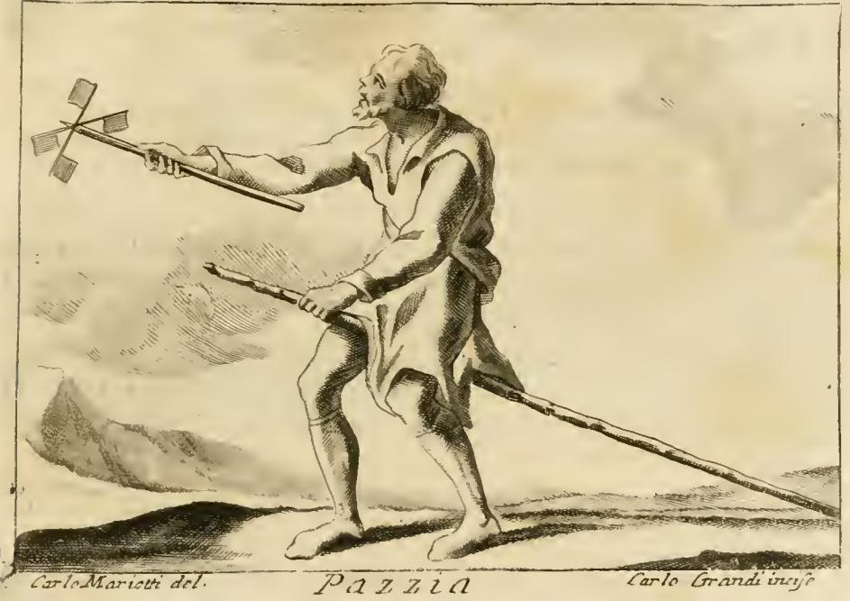

# 리파의 '광기(Pazzia)' 의인화

## 카드 요약

**Q. 리파는 '광기(Pazzia)'를 어떻게 의인화했는가?**

체사레 리파(Cesare Ripa)의 『이코놀로지아(Iconologia)』에서 광기(Pazzia)는 **검고 긴 옷을 입은 장년(età virile) 남자**로 그려진다. 그는 웃으면서(원문은 "Scari li-dente" — 이를 드러내며) **갈대 막대(canna)에 말 타듯 걸터앉아** 있고, **오른손에는 아이들이 바람에 대고 열심히 돌리며 노는 종이 바람개비(girella di carta)**를 들고 있다.

## 원본 판화

판화(카를로 마리오티 그림, 카를로 그란디 판각 — 하단에 "Carlo Mariotti del. / Carlo Grandi incise"와 표제 "Pazzia"가 새겨져 있다)에서 카드의 요소를 그대로 확인할 수 있다.

- **수염 난 장년 남자**가 긴 옷자락을 걸치고 서 있다.
- 다리 사이로 **긴 갈대 막대를 가랑이에 끼워 목마(죽마)처럼 타고** 있다 — 뒤로 길게 끌리는 막대가 뚜렷하다.
- 치켜든 손에는 **십자 날개 모양의 종이 바람개비**가 막대 끝에 달려 있다.
- 어른의 몸으로 아이들의 놀이를 흉내 내는 모습 자체가 이 도상의 핵심이다.

## 각 도상 요소의 의미

| 요소 | 의미 |
|---|---|
| 장년의 남자 | 분별이 성숙해야 할 나이 — 그 나이에 어울리지 않는 행동이라 더욱 '광기'가 된다 |
| 검고 긴 옷 | 성숙하고 품위 있는 신분의 복장 — 어린애 장난과의 대비를 극대화 |
| 갈대 막대 말타기 | 아이들의 죽마 놀이. 어른이 하면 이성의 상실을 뜻함 |
| 종이 바람개비 | 아이들의 장난감(trastullo de' fanciulli). 하찮고 무의미한 일에 몰두함 |
| 웃는 표정 | 리파는 솔로몬을 인용해 "웃음은 광기의 징표"라고 부연 — 지혜롭다 여겨지는 이들은 잘 웃지 않으며, 참된 지혜인 그리스도가 웃었다는 기록은 없다고 한다 |

## 리파의 광기 정의

리파에 따르면 광기란 **"이성적으로 그럴듯한 근거(ragione verisimile)나 신앙의 자극(stimolo di religione) 없이, 품위(decoro)를 잃고 사람들의 통상적 관습(comune uso degli Uomini)을 벗어나 행동하는 것"**이다. 즉 광기는 병리적 상태이기 이전에 **사회적 규범·분별로부터의 일탈**로 규정된다.

리파는 이어서 지혜/광기가 다수의 통념으로 측정된다는 점을 논한다. 도시에서 성숙한 남자가 가정과 공화국의 운영을 논하면 지혜라 여겨지고, 그런 일에서 벗어나 **유치하고 무의미한 놀이(giuochi puerili)에 빠지면** 당연히 광기라 불린다는 것이다. 다만 참된 덕에 어긋나는 대중(volgo)의 그릇된 통념에 속지 말라는 경고도 덧붙인다 — "어리석은 자들의 무리는 무한하기(infinita è la turba de' sciocchi)" 때문이다.

## 전거: 호라티우스

이 도상의 직접적 근거는 **호라티우스 『풍자시(Satirae)』 2권 3가**의 구절이다.

> *Aedificare casas, plostello adiungere mures,*
> *ludere par impar, equitare in arundine longa,*
> *si quem delectat barbatum, amentia verset.*
>
> 장난감 집을 짓고, 작은 수레에 생쥐를 매고,
> 홀짝 놀이를 하고, **긴 갈대에 말 타기**를
> **수염 난 어른**이 즐긴다면, 광기가 그를 사로잡은 것이다.

판화의 갈대 말타기(equitare in arundine longa)와 수염 난 장년의 모습은 이 시구를 그대로 시각화한 것이다.

## 참고: 같은 항목의 다른 표현

리파는 같은 'Pazzia' 항목에서 「테이르시스의 대관식」에 나타난 다른 의인화도 소개한다. 머리가 헝클어지고 맨발인 젊은 여인이 곰 가죽을 걸치고, 변화하는 색(cangiante)의 옷(광기의 불안정성)을 입고, **태양 옆에서 켜진 촛불을 든** 모습 — 태양의 큰 빛보다 작은 촛불로 더 잘 보려는 오만이 곧 광기의 표지라는 것이다. 또한 부록의 역사적 예화로는 사울을 피해 미친 척한 다윗(사무엘상 21장), 아테네 길거리에서 소달구지 앞을 막아선 젊은 알키비아데스, 그리고 아리오스토 『광란의 오를란도』에서 이성을 잃은 오를란도가 언급된다.
