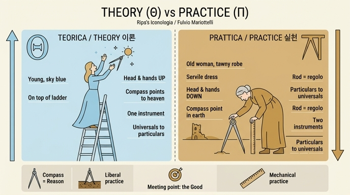

# 실천(Prattica) — 풀비오 마리오텔리

> **Q.** 마리오텔리는 '실천(Prattica)'을 어떻게 의인화했는가?

리파의 『이코놀로지아』 제4권(Tomo Quarto) 서두에 실린 **「PRATTICA」** 항목은 리파 본인이 아니라 **풀비오 마리오텔리(Fulvio Mariottelli)**가 집필했다. 이 항목의 핵심은 **하나의 도상을 단독으로 설명하지 않고, 짝이 되는 '이론(Teorica)'과 정반대로 배치해 대구(對句)로 읽게 만든다**는 점이다.

## 1. 왜 '반대로' 그리는가

마리오텔리는 먼저 개념 정의를 세운다.

- **Teorica(이론)** — 지성(intelletto)의 이치와 운동을 다루며, **관조적 정지(quiete contemplativa)**, 즉 영혼의 운동에 관계한다. 최고 원인(cause supreme)을 관조한다. → 인간 담론이라는 건축물의 **꼭대기(sommità)**.
- **Prattica(실천)** — 작용(operazioni)과 감각(senso)의 운동을 다루며, **활동적 정지**, 즉 감각의 운동에 관계한다. 무수한 결과(infiniti effetti)를 탐색한다. → 같은 건축물의 **토대(fondamento)**.

두 극단은 그럼에도 하나의 중간점에서 만나는데, 그것이 **선(善)과 참에 대한 인식**이다. 다만 이 점을 양쪽이 늘 정확히 겨냥하지는 못해서, 학자와 무학자·귀족과 평민·주인과 종·부자와 빈자·노인과 젊은이·남자와 여자 사이에 의견의 차이가 생긴다(한쪽은 현자의 격언을, 다른 쪽은 민중의 속담을 믿는다).

즉 **Prattica가 Teorica에 대립하는 개념이므로, 도상 역시 서로 대립하는 사물들로 표현된다**는 것이 마리오텔리의 작도 원리다.

## 2. 대구로 읽는 두 의인상

| 항목 | Teorica (이론) | **Prattica (실천)** |
|---|---|---|
| 나이 | 젊은 여인 | **노파(Vecchia)** |
| 옷 | 고귀하게, **하늘색(color celeste)** | **종처럼 비천하게(servilmente), 황갈색(color tanè)** |
| 머리·손 | 위로(하늘로) | **아래로(땅으로)** |
| 컴퍼스 | 끝(punte)이 하늘을 향함 | **크게 벌려 한 끝을 땅에 박음** |
| 위치·지물 | **사다리(scala) 꼭대기**에 섬 | 컴퍼스 + **자(regolo)**에 양손을 기댐 |
| 도구 수 | 하나 | **둘** |
| 이루는 글자 | (Θ) | **그리스 문자 Π** |

한 손은 크게 벌려 땅에 박은 컴퍼스 위에, 다른 손은 자(regolo) 위에 얹고, **벌어진 컴퍼스의 한 끝이 자의 정점에 직각으로 닿게** 해서 전체 실루엣이 그리스 문자 **Π** 모양을 이루도록 한다. 그리스인들이 실천을 Π로, 이론을 Θ로 표시하던 관습을 옮긴 것이다(보에티우스 『철학의 위안』에서 철학 여신의 옷 아래에 Π, 위에 Θ가 수놓이고 그 사이를 계단이 잇는 유명한 대목과 같은 계보 — Teorica가 '사다리 꼭대기'에 서는 이유도 여기에 있다).

판화에서 실제로 확인되는 요소들: 허리를 깊이 굽혀 **얼굴이 땅을 향한 노파**, 오른손은 크게 벌어진 **컴퍼스** 머리를 짚고 그 한 다리는 땅에 꽂혀 있으며, 왼손은 곧게 세운 **자(regolo)**를 짚는다. 두 도구가 세로 기둥이 되고 그 위를 손이 잇는 구성이 Π를 연상시킨다. 배경은 하늘이 아니라 **폐허와 탑이 있는 지상 풍경**이며, 옷은 장식 없는 소박한 종의 복장이다.

## 3. 각 지물의 뜻

- **아래로 향한 얼굴** — 실천은 온 우주 중에서 **발로 밟는 부분만** 바라본다. 비천한 옷 색(tanè, 황갈색)도 같은 뜻. 실천은 곧 **사용(uso)과 유익(utile)**이며, 인식 자체에 만족하는 이론과 반대다.
- **두 도구에 실린 체중** — 머리와 몸의 무게 전부를 컴퍼스와 자, 두 도구가 받치고 있다는 점이 '실천은 도구/수단에 의지한다'를 보여준다.
- **컴퍼스 = 이성(ragione)** — 이론은 끝을 위로 향해 **보편에서 개별을 결론**한다(참된 논증적 결론). 실천은 끝을 아래로 향해 **개별에서 보편을 결론**한다(주로 제2·제3격의, 긍정이든 부정이든 **오류 가능한 결론**). 하늘에 대해 땅이 개별인 것과 같다.
- **자(regolo)에 직각으로 닿은 컴퍼스 끝** — 이론은 영원하고 항상 같은 하늘의 것으로 규제되지만, 실천은 변화하고 부패하는 지상의 것에 기초하므로 **인간이 어떤 형식으로 안정시켜야** 한다. 보편적으로 받아들여져 관행이 된 그 형식을 '도량의 규준(regola delle misure)', 곧 regolo라 부른다. 마리오텔리는 여기서 **프로타고라스의 "인간은 만물의 척도"**를 끌어온다.
- **왜 도구가 둘인가** — 이론은 완전하여 **하나이고 불가분**이지만, 실천은 **자유(liberale)와 기계(mecanica)** 두 종류다.
  - 자유적 실천 = 교제와 시민적 삶에서의 사용, 그 칭찬은 도덕적 덕에서 나온다 → **땅에 고정된 컴퍼스**(정해진 비례가 없고, 사물의 양에 맞춰 벌어지는 것이 그 덕. 도덕적 덕의 한계도 관습과 오래된 좋은 관행뿐).
  - 기계적 실천 = **자(regolo)**(공적 합의로 확정된 정확한 치수. 돈과 물건의 양을 정해진 척도로 사고파는 일).
  - 나아가 두 도구는 두 정의(giustizia)도 나타낸다: **컴퍼스 = 분배적·기하학적 정의**(정해진 척도 없음), **자 = 교환적·산술적 정의**.
- **노년의 함의** — 젊음이 민첩·신속·열의·용기·장수·희망·사랑 등 모든 좋음을 뜻한다면, 노년은 그 반대로 **더딤·졸음·게으름·허약·비겁·단명·죽음·두려움·미움·의심** 등 모든 나쁨을 뜻한다. 실천이 그렇다고 여겨지는 까닭: **낡은 관행을 뒤따르고, 쉽게 속으며, 원인을 거의 보지 못하고, 많이 의심하고, 자주 걸려 넘어지며, 자기 방식과 다른 앎을 찾는 자를 가혹하게 미워한다.**

## 4. 외우기 요령

**"Θ는 위, Π는 아래"** — 젊음/하늘색/사다리 꼭대기/컴퍼스 끝을 하늘로 = 이론. **노파/황갈색 종의 옷/얼굴과 손을 땅으로/컴퍼스 한 끝을 땅에 박고 자에 기대 Π를 이룸 = 실천.** 도구 개수(1 대 2)까지 대비로 기억하면 '실천은 자유적·기계적 둘'까지 함께 따라온다.

## 인포그래픽

