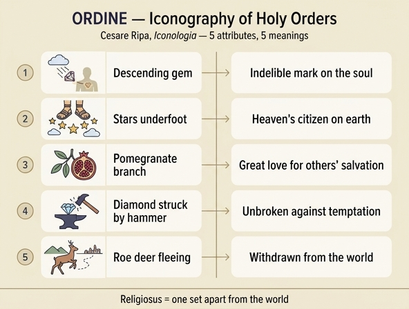

# 성품성사(ORDINE) 도상의 다섯 지물 — 보석·별·석류·다이아몬드·노루

## 0. 출전 위치

- 자산: `.fm/assets/12 Honor to Origin of Love.md`, 절 제목 **「ORDINE UNO DE' SETTE SACRAMENTI」**(성품성사, 일곱 성사 중 하나).
- 저자 표시가 리파 본인이 아니다: **`Del V. Fr. Vincenzio Ricci M. O.`** — 즉 이 항목은 18세기 페루자판 편집자들이 증보한 미노리타회(Minori Osservanti) 수사 빈첸초 리치의 기고문이다. 바로 앞 항목 「ORDINE DIRITTO, E GIUSTO」(수평추와 직각자를 든 남자)만 `Di Cesare Ripa`로 표시돼 있다. 같은 표제어 `Ordine` 아래 **세속적 '질서'** 와 **성사적 '품'** 이 나란히 놓인 구조다.
- 도상 기술 원문(요약 번역의 근거):

  > "잘생긴 남자, 흰색의 긴 옷을 입고, 머리에 관을 쓰고, 어깨 뒤에 날개를 달아 날아오르려는 자세. 그 위에서 **귀한 보석(preziosa gemma)** 이 내려오고 그는 그쪽으로 얼굴을 돌린다. **발밑에는 별 몇 개(alcune stelle)**. 한 손에 **석류 가지(un ramo di melo granato)**, 다른 손에 **다이아몬드(un adamante)**, 그리고 곁에 **노루 또는 사슴(un Caprio, o Cervo)**."

## 1. 다섯 지물 ↔ 의미 대응표

| 지물 | 원문 문구 | 지시 의미 | 리파(리치)가 붙인 전거 |
|---|---|---|---|
| 위에서 내려오는 보석 | `La gemma, che di sopra gli viene, è il carattere, che s'imprime in questo Sagramento` | 이 성사에서 찍히는 **인호(character)**. 하느님으로부터 영적으로 오며 영혼에 **지워지지 않게(indelebilmente)** 자리 잡는다 | (본문) 롬바르두스 『명제집』 4권 24구분 / (성경란) "하늘에서 내려오는 영적 선물" |
| 발밑의 별들 | `sotto li piedi ha le stelle, perchè abitando in terra fa offizio di Angiolo, ed è della conversazione del Cielo` | **땅에 살면서도 천사의 직무를 수행**하고 하늘의 시민권(대화·삶의 자리)을 지님. 동시에 땅의 것을 **짓밟아(calpestare)** 업신여김 | 필리피서 3,20 `Nostra autem conversatio in caelis est` |
| 석류 가지 | `Il ramo del melo granato è simbolo della molta carità, che deve avere per la salute altrui` | **타인의 구원을 향한 큰 사랑(carità)** | 아가 2,4 `Introduxit me in cellam vinariam, ordinavit in me charitatem` |
| 다이아몬드 | `L'adamante che non si spezza, ma resiste a martellate` | 망치질에도 깨지지 않듯, **세상 유혹에 대한 저항**과 **교회 관할권(giurisdizione ecclesiastica) 수호의 굳셈** | 호세아 11,8 `Quomodo dabo te sicut Adam(a), ponam te ut Seboim` |
| 노루/사슴 | `animali fuggitivi, e separati dalla conversazione delle genti` | 사람들의 교제에서 떨어져 사는 짐승처럼, 성직자는 **세상과 그 허영·속임수·거래·수작에서 물러나야** 한다. `non altro volendo dir Religioso, che a mundo relegatus` | 아가 8,14 `Fuge dilecte mi, et assimilare capreae hinnuloque cervorum` |

부수 지물(질문 범위 밖이지만 같은 논리): 흰 긴 옷 = 권위와 기쁨(흰색은 색 중에 고귀·완전), 관 = 사제의 지배권 및 왕적 품위와의 결합, 날개 = 하늘로 날아야 함, 위를 향한 얼굴 = "땅이 아니라 하늘을 보라". 얼굴을 위로 돌린 이유에는 `Cleros` = `Sors`(제비/몫) 어원 풀이가 붙는다 — **이 어원은 실제로 옳다**(그리스어 κλῆρος '제비·할당된 몫', 신명 18,2 및 사도행전 1,17의 성직자 용어 배경).

## 2. 각 상징의 전거 검증

### (1) 인호 — character indelebilis

리치가 인용한 페트루스 롬바르두스 『명제집』 4권 24구분은 성품(ordo)을 "영적 권능이 주어지는 표징"으로 정의하는 표준 스콜라 텍스트다. 다만 '지워지지 않는 인호'라는 표현의 **교의적 확정은 트리엔트 공의회**다.

- 제7회기(1547, 성사 일반) 세례 관련 규정: 세례·견진·성품 세 성사는 **영혼에 인호를 새기며** 따라서 반복될 수 없다.
- 제23회기(1563, 성품성사) **제4조 파문규정**: "거룩한 서품으로 성령이 주어지지 않는다고, 혹은 그 서품으로 **인호가 찍히지 않는다**고, 혹은 **한 번 사제였던 자가 다시 평신도가 될 수 있다**고 말하는 자는 파문받을 것이다."

즉 그림에서 보석이 **위에서 아래로 내려오는** 방향, 그리고 `indelebilmente`(지워지지 않게)라는 부사 선택이 정확히 이 교의를 시각화한다. 트리엔트 후 반종교개혁기 도상학이 논쟁 조항을 지물로 번역한 전형적인 예다. 보석(단단하고 변질되지 않는 광물)이 '지워지지 않음'의 담체라는 점도 다이아몬드 지물과 짝을 이룬다.

### (2) 석류 = 사랑 / 교회 일치

석류는 그리스도교 도상학에서 오래된 다의(多義) 상징이다.

- **일치(unitas)**: 하나의 껍질 안에 수많은 씨 → 한 교회 안의 다양한 신자. 니사의 그레고리우스, 대 그레고리우스 등 교부 전통에서 반복된다.
- **사랑(caritas)**: 가장 값진 속을 아낌없이 내어준다는 독법 → 성체성사의 자기 증여와 연결.
- **수난·부활**: 붉은 즙과 터지는 열매 → 그리스도의 피와 부활. 「성모자」 도상에서 아기 예수가 석류를 든 유형(보티첼리 등)이 여기 속한다.
- 성경적 지반은 아가의 정원 이미지(4,13 / 6,11 / 7,12)와 성전·대사제 의복 장식(탈출 28,33-34; 1열왕 7,18-20)이다. 대사제 옷단의 석류 장식이 있으므로 **'사제직'과 석류의 결합 자체는 성경적 근거가 튼튼하다.**

**주의할 점**: 리치가 직접 붙인 전거 아가 2,4 `ordinavit in me charitatem`("내 안에 사랑을 질서 있게 세우셨다")에는 **석류가 나오지 않는다**. 그가 이 구절을 고른 진짜 이유는 동사 `ordinavit`가 표제어 **`Ordine`** 와 어근이 같기 때문이다 — 즉 어휘 유희로 연결한 것이고, 석류→사랑의 고리는 위의 교부적 계보에서 따로 끌어온 것이다.

### (3) 다이아몬드 — adamas 어원과 '망치로도 깨지지 않는다'는 고대 통념

- **어원은 맞다**: 그리스어 ἀδάμας(adamas) = ἀ-(부정) + δαμάω(damaō, 길들이다·정복하다) → "길들일 수 없는 것, 정복되지 않는 것". 영어 adamant, 이탈리아어 adamante, 한국어 '금강(金剛)'이 모두 같은 관념이다. 그러므로 '유혹에 굴복하지 않음'이라는 도덕적 독법은 **어원에 이미 들어 있던 의미를 되받은 것**이며, 리치의 창작이 아니다.
- **물성 주장은 틀렸다**: 플리니우스 『자연사』 37권이 전하는 시험 — 다이아몬드를 모루 위에 놓고 때리면 **쇠망치 머리가 두 쪽으로 갈라지고 모루조차 튀어나간다**. 이 서술이 중세·르네상스를 거쳐 "망치질에 깨지지 않는 돌"이라는 상투구로 굳었고, 리치의 `che non si spezza, ma resiste a martellate`가 바로 그 상투구다.
- 실제로는 **경도(hardness)와 인성(toughness)은 다른 물성**이다. 다이아몬드는 긁힘 저항(모스 10)에서 최고지만 {111} 방향으로 완전한 **쪼개짐(cleavage)** 을 가진 취성 재료여서, 정과 망치로 정확히 때리면 깔끔하게 갈라진다. 다이아몬드 연마 공정 자체가 이 성질(cleaving)을 이용해왔다. 즉 도상의 근거가 되는 물리적 전제는 오류다.
- 흥미롭게도 플리니우스 본인도 일부 열등한 종류(siderites, 키프로스산)는 망치로 깨지고 다른 adamas로 뚫린다고 적었다 — 다만 그는 이를 "이름만 빌린 가짜"로 처리해서, 결과적으로 '진짜 다이아몬드는 안 깨진다'는 통념을 오히려 강화했다.
- **인용 전거의 함정**: 호세아 11,8 `quomodo dabo te sicut Adama, ponam te ut Seboim`의 `Adama`와 `Seboim`은 **소돔과 함께 멸망한 가나안 도시 이름**이며, 뜻도 문맥도 다이아몬드와 무관하다(오히려 멸망의 위협이다). `Adama` ↔ `adamante`의 소리 유사성에 기댄 **파로노마시아**로, 리치의 전거 목록에서 가장 취약한 고리다.

### (4) 사슴·노루 — 은수(隱修)의 상징

- 리치가 든 아가 8,14는 정확한 인용이다: "달아나소서 내 사랑이여, 향기로운 산 위의 노루(capreae)와 젊은 사슴(hinnulo cervorum)처럼." 여기서 그가 취한 자질은 **'도망하는(fuggitivo)' 성질**, 즉 사람에게 붙잡히지 않고 인적을 피하는 습성이다.
- 이 자질을 은수·수도 생활로 읽는 전통은 두텁다. 시편 42(41),2 "사슴이 물을 찾아 헐떡이듯"이 영혼의 하느님 갈망을 나타내는 표준 텍스트이고, 아가 2,9의 사슴/노루는 그리스도의 상징으로 읽혔다. 성 에우스타키우스·성 후베르투스의 십자가 뿔 사슴, 성 자일스(Aegidius)의 은수처를 지켜준 암사슴 등 **사슴이 인간 사회 밖의 거룩한 장소를 매개하는** 성인전 유형도 여기에 겹친다.
- 즉 사슴은 이 도상에서 '빠르다'거나 '뿔이 자란다'는 통상적 의미가 아니라 **오직 "사람들과 떨어져 산다"** 는 한 가지 자질로 축소되어 쓰인다. 도상학이 동물지(bestiary)의 여러 자질 가운데 필요한 하나만 골라 쓰는 방식의 좋은 예다.

### (5) `Religioso = a mundo relegatus` — 어원 해석의 실제 지형

원문: `non altro volendo dir Religioso, che a mundo relegatus`("'수도자/성직자'란 세상에서 추방된 자 이상의 뜻이 아니다").

이것은 라틴어 **religare(묶다)**, **relegere(다시 읽다·되새기다)** 와는 계통이 다른 **relegare(추방하다, 유배 보내다)** 에 갖다 붙인 풀이다. 실제 어원학 논의는 다음 세 갈래로 정리된다.

| 제안 | 주창 | 함의 |
|---|---|---|
| `relegere` (다시 읽다·거듭 살피다) | 키케로 『신들의 본성에 관하여』 2,72 | 신적인 것을 꼼꼼히 되새기는 **경건한 주의** |
| `religare` (묶다·결박하다) | 락탄티우스 『교의』 4,28 — "우리는 경건의 끈으로 하느님께 묶여 있다(religati)"며 키케로를 명시적으로 반박 | 하느님과 인간을 **잇는 유대**. 후대 그리스도교 표준 독법 |
| `re-eligere` (다시 선택하다) | 아우구스티누스가 한때 제안했으나 『재론고』 1,13에서 철회하고 락탄티우스 쪽으로 옮김 | 죄로 끊긴 관계를 **되돌려 선택**함 |

토마스 아퀴나스는 『신학대전』 II-II q.81 a.1에서 이 세 가지를 모두 소개하고 "어느 쪽으로 읽어도 religio는 하느님을 향한 질서(ordo ad Deum)를 뜻한다"고 정리한다. 현대 역사언어학은 대체로 relegere 계열(또는 기원 불명)로 보며, **`relegatus`는 어떤 계보에도 들어가지 않는다.**

따라서 리치의 풀이는 **어원학이 아니라 "영적 어원(spiritual etymology)"** 이다. 소리의 닮음으로 도덕적 의미를 끌어내는 이 기법은 이시도루스 『어원론』 이래 중세 수도 문헌의 표준 수사였고, 리치는 그것을 그림 설명에 쓴 것이다. 실용적으로는 매우 효과적인 기억술이므로, **"틀린 어원이지만 도상의 의도를 정확히 요약한다"** 는 이중 평가가 옳다. 주목할 것은 relegare(추방)와 religare(묶기)가 정반대 방향을 가리킨다는 점이다 — 전자는 세상에서의 **분리**, 후자는 하느님과의 **결속**. 그런데 이 도상은 두 방향을 함께 쓴다: 노루(분리) + 내려오는 보석·위를 향한 얼굴(결속). 어원상 남남인 두 낱말이 도상 안에서는 한 인물의 앞뒤 면으로 통합되어 있다.

## 3. 판화 도판에 관하여

**성품성사 인물 판화는 자산에 없다.** 이 md에서 참조되는 세 이미지는 `_page_286`=「Orazione」, `_page_291`=이 절 끝의 장식 테일피스, `_page_292`=「Origine d'Amore」뿐이며, Ordine 항목이 실린 287~290면의 도판은 추출되지 않았다. 테일피스(케루빔 두 명이 분수를 다루는 문양)는 도상 내용과 무관하므로 쓰지 않았다.

대신 **같은 절 직전 항목 「Orazione」(기도)의 판화를 대체 도판으로** 아래에 싣는다. 성품성사 인물과 판화가 공유하는 조형 문법을 확인하는 용도다: ① 얼굴을 **위로 들어 하늘을 향함**, ② 화면 위쪽에서 **빛/은총이 내려오는 사선 구성**(성품성사에서는 이 자리에 보석이 온다), ③ 긴 주름 옷의 단독 입상, ④ 지물이 손과 발밑에 분산 배치되어 각각 따로 읽히는 구조, ⑤ 발밑에 별·구름·언덕 같은 '땅과 하늘의 경계' 요소. 요컨대 "위에서 내려오는 것 + 위를 보는 얼굴 + 손에 든 지물들"이라는 틀은 이 판본 성사 연작의 공통 포맷이며, 성품성사 인물도 이 틀 안에서 상상하면 된다.

## 4. 한 줄 정리

내려오는 **보석**=지워지지 않는 인호(트리엔트 23회기 4조), 발밑 **별**=땅에 살며 천사의 직무를 하는 하늘의 시민권(필리 3,20), **석류**=타인 구원을 향한 사랑(교부적 일치·자기증여 계보), **다이아몬드**=유혹 저항과 교회 관할권 수호의 굳셈(adamas='길들지 않는', 단 '망치에 안 깨진다'는 물성은 플리니우스에서 온 오류), **노루·사슴**=세상에서 물러난 자(religiosus를 `a mundo relegatus`로 읽는 영적 어원 — 실제 어원 relegere/religare와는 무관).

## 인포그래픽

