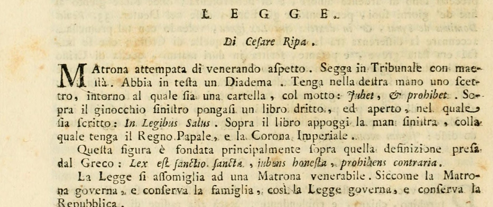

# 리파의 '법(LEGGE)' 의인상 — 재판석에 앉은 나이 든 귀부인

## 질문

리파는 일반적 '법(Legge)'을 어떤 모습으로 의인화했는가?

## 답

위엄 있는 풍모의 나이 든 귀부인(마트로나)이 재판석에 위엄 있게 앉아 머리에 왕관(디아뎀)을 쓰고, 오른손에 `Jubet, et prohibet`(명하고 금한다)라는 표어가 감긴 홀(笏)을 들었다. 왼쪽 무릎 위에 `In Legibus Salus`(법 안에 구원이 있다)라 적힌 책을 세워 펼치고, 그 위에 왼손으로 교황관과 황제관을 받치고 있다.

---

## 1. 원전 텍스트 — 『이코놀로지아』 제4권 「LEGGE / Di Cesare Ripa」

이 항목은 오를란디(Cesare Orlandi) 증보판 『이코놀로지아』 **제4권(Tomo Quarto) 12~13쪽**에 실려 있다. 표제 아래 "Di Cesare Ripa"라고 못 박혀 있으므로, 오를란디가 새로 지어낸 것이 아니라 **리파 자신의 원래 항목**이다(리파 1618년 『Nova Iconologia』 305~306쪽과 문면이 사실상 동일).

> **M**atrona attempata di venerando aspetto. Segga in Tribunale con maestà. Abbia in testa un Diadema. Tenga nella destra mano uno scettro, intorno al quale sia una cartella, col motto: *Jubet, et prohibet*. Sopra il ginocchio sinistro pongasi un libro dritto, ed aperto, nel quale sia scritto: *In Legibus Salus*. Sopra il libro appoggi la man sinistra, colla quale tenga il Regno Papale, e la Corona Imperiale.
>
> — 위엄 있는 풍모의 나이 든 마트로나. 재판석(Tribunale)에 위엄 있게 앉을 것. 머리에는 디아뎀을 쓸 것. 오른손에는 홀을 들되 그 주위에 『명하고 금한다』라는 표어가 적힌 두루마리가 감겨 있을 것. 왼쪽 무릎 위에는 책을 곧게 세워 펼쳐 놓되 그 안에 『법 안에 구원이 있다』라 적혀 있을 것. 그 책 위에 왼손을 얹고, 그 손으로 교황관과 황제관을 들 것.

사진에서 읽을 수 있는 다음 문장이 이 도상 전체의 **설계 원리**다.

> Questa figura è fondata principalmente sopra quella definizione presa dal Greco: **Lex est sanctio sancta, jubens honesta, prohibens contraria.**
> (이 상은 주로 그리스어에서 취한 저 정의 — "법은 신성한 제재(制裁)로서, 정직한 것을 명하고 그에 반하는 것을 금한다" — 에 근거한다.)

이 정의는 데모스테네스(『아리스토게이톤 반박』)의 법 정의를 로마 법학자 마르키아누스가 인용한 것으로, 『학설휘찬(Digesta)』 1.3.2에 실려 있다. 즉 **속성 하나하나가 이 한 문장의 성분을 그림으로 옮긴 것**이다.

| 정의의 성분 | 대응 속성 |
|---|---|
| `sanctio` (제재·규정) | 재판석 + 책(성문법) |
| `sancta` (신성한) | 머리의 디아뎀 |
| `jubens honesta, prohibens contraria` | 홀에 감긴 `Jubet, et prohibet` 두루마리 |

## 2. 왜 '젊은 여인'이 아니라 '나이 든 마트로나'인가

리파는 두 가지 이유를 나란히 든다.

**(1) 가정 : 국가의 유비.** 이것이 가장 핵심적인 근거다.

> La Legge si assomiglia ad una Matrona venerabile. Siccome la Matrona governa, e conserva la famiglia, così la Legge governa, e conserva la Repubblica.
> (법은 존경할 만한 마트로나에 비유된다. 마트로나가 가정을 **통치하고 보존하듯이**, 법도 국가를 통치하고 보존한다.)

여기서 '마트로나'는 단순히 나이 든 여자가 아니라 로마적 의미의 **가정을 실제로 관장하는 안주인**이다. 소녀나 처녀는 아직 다스릴 가정이 없고, 노파는 다스림에서 물러난 자다. 통치권을 현재 행사하는 성숙한 기혼 여성이라는 이 사회적 지위가 곧 법의 지위 — 즉 국가(Repubblica)를 다스리고 지켜내는 현역의 권위 — 와 겹친다. `governare`(통치)와 `conservare`(보존)라는 두 동사쌍이 가정과 국가 양쪽에 그대로 반복되는 것이 이 유비의 뼈대다.

**(2) 법의 태고성(attempata = 연로함).** 법은 가장 오래된 것이기 때문이다.

> E' Matrona, attempata, per essere la Legge antichissima, fatta nel bel principio del Mondo a' primi nostri Parenti...

리파가 열거하는 법의 계보는 다음과 같다.

- **세상의 맨 처음**, 창조된 직후의 최초 부모에게 하느님이 사과를 먹지 말라 금하신 것 (즉 최초의 법은 곧 금지 명령 — `prohibet`의 원형)
- 이어 하느님이 주신 **모세의 법**
- 그의 사랑하는 아들, 참된 신이자 참된 인간이 구술한 **복음의 법**
- 세속 쪽으로는 크레타인에게 법을 준 **미노스**, 아테네인의 **드라콘과 솔론**, 라케다이몬인의 **리쿠르고스**, 로마인의 **누마 폼필리우스**, 그리고 잘 정비된 아테네 공화국에서 가져온 로마 공화국의 **12표법**

즉 '연로함'은 노쇠가 아니라 **권위의 연원(年源)**이다. 이 대목은 같은 책의 형제 항목들과 대조하면 더 선명하다. 「Legge Nuova(새 법)」는 "Giovane si dipinge, a differenza della Legge vecchia" — 즉 구법과 구별하기 위해 **젊게** 그린다. 젊음/늙음이 리파에게는 신·구약의 시간적 대비를 위한 표지이지만, 일반적 '법'에서는 그 대비를 넘어선 **초시간적 태고성**을 나타내는 표지로 다시 쓰인다.

## 3. 속성별 독해

### 재판석(Tribunale)에 앉음 — 법의 실제 작동 장소

> Siede in Tribunale, perchè nelli Tribunali sedendo, secondo le Leggi da' dotti Leggisti giudicarsi deve.
> (재판석에 앉는 것은, 재판석에 앉아 있을 때 **법에 따라** 학식 있는 법률가들에 의해 판결이 내려져야 하기 때문이다.)

법은 추상적 원리로 떠 있는 것이 아니라 **법정에서 법률가의 판단을 통해 집행될 때** 비로소 법이 된다. 그래서 앉은 자세이면서 동시에 '위엄 있게(con maestà)' 앉은, 즉 **주권적 좌상(座像)**이다.

### 머리의 디아뎀 — 법의 신성함

`sanctio sancta`의 `sancta`에 해당한다.

> Ha il diadema in testa, per esser ella Santa determinazione...
> (머리에 디아뎀을 쓴 것은, 그것이 **거룩한 규정**이기 때문이다.)

이유: 법은 선을 행하고 악을 피하게 하는 원인이므로 마땅히 '거룩하다'고 부를 수 있다. 리파는 두 권위를 든다.

- **데모스테네스**: 법은 하느님의 발명이자 선물이며, 모든 사람이 그에 복종하는 것이 마땅하다 — *Lex est cui homines obtemperare convenit... quod Lex omnis inventum quidem, ac Dei munus est.*
- **키케로**("로마의 웅변가"): 법률을 *sanctiones sacratae, sacratae Leges*(신성한 제재, 신성한 법률)라 불렀다. 거룩하고 신성하므로 **응당한 벌 없이는 침범될 수 없다**.

디아뎀은 관(冠)이지만 왕관이라기보다 **신성함의 표지**임에 주의. 정치적 왕권은 아래 두 관(교황관·황제관)이 따로 담당한다.

### 오른손의 홀 + `Jubet, et prohibet` — 법의 이중 기능

> Tiene lo scettro nella destra, perchè comanda cose giuste ed oneste, e proibisce le contrarie, come Regina di tutte le Genti...
> (오른손에 홀을 든 것은, 정의롭고 정직한 것을 **명하고** 그에 반하는 것을 **금하기** 때문이다. 만민의 여왕으로서.)

이것이 고전적 법 정의의 두 축 — `jubens honesta`(정직한 것을 명함) / `prohibens contraria`(반대되는 것을 금함) — 을 그대로 홀에 감은 두루마리 표어로 압축한 것이다. 명령(작위 규범)과 금지(부작위 규범), 이 둘로 법의 작용이 남김없이 나뉜다.

홀이 **오른손**에 있는 이유도 유의미하다. 리파는 법을 "만민의 여왕(Regina di tutte le Genti)"이라 부르며, 심지어 **왕들조차** 자기 지배의 홀 아래에서 법을 공경하고 자기 백성 모두가 법을 준수하게 만든다고 한다. 즉 홀 대(對) 홀의 관계에서 법의 홀이 상위에 있다.

### 왼쪽 무릎 위의 펼친 책 + `In Legibus Salus` — 성문법

> Il libro denota la Legge scritta, la quale trasgredire non si deve, essendo in essa posta la salute delle Città.
> (책은 **성문법**을 뜻하며, 이는 위반해서는 안 된다. 도시들의 구원이 그 안에 놓여 있기 때문이다.)

- 책의 표어 `In Legibus Salus`는 리파가 아리스토텔레스("철학자들의 으뜸")에게 돌린 문장 **`In Legibus posita est Civitatis salus`**(도시의 구원은 법 안에 놓여 있다)를 줄인 것이다.
- 반대 가정(reductio): 만약 고삐 풀린 방종을 묶어 두는 법이 없다면 세계는 완전히 해체되어 속임수·불의·부정·폭행과 천 가지 악행으로 가득 차고, 그로써 보편적 평온이 교란되며 모든 도시의 안녕이 멸망할 것이다. 그래서 같은 철학자가 『국가』 제3권에서 "법이 도시를 통치하는 것이 바람직하다(*Legem praeesse Civitati est optabile*)"고 했다.
- 자세도 의미를 담는다. 책은 **곧게 세워(dritto) 펼쳐(aperto)** 있다 — 감춰지지 않고 만인에게 읽히도록 공표된 법, 즉 성문성·공개성이다. 그리고 **무릎 위**에 있다는 것은 그것이 이 인물의 신체에 얹힌, 그 자신이 떠받치는 것임을 뜻한다.

### 책 위의 교황관과 황제관 — 두 개의 법(utrumque ius)

이것이 이 도상의 마지막이자 가장 제도사적인 층이다.

> Il Regno Papale, e la Corona Imperiale tenuti dalla mano sinistra sopra il libro, sono simbolo dell'una e dell'altra Legge, **Canonica, e Civile, Pontificia, e Cesarea**, nelle quali si comprende la scienza della Legge Divina, e Umana.
> (왼손으로 책 위에 든 교황관과 황제관은 두 법 — **교회법과 시민법**, 교황법과 황제법 — 의 상징이며, 그 안에 신법과 인간법의 학(學)이 포괄된다.)

- **Regno Papale** = 교황의 삼중관(triregno/티아라) → **교회법(Legge Canonica)**, 교황이 입법자인 법
- **Corona Imperiale** = 신성로마황제의 관 → **시민법(Legge Civile)**, 황제가 입법자인 로마법
- 두 관이 **책 위에** 놓이고 그 위를 왼손이 받친다는 배치가 곧 논지다. 두 법체계는 성문법이라는 하나의 토대 위에 서 있고, 그 둘을 합해야 "신법과 인간법의 학"이 다 갖춰진다. 이것이 중세~근세 법학의 `utrumque ius`(양법) 관념이며, 학위명 *doctor utriusque iuris*(양법박사, J.U.D.)의 그 '양법'이다.

이 두 관은 같은 책의 **바로 뒤따르는 항목들을 예고하는 색인**이기도 하다.

- 「Legge Civile」: 저울과 검을 든 여인 — 저울 한쪽에 릭토르의 속간(fasces), 다른 쪽에 왕관, 왼손의 펼친 책 위에 **황제관**, 그 책에 유스티니아누스 『법학제요』 서문 *Imperatoriam majestatem non solum armis decoratam, sed etiam legibus armatam esse oportet*(황제의 위엄은 무기로 장식될 뿐 아니라 법으로 무장되어야 한다)가 적혀 있다.
- 「Legge Canonica」(바티칸 도서관 벽화에 그려진 대로): 앉은 여인, 오른손 저울의 한쪽엔 빛나는 금관, 다른 쪽엔 빛나는 성작(聖爵), 왼손의 펼친 책 위에 **주교의 미트라**, 머리 오른편에 성령의 비둘기.

즉 일반적 '법'의 왼손이 든 두 관은, 각각 시민법 상과 교회법 상에서 다시 한 번 '펼친 책 위에 놓인 관'으로 반복된다.

## 4. 형제 항목들과의 대조표

『이코놀로지아』 제4권의 이 대목에는 'Legge' 계열 항목이 줄줄이 이어진다. 일반적 'LEGGE'는 그 **총괄 항목**이며, 나머지는 신학적·역사적·제도적 하위 구분이다.

| 항목 | 인물 유형 | 핵심 지물·표어 |
|---|---|---|
| **Legge (일반)** | 나이 든 마트로나, 재판석에 좌정 | 디아뎀 / 홀 + `Jubet, et prohibet` / 펼친 책 `In Legibus Salus` / 교황관 + 황제관 |
| Legge Naturale (자연법) | 아주 아름다운 젊은 여인, 반나체, 정원에 앉음 | 어린양 가죽, 컴퍼스로 평행선 작도 + `AEQUA LANCE`, 자기 자신의 그림자 |
| Legge Nuova (새 법) | 지극히 아름다운 **젊은** 여인, 광선 관 | 흰 아마포, 십자가에 기댐, 물 붓는 잔, `EVANGELIUM` 책, 날개 달린 돌 + `ONUS LEVE` |
| Legge Vecchia (옛 법) | **노파**, 유대식 의복(청색) | 시나이산 아래, 십계명 판, 철장(iron rod), 납덩이 + `PONDUS GRAVE` |
| Legge della Grazia (은총의 법) | 앉아서 축복하는 여인 | 성령의 비둘기, 물 솟는 큰 항아리, 사복음사가 동물 얹힌 풍요의 뿔, `In principio erat Verbum` |
| Legge del Timore (두려움의 법) | 얼굴을 든 여인 | 오른손에 고대 법의 판, 왼손에 회전하는 검 |
| Legge Civile (시민법) | 앉은 여인 | 저울(속간 vs 왕관), 검, 펼친 책 + **황제관** |
| Legge Canonica (교회법) | 앉은 여인 | 저울(금관 vs 성작), 펼친 책 + **주교 미트라**, 성령의 비둘기 |

**주목할 점**: 무게의 은유가 옛 법(납덩이 `PONDUS GRAVE`)과 새 법(날개 돌 `ONUS LEVE`)을 가르고, 젊음/늙음이 새 법/옛 법을 가른다. 그러나 일반적 '법'은 이 신학적 대비축을 벗어나 **주권·통치의 축**(재판석·디아뎀·홀·두 관)에 놓인다. 이것이 이 항목의 성격을 기억하는 가장 빠른 길이다.

## 5. 도판에 관하여 — 이 항목에는 판화가 없다

**중요**: 리파/오를란디 『이코놀로지아』에서 이 일반적 'LEGGE' 항목은 **판화 없이 텍스트만 실려 있다**. 위의 fig-1은 이 항목의 도상 지시문 자체를 보여 주는 **원서 지면 스캔**이지, 인물 판화가 아니다.

- 자료 출처(provenance): fig-1은 **웹 출처**다 — Internet Archive 소장 오를란디판 제4권 스캔(item `iconologiadelcav04ripa`, leaf 20 = 인쇄 12쪽)에서 해당 단락을 잘라낸 것이다. 이 프로젝트의 asset 폴더에는 이 지면 이미지가 없다(marker 추출본은 텍스트만 포함).
- 판화가 없다는 사실은 두 판본에서 각각 확인했다. (a) 오를란디 증보판 제4권 12~13쪽 전체가 본문 조판이고, (b) 리파 1618년 『Nova Iconologia』 305~306쪽에서도 LEGGE 항목은 목판화가 없다(305쪽의 목판화는 바로 위 항목 「Lealtà」의 것이다).
- asset 폴더에서 이 'Legge' 대목에 딸린 유일한 인물 판화는 **자연법(Legge Naturale)** 도판이다. 카드의 대상은 아니지만, 위 4절의 대조를 눈으로 확인하는 데 유용하므로 함께 싣는다.

이 판화(카를로 마리오티 도안, 카를로 그란디 각)에서 실제로 관찰되는 것: **젊고 아름다운 반나체 여인**이 정돈된 정원(화단 경계와 나무가 보인다)에 앉아, 오른손에 든 **컴퍼스**로 지면에 평행선을 그으며 그 옆에 `AEQUA LANCE`(같은 저울로)가 적혀 있고, 왼손을 뻗어 자기 그림자를 가리킨다. 하체를 덮은 것이 어린양 가죽이다. — 일반적 '법'의 도상과 정반대로, 여기엔 **재판석도, 디아뎀도, 홀도, 두 관도 없다**. 자연법은 제도가 아니라 각자에게 새겨진 척도이므로 왕권 표지 대신 측량 도구와 그림자(이웃을 '또 하나의 나'로 만드는 상호성)를 든다. 이 대비를 기억하면, 재판석·디아뎀·홀·교황관·황제관이라는 다섯 개의 **주권 표지 묶음**은 오직 일반적 'LEGGE'에만 붙는다는 점이 선명해진다.

## 6. 암기 얼개

**"머리 - 오른손 - 왼쪽 무릎 - 왼손"의 4단 수직 독해**로 잡으면 빠짐이 없다.

1. **머리**의 디아뎀 → 법은 `sancta`(거룩함), 신의 선물 (데모스테네스·키케로)
2. **오른손**의 홀 + 두루마리 → 법은 `jubet et prohibet`(명령과 금지), 만민의 여왕
3. **왼쪽 무릎**의 세워 펼친 책 → 성문법, `In Legibus Salus`(도시의 구원)
4. **왼손**이 책 위에 받친 교황관 + 황제관 → 교회법 + 시민법 = 양법(utrumque ius), 신법과 인간법의 학
5. 그리고 이 모든 것을 **앉히는 자리**: 재판석(Tribunale) — 법은 법정에서 법률가에 의해 집행됨
6. 이 모든 것을 **입은 인물**: 나이 든 마트로나 — 가정을 다스리고 지키듯 국가를 다스리고 지킴 + 법의 태고성

간단한 대응 규칙: **오른손 = 능동적 명령(imperative)**, **왼손 = 축적된 성문 지식과 두 제도(indicative)**. 위(디아뎀)는 신성한 정당성, 아래(재판석)는 현실의 집행.
