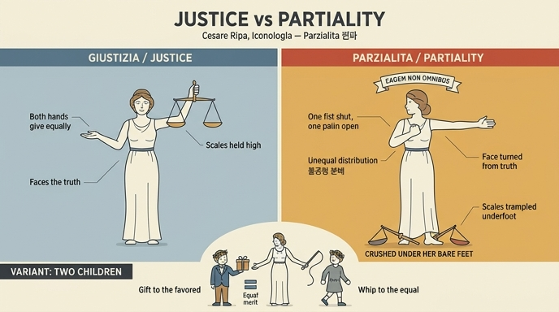

# 편파(Parzialità) 도상 읽기

> **Q.** 편파 도상의 각 요소는 무엇을 뜻하는가?

체사레 리파 『이코놀로지아』의 **PARZIALITÀ**(편파, 편들기 / 라틴어로는 *acceptio personarum*, 영어 Partiality) 항목이다. 원문은 asset의 `14 Idleness to Patience.md` 407~421행에 있다(Parsimonia 항목 뒤, Passione di Amore 항목 앞).

## 1. 리파가 지시한 이미지 전체

원문 지시문(요약 번역):

> **추한 여인**. 오른손은 **꽉 움켜쥐고** 팔은 가슴 쪽으로 약간 당기며, 왼팔은 뻗어 **손을 펴고** 있다. 머리 장식으로는 두루마리(cartella)에 **EADEM NON OMNIBUS**(같은 것을 모두에게 주지는 않는다)라는 모토를 달았다. 얼굴은 돌려 **왼쪽을 바라본다**. 발밑에는 **저울 한 쌍**을 둔다.

즉 요소는 다섯 개다: ① 추한 얼굴 ② 쥔 오른손 ③ 편 왼손 ④ 왼쪽으로 돌린 얼굴 ⑤ 발밑의 저울. 여기에 ⑥ 모토 두루마리와 ⑦ 두 아이 변형이 붙는다.

## 2. 요소별 의미

### ① 추한 여인 (Donna brutta)
편파 안에는 여러 악덕이 함께 들어 있으므로 추하게 그린다. 리파는 오리게네스(시편 37편 강해 1)를 인용해 "얼굴의 추함은 무질서하게 범한 죄의 형상"이라 하고, 편파는 **불의(ingiustizia)의 지극히 무거운 죄**이므로 누구에게나 가장 추하고 혐오스러워야 마땅하다고 한다. 키케로 『투스쿨룸 논쟁』 2권: *Nihil est malum nisi quod turpe aut vitiosum est*(추하거나 악덕인 것 말고는 악이 아니다).

### ② + ③ 쥔 손과 편 손 — **핵심**
> "오른손을 쥐어 가슴으로 당기고 왼손을 펴서 뻗은 것은, 편파가 **정의처럼 두 손으로(con ambe le mani)** 각자에게 마땅한 만큼을 최고의 완전함으로 주지 않고, **이해관계(interesse)** 나 그 밖의 삐뚤어진 원인에 이끌려 정의롭고 합당한 것을 돌아보지 않은 채 **불의하게 분배함**을 뜻한다."

포인트는 "한 손은 닫고 한 손은 열었다"는 **비대칭** 자체다. 정의(Giustizia)는 좌우가 균형을 이루지만, 편파는 어떤 이에게는 닫히고 어떤 이에게는 열린다. 그래서 모토가 *EADEM NON OMNIBUS* — "모두에게 같은 것을 주지 않는다"다.

리파는 인노첸티우스 3세 『인간 조건의 유익에 관하여』 2권을 인용한다: *Vos non attenditis merita causarum, sed personarum; non jura, sed munera; non quod ratio dictet, sed quod voluntas affectet; non quod sentiat, sed quod mens cupiat; non quod liceat, sed quod libeat.* — "너희는 사안의 공로를 보지 않고 **사람**을 보며, 법이 아니라 **뇌물**을, 이성이 지시하는 것이 아니라 의지가 탐하는 것을, 느끼는 것이 아니라 마음이 욕망하는 것을, 허용된 것이 아니라 **하고 싶은 것**을 본다."

토마스 아퀴나스의 정의(『신학대전』 II-II, 사람 차별에 관한 문항)도 함께 인용된다: *acceptio personarum est inaequalitas justitiae distributivae, inquantum aliquid attribuitur alicui praeter proportionem* — "사람을 차별함이란 **분배 정의의 불균등**이며, 비례를 벗어나 누군가에게 무엇을 주는 것이다."

### ④ 왼쪽으로 돌린 얼굴
> "얼굴을 왼쪽으로 돌린 것은, 편파적인 자가 **마음이 바르지 못하고**(non ha l'animo retto) 정신을 **진리로 향하게 하지 않으며**, 한쪽을 다른 쪽보다 더 편들어 선을 행하는 일의 적이 됨을 보여준다."

정면(진리)을 보지 않고 시선을 한쪽으로 비끄러뜨렸다는 점이 요지다. 아리스토텔레스 『수사학』 1권: *Amor et odium et proprium commodum saepe faciunt judicem non cognoscere verum* — "사랑과 미움과 **자기 이익**이 종종 재판관으로 하여금 진리를 알지 못하게 한다." (전통 도상학에서 왼쪽/sinistra은 그 자체로 불길함·부정을 함축한다.)

### ⑤ 발밑의 저울
> "발밑의 저울은 이 역병 같은 것의 삐뚤어진 본성을 더욱 잘 드러낸다. 늘 정의에 반하므로 **경멸로써 올바른 정의를 짓밟으려(conculcare) 하기** 때문이다."

정의의 여신이 **손에 들고 있는** 저울을, 편파는 **발로 밟는다**. 같은 지물의 위치만 바꾸어 미덕/악덕을 뒤집는 리파식 어법이다. 발로 밟는다는 것은 단순한 무시가 아니라 *dispregio*(경멸)의 표현이다.

## 3. 변형(variant) — 두 아이

리파는 "이 도상을 달리 만들려면"이라며 대안을 덧붙인다. 저울을 계속 발밑에 두면서,

- **왼손**으로는 아주 아름다운 용모의, **고귀하게 차려입고 월계관을 쓴 아이**에게 선물을 건네고,
- **오른손**으로는 그와 **똑같이 월계관을 쓴 또 다른 아이**를 **채찍(sferza)으로 쫓아낸다.**

두 아이가 **똑같이 월계관을 쓰고 있다**는 점이 결정적이다. 월계관은 공로(merito)의 표지이므로 두 아이의 자격은 동등하다. 그런데도 한쪽은 상을 받고 한쪽은 채찍을 맞는다 — 이것이 "이 사악하고 흉악한 편파의 악한 성향과 삐뚤어진 행위"다. 앞서의 쥔 손/편 손이 여기서 **선물 주는 손 / 채찍 든 손**으로 구체화된 셈이다.

## 4. 파르마 판(Edizione di Parma) 주석

역자 주 (a)에 따르면 파르마 판 판화에서는 편파가 이렇게 표현된다.

- 발로 저울을 짓밟는 여인
- **부유하게 차려입은 정령(Genio)**에게 상을 준다. 그의 **무지**는 머리에 난 **당나귀 귀**로 표시된다.
- 채찍질로 **벌거벗은 다른 정령**을 쫓아낸다. 그의 **공로**는 머리에 쓴 **올리브(월계) 관**으로 표시된다.

리파 본문의 "월계관 쓴 두 아이"가 파르마 판에서는 "당나귀 귀 + 화려한 옷" 대 "알몸 + 관"으로 더 노골적으로 대조된 것이다. 즉 **겉치레와 부(富)는 보상받고, 벌거벗은 진짜 실력은 매를 맞는다.**

말미의 "De' Fatti, vedi Ingiustizia"는 관련 역사적 사례는 **'불의(Ingiustizia)'** 항목을 보라는 상호참조다.

## 5. 암기용 대조표

| | 정의 Giustizia | 편파 Parzialità |
|---|---|---|
| 손 | 두 손으로 균등하게 준다 | 한 손은 쥐고 한 손은 편다 |
| 얼굴 | 진리를 정면으로 본다 | 왼쪽으로 돌려 진리를 외면 |
| 저울 | **손에 들고 있다** | **발밑에 짓밟는다** |
| 외모 | 아름답다 | 추하다 (죄의 형상) |
| 대상 | 공로에 비례 | 사람·뇌물·기분에 따라 |
| 변형 | — | 월계관 쓴 두 아이 중 하나에게 선물, 하나에게 채찍 |

> **한 줄 요약**: 손의 비대칭(불공평한 분배) + 돌린 얼굴(진리 외면) + 발밑 저울(정의 경멸) = 편파. 변형은 자격이 같은 두 아이를 선물과 채찍으로 갈라놓는 장면.

## 참고: 원본 판화

asset에 추출된 149개 판화 중 **Parzialità 판화는 포함되어 있지 않다**(pages 346–348 이미지 미추출). 이 항목 앞뒤의 판화는 `_page_345_Picture_3.jpeg`(Parsimonia, 가위와 돈주머니)와 `_page_349_Picture_3.jpeg`(Pazienza, 멍에를 지고 가시를 밟고 앉은 여인)이며, 편파와는 무관하므로 여기에 싣지 않았다. 대신 아래 인포그래픽으로 도상 요소를 재구성했다.

## 인포그래픽

