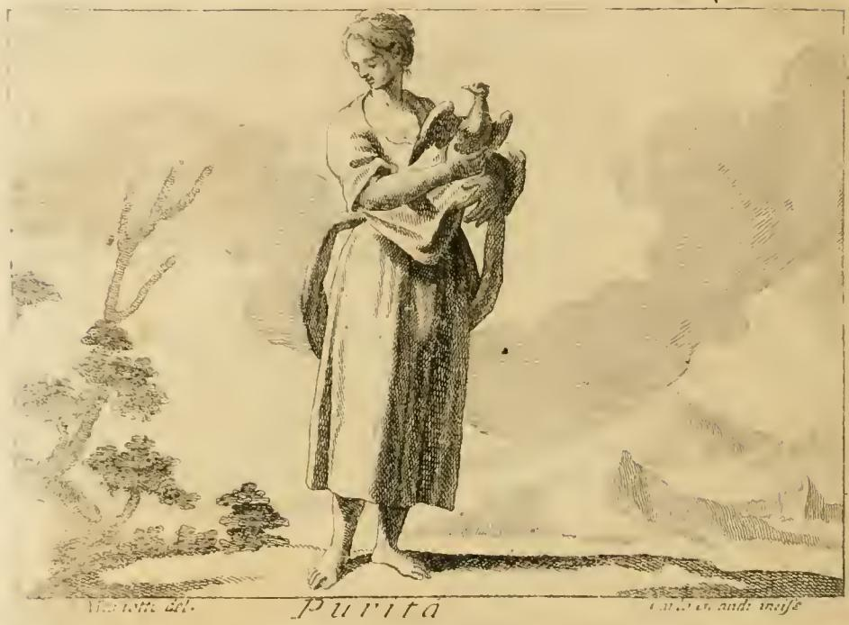

# 영혼의 순수와 진실 (Purità e Sincerità di Animo)

체사레 리파 『이코놀로기아』(Iconologia) 제4권, 「PURITÀ', E SINCERITÀ' DI ANIMO」 항목 — 리파 본인이 직접 창안한 도상("Di Cesare Ripa")이다.

원문 위치: `.fm/assets/18 Prudence to Quiet.md` 223~247행.

---

## 1. 원문 정의 (Descrizione)

> **DOnna vestita di bianco**, per la ragione detta in altri luoghi. **Tenga con bella grazia un giglio bianco nella mano sinistra. Abbia nel petto il Sole. Colla destra getti del grano in terra, dove sia un Gallo bianco, in atto di beccarlo.**

번역: **흰옷을 입은 여인.** (그 이유는 다른 항목에서 이미 말했다.) **왼손에는 흰 백합 한 송이를 우아하게(con bella grazia) 들고, 가슴에는 태양을 지니며, 오른손으로는 땅에 곡식을 뿌리는데 그곳에는 흰 수탉이 그것을 쪼고 있다.**

지물 네 가지가 곧 정답의 골자다. 좌/우손의 배분(왼손 = 백합, 오른손 = 파종)까지 원문에 명시되어 있다는 점을 기억할 것.

---

## 2. 지물별 원문 근거

### (1) 흰옷 (vestimento bianco)

리파는 설명을 반복하지 않고 **「푸디치치아(Pudicizia, 정결)」 첫 번째 도상으로 넘긴다**:

> Del vestimento e giglio bianco se ne è detto nella prima figura della **Pudicizia**, che deriva da purità, e sincerità di animo.

그 「푸디치치아」 첫 도상(같은 파일 97행)은 "흰옷을 입은 소녀, 허리까지 얼굴을 덮는 흰 베일, 오른손에 흰 백합, 오른발 아래 거북"이며, 흰색의 이유를 이렇게 댄다:

> Vestesi di bianco, perché sotto di tal colore si figura la **purità, ed integrità della vita**, dalla quale deriva la Pudicizia.

즉 리파의 체계에서 **순수(purità) → 정결(pudicizia)** 방향의 파생 관계가 명시된다. 정결은 영혼의 순수에서 나오는 것이므로, 두 항목이 흰옷·흰 백합이라는 지물을 공유한다.

### (2) 전도서 9장 — "네 옷을 항상 희게 하라"

리파의 인용(불가타):

> Non è però da tralasciare qui il precetto, che si contiene nel **nono dell'Ecclesiaste**: *Omni tempore sint vestimenta tua candida.*

- **불가타 전도서(Ecclesiastes) 9:8 전문**: *"omni tempore sint vestimenta tua candida, et oleum de capite tuo non deficiat."*
  ("항상 네 옷을 희게 하고, 네 머리에 기름이 마르지 않게 하라.")
- 리파는 앞 절반만 잘라 인용한다. 「푸디치치아」 항목에서는 어순을 바꾼 형태 *"In omni tempore candida sint vestimenta tua"*로, 그리고 저자를 **솔로몬(Salomone)**으로 지목해 인용한다 — 전도서를 솔로몬의 저작으로 보던 전통적 귀속이다.
- 리파가 붙인 명칭은 "Ecclesiaste"(전도서, Qoheleth)이며 「집회서」(Ecclesiasticus)가 아니다. 혼동 주의.

### (3) 피타고라스 — 흰색은 선의 본성, 검은색은 악의 본성

리파의 문장:

> Il moral **Pitagora** disse, che si deve sacrificare a Dio con lodi, e col vestimento bianco, attesocché **il color candido appartiene alla natura del bene, il negro alla natura del male.**

이 문구의 전거는 **디오게네스 라에르티오스 『유명한 철학자들의 생애』 8권 34절**(피타고라스 장)이다. 흰 수탉을 먹지 말라는 계율을 설명하는 대목에서, "흰색은 선의 본성에 속하고 검은색은 악의 본성에 속한다"는 문장이 그대로 나온다. 즉 리파는 **흰옷 계율 + 흑백 대비 + 흰 수탉 금기**를 한 출처에서 동시에 끌어온 것이며, 이것이 이 도상에서 흰옷과 흰 수탉이 함께 등장하는 이유다.

배경이 되는 더 근원적인 전거:

- **아리스토텔레스 『형이상학』 A(1권) 5장, 986a22 이하**: 피타고라스학파의 **십대 대립표(συστοιχία, table of opposites)**. 한정/무한정, 홀/짝, 하나/다수, 우/좌, 남/여, 정지/운동, 직선/곡선, **빛/어둠(φῶς/σκότος)**, **선/악(ἀγαθόν/κακόν)**, 정사각형/직사각형. 좌열이 긍정, 우열이 부정 항으로 배열된다. 빛-선, 어둠-악이 같은 열에 놓이므로 백-흑의 도덕적 대비가 여기서 구조적으로 정당화된다.
- 피타고라스학파의 **흰 아마포 착용 관습**(제사·의례 시 흰옷)은 디오게네스 라에르티오스·이암블리코스 계열 전승에 나오며, 이집트 사제의 흰 리넨 관습과 연결된다.

### (4) 가슴의 태양 (il Sole nel mezzo del petto)

> perché siccome il Sole colla sua presenza illustra il mondo, così la purità illustra il **microcosmo, picciol mondo dell'Uomo**; e siccome per la sua partita sopraggiunge l'oscura notte, così partita la purità dal microcosmo nasce **tenebrosa notte di errori**, che offusca l'anima, e la mente.

**대우주-소우주(macrocosmo–microcosmo) 유비**다. 태양이 세계를 비추듯 순수는 "인간이라는 작은 세계"를 비추고, 태양이 떠나면 어두운 밤이 오듯 순수가 떠나면 **오류의 캄캄한 밤**이 영혼과 정신을 뒤덮는다. 가슴(petto) 한복판이라는 위치 지정이 중요한데, 심장 = 영혼의 자리이므로 "영혼의 순수"라는 표제와 정확히 맞물린다.

### (5) 흰 수탉과 곡식 뿌리기 (Gallo bianco / getti del grano)

수탉 상징의 근거가 이 항목에서 가장 길게 서술된다.

- **피에리오 발레리아노(Pierio Valeriano) 『히에로글리피카』 24권**: 고대인에게 수탉은 "영혼의 순수와 진실(la purità, e sincerità dell'animo)"을 뜻했다.
- **피타고라스의 명령**: "onde Pitagora comandò a' suoi Scuolari, che dovessero **nutrire il Gallo**; cioè la purità, e sincerità degli animi loro." — 제자들에게 "수탉을 기르라"고 했으니, 곧 자기 영혼의 순수와 진실을 기르라는 뜻이다. **여인이 곡식을 뿌려 수탉에게 먹이는 동작이 바로 이 "수탉을 기르라"는 계율의 형상화**다. 단순한 배경 소품이 아니라 계율의 번역이라는 점이 이 도상의 핵심 장치다.
- **소크라테스의 유언**: "Socrate appresso Platone, quando era per morire lasciò nel suo testamento un Gallo ad Esculapio" — 플라톤 『파이돈』 118a의 마지막 대사("아스클레피오스에게 닭 한 마리를 빚졌다")를 리파는 *모든 악을 치유하는 신의 선하심에 자기 영혼을 처음처럼 순수하고 진실하게 되돌려 드리는* 행위로 읽는다.
- **줄리오 카밀로(Giulio Camillo)**, 프랑스 왕세자(Delfino di Francia) 추도 칸초네 결구 인용: *"Ma a te, Esculapio, adorno / Ei sacro pria l'augel nuncio del giorno."* ("낮을 알리는 새를 먼저 그가 아스클레피오스께 바쳤다.")
- **흰 수탉을 삼가라는 계율**: "Fu parimente consiglio di Pitagora doversi astenere dal **Gallo bianco**, intendendo misticamente, che si avesse riguardo alla purità dell'animo." — 신비적 의미로 영혼의 순수를 존중하라는 뜻. (디오게네스 라에르티오스 8권 34절 원문에서는 흰 수탉이 '달(月)에게 신성하고 탄원자의 옷을 입었기 때문'이라 설명된다.)
- **가문 엠블럼**: 이 도상은 옛 데 갈리(de Galli) 가문인 **카스텔리니(Castellini) 가문의 엠블럼**이었고, 아래 4행시(tetrastico)가 붙었다 — *"Quod Gallum nutrias, animum quod scilicet ornes / Dotibus aetheriis... sic monet, & videt / Sic jubet ipse Deus."* (수탉을 기른다는 것은 곧 천상의 자질로 영혼을 꾸미는 것 — 신 자신이 그렇게 명하신다.) 가문명 Galli(=수탉)와의 언어유희다.
- **성 암브로시우스**: "Il Gallo specialmente bianco spaventa, e mette in fuga il **Leone**, come scrive Santo Ambrogio; così la candida purità doma l'impeto dell'animo turbolento, e la sfrenata lascivia di Amore, significata colla parte anteriore del Leone nelli Geroglifici di Pierio Valeriano." — 흰 수탉이 사자를 쫓아내듯 순백의 순수가 격동하는 영혼과 사랑의 방종을 길들인다. (피에리오에서 사자의 앞부분 = 무절제한 정욕.)

말미의 교차 참조: **"De' Fatti, vedi Castità, Sincerità etc."** (관련 실례는 「순결」·「진실」 항목 참조.)

---

## 3. 판화

원본: `.fm/assets/Iconologia (Cesare Ripa)/_page_445_Picture_3.jpeg` (본문 227행, 항목 표제 직후에 삽입). 하단 캡션은 **"Purità"**, 좌측 하단에 소묘자, 우측 하단에 판각자 서명이 있다.

**그림에서 실제로 관찰되는 것**

- **흰옷/흰 천**: 밝게 남겨둔 긴 겉옷과 어깨에서 흘러내리는 드레이퍼리. 판화이므로 색은 없으나 **음영을 거의 넣지 않은 흰 여백**으로 흰옷(vestita di bianco)을 표현했다. 맨발이며, 황량한 들판·나무·먼 산과 구름이 배경이다.
- **품에 안은 새**: 여인이 두 팔로 가슴 앞에 새를 안고 있다. 확대해 보면 **머리에 볏 모양의 돌기와 뾰족한 부리, 뒤로 세운 꼬리깃**이 보여 수탉(Gallo)으로 읽힌다. 단 판각이 거칠어 비둘기로도 볼 수 있는 여지가 있다.
- **없는 것**: 왼손의 **흰 백합**, 가슴의 **태양**, 오른손의 **곡식 뿌리기와 땅에서 쪼아 먹는 수탉** — 이 세 요소가 판화에 나타나지 않는다.

**해석 주의**: 이 판화는 본문 텍스트를 완전히 따르지 않는다. 오히려 같은 지면 뒤쪽에 짧게 붙은 **두 번째 항목 「Purità」**("Giovanetta, vestita di bianco con una Colomba in mano" — 흰옷을 입은 소녀가 손에 비둘기를 든 모습)에 더 가깝게 보인다. 캡션이 "Purità"인 것도 이와 일치한다. 18세기 페루자판 삽화가가 두 항목을 한 도판으로 압축하거나 짧은 쪽 기술을 채택한 결과로 보이며, **시험에 나오는 지물 조합(흰옷·백합·태양·곡식과 수탉)은 판화가 아니라 본문 텍스트에 근거한다.** 앞면(444면)의 "PURITA'" 옆 이미지는 도상이 아니라 장식 컷(꽃무늬 오너먼트)이다.

---

## 4. 같은 표제 아래의 두 번째 도상 — 「Purità」(단독)

혼동을 막기 위해 정리한다. 리파는 「영혼의 순수와 진실」 뒤에 **별개의 짧은 「Purità」**를 덧붙인다:

> **Giovanetta, vestita di bianco con una Colomba in mano.**

- **소녀(giovanetta)로 그리는 이유**: 순수는 아직 악의가 뿌리내리지 않은 연한 마음(cuori teneri)에 있기 때문.
- **흰옷**: 흰색이 다른 어떤 색보다 **빛(luce)**에 많이 참여하고, 빛보다 더 순수하고 완전한 감각적 우유성은 없으므로 — 그래서 순수는 모든 덕 가운데 **신성(Divinità)에 가장 닮은** 덕이 된다.
- **흰 비둘기**: 삶의 단순함과 순수. 제 색을 지극히 곱게 유지하고, 사랑의 자연적 욕구의 목적으로 오직 자기 짝만을 남다른 순수함으로 즐기며 다른 것을 바라지 않는 천성 때문.
- 교차 참조: **"De' Fatti, vedi Innocenza."**

---

## 5. 암기 정리

| 지물 | 위치/동작 | 의미 | 전거 |
|---|---|---|---|
| 흰옷 | 착용 | 삶의 순수·완전함 | 전도서 9:8 *omni tempore sint vestimenta tua candida* / 피타고라스: 백=선, 흑=악 (디오게네스 라에르티오스 8.34) |
| 흰 백합 | **왼손**, 우아하게 | 순결·순수 | 「푸디치치아」 첫 도상과 공유 |
| 태양 | **가슴 한복판** | 순수가 소우주(인간)를 비춤; 사라지면 오류의 밤 | 대우주-소우주 유비 |
| 곡식 뿌리기 + **흰 수탉** | **오른손**으로 땅에 뿌려 쪼게 함 | "수탉을 기르라" = 영혼의 순수·진실을 기르라 | 피에리오 발레리아노 『히에로글리피카』 24권; 피타고라스의 계율; 『파이돈』 118a; 성 암브로시우스(흰 수탉이 사자를 쫓음) |

두 성서/철학 축을 짝지어 기억하면 좋다: **성서 축 = 전도서 9장의 흰옷**, **철학 축 = 피타고라스의 흑백 대비 + 수탉 사육 계율**.

---

## 참고 링크

- [Ecclesiastes 9:8 (Vulgata) — Bible Study Tools](https://www.biblestudytools.com/vul/ecclesiastes/9-8.html)
- [Diogenes Laertius, *Lives* VIII.1 Pythagoras (Perseus)](https://www.perseus.tufts.edu/hopper/text?doc=Perseus:text:1999.01.0258:book%3D8:chapter%3D1)
- [Pythagoreanism — Stanford Encyclopedia of Philosophy (대립표, 『형이상학』 986a22)](https://plato.stanford.edu/entries/pythagoreanism/)
- [Table of Opposites — Wikipedia](https://en.wikipedia.org/wiki/Table_of_Opposites)
