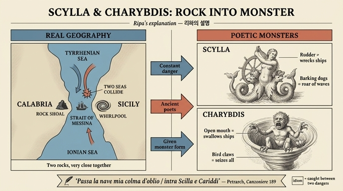

# 스킬라와 카리브디스의 실체 — 리파의 설명

## 한 줄 정리

리파는 스킬라(Scilla)와 카리브디스(Cariddi)를 **신화 속 괴물이 아니라 시칠리아 바다의 실제 암초 두 개**로 규정한다. 뱃사람에게 늘 극도로 위험했기 때문에 **고대 시인들이 그 위험에 "지나가는 모든 이를 덮치는 바다 괴물"의 형상을 씌웠다**는 것이 리파의 해석이다.

---

## 1. 출처 원문 — 『Iconologia』 MOSTRI(괴물들) 항목

이 카드는 「MOSTRI」 대항목 안의 **SCILLA** / **CARIDDI** 소항목에서 나온다. 핵심은 두 문장이다.

### (1) 실체 규정 — 두 개의 암초

> *"Scilla, e Cariddi sono due scogli posti nel Mare di Sicilia, e sono stati sempre pericolosissimi a' Naviganti: però i Poeti antichi gli diedero figura di Mostri marini, oppressori di tutti quelli, che passano vicino ad essi."*
>
> 스킬라와 카리브디스는 **시칠리아 바다에 놓인 두 개의 암초**이며, 뱃사람들에게 **늘 매우 위험했다**. 그래서 **고대 시인들은 그것들에게 바다 괴물의 형상을 부여했으니**, 그 근처를 지나는 **모든 이를 덮치는** 괴물이라 한 것이다.

### (2) 왜 위험한가 — 상반된 두 바다의 물결

> *"Scilla, e Cariddi sono vicini l'uno all'altro, ed ove sono posti, è pericoloso di navigare, per le onde di due contrari mari, che ivi incontrandosi insieme combattono, e perciò il Petrarca disse:*
> *Passa la Nave mia colma d'oblio / Intra Scilla, e Cariddi, &c."*
>
> 스킬라와 카리브디스는 **서로 가까이 있고**, 그 자리는 항해가 위험하다. **상반된 두 바다의 물결이 거기서 서로 만나 싸우기 때문**이다. 그래서 페트라르카가 말했다 — "망각으로 가득한 내 배가 스킬라와 카리브디스 사이를 지나간다."

정답의 세 요소가 그대로 여기서 나온다: ① 시칠리아 바다의 두 암초 ② 위험 → 시인들의 괴물화 ③ 두 바다 물결의 충돌 + 페트라르카 인용.

---

## 2. 리파의 논법 — "우화의 자연학적 해체"

리파는 『Iconologia』 곳곳에서 같은 수법을 쓴다. **괴물 이야기를 먼저 인용해 보여주고, 마지막에 그 실체(자연 현상·지형)를 밝히는** 방식이다. 이 논법은 고대의 우화 합리화 전통(euhemerism / physical allegoresis)의 연장이다.

| 단계 | 스킬라·카리브디스 | 같은 장의 다른 예 |
| --- | --- | --- |
| 시인의 묘사 인용 | 호메로스: 열두 개의 발, 여섯 개의 목·머리, 세 겹 이빨 / 오비디우스·베르길리우스 | 키메라: 사자 머리 + 염소 배 + 용 꼬리, 입에서 불 |
| 실체 폭로 | **시칠리아 바다의 암초 두 개**, 두 조류의 충돌 | **리키아의 불 뿜는 산** — 정상은 불, 중턱은 숲과 목초, 산기슭엔 사자 떼 |

즉 리파에게 괴물은 **자연 위험에 붙은 이름표**다. 같은 장에서 케르베로스도 "시체를 삼키는 땅(la terra)"으로 풀이된다.

### 개별 도상 묘사 — "시인들이 부여한 형상"이 구체적으로 무엇인가

리파가 "형상을 부여했다"고 할 때, 그가 인용·기록한 형상은 이렇다.

- **SCILLA (호메로스 『오디세이아』판)** — 바다 동굴 안의 끔찍한 괴물. **발 열둘, 목 여섯, 머리 여섯**, 각 머리에 **세 겹 이빨**의 큰 입, 치명적 독이 흘러내린다. 동굴에서 머리를 내밀어 뱃사람을 노리며, **개처럼 짖는다**(오디세우스의 동료를 입 수만큼 삼켰다).
- **SCILLA (섹스투스 폼페이우스의 메달판)** — 배꼽까지는 **벌거벗은 여인**, 두 손으로 **배의 키(timone)** 를 쥐고 내리칠 자세, 배꼽 아래는 **꼬인 두 개의 꼬리**로 갈라지고, 배꼽 밑에서 **개 세 마리**가 몸 절반을 내밀고 짖는다.
  - 키 = 스킬라가 **배를 부수고 선원을 죽이는 위험한 통로**임을 뜻한다.
  - 개들의 짖음 = **파도가 암초를 때릴 때 나는 거대한 소리**가 개 짖는 소리 같다는 것 → **소리라는 자연 현상의 알레고리**임을 리파가 직접 명시한다.
- **CARIDDI** — 또 하나의 암초로, 물이 소용돌이쳐 **배를 여러 번 삼키고** 때로는 산 위로까지 물을 치솟게 해 뱃사람에게 큰 공포를 준다. 그래서 시인들은 **지극히 흉한 모습, 맹금(猛禽)의 손과 발, 벌린 입**으로 그렸다.

> 암기 포인트: **스킬라 = 개 짖는 소리(암초에 부딪히는 파도음) / 카리브디스 = 삼키는 소용돌이**. 리파는 이 둘을 각각 "암초"라 부르지만, 실제 자연 현상은 **암초(스킬라)와 소용돌이(카리브디스)** 로 나뉜다.

---

## 3. 실제 지리 — 메시나 해협

리파가 "시칠리아 바다의 두 암초"라 뭉뚱그린 곳은 오늘날 **메시나 해협**(Stretto di Messina), 시칠리아와 이탈리아 본토 칼라브리아 사이의 좁은 물길이다.

- **스킬라** → 칼라브리아 쪽 해안의 돌출 암반. 지금도 그 자리에 **실라(Scilla)** 라는 마을이 있다.
- **카리브디스** → 시칠리아 쪽, 메시나 앞바다의 상시적 **와류(소용돌이)**.
- 리파의 "**상반된 두 바다의 물결이 만나 싸운다**"는 설명은 실제 현상과 정확히 맞아떨어진다. **티레니아해와 이오니아해**의 수온·염도가 다른 물이 좁은 해협에서 조류·바람·해저 지형에 따라 부딪히며 격렬한 와류와 급변하는 흐름을 만든다.
- 둘이 **너무 가까워** 한쪽을 피하면 다른 쪽에 붙게 된다 — 여기서 "**스킬라와 카리브디스 사이**(진퇴양난·양쪽 다 위험한 선택)"라는 서양 관용구가 나왔다. 리파의 "vicini l'uno all'altro(서로 가까이 있다)"가 바로 이 지점을 짚는다.

---

## 4. 페트라르카 인용의 의미

리파가 인용한 구절은 페트라르카 『칸초니에레』(*Rerum vulgarium fragmenta*) **189번 소네트**의 첫 행이다.

> *Passa la nave mia colma d'oblio*
> *per aspro mare, a mezza notte il verno,*
> *enfra Scilla et Caribdi; et al governo*
> *siede 'l signore, anzi 'l nimico mio.*
>
> 망각으로 가득한 내 배가 / 거친 바다를, 겨울 한밤중에, / **스킬라와 카리브디스 사이로** 지나간다. 그리고 키에는 / 주인이, 아니 나의 원수가 앉아 있다.

- 페트라르카에게 배는 **사랑에 시달리는 자신의 삶·영혼**이고, 키를 잡은 "주인 아닌 원수"는 **사랑(아모르)** 이다. 항해 알레고리로 내면의 좌초를 그린다.
- 리파가 이 구절을 끌어오는 이유는 문학 감상이 아니다. **"스킬라와 카리브디스 사이"가 당대에 이미 극한의 위험을 뜻하는 상투구였음을 권위로 입증**하려는 것이다. 즉 시인들의 괴물 형상화가 어떻게 관용 표현으로 굳었는지를 보여주는 증거로 쓴다.
- 리파의 인용문은 원문과 표기가 약간 다르다(`Intra Scilla, e Cariddi` / 원문 `enfra Scilla et Caribdi`). 18세기 판본의 철자·인용 관습 차이다.

---

## 5. 시인들의 "괴물화" 공식이 판화에서 보이는 방식

이 판(1764–67년 페루자판) 「MOSTRI」 장의 스킬라 도판은 자산 추출본에 포함되지 않았다. 다만 **같은 장, 바로 몇 쪽 뒤의 「SIRENE(세이렌)」 도판**이 리파가 설명한 메커니즘 — *바다의 위험 → 여성 상반신 + 물고기 하반신의 괴물 + 지나가는 배의 파멸* — 을 그대로 보여준다.

그림에서 관찰되는 요소와 리파의 논리를 대응시키면:

- **바다 위 세 명의 반인반어(半人半魚)** — 배꼽 아래가 비늘 꼬리로 갈라진다. 스킬라의 "배꼽 아래는 꼬인 두 개의 꼬리"와 같은 조형 문법이다.
- **피리·플루트·리라를 든 손** — 세이렌의 무기는 소리다. 스킬라 도상에서 소리 역할을 하는 것이 **짖는 개 세 마리**(= 암초를 때리는 파도음)라는 점과 짝을 이룬다.
- **오른쪽의 배와 선원들** — 일부는 졸고, 일부는 잠들고, 일부는 물로 떨어진다. "**근처를 지나는 모든 이를 덮치는**(oppressori di tutti quelli, che passano vicino ad essi)"는 리파의 표현이 그림으로 구현된 장면이다.
- **화면 왼쪽 멀리의 작은 돛배** — 위험 구역으로 다가오는 다음 희생자. 해협이라는 **피할 수 없는 통로**의 성격을 암시한다.

즉 이 판화는 스킬라 자체는 아니지만, **"실제 해상 위험을 여성형 바다 괴물로 인격화한다"는 동일한 도상 공식**을 눈으로 확인하게 해준다.

---

## 6. 자주 틀리는 지점

- ❌ "리파는 스킬라를 님프였다가 키르케에게 변신당한 여인으로 설명한다" → 리파는 오비디우스의 변신 이야기를 **인용만** 하고, 자신의 결론은 **암초**다. 질문이 "리파의 설명"을 묻는다면 답은 **지형·자연 현상**이다.
- ❌ "두 암초가 멀리 떨어져 있어 위험하다" → 반대다. **가까워서** 위험하다(양쪽 다 피할 수 없음).
- ❌ 인용 시인을 호메로스/베르길리우스로 답하기 → 위험 설명의 결론부 인용은 **페트라르카**다. 호메로스·오비디우스·베르길리우스는 **괴물 형상** 묘사의 출처다.
- 리파는 두 개 모두 "**scogli(암초)**"라 부른다. "하나는 암초, 하나는 소용돌이"는 현대 지리학의 정리이고, 리파 텍스트에서는 카리브디스도 암초로 분류된 뒤 그 위험이 **소용돌이(l'acqua intorcendosi)** 로 서술된다.

---

## 인포그래픽

---

## 참고

- Cesare Ripa, *Iconologia*, 「MOSTRI — SCILLA / CARIDDI」 (본문 tomo quarto, 약 181쪽)
- [Petrarca, *Rerum vulgarium fragmenta* 189 (Wikisource)](https://it.wikisource.org/wiki/Canzoniere_(Rerum_vulgarium_fragmenta)/Passa_la_nave_mia_colma_d%27oblio)
- [Between Scylla and Charybdis — Wikipedia](https://en.wikipedia.org/wiki/Between_Scylla_and_Charybdis)
- [Charybdis — Wikipedia](https://en.wikipedia.org/wiki/Charybdis)
- [Scylla and Charybdis, the legend of the Strait of Messina](https://discovermessina.com/scylla-and-charybdis-legend-strait-of-messina/)
