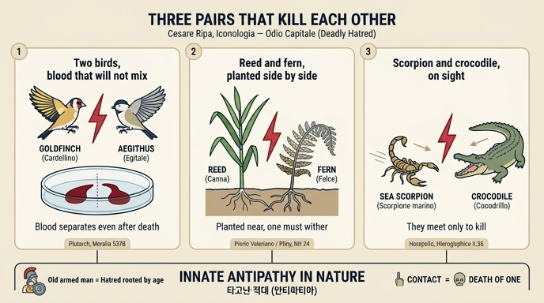

# 증오(ODIO CAPITALE)의 두 새와 갈대·고사리

> **Q.** 증오 도상에서 두 새와 갈대·고사리는 무엇을 뜻하는가?
>
> **A.** 플루타르코스에 따르면 방울새와 에지탈레의 피는 섞이지 않고 섞어도 서로 분리되어 죽은 뒤에도 증오를 이어간다. 피에리오에 따르면 갈대와 고사리는 나란히 심으면 한쪽이 반드시 말라 죽는 식물이라 치명적 증오를 뜻한다. 이집트인들은 만나기만 하면 서로 죽이려 달려드는 바다전갈과 악어 사이에 무장한 노인을 그려 증오를 표기했다.

---

## 0. 이 카드의 뼈대: '자연 안의 타고난 적대' 삼중 예증

리파의 `ODIO CAPITALE`(치명적 증오 / 불구대천의 증오) 항목은 알레고리 인물 자체보다 **인물이 걸치고 있는 세 개의 자연 예증**이 핵심이다. 세 예증은 각각 **새(동물)·식물·이집트 상형문자**에서 왔지만 구조는 완전히 같다.

| | 쌍 | 매체 | 출전 | 도상 위치 |
|---|---|---|---|---|
| 1 | 방울새(Cardellino) ↔ 에지탈레(Egitale) | 새 두 마리 | 플루타르코스 | 투구 장식(cimiero) |
| 2 | 갈대(canna) ↔ 고사리(felce) | 식물 | 피에리오 발레리아노 | 왼팔 방패 문장 |
| 3 | 바다전갈(scorpione marino) ↔ 악어(cocodrillo) | 동물 | 이집트인(호라폴론) | 제2 이본에서 인물 좌우 |

세 쌍 모두 **"둘이 만나면 반드시 한쪽이 죽는다"**는 동일 명제를 반복한다. 리파에게 '치명적 증오'는 사람이 품는 감정 이전에 **자연 자체에 새겨진 힘**이라는 뜻이다.

---

## 1. 원문과 번역

### 리파 원문 (OCR, 4권 `ODIO CAPITALE` 항목, 293–311행)

> **ODIO CAPITALE.** *Di Cesare Ripa.*
>
> UOmo vecchio armato, che per cimiero porti due uccelli, cioè un Cardellino ed un Egitale, ambedue colle ali aperte, stando in atto di combattere insieme. Nella destra mano terrà una spada ignuda, e nel braccio sinistro uno scudo, in mezzo del quale sarà dipinta una canna con le foglie ed un ramo di felce.
>
> L'odio, secondo S. Tommaso, è una ripugnanza ed alienazione di volontà da quello che si stima cosa contraria e nociva.
>
> Si dipinge vecchio, perchè negli anni invecchiati suole stare radicato, come all'incontro l'ira ne' Giovani; armato, per difender sè ed offendere altrui.
>
> Gli uccelli del cimiero si fanno per l'Odio che fra loro esercitano, perchè, come riferisce **Plutarco negli Opuscoli, trattando della differenza che è fra l'odio e l'invidia**, il sangue di questi animaletti non si può mescolare insieme, e mescolato tutto si separa l'uno dall'altro, esercitando l'odio ancora dopo morte.
>
> La canna e la felce dipinta nello scudo parimente significano Odio capitale, perchè se sono piantate vicino l'una all'altra, l'una necessariamente si secca, come racconta **Pierio Valeriano nel lib. 58**.
>
> **Odio Capitale** (제2 이본)
>
> UOmo vecchio, armato con arme da difendersi e da offendere. Stia in mezzo fra uno Scorpione marino ed un Cocodrillo, che siano in atto di azzuffarsi a battaglia. Così dipingevano l'Odio gli Egizj, perchè di questi due animali, subito che l'uno vede l'altro, spontaneamente s'incontrano insieme per ammazzarsi.
>
> D[i] Fat[t]i, vedi *Inimicizia*.

### 번역

> **치명적 증오.** 체사레 리파.
>
> 무장한 노인. 투구 장식으로 두 마리 새, 곧 **방울새 한 마리와 에지탈레 한 마리**를 얹는데, 둘 다 날개를 펴고 서로 싸우는 자세를 취한다. 오른손에는 뽑아 든 칼을, 왼팔에는 방패를 드는데 방패 한가운데에는 **잎 달린 갈대와 고사리 가지**를 그린다.
>
> 성 토마스에 따르면 증오란 해롭고 반대되는 것으로 여겨지는 대상에 대한 **반감(ripugnanza)이자 의지의 소외(alienazione di volontà)**다.
>
> 노인으로 그리는 것은 나이가 든 해에는 증오가 **뿌리내려(radicato)** 있기 때문이다. 반대로 분노(ira)는 젊은이의 것이다. 무장시킨 것은 자기를 지키고 남을 해치기 위함이다.
>
> 투구의 새들은 그들이 서로에게 품는 증오 때문에 쓴다. 플루타르코스가 『소품집』에서 증오와 질투의 차이를 다루며 전하는 바, 이 작은 짐승들의 피는 서로 섞일 수 없고, 다 섞어 놓아도 서로 갈라져 나오니, **죽은 뒤에도 증오를 계속 행사하는 것**이다.
>
> 방패에 그린 갈대와 고사리도 마찬가지로 치명적 증오를 뜻한다. 둘을 서로 가까이 심으면 **한쪽이 반드시 말라 죽기** 때문이다. 피에리오 발레리아노 58권이 전한다.
>
> (제2 이본) 방어용·공격용 무기로 무장한 노인. **바다전갈과 악어 사이**에 서 있고, 그 둘은 맞붙어 싸우려는 자세다. 이집트인들은 증오를 이렇게 그렸다. 이 두 짐승은 **한쪽이 다른 쪽을 보는 즉시 자발적으로 마주 달려가 서로를 죽이려** 하기 때문이다.
>
> 사례는 「적대(Inimicizia)」 항목을 보라.

> **OCR 주의.** 이 항목은 훼손이 잦다. `S. Tommafo`→`S. Tommaso`, `mefcolarc`→`mescolare`, `fecca`→`secca`, `aramazzarfi`→`ammazzarsi`, `Egizi`→`Egizj`처럼 장음 s(ſ)가 f로 잘못 읽힌 자리는 위 번역에서 복원했다. 마지막 줄 `JDj' Fatù t vedi Inimic'idA`는 판독 불가에 가깝고, 리파 다른 항목의 관행("Di Fatti, vedi …" = 실례는 다른 항목 참조)에 따라 **`D[i] Fat[t]i, vedi Inimicizia`로 추정 복원**한 것이다. 확정된 판독이 아니다.
>
> **이미지 없음.** 이 장(11장) 마크다운이 참조하는 이미지 3장은 모두 `Offerta`·`Offesa`·`Omicidio` 항목의 판화이며 `Odio capitale`와 무관하다. 즉 이 판본에서 증오 항목에는 삽화가 붙어 있지 않고, 텍스트 기술(記述)만 남아 있다.

---

## 2. 첫째 쌍 — 방울새와 에지탈레: 죽은 뒤에도 섞이지 않는 피

### 2-1. 리파의 전거는 정확하다

리파는 "플루타르코스가 『소품집(Opuscoli)』에서 증오와 질투의 차이를 다루며"라고 적었는데, 이건 정확히 **플루타르코스 『모랄리아』의 「질투와 증오에 관하여」(Περὶ φθόνου καὶ μίσους / *De invidia et odio*), 537B, §4**를 가리킨다. 르네상스 이탈리아에서 *Moralia*를 `Opuscoli`(소품집)로 부르는 건 관례였다.

해당 그리스어 구절:

> **αἰγιθαλλοὶ καὶ ἀκανθυλλίδες** … τούτων γέ φασι μηδὲ τὸ αἷμα κίρνασθαι σφαττομένων, ἀλλὰ κἂν μίξῃς, ἰδίᾳ πάλιν ἀπορρεῖν διακρινόμενον.
>
> (박새류와 방울새류 … 이것들은 도살해도 피가 섞이지 않으며, 섞어 놓아도 다시 저마다 갈라져 흘러 나간다고들 한다.)

- `ἀκανθυλλίς / ἀκανθίς` (akanthis) → 이탈리아어 **cardellino**(방울새/황금방울새, *Carduelis carduelis*). '엉겅퀴(ἄκανθα) 새'라는 뜻.
- `αἰγιθαλλός` (aigithallos) → 이탈리아어 **Egitale**. 그리스어 음차를 그대로 굳힌 말이라 이탈리아어에도, 한국어에도 정착된 번역어가 없다.

즉 리파의 새 두 마리는 플루타르코스의 그리스어 쌍을 **음차와 번역으로 하나씩 옮긴 것**이며, 인용이 어긋난 데가 없다.

### 2-2. 진짜 뿌리는 아리스토텔레스

이 전승의 원천은 **아리스토텔레스 『동물지』 9권 1장(609b–610a)의 '동물 간 적대 목록'**이다. 아리스토텔레스는 사자와 승냥이, 까마귀와 올빼미, 독수리와 뱀 같은 쌍을 죽 늘어놓는데 그 안에 이런 문장이 있다.

> ἄνθος(anthus)와 ἀκανθίς(acanthis)와 **αἴγιθος(aegithus)는 서로 적대한다. anthus의 피는 aegithus의 피와 섞이지 않는다고들 한다.**

주목할 점 두 가지.

1. **아리스토텔레스에서 '피가 섞이지 않는' 쌍은 anthus–aegithus**다. 방울새(acanthis)는 '적대 목록'에는 들어 있지만 혈액 모티프의 당사자는 아니다. 플루타르코스가 이를 **aigithallos–akanthis 쌍으로 재조합**했고, 리파가 그 조합을 물려받았다. 즉 리파가 그린 두 새는 아리스토텔레스 원문과 정확히 같은 쌍이 아니라, **플루타르코스 단계에서 한 번 변형된 판본**이다.
2. 아리스토텔레스는 이 서술에 일관되게 `φασί`(∼라고들 한다)를 붙인다. 본인 관찰이 아니라 **전문(傳聞)으로 명시**한 것인데, 후대로 갈수록 이 유보가 떨어져 나가고 사실 진술로 굳는다.

### 2-3. '에지탈레'가 무슨 새인지는 지금도 미상

- 그리스어에는 비슷한 두 낱말이 있다. `αἴγιθος`(aigithos)와 `αἰγίθαλος/αἰγιθαλλός`(aigithalos). 고대에도 혼동됐고, 아리스토텔레스는 aigithos를 두고 "먹이를 쉽게 얻고, 새끼가 많으며, **다리를 전다**"고만 적어 놓았다(HA 9.1, 616b 부근에도 반복). 이 정도 정보로는 현대 종 동정이 불가능하다.
- `aigithalos` 쪽은 박새류로 보는 게 통설이고, 근대 분류학이 이 이름을 가져다 **오목눈이속 *Aegithalos*** 를 만들었다. 그러나 아리스토텔레스의 aigithos는 바위종다리(dunnock), 촉새류, 뱁새류 등 여러 후보가 제안됐을 뿐 **정설이 없다**.
- 따라서 "방울새와 에지탈레"를 현대 조류명으로 확정해 옮기는 것은 무리다. **음차로 두는 편이 정직하다.**

부수적으로 재미있는 것: 아리스토텔레스는 aegithus가 **당나귀와도 원수**라고 적었다. 이유가 훌륭하게 산문적이다 — 당나귀가 가시덤불에 몸을 비벼 가려운 데를 긁고 울어대는 통에 그 덤불에 지은 둥지의 알과 새끼가 떨어진다는 것. 고대의 '적대'는 이렇게 관찰된 생태적 갈등과 순수한 민담이 뒤섞여 있다.

### 2-4. 왜 '피가 섞이지 않는다'가 강력한 상징인가

이게 이 카드의 지적 핵심이다.

- **증오가 의지의 문제이기를 그친다.** 성 토마스를 인용해 리파는 증오를 "의지의 소외(alienazione di volontà)"라 정의해 놓고선, 곧바로 **의지가 사라진 뒤에도 남는 증오**를 예로 든다. 두 새는 이미 도살됐다. 미워할 주체가 없다. 그런데도 피는 갈라진다.
- **증오가 물질에 각인된 본성이 된다.** 피는 고대·중세 생리학에서 생명과 기질(temperamentum)의 담지체다. 그 피가 섞이기를 거부한다는 것은, 적대가 감정층이 아니라 **질료층에 새겨져 있다**는 주장이다.
- **그래서 '치명적(capitale)'이다.** 이탈리아어 `odio capitale`은 '목숨을 걸 만한, 화해 불가능한 증오'다. 화해란 의지의 변경으로 이루어지는데, 의지 아래층에 박힌 증오는 원리적으로 화해가 불가능하다. 두 방울의 피가 갈라지는 이미지는 **'화해 불가능성'의 완벽한 시각적 증명**으로 작동한다.
- 리파가 이걸 **투구 장식(cimiero)** 자리에 올린 것도 의미가 있다. 문장학에서 cimiero는 기사가 자기 가문의 정체성을 선포하는 자리다. 증오가 이 인물의 **소속이자 신분**이라는 뜻이 된다.

---

## 3. 둘째 쌍 — 갈대와 고사리: 나란히 심으면 하나가 마른다

### 3-1. 리파가 든 전거

리파는 **피에리오 발레리아노(Pierio Valeriano Bolzani, 1477–1560) 『상형문자론』(*Hieroglyphica*, 1556) 58권**을 댄다. 발레리아노의 이 책이 정확히 58권으로 이루어져 있다는 점은 맞다(원제 부제가 "…in libros quinquaginta octo redacti"). 다만 **58권의 표제와 해당 항목의 실제 문면은 이번 조사에서 대조하지 못했다.** 발레리아노가 이 소재를 다뤘다는 점 자체는 그의 저술 성격(플리니우스·아리스토텔레스 자연지를 상징 사전으로 재편)으로 보아 자연스럽지만, **리파의 권수 인용을 원전에서 확인하지는 못했음을 명시해 둔다.**

### 3-2. 진짜 뿌리는 플리니우스의 안티파티아 학설

발레리아노가 어디서 가져왔는지는 꽤 분명하다. **대(大)플리니우스 『박물지』 24권**이다. 이 권은 아예 **1장 제목이 "나무와 식물 사이에 존재하는 안티파티아와 심파티아"**로, 식물 간 적대·친화 목록의 고대 표준 창고다. 갈대–고사리 조항은 다음과 같다.

> 고사리는, 하지 무렵에 뿌리째 뽑거나, **갈대 날로 줄기를 자르거나**, 보습에 **갈대를 얹고** 갈아엎으면 다시 돋지 않는다. 반대로 갈대밭은 보습에 **고사리 줄기를 얹으면** 효과적으로 갈아엎을 수 있다.
>
> **갈대 뿌리**를 찧어 붙이면 살에 박힌 **고사리 가시**가 빠져나오고, **고사리 뿌리**는 **갈대 조각**에 대해 같은 효과를 낸다.

여기서 확인할 것이 셋이다.

1. **플리니우스는 '나란히 심으면 죽는다'고까지는 말하지 않는다.** 그의 서술은 훨씬 구체적이고 도구적이다 — 갈대 날로 자르기, 보습에 얹기, 가시 뽑기. 리파가 전하는 **"vicino l'una all'altra 심으면 한쪽이 필연적으로 마른다"는 형태는 후대(디오스코리데스 계열 주석 및 발레리아노 단계)에서 일반화된 판본**으로 보인다.
2. **상호성이 완전하다.** 갈대가 고사리를 죽이고, 고사리도 갈대를 죽인다. 가시를 뽑아주는 것까지 서로 대칭이다. 이 완벽한 상호 대칭성이 바로 이 쌍을 '증오'의 상징으로 쓸 수 있게 만든다 — 포식이 아니라 **대등한 상호 파괴**다.
3. **농법 기록으로서의 실체가 있다.** 고사리 제초에 갈대를 쓰는 처방은 로마 농서 계열에 반복해서 등장한다. 고사리는 유럽 농경지의 실제 골칫거리 잡초였고, 뿌리줄기를 끊어 놓는 물리적 제초가 효과를 보였다. 즉 **효과의 관찰은 실재했고, 그 원인 설명이 '안티파티아'로 채워진** 전형적 사례다.

### 3-3. 고대에도 회의론이 있었다

디오스코리데스 계열 주석에는 이미 반박이 붙어 있다. **고사리는 습한 곳에서 자라지 못하고 갈대는 마른 곳에서 자라지 못하므로**, 둘을 나란히 두면 한쪽이 죽는 것은 **적대심 때문이 아니라 서식 조건이 상반되기 때문**이라는 것이다. 현대 생태학의 설명과 사실상 같다(갈대 *Phragmites*는 침수 습지, 고사리 *Pteridium*은 배수 좋은 산성 토양). 여기에 갈대의 강한 지하경 경쟁이 더해진다.

리파는 이 회의론을 언급하지 않는다. **도상학 저자에게 필요한 건 사실성이 아니라 인용 가능한 권위**였다는 점을 잘 보여준다.

### 3-4. 왜 하필 방패 문장인가

새는 투구에, 식물은 방패에 놓였다. 문장학에서 방패 한가운데(`in mezzo del quale`)는 가문의 본질을 담는 자리다. 또 방패는 **방어**의 도구인데, 그 표면에 '접촉하면 죽는 한 쌍'이 그려져 있다는 배치는, 이 인물의 방어가 곧 **타자를 말려 죽이는 힘**과 같은 것이라는 뜻으로 읽힌다. 오른손의 뽑아 든 칼(공격)과 짝을 이룬다.

---

## 4. 셋째 쌍 — 바다전갈과 악어: 이집트인의 증오 표기

### 4-1. 호라폴론에 실제로 있다

리파의 제2 이본이 말하는 "이집트인들이 이렇게 그렸다"의 출전은 **호라폴론(Horapollo) 『히에로글리피카』 2권 35장**이며, 실제로 존재한다.

> 자기와 **대등한 상대와 맞붙는 원수**를 나타내려 할 때, 그들은 **전갈과 악어**를 그린다. 이 둘은 서로를 죽이기 때문이다.

같은 책에는 짝이 되는 조항도 있다. 누군가를 적대하여 **죽인** 자를 나타내려면 악어 또는 전갈을 그리는데, **빨리 죽였으면 악어, 천천히 죽였으면 전갈**(전갈의 독이 더디게 퍼지므로)이라는 것이다. 즉 이 두 짐승은 호라폴론의 체계 안에서 **'살해'라는 개념군의 짝패 기호**였고, 둘을 마주 세우면 자동으로 '대등한 원수끼리의 상호 살해'가 된다.

### 4-2. 다만 리파의 '바다전갈'은 변형이다

호라폴론의 그리스어는 그냥 **σκορπίος**(전갈), 곧 육상 전갈이다. 리파의 `Scorpione marino`(바다전갈)는 여기에 '바다'가 덧붙은 것이다.

- 고대·근세 라틴어에서 `scorpio marinus` / `scorpaena`는 등지느러미에 독가시가 있는 **쏨뱅이·양볼락류 물고기**를 가리켰다. 즉 완전히 다른 동물이다.
- 나일강의 악어와 짝을 이루려면 **물속에 사는 상대**가 서사적으로 더 그럴듯하다. 이 '수생화'가 라틴어 번역 단계에서 일어났는지, 발레리아노가 개입한 결과인지, 리파 자신의 각색인지는 **이번 조사로는 확정하지 못했다.** 다만 호라폴론 원문에 '바다'는 없다는 점은 확실하다.
- 결론: **조합(전갈+악어=상호 살해) 자체는 호라폴론에 실재하고, '바다'라는 수식은 전승 과정에서 붙은 것**이다.

### 4-3. 나일악어 천적 전승과 비교하면 구조가 선명해진다

고대 문헌은 악어를 두고 여러 상대를 짝지웠는데, 성격이 서로 다르다.

| 상대 | 전승 | 성격 |
|---|---|---|
| **이크네우몬**(이집트몽구스) | 악어 알을 깨뜨리고, 진흙을 발라 갑옷을 만든 뒤 벌린 입으로 뛰어들어 내장을 물어뜯는다 (플리니우스 8권, 아일리아노스) | **비대칭 포식** — 작은 짐승의 꾀 |
| **트로킬로스**(악어새) | 악어가 입을 벌려 주면 이 사이의 거머리를 쪼아 먹는다 (헤로도토스 2.68) | **심파티아** — 친화의 대표 사례 |
| **전갈** | 만나면 서로를 죽인다 (호라폴론 2.35) | **대칭적 상호 파괴** |

리파가 셋 중 **전갈**을 골랐다는 사실이 중요하다. 몽구스는 승자가 정해진 사냥이고, 악어새는 협력이다. 오직 전갈만이 **승자 없는 대등한 상호 살해**이며, 그것만이 앞의 두 쌍(피가 서로 갈라짐, 갈대와 고사리가 서로 말림)과 **같은 구조**를 이룬다. 세 예증은 우연히 나열된 것이 아니라 **하나의 형식으로 걸러진 것**이다.

또 하나. 이번 예증에서는 **노인이 두 짐승 '사이(in mezzo)'에 서 있다.** 새와 식물은 인물이 착용했지만, 전갈과 악어는 인물을 둘러싼다. 증오를 **입은 것**에서 증오가 **일어나는 현장에 선 것**으로 무대가 바뀐 셈이다.

---

## 5. 종합 — 안티파티아 학설이 도상학의 논거가 되는 방식

### 5-1. 안티파티아/심파티아란

헬레니즘 자연철학은 만물이 눈에 보이지 않는 **끌림(συμπάθεια, sympathia)과 밀침(ἀντιπάθεια, antipathia)**의 그물로 엮여 있다고 보았다. 원소 조성이나 기계적 접촉으로 설명되지 않는 현상 — 자석이 쇠를 당기는 것, 어떤 약초가 어떤 독을 푸는 것, 어떤 동물이 어떤 동물을 보기만 해도 달려드는 것 — 이 모두 사물에 내재한 **숨은 성질(virtus occulta)**의 발현이라는 것이다.

- **대(大)플리니우스**가 『박물지』 전편에 이 목록을 흩뿌려 놓으면서(특히 20·24·28·37권) 이 학설을 서양 전체로 퍼뜨렸다.
- 르네상스에서 이를 집대성한 것이 **잠바티스타 델라 포르타 『자연 마술』(*Magia naturalis*, 1558/증보 1589)**이다. 여기서 안티파티아·심파티아는 자연 마술의 작동 원리이자 실용 처방집이 된다. 마르실리오 피치노, 아그리파 계열의 자연 마술도 같은 지반 위에 있다.

### 5-2. 그래서 도상학이 이걸 쓴다

리파의 『이코놀로지아』는 화가·조각가·문장가에게 **추상 개념을 눈에 보이게 만드는 부품 카탈로그**를 제공하는 책이다. 문제는 '치명적 증오' 같은 개념을 어떻게 **자의적이지 않게** 그리느냐다.

안티파티아 학설이 이 문제를 푼다.

- 화가가 두 새를 그리면 그건 임의의 은유가 아니라 **자연이 실제로 그렇게 되어 있다는 보고**가 된다. 상징의 근거가 관습이 아니라 **자연 사실**에 있다고 주장할 수 있게 된다.
- 그래서 리파는 항목마다 반드시 **전거를 댄다** — 플루타르코스, 피에리오, 이집트인. 이 이름들은 장식이 아니라 **상징의 정당화 장치**다.

### 5-3. 이 카드에서 얻어갈 결론

> 리파에게 **치명적 증오는 도덕적 악덕이기 이전에 자연에 실재하는 힘**이다.

세 예증은 증오가 인간의 감정층 아래로 계속 내려가는 계단이다.

1. **동물의 피** — 의지가 사라진 뒤에도 남는다 (개체의 죽음보다 깊다)
2. **식물** — 신경도 감정도 없는 존재에게도 있다 (동물성보다 깊다)
3. **이집트 상형문자** — 인류가 문자로 기록해 온 세계의 근본 구조다 (역사보다 깊다)

성 토마스의 정의("의지의 소외")로 문을 열어 놓고, 본문 전체는 **의지가 닿지 않는 곳에 있는 증오**를 보여준다. 노인을 고른 것도 같은 논리다 — 분노(ira)는 젊은이의 것이라 끓다가 식지만, 증오는 세월에 **뿌리내린다(radicato)**. 식물 은유가 여기서 이미 나오고 있다는 점에 주목할 만하다.

### 5-4. 현대적으로는

셋 다 사실이 아니다. 종이 다른 두 새의 피가 물리적으로 '갈라져 흐르는' 일은 없다(혈청학적 응집 반응은 존재하지만 육안으로 두 줄기가 분리되는 현상과는 무관하다). 갈대와 고사리는 서로를 미워하는 게 아니라 **토양 수분 요구가 정반대**일 뿐이고, 전갈과 악어는 서식 환경상 마주칠 일 자체가 드물다. 리파의 전거들은 **관찰된 단편 + 인과 설명의 공백을 '숨은 적대'로 메운 결과**이며, 그 전승은 아리스토텔레스의 `φασί`(∼라고들 한다)에서 출발해 플루타르코스·플리니우스를 거치는 동안 유보 표현을 잃고 사실로 굳었다.

---

## 6. 도상 요소 총정리

| 요소 | 표현 | 의미 |
|---|---|---|
| 노인 | Uomo vecchio | 증오는 나이 들며 **뿌리내린다**(≠ 젊은이의 분노) |
| 무장 | armato | 자기를 지키고(difendere) 남을 해친다(offendere) |
| 뽑아 든 칼 | spada ignuda (오른손) | 능동적 가해 |
| 방패 | scudo (왼팔) | 방어 — 그 위에 식물 예증 |
| **투구 장식의 두 새** | 방울새 + 에지탈레, **날개를 펴고 싸우는 자세** | 죽어서도 피가 섞이지 않는 적대 (플루타르코스 537B) |
| **방패 문장의 두 식물** | 잎 달린 갈대 + 고사리 가지 | 나란히 심으면 한쪽이 마르는 적대 (발레리아노 → 플리니우스 24권) |
| **제2 이본: 좌우의 두 짐승** | 바다전갈 ↔ 악어, 맞붙는 자세 | 보는 즉시 서로 죽이러 달려드는 적대 (호라폴론 2.35) |
| 상호 참조 | "vedi Inimicizia" | 실례는 「적대」 항목으로 (추정 복원) |

---

## 7. 확인한 것 / 확인하지 못한 것

**확인됨**
- 플루타르코스 『모랄리아』 「질투와 증오에 관하여」 537B(§4)에 `αἰγιθαλλοί`(에지탈레)와 `ἀκανθυλλίδες`(방울새)의 피가 섞이지 않고 갈라진다는 문장이 실재. **리파의 출전 표기가 정확하다.**
- 아리스토텔레스 『동물지』 9.1(609b–610a)의 동물 적대 목록에 anthus·acanthis·aegithus의 적대와 혈액 불혼합 서술이 실재. **단 그 쌍은 anthus–aegithus**로, 플루타르코스 단계에서 조합이 바뀌었다.
- 플리니우스 『박물지』 24권(1장 = 안티파티아·심파티아 장)에 갈대–고사리 상호 파괴 및 상호 가시 제거 서술이 실재. 디오스코리데스 계열의 생태적 반박도 실재.
- 호라폴론 『히에로글리피카』 2권 35장에 "대등한 원수 = 전갈 + 악어" 조항이 실재.

**확인하지 못함**
- 발레리아노 『상형문자론』 **58권**의 갈대–고사리 대목 원문(권수 인용의 정확성 포함).
- 호라폴론의 육상 `σκορπίος`가 리파에게서 **`scorpione marino`(바다전갈)**로 바뀐 경로 — 라틴 번역본 · 발레리아노 · 리파 중 어느 단계인지.
- 리파가 전하는 "**가까이 심으면** 한쪽이 마른다"는 형태의 최초 출처(플리니우스 원문은 이 형태가 아니다).
- 이 판본 4권 `Odio capitale` 항목의 삽화 유무 — 11장 마크다운에는 해당 판화가 없다.

---

## 인포그래픽

