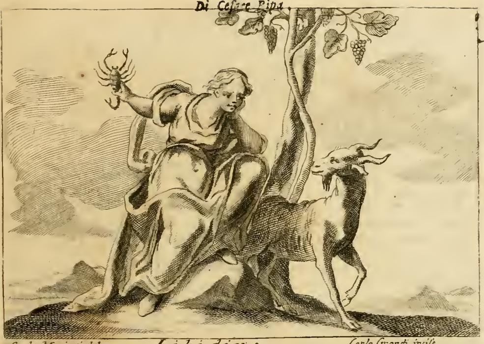

# '음욕(Lussuria)' 도상의 악어와 자고새

## 질문

'음욕' 도상에서 악어와 자고새는 왜 음욕의 상징인가?

## 한눈에 보기

| 지물 | 리파가 제시한 논거 | 리파가 명시한 전거 |
|---|---|---|
| **악어(Coccodrillo)** | ① 이집트인들이 음욕의 표지로 삼았다 ② 극도로 다산적이어서 새끼를 많이 낳는다 ③ "전염되는(contagiosa)" 정욕을 지녀, 오른쪽 턱의 이빨을 오른팔에 묶으면 정욕이 자극된다고 믿었다 | 피에리오 발레리아노 『히에로글리피카』 제25권 |
| **악어 부기(附記)** | 이른바 '육지 악어(스킨크)'의 주둥이와 발을 백포도주에 담가 마시면 색욕을 크게 자극한다 | 마법서 저자들, 디오스코리데스, 플리니우스 |
| **자고새(Pernice)** | 무절제한 정욕을 보여주기에 이보다 알맞은 동물이 없다. 교미욕에 광적으로 사로잡혀, 암컷이 알을 품느라 교미에 응하지 않으면 **수컷이 그 알을 깨뜨린다** | (전거 명기 없음 — 당대 통념으로 제시) |

핵심은 두 동물이 **서로 다른 방식으로** 음욕을 표상한다는 점이다. 악어는 *생식력의 과잉*(다산 → 정욕)과 *주술적 감염력*(신체 일부가 정욕을 옮긴다)으로, 자고새는 *욕망이 종의 보존 본능마저 파괴한다*는 도덕적 역설로 음욕을 가리킨다.

## 원문 근거

출처: `02 Letters to Lust.md`(Orlandi 개정판 계열 OCR), LVSSVRIA 항목.

**도상 지시문(라인 648)**

> "Na Giovane, che abbia i capelli ricciuti, e artificiosamente acconci. Sarà quasi ignuda, ma che il drappo, che coprirà le parti secrete, sia di più colori, e renda vaghezza all'occhio, e che **sedendo sopra un Coccodrillo, faccia carezze ad una Pernice**, che tiene con una mano."

> 곱슬머리를 인공적으로 손질한 젊은 여인. 거의 벗은 몸이나 은밀한 부분을 덮은 천은 여러 색이어서 눈을 즐겁게 한다. **악어 위에 앉아, 한 손에 든 자고새를 어루만진다.**

**악어 해설(라인 656~662)**

> "Siede sopra il Coccodrillo, perciocché gli Egizj dicevano, che il Coccodrillo era segno della Lussuria, perché egli è **fecondissimo, genera molti figliuoli**, e come narra **Pierio Valeriano nel lib. 25.** è di così **contagiosa libidine**, che si crede, che della sua **dritta mascella i denti legati al braccio diritto** concitino, e commuovano la Lussuria.
> Leggesi ancora ne' Scrittori di Magia, ed ancora presso **Dioscoride, e Plinio**, che se il rostro del Cocodrillo terrestre, il qual animale è da alcuni detto **Scinco**, e i piedi sono posti nel vino bianco; così bevuti infiammano grandemente alla Lascivia."

> 악어 위에 앉는 것은, 이집트인들이 악어를 음욕의 표지로 말했기 때문이다. 악어는 지극히 다산적이어서 많은 새끼를 낳으며, 피에리오 발레리아노가 제25권에서 서술하듯 그 정욕이 어찌나 전염성이 강한지, 그 **오른쪽 턱의 이빨을 오른팔에 묶으면** 음욕이 일깨워지고 동요한다고 믿어졌다.
> 또한 마법서 저자들과 디오스코리데스, 플리니우스에게서, 이른바 **스킨크**라 불리는 '육지 악어'의 주둥이와 발을 백포도주에 담가 마시면 색욕을 크게 불붙인다고 읽는다.

**자고새 해설(라인 664)**

> "Tiene, e fa carezze alla Pernice, perciocché niuna cosa è più conveniente, e più comoda, per dimostrare una intemperantissima libidine, ed una sfrenatissima Lussuria, che la Pernice, la quale bene spesso è da tanta rabbia agitata, pel coito, ed è accesa da tanta intemperanza di libidine, che **alle volte il maschio rompe le ova, che la femmina cova**, essendo ella nel covare ritenuta, ed impedita dal congiungersi seco."

> 자고새를 들고 어루만지는 것은, 극도로 무절제한 정욕과 방종한 음욕을 보이는 데 자고새만큼 적합하고 편리한 것이 없기 때문이다. 자고새는 교미 때문에 자주 광기에 사로잡히고 무절제한 정욕에 불타올라, **때로는 수컷이 암컷이 품고 있는 알을 깨뜨린다.** 암컷이 알을 품는 데 붙들려 수컷과 결합하지 못하기 때문이다.

마지막 줄은 "De' Fatti, vedi Libidine"(사례는 '색욕' 항목을 보라)로, 리파가 Lussuria와 Libidine을 한 짝으로 설계했음을 보여준다.

## 판화 읽기

*Iconologia*, LVSSVRIA 항목 판화(Carlo Mariotti del. / Carlo Grandi inc.). 지시문의 세 요소가 그대로 확인된다.

1. **아래 — 악어**: 화면 하단을 가로지르는 비늘 덮인 긴 몸통과 벌린 턱. 인물은 그 등에 **올라타 있다**. 즉 악어는 인물이 *제어하는* 짐승이 아니라 인물을 *태우고 나아가는* 탈것(기좌, sedendo sopra)이다. 음욕이 이 동물적 생식력 위에 실려 운반된다는 뜻이며, 동시에 인물이 악어와 신체적으로 접촉해 있다는 점이 "전염되는 정욕(contagiosa libidine)"이라는 텍스트와 맞물린다.
2. **위 — 자고새**: 왼손으로 받쳐 든 새가 날개를 펼치고 인물의 얼굴 쪽으로 몸을 돌린다. 어루만지는 몸짓(carezze)이 그대로 표현되어, 상징이 단순히 *놓여* 있지 않고 인물과 애무하는 관계로 묶여 있다.
3. **인물**: 거의 벗은 몸, 손질된 곱슬머리. 판화는 흑백이라 지시문의 "여러 색 천(drappo di più colori)"을 재현하지 못하지만, 천이 몸을 덮으면서도 시선을 끄는 구성은 남아 있다.

구도상 **자고새가 높이(머리·손), 악어가 낮이(발밑)** 배치된 것도 읽을 만하다. 악어는 육체적·생식적 토대, 자고새는 그 위에서 애무되는 욕망의 대상이라는 수직 위계로 볼 수 있다.

## 악어: 전거의 계보

### 호라폴로에서 발레리아노로

악어를 정욕과 연결하는 사슬은 리파의 발명이 아니라 르네상스 상형문자학(hieroglyphica) 전통의 상속물이다.

- **호라폴로 『히에로글리피카』**(5세기경, 1419년 재발견·1505년 알두스 인쇄): 이집트 상형문자를 알레고리로 풀이한 텍스트로, 악어 표지를 "격렬하고 다산적인 본성의 인간"을 뜻하는 것으로 설명한다. 즉 **분노(furor)와 다산(fecunditas)**이 한 기호 안에 공존한다.
- **피에리오 발레리아노 『히에로글리피카』**(초판 1556): 호라폴로 이후 최대 규모의 집성으로, 각 권을 한 상징에 할당했다. 리파가 인용하는 "제25권"의 권수는 판본에 따라 어긋난다 — 58권 체제의 표준판에서 악어는 *Liber XXIX: De iis quae per crocodilum et aliquot amphibia significantur*에 놓인다. 리파(및 오를란디 개정판)의 권수 표기는 그가 참조한 판본의 조판을 반영한 것으로 보아야 하며, **인용 자체가 발레리아노를 거쳐 왔다는 사실**이 요점이다.
- 이 전통에서 악어는 하나의 뜻으로 고정되지 않는다. 나일강의 신성한 동물로서 **다산**, 먹잇감을 삼키는 **탐욕**, 호라폴로의 **분노**, 이른바 '악어의 눈물'에서 온 **위선** 등이 문맥에 따라 선택된다. 리파는 그 여러 갈래 중 **다산 → 정욕** 갈래만 끌어와 Lussuria에 배치했다.

### 다산에서 정욕으로 — 논증의 구조

"악어는 다산적이다 → 그러므로 음욕의 표지다"라는 추론은 오늘날의 감각으로는 비약이다. 그러나 전근대 도덕 심리학에서 *생식력의 과잉*과 *욕망의 과잉*은 같은 원인(체액의 풍부함, 뜨거움)의 두 결과로 이해되었다. 같은 책의 Libidine 항목이 "굵고 검은 머리털, 크고 빛나는 눈"을 **"피의 풍부함(abbondanza di sangue)이 색욕의 원인"**이라는 생리학으로 설명하는 것과 정확히 같은 논리다.

### 오른쪽 턱 이빨 — 부적 주술

"오른쪽 턱의 이빨을 오른팔에 묶는다"는 대목은 자연사(natural history)가 아니라 **부적(amuletum) 주술**의 영역이다. 좌우 대칭에서 오른쪽을 택하고(오른 턱 → 오른팔), 신체 일부를 몸에 결착함으로써 그 동물의 성질을 전이시킨다는 것은 고대·중세 부적 처방의 전형적 문법이다. 리파가 이를 "si crede(믿어졌다)"라는 전언 형태로 적은 것에 주의할 필요가 있다 — 그는 이것을 사실로 주장하지 않고 **전거에 담긴 통념으로 보고**하고 있다.

### 스킨크(Scinco) — 이 대목의 실제 출처

"육지 악어"의 주둥이와 발을 백포도주에 담근다는 처방은 리파가 디오스코리데스와 플리니우스에게 돌린 부분으로, 실제 고대 약물학 문헌과 대응한다. 플리니우스는 나일강의 **스킨쿠스(scincus)**를 "악어를 닮았으나 더 작은" 동물로 소개하며 해독제이자 남성의 최음제로 기록하고, 그 발과 주둥이를 백포도주에 로켓(루콜라) 씨와 함께 담그는 조제를 전한다. 디오스코리데스 역시 이 동물을 최음 약재로 다룬다. 여기서 중요한 것은 **동물학적 혼동**이다 — 스킨크는 도마뱀류(Scincidae)이지 악어가 아니다. "육지 악어(crocodilus terrestris)"라는 고대의 명명 관행 때문에 도마뱀의 약리 전승이 악어의 상징 자산으로 흘러 들어왔고, 리파는 두 계열을 한 문단에 나란히 놓았다.

## 자고새: 전거의 계보

### 아리스토텔레스 『동물지』

- 자고새를 **호색적인(lascivious) 동물**로 분류한다.
- 교미욕이 극심한 탓에 **암컷이 수컷의 바람(숨결) 쪽에 서 있기만 해도 수태한다**(무정란 형성)고 서술한다. 수컷의 울음소리를 듣거나 수컷이 위를 지나가는 것만으로도 임신한다는 이야기도 함께 전한다(『동물지』 5권·6권).

이 "바람으로 수태한다"는 전승은 자고새의 정욕을 **접촉 없이도 작동하는 힘**으로 만들었다. 악어의 "전염되는 정욕"과 구조적으로 짝을 이루는 관념이다.

### 플리니우스 『자연사』 10권

리파의 문장에 가장 직접적으로 대응하는 고전 전거다. 플리니우스는 자고새 항목(10권, 보스톡·라일리 번역 51장 / 로엡판 X.33 §100 이하)에서 이렇게 전한다.

> 암컷 자고새는 자기 짝조차 속인다. 수컷들은 정욕의 무절제로 암컷의 알을 깨뜨려, 암컷이 알을 품느라 자기에게서 멀어지지 않게 하려 하기 때문이다. 그러고 나면 수컷들은 암컷을 향한 욕망 때문에 서로 결투를 벌인다.

리파의 "il maschio rompe le ova, che la femmina cova"는 이 문장의 사실상 축약 번역이다. 다만 **리파는 이 대목에서 플리니우스를 명시하지 않는다**. 악어 대목에서는 발레리아노·디오스코리데스·플리니우스를 꼬박꼬박 호명하면서, 자고새 대목은 전거 없이 "niuna cosa è più conveniente(이보다 적합한 것이 없다)"로 시작한다. 이는 16세기 말 교양 독자에게 자고새=음욕이 **인용이 필요 없는 상식**이었음을 시사한다.

### 성경(예레미야 17:11)과 중세 동물지 — 계보의 분기

- **예레미야 17:11**(불가타: "Perdix fovit quae non peperit") — "자고새가 제가 낳지 않은 알을 품듯이, 부정한 재물을 모으는 자가 그러하다." 이 구절이 말하는 죄는 **음욕이 아니라 부정한 축재와 기만**이다.
- **『피지올로구스』와 중세 동물지**는 이 성경 구절을 받아 자고새를 **기만의 새**로 정착시킨다. 남의 알을 훔쳐 품지만, 새끼가 부화해 진짜 어미의 소리를 들으면 본능적으로 길러 준 새를 버리고 떠난다 — 그러므로 그 속임수는 헛되다(악마가 훔친 영혼이 그리스도의 부름에 돌아간다는 알레고리). 위그 드 푸이(Hugh of Fouilloy, 12세기)는 이 대목에서 예레미야 17:11을 직접 인용한다.
- 같은 동물지 전통이 아리스토텔레스·플리니우스의 자연사 전승을 흡수해 **음욕의 새**라는 두 번째 얼굴을 덧붙인다. 중세 동물지의 자고새는 "교활하고 더러운 새"로서, 그 정욕이 성별을 가리지 않는다고까지 서술된다.

따라서 자고새의 상징 계보는 **① 성경·동물지 계열(기만·헛된 축재)**과 **② 고대 자연사 계열(무절제한 교미욕)**의 두 줄기이며, 리파는 Lussuria 항목에서 ②만을 채택했다. 리파의 자고새에는 기만의 함의가 전혀 등장하지 않는다는 점이 오히려 그의 선택을 드러낸다.

## 리파가 인용한 것 vs 당대 통념

카드 학습에서 가장 자주 뒤섞이는 지점을 정리한다.

| 진술 | 리파 텍스트에서의 위상 |
|---|---|
| 이집트인들이 악어를 음욕의 표지로 삼았다 | **전언** — "gli Egizj dicevano(이집트인들이 말했다)". 호라폴로계 상형문자학의 상속 |
| 악어의 정욕이 전염성이 있고, 오른 턱 이빨을 오른팔에 묶으면 정욕이 일어난다 | **명시 인용** — 피에리오 발레리아노 『히에로글리피카』(리파 표기 제25권). 다만 "si crede(믿어졌다)"라는 전언 형식 |
| 스킨크('육지 악어')의 주둥이·발을 백포도주에 담가 마시면 색욕을 자극한다 | **명시 인용** — 마법서 저자들 + 디오스코리데스 + 플리니우스 |
| 자고새 수컷이 알을 깨뜨린다 | **전거 없음** — 상식으로 제시. 실제 출처는 플리니우스 『자연사』 10권 |
| 자고새가 바람으로 수태한다 | 리파 이 항목에는 **등장하지 않음**(아리스토텔레스 전승. 배경 지식) |
| 자고새가 남의 알을 품는 기만의 새다 | 리파 이 항목에는 **등장하지 않음**(예레미야 17:11 + 동물지 계열) |

또한 리파는 악어에 대해 발레리아노의 **권수를 지정**하지만, 판본별 권수 불일치(제25권 대 표준판 제29권)가 있으므로 "리파가 발레리아노를 통해 이집트 상징학을 받았다"는 사실이 권수보다 중요하다.

## 참고: 짝 항목 'Libidine(색욕)'의 다른 동물 어휘

리파는 Lussuria 끝에서 "사례는 Libidine을 보라"고 지시한다. 같은 악덕을 다루는 이 항목은 **전혀 다른 동물·식물 어휘**를 쓴다.

- **전갈**(오른손): 발레리아노 제16권 인용. 인체의 은밀한 부위가 점성술상 전갈자리에 배속된다는 이유.
- **산양(Becco)**: 아리스토텔레스 『관상학』을 끌어 색욕의 동물로 제시. 판화 오른쪽에 뿔과 수염이 뚜렷한 산양이 서 있다.
- **포도나무·포도송이**: 테렌티우스의 "Sine Cerere et Baccho friget Venus"(곡물과 술 없이는 사랑이 식는다)를 근거로 삼는다. 화면 오른쪽 시렁을 이룬 덩굴과 포도송이가 그것이다.
- **왼팔에 기대 앉은 자세**: 나태(ozio)의 표현. "Otia si tollas periere Cupidinis arcus"(한가함을 없애면 쿠피도의 활은 무용해진다).
- 다른 판본 서술에서는 표범(Pardo) 가죽과 팬서(Pantera)도 동원된다.

두 항목을 비교하면 리파의 방법이 드러난다. 그는 하나의 악덕에 대해 **고정된 동물 하나**를 쓰지 않고, 논거를 댈 수 있는 전거가 있는 한 얼마든지 다른 지물을 조합한다. 악어·자고새의 선택 역시 "이것이 유일한 음욕의 동물이기 때문"이 아니라 **발레리아노와 플리니우스라는 인용 가능한 근거가 있었기 때문**이다.

## 정리 문장

- **악어**: 이집트 상형문자학(호라폴로 → 발레리아노)에서 온 **다산 = 정욕**의 등식 + 오른 턱 이빨 부적이라는 **전염 주술** + 동명이물(스킨크)의 최음 약리 전승이 겹친 결과. 도판에서는 인물을 태운 **탈것**으로 그려져, 음욕이 동물적 생식력 위에 올라타 있음을 보인다.
- **자고새**: 플리니우스 『자연사』 10권의 서술 — 수컷이 암컷을 알에서 떼어 놓으려고 **자기 종의 알을 깨뜨린다**. 욕망이 번식이라는 목적 자체를 파괴한다는 역설이므로, 무절제(intemperanza)의 표상으로 가장 강력하다. 도판에서는 인물의 손 안에서 **애무되는** 대상으로 그려진다.
