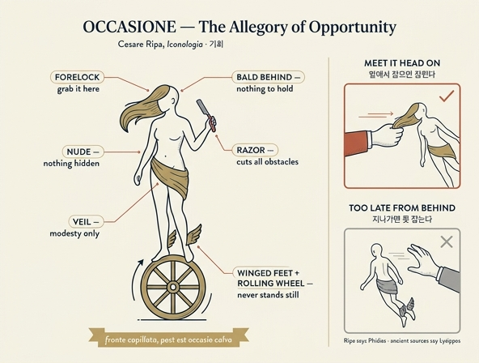

# 기회(Occasione) — 피디아스가 조각했다는 그 상(像)

**Q.** 피디아스가 조각한 '기회(Occasione)'의 모습은?

**A.** 음부만 베일로 가린 나체의 여인으로, 머리카락이 모두 이마 쪽으로 쏠려 뒷머리는 벗겨져 있고, 발에 날개가 달린 채 끊임없이 도는 바퀴 위에 서 있으며 오른손에 면도칼을 들었다.

---

## 1. 원문 확인 — 리파는 정확히 무엇이라 썼나

출처: 체사레 리파 『이코놀로지아』 제4권, `OCCASIONE.` 항목(에셋 `11 Oblivion to Omnipotence of God.md` 243행~). 항목 표제 아래 `Di Cesare Ripa`(원문 OCR `Di Cefare B^pa`)로 저자가 명시되어 있고, 뒤이어 `FATTO STORICO SAGRO`(성사적 사례) / `FATTO STORICO PROFANO`(세속사 사례) / `FATTO FAVOLOSO`(신화 사례) 세 절이 붙는 18세기 판본(체사레 오를란디 증보본) 체제다.

정의문(247행) 원문과 판독:

> Fidia antico, e nobiliſſimo Scultore, diſegnò l'Occaſione: Donna ignuda, con un velo attraverſo, che le copra le parti vergognoſe, e con i capelli ſparſi per la fronte, in modo che la nuca reſta tutta ſcoperta, e calva, con piedi alati, poſandoſi ſopra una ruota; e nella deſtra mano ha un raſojo.

> 고대의 가장 고귀한 조각가 피디아스가 '기회'를 이렇게 형상화했다. 벌거벗은 여인, 비스듬히 두른 베일 하나가 부끄러운 부분을 가리고, 머리카락은 모두 이마 쪽으로 흩어져 뒤통수(nuca)는 온통 드러나 벗겨져 있으며, 발에는 날개가 달렸고, 바퀴 하나 위에 올라서 있으며, 오른손에는 면도칼을 들었다.

리파 자신의 해설(249~251행):

- **이마 쪽 머리카락** — "기회는 길목에서 기다렸다가 **미리 앞질러 잡아야** 하며, 등을 돌린 뒤에는 따라가서는 안 된다(non seguirla, quando ha voltate le spalle). 기회는 빠르게 지나가기 때문이다."
- **날개 달린 발 + 바퀴** — "날개 달린 발로 **끊임없이 도는(perpetuamente si gira)** 바퀴 위에 올라서 있다."
- **면도칼(rasojo)** — "손에 면도칼을 든 것은 **온갖 종류의 방해물을 즉시 잘라내야 하기 때문이다**(deve essere subito a troncare ogni sorta d'impedimento)."

즉 답안의 여섯 요소(나체 / 음부를 가린 베일 / 이마로 쏠린 머리 + 벗겨진 뒷머리 / 날개 달린 발 / 회전하는 바퀴 / 오른손 면도칼)는 모두 리파 원문에 그대로 있다.

## 2. "피디아스"는 오류다 — 그러나 리파의 오류는 아니다

리파는 이어서 근거를 밝힌다(251행): "아우소니우스 시인이 **피디아스의 이 상(sopra quella statua di Fidia)**에 대해 — 그가 거기에 '참회(penitenza)'의 상까지 함께 새겼기에 — 두 상을 설명하는 아름다운 에피그램을 지었다." 그리고 라틴 에피그램 전문을 싣는다.

핵심은 **피디아스라는 이름이 리파의 착오가 아니라 아우소니우스(Decimus Magnus Ausonius, 4세기)의 텍스트에 이미 들어 있다**는 점이다. 에피그램 첫 행이 곧 `Cuius opus? Phidiae`("누구의 작품인가? — 피디아스의")이기 때문이다. 리파는 자기 시대의 표준 전거를 충실히 따랐을 뿐이다.

**그러나 고대의 원(原)전거는 리시포스를 지목한다.**

| 전거 | 조각가 | 소재지 | 상의 성별 |
|---|---|---|---|
| 포세이디포스 에피그램, 『그리스 사화집』 16.275 (플라누데스 사화집) | **리시포스(Lysippos)** | 시키온(Sikyon) | 남성 청년 카이로스(Καιρός) |
| 칼리스트라토스 『조각상론(Ἐκφράσεις)』 6 「시키온의 카이로스 상에 대하여」 | **리시포스** | 시키온 | 앳된 소년 |
| 아우소니우스 『에피그램』 33(구 번호, 그린 판 12) | **피디아스** | — | 여성 Occasio |
| 리파 『이코놀로지아』 OCCASIONE | **피디아스**(아우소니우스 인용) | — | 여성 |
| 알치아토 『엠블레마타』 121 「In occasionem」 | **리시포스, 시키온 출신** | — | (라틴어 Occasio) |

리시포스는 알렉산드로스 대왕의 전속 조각가로, 카이로스 청동상은 그의 고향 시키온 광장에 세워져 있었다고 전한다(현존하지 않으며 로마 시대 부조 모각으로만 짐작한다). 피디아스는 그보다 한 세기 앞선 아테네의 거장으로, 아테나 파르테노스와 올림피아의 제우스를 만든 사람이다. 아우소니우스의 에피그램이 바로 그 두 작품을 들먹이며 "팔라스 상과 유피테르 상을 만든 그 사람, 나는 그의 세 번째 걸작"이라 말하는 것을 보면, **로마 후기에 이미 '고대 최고 조각가 = 피디아스'라는 관용적 연상이 작동해 작자 귀속이 옮겨 붙은 것**으로 보인다. 흥미롭게도 알치아토(1531)는 사화집을 직접 참조해 리시포스로 바로잡았는데, 리파(1593/1603)는 아우소니우스 쪽 계보를 택했다.

> 정리하면 — **"기회의 상을 만든 사람이 피디아스"는 리파 책에 그렇게 적혀 있는 것이 맞고, 미술사적 사실로는 리시포스가 맞다.** 시험 답안으로는 "리파(=아우소니우스)는 피디아스라 하나 실제 전승은 리시포스"라고 병기하는 것이 정확하다.

## 3. 리파가 인용한 아우소니우스 에피그램

에셋 253~267행의 OCR은 훼손이 심하다(장음 s를 f로 읽는 오독, 활자 깨짐). 아래 왼쪽은 **OCR 그대로**, 오른쪽은 아우소니우스 표준 교정본에 따른 **복원(추정)**이다. 복원 부분은 원문 파일에서 직접 확인된 것이 아님을 밝혀 둔다.

| OCR (에셋 원문) | 복원된 라틴어 | 뜻 |
|---|---|---|
| `Cttjns opus ? ThidLt qui fgimnt Tdladis ? ejus` | Cuius opus? Phidiae, qui signum Palladis, eius | 누구의 작품인가? — 팔라스 상을 만든 그 피디아스, |
| `^iqHS ^ovem fecit t tenia palma ego funty` | quique Iovem fecit; tertia palma ego sum. | 유피테르를 만든 그 사람. 나는 그의 세 번째 걸작이다. |
| `Sur» Dea-, qu<e rara, c^ pattcis occajto nota .` | Sum dea quae rara et paucis Occasio nota. | 나는 드물게만, 소수에게만 알려진 여신 '기회'다. |
| `^ìd rotuU infiflis ? flare loco nequeo .` | Quid rotulae insistis? — Stare loco nequeo. | 왜 작은 바퀴를 딛고 섰나? — 한자리에 서 있을 수 없어서. |
| `^dd talaria habes ? votucris fum .` | Quid talaria habes? — Volucris sum. | 왜 날개 신을 신었나? — 나는 날아다니니까. |
| `Mercurm qux Fortmare jolet tardo ; ego cim 'udid` | Mercurius quae fortunare solet, tardo ego, cum volui. | 메르쿠리우스가 행운을 주는 일도, 내가 원하면 늦춘다. |
| `Crine te^is faciem ? cogmfci nolo .` | Crine tegis faciem? — Cognosci nolo. | 머리로 얼굴을 가렸나? — 알아보이기 싫어서. |
| `Occipiti calvo es ? ne tenear , fugiens .` | Occipiti calvo es? — Ne tenear, fugiens. | 뒤통수가 대머리인가? — 달아날 때 붙잡히지 않으려고. |
| `Sjj^ tiht jnnEla coma ?` | Quae tibi iuncta comes? | 곁에 붙은 저 동행은 누구냐? |
| `Sum Dea , cui nomen- nec Cicero ipfe dedit` | Sum dea cui nomen nec Cicero ipse dedit. | 나는 키케로조차 이름을 붙이지 못한 여신이다. |
| `Sum Dea , qus fallì non fa&iqne exigo panas` | Sum dea quae facti non factique exigo poenas | 나는 한 일과 하지 않은 일 모두에 벌을 물리는 여신, |
| `T^empe ut paniteat , jtc Metanxa vocor .` | nempe ut paeniteat: sic **Metanoea** vocor. | 곧 뉘우치게 하는 자다. 그래서 '메타노이아'라 불린다. |
| `H<ec manet , hanc retinent , qnos ego preterii .` | haec manet; hanc retinent, quos ego praeterii. | 내가 날아가 버리면 저 여신이 남는다. 나를 놓친 자들이 붙드는 건 저 여신이다. |
| `Elapfam dices me tihi de manibas .` | Elapsam dices me tibi de manibus. | 네가 묻고 따지며 머뭇거리는 사이, 내가 네 손에서 빠져나갔다고 말하게 되리라. |

여기서 리파 항목의 마지막 대목이 결정적이다. **기회를 놓친 자에게 남는 짝은 '메타노이아 = 후회/참회(Paenitentia)'**다. 리파가 "피디아스가 참회의 상도 함께 새겼다"고 한 것이 이 대목이며, 리파 책 안에서 `PENITENZA` 항목과 짝을 이룬다.

## 4. 속성별 의미와 포세이디포스 에피그램 대조

포세이디포스의 에피그램은 조각상과 나그네의 문답체 에크프라시스다. 리파의 여섯 속성이 각각 어디서 왔는지 대조하면 계보가 선명해진다.

| 리파의 속성 | 의미 | 포세이디포스 AP 16.275 | 아우소니우스 Ep. 33 |
|---|---|---|---|
| **나체(donna ignuda)** | 숨김도 방비도 없음 / 붙잡을 옷자락조차 없음 | (남성 나체 청년상) | — |
| **음부만 가린 베일(velo)** | 르네상스적 정숙 처리. 여성 인물상화의 부산물 | 없음 | 없음 (대신 "머리로 얼굴을 가림") |
| **이마로 쏠린 앞머리** | 마주 오는 순간에 **정면에서** 잡아야 함 | "왜 머리카락이 얼굴을 덮었나?" — "나와 마주치는 자가 **앞머리를 붙잡도록**" | "Crine tegis faciem? — Cognosci nolo"(알아보이기 싫어서) |
| **벗겨진 뒷머리(nuca calva)** | 지나간 뒤엔 잡을 데가 없음 | "왜 뒤통수는 민머리인가?" — "날개 달린 발로 한번 지나쳐 버리면, 아무리 원해도 뒤에서는 붙잡지 못하도록" | "Occipiti calvo es? — Ne tenear, fugiens" |
| **날개 달린 발(piedi alati)** | 빠름, 붙들 수 없음 | "왜 발에 날개가 있나?" — "바람을 타고 날아다니니까" | "Quid talaria habes? — Volucris sum" |
| **끊임없이 도는 바퀴(ruota)** | 멈추지 않음·불안정. **포르투나의 속성** | 원본은 바퀴가 아니라 **발끝으로 선 자세**(그리고 칼리스트라토스·체체스는 **구(球)** 받침을 전함) | "Quid **rotulae** insistis? — Stare loco nequeo" → **바퀴는 아우소니우스 단계에서 들어옴** |
| **오른손 면도칼(rasojo)** | 리파: 방해물을 즉시 잘라냄 / 원전: 그 어떤 날보다 예리함 | "왜 오른손에 면도칼을 들었나?" — "내가 **그 어떤 날붙이보다 날카롭다**는 표시로" | 없음(!) |

두 가지가 눈에 띈다.

1. **면도칼은 아우소니우스에 없다.** 리파는 아우소니우스만 인용해 놓고 정작 면도칼을 그린다. 즉 리파의 도상은 아우소니우스 + 포세이디포스(플라누데스 사화집, 1494년 인쇄되어 르네상스에 널리 유통) + 알치아토 엠블럼 전통의 **합성**이다.
2. **바퀴는 원작에 없다.** 리시포스의 카이로스는 발끝으로 선 자세이거나 구(球) 위에 섰다고 전하고, 바퀴는 본래 **포르투나(Fortuna)의 표지**다. 그 바퀴가 이미 4세기 아우소니우스의 `rotula`로 들어와 있고, 리파는 그것을 받아 "영원히 도는 바퀴"로 확대 해석했다.

## 5. 카이로스 → 오카시오 → 포르투나의 융합

이 도상의 역사는 개념이 언어를 건너며 성별과 소속을 바꾸는 전형적 사례다.

1. **그리스: 카이로스(Καιρός) — 남성.** '알맞은 때, 결정적 순간'. 크로노스(χρόνος, 흘러가는 양적 시간)와 대비되는 질적 시간. 리시포스의 청동상은 앳된 **남성 청년**이었고, 시키온 광장에 "교훈으로" 세워졌다.
2. **라틴: 오카시오(Occasio) — 여성.** 라틴어로 옮기면서 대응어 `occasio`가 **여성 명사**였기 때문에 인물상도 여성으로 바뀐다. 문법적 성이 도상의 성을 바꾼 것이다. 아우소니우스 『에피그램』 33이 이 전환의 결정적 고리로, 여기서 (a) 여성 여신 Occasio, (b) 바퀴(rotula), (c) 후회(Metanoea/Paenitentia)라는 짝 인물이 한꺼번에 확정된다.
3. **포르투나와의 혼입.** 바퀴·구·불안정하게 흔들리는 발판은 원래 운명의 여신 포르투나의 표지다. 중세·르네상스에서 Occasio와 Fortuna는 서로 속성을 주고받아, "앞머리만 있는 포르투나", "바퀴 위의 오카시오" 같은 혼성형이 흔해진다. 리파의 상은 정확히 그 융합의 결과물이다.
4. **결과.** 리파의 Occasione = 카이로스의 앞머리·민 뒤통수·날개·면도칼 + 포르투나의 바퀴 + 라틴어 문법이 만든 여성 나체 + 르네상스의 베일.

## 6. 속담이 된 도상

이 상은 서양에서 가장 널리 격언화된 알레고리다.

- **『디스티카 카토니스(Disticha Catonis)』 II.26**: `Rem tibi quam noris aptam dimittere noli: / fronte capillata, post haec occasio calva.` — "네게 맞는 일을 놓치지 마라. 기회는 **앞머리는 무성하나 뒤는 대머리**다." 중세 라틴어 교재의 필수 암송문이었고, 여기서 `occasio calva`(대머리 기회)라는 상투구가 나온다.
- **알치아토, 『엠블레마타』 「In occasionem」(엠블럼 121)**, 1531 초판 수록: `Lysippi hoc opus est, Sicyon cui patria... Cur in fronte coma? occurrens ut prendar. At heus tu, / dic cur pars calva est posterior capitis?` 알치아토는 포세이디포스를 직접 번안해 **리시포스**로 바로잡았다. 엠블럼북의 폭발적 유통 덕에 이 도상은 16~17세기 유럽의 공통 시각 상식이 되었고, 리파의 항목도 이 토양 위에 서 있다.
- **영어**: "Take occasion by the forelock", "Seize time by the forelock".
- **한국어**: "**기회의 앞머리를 잡아라**", "기회의 신은 앞머리만 있다", "카이로스의 머리카락" — 자기계발서·강연에서 흔히 인용되는 이 말이 바로 이 계보의 끝자락이다. 다만 국내 통용본은 대개 카이로스를 남성 청년으로 그리므로, **리파의 여성 나체 도상과는 다른 갈래**임을 구별해야 한다.

## 7. 르네상스 정치사상: 마키아벨리의 occasione

리파와 같은 이탈리아 담론권에서 이 개념이 가장 날카롭게 쓰인 곳은 마키아벨리다.

- 『군주론』 **6장**: 모세·키루스·로물루스·테세우스는 포르투나에게서 **오카시오네(기회)** 외에는 받은 것이 없다. "그 기회가 없었다면 그들 정신의 비르투는 소멸했을 것이고, 그 비르투가 없었다면 기회는 헛되이 지나갔을 것이다." — **기회(occasione)와 역량(virtù)의 상호 필요**라는 정식.
- 『군주론』 **25장**: 포르투나는 인간사의 절반을 지배하는 격류이며, 미리 제방을 쌓은 자만이 버틴다. 유명한 마지막 대목("포르투나는 여자이므로 과감하게 다루어야 한다")도 기회를 붙잡는 즉단(卽斷)의 수사다. **리파의 면도칼 = "모든 방해물을 즉시 잘라냄"**과 같은 정신적 지반 위에 있다.
- 마키아벨리는 아예 「기회에 관하여(Capitolo dell'Occasione)」라는 3운구 시를 썼는데, 아우소니우스 에피그램의 직접 번안이다. 앞머리로 얼굴을 가리고 발에 날개 달린 여인이 등장하고, 뒤에는 '후회'가 남는다.

## 8. 미술사 수용

- **만테냐(파) 「Occasio와 Poenitentia」**, 1495~1510년경 그리자유 벽화. 만테냐 또는 그 공방의 작품으로, 만토바의 팔라초 카브리아니 벽난로 위에 오래 있다가 1915~2002년 팔라초 두칼레에 전시되었고 현재는 **만토바 팔라초 산 세바스티아노**에 있다. 구(球) 위에 선 앞머리만 있는 오카시오와, 그를 놓친 남자를 붙드는 검은 옷의 포에니텐티아(후회)를 함께 그려 **아우소니우스 에피그램의 두 상 짝 구성을 그대로 시각화**한 사례다. 리파가 "피디아스가 참회의 상도 함께 새겼다"고 적은 그 구성이다.
- **알치아토 엠블럼북 목판화**(1531 이후 수많은 판본): 바다/물결 위에서 바퀴나 구를 딛고 면도칼을 든 인물. 독일에서 목판을 제작한 계열(한스 슈바이처, 외르크 브로이 등)이 널리 퍼졌다.
- 뒤러·발둥 계열 판화에 이 도상이 있다는 통설이 돌지만, 뒤러의 「네메시스(대운명, Das grosse Glück, c.1501~02)」는 구 위에 선 날개 달린 여성이되 **손에 잔과 재갈을 든 네메시스/포르투나**로, 앞머리·면도칼 도상과는 구별된다. 확실히 검증되지 않은 귀속은 피하는 편이 안전하다.

## 9. 리파 판본이 덧붙인 세 가지 예화

이 18세기 판본은 각 항목 뒤에 사례 셋을 붙인다. OCCASIONE 항목의 것들은 "기회"의 양면(잡음/놓침)을 보여 준다.

- **FATTO STORICO SAGRO (성사적 사례, 273~275행)** — 「사무엘상」 26장. 다윗이 잠든 사울을 죽일 절호의 기회를 얻고 아비새가 "하느님이 주신 기회"라 부추기지만, 다윗은 기름 부음 받은 왕에게 손대기를 거부하고 창과 물병만 가지고 나온다. **잡지 않는 것이 옳은 기회.**
- **FATTO STORICO PROFANO (세속사 사례, 277~279행)** — 칸나이 전투 후 한니발. 로마군 보병 4만과 기병 2700을 도륙하고 집정관 파울루스 아이밀리우스와 로마 귀족 대부분을 죽였으나, 곧장 로마로 진격하라는 **마하르발(Maharbal)**의 조언을 물리치고 군대를 쉬게 한다. 그 사이 로마는 새 군대를 편성했고 한니발은 끝내 몰락한다. **놓친 기회의 표본.**
- **FATTO FAVOLOSO (신화 사례, 281~283행)** — 마르스와 레아 실비아. 아물리우스가 베스타 여사제로 가둬 둔 레아 실비아가 티베리스 강가에서 잠든 순간을 마르스가 "이토록 좋은 기회를 알아보고 조금도 흘려보내지 않았다(non la trascurò punto)". 아홉 달 뒤 로물루스와 레무스가 태어난다(오비디우스 『로마의 축제들』). **놓치지 않은 기회.**

## 10. 암기 포인트

- 여섯 속성: **나체 / 음부의 베일 / 앞머리 무성·뒷머리 대머리 / 날개 달린 발 / 도는 바퀴 / 오른손 면도칼**
- 한 줄 요약: "**앞에서만 잡히고, 지나가면 못 잡는다. 그것도 아주 빨리, 결코 멈추지 않고 지나간다.**"
- 함정: 리파는 **피디아스**라 하나(아우소니우스 인용), 고대 전승의 조각가는 **리시포스**(시키온).
- 짝 인물: 놓친 기회 뒤에 남는 것은 **메타노이아 / 참회(Penitenza)**.

## 11. OCR 및 사실 확인 관련 주의

- 에셋 파일은 18세기 이탈리아어 활자(장음 ſ)를 OCR한 것이라 `f`/`ſ`, `l`/`i` 혼동이 광범위하다(`Cefare B^pa` = Cesare Ripa, `Auionio` = Ausonio, `rafojo` = rasojo, `Metanxa` = Metanoea). 위 3절의 라틴어 오른쪽 열은 **표준 교정본에 근거한 추정 복원**이며, 에셋 파일에서 직접 판독된 것이 아니다.
- 아우소니우스 에피그램의 번호는 판본에 따라 33(구 번호) / 12(그린 판)로 갈린다.
- 리시포스의 카이로스 원작은 현존하지 않으며, 받침이 구(球)였는지 발끝 자세였는지는 전거마다 다르다(칼리스트라토스·체체스가 구를 언급하는 예외적 전승).
- 11장 md에 포함된 이미지 3장(347/357/399행)은 Offerta·Offesa·Omicidio 항목의 삽화로, 이 카드와 무관하다.

## 인포그래픽

### 참고

- [Alciato at Glasgow — Emblem 121 "In Occasionem"](https://www.emblems.arts.gla.ac.uk/alciato/emblem.php?id=A91a121)
- [Callistratus, Descriptions 6: On the Statue of Opportunity at Sicyon (Loeb)](https://www.loebclassics.com/view/callistratus-descriptions_6_statue_opportunity_sicyon/1931/pb_LCL256.395.xml)
- [Posidippus, On a Statue of Kairos (AP 16.275) — 영역](https://www.literarymatters.org/16-3-posidippus-on-a-statue-of-kairos-caerus/)
- [Occasio and Poenitentia (Mantegna 파 그리자유) — Wikipedia](https://en.wikipedia.org/wiki/Occasio_and_Poenitentia)
- [Theoi Project — Kairos / Caerus](https://www.theoi.com/Daimon/Kairos.html)
