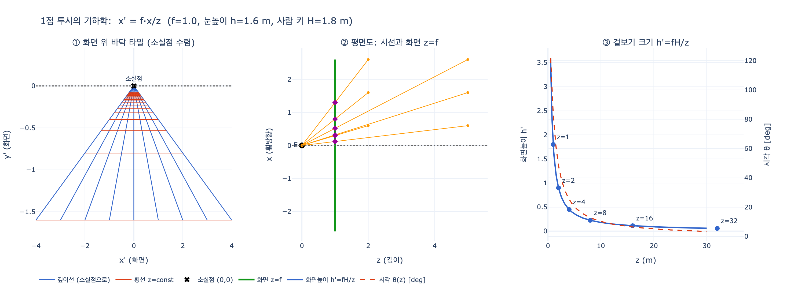

# 원근법 (PROSPETTIVA) — 체사레 리파의 의인화

> **Q.** 리파는 '원근법(Prospettiva)'을 어떻게 의인화했는가?
>
> **A.** 매우 아름답고 우아한 여인이 목에 사람 눈이 펜던트로 달린 금 목걸이를 걸고, 오른손에 컴퍼스·자·직각자·다림추·거울을, 왼손에 '프톨레마이오스'와 '비텔리오'라 쓰인 두 권의 책을 들었다. 옷은 발치가 어둡고 위로 갈수록 밝아진다. 원근법은 그리스어 '보다(optike)'에서 온 이름으로, 빛과 시각의 본성에서 나온 가장 고귀한 학문이다.

출처: `assets/17 Practice to Providence.md` 487행 이하 `# PROSPETTIVA.` / `#### Di Cesare Ripa.`

---

## 1. 원문 처방(descrizione)

원문(18세기 페루자판 OCR, 장음 s가 f로 읽힌 상태)을 정리하면 다음과 같다.

> **D**onna di bellissimo, e grazioso aspetto. Avrà al collo una collana di oro, che abbia per pendente un occhio umano. Tenga colla destra mano compasso, riga, squadra, piombo pendente, ed uno specchio; e nella sinistra due libri, colle iscrizioni di fuori, *Ptolomei*, ed all'altro *Vitellionis*. Nel vestimento appiedi sarà il colore oscuro; e di mano in mano ascendendo sarà più chiaro, tanto che da capo venga ad essere chiarissimo.

즉 처방은 **① 미모·우아한 여인 → ② 사람 눈 펜던트가 달린 금 목걸이 → ③ 오른손의 도구 다섯(컴퍼스·자·직각자·다림추·거울) → ④ 왼손의 두 책(프톨레마이오스, 비텔리오) → ⑤ 아래는 어둡고 위로 갈수록 밝아지는 옷**의 다섯 요소로 구성된다. 리파는 이어서 각 요소의 근거를 하나씩 해설한다.

## 2. 지물별 의미 — 원문 근거

### (1) 아름답고 우아한 얼굴 — 학문의 위계와 즐거움

> La Prospettiva è detta da' Greci **ὀπτική**, dal vedere; è **nobilissima scienza**, come sopra le matematiche, e le fisiche dimostrazioni, fondata, tratta dalla **natura, e proprietà della luce, e potenza visiva** … E' la Prospettiva … **dilettevole, e giocondissima**; e perciò si rappresenta di bello, e grazioso aspetto.

- **이름의 유래**: 그리스인들은 이 학문을 `ὀπτική`(optikē, '보는 것')라 불렀다. 즉 리파에게 *prospettiva*는 라틴어 *perspicere*(꿰뚫어 보다)의 번역어이면서, 실질적으로는 **광학(optics)** 그 자체다.
- **위계**: "수학적 논증과 자연학적(physica) 논증 **위에** 세워진 가장 고귀한 학문". 아리스토텔레스적 학문 분류에서 광학은 순수 수학과 자연학의 중간에 있는 *scientia media*(중간 학문)로 분류되었고, 리파는 그래서 이 학문을 최상위에 놓는다. "인간의 삶과 만물 전체에서 이보다 더 뛰어나고 더 놀라운 것은 없다"는 문장이 그 강조다.
- **미모의 근거**: 이 학문이 *dilettevole, giocondissima*(즐겁고 유쾌하다)이기 때문에 인물을 미인으로 그린다. 리파의 상투적 논법 — 학문의 정서적 성격을 얼굴로 옮긴다.

### (2) 사람 눈 펜던트가 달린 금 목걸이 — 시각(visus)이 이 학문의 정의(定義)

> Ha il pendente con l'occhio; perciocché **dal vedere ha la sua denominazione**, siccome quella, che sulle **spezie visibili, ed azione visoria** è tutta posta.

- 눈 펜던트는 (1)의 어원 설명을 그림으로 되풀이한다. 이름이 '보는 것'에서 왔으므로 이름표 대신 **눈**을 목에 건다.
- *spezie visibili*(가시적 형상, species visibiles)와 *azione visoria*(시각 작용)는 중세 광학의 전문 용어다. 대상에서 나온 *species*가 매질을 지나 눈에 도달해 상을 이룬다는 다종(multiplicatio specierum) 이론으로, 로저 베이컨·비텔로·페컴의 *perspectiva* 전통에서 가져온 어휘다. 즉 이 펜던트는 단순히 "눈=시각"이 아니라 **"이 학문의 전 내용이 가시적 종과 시각 작용에 놓여 있다"**는 이론적 선언이다.
- 금 목걸이는 학문의 고귀함(nobilissima)을 재질로 표시한다.

### (3) 컴퍼스·자·직각자·다림추 — 학문의 '조건과 작용'

> Per gli stromenti, si dimostra la **condizione, e le operazioni sue**.

리파는 도구를 한 줄로 뭉쳐 처리하지만, 각각은 원근법 실무에서 실제로 쓰이던 물건이다.

| 도구 | 원문 | 실제 기능 |
|---|---|---|
| 컴퍼스 | *compasso* | 거리 이등분·비례 이전(移轉), 축소 비율 작도 |
| 자 | *riga* | 시선(visual ray)·소실선을 직선으로 긋는 도구 |
| 직각자 | *squadra* | 화면(picture plane)에 대한 수직·수평 확보, 지평선과 직각 관계 |
| 다림추 | *piombo pendente* | 중력 수직선 = 화면의 진짜 수직축, 눈높이 설정 기준 |

핵심은 **원근법이 사변이 아니라 작도(作圖)로 검증되는 학문**이라는 점이다. 자·직각자·다림추는 유클리드 기하학의 작도 도구이면서 동시에 건축·측량 도구이므로, 원근법이 **기하학과 건축 실무의 교차점**에 있다는 사실을 지물로 못박는다. 리파가 쓴 "condizione, e le operazioni"(조건과 작용)라는 표현은 이 학문이 '무엇인가'(condizione)와 '무엇을 하는가'(operazioni)를 동시에 도구가 보여준다는 뜻이다.

### (4) 거울 — 직진광(luce retta)과 반사광(riflesso)

> **Nello specchio le figure rette si riflettono**; e perchè quella scienza **di luce retta, e di riflesso servendosi**, fa vedere di belle maraviglie; perciò in segno si è posto lo specchio.

- 거울은 도구 목록의 나머지와 성격이 다르다. 작도 도구가 아니라 **광학의 두 번째 분과를 대표하는 표지**다.
- 중세 *perspectiva*는 (a) 직진광 = **광학(optica/perspectiva)**, (b) 반사광 = **반사광학(catoptrica, de speculis)**, (c) 굴절광 = **굴절광학(dioptrica)**으로 나뉘었다. 리파의 "luce retta, e di riflesso"는 정확히 (a)+(b)의 짝이다. 프톨레마이오스 『광학』 3~4권과 비텔로 『Perspectiva』 5~9권이 다루는 주제가 바로 거울(평면·구면·원통·원뿔 거울)이다. 즉 **거울은 왼손의 두 책과 짝을 이루는 지물**이다.
- *belle maraviglie*(아름다운 경이) — 거울 마술, 왜상(anamorphosis), 카메라 옵스쿠라 같은 16~17세기 광학적 여흥까지 함축한다.

### (5) 프톨레마이오스와 비텔리오 — 두 권의 정전(canon)

> E risedendo le scienze ne' scritti de' famosi Uomini, si sono date a questa figura le **opere di due Autori**, che per aver di essa ottimamente trattato, sono per lei celebrati; onde per gli Autori tal scienza si rende molto ben manifesta.

리파의 논리: "학문은 유명한 사람들의 저술 안에 거주하므로", 학문을 알아보게 하려면 **그 학문의 정전 두 권**을 들려주면 된다.

- **`Ptolomei` = 클라우디오스 프톨레마이오스 『광학(Optica)』** (2세기). 그리스어 원본은 소실되고, 아랍어 번역을 거쳐 12세기 시칠리아의 에우게니우스가 라틴어로 옮긴 판본만 남았다(1권과 5권 끝부분 결락). 시각의 기하학, 양안시, 거리·크기 지각, 평면·곡면 거울의 반사, 굴절 실험을 다룬다. 중세·르네상스 광학의 최고 권위.
- **`Vitellionis` = 비텔로(Witelo, 1230년경–1280년 이후) 『Perspectiva』**. 실레지아 출신(라틴어로 *Vitellio*, *Vitello*, *Thuringopolonus*로 표기되며 이 어형 혼란 때문에 리파의 이탈리아어 표기도 '비텔리오네'가 되었다). 1270년대에 교황청 주변(비테르보)에서 집필. 내용의 대부분은 **이븐 알하이삼(알하젠) 『De aspectibus』**를 라틴 세계에 재편·전달한 것으로, 10권 구성 중 5~9권이 거울(반사)을, 10권이 굴절과 무지개를 다룬다.
- **왜 이 두 권이 한 쌍인가**: 1572년 바젤에서 프리드리히 리스너(Friedrich Risner)가 알하젠의 광학과 비텔로의 『Perspectiva』를 합본해 **『Opticae Thesaurus』**로 출판했고, 이것이 케플러·데카르트까지 읽힌 표준 광학 교재가 되었다. 리파가 1593/1603년에 글을 쓸 무렵 "프톨레마이오스 + 비텔리오"는 서점에서 살 수 있는 **광학의 정전 세트**였다. 그러니 이 두 책은 임의의 예시가 아니라 당대 독자가 즉시 알아볼 '학문 인증 라벨'이다.
- 중세 라틴 세계의 이 계보를 흔히 **perspectivists(원근법가/광학자)**라 부른다: 알하젠 → 로저 베이컨(*Perspectiva*), 비텔로(*Perspectiva*), 존 페컴(*Perspectiva communis*). 대학 교양과목으로 가르쳐진 것은 회화 기법이 아니라 이 광학이었다.

### (6) 아래는 어둡고 위로 갈수록 밝아지는 옷 — 명암과 공기원근법

> I colori nelle vesti variati da oscuro al chiaro, sono per dimostrare, che **le operazioni della Prospettiva si fanno col chiaro della luce, e con l'oscuro dell'ombra, con una certa graduazione, secondo le distanze, e riflessi**.

- 리파는 옷의 그라데이션을 **"거리와 반사에 따른 일정한 등급(graduazione)"**으로 설명한다. 이는 두 가지를 동시에 가리킨다.
  1. **명암법(chiaroscuro)**: 원근법의 작업은 선만이 아니라 빛과 그림자의 계조로 이루어진다.
  2. **공기원근법(prospettiva aerea)**: 레오나르도가 정식화한 대로, 멀어질수록 대비가 줄고 밝고 푸르게 변한다. 발치(가까운 곳)가 어둡고 위(먼 곳·하늘 쪽)가 밝아지는 배치는 이 규칙의 도상적 요약이다.
- 결과적으로 이 옷은 **원근법이 선원근법 + 색·명암 원근법을 모두 포함하는 학문**임을 몸 전체로 표시한다. 알베르티가 회화를 *circumscriptio*(윤곽)·*compositio*(구성)·*receptio luminum*(빛의 수용) 셋으로 나눈 것과 정확히 대응하는 강조점이다.

### (7) 당대 실천가에 대한 헌사

> … né manchino Uomini in ogni sorta di scienze, ed arti celebri, come nè anche in professione di Prospettiva, fra' quali è stato **M. Giovanni Alberti dal Borgo** … in ispecie quella di Pittura, fatta nella sala del nuovo palazzo nel Vaticano, detta la **Clementina**, in compagnia di **M. Cherubino**, vero suo fratello.

- **조반니 알베르티(Giovanni Alberti, 1558–1601)**와 형 **케루비노 알베르티(Cherubino Alberti)** — 보르고 산세폴크로 출신 형제 화가. 바티칸 **살라 클레멘티나(Sala Clementina)** 천장의 착시적 건축 장식(*quadratura*)을 1596~1600년경 제작했다.
- 리파가 실명을 든 이유: 원근법이 책 속의 이론에 그치지 않고 **바로 이 도시, 이 궁전의 천장에서 작동하는 기술**임을 독자에게 확인시키기 위해서다. 리파 자신이 로마에서 활동했으므로 독자가 직접 가서 볼 수 있는 사례를 골랐다.

## 3. 두 번째 판본 — 도구를 발밑에 둔 원근법

같은 항목 아래 리파는 훨씬 짧은 이형(異形)을 덧붙인다(501행 `#### Prospettiva.`).

> **D**onna, che con ambe le mani tiene una Prospettiva, ed a' piedi ha squadre, compassi, ed altri stromenti convenevoli a quell'arte; e siccome per rappresentare simil figura, non si può allontanare dalle cose istesse, così non bisogna molto studio per dichiararle; attesocchè elle medesime fanno noto quanto sopra ciò fa mestiero.

- 여인이 두 손으로 **'원근법 하나'**(= 원근법으로 그린 도면/투시도, 혹은 투시 작도 장치)를 들고, 발밑에 직각자·컴퍼스 등 도구를 둔다.
- 리파의 코멘트가 재미있다: "이런 인물을 표현할 때는 사물 자체에서 멀어질 수 없으므로, 설명에 많은 공부가 필요하지 않다. 그것들 스스로가 필요한 만큼을 알려주기 때문이다." — **자기지시적(self-referential) 알레고리**. 대개 리파의 지물은 우회적 은유이지만, 원근법은 도구와 도면 자체가 곧 정의이므로 해설이 필요 없다는 자백이다.

## 4. 이 '광학으로서의 perspectiva'와 르네상스 회화 원근법의 관계

리파의 항목을 읽을 때 가장 흔한 오해는 "원근법 = 브루넬레스키·알베르티의 회화 기법"이라고 전제하는 것이다. 리파의 처방은 오히려 그 앞 단계의 학문을 가리킨다.

**용어의 두 갈래**

| | perspectiva naturalis / communis | perspectiva artificialis / pingendi |
|---|---|---|
| 뜻 | 자연적·공통 원근법 = **광학** | 인공적 원근법 = **화가의 투시 작도** |
| 다루는 것 | 시각의 성립, 광선의 직진·반사·굴절, 착시, 무지개 | 화면 위에 3차원 공간을 사영하는 규칙 |
| 정전 | 유클리드·프톨레마이오스 『광학』, 알하젠, 비텔로, 베이컨, 페컴 | 알베르티 『회화론』, 피에로 『De prospectiva pingendi』, 비뇰라, 과르디 |
| 장소 | 대학의 교양·자연철학 | 공방(bottega), 궁정 |

**리파는 어느 쪽인가**: 어원(*optike*), "빛과 시각 능력의 본성", *spezie visibili*, *azione visoria*, 직진광과 반사광, 그리고 프톨레마이오스·비텔로 — 모두 왼쪽 열의 어휘다. 즉 리파의 Prospettiva는 **일차적으로 광학의 알레고리**다.

**그러나 두 갈래는 실제로 이어져 있었다**

1. **브루넬레스키(c. 1413경 시연)**: 피렌체 세례당 앞에서 판자에 구멍을 뚫고 거울로 그림과 실물을 비교하는 유명한 실험을 했다(마네티의 전기). 여기서 **거울**은 리파가 든 거울과 같은 계보의 도구다 — 광학적 검증 장치.
2. **알베르티 『회화론』(De pictura, 1435; 이탈리아어판 Della pittura, 1436)**: 눈에서 대상으로 뻗는 *visual pyramid*(시각 피라미드)를 화면으로 자른 단면이 그림이라는 정의("창문으로서의 그림"), 그리고 그 시각 피라미드 개념 자체를 광학 전통에서 가져왔다. 알베르티는 자신은 "화가로서 말한다"며 광선의 물리적 본성 논쟁은 유보하지만, 어휘와 기하학적 골격은 perspectivists의 것이다.
3. **피에로 델라 프란체스카 『De prospectiva pingendi』(c. 1470s)**: 제목이 문제를 정확히 표현한다 — '**회화의** perspectiva'라고 한정어를 붙여야 광학과 구별되었다.
4. **레오나르도**: 원근법을 선원근법·색원근법·소실원근법(사라짐)의 셋으로 나누어, 리파가 옷의 그라데이션으로 요약한 그 논점을 이론화했다.
5. 결과적으로 16세기 후반에는 두 뜻이 한 단어 안에 겹쳐 있었고, 리파의 인물은 그 중첩을 **한 몸에** 담는다: **눈 펜던트와 두 책은 광학**, **컴퍼스·자·직각자·다림추는 화가·건축가의 작도**, **거울은 두 세계를 잇는 검증 장치**, **명암 옷은 색채 원근법**. 살라 클레멘티나의 알베르티 형제를 언급한 대목이 바로 이 학문이 실제 그림으로 실현된 사례를 가리킨다.

## 5. 원본 판화

이 판본(마커 추출본)에는 **PROSPETTIVA 항목의 판화가 남아 있지 않다**. 해당 항목은 인쇄본 422면(`### 4ir ICONOLOGIA` = 422, 485행)에 있는데, `assets/17 Practice to Providence.md`가 참조하는 도판은 PDF 405·411·412·413·414·415·424·434면뿐이고, 이 항목이 위치한 PDF 428면 전후(425–433면)에서는 어떤 그림도 추출되지 않았다. 실제로 앞뒤 도판을 확인해 보면 PDF 424면 도판은 하단 캡션이 `Prodigalità`(낭비)로 다른 항목이고, 434면 것은 항목 삽화가 아닌 장식 컷(cul-de-lampe)이다. 따라서 **위 지물 설명과 대조할 수 있는 Prospettiva 판화는 asset에 없다.**

참고로 리파 삽화본 계열에서 Prospettiva 인물은 위 처방대로 그려진다 — 왼팔에 두 권의 책을 안고, 오른손에 컴퍼스와 거울류를 들고, 발밑이나 손에 직각자·다림추가 놓이며, 목의 원형 펜던트 안에 눈이 새겨진 형태다.

## 6. 암기 포인트

- **눈 = 이름**(optike, '보다') → 학문의 정의는 시각.
- **도구 4종(컴퍼스·자·직각자·다림추) = 작도**, **거울 = 반사광(catoptrica)**.
- **책 2권 = 프톨레마이오스 『광학』 + 비텔로 『Perspectiva』** → "학문은 유명한 이의 저술에 거주한다".
- **옷: 아래 어둡고 위로 밝음 = 명암/공기원근법**, "거리와 반사에 따른 계조".
- 리파의 Prospettiva는 회화 기법이 아니라 **광학**의 알레고리이며, 알베르티의 시각 피라미드를 통해 회화 원근법과 이어진다.

## 시각화

