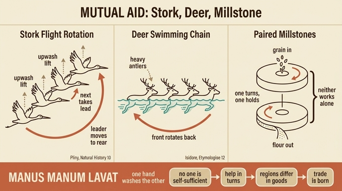

# 상호 필요(Necessità Vicendevole) 도상의 황새와 사슴

## 질문과 답

**질문**: 상호 필요 도상에서 황새와 사슴은 무엇을 보여주는가?

**답**: 플리니우스에 따르면 황새들은 긴 목이 지치면 뒤 새에 목을 기대고 지친 선두는 맨 뒤로 가서 기댄다. 이시도루스에 따르면 사슴들도 헤엄칠 때 뿔 무게로 지치면 앞 사슴의 엉덩이에 머리를 얹고 지친 선두는 뒤로 간다. 둘 다 '손이 손을 씻는다'는 격언처럼 서로 돕는 상호 부조의 상징이며, 지역마다 산물이 달라 교역(상업)이 생겨난 섭리로 이어진다.

---

## 1. 원전 텍스트: 리파는 무엇을 썼는가

리파(Cesare Ripa) 『이코놀로지아』의 **"NECESSITÀ VICENDEVOLE, O SIA COMMERCIO DELLA VITA UMANA"**(상호 필요, 즉 인간 삶의 교역) 항목은 다음과 같이 도상을 규정한다.

> Omo, che col dito indice della destra mano accenni ad una macina doppia, che gli stia accanto. Colla sinistra mano tenga una Cicogna, ed a' piedi un Cervo.
> — 오른손 집게손가락으로 옆에 놓인 **두 짝 맷돌**을 가리키고, 왼손에는 **황새**를 들고, 발치에는 **사슴**을 둔 남자.

이어지는 해설의 논리 구조는 3단이다.

1. **맷돌(macina doppia)** — 맷돌은 늘 둘이며 하나는 다른 하나가 필요하다. 혼자서는 결코 갈아내는 일을 할 수 없다("le macine sono sempre due, ed una ha bisogno dell'altra, e sole mai non possono fare l'opera di macinare"). 사람도 혼자서는 모든 것을 할 수 없다. 그래서 우리의 우정을 라틴어로 **necessitudines**(필연적 결속)라 부른다 — 이 단어 유희가 항목명 *Necessità*와 직결된다.
2. **황새와 사슴** — 자연이 보여주는 상호 부조의 실례. 황새는 플리니우스, 사슴은 이시도루스에서 끌어온다.
3. **격언 → 교역** — "손이 손을 씻는다"는 격언, 아리스토텔레스의 수입·수출론, 그리고 "이 세계의 大 주인"이 한 곳에 모든 것을 주지 않은 섭리로 이어져 **매매의 교환, 즉 인간 삶의 상업(Commercio della Vita umana)**이 결론이 된다.

주목할 점: **항목명 자체가 "상호 필요 = 인간 삶의 교역"**이다. 즉 이 도상은 처음부터 동물 우화가 아니라 **상업의 자연법적 정당화**를 위한 알레고리다. 리파는 말미에 "De' Fatti, vedi Mercanzia"(행위에 대해서는 '상품' 항목을 보라)라고 교차 참조까지 붙인다.

---

## 2. 플리니우스의 편대 비행 대목 — 정확한 위치와 원문

리파는 "così dice Plinio lib. 10. cap. 22."라고 출전을 밝힌다. 그런데 확인해 보면 사정이 조금 복잡하다.

### (a) 리파가 실제로 묘사한 대목은 거위·백조 편이다

목을 앞 새에 얹고 지친 선두가 뒤로 물러나는 대목은 **『박물지』 10권 32장 §63** (근대 판본 기준, Loeb Book X, ch. XXXII)의 **거위(anseres)와 백조(olores)** 항목에 있다.

> **colla inponunt praecedentibus, fessos duces ad terga recipiunt.**
> — 그들은 앞선 새들에게 목을 얹고, 지친 선두들을 뒤쪽으로 받아들인다.

같은 문단의 앞부분은 편대의 공기역학까지 언급한다.

> Liburnicarum more rostrato impetu feruntur, facilius ita findentes aëra quam si recta fronte impellerent; a tergo sensim dilatante se cuneo porrigitur agmen.
> — 그들은 **리부르나 전함(경쾌한 갤리선)처럼 뾰족한 뱃부리 모양으로** 나아간다. 그렇게 하면 일자로 밀고 나갈 때보다 공기를 더 쉽게 가른다. 뒤쪽으로 쐐기(cuneus)가 서서히 벌어지며 행렬이 뻗어 나간다.

### (b) 두루미(grues) 대목은 '선두 선출'과 '교대'를 말한다

『박물지』 10권 30장 §58–59의 두루미 항목.

> volant ad prospiciendum alte, **ducem quem sequantur eligunt**, in extremo agmine **per vices** qui adclament dispositos habent.
> — 그들은 멀리 보기 위해 높이 날고, **따를 지도자를 선출하며**, 행렬 맨 끝에는 **교대로** 소리쳐 무리를 붙잡아 두는 새들을 배치한다.

> excubias habent nocturnis temporibus lapillum pede sustinentes, qui laxatus somno et decidens indiligentiam coarguat.
> — 밤에는 **발에 작은 돌을 쥔 파수병**을 둔다. 졸음에 힘이 풀려 돌이 떨어지면 그것이 태만을 고발한다.

### (c) 황새(ciconiae)는 정작 편대 이야기가 없다

『박물지』 10권 31장의 황새 항목은 **정해진 장소에 집결해 법으로 정한 날짜처럼 일제히 떠난다**는 것, 그리고 어디서 오고 어디로 가는지 아직 알려지지 않았다는 것을 말할 뿐, **목을 얹거나 선두를 교대한다는 서술이 없다**.

**정리하면**: 리파가 "플리니우스가 황새에 대해 말했다"고 한 것은 엄밀히 말해 **출전의 이중 오류**다. (i) 동물이 바뀌었고(거위·백조 → 황새), (ii) 장 번호도 근대 판본과 맞지 않는다(리파의 "cap. 22"는 그가 쓴 16–17세기 판본의 장 구분에 따른 것으로, 근대 판본의 32장에 해당하지 않는다). 이는 리파를 깎아내리는 근거가 아니라 **르네상스 도상학의 작업 방식**을 보여주는 표본이다 — 리파는 플리니우스를 직접 통독한 것이 아니라 중세 동물지(bestiarium)와 상징집(가령 발레리아노의 『히에로글리피카』, 엠블럼 서적들)을 거쳐 전승된 2차·3차 인용을 이어받았고, 그 과정에서 '충직한 효성의 새'라는 강한 도덕적 이미지를 이미 가지고 있던 **황새**가 거위·백조의 자리를 대체한 것이다.

### (d) 고대 자연사에서 이 관찰의 도덕적 용도

플리니우스의 새 편대 서술은 처음부터 '중립적 관찰'이 아니었다. 로마 문헌의 관용어가 그대로 쓰인다 — *agmen*(군대의 행군 열), *dux*(지휘관), *excubiae*(야간 위병소), *per vices*(교대 근무), *indiligentia*(군율 위반으로서의 태만). 즉 플리니우스는 **새 떼를 잘 규율된 로마 군단으로 묘사**한다. 자연 속에 이미 질서·복종·교대 근무·감시가 존재한다는 것이고, 인간의 정치적 덕은 자연을 모방한 것이라는 논증이 여기서 나온다. 후대 전통은 여기서 두 가지를 뽑아 썼다.

- **두루미의 파수병** → 경계(Vigilanza) 알레고리. 리파 자신도 다른 항목에서 이 돌 쥔 두루미를 쓴다.
- **선두 교대** → 상호 부조·정치적 우애. 본 항목이 여기에 해당한다.

---

## 3. 이시도루스의 사슴 대목

세비야의 이시도루스 『어원론(Etymologiae)』 **12권 1장 18절**(가축·야수 편, cervi 항목).

> Si quando inmensa flumina vel maria transnatant, **capita clunibus praecedentium superponunt**, sibique invicem succedentes **nullum laborem ponderis sentiunt**.
> — 광대한 강이나 바다를 헤엄쳐 건널 때면, 그들은 **앞선 것들의 엉덩이에 머리를 얹고**, 서로 번갈아 뒤를 이어 가므로 **무게의 수고를 전혀 느끼지 않는다**.

핵심 어구는 **sibique invicem succedentes**(서로 번갈아 뒤를 이어)이다. 리파의 이탈리아어 *vicendevole*(상호적)와 라틴어 *invicem*이 같은 어근이며, 이시도루스 문장이 **항목명 자체의 어휘적 출처** 역할을 한다. 리파는 여기에 플리니우스 쪽 모티프를 이식해서 "il primo quando è stracco, passa dietro"(선두가 지치면 뒤로 간다)를 덧붙였다 — 이시도루스 원문에는 선두 교대가 명시되지 않고 "번갈아"만 있다.

부기: 이시도루스가 든 이유는 **뿔의 무게**가 아니다. 원문은 헤엄칠 때 머리를 들고 있기 힘든 부담 일반을 말한다. 뿔 무게라는 설명은 후대 동물지 전통이 붙인 합리화이고, 리파는 그 판본을 받았다("per il peso delle corna"). 참고로 실제로는 헤엄치는 사슴은 대부분 뿔이 없는 암사슴·새끼를 포함하며, 수사슴은 뿔을 매년 떨군다.

---

## 4. 실제 동물행동학: 고대의 관찰은 어디까지 옳았나

이 대목은 "옛사람들의 미신"으로 일축할 수 없다. 상당 부분이 현대 공기역학·행동생태학으로 **검증되었다**. 옳았던 지점과 과장된 지점을 구분해 보자.

### 옳았던 지점 ①: V자 편대는 실제로 에너지를 절약한다

- **Weimerskirch et al., *Nature* 409 (2001), "Energy saving in flight formation"** — 사람 손에 각인(imprinting)되어 초경량기를 따라 나는 큰흰펠리컨 8마리의 등에 심박 모니터를 붙여 측정. 편대 밖에서 나는 개체가 심박수와 날갯짓 빈도가 모두 높았고, 편대 비행 시 **총 11.4–14.0%의 에너지 절약**이 확인되었다. 주된 기제는 상승기류 자체보다 **활공 시간 비율의 증가**였다.
- 플리니우스의 *rostrato impetu ... facilius findentes aëra*("뱃부리 모양으로 공기를 더 쉽게 가른다")는 기제 설명으로는 틀렸지만(공기를 '가르는' 것이 아니라 날개끝 소용돌이의 상승 성분을 타는 것), **"편대가 비행을 쉽게 만든다"는 결론 자체는 맞았다.**

### 옳았던 지점 ②: 상승기류(upwash) 활용은 정밀하게 조율된다

- **Portugal et al., *Nature* 505 (2014) 399–402, "Upwash exploitation and downwash avoidance by flap phasing in ibis formation flight"** — 재도입 개체군의 붉은뺨흑따오기(*Geronticus eremita*)에 고정밀 GPS·IMU 로거를 달아 위치와 날갯짓 위상을 동시 기록. 결과: V자 위치의 새들은 앞 새 날개끝이 만드는 **상승기류 영역에 공기역학적 최적 위치를 잡고**, 날개끝 궤적이 **공간적으로 동위상(in phase)**이 되도록 날갯짓을 맞춰 상승기류 포획을 극대화한다. 반대로 바로 뒤(직후류)에 놓이면 하강기류(downwash)를 피하려고 **역위상(anti-phase)**으로 전환한다.

### 옳았던 지점 ③: 선두 교대와 '호혜'는 실제로 관측된다

- **Voelkl et al., *PNAS* 112 (2015), "Matching times of leading and following suggest cooperation through direct reciprocity during V-formation flight in ibis"** — 같은 따오기 개체군. 선두는 상승기류 이득을 볼 수 없으므로 "누가 앞에 서느냐"는 **사회적 딜레마**가 된다. 관측 결과, 개체들은 **선두에 선 시간과 남의 후류에서 이득 본 시간을 쌍(pair) 단위로 거의 정확히 맞추었다** — 즉 잦은 쌍별 선두 교체를 통한 **직접 호혜(direct reciprocity)**의 증거다.

이것은 리파의 문장 "il primo quando è stracco, passa dietro"(지친 선두가 뒤로 간다)와 놀랍게도 같은 구조다. 고대의 서술은 **관찰 사실로서 절반 이상 옳았다.**

### 과장·오류인 지점

| 고대의 서술 | 현대적 평가 |
|---|---|
| 새가 **앞 새 몸에 목/머리를 물리적으로 얹는다** | **틀림.** 편대의 개체 간 간격은 날개폭 단위이며 신체 접촉은 없다. 이득은 공기역학적이고 원격이다. 고대 서술은 '뒤에 붙어 편하게 간다'는 시각적 인상을 접촉으로 오독한 것. |
| 사슴이 **앞 사슴 엉덩이에 머리를 얹고 헤엄친다** | **거의 확실히 틀림.** 사슴은 부력이 좋고 목을 세워 헤엄치며, 줄지어(single file) 건너는 모습은 흔하지만 머리를 얹지는 않는다. 다만 '앞 개체가 만든 물길을 따라가는 것이 편하다'는 점은 순록의 눈길 이동 등에서 유효하다. |
| **뿔의 무게** 때문에 지친다 | 후대의 합리화. 이시도루스 원문에 없다. |
| 새들이 **선두를 '선출한다'(eligunt)** | 의도적 선출이 아니라 **자기조직화**. 다만 결과적 교대와 시간 균형은 실재(Voelkl 2015). |
| **의식적 이타심**으로서의 상호 부조 | 기제는 호혜적 이득 균형이며, 도덕적 동기를 함축하지 않는다. 고대·근세는 여기에 윤리적 의미를 덧씌웠다(도덕화된 자연사, moralized natural history). |
| 두루미의 **돌 쥔 파수병** | 순수한 민간 전승. 근거 없음. |

요약하면 고대인은 **현상(편대·교대·이득)을 맞게 보고 기제(접촉·의도·선출)를 틀리게 설명**했다. 리파가 이를 도덕 논증에 쓴 것은 그 시대 기준으로는 최선의 자연 지식을 동원한 것이었다.

---

## 5. 격언: manus manum lavat

리파는 격언을 라틴어 연쇄로 인용한다.

> **Manus manum lavat, & digitus digitum; Homo hominem servat, Civitas civitatem.**
> — 손이 손을 씻고 손가락이 손가락을 씻는다. 사람이 사람을 지키고, 도시가 도시를 지킨다.

리파는 이를 "그리스인에게서 가져온 격언(proverbio tolto da' Greci)"이라 정확히 밝힌다. 계보는 다음과 같다.

- **그리스 원형** — 희극 시인 **에피카르모스(Epicharmus of Kos, 기원전 6–5세기)**의 시행. 위(僞)플라톤 『악시오코스(Axiochus)』에서 소크라테스가 소피스트 프로디코스에게 "이 시행이 늘 그의 입에 있었다"며 인용한다: **ἡ δὲ χεὶρ τὴν χεῖρα νίζει· δός τι καὶ λάβοις τι** — "손이 손을 씻는다. 무언가를 주면 무언가를 받게 될 것이다."
- **로마의 라틴어화** — 1세기에 두 곳에서 나타난다. **세네카 『아포콜로킨토시스』**(에피카르모스 시행의 번역으로 삽입)와 **페트로니우스 『사티리콘』 45장**(트리말키오 만찬의 검투사 잡담 중, 지극히 구어적인 용법). 이 출전 조합이 중요한데, **애초부터 이 격언은 고결한 우애만이 아니라 '뒷거래·짬짜미'의 뉘앙스를 동시에 가지고 있었다.** 페트로니우스의 맥락은 노골적으로 후자다.
- **르네상스의 정전화** — **에라스뮈스 『아다지아』 I.i.33**, 표제어 *Manus manum fricat*(손이 손을 문지른다). 에라스뮈스는 『악시오코스』의 에피카르모스 인용을 제시하고, *lavat*(씻는다) 형태를 동등한 이형으로 함께 다루며 "문지르든 씻든 상호 이익이 있으므로 두 은유가 똑같이 타당하다"고 주석한다. 『아다지아』는 1500년 초판 이후 유럽 지식인의 공통 인용 창고였고, **리파가 이 격언을 이 형태로 알고 있었던 경로는 거의 확실히 에라스뮈스다.** 『아다지아』 제1권 제1장의 앞머리 항목들이 모두 '우애와 공동체' 주제로 배열되어 있다는 점(I.i.1 *Amicorum communia omnia*, I.i.2 *Amicitia aequalitas* 등)도 리파의 사용과 잘 맞는다.

『아다지아』가 격언 계보의 허브라는 사실은 리파 읽기의 일반 원칙을 시사한다 — **리파의 라틴어 인용은 고전 원전 독서가 아니라 에라스뮈스적 격언집·엠블럼집 인프라를 경유한 것으로 보아야 한다.**

---

## 6. 왜 상호 부조에서 교역·상업으로 넘어가는가

리파의 논증은 자연사에서 경제학으로 직진한다. 단계를 분해하면 이렇다.

1. **개인의 불완전성** — "un Uomo per se stesso non può ogni cosa"(사람은 혼자서는 모든 것을 할 수 없다). 맷돌 두 짝, 황새, 사슴이 모두 이 명제의 시각적 증명이다.
2. **호혜의 원리** — *manus manum lavat.* 스케일이 확장된다: 손↔손 → 사람↔사람 → **도시↔도시**(*Civitas civitatem*). 이 마지막 확장이 결정적이다. 개인 윤리의 원리가 그대로 **국제 관계의 원리**로 승격된다.
3. **아리스토텔레스의 권위** — 리파는 "아리스토텔레스가 심의(configlio)의 다섯 가지 사안 중 네 번째에 **De iis quae importantur, & exportantur**(수입되고 수출되는 것들)를 놓았다"고 한다. 이는 **『수사학』 1권 4장(1359b–1360a)**의 정치 연설 심의 주제 목록이다: ① 재정·세입, ② 전쟁과 평화, ③ 국토 방위, ④ **수입과 수출**, ⑤ 입법. 리파의 "네 번째"는 정확하다. 교역은 아리스토텔레스에게서 이미 **국가 심의의 정규 항목**이었으므로, 리파는 상업을 국가 이성의 정당한 대상으로 못 박는다.
4. **섭리 논증(providential argument)** — 논증의 정점.

> perchè il Gran Maestro di questo Mondo, molto saggiamente ha fatto, che non ha dato ogni cosa ad un luogo; imperocché ha voluto che tutta questa Università si corrisponda con proporzione; che abbia bisogno dell'opera dell'altro; e per tal bisogno una Nazione abbia occasione di trattare, ed accompagnarsi coll'altra; onde n'è derivata la permutazione del vendere, e del comprare, e si è fatto tra tutti il Commercio della Vita umana.
> — 이 세계의 大 주인께서 지극히 지혜롭게도 **한 곳에 모든 것을 주지 않으셨다**. 그분은 이 온 우주가 비례에 따라 서로 상응하기를, 각자가 남의 일을 필요로 하기를 원하셨다. 그 필요 때문에 한 **민족(Nazione)**이 다른 민족과 교섭하고 동행할 계기를 갖는다. 여기서 팔고 사는 교환이 파생되었고, 그리하여 만인 사이에 **인간 삶의 상업**이 성립했다.

즉 **산물의 지역적 불균등 분포는 결핍이 아니라 설계**다. 신은 각 지역을 자족적으로 만들 수 있었으나 일부러 그렇게 하지 않았다. 결핍이 필요를 낳고, 필요가 교섭을 낳고, 교섭이 매매를 낳고, 매매가 인류의 유대를 낳는다. **따라서 상업은 타락한 탐욕의 소산이 아니라 신적 섭리의 도구다.**

### 이 논증의 근세적 맥락

이 추론은 리파의 창작이 아니라 근세 초 유럽의 핵심 이데올로기적 자원이었다.

- **고대 원형** — 4세기 수사학자 **리바니오스**의 연설에 이 논증의 고전적 정식이 있다: 신은 모든 산물을 땅의 모든 부분에 주지 않고 지역마다 나누어 배분하셨으니, 이는 사람들이 서로의 도움을 필요로 함으로써 **사회적 관계를 일구게** 하기 위함이다.
- **그로티우스** — **『자유해론(Mare Liberum, 1609)』 1장**에서 그로티우스는 바로 이 **리바니오스 대목을 인용해** 자유 통항·자유 통상권을 논증한다. "모든 민족은 다른 모든 민족에게 가서 교역할 자유가 있다"는 명제의 신학적 뒷받침이 이 섭리 논증이다. 그로티우스가 이 논증을 쓴 실질 목적은 **네덜란드 동인도회사의 아시아 항행권을 포르투갈의 독점 주장에 맞서 방어**하는 것이었다. 즉 리파와 같은 시대(『이코놀로지아』 확장판 시기)에 같은 논증이 **제국 간 통상 분쟁의 법적 무기**로 쓰였다.
- **비토리아와 살라망카** — 프란시스코 데 비토리아의 *De Indis*에서도 통상권(ius commercii)이 자연법상 권리로 다뤄진다. 이 계열의 논증은 스페인의 신세계 진출을 정당화하는 데도 동원되었다.
- **17–18세기로의 연장** — 이 섭리적 상업론은 **"온화한 상업(doux commerce)"** 담론(몽테스키외 『법의 정신』, 상업이 국가를 문명화하고 전쟁을 억제한다)과, 나아가 **비교우위**라는 경제학적 관념의 전(前)이론적 조상 격이다. 리카도의 비교우위는 리파의 "한 곳에 모든 것을 주지 않았다"를 신학 없이 다시 쓴 것으로 읽을 수 있다.
- **양면성** — 이 논증은 평화적 호혜를 노래하지만 실제로는 **원치 않는 상대에게 시장을 열도록 강제하는 근거**로도 쓰였다("교역할 권리"는 상대가 거부하면 개입의 명분이 된다). 상호 부조의 아름다운 알레고리 뒤에 근세 유럽 팽창의 법적 장치가 놓여 있다는 점은 이 도상을 읽을 때 함께 보아야 한다.

『이코놀로지아』가 **상인 후원자·시청사·상업 길드**의 장식 프로그램에 실제로 쓰였다는 점을 생각하면, 이 항목은 단순한 도덕 우화가 아니라 **상업 계급의 자기 변호를 위한 이미지 설계도**다.

---

## 7. 판화 읽기

판화에서 실제로 관찰되는 요소들을 텍스트와 대응시켜 보자.

**중앙의 남자** — 짧은 튜닉에 어깨 망토(무늬 있는 케이프)를 걸치고 각반을 두른, 귀족이 아닌 **일하는 사람 / 여행하는 사람** 차림이다. 우의(寓意) 인물이 여신이나 왕이 아니라 평범한 남자라는 선택 자체가 의미심장하다 — 이 알레고리는 신적 미덕이 아니라 **인간 사회의 작동 조건**을 다루기 때문이다. 시선은 아래를 향해 발치의 사슴과 맷돌 쪽으로 떨어진다.

**오른쪽 아래의 맷돌(macina doppia)** — 두 개의 원반형 돌이 **위아래로 겹쳐 놓여** 있고, 위 돌 중앙에 곡물 투입구 구멍(눈)이 뚜렷하다. 아래 돌은 어둡게 음영 처리되어 두 개임이 확실히 구분된다. 텍스트의 "맷돌은 늘 둘이며 하나만으로는 결코 갈 수 없다"가 그대로 시각화된 것이다. 위치도 의미가 있다 — 인물의 **발 바로 옆 땅에** 놓여 있어, 상호 의존이 사변이 아니라 **일상 노동의 기반**이라는 함의를 준다. 리파의 규정("오른손 집게손가락으로 맷돌을 가리킨다")과 비교하면, 이 판본의 인물은 손가락을 뻗은 지시 동작이 다소 약화되어 오른팔이 몸통 앞으로 내려와 있다. 판화가가 서술을 자유롭게 재해석한 부분이다.

**왼팔에 안긴 황새** — 새는 **길고 뾰족한 부리와 매우 긴 목**이 강조되어, 몸통은 사람 팔에 안겨 있는데 목이 아래로 크게 휘어 내려온다. 이 **꺾인 목선**이 회화적 핵심이다. 텍스트가 말하는 "황새는 목이 높아서 오래 날면 지치고 머리를 지탱할 수 없다"를 한 몸에 압축해 보여준다 — 즉 판화는 편대를 그리는 대신 **'지탱할 수 없는 목' 하나로 서사를 대표**시킨다. (자연사적으로 부리 형태는 황새보다 따오기·저어새 쪽에 가까운데, 이는 앞서 본 출전 혼동 — 거위·백조 → 황새 — 의 시각적 연장으로 볼 수 있다.)

**왼쪽 아래 땅에 엎드린 사슴** — 뿔(가지 뿔)이 분명히 표현되어 있고, **머리를 땅바닥 쪽으로 낮게 늘어뜨린** 자세다. 텍스트의 "뿔의 무게 때문에 곧 지쳐 머리를 지탱하지 못한다"가 여기에 대응한다. **황새의 꺾인 목과 사슴의 처진 머리가 화면에서 같은 방향의 하강 대각선**을 이루며 시각적으로 짝을 맺는다. 둘 다 "혼자서는 머리를 들 수 없다"는 하나의 명제를 반복한다.

**오른쪽 배경** — 나무와 언덕, 열린 풍경. 텍스트의 "바다나 큰 강을 건넌다", "한 민족이 다른 민족과 교섭한다"는 **이동·왕래의 함의**를 배경 풍경이 뒷받침한다.

**구성의 논리** — 세 지물이 인물을 축으로 **왼쪽(사슴, 낮게) — 중앙(황새, 높게) — 오른쪽(맷돌, 낮게)** 삼각 배치를 이룬다. 살아 있는 두 예시가 위계 없이 좌우에 놓이고, 무생물인 맷돌이 그 원리를 요약한다. 세 요소 모두 **"쌍/연쇄가 아니면 기능하지 못한다"**는 동일 명제의 다른 판본이며, 판화는 그 명제를 세 번 다른 재료로 진술하는 방식으로 작동한다.

---

## 8. 한눈에 정리

| 지물 | 출전 | 관찰 내용 | 뜻하는 것 |
|---|---|---|---|
| 두 짝 맷돌 | (사물 상징) | 맷돌은 늘 둘, 하나만으로 갈 수 없다 | 상호 의존의 원리 자체 |
| 황새 | 리파는 플리니우스 『박물지』 10.22로 인용 / 실제로는 10.32.63의 거위·백조 | 목이 지치면 뒤 새에 기대고, 지친 선두는 맨 뒤로 | 교대하는 상호 부조 |
| 사슴 | 이시도루스 『어원론』 12.1.18 | 헤엄칠 때 앞 사슴 엉덩이에 머리를 얹고 번갈아 이어 간다 | 짐을 나누는 연쇄 |
| 격언 | 에피카르모스 → 세네카/페트로니우스 → 에라스뮈스 『아다지아』 I.i.33 | *Manus manum lavat* | 호혜, 손↔손에서 도시↔도시로 |
| 결론 | 아리스토텔레스 『수사학』 1.4 + 섭리 논증(리바니오스 → 그로티우스 계열) | 신은 한 곳에 모든 것을 주지 않았다 | **교역 = 인간 삶의 상업** |

**기억할 한 줄**: 맷돌 두 짝·기대는 황새·머리를 얹는 사슴은 모두 "혼자서는 머리를 들 수 없다"는 같은 말이며, 리파는 이 상호 부조를 곧바로 **"한 곳에 모든 것을 주지 않은" 신의 섭리 = 교역의 필연성**으로 밀어붙인다.

---

## 참고

- Pliny the Elder, *Naturalis Historia* 10.30 §58–59 (grues), 10.31 (ciconiae), 10.32 §63 (anseres/olores) — [LacusCurtius 라틴어 원문](https://penelope.uchicago.edu/Thayer/L/Roman/Texts/Pliny_the_Elder/10*.html), [Rackham 영역](https://en.wikisource.org/wiki/Natural_History_(Rackham,_Jones,_%26_Eichholz)/Book_10)
- Isidore of Seville, *Etymologiae* 12.1.18 — [The Latin Library](https://www.thelatinlibrary.com/isidore/12.shtml)
- Erasmus, *Adagia* I.i.33 *Manus manum fricat* — [Adagia 개요](https://en.wikipedia.org/wiki/Adagia), [출전 논의](https://sententiaeantiquae.com/2018/07/04/one-hand-washes-the-other/)
- H. Weimerskirch et al., "Energy saving in flight formation", *Nature* 409 (2001) — [Nature](https://www.nature.com/articles/35099670)
- S. J. Portugal et al., "Upwash exploitation and downwash avoidance by flap phasing in ibis formation flight", *Nature* 505 (2014) 399–402 — [Nature](https://www.nature.com/articles/nature12939)
- B. Voelkl et al., "Matching times of leading and following suggest cooperation through direct reciprocity during V-formation flight in ibis", *PNAS* 112 (2015) — [PNAS](https://www.pnas.org/doi/10.1073/pnas.1413589112)
- Hugo Grotius, *Mare Liberum* (1609), ch. 1 — [Peace Palace Library](https://peacepalacelibrary.nl/publication/grotius-h-mare-liberum-1609)

---

## 인포그래픽

