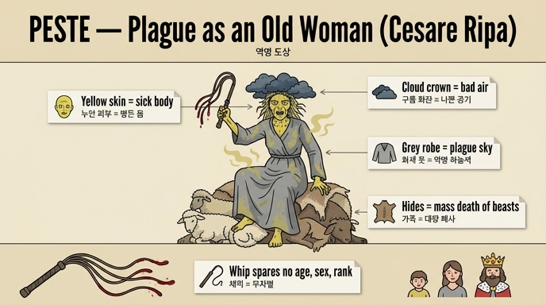

# 두 번째 '역병(Peste, o Pestilenza)' 도상 — 채찍 든 노파

체사레 리파(Cesare Ripa)의 『이코놀로지아(Iconologia)』는 '역병(PESTE, OVVERO PESTILENZA)' 항목에 두 가지 의인상을 싣는다. 첫 번째는 어두운 황갈색 옷을 입고 늑대를 곁에 둔 여인이고, **두 번째가 이 카드의 대상인 '채찍 든 노파'**다. 원문(토모 4, 374–375쪽)의 묘사와 리파 자신의 해설을 요소별로 정리하면 다음과 같다.

## 도상의 구성 요소와 상징 해설

| 시각 요소 (원문 묘사) | 상징 의미 (리파의 해설) |
|---|---|
| **야위고 무서운 노파** (vecchia, macilente, e spaventevole) — 머리는 산발(scapigliata) | 역병 자체가 늙음·수척함처럼 "보기에 불쾌한" 것이듯, 역병은 그 추하고 음울한 겉모습 때문에 보편적으로 끔찍하고 혐오스러운 것임을 나타낸다. |
| **누런 피부** (carnagione gialla) | 몸의 감염(le infezioni de' corpi)을 보여준다. 누런 색은 **건강하지 못한 병든 몸에서만 나타나는 색**이기 때문이다. |
| **어두운 구름의 화관** (ghirlanda di nuvoli oscuri) | 역병이 **하늘과 나쁜 상태의 공기(aria mal condizionata)의 고유한 산물**임을 보여준다. 당시의 미아즈마(나쁜 공기) 병인론이 그대로 반영된 요소. |
| **회색(bigio) 옷, 누르스름한 습기·증기(umori e vapori)가 배어 있음** | 회색은 **역병이 도는 시기에 하늘에 나타나는 색**이다. 옷에 밴 누런 증기는 감염된 공기가 스며든 모습. |
| **양(어린 양·양)과 여러 짐승의 가죽 위에 앉음** (pelli di Agnelli, di Pecore, e di altri animali) | **대량 폐사(mortalità)** 를 뜻한다. 이 공기의 감염은 사람만이 아니라, 사람의 삶에 딸려 사는 **짐승들까지** 해를 입힌다. |
| **피 묻은 줄(끈)이 감긴 채찍** (flagello, colle corde accolte sanguinose) | 역병이 **모든 사람을 똑같이 때리고 후려침**을 보여준다. **나이도, 성별도, 지위도**, 그 밖에 인간적 형벌에서라면 참작될 어떤 것도 봐주지 않는다(non perdonando nè ad età, nè a sesso, nè a dignità). |

## 기억을 돕는 구조

이 도상은 크게 세 층으로 읽으면 외우기 쉽다.

1. **몸(병의 증상)** — 야윈 노파 + 누런 피부: 병든 몸의 색, 역병의 혐오스러운 얼굴.
2. **하늘(병의 원인)** — 어두운 구름 화관 + 누런 증기 밴 회색 옷: 역병은 나쁜 하늘·공기의 소산이며, 회색은 역병 때의 하늘색.
3. **땅(병의 결과)** — 짐승 가죽 방석 + 피 묻은 채찍: 사람과 짐승을 가리지 않는 떼죽음, 나이·성별·지위를 가리지 않는 무차별한 매질.

## 첫 번째 도상과의 대비

같은 항목의 첫 번째 '역병' 도상은 어두운 황갈색(tane oscuro) 옷의 여인으로, 창백하고 무서운 얼굴, 이마의 붕대, 드러난 팔다리, 옆이 터진 옷 사이로 보이는 더러운 속옷과 젖가슴, 그리고 발치의 **늑대**(필로스트라토스에 따르면 역병의 전조)가 특징이다. 첫 번째가 감염된 '환자의 몸'을 앞세운다면, 두 번째(이 카드)는 **원인(공기)–결과(폐사)–무차별성(채찍)** 이라는 역병의 작동 방식 전체를 알레고리로 압축한다는 점이 다르다.

*참고: 이 판본(Perugia, 1764–67 Orlandi판)의 해당 쪽에는 두 번째 역병 도상의 전용 판화가 실려 있지 않다(374–375쪽 사이의 그림은 장식 컷과 다음 항목 'Piacere'의 판화다).*

## 인포그래픽

