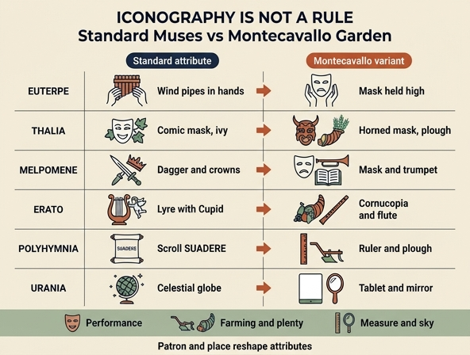

# 몬테카발로 페라라 추기경 정원의 무사들 — 표준 도상을 벗어난 지물

## 질문

몬테카발로의 페라라 추기경 정원에 그려진 무사들의 특이한 지물은?

## 한눈에 보는 답

리파는 『이코놀로지아』의 MUSE 항목에서 **자기 표준형(Di Cesare Ripa)** 을 먼저 제시한 뒤, 곧바로 세 가지 **이본(異本) 목록**을 나란히 붙인다.

1. 빈첸초 델라 포르타 소장 **고대 메달**에서 뽑은 무사들
2. 피렌체 신사 **프란체스코 보나벤투라** 소장 **회화**의 무사들
3. **"페라라 추기경이 몬테카발로 자기 정원에 그리게 한"** 무사들 — 이 카드가 묻는 대목

세 번째 목록에서는 표준 도상이 크게 흔들린다. **가면(maschera)이 거의 모든 무사에게 번지고**, **쟁기(aratro)와 풍요의 뿔(cornucopia)이라는 농경·풍요의 지물이 끼어든다.**

---

## 핵심 대조표 (6명)

| 무사 | 리파(오를란디판) 표준 지물 | 몬테카발로 변형 지물 | 변형의 함의 |
|---|---|---|---|
| **에우테르페** (Euterpe) | 온갖 **꽃 화관**, **두 손으로 여러 관악기**(tibie, calami) — "Dulciloquis calamos Euterpe flatibus urget" | **두 손으로 가면 하나**를 든다 (Con ambe le mani tiene una maschera) | "두 손으로 든다"는 **자세만 그대로 남고 물건이 관악기→가면으로 치환**되었다. 음악의 무사가 연극·연희의 무사로 옮겨 붙는다 |
| **탈리아** (Thalia) | **담쟁이 화관**, 왼손에 **희극 가면(maschera ridicolosa)**, 발에 **초키(zocchi, 희극배우의 낮은 신)** | 오른손에 **뿔 달린 가면**, 왼손에 **잎과 (아직) 푸른 보리·밀 이삭이 가득한 풍요의 뿔**, 땅에 **쟁기** | 가면은 남았으나 **뿔이 달려 사티로스·목신(牧神)적**으로 바뀌고, 이삭이 '푸른' 것은 **미숙·초봄**의 표시. 희극 = 사티로스극·전원극·수확제 계열로 재배치 |
| **멜포메네** (Melpomene) | 무겁고 위엄 있는 옷차림, 왼손에 **높이 든 왕홀과 왕관들**(다른 왕홀·왕관은 발밑에 내던져져 있음), 오른손에 **뽑은 단검**, 발에 **코투르누스** | 오른손에 **가면**, 왼손에 **나팔**, 땅에 **펼쳐진 악보책** | 표준형의 **비극 서사(왕좌의 오르내림 + 단검)** 가 통째로 사라지고, **가면+나팔+악보** = 순수한 **무대·음악 연행**의 도구만 남는다. 이름 어원 μολπή(노래)를 택한 해석 |
| **에라토** (Erato) | **미르테와 장미 관**, 왼손에 **리라**, 오른손에 **플렉트룸**, 곁에 **횃불·활·화살통을 든 날개 달린 아모리노** | 오른손에 **잎·꽃·온갖 열매가 가득한 풍요의 뿔**, 왼손에 **플루트**, 같은 쪽에 **쿠피도**(쿠피도는 왼손에 **가면**, 오른손에 **줄 풀린 활**) | 큐피드만 유일하게 남은 표지. **리라→플루트, 장미관→풍요의 뿔**로 사랑이 '연가(戀歌)'에서 **결실·다산**으로 옮겨간다. **줄 풀린 활**은 쏘지 않는 사랑 = 진정된/합법적 에로스 |
| **폴림니아** (Polyhymnia) | 웅변 자세, **오른손 검지를 높이 들고**, 진주·보석 머리장식, **흰 옷**, 왼손에 **SUADERE(설득하다)** 라 쓰인 두루마리 | 오른손에 **자(尺)처럼 생긴 나무 막대(un legno simile ad una misura)**, 왼손에 **가면**, 땅에 **쟁기** | **수사학의 무사가 측량·경작의 무사로** 바뀐다. 설득의 두루마리 대신 **재는 도구**, 그 발밑에 **밭 가는 도구**. '말'이 '치수와 질서'로 물질화됨 |
| **우라니아** (Urania) | **빛나는 별들의 화관**, **하늘색 옷**, 손에 **천구(globo celeste)** | 오른손에 **허벅지에 기댄 흰 서판(tavola bianca)**, 왼손에 **거울(specchio)** | 관측 대상(천구)이 아니라 **관측의 수단**으로 이동. **흰 서판 = 계산·작도용 빈 판**, **거울 = speculum/speculatio(사변·관측)** 의 상투 도상 |

### 나머지 셋(참고)

| 무사 | 몬테카발로 |
|---|---|
| 클리오 | 오른손 **나팔**, 왼손 **두루마리**, 같은 쪽에 **양손에 켜진 횃불을 든 푸토**와 머리에 화관 |
| 테르시코레 | 왼손 **리라**, 오른손 **플렉트룸** (표준의 에라토 지물과 사실상 동일) |
| 칼리오페 | 오른손 **책**, 왼손 **피페로(작은 피리, piffero)**, 땅에 **가면** |

→ 클리오와 테르시코레만 비교적 얌전하고, **가면은 9명 중 6명 주변에 나타난다**(에우테르페·탈리아·멜포메네·폴림니아·칼리오페 + 에라토의 큐피드). 정원 벽화 전체를 **하나의 반복 모티프로 묶는 장식 논리**가 작동했다고 볼 수 있다.

---

## 쟁기와 풍요의 뿔은 왜 반복되는가

이 세 지물(**쟁기 2회 — 탈리아·폴림니아**, **풍요의 뿔 2회 — 탈리아·에라토**, 여기에 **푸른 이삭**)은 표준 무사 도상에 없다. 리파 자신이 같은 항목 서두에 근거를 미리 깔아 두었다는 점이 결정적이다.

> 에우세비오는 『복음의 준비』에서, '무사'라는 이름이 **"정직함과 좋은 규율을 가르친다"** 는 뜻의 그리스어에서 왔다고 하며, 그래서 **오르페우스는 찬가에서 무사들이 사람들에게 종교와 바르게 사는 법(il ben vivere)을 보여주었다고 노래한다.**
> — 08 Monsters and Muses.md, MUSE 서두

즉 리파가 채택한 어원 계열에서 무사는 **'예술의 여신'이 아니라 '문명을 가르친 여신'** 이다. 이 독법을 밀고 가면:

- **쟁기** = 고대 이래 **야만에서 문명으로의 이행을 표상하는 표준 기호**다(케레스·트립톨레모스가 농경을 주어 인간에게 법과 도시생활을 가능하게 했다는 신화 계열). 무사가 "바른 삶을 가르쳤다"면, 그 가르침의 최초 형태는 **경작**이다.
- **풍요의 뿔** = 그 가르침의 **결과**. 문예가 아니라 **수확**으로 측정되는 문명의 열매.
- **폴림니아의 자(尺) + 쟁기** 조합이 특히 시사적이다. 재고(측량) → 경계를 긋고 → 밭을 갈고 → 법과 소유가 생긴다. 수사학(SUADERE, 설득)의 무사가 **말이 아니라 척도와 노동으로 사회를 만드는 무사**로 번역된 셈이다.
- **탈리아의 '푸른' 이삭**은 아직 익지 않은 곡물 = **초기·성장 단계**. 탈리아라는 이름 자체가 그리스어 θάλλειν(꽃피다·번성하다) 계열로 읽히므로, 희극의 무사보다 **번성의 여신**에 가깝게 해석된 흔적으로 볼 수 있다.

정리하면 몬테카발로 프로그램은 무사 9명을 **①연행(가면·나팔·악보·플루트) + ②경작과 풍요(쟁기·풍요의 뿔·이삭) + ③측량과 관측(자·흰 서판·거울)** 세 축으로 재편했다. **정원**이라는 장소가 ②를, **추기경 정원의 고대 취향 학예 프로그램**이 ③을, **정원 안 야외 연희·극장 문화**가 ①을 각각 끌어당겼다고 읽는 것이 자연스럽다. (단, 이 세 축의 배치를 확정해 주는 1차 문헌은 확인하지 못했다 — 어디까지나 지물 목록에서 역추적한 해석이다.)

---

## 배경: 몬테카발로의 '페라라 추기경 정원'

- **몬테카발로(Monte Cavallo)** 는 로마 **퀴리날레(Quirinale) 언덕**의 옛 통칭이다. 언덕 위에 서 있던 거대한 **디오스쿠로이(말 길들이는 자) 고대 군상** 때문에 '말의 산'으로 불렸다.
- **'페라라 추기경(Cardinal di Ferrara)'** 은 **이폴리토 2세 데스테(Ippolito II d'Este, 1509–1572)** 의 통칭이다. **티볼리의 빌라 데스테**(분수 정원으로 유명한 그 집)를 만든 인물이 바로 그다.
- 이폴리토 2세는 **1550년 퀴리날레의 빌라 카라파(포도밭, vigna)를 임차**해, 이를 **분수·물장난 장치(giochi d'acqua)·고대 조각으로 채운 정교한 정원**으로 개조했다. 설계에는 **지롤라모 다 카르피**(페라라 출신 화가·건축가, 1549년 이폴리토가 로마로 불러들여 하드리아누스 별장 발굴과 몬테카발로 정원 정비를 맡김)와 **톰마소 기누치**가 참여했고, **1560년 인접 비냐 보카초를 교황에게서 받아 정원 규모를 두 배로 늘렸다.** 정원 건물 일부의 **프레스코를 지롤라모(다 카르피) 계열에 맡겼다**는 기록이 있다.
- 이폴리토 2세 사후 이 정원은 조카 **루이지 데스테(Luigi d'Este, 1538–1586)** 에게 이어졌고, 그 역시 '페라라 추기경'으로 불렸다. **리파가 본 것이 이폴리토 2세 시기의 벽화인지 루이지 시기의 것인지는 이 텍스트만으로 특정할 수 없다.** 리파 초판이 1593년(무삽화)·1603년(삽화)이므로 시간상으로는 두 사람 모두 가능하다.
- 이후 **그레고리우스 13세(1572–85)** 가 이 데스테 별장을 확장(건축가 **오타비아노 마스카리노**)한 것이 오늘의 **퀴리날레 궁**으로 자란다. 즉 **문제의 무사 벽화가 있던 정원 건물은 교황궁 확장 과정에서 상당 부분 사라졌거나 변형되었을 가능성이 높다.** 리파의 이 목록은 그런 의미에서 **소실 가능성이 있는 실제 벽화에 대한 문헌 증언**으로서의 가치가 있다.
- 16세기 로마 추기경 정원의 성격: 단순한 화단이 아니라 **고대 조각 컬렉션의 야외 전시장 + 고고학적 학식의 과시 + 후원자 가문의 문화 자본 선언**이었다. 도상 프로그램은 궁정 고문·골동학자(antiquario)들이 짜는 **주문 제작 지식**이었고, 따라서 **판본화된 표준 도상과 어긋나는 것이 오히려 정상**이었다. (퀴리날레 정원에는 해시계류 천문 장치도 있었다고 논의되며, 이는 우라니아의 '서판+거울' 변형과 어울리는 맥락이다 — 다만 직접 연결을 입증하는 자료는 확인하지 못했다.)

---

## 이 카드의 진짜 학습 포인트

**도상은 규범이 아니다.** 리파(그리고 확장판을 낸 오를란디)는 무사 항목에서 자기 표준형을 확정한 다음, 그것을 **덮지 않고** 곧바로 세 계열의 이본을 나란히 적어 둔다 — 메달(고대 실물), 개인 소장 회화(피렌체), 추기경 정원 벽화(로마).

이 편찬 태도가 알려주는 것:

1. **『이코놀로지아』는 '정답표'가 아니라 '용례집'** 이다. 리파는 규범을 세우는 동시에 규범이 흔들리는 현장을 기록한다.
2. **지물은 지역·후원자·장소에 따라 재배치된다.** 같은 멜포메네가 로마 추기경 정원에서는 단검과 왕관을 버리고 나팔과 악보를 든다. 무엇을 그릴지 결정하는 것은 '무사의 본질'이 아니라 **누가, 어디에, 무슨 목적으로 그리는가**다.
3. 따라서 실제 작품을 볼 때 **"리파와 다르다 = 틀렸다"** 가 아니라 **"어떤 계열을 골랐는가"** 를 물어야 한다. 리파 자신이 그렇게 읽으라고 이본을 병기해 두었다.

---

## 원문 핵심 구절 (Orlandi판 Tomo Quarto)

> **MUSE** — Come dipinte dall'Eminentissimo Cardinal di Ferrara a Monte Cavallo, nel suo Giardino.
>
> **EUTERPE.** Con ambe le mani tiene una maschera.
> **TALIA.** Colla destra mano tiene una maschera, con i corni, e colla sinistra un cornucopia pieno di foglie, e di spighe di grano, ma verdi; e per terra un aratro.
> **MELPOMENE.** Colla destra mano tiene una maschera, e colla sinistra una tromba; e per terra vi è un libro di musica aperto.
> **ERATO.** Tiene colla destra mano un corno di dovizia, pieno di frondi, fiori e diversi frutti; e colla sinistra mano un flauto; e dalla medesima banda vi è Cupido, che colla sinistra mano tiene una maschera e colla destra un arco colla corda sciolta.
> **POLINNIA.** Tiene colla destra mano un legno simile ad una misura, e colla sinistra una maschera; e per terra un aratro.
> **URANIA.** Tiene colla destra mano una tavola bianca, appoggiata alla coscia, e colla sinistra uno specchio.

---

## 참고

- 출처 챕터: `../../assets/08 Monsters and Muses.md` (MUSE 항목, 표준형 + 3계열 이본)
- 이 챕터의 MUSE 구간에는 **개별 무사 초상 판화가 추출되어 있지 않다** (`_page_197_Picture_9`, `_page_205_Picture_18`, `_page_206_Picture_11`은 모두 장식 컷이므로 인용하지 않았다).

웹 참고:
- [The History of the Quirinale Palace (palazzo.quirinale.it)](https://palazzo.quirinale.it/Storia/storia_en.html)
- [Il giardino del Quirinale (PDF, palazzo.quirinale.it)](https://palazzo.quirinale.it/luoghi/giardini/doc/giardino.pdf)
- [A maze in the heart of the Republic — the labyrinth of the Quirinal (finestresullarte.info)](https://www.finestresullarte.info/en/travel/a-maze-in-the-heart-of-the-republic-the-labyrinth-of-the-quirinal)
- [Girolamo da Carpi (Dayton Art Institute)](http://collection.daytonartinstitute.org/people/4923/girolamo-da-carpi)
- [Luigi d'Este (Wikipedia)](https://en.wikipedia.org/wiki/Luigi_d%27Este)
- [Sundials on the Quirinal: Astronomy and the Early Modern Garden (academia.edu)](https://www.academia.edu/26343382/Sundials_on_the_Quirinal_Astronomy_and_the_Early_Modern_Garden)

## 인포그래픽

