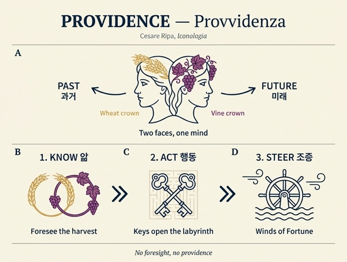

# 섭리(Provvidenza) — 야누스처럼 두 머리를 가진 여인

**Q.** 리파는 '섭리(Provvidenza)'를 어떻게 의인화했는가?

**A.** 야누스처럼 두 머리를 가진 여인. 한 머리는 밀 이삭 화관, 다른 머리는 열매 달린 포도덩굴 화관을 쓰고, 한 손에 열쇠 두 개, 다른 손에 배의 키(timone)를 든다.

출처: `.fm/assets/17 Practice to Providence.md` → `### PROVVIDENZA. / #### Dì Cefare BJpa.` 항목 (Tomo Quarto, 원본 페이지 432~434 구간)

---

## 1. 원문 정의 (Ripa 본문)

> **DOnna con due teste a somiglianza di Jano.** Una testa sarà ghirlandata di spighe di grano, e l'altra di vite, con il frutto. In una mano terrà **due chiavi**, e nell'altra un **timone**, non potendo essere alcun Uomo provvido, senza la cognizione del tempo passato, e del futuro.

번역: "야누스를 닮은 두 머리의 여인. 한 머리는 밀 이삭 화관을, 다른 머리는 열매가 달린 포도덩굴 화관을 쓴다. 한 손에는 열쇠 두 개를, 다른 손에는 배의 키를 든다. **어떤 사람도 지나간 시간과 앞으로 올 시간에 대한 인식(cognizione) 없이는 섭리로울(provvido) 수 없기 때문이다.**"

즉 리파는 서술 첫 문장에서 이미 **두 머리의 근거 = 과거·미래의 인식**을 못박아 둔다. 나머지 지물은 뒤이어 절별로 해설된다.

---

## 2. 지물별 의미

### 2.1 두 머리 / 두 얼굴 — 야누스 (due teste a somiglianza di Jano)

> A ragione si dipinge quella figura colle **due facce**, le quali dicemmo essere convenienti alla Provvidenza descritta di sopra.

"이 도상을 두 얼굴로 그리는 것은 정당하다. 그 두 얼굴은 앞에서 서술한 것에 어울린다고 이미 말했다." — 리파가 가리키는 "앞에서"는 같은 장의 **Previdenza(선견)** 항목이며, 거기서 두 머리의 논리를 이미 전개했다.

> [Previdenza] Le due teste dimostrano, che per **prevedere** le cose in avvenire, giova assai la **cognizione delle cose passate**; però si vede che l'esperienza è cagione della prudenza negli Uomini... essendo il **prevedere**, ed il **provvedere** effetti proprj della **Prudenza**.

핵심 3항 위계가 여기서 드러난다.
- **Prudenza(신중)** = 원인이 되는 상위 덕
- **prevedere(미리 봄)** 와 **provvedere(미리 대비함)** = 프루덴차의 "고유한 효과(effetti proprj)"

또한 리파는 "많은 역사와 여러 시대의 사례를 아는 것이 인간 삶에 유익하다. 그것이 우리 안에 프루덴차를 낳아 미래를 판단하게 하기 때문이며, 그 목적이 없다면 순전한 호기심과 시간 낭비일 뿐"이라고 덧붙인다 — **두 머리는 곧 "역사 지식 → 미래 판단"의 도상적 압축**이다.

#### 야누스 전통 확인

- 야누스(Ianus bifrons)는 하나의 머리에 반대 방향을 보는 두 얼굴을 지닌 로마의 문·시작·이행의 신이다. 오비디우스 『파스티』 1권(89~294행)에서 야누스가 시인에게 직접 말하며 자신의 두 얼굴을 **과거와 미래를 동시에 내다보는 형상**으로 설명한다. 마크로비우스 『사투르날리아』는 그를 모든 시작·운동의 우주적 기원(원초적 카오스와 동일시되는 전승)으로 확장 해석한다.
- 리파 자신도 같은 자산의 다른 장에서 이 전통을 반복한다. 『Mesi(달들)』 장의 1월(Gennaio) 항목: "questo [mese] da Jano Januario, perché siccome **Jano si fa con due facce**: così questo mese, quasi con una guarda il passato, e coll'altra il principio di quello, che ha da venire" (한 얼굴로 지난 것을, 다른 얼굴로 올 것의 시작을 본다).
- 두 얼굴 모티프는 리파 체계 안에서 "시간 양방향 인식"을 뜻하는 **표준 어휘**로 재사용된다: Previdenza(선견), Provvidenza(섭리), Prudenza(신중) 2종, **Memoria(기억)** — 기억은 두 얼굴에 검은 옷·펜·책을 들며 "과거의 모든 것을 포괄하여 미래에 일어날 일에 대한 프루덴차의 규범이 되므로 두 얼굴"이라 설명된다. Morte(죽음)의 리치 신부 변형본에도 두 얼굴이 나온다.

### 2.2 밀 이삭 화관 + 열매 달린 포도덩굴 화관 (spighe di grano / vite con il frutto)

**주의: 리파는 이 두 화관을 본문에서 명시적으로 해설하지 않는다.** 두 얼굴·열쇠·키만 절을 나눠 설명하고 화관은 정의문에만 등장한다. 따라서 의미는 같은 항목군의 문맥으로 재구성해야 한다.

- 같은 장의 후속 메달 항목들이 일관되게 **밀 이삭(mazzo di spighe di grano)** 과 **풍요의 뿔(cornucopia)** 을 섭리의 지물로 든다 (Massimino 메달: 오른손에 밀 이삭 다발, 왼손에 창 / Alessandro Severo 메달의 **Provvidenza dell'Annona**: 오른손에 밀 이삭 다발, 왼손에 코르누코피아, 이삭 가득한 흙 항아리).
- 리파는 그 Annona 항목에서 직접 이렇게 정리한다: "Questa figura è simile a quella dell'**Abbondanza**... basta sapere che è **virtù, che deriva dalla prudenza**, e si ristringe a' particolari termini della **provvisione delle cose necessarie al vivere**" — 섭리는 프루덴차에서 파생하며 "삶에 필요한 것들의 **예비·조달**"이라는 구체 영역에 한정된다.
- 그러므로 **밀 이삭과 포도**는 (1) 곡물과 포도주라는 생계의 두 근본 식량 = "provvisione delle cose necessarie al vivere"의 결실이자, (2) 여름 수확(곡물)과 가을 수확(포도)이라는 **두 계절의 결실**로서 두 얼굴의 시간 구조와 짝을 이룬다. 한 해 전체를 내다보고 갈무리해 두는 것이 곧 섭리라는 읽기다.
- 신학적 층위도 함께 놓여 있다: "però si attribuisce questa lode ancora a Dio; come quello, che irreprensibilmente provvede a tutte le necessità nostre" (이 칭송은 하느님께도 돌려지는데, 그분이 우리의 모든 필요를 흠 없이 예비하시기 때문).

### 2.3 열쇠 두 개 (due chiavi)

> Le **chiavi** mostrano, che **non basta il provvedere le cose, ma bisogna ancora operare**, per essere perfetto negli atti virtuosi: e le chiavi notano ancora tutte le cose, che sono **stromenti delle azioni** appartenenti alla terra, e che ci **aprono li laberinti** fabbricati sopra alla difficoltà del vivere umano.

두 겹의 뜻이 있다.
1. **인식에서 행위로**: 미리 내다보기만 해서는 부족하고 "실제로 행해야(operare)" 덕의 행위가 완전해진다. 열쇠는 관조를 실천으로 넘기는 표지다.
2. **행위의 도구**: 열쇠는 지상의 일에 속한 모든 "행위의 도구(stromenti delle azioni)"이며, 인간 삶의 곤경 위에 세워진 **미궁(laberinti)** 을 열어 주는 것이다.

열쇠가 **두 개**인 이유를 리파는 명시하지 않는다. 두 머리·두 화관과 짝을 이루는 쌍(pair) 구조로 읽는 것이 자연스럽고, "모든 도구"라는 복수 의미를 복수형으로 표현한 것으로도 볼 수 있다.

### 2.4 배의 키 (timone)

> Il **timone** ci mostra ancora nel **Mare** adoprarsi provvidenza in molte occasioni, per acquistarne ricchezze, e fama; e ben spesso ancora solo per **salvar la vita**. E la Provvidenza **regge il timone di noi stessi**, e dà speranza al viver nostro, il quale **quasi Nave in alto Mare** è sollevato, e scosso da tutte le bande da' **venti della fortuna**.

- 1차 의미(문자적): 바다에서도 섭리가 발휘된다 — 부와 명성을 얻기 위해, 또 흔히는 **목숨을 건지기 위해**. 항해는 예비와 판단이 생사를 가르는 대표 사례다.
- 2차 의미(비유적): 섭리는 **"우리 자신의 키를 잡는다"**. 우리 삶은 **망망대해의 배**와 같아 사방에서 **운명의 바람(venti della fortuna)** 에 들리고 흔들리는데, 섭리가 그 키를 쥐어 삶에 희망을 준다.

이로써 이 도상은 **인식(두 얼굴) → 결실의 예비(두 화관) → 행위(두 열쇠) → 조종(키)** 이라는 하나의 완결된 실천 사슬을 이룬다.

---

## 3. 판화 유무

**이 항목(Provvidenza, Di Cesare Ripa)에는 대응 판화가 없다.** 자산 markdown에서 이 장(`17 Practice to Providence.md`)의 삽화 참조는 총 9개이며, 섭리 항목군 근처의 두 파일은 모두 본문 도상이 아니다.

- `_page_434_Picture_6.jpeg` — 직접 확인 결과 인물 도상이 아닌 **로코코 카르투슈 장식 컷(tailpiece)**. 페이지 하단 마감 장식이다. → 복사하지 않음.
- `_page_434_Figure_8.jpeg` — 1.3KB 크기의 조판 잔여물/노이즈. → 복사하지 않음.
- 같은 장의 나머지 판화(`_page_405/411/412/413/414/415/424_*`)는 Pratica~Prodigalità, Premio 등 다른 항목의 것이다. Previdenza(선견) 항목에도 판화가 없다 (`_page_415_Picture_3.jpeg`는 바로 앞 항목 **Premio**의 것).

### 두 머리 도상 비교용 참고 판화 — Prudenza(신중), 섭리 판화가 아님

아래 판화는 **다음 장 `18 Prudence to Quiet.md`의 Prudenza(신중) 항목** 도판(`_page_435_Picture_3.jpeg`)이다. 섭리의 판화가 아니지만, 리파 체계에서 **"야누스식 두 얼굴"이 실제로 어떻게 새겨졌는지** 보여 주는 유일한 인접 시각 자료다.

판화에서 관찰되는 요소와 섭리 도상의 대응:

| 판화에서 보이는 것 | Prudenza의 의미 | Provvidenza에서의 대응 |
|---|---|---|
| 하나의 머리에 **앞·뒤 두 얼굴**(정면 수염 난 얼굴 + 뒤통수 쪽으로 향한 또 하나의 얼굴 윤곽) | 과거·미래를 함께 고려하는 참된 인식 | **동일 원리** — 리파가 "앞에서 말한 두 얼굴"이라며 그대로 가져온다 |
| 머리를 감싼 **화관 두른 투구** | 도금 투구 = 지혜로운 조언으로 무장한 재능 / 뽕나무 잎 화관 = 때 이르게 행하지 않음 | 섭리는 투구 대신 **밀 이삭 화관 + 포도덩굴 화관** — 방어 대신 **결실·예비**로 머리를 장식 |
| 왼손의 **손거울**(작은 얼굴이 비침) | 자기 결점을 알고 고치는 자기 인식(소크라테스) | 섭리에는 거울이 없다 — 내면 성찰 대신 **행위의 열쇠**로 바깥을 향한다 |
| 오른손의 **긴 창/화살에 감긴 물고기** | 레모라(Echeneide) = 배를 멈추는 힘 → 지체·신중 (알치아티 인용) | 섭리의 **키(timone)** 와 대비되는 항해 은유: 프루덴차는 **멈춤**, 섭리는 **조종** |
| 발밑에 앉아 되새김하는 **긴 뿔 사슴** | 긴 다리는 달리게 하고 무거운 뿔은 늦추듯, 결심 전 숙고(ruminare) | 섭리에는 부속 동물이 없다 — 숙고 단계를 지나 **집행 단계**에 서 있다 |
| 판면 하단 캡션 `Prudenza`, 좌우에 del./sculp. 서명 | — | 라벨 확인: 이 도판은 **Prudenza**이며 섭리가 아니다 |

---

## 4. 개념·도상 비교표

### 4.1 Previdenza(선견) · Provvidenza(섭리/예비) · Prudenza(신중)

| 항목 | **Previdenza (선견)** | **Provvidenza (섭리·예비)** | **Prudenza (신중)** |
|---|---|---|---|
| 위치 | `17 Practice to Providence.md` | `17 Practice to Providence.md` | `18 Prudence to Quiet.md` |
| 개념 | 앞일을 **미리 봄** (인식 단계) | 미리 보고 **실제로 마련·대비함** (실행 단계) | 과거·미래를 함께 고려해 행위를 명령하는 참된 인식 = **원인이 되는 사덕(四德)** |
| 리파의 위계 서술 | "il **prevedere**, ed il **provvedere** effetti proprj della **Prudenza**" | "virtù, che **deriva dalla prudenza**" (Annona 항목) | 아리스토텔레스 인용: "행복한 삶이라는 목적을 위해 선을 얻고 악을 피하는, 참된 이성을 갖춘 능동적 습성" |
| 두 머리/얼굴 | ○ (due teste) | ○ (due teste **a somiglianza di Jano**) | ○ (due facce, "come si è detto di sopra"; 이본은 "simile a Giano") |
| 머리 장식 | 없음 (노란 옷 = sapienza) | **밀 이삭 화관 / 열매 달린 포도덩굴 화관** | 도금 투구 + 뽕나무 잎 화관 |
| 오른손 | **다람쥐(Schiratto)** | **열쇠 두 개** | 레모라가 감긴 화살 |
| 왼손 | **컴퍼스(compasso)** | **배의 키(timone)** | 거울 |
| 발밑·부속 | 없음 | 없음 | 되새김하는 긴 뿔 **사슴** (이본: 팔에 감긴 뱀) |
| 지물의 논리 | 다람쥐 = 플리니우스 8권 38장, 꼬리로 햇볕·바람·비를 막아 **본능으로 기상 변화를 예견** / 컴퍼스 = 성질·순서·배치·시기·모든 우발을 **재어 판단**해야 함 | 열쇠 = 내다봄으로 그치지 않고 **행해야** 함 + 인생의 **미궁을 여는 도구** / 키 = 운명의 바람에 흔들리는 **배 같은 삶을 조종** | 투구 = 지혜로 무장한 재능 / 뽕나무·레모라·사슴 = **때 이르지도 너무 늦지도 않게**(중용) / 거울 = 자기 인식 |
| 판화 | 없음 | **없음** | 있음 (`_page_435_Picture_3.jpeg` = 위 fig-1) |
| 한 줄 요약 | **본다** | **본 것을 갖추고 잡는다** | **보고 헤아려 명령한다** |

측정 도구(컴퍼스) → 개방·집행 도구(열쇠)로 지물이 옮겨 가는 것이 선견과 섭리를 가르는 결정적 차이다. 리파의 열쇠 해설 "non basta il provvedere le cose, **ma bisogna ancora operare**"가 바로 그 경계선을 말한다.

### 4.2 같은 장 Provvidenza 메달 이본들 (고전 화폐 도상)

리파는 Cesare Ripa 본인의 창안 도상에 이어 로마 황제 메달의 Providentia를 여러 개 병치한다.

| 메달 | 지물 | 명문·비고 |
|---|---|---|
| Tito(티투스) | 키(timone) + 지구의(globo) | 플로리아누스 것은 지구의 + 창(asta) |
| Elio Pertinace(아일리우스 페르티낙스) | 두 팔을 하늘로 들고 모은 손을 **별**로 향함 | `PROVIDENTIA DEORVM` (에리초 전거) |
| Balbino(발비누스) | 왼손 풍요의 뿔, 오른손 **곤봉(clava)**, 발밑에 세계 | `PROVIDENTIA DEORVM S C` |
| Probo(프로부스) | 스톨라 차림, 오른손 **홀(scettro)**, 왼손 코르누코피아, 발밑 지구의 | 섭리가 **특히 위정자(Magistrati)에게 속함**을 보임 |
| Massimino(막시미누스) | 오른손 **밀 이삭 다발**, 왼손 창 | — |
| Alessandro Severo — **Provvidenza dell'Annona** | 오른손 밀 이삭 다발, 왼손 코르누코피아, 이삭 담은 흙 항아리 | **Abbondanza(풍요)** 와 유사; "프루덴차에서 파생한 덕"; 사실은 `Abbondanza` 항목 참조 지시 |

#### 로마 Providentia 신격 확인

- Providentia는 로마 종교에서 **예견하고 미리 마련하는 능력의 신격화**로, 제국 황제 숭배(Imperial cult)의 덕성 의인화 계열에 속한다.
- 화폐상 통상 지물: **홀, 지구의 또는 (지구의를 가리키는) 지팡이**, 때로 **창, 배의 키(rudder), 코르누코피아, 파테라, 횃불, 닻**. 리파가 열거한 메달 지물 목록과 정확히 겹친다.
- 정치적 용법: 황제가 제국과 백성의 필요를 인지하고 적절한 조치를 취하고 있음을 선전 — 특히 **곡물 공급(annona)** 과, 후계자 탄생을 알리는 맥락. 리파의 `PROVVIDENZA DELL'ANNONA` 항목과 "위정자에게 속한다"는 서술은 이 로마적 함의를 그대로 계승한 것이다.
- 다만 리파의 대표 도상(두 머리+화관+열쇠+키)은 고대 화폐에 선례가 없는 **리파 자신의 합성 창안**이다: 로마 Providentia의 항해 지물(키)에 야누스의 시간 구조와 프루덴차 계열의 두 얼굴, 그리고 Abbondanza 계열의 곡물·포도 결실을 겹쳐 넣었다.

---

## 5. 신학·정치 층위 (같은 항목의 부기)

> Fra gli Uomini plebei, la Provvidenza pare, che immediatamente nasca dal **Principe**, come fra i Principi nasce immediatamente da **Dio**... `Omnis sufficientia nostra ex Deo est`; e non ci provvedendo esso delle cose necessarie, poco, o nulla vale la provvidenza nostra, che è come la volontà de' teneri fanciullini trasportata dal desiderio di camminare, che presto cade, se la forza della **Nutrice** non la sostenta.

- 섭리의 **연쇄 구조**: 평민의 섭리는 군주에게서, 군주의 섭리는 하느님에게서 직접 나온다.
- 인간의 섭리만으로는 거의 무력하다는 비유: 걷고 싶은 욕망에 이끌린 **어린아이의 의지** 같아서, **유모의 힘**이 받쳐 주지 않으면 곧 넘어진다.
- 이 대목은 4.2의 `PROVIDENTIA DEORVM`(신들의 섭리) 메달들과 짝을 이루며, 리파의 섭리가 **인간의 덕**과 **신의 섭리**라는 두 층을 오가는 개념임을 보여 준다. 두 머리는 시간의 양방향뿐 아니라 이 두 층위의 겹침으로도 울림을 가진다.

---

## 6. 암기 요령

- **머리 2 / 화관 2 / 열쇠 2 / 키 1** — "둘·둘·둘 그리고 하나". 마지막 하나(키)가 결론이다.
- 순서로 외우기: **과거·미래를 보고(두 얼굴) → 곡식과 포도를 갖추고(두 화관) → 문을 열어 실행하고(두 열쇠) → 삶의 배를 조종한다(키)**.
- 인접 항목 구분: **컴퍼스 = 선견**(재기), **거울·사슴 = 신중**(성찰·지체), **열쇠·키 = 섭리**(개방·조종).

---

## 인포그래픽

