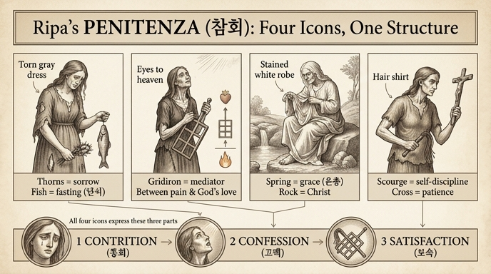

# 리파의 여러 '참회(Penitenza)' 도상 — 공통 요소

체사레 리파(Cesare Ripa)의 『이코놀로지아(Iconologia)』 제4권(Tomo Quarto, 555~557쪽)에는 '참회(Penitenza)' 항목이 여러 도상으로 연달아 제시된다. 겉모습은 제각각이지만, 모두 **가톨릭 신학이 말하는 참회의 세 부분 — 통회(contrizione)·고백(confessione)·보속(soddisfazione)** — 을 시각화한다는 점에서 하나로 묶인다.

## 네 가지 주요 도상

### 1. 찢어진 회갈색 옷의 여인 — 가시 다발과 물고기
- 회갈색(berrettino) 옷을 입었는데 **온통 찢기고 해져 있다**.
- 슬픔에 잠겨 **울고 있으며**, 한 손에는 **가시 다발(fascetto di spine)**, 다른 손에는 **물고기(pesce)** 를 든다.
- 리파의 설명: "참회는 **단식(digiuno)과 통한(rammarico)으로 간이 맞춰져야** 하기 때문" — 물고기는 육식을 끊는 **단식**을, 가시는 마음을 찌르는 **통회의 아픔**을 뜻한다.

### 2. 하늘을 우러르며 석쇠를 든 야윈 여인
- **수척하고 야윈 얼굴(estenuata, macilente)**, 우울하고 가난한 차림.
- **하늘을 골똘히 우러러보며** 두 손으로 **석쇠(craticola)** 를 든다.
- 석쇠는 신학자들이 참된 참회의 표징으로 삼는 물건이다. **석쇠가 '구워지는 것'과 '불' 사이의 매개이듯, 참회는 죄인의 고통과 (그 고통을 움직이시는) 하나님의 사랑 사이의 매개**라는 비유.
- 리파는 이 도상에서 세 부분의 대응을 명시한다:
  - **통회** = 우울하고 고통스러운 표정
  - **고백** = 하늘로 향한 얼굴(용서를 구하는 표시; 단, 고백은 인가받은 사제에게 해야 함)
  - **보속** = 석쇠(잠벌, 즉 현세적 벌에 상응하는 도구)

### 3. 샘에 제 모습을 비추는 노파 — 얼룩진 흰옷을 벗는 중
- **백발의 늙은 여인**이 **얼룩투성이 흰옷**을 입고, 외딴곳의 **바위 위에 앉아** 그 밑에서 솟는 **샘에 고개 숙여 제 모습을 비추며** 눈물을 흘리고, **옷을 벗는 동작**을 취한다.
- 상징 풀이:
  - 참회란 벌이 두려워서가 아니라 **하나님 사랑 때문에 갖는 죄에 대한 통한** — 샘에 비친 늙은 자신을 보며 헛되이 보낸 세월을 우는 것.
  - **얼룩진 흰옷** = 세례로 받은 순결(innocenza)이 우리 죄로 더럽혀진 것.
  - **바위** = 구원자 그리스도, **샘** = 그분에게서 솟는 은총(사마리아 여인 일화) — 옷을 벗어 샘에 빠는 것은 참회의 성사로 영혼이 다시 희어짐("나를 씻어 주소서, 눈보다 희게 되리이다", 시편 51).
  - **외딴 장소** = 마음의 은밀한 곳, 세상 헛된 것에서 물러나 하나님의 평화를 찾는 자리.

### 4. 고행복(cilicio)의 야윈 여인 — 채찍과 십자가
- 수척한 여인이 **고행복(cilicio, 거친 털옷)** 을 입고, 오른손에 **채찍(sferza)**, 왼손에 **십자가**를 들고 십자가를 뚫어지게 바라본다.
- **고행복** = 쾌락을 멀리하고 육신을 애지중지하지 않는 삶, **채찍(discipline)** = 자기 교정, **십자가** = 인내와 그리스도를 닮음·세상 경멸("누구든지 제 십자가를 지고 나를 따르지 않으면…").

## 공통 요소 정리

| 공통 요소 | 도상 속 표현 |
|---|---|
| 슬픔·눈물 (통회) | 우는 여인, 우울한 표정, 샘가의 눈물 |
| 야윔·궁핍 (단식·금욕) | 수척한 얼굴, 가난한 옷, 물고기(단식) |
| 고행 도구 (보속) | 가시 다발, 석쇠, 채찍, 고행복 |
| 위를/그리스도를 향한 시선 (고백·용서 간구) | 하늘 응시, 십자가 응시, 은총의 샘 |
| 훼손된 옷 (죄로 더럽혀진 순결) | 찢어진 회갈색 옷, 얼룩진 흰옷을 벗음 |

결국 어떤 판본이든 **통회(마음의 아픔) → 고백(용서를 구함) → 보속(고행으로 갚음)** 의 3부 구조가 인물의 표정·시선·지물(持物)로 번역되어 있다는 것이 리파 '참회' 도상들의 공통점이다.

참고: 부록으로 리치(P. Ricci) 신부의 변형도 소개된다 — 묵주를 들고 무릎 꿇은 날개 달린 여인(빵과 물, 채찍이 놓인 탁자), '성사로서의 참회'(열쇠와 만나 항아리를 든 남자), '미루는 참회'(비를 기다리다 벼락 맞기 직전인 농부) 등. 모두 같은 3부 구조의 확장이다.

(이 카드의 소스 구간에는 참회 전용 판화가 없어 원본 도판은 싣지 않았다. 인접 도판은 '죄(Peccato)' 판화와 장식 문양뿐이다.)

## 인포그래픽

