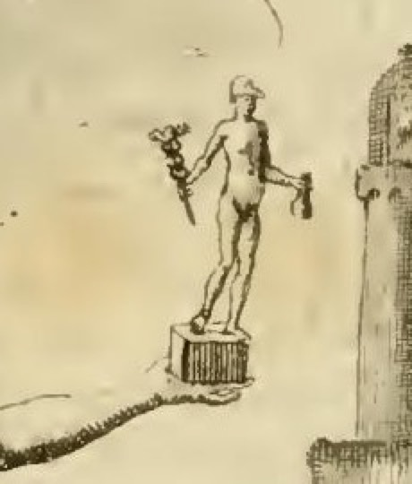
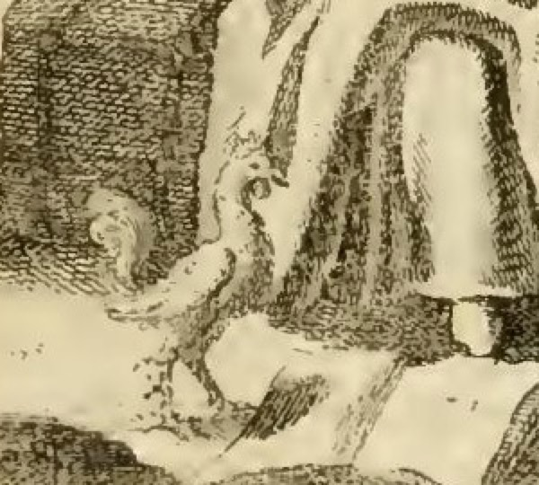

# '상업(Mercatura)' 도상의 메르쿠리우스 상과 수탉

> **Q.** '상업' 도상에서 메르쿠리우스 상과 수탉은 무엇을 뜻하는가?
>
> **A.** 고대인들은 돈주머니를 든 메르쿠리우스로 이익과 상업의 신, 곧 상업 자체를 표시했고(웅변으로 모든 거래가 이루어지므로), 그 발치의 수탉은 상인에게 필요한 경계심 — 밤을 온통 잠에 바치지 말아야 함 — 의 상징이다.

출처: 체사레 리파 『이코놀로지아』, 아바테 체사레 오를란디(Cesare Orlandi) 증보판 제4권 「MERCATURA(상업)」 항목.
코퍼스 위치: `04 Mechanics to the Month in General.md` — 도상 처방 257행, 해당 해설 339~343행.

---

## 1. 판화가 실제로 보여주는 것

오를란디의 처방(257행) 그대로다.

> "아름다운 여인, 흰색 옷을 값지게 차려입고, 생기 있는 눈을 하고 있다. 배와 선박 등이 보이는 항구를 앞에 배치한다. 한 손에는 **풍요의 뿔(cornucopia)** 을 들고, 다른 손으로는 **손에 돈주머니를 든 메르쿠리우스의 소상(statuetta)** 을 받쳐 든다. 급히 걸어가는 자세를 취한다. **발치에는 수탉(Gallo)** 이 있게 한다. 인물 근처에는 상업 장부 여러 권, 여러 개의 짐짝·자·저울·분동·표시(marche) 등을 놓는다. 공중에는 명성(Fama)이 날아가는 것이 보인다."

판화에서 확인되는 요소를 하나씩 대조하면 — 뒤편은 등대와 대형 범선이 있는 항구, 위쪽은 나팔을 부는 날개 달린 명성(Fama), 여인이 앉아 있는 것은 끈으로 묶인 **화물 짐짝(balle)** 이고 앞쪽 바닥에는 두루마리 문서·저울·자 같은 상업 도구가 흩어져 있다. 왼쪽 어깨 뒤로 과일이 쏟아지는 풍요의 뿔이 걸쳐져 있다.

### 1-1. 오른손의 메르쿠리우스 소상

여인이 오른손을 뻗어 **작은 각주형 대좌(basis)** 를 손바닥에 얹고 있고, 그 위에 벌거벗은 남성 나상이 서 있다. 확대해 보면 세 가지 지물이 분명하다.

- **테 있는 모자(petasos)** — 메르쿠리우스의 표지인 (날개 달린) 여행자 모자.
- **들어 올린 손의 카두케우스** — 뱀이 얽힌 전령의 지팡이. 상단의 뭉친 소용돌이 형태가 감긴 뱀·날개를 새긴 것이다.
- **반대쪽 손에 늘어뜨린 돈주머니(borsa / 라틴어 *marsupium*)** — 아래로 처진 주머니 모양이 뚜렷하다. 이것이 이 도상의 핵심 지물이다.

즉 화면 속의 메르쿠리우스는 **실물 크기 신이 아니라 조각상**이다. 대좌까지 또박또박 새긴 것은 그것이 '신 자신'이 아니라 '신의 상'임을 관람자에게 못 박기 위한 장치다(§4 참조).

### 1-2. 발치의 수탉

화면 왼쪽 아래, 여인의 치맛단과 짐짝 사이의 그늘에 볏과 육수(wattle)를 세운 새 한 마리가 서 있다. 가슴을 세우고 꼬리깃을 왼쪽으로 늘어뜨린 전형적인 수탉 측면상이며, 다리와 발가락이 짐짝 앞 바닥에 닿아 있다. 어두운 해칭 속에 놓여 무심히 보면 놓치기 쉬운데, 처방의 "발치에 수탉이 있게 한다"가 문자 그대로 지켜진 것이다.

**주의할 대조점**: 뒤에 인용할 고대 정식(定式)에서 수탉은 **메르쿠리우스 상의 대좌 발치**(*ad eius basim*)에 놓였다. 그런데 오를란디는 이를 **의인상 본인의 발치**로 옮겨 놓았고, 그 사실을 스스로 밝힌다("이런 이유로 우리는 수탉을 우리 도상의 발치에 놓았다"). 판화도 이 이동을 따른다 — 수탉은 소상의 대좌가 아니라 여인의 발밑에 있다. 지물의 소속을 신에서 **상업이라는 직업 자체**로 옮긴 셈이다.

---

## 2. 원문(오를란디) 해설 — 정확한 번역

339~343행이 이 카드의 근거 단락이다.

> "상업은 **풍요의 뿔**을 들고 있는데, 그것을 행하는 자와 더불어 국가에도 가져다주는 부(富)를 나타내기 위함이다.
>
> 다른 손에는 **돈주머니를 든 메르쿠리우스 상**을 들고 있는데, **고대인들이 그런 모습의 메르쿠리우스를 상업으로 받아들였기** 때문이다. 그리고 **그 발치에는 상인에게 필요한 경계심(vigilanza)을 뜻하는 수탉**을 함께 놓았다. 이런 이유로 우리는 수탉을 우리 도상의 발치에 놓았다."

이어서 오를란디는 근거 문헌 하나를 그대로 인용한다(첼리오 아우구스토 쿠리오네, 『히에로글리피카』 제1권). 원본 OCR이 심하게 망가져 있어 교정본과 함께 옮긴다.

> *Per Mercurii imaginem, quae marsupium manu teneret, Gallum ad eius basim ponentes, **lucrum, Mercaturam, Mercatoremve significarunt**, quod is mercium et lucri Deus haberetur: **quia sermonis ope omnia mercimonia, contractus fiunt**. Gallum vero idcirco illi adponebant **vigilantiae symbolum**, ut indicarent Mercatores decere vigilantes esse, **nec totas somno tribuere noctes**.*
>
> "손에 돈주머니를 든 메르쿠리우스의 상, 그리고 그 대좌 발치에 수탉을 놓음으로써 [고대인들은] **이익·상업·상인**을 표시했다. 그가 **상품(merces)과 이익(lucrum)의 신**으로 여겨졌기 때문이며, **말(sermo)의 힘으로 모든 매매와 계약이 성립하기** 때문이다. 수탉은 **경계심의 상징**으로 거기 덧붙였는데, 상인이란 깨어 있어야 하고 **밤을 온통 잠에 바쳐서는 안 된다**는 것을 나타내기 위함이었다."

**답의 두 축이 이 한 문장에 다 들어 있다.** 앞 절이 메르쿠리우스(=이익·상업·상인, 근거는 ①상품·이익의 신 ②말이 거래를 성립시킨다), 뒤 절이 수탉(=경계심, 밤을 잠으로 다 쓰지 말 것)이다. 카드의 답문은 이 라틴 인용의 축약이다.

같은 대목에서 오를란디가 덧붙이는 보조 인용 셋:

| 인용 | 교정한 원문 | 요지 |
|---|---|---|
| (위)僞코디누스, 『콘스탄티노폴리스 기원론』 | *Mercurium lucri auctorem perhibent, et praesidem Mercaturae; quocirca simulacrum eius marsupium gestare faciunt.* | "사람들은 메르쿠리우스를 이익의 창시자요 상업의 수호신으로 일컫는다. 그래서 그의 상이 **돈주머니를 들게** 만든다." → 돈주머니 지물의 직접 근거 |
| 오비디우스 『행사력』 5권 689–690행 | *Da modo lucra mihi, da facto gaudia lucro; / et fac ut emptori verba dedisse iuvet.* | 상인이 메르쿠리우스에게 바치는 기도: "이익만 주소서, 이익 낸 기쁨을 주소서, 그리고 **구매자를 속인 것이 즐거움이 되게** 하소서." |
| 플라우투스 『스티쿠스』 3막 1장(402~405행) | *Cum bene re gesta salvus convertor domum, / Neptuno grates habeo et Tempestatibus, / simul Mercurio, qui me in mercimoniis / **iuvit lucrisque quadruplicavit rem meam**.* | 장사를 잘 마치고 무사히 귀향한 상인이 넵투누스·폭풍신과 **함께 메르쿠리우스에게** 감사한다 — "그가 교역에서 나를 도와 이익으로 내 재산을 네 배로 불렸다." |

---

## 3. 왜 메르쿠리우스인가 — 어원부터

### 3-1. *merx / mercari* → *Mercurius* → *Mercatura*

이 도상의 뿌리는 신화가 아니라 **어원**이다. 라틴어 *merx*(상품, 복수 *merces*)와 그 동사 *mercari*(거래하다)에서 *mercator*(상인), *mercatura*(상업), 그리고 **신의 이름 *Mercurius*** 가 같은 어근으로 파생된다. 고대 어원학이 이미 그렇게 설명했다 — 페스투스의 요약본(Paulus ex Festo)에 "*Mercurius a mercibus est dictus*"(메르쿠리우스는 상품에서 이름을 얻었다)는 항목이 남아 있다. 쿠리오네가 "그가 **상품과 이익의 신**으로 여겨졌기 때문"이라고 쓸 때, 그것은 신화적 주장이라기보다 **이름 안에 이미 들어 있는 뜻을 되짚는 것**이다.

그래서 리파식 도상학에서 Mercatura와 Mercurius의 결합은 임의적 알레고리가 아니라 **어근이 같은 것끼리 묶는 도상 논리**다. 우리말로는 이 고리가 안 보이니, 굳이 옮기면 "상업(商業)"의 표지로 "상신(商神)"을 세우는 격이다.

### 3-2. "웅변으로 모든 거래가 이루어진다"의 출처 — 헤르메스 = *logos*의 신

오를란디/쿠리오네의 두 번째 근거인 *quia sermonis ope omnia mercimonia, contractus fiunt*("말의 힘으로 모든 매매와 계약이 성립하므로")는 로마의 상업신 메르쿠리우스만으로는 설명되지 않는다. 이것은 그가 동일시된 **그리스 헤르메스**의 성격에서 온다.

- 헤르메스는 신들의 **전령(κῆρυξ)** 이다. 전령은 곧 공적 발언자이므로, 헤르메스는 **말솜씨·웅변 일반의 신**이 된다.
- 여기서 ***Hermes Logios*(말하는 헤르메스, 웅변의 헤르메스)** 라는 별칭과 조각 유형이 나온다. 고전기 그리스에서 아테나와 나란히 웅변을 대표하는 신격이었고, 로마 시대에도 인물을 *Hermes Logios* 자세로 표현한 초상 조각이 있다.
- 헤르메스는 또한 **경계 넘기(*hermaia*·경계표), 여행·길, 도둑질, 뜻밖의 횡재(*hermaion*)** 를 함께 관장한다. 교역이란 경계를 넘어 물건을 옮기는 일이고, 그 이윤과 사기(詐欺)는 종이 한 장 차이라는 고대의 감각이 이 신 하나에 압축되어 있다.

그러므로 오를란디의 논리 사슬은 이렇다: **말(logos)의 신 → 계약과 매매는 말로 성립 → 상업의 신.** 헤르메스의 다면성(전령·웅변·경계·도둑·이익) 중에서 상업 도상이 필요로 하는 두 면, 곧 **웅변**과 **이익**만 뽑아 쓴 것이다.

### 3-3. 로마의 실제 종교 관행 — 상인 조합과 5월 15일

이 결합에는 문헌 이상의 실체가 있다.

- **신전**: 메르쿠리우스 신전은 기원전 495년 아벤티노 언덕 사면, **키르쿠스 막시무스를 바라보는 곡물·교역 지구**에 봉헌되었다(리비우스 2권 27). 오를란디가 같은 권에서 인용하는 오비디우스의 표현도 "원로들이 키르쿠스를 바라보는 신전을 **5월 이데스(15일)** 에 세웠다"이다.
- **조합**: 같은 봉헌과 함께 **상인 조합(*collegium mercatorum*)** 이 설립되었다고 전한다. 그 성원을 가리키는 말로 ***mercuriales*** 가 쓰였으며(키케로의 서한에도 등장), 이름 그대로 **메르쿠리우스에게 속한 사람들 = 상인**이다.
- **축제(Mercuralia, 5월 15일)**: 오비디우스 『행사력』 5권의 해당 대목에 따르면, 상인은 카페나 문(Porta Capena) 근처 **메르쿠리우스의 샘물**을 훈향한 항아리에 받아, 젖은 월계수 가지로 **자기 상품과 자기 머리에 뿌리고** 기도했다. 그 기도문이 위에 인용한 689–690행이다.

즉 "돈주머니를 든 메르쿠리우스가 곧 상업"이라는 도상은, 로마 상인이 실제로 자기 직업의 수호신에게 물을 뿌리며 이익을 빌었던 **의례의 화석**이다.

### 3-4. 지물로서의 돈주머니(*marsupium*)가 하는 일

메르쿠리우스의 표준 지물은 넷이다 — **카두케우스**(전령·중재), **날개 모자(petasos)**, **날개 샌들(talaria)**, 그리고 **돈주머니**. 앞의 셋은 모두 "빠른 전령/매개자"라는 일반적 성격을 말할 뿐, 상업을 특정하지 못한다. **돈주머니만이 *lucrum*(이익)을 특정한다.** 고대 조각과 로마 주화·청동 소상, 폼페이의 벽화·부조에서 한 손에 카두케우스, 다른 손에 돈주머니를 든 메르쿠리우스 유형은 실제로 흔하다. 위(僞)코디누스의 인용이 정확히 이 점을 말한다 — "**그래서** 그의 상이 돈주머니를 들게 만든다."

fig-2에서 소상이 카두케우스와 돈주머니를 **양손에 나눠 들고** 있는 것은 이 유형을 충실히 따른 것이며, 도상학적으로 "전령·웅변(카두케우스) + 이익(돈주머니) = 상업"이라는 방정식을 한 몸에 담은 것이다.

---

## 4. 도상 속의 도상 — 왜 '신'이 아니라 '소상'인가

이 항목에서 가장 정교한 대목은, 상업이 메르쿠리우스로 **그려지지 않고** 메르쿠리우스의 **작은 조각상을 손에 들고 있다**는 점이다. 이 구성은 세 가지를 동시에 해낸다.

1. **위계 유지**: 의인상의 주인은 어디까지나 추상 개념 '상업'이다. 신은 그 개념이 **숭배하고 의지하는 대상**으로, 손바닥 위 대좌에 얹혀 종속적 위치에 놓인다. "상업 = 메르쿠리우스"라는 등식이 아니라 "상업은 메르쿠리우스를 받든다"라는 **관계 진술**이 된다.
2. **역사적 사실의 재현**: 로마 상인은 실제로 신상(*simulacrum*)에 물을 뿌리고 향을 피우며 빌었다. 손에 든 소상은 그 **숭배 행위 자체**를 화면에 들여놓는다.
3. **다른 알레고리를 지물로 인용하기**: 리파 도상학의 상용 기법이다. 이미 굳어진 도상 하나를 **압축해 새 도상의 지물로 삽입**하면, 그 도상에 딸린 의미 전체가 한 덩어리로 들어온다. 여기서는 "돈주머니 든 메르쿠리우스 + 발치의 수탉"이라는 고대의 완성된 상형 정식이 통째로 인용되고, 오를란디는 그 정식을 인용문으로 밝힌 뒤 **수탉만 떼어 자기 도상의 발치로 옮긴다**(§1-2).

즉 이 판화는 "인용부호가 붙은 도상"이다. 대좌를 그린 것이 곧 인용부호다.

---

## 5. 왜 수탉인가 — 경계심(vigilanza)의 표준 기호

### 5-1. 새벽을 알리는 새

수탉은 르네상스 도상학에서 **각성·경계·부지런함**의 표준 기호다. 근거는 관찰 가능한 사실 하나 — **울음으로 새벽을 알려 사람을 잠에서 깨운다**는 것이다. 같은 코퍼스의 「밤(Notte)」 항목 제4부(마지막 밤 시간대)가 그 근거를 가장 명료하게 정리해 준다.

> "그 앞에 수탉을 그려 넣는데, **밤의 이 마지막 부분을 '갈리키니오(Gallicinio, 닭울음 때)'라 부르기** 때문이다. 밤이 낮으로 넘어갈 때 수탉이 울기에 그렇다. […] 플리니우스 10권은 **수탉이 우리의 야간 경비병(guardie notturne)** 이며, 사람을 일로 깨우고 잠을 깨뜨리도록 자연이 낳았고, **제4야경(quarta vigilia)에 울음으로 돌봄과 노고를 불러낸다**고 전한다.
> 그러므로 수탉은 사람이 지녀야 할 **경계심(vigilanza)** 을 뜻한다고 할 수 있다. **잠으로 밤을 온통 소진하고 오래도록 잠에 묻혀 있는 것은 몹시 추한 일**이고, 기운을 회복했으면 익숙한 일로 돌아가야 하기 때문이다."
> — `10 Nobility to Obligation.md` 137~145행 (「Notte」 Quarta Parte)

밑줄 그을 곳: **"잠으로 밤을 온통 소진하는 것은 추한 일"** 은 쿠리오네의 ***nec totas somno tribuere noctes*(밤을 온통 잠에 바치지 말 것)** 와 사실상 같은 문장이다. 상업 항목의 훈계는 이 코퍼스 공통의 상투구를 상인에게 적용한 것이다. 라틴어 *vigilantia*(경계)와 로마의 야경 단위 *vigilia*, 그리고 "깨어 있음"이 한 낱말에 겹쳐 있다는 점도 함께 작동한다.

### 5-2. 상인의 어떤 실무인가

"밤을 다 자지 말라"는 훈계는 상업의 구체적 노동 리듬과 맞물린다. 같은 항목에서 오를란디가 강조하는 것들과 연결해 읽으면 다음과 같다.

- **장부와 서신 정리**: 도상에는 "상업 장부 여러 권(*varj libri mercantili*)"이 놓여 있다. 복식부기와 통신원(*corrispondenti*) 앞으로의 송금 기일 관리는 낮의 매매가 끝난 뒤에 하는 일이다. 오를란디는 지급 기일을 놓치면 신용을 잃고 연쇄 파산에 이른다는 것을 이 항목의 절반이나 들여 설명한다.
- **새벽 시장과 도매 반출**: 도매(*all'ingrosso*) 거래는 이른 시각에 시작한다.
- **선박의 출입항**: 배경이 등대 있는 항구인 것이 곧 이 실무다. 입항·출항은 조석과 바람이 정하므로 시간을 사람이 고르지 못한다. 오를란디는 폭풍 한 번에 부자가 비참으로 떨어진다고 쓰며 프로페르티우스를 인용한다.
- **감독(*sopraintendere*)의 의무**: 그는 귀족 상인이라도 "**모든 경계심(vigilanza)과 주의**를 다해 자기 업무를 감독해야 한다"고 못 박는다 — 같은 낱말 *vigilanza*가 수탉의 해설(339행)과 이 대목에 함께 쓰인다. 수탉은 장식이 아니라 이 항목의 **직업 윤리 주장을 떠받치는 기호**다.
- 여기에 급히 걷는 자세(*in atto di camminare in fretta*, = 근면·신속)와 생기 있는 눈(*occhi vivaci*, = 기민한 판단)이 더해져, **경계·신속·기민**의 3중 기호가 된다.

### 5-3. 같은 수탉, 다른 덕목 — 리파 도상학의 문법

같은 지물이 항목마다 다른 덕목에 재활용되는 것이 리파식 문법의 핵심이다. 코퍼스 안에서 교차 확인되는 사례들:

| 항목 | 위치 | 수탉이 뜻하는 것 |
|---|---|---|
| **상업 (Mercatura)** — 오를란디 | `04 Mechanics…md` 257·339~343행 | **상인**의 경계심. "밤을 온통 잠에 바치지 말 것" |
| **의학 (Medicina)** — 리파 | `04 Mechanics…md` 43·59행 | **의사**의 경계심. "뱀과 수탉은 페스투스가 전하듯 **가장 경계심 강한 동물**이며, 의술을 베푸는 자도 그러해야 한다" (오른손에 수탉, 왼손에 뱀 감긴 옹이 지팡이) |
| **밤 (Notte) 제4부** | `10 Nobility…md` 141~145행 | **닭울음 시각(gallicinio)** 이라는 시간 지표 + 플리니우스의 "야간 경비병" |
| **기도 (Orazione)** | `12 Honor…md` 274행 | **영적** 깨어 있음. "수탉을 곁에 두는데, 경계의 상징이기 때문이다. 마태가 '**깨어 기도하라**(Vigilate et orate)'고 했고, 루카 21장도 '항상 깨어 기도하라'고 했다" |
| **농사의 달 · 1월** | `05 Months…md` 231·241행 | **농부**의 부지런함. "그러므로 매우 경계해야 하며 일이 하루하루 미뤄지지 않아야 하니, **그 때문에 그 옆에 수탉을 그린다**" (카토 "*Omnia mature conficias*" 인용) |

**상업 ↔ 의학의 대조가 특히 선명하다.** 둘은 같은 챕터 안에서 불과 몇 쪽 사이에 있고 같은 새를 쓰지만, 한쪽은 **장부와 항구를 지키는 상인의 경계**, 다른 쪽은 **환자의 위기를 놓치지 않는 의사의 경계**를 말한다. 지물은 덕목(vigilanza)을 지시하고, **그 덕목이 누구의 것인지는 함께 놓인 다른 지물들이 결정한다** — 상업에서는 짐짝·저울·장부·항구가, 의학에서는 뱀 지팡이·월계관·노년이 그 일을 한다.

이 원리를 같은 코퍼스가 명시적으로 이론화한 대목도 있다. 「망각(Obblivione)」 항목에서 카스텔리니는 향나무가 '감사하는 기억'과 '망각' 양쪽에 쓰이는 모순을 변호하며 이렇게 쓴다.

> "한 동물은 그것이 지닌 여러 자연적 조건 때문에 **여러 가지 것의, 심지어 서로 상반된 것들의 상징이 될 수 있다.** 사자가 관용과 격노, 짐승 같은 힘과 악의, 지상의 권세와 천상의 권세의 상형인 것처럼. 용은 어떤 때는 악의, 어떤 때는 신중, 어떤 때는 교만, 어떤 때는 겸손, 어떤 때는 생명 또는 갱신된 나이, 어떤 때는 노쇠, 어떤 때는 죽음, 어떤 때는 영원을 뜻한다."
> — `11 Oblivion to Omnipotence of God.md` 51행

즉 지물의 다의성은 리파 체계의 결함이 아니라 **선언된 규칙**이다. 수탉을 볼 때 "수탉 = 경계"까지는 사전으로 풀리지만, "**누구의** 경계인가"는 항목 전체를 읽어야 정해진다.

---

## 6. 원문의 출처 표기 교정 및 OCR 교정

### 6-1. 출처 표기에 관한 교정·보충

| 원문 표기 | 교정/보충 |
|---|---|
| "Celio Augusto Curione nel suo Trattato de' Geroglifici **lib. 1**" | 쿠리오네(Celio Augustino Curione, 1538–1567)의 『히에로글리피카』는 **독립된 저작이 아니라**, 피에리오 발레리아노(Pierio Valeriano)의 『Hieroglyphica』 후대 판본(바젤 1575 등)에 **부록으로 붙인 두 권(*libri duo*)** 이다. 따라서 "쿠리오네의 히에로글리피카 제1권"은 **발레리아노 『히에로글리피카』에 증보된 쿠리오네 2권 중 제1권**으로 이해해야 한다. 오를란디가 같은 항목의 다른 곳에서 "il Valeriano lib. 38"을 따로 인용하는 것도 두 사람이 한 책에 묶여 유통되던 사정을 보여준다. |
| "**Giorgio Codino** altresì *de origine Costant.*" | 『콘스탄티노폴리스 기원론(De originibus Constantinopolitanis / Patria Constantinopoleos)』을 **게오르기오스 코디노스**의 저작으로 보는 것은 현대 문헌학에서 **오귀속**으로 정리되었다. 통상 **(위)코디누스(Pseudo-Codinus)** 로 표기한다. 르네상스~18세기에는 코디노스 저작으로 통용되었으므로 오를란디의 표기 자체는 당대 관행이다. |
| "Ovidio nel **lib. 5** de' Fasti" | **정확하다.** 해당 상인의 기도는 『행사력』 **5권 689–690행**, 5월 이데스(15일) 메르쿠리우스 신전 봉헌일 대목이다. 다만 오를란디는 이 구절을 "상인이 메르쿠리우스에게 가호를 빈다"는 **긍정적 증거**로 인용하는데, 오비디우스 원문의 맥락은 **풍자**다 — 바로 앞에서 상인은 지난 위증을 씻어 달라 빌고, 이어 "구매자를 속인 것이 즐거움이 되게 하소서"라 청하며, 오비디우스는 "메르쿠리우스는 그렇게 청하는 자를 높은 데서 **비웃는다**(*ridet ab alto*)"로 끝맺는다. 아이러니하게도 오를란디는 같은 항목의 앞부분에서 상인의 거짓말과 위증을 격렬히 규탄하며 "*Periurata suo postponit Numina lucro Mercator*(상인은 위증한 신들을 제 이익 뒤에 둔다)"를 인용해 두었다. **인용의 무게가 서로 반대로 걸려 있는 셈**이므로, 이 구절을 답의 근거로 쓸 때는 "상인이 메르쿠리우스를 이익의 신으로 불렀다"는 사실 관계까지만 취하는 것이 안전하다. |
| "Plauto **in Sticho, Atto 3, Scena 1**" | 플라우투스 『스티쿠스』 402~405행. 귀향한 상인 에피그노무스의 대사로, 통상적 막·장 구분과 일치한다. |
| "Cicerone **nel primo** de Officiis" (*Mercatura si tenuis est…*) | 정확하다 — 『의무론』 **1권 151절**. 뒤이어 인용된 "*Si magna et copiosa…*"도 같은 절이다. 뒤쪽의 "*Hoc genus celandi…*"는 **3권**(오를란디가 "terzo"로 옳게 적음). |
| 「의학」 항목의 "**Fello** Pompeo" | **Festo Pompeo**(섹스투스 폼페이우스 페스투스)의 장음 s(ſ) 오독. |
| 「밤」 항목의 "Plinio lib. 10 al **cap. 21**" | 『박물지』 10권 가금(家禽) 대목. **판본에 따라 장 번호가 달라** 현대 교정본에서는 10권 §46~50(24장 이하)로 잡히는 일이 많다. |

### 6-2. 핵심 라틴 인용의 OCR 교정 대조

원본 md는 18세기 활자의 장음 s와 합자 때문에 라틴어가 크게 훼손되어 있다. 의미가 바뀌는 곳만 짚는다.

| 원본 OCR (`04 Mechanics…md` 343행) | 교정 |
|---|---|
| `Ter Mercurìt maoj-inaginem` | *Per Mercurii imaginem* |
| `que marfupium many teneret` | *quae marsupium manu teneret* |
| `ad ejus bafim` | *ad eius basim* |
| **`hecrum`** | **`lucrum`** (이익) — 답의 핵심어 |
| `Mercatoremove` | *Mercatorem**ve*** |
| **`quia fermanis ope`** | **`quia sermonis ope`** (말/담화의 힘으로) — "웅변으로 거래가 이루어진다"의 근거어. *fermanis*로 읽으면 뜻이 사라진다 |
| `contractus finnt` | *contractus fiunt* |
| `vigilantis. fymbolum` | *vigilanti**ae** symbolum* (경계심의 상징) |
| `decere vigilantes effe` | *decere vigilantes esse* |
| **`nec totas formo tribuere nottes`** | **`nec totas somno tribuere noctes`** — "밤을 온통 **잠**에 바치지 말 것". *formo*로는 문장이 성립하지 않는다 |
| `Moreurium lucri autharem perbibent` (코디누스) | *Mercurium lucri auctorem perhibent* |
| `prafidem Mercature; quocircas finulacrum ejus marfupium geftare` | *praesidem Mercaturae; quocirca simulacrum eius marsupium gestare* |
| `qui me in mercimoniis **Furit**` (플라우투스) | *qui me in mercimoniis **iuvit*** (도왔다). *Furit*로는 정반대에 가까운 오독 |
| `convertor domin` / `rem meann` | *convertor domum* / *rem meam* |

---

## 7. 한 문단 요약

**메르쿠리우스**는 이름 자체가 *merx*(상품)·*mercari*(거래하다)에서 나와 *Mercatura*(상업)와 어근을 공유하는 **상품과 이익의 신**이고, 그리스 헤르메스와 동일시되어 **말(logos)·웅변**까지 관장하기에 "모든 매매와 계약은 말로 성립한다"는 논리로 상업의 신이 된다. 그의 여러 지물 중 **돈주머니(marsupium)만이 '이익'을 특정**하므로, 돈주머니를 든 메르쿠리우스 상은 곧 이익·상업·상인의 상형이 된다. 그것을 신 자신이 아니라 **손에 든 소상**으로 그린 것은, 상업이 그 신을 받들며 의지한다는 관계를 표시하는 동시에 고대의 완성된 도상 정식을 인용부호와 함께 끌어오는 리파식 기법이다. **수탉**은 새벽을 알려 사람을 깨우는 새로서 *vigilantia*(경계·깨어 있음)의 표준 기호이며, 여기서는 "**상인은 깨어 있어야 하고 밤을 온통 잠에 바쳐서는 안 된다**"는 훈계 — 장부와 서신 정리, 새벽 시장, 선박의 출입항, 그리고 오를란디가 요구하는 감독(*sopraintendere*)의 의무 — 를 뜻한다. 같은 수탉이 「의학」에서는 의사의 경계심, 「기도」에서는 영적 각성, 「1월」에서는 농부의 부지런함을 뜻한다는 점이, 리파 도상학에서 **지물은 덕목을 지시하고 그 덕목의 주체는 주변 지물이 결정한다**는 규칙을 보여준다.

---

### 참고 링크

- [Ovid, *Fasti* Book 5 (Theoi, 라틴/영역)](https://www.theoi.com/Text/OvidFasti5.html) — 5.689–690 상인의 기도, 5월 이데스 메르쿠리우스 신전
- [A Merchant's Prayer to Mercury (Laudator Temporis Acti)](https://laudatortemporisacti.blogspot.com/2012/02/merchants-prayer-to-mercury.html) — 해당 대목 원문·주석
- [Lewis & Short, *Mercurius*](https://www.perseus.tufts.edu/hopper/text?doc=Perseus%3Atext%3A1999.04.0059%3Aentry%3DMercurius) — *a mercibus* 어원, 페스투스 요약본 전거
- [Mercury (mythology) — Wikipedia](https://en.wikipedia.org/wiki/Mercury_(mythology)) — 기원전 495년 아벤티노 신전, 5월 15일 Mercuralia
- [Marcellus as Hermes Logios — Wikipedia](https://en.wikipedia.org/wiki/Marcellus_as_Hermes_Logios) — *Hermes Logios*(웅변의 헤르메스) 유형
- [Valeriano, *Hieroglyphica* (Basel 1575, Curione 증보) — Heidelberg 디지털판](https://digi.ub.uni-heidelberg.de/diglit/valeriano1575) — 쿠리오네 부록 2권의 서지 확인
