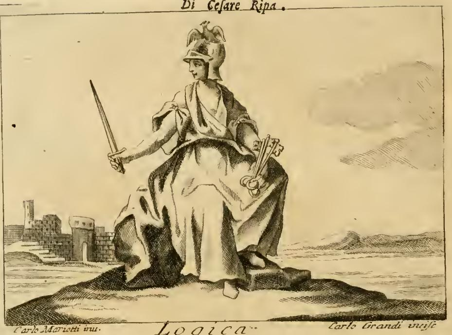

# 논리학(Logica)의 네 열쇠 — 삼단논법의 '격'과 흰옷의 의미

## 카드 정리

**질문**: 논리학 도상의 네 열쇠는 무엇을 상징하는가?

**답**: 삼단논법의 각 격(figura sillogistica)에서 진리를 여는 네 가지 방식을 뜻한다. 흰옷은 진리와 흰색의 유사성 때문으로, 진정한 논리학자는 궤변가(Sofista)가 아니라 진리를 목표로 해야 함을 나타낸다.

---

## 1. 판화를 먼저 보자

그림에서 실제로 확인되는 요소는 이렇다.

- **투구(elmo)** — 머리에 씌워져 있고, 그 위 **투구 장식(cimiero)으로 새 한 마리**가 앉아 있다. 원문이 말하는 **송골매(Falcone pellegrino)**다.
- **오른손의 얇고 긴 칼** — 이것이 원문의 **stocco**(찌르는 세검)다. 넓게 베는 칼이 아니라 '뾰족한' 칼이라는 점이 핵심이다.
- **왼손, 허리 옆의 열쇠 다발** — 자루가 여러 개 겹쳐 보이는 물건. 이것이 **네 개의 열쇠(quattro chiavi)**다.
- **흰(밝게 비워둔) 겉옷** — 판화에서는 색을 쓸 수 없으므로 음영 없이 남겨두어 흰색을 표현했다.
- 배경의 **폐허가 된 성탑** — 논쟁으로 상대의 논변을 '함락시키는' 논리학의 위력을 암시하는 배경 장치로 읽힌다.

## 2. 원문 근거 (이탈리아어 → 한국어)

출처: `02 Letters to Lust.md`, LOGICA 항목 (Cesare Orlandi 개정·주해판, Perugia 1764–67 계열. 판화 하단에 *Carlo Mariotti inv. / Carlo Grandi incise* 서명이 보인다.)

**(가) 도상 규정**

> *DOnna giovane vivace, e prosita, vestita di bianco. Tiene uno stocco nella destra mano, e nella sinistra quattro chiavi con elmo in capo; e per cimiero un Falcone pellegrino.*

젊고 생기 있고 단정한 여인, **흰옷**을 입었다. **오른손에는 세검(stocco)**, **왼손에는 네 개의 열쇠**를 들고, 머리에는 **투구**를, 그 투구 장식으로는 **송골매**를 얹었다.

**(나) 각 지물의 뜻**

> *si dipinge con lo stocco, il quale è segno di acutezza d'ingegno; e l'elmo in capo mostra stabilità, e verità di scienza: e siccome il Falcone s'innalza affin di preda, così il Logico disputa altamente, per far preda del discorso altrui.*

- 세검 = **재기의 예리함(acutezza d'ingegno)**
- 투구 = 학문의 **안정성과 진리성**
- 송골매 = 먹이를 잡기 위해 높이 솟구치듯, 논리학자는 **높은 차원에서 논쟁하여 남의 논변을 사냥한다**

**(다) 네 열쇠 — 이 카드의 핵심 문장**

> *Le quattro chiavi significano i quattro modi di aprire la verità in ciascuna figura sillogistica, insegnate con molta diligenza da' Professori di quest'arte.*

**네 개의 열쇠는 각각의 삼단논법 격(figura sillogistica)에서 진리를 여는 네 가지 방식을 뜻하며, 이 기예의 교수들이 매우 정성껏 가르쳐 온 것이다.**

**(라) 흰옷**

> *Vestesi di bianco, per la similitudine, che ha la bianchezza colla verità, perché come quello fra i colori è il più perfetto: così questa fra le perfezioni dell'anima è la migliore, e più nobile, e deve esser il fin di ognuno che voglia esser vero Logico, e non Sofista, ovvero Gabbatore.*

흰색을 입는 것은 **흰색이 진리와 닮았기** 때문이다. 흰색이 색들 가운데 가장 완전하듯, 진리는 영혼의 완전성들 가운데 가장 좋고 고귀하다. 그리고 그것이 **참된 논리학자(vero Logico)가 되려는 모든 이의 목표**여야 하며, **궤변가(Sofista)나 사기꾼(Gabbatore)**이 되려 해서는 안 된다.

**(마) 같은 항목의 두 번째 변형 — '진리의 궤짝'과 열쇠**

Ripa는 Logica의 다른 판본 도상(얼굴을 베일로 가리고, 흰옷 위에 **여러 색의 겉옷**을 덧입고, 굵은 밧줄의 매듭을 조이는 여인)도 함께 싣는데, 여기서 열쇠 은유가 훨씬 노골적으로 풀린다.

> *...ne nasce poi finalmente la dimostrazione, la quale è come una cassa, ove sia riposta la verità, e si apre per mezzo delle chiavi già dette de' sillogismi probabili...*

**논증(dimostrazione)은 진리가 담긴 궤짝(cassa)과 같고, 그것은 앞서 말한 개연적 삼단논법의 열쇠들로 열린다.** 흰옷 위의 **여러 색 겉옷**은 진리를 덮고 있는 **그럴듯한 것들(cose verisimili)**이고, 흰색만이 빛의 가장 순수한 결과 = 진리 자체다. 밧줄의 **매듭**은 상대가 반박할 수 없게 묶어버리는 **확실한 결론**, 밧줄의 **거칢**은 이 학문의 어려움이다.

> 정리: **열쇠 = 삼단논법의 형식**, **궤짝 = 논증**, **궤짝 속 내용물 = 진리**. 논리학은 진리를 '만드는' 기술이 아니라 **여는** 기술이라는 것이 이 은유의 요점이다.

---

## 3. 그러면 '격(figura)'이 대체 무엇인가

여기가 이 카드의 진짜 학습 지점이다.

### 3.1 삼단논법의 기본 골격

아리스토텔레스적 정언 삼단논법은 세 개의 항(term)과 세 개의 명제로 이루어진다.

- $S$ = **소항(minor term)** — 결론의 주어
- $P$ = **대항(major term)** — 결론의 술어
- $M$ = **중항(middle term)** — 두 전제에는 나오지만 **결론에는 나오지 않는** 항

결론은 항상 $S$–$P$ 꼴이다. 그래서 두 전제에서 자유롭게 위치를 바꿀 수 있는 것은 **오직 $M$뿐**이다.

### 3.2 격은 '중항의 자리'로 갈린다

$M$이 대전제·소전제에서 각각 주어냐 술어냐 — 이 2×2 = **네 가지 조합**이 곧 네 개의 격이다.

| 격 | 대전제 | 소전제 | 결론 | 중항 $M$의 자리 |
|---|---|---|---|---|
| 제1격 | $M$–$P$ | $S$–$M$ | $S$–$P$ | 대전제 주어 / 소전제 술어 |
| 제2격 | $P$–$M$ | $S$–$M$ | $S$–$P$ | **두 전제 모두 술어** |
| 제3격 | $M$–$P$ | $M$–$S$ | $S$–$P$ | **두 전제 모두 주어** |
| 제4격 | $P$–$M$ | $M$–$S$ | $S$–$P$ | 대전제 술어 / 소전제 주어 |

수식으로 쓰면

$$
\text{I: } \frac{M\text{–}P,\; S\text{–}M}{S\text{–}P} \qquad
\text{II: } \frac{P\text{–}M,\; S\text{–}M}{S\text{–}P} \qquad
\text{III: } \frac{M\text{–}P,\; M\text{–}S}{S\text{–}P} \qquad
\text{IV: } \frac{P\text{–}M,\; M\text{–}S}{S\text{–}P}
$$

제1격만 $S \to M \to P$로 화살표가 일직선으로 흐른다. 그래서 아리스토텔레스는 제1격을 **완전한(perfect) 삼단논법**이라 불렀고, 나머지 격은 전제를 환위(conversion)하거나 순서를 바꾸어 제1격으로 **환원(reduction)**함으로써 타당성을 증명했다.

### 3.3 식(mood)과 중세의 기억 시구

각 명제는 **전칭/특칭 × 긍정/부정**의 네 유형뿐이다. 중세 논리학은 여기에 모음 문자를 붙였다.

| 기호 | 이름 | 형태 | 예 |
|---|---|---|---|
| $A$ | 전칭긍정 | 모든 $X$는 $Y$다 | 모든 고래는 포유류다 |
| $E$ | 전칭부정 | 어떤 $X$도 $Y$가 아니다 | 어떤 고래도 어류가 아니다 |
| $I$ | 특칭긍정 | 어떤 $X$는 $Y$다 | 어떤 포유류는 고래다 |
| $O$ | 특칭부정 | 어떤 $X$는 $Y$가 아니다 | 어떤 포유류는 고래가 아니다 |

격이 정해지고 세 명제의 유형($A/E/I/O$)이 정해지면 그것이 하나의 **식(modus, mood)**이다. 형식적으로 가능한 조합은 $4 \times 4^3 = 256$개지만, 타당한 것은 소수다. 그 타당한 식들의 이름을 **모음에 대·소전제·결론의 유형을 심어 넣어** 외우게 만든 것이 유명한 기억 시구다.

- **제1격**: **Barbara** · **Celarent** · **Darii** · **Ferio** — 모음만 뽑으면 $AAA$, $EAE$, $AII$, $EIO$
- **제2격**: **Cesare** · **Camestres** · **Festino** · **Baroco** — $EAE$, $AEE$, $EIO$, $AOO$
- **제3격**: **Darapti** · **Disamis** · **Datisi** · **Felapton** · **Bocardo** · **Ferison** — $AAI$, $IAI$, $AII$, $EAO$, $OAO$, $EIO$
- **제4격**: **Bramantip** · **Camenes** · **Dimaris** · **Fesapo** · **Fresison** — $AAI$, $AEE$, $IAI$, $EAO$, $EIO$

> 자음도 장식이 아니다. 이름의 첫 자음($B, C, D, F$)은 **환원될 제1격의 식**을 가리키고(Cesare → Celarent, Camestres → Celarent, Darapti → Darii …), 중간의 $s$ = 단순환위, $p$ = 제한환위(per accidens), $m$ = 전제 순서 교체(mutatio), $c$ = 귀류법(per contradictionem)이라는 **환원 절차 지시문**이다. 즉 시구 자체가 "이 열쇠를 제1격 열쇠로 바꿔 끼우는 방법"의 압축 매뉴얼이다.

### 3.4 각 격의 대표 식 — 구체적 예문

**제1격 Barbara** ($AAA$), $\dfrac{\text{모든 } M \text{는 } P,\; \text{모든 } S \text{는 } M}{\text{모든 } S \text{는 } P}$

- 대전제: 모든 **포유류**($M$)는 **폐로 숨을 쉰다**($P$).
- 소전제: 모든 **고래**($S$)는 **포유류**($M$)다.
- 결론: 그러므로 모든 **고래**($S$)는 **폐로 숨을 쉰다**($P$).

**제2격 Cesare** ($EAE$), $\dfrac{\text{어떤 } P \text{도 } M \text{가 아니다},\; \text{모든 } S \text{는 } M}{\text{어떤 } S \text{도 } P \text{가 아니다}}$

- 대전제: 어떤 **어류**($P$)도 **젖을 먹여 새끼를 키우지** 않는다($M$).
- 소전제: 모든 **고래**($S$)는 **젖을 먹여 새끼를 키운다**($M$).
- 결론: 그러므로 어떤 **고래**($S$)도 **어류**($P$)가 아니다.
- 특징: 중항이 두 전제에서 모두 술어. 제2격은 **결론이 항상 부정문**이다. '이것은 저 부류가 아니다'를 증명하는, 즉 **배제·반박 전용 열쇠**다.

**제3격 Datisi** ($AII$), $\dfrac{\text{모든 } M \text{는 } P,\; \text{어떤 } M \text{는 } S}{\text{어떤 } S \text{는 } P}$

- 대전제: 모든 **고래**($M$)는 **포유류**($P$)다.
- 소전제: 어떤 **고래**($M$)는 **남극 해역에 산다**($S$).
- 결론: 그러므로 **남극 해역에 사는 어떤 것**($S$)은 **포유류**($P$)다.
- 특징: 중항이 두 전제에서 모두 주어. 제3격은 **결론이 항상 특칭**이다. 하나의 사례가 두 성질을 겸한다는 데서 출발하므로, **반례 제시와 존재 주장**에 강한 열쇠다.

**제4격 Camenes** ($AEE$), $\dfrac{\text{모든 } P \text{는 } M,\; \text{어떤 } M \text{도 } S \text{가 아니다}}{\text{어떤 } S \text{도 } P \text{가 아니다}}$

- 대전제: 모든 **고래**($P$)는 **포유류**($M$)다.
- 소전제: 어떤 **포유류**($M$)도 **아가미로 숨 쉬지** 않는다($S$).
- 결론: 그러므로 **아가미로 숨 쉬는 어떤 것**($S$)도 **고래**($P$)가 아니다.
- 특징: 중항이 대전제 술어 → 소전제 주어. 화살표가 $P \to M \to S$로 **결론과 반대 방향**으로 흐른다. 그래서 제4격은 '거꾸로 된 제1격'처럼 보이고, 바로 이 점이 아래 3.6의 논쟁을 낳았다.

### 3.5 '네 개의 열쇠'라는 은유를 어떻게 연결할까

원문 문장은 **"in ciascuna figura sillogistica"**, 즉 "**각 격에서**"라고 못박고 있다. 그래서 읽는 방식이 두 겹이다.

**(1) 축자적 독법 — 열쇠 = 한 격 안의 네 개의 식(modi).**
Ripa/Orlandi가 말하는 *quattro modi*는 문자 그대로 **한 격 안에서 결론을 끌어내는 네 가지 형태**다. 제1격의 Barbara–Celarent–Darii–Ferio, 제2격의 Cesare–Camestres–Festino–Baroco가 정확히 네 개다. 스콜라 교재는 이 넷을 한 세트로 암송시켰고, 도상은 그 '네 개짜리 열쇠 꾸러미'를 손에 쥐게 했다. (엄밀히 말하면 제3격은 여섯, 제4격은 다섯이므로 '모든 격이 정확히 넷'은 교육용으로 다듬어진 표현이다. 제1·제2격을 표준 사례로 삼은 관용적 정식화로 보면 된다.)

**(2) 통상적 요약 독법 — 열쇠 넷 = 격 넷.**
카드 답안이 취하는 각도다. 결론 $S$–$P$라는 하나의 문(진리)이 있고, 그 문을 여는 통로가 중항의 배치에 따라 **정확히 네 가지**뿐이다. 열쇠는 서로 다르게 생겼지만 **모두 같은 궤짝을 연다** — (마)의 *cassa* 은유와 정확히 맞물린다.

두 독법은 실은 같은 얘기를 층위만 달리해서 한 것이다. 핵심 이미지는 **"진리는 만들어내는 것이 아니라 이미 잠겨 있고, 논리학은 그 자물쇠에 맞는 규격화된 형식을 골라 끼우는 일"**이다. 그리고 열쇠는 **아무 모양이나 되지 않는다**. 256개의 조합 중 극소수만 자물쇠를 돌린다는 사실이 곧 형식논리의 존재 이유다.

### 3.6 왜 '4'가 미묘한 숫자였는가 — 제4격 논쟁 (사실관계 확인)

Ripa 시대의 논리학 교재에서 '넷'이라는 숫자는 그냥 넷이 아니라 **논쟁 중인 넷**이었다.

- **아리스토텔레스와 스콜라 주류는 세 개의 격만 인정했다.** 『분석론 전서』는 중항이 (i) 한쪽의 주어이면서 다른 쪽의 술어, (ii) 양쪽의 술어, (iii) 양쪽의 주어인 세 경우로만 나눈다. 오늘날 제4격에 해당하는 추론들은 제1격의 **간접식(indirect moods)**으로 처리되었다(Baralipton, Celantes, Dabitis, Fapesmo, Frisesomorum — 『Summulae logicales』 계열 교재의 제1격 9식 중 뒤쪽 다섯).
- **오컴**은 명시적으로 제4격을 부정했다. 중항이 대전제 술어이고 소전제 주어인 경우는 **전제의 순서만 뒤바꾼 제1격**이므로 별개의 격이 아니라는 논거다.
- **테오프라스토스와 에우데모스**는 제1격을 직접식/간접식으로 세분했고, **갈레노스가 그 간접식을 별개의 격이라 말했다**는 보고가 전해졌다.
- 이 귀속의 실제 경로는 **아베로에스(d. 1198)의 『분석론 전서』 중주석**이다. 여기서 갈레노스에게 제4격이 돌려지고, 이 대목이 **히브리어역을 거친 르네상스 라틴어 번역**으로 유럽에 알려졌다.
- 그리고 **야코포 자바렐라(Jacopo Zabarella)**가 『De quarta syllogismorum figura』(*Opera*, 1587)에서 이 **"갈레노스의 격(figura Galenica)"**을 옹호하며 유럽 논리학에 정착시켰다.
- 현대 연구의 판정: **갈레노스는 정작 제4격을 명시적으로 거부했다.** 그가 실제로 다룬 것은 네 개의 항을 쓰는 **복합 정언 삼단논법**이 네 가지 꼴로 갈린다는 이론이었고, 후대가 이를 '단일 삼단논법의 네 격'으로 오독했다는 것이다. 다만 이 논쟁은 **어떤 추론이 타당한가**에 관한 것이 결코 아니었고, 순전히 **그것을 어떻게 분류·배열할 것인가**의 문제였다.

즉 Ripa의 『Iconologia』(초판 1593, 도판 1603, Orlandi 개정판 1764–67)가 놓인 시기는 **자바렐라의 4격 논의가 막 표준 교재로 퍼지던 시기**와 겹친다. 그래서 논리학 여신이 하필 **네 개**의 열쇠를 쥐고 있다는 도상은, 당대 교실에서 실제로 오가던 숫자를 그대로 집어든 것으로 읽을 수 있다.

---

## 4. 흰옷 = 진리, 그리고 궤변가에 대한 경고

카드 답안의 후반부다. 논리 규칙을 아는 것과 진리를 목표로 하는 것은 다르다는 이야기다.

- **흰색의 논거**: 흰색은 색 중에 가장 완전하다(당시의 광학·색채관에서 흰색은 **빛의 가장 순수한 결과**). 진리는 영혼의 완전성 중 가장 고귀하다. → 유사(similitudine)에 의한 대응.
- **여러 색 겉옷의 논거**: 두 번째 변형 도상에서 흰옷을 **덮고 있는** 여러 색은 **그럴듯한 것들(verisimilia)**이다. 많은 사람이 이 색들에 시선이 멈춰(*molti fermando la vista*) 그 아래의 흰색을 잊는다. 개연적 전제들을 규칙에 맞게 단계적으로 끌어올리면 마침내 논증이 나오지만, 색깔에 만족하고 멈추면 거기서 끝난다.
- **Sofista / Gabbatore**: 여기서 궤변가는 '논리를 모르는 사람'이 아니다. **똑같은 열쇠를 쥐고 있으나 궤짝을 여는 데 쓰지 않고 상대를 속이는 데 쓰는 사람**이다. 밧줄 은유가 이 위험을 그대로 보여준다 — 논리학자는 상대가 반박할 말을 잃게 매듭을 조이지만, 그 매듭이 **진리에 묶인 것인지 아닌지**는 형식만으로 보장되지 않는다.
- **형식논리 용어로 옮기면**: 타당성(validity)은 형식의 문제이고, 건전성(soundness)은 전제의 참까지 요구한다. 네 열쇠는 타당성을 준다. **흰옷은 건전성을 요구한다.** Ripa의 도상은 이 두 층을 서로 다른 지물로 갈라 놓은 것이다.

---

## 5. 한 줄 암기용 요약

> 네 열쇠 = 중항의 위치로 갈리는 **네 개의 격**(과 각 격에서 진리를 여는 네 개의 식)이며, 논증이라는 **궤짝**을 여는 규격화된 형식이다. 흰옷 = 빛의 가장 순수한 색이 곧 **진리**이므로, 참된 논리학자의 목적은 열쇠 솜씨 자랑이 아니라 궤짝 안의 진리이며 **궤변가(Sofista)가 되지 않는 것**이다.

## 참고

- 원문: `.fm/assets/02 Letters to Lust.md` — LOGICA 항목 (3개 변형 도상 + 주해)
- 판화: `.fm/assets/Iconologia (Cesare Ripa)/_page_51_Picture_2.jpeg` (= 이 문서의 `fig-1.jpeg`)
- [Fourth figure | syllogistic | Britannica](https://www.britannica.com/topic/fourth-figure)
- [New Light from Arabic Sources on Galen and the Fourth Figure of the Syllogism (Project MUSE)](https://muse.jhu.edu/article/229815/summary)
- [Giacomo Zabarella (Stanford Encyclopedia of Philosophy)](https://plato.stanford.edu/entries/zabarella/)
- [Syllogism — The Logic Museum](https://www.logicmuseum.com/wiki/Syllogism)
- [Ancient Logic (Stanford Encyclopedia of Philosophy)](https://plato.stanford.edu/entries/logic-ancient/)
