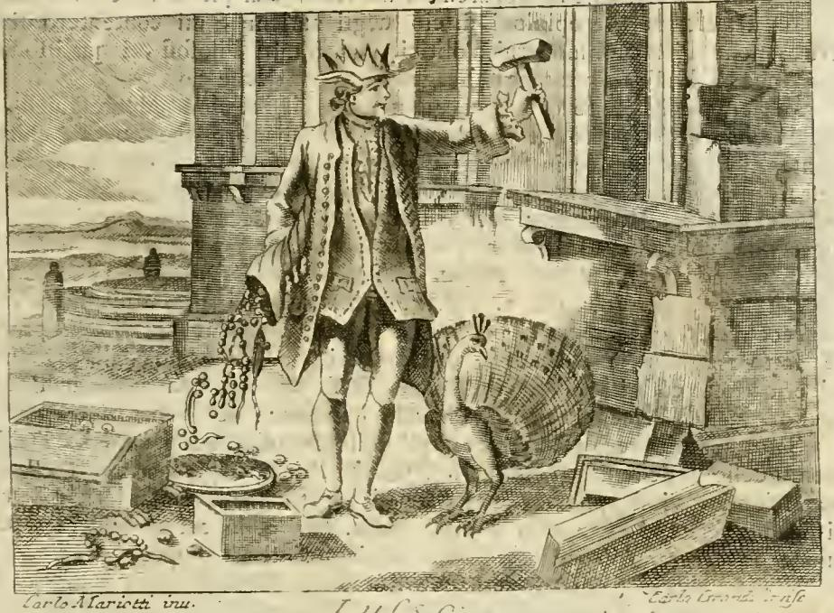

# 몽테스키외와 볼테르의 사치 옹호론 — 오를란디가 소개하고 반박하는 방식

## 카드의 맥락: 이 대목은 누가, 어디서 쓴 것인가

이 카드의 출처는 체사레 리파(Cesare Ripa)의 『이코놀로지아(Iconologia)』, 그중 **오를란디 개정판**의 「LUSSO(사치)」 항목이다.

- 리파의 원본 『이코놀로지아』는 **1593년 초판**(삽화 없음)으로 나온 도상학 사전이다. 추상적 개념(덕·악덕·감정·학문 등)을 어떻게 인물상으로 그릴지 규정해 놓은, 화가·조각가를 위한 매뉴얼이었다.
- 이 카드의 텍스트는 리파가 쓴 것이 **아니다**. **체사레 오를란디(Cesare Orlandi, 1734–1779)** 신부가 **페루자, 1764–67년**에 펴낸 증보판(*notabilmente accresciuta d'immagini, di annotazioni e di fatti*)에서 **오를란디 자신이 새로 써넣은 주석(annotazione)**이다. 본문 페이지 머리에 `TOMO QUARTO`가 찍혀 있으니 제4권 수록이다.

**이 구분이 결정적이다.** 리파는 16세기 말 사람이므로 몽테스키외·볼테르를 알 수 없다. 즉 이 항목은 **16세기 도상학 사전의 형식 안에, 18세기 계몽주의 논쟁이 삽입된 지층**이다. 오를란디는 "사치"라는 옛 알레고리 항목을 해설하는 척하면서, 실제로는 당대 프랑스 계몽 경제학의 최신 쟁점에 이탈리아 가톨릭 모럴리스트로서 개입하고 있다.

오를란디가 논의를 여는 방식 자체가 이 구도를 드러낸다. 그는 고대인의 견해는 접어두고(*tralasciando le opinioni su ciò degli antichi*) **"몇몇 근대 정치사상가와 저명한 철학자들"(alcuni moderni Politici, ed illustri Filosofi)**의 견해, 즉 **사치가 국가에 유익하다고 주장하는 쪽**을 먼저 소개하겠다고 선언한다. 그 대표로 호명되는 두 사람이 몽테스키외와 볼테르다.

---

## 1. 몽테스키외 — 오를란디의 소개

오를란디의 원문:

> *Merita spezialmente di essere rammentato il celebre **Montesquieu**, il quale tanto nello **Spirito delle Leggi**, quanto in altre sue opere, chiaramente mostra di sentire in favore del Lusso, e sostiene, che il Principe stesso, perché sia potente, dee fare in modo, che i suoi sudditi vivano nelle delizie; e dee cercar tutti i mezzi di procurar loro ogni sorta di superfluità colla stessa attenzione, con cui dee lor procurare le cose più necessarie alla vita.* — `Lettres Persan. 106`

번역: "특별히 언급할 만한 이는 저명한 **몽테스키외**이다. 그는 『**법의 정신**』에서도, 다른 저작들에서도 사치에 찬성하는 입장을 분명히 드러내며, **군주가 강력해지려면 신민들이 향락 속에 살게 해야 하고, 삶에 가장 필요한 것들을 마련해 주는 것과 똑같은 주의를 기울여 온갖 종류의 사치품을 마련해 주어야 한다**고 주장한다."

### 인용의 실제 출처

오를란디가 `Lettres Persan. 106`으로 붙인 이 구절은 『법의 정신』이 아니라 **『페르시아인의 편지』(1721)**의 것이며, 원문은 다음과 같다.

> *De tout ceci, on doit conclure, Rhédi, que, pour qu'un prince soit puissant, il faut que ses sujets vivent dans les délices ; il faut qu'il travaille à leur procurer toutes sortes de superfluités avec autant d'attention que les nécessités de la vie.*
>
> "이 모든 것으로부터, 레디여, 우리는 이렇게 결론지어야 한다. **군주가 강력하려면 그의 신민들이 향락 속에 살아야 한다. 그는 삶의 필수품에 쏟는 것과 같은 주의로 온갖 종류의 사치품을 그들에게 마련해 주려 애써야 한다.**"

오를란디의 이탈리아어 번역은 이 프랑스어 문장을 거의 축자적으로 옮긴 것이다. (번호가 106인 것은 판본 차이다. 몽테스키외 사후 결정판에서는 **편지 107번**, 우스벡이 레디에게 보내는 편지에 해당한다.)

### 『법의 정신』 쪽 근거들

오를란디는 이어 『법의 정신』에서 두 대목을 끌어온다.

**(a) 제7편 제4장 — 군주정의 사치금지법**

오를란디: 아우구스투스 치하 로마 원로원이 "풍속과 여성의 사치를 교정하자"고 발의했을 때, 이 우아한 군주가 **얼마나 훌륭한 기술로 원로원 의원들의 성가신 요구를 조롱했는지**(*con quale bell'arte quello grazioso Principe schernì le istanze importune de' Senatori*) 디오 카시우스(54권)에서 보는 것이 흥미롭다고 적는다. 티베리우스 치하에서도 조영관들이 옛 사치금지법 복원을 발의했으나, **"좋은 식견을 가진"** 이 군주는 이에 반대하며 타키투스 『연대기』가 전하는 저 훌륭한 편지를 원로원에 보내, **그 법들이 국가에 무익하고 인민에게 모욕적임을 보여주었다**고 한다.

이는 몽테스키외 『법의 정신』 **제7편 제4장 "군주정에서의 사치금지법(Des loix somptuaires, dans les monarchies)"**의 내용이다. 몽테스키외의 논지는 아우구스투스가 공화정을 해체하고 군주정을 세우는 중이었기에 공화정적 풍속 교정 요구를 회피한 것이 정합적이었다는 것이다.

**(b) 제20편 제4장 — 군주정의 상업은 사치에 기초한다**

오를란디: *Il Commercio ... pare che ne' Governi Monarchici sia fondato sopra dei Lusso, e che l'oggetto unico, o principale, sia di procurare alla Nazione ... tutto quello, che può fomentare, o dare sfogo al suo orgoglio, che può servire ad aumentare, e mantenere le sue delizie, e le sue fantasie.*

"상업은 **군주정 정부에서는 사치에 기초하는 듯하며**, 그 유일하거나 주된 목적은 그 나라에 자신의 오만을 부추기거나 발산시킬 수 있는 모든 것, 그 향락과 환상을 증대시키고 유지할 수 있는 모든 것을 마련해 주는 데 있는 듯하다."

몽테스키외 『법의 정신』 **제20편 제4장 "여러 정부에서의 상업(Du commerce, dans les divers gouvernemens)"**의 정식은 이렇다.

> *Dans le gouvernement d'un seul, il est ordinairement fondé sur le luxe* — "**한 사람의 정부(군주정)에서 상업은 통상 사치에 기초한다**"
>
> *Dans le gouvernement de plusieurs, il est plus souvent fondé sur l'économie* — "**여러 사람의 정부(공화정)에서는 더 자주 절약에 기초한다**"

몽테스키외는 후자의 예로 티레, 카르타고, 아테네, 마르세유, 피렌체, 베네치아, 네덜란드를 든다.

---

## 2. 볼테르 — 오를란디의 소개

오를란디의 원문:

> *Dello stesso sentimento è ancora il chiarissimo Signor di **Voltaire**, il quale vuole, che tutte le **leggi Suntuarie** non provino altro, se non che i Governi non hanno sempre la vista assai grande, e che ai Ministri pare più facile il **proibire l'industria, che l'animarla**.* — `Essai sur l'Hist. General. chap. 100, Usages du XVI. Siècle`

번역: "**볼테르** 씨도 같은 견해다. 그는 모든 **사치금지법(lois somptuaires)**이 증명하는 것은 오직, **정부가 항상 그리 멀리 보지는 못한다는 것, 그리고 대신들에게는 산업을 진흥하기보다 금지하는 것이 더 쉬워 보인다는 것**뿐이라고 주장한다."

이는 볼테르 『**풍속론**(Essai sur les mœurs et l'esprit des nations)』의 15–16세기 관습을 다룬 장에서 온 것이다. (오를란디가 붙인 `chap. 100`은 판본 차이다. 이 저작은 초기에 *Abrégé de l'histoire universelle* / *Essai sur l'histoire générale* 등의 제목으로 나왔고 장 번호가 판마다 이동했다. 결정판에서 "15·16세기의 관습" 장은 121장이다.)

### 「세속인의 변호」의 축자 번역

오를란디는 이어, 볼테르가 사치에 대해 내린 더 "우아하고 아마 더 사려 깊은" 판단은 **"세속인(l'Uomo di mondo)을 변호하는 저 아름다운 시편"**에 있다고 하며 그 논지를 요약한다. 이 시는 볼테르의 「**세속인**(Le Mondain)」(1736)에 대한 격렬한 반발에 맞서 1737년에 쓴 「**세속인의 변호, 또는 사치의 옹호**(Défense du Mondain ou l'apologie du luxe)」다.

오를란디의 요약을 원시와 나란히 놓으면, 그것이 **연속된 네 개의 대구(couplet)를 사실상 그대로 옮긴 것**임이 드러난다.

| 오를란디의 이탈리아어 | 볼테르 「세속인의 변호」 원문 |
|---|---|
| *confessando che il Lusso può rovinare uno **Stato piccolo**, dice che serve però ad arricchire uno **Stato grande***  (사치가 작은 나라는 망칠 수 있음을 인정하면서도, 큰 나라를 부유하게 하는 데는 쓸모가 있다고 말한다) | *Sachez surtout que le luxe enrichit / Un grand État, s'il en perd un petit.*  (무엇보다 알아두라, 사치는 큰 나라를 부유하게 하고, 작은 나라는 망친다는 것을) |
| *la grandezza, e la **pompa mondana** è il contrassegno sicuro di un **Regno felice***  (위대함과 세속의 화려함은 행복한 왕국의 확실한 표지다) | *Cette splendeur, cette **pompe mondaine**, / D'un **règne heureux** est la marque certaine.*  (이 광휘, 이 세속의 화려함은 행복한 치세의 확실한 표지다) |
| *coll'esempio dell'**Inghilterra**, e della **Francia**, ove per **cento canali** si vede circolar l'**abbondanza***  (영국과 프랑스의 예로써, 거기서는 백 개의 수로를 통해 풍요가 순환하는 것이 보인다) | *Ainsi l'on voit en **Angleterre**, en **France**, / Par **cent canaux** circuler l'**abondance**.*  (그렇게 영국에서, 프랑스에서 백 개의 수로를 통해 풍요가 순환하는 것을 본다) |
| *mentre il gusto del Lusso entrando in **ogni rango**, vive ivi il **povero delle vanità de' Grandi**, e la fatica impegnata dalla **mollezza**, si apre a **passi lenti** la strada alla **ricchezza*** | *Le goût du luxe entre dans **tous les rangs** : / Le **pauvre y vit des vanités des grands** ; / Et le travail, gagé par la **mollesse**, / S'ouvre à **pas lents** la route à la **richesse**.* |

마지막 항의 번역: "사치의 취향이 **모든 계층**에 들어가면서, 거기서 **가난한 자는 귀족들의 허영으로 먹고살고**, **유약함(사치 취향)이 고용한 노동**은 **느린 걸음으로** 부(富)로 가는 길을 열어젖힌다."

즉 **오를란디는 볼테르를 요약한 것이 아니라 번역했다.** 정확한 인용이다.

### 볼테르 논지의 핵심 표어

「세속인」의 유명한 정식이 이 입장을 압축한다.

> *Le superflu, chose très nécessaire* — "**잉여, 그것은 매우 필요한 것**"

그리고 「세속인」의 사치 예찬:

> *J'aime le luxe, et même la mollesse, / Tous les plaisirs, les arts de toute espèce, / La propreté, le goût, les ornements : / Tout honnête homme a de tels sentiments.*
>
> "나는 사치를, 심지어 유약함까지 사랑한다. 온갖 즐거움, 모든 종류의 예술, 청결, 취향, 장식을. 모든 교양인은 그런 감정을 가진다."

---

## 3. 판화: 오를란디가 이 논쟁 끝에 세우는 이미지

논쟁을 마친 뒤 오를란디는 *"Vegniamo ora alla spiegazione della Figura"*(이제 도상 설명으로 가자)라며 판화 해설로 넘어간다. 즉 **이 정치경제 논쟁 전체가 아래 한 장의 도상을 정당화하는 서론**이다.

리파-오를란디의 도상 규정(*UOmo pomposamente vestito...*)과 판화에서 실제로 관찰되는 요소를 대조하면 다음과 같다.

| 도상 요소 | 원문 규정 | 오를란디의 해석 |
|---|---|---|
| **왕관 쓴 거인** | *Con corona reale in testa ... Sia di statura gigantesca* | 사치의 **비상한 힘**, 그리고 "특히 현재 세상에서 얼마나 자라났는지"를 나타냄 — **완전히 주인이자 지배자, 나아가 폭군(Signore, Dominatore, ed anzi Tiranno)**이 되었다 |
| **관자놀이의 날개** | *e le ali alle tempia* | 사치는 인간의 **변덕스러운 공상(capricciosa Fantasia)**에서 태어났고 거기에 전부 달려 있으며, **규칙도 질서도 이성도 없이** 불어나 오직 **인간 사고의 경박함**에만 이끌린다 |
| **왼손의 풍요의 뿔** | *il corno di dovizia versante denari, gioje ec. sopra alcune basse e rozze casette* | 사치는 흔히 **천민·삯일꾼의 행운**이다. 새 유행을 계속 발명해내는 그들은 유행 애호가들로부터 큰돈을 받아 진창에서 벗어나 두각을 드러내고, **부자의 재산이 그들에게 쏟아져 그들은 부자가 되고 부자는 가난하고 멸시받는 자가 된다** |
| **오른손의 큰 망치** | *sostenga un grave mastello ... in atto di gettare a terra alcuni magnifici Palazzi* | 사치는 **재산의 낭비, 최고 가문들의 절멸, 도시들의 파멸** |
| **꼬리를 편 공작** | *Avanti i piedi gli si ponga un Pavone colla coda spiegata* | 피에리오 발레리아노(24권)에 따라 **낭비가·허영가의 상형문자**. 공작 꼬리는 놀랍도록 아름답지만 **비행에도 운동에도 쓸모가 없고 오직 색채의 과시를 위해서만 주어진 것** — 다른 새들에게 꼬리는 방향타 구실을 하는데 |

판화에서 실제로 보이는 것: 화면 중앙에 **왕관을 쓰고 관자놀이에 날개가 달린 인물**이 서 있고, **오른팔을 높이 들어 망치를 쥔 채** 오른쪽 건물을 내리치는 자세다. 건물 석재가 실제로 **떨어져 나와 흩어지고 있다**. **왼손에서는 진주 목걸이·보석·화폐가 줄줄이 흘러내려** 발치 왼쪽의 **낮고 조악한 상자 같은 구조물과 접시** 위로 쏟아진다. 오른쪽 발치에는 **꼬리를 활짝 편 공작**이 있다. 아래 여백에 `Carlo Mariotti inv.`(원화)와 `Carlo Grandi`(판각) 서명이 있다.

**주목할 점**: 마리오티는 사치를 고대풍 의상이 아니라 **당대 18세기 남성 정장**(단추가 촘촘한 긴 프록코트, 반바지, 스타킹)으로 그렸다. 이는 오를란디의 해설 *"quanto in specie al presente sia egli nel Mondo cresciuto"*("특히 **현재** 세상에서 얼마나 자라났는지")와 정확히 맞물린다. 알레고리가 **동시대 비판**으로 전환된 것이다. 몽테스키외·볼테르가 옹호한 그 "세속인(l'homme du monde / l'Uomo di mondo)"이 바로 이 옷을 입고 있다.

---

## 4. 오를란디의 반박 — 논쟁의 실제 구도

카드의 답은 "소개되는 입장"까지지만, 오를란디가 두 사람을 소개한 **목적은 반박**이라는 점이 이 항목의 뼈대다.

> *Mi sia permesso il dimostrare, soltanto per passaggio, che non meno i celebri Signori di **Montesquieu**, e di **Voltaire**, che qualunque Politico della sentenza loro, si fanno conoscere su questo soggetto **non del tutto buoni Filosofi, e molto meno ottimi Politici**.*
>
> "지나가는 길에 다만, 저 저명한 **몽테스키외**와 **볼테르** 두 분도, 그들과 같은 견해의 어떤 정치사상가도 이 주제에서는 **전적으로 훌륭한 철학자가 아니며, 훌륭한 정치사상가는 더더욱 아님**을 보여드리는 것을 허락해 주시기를."

반박의 축은 넷이다.

1. **몽테스키외에 대한 자기모순 지적.** 군주를 강력하게 만들려고 **"신민들을 파멸시키는 자(autore della rovina de' sudditi fuoi)"**로 만들려 한다는 것은 정연한 이성에서 벗어난 것이다. 좋은 군주라면 **신민의 부(富)가 왕좌의 가장 강한 지지대이고 가장 아름다운 장식**임을 안다. 나아가 오를란디는 "온갖 종류의 사치품을 마련해 주라"와 "**삶에 필요한 것들을 마련해 주는 것과 같은 주의로**"라는 두 구절이 병존할 수 없다고 비웃는다 — **사치로 신민을 무(無)로 만드는 주의와, 생필품을 마련해 주는 주의가 어떻게 함께 있을 수 있는가?**

2. **magnificenza / lusso 개념 구별.** 반대편 정치사상가들이 "**요점을 놓친다(non colgono il punto)**"는 것이 오를란디의 핵심 반론이다. 그들은 **웅장함(magnificenza)·적정함(proprietà)·품위(decoro)·좋은 취향(buon gusto)**을 **사치(lusso, 즉 superfluità)**와 **혼동**한다. 전자는 **각자의 신분과 재력에 비례하는 한** 칭송받을 만하고, 후자는 "**그 자체로, 어느 측면에서 보든 항상 악하고 규탄받을 만한 것**"이다. 오를란디는 연수입 2만 스쿠도와 1만 스쿠도의 두 귀족 예시로 이를 정량화한다 — 전자가 1만 5천을, 후자가 7천을 쓰면 둘 다 웅장함이고 공익에 이롭지만, 후자가 **전자와 경쟁하려 들면** 그 지출은 웅장함이 아니라 "**방탕·오만·광기(prodigalità, arroganza, pazzia)**"이며 그것이 **사치의 정체**다. (이는 아리스토텔레스–토마스주의의 *magnificentia* 대 *prodigalitas* 구별을 18세기 경제 논쟁에 이식한 것이다.)

3. **"순환" 논변의 뒤집기.** 볼테르의 "백 개의 수로를 통한 풍요의 순환"에 대해, 오를란디는 돈이 순환한다는 사실 자체는 부인하지 않는다. 다만 그것은 **"악순환(circolo vizioso)"**, 즉 **"항상 가난한 자의 손해로 이루어지는 순환"**이라고 한다. 부자가 절대적 필요와 상대적 필요를 충족한 뒤 남는 것을 **전혀 무용한 것**에 쓰는 동안, 가난한 자는 **절대적 필요를 박탈당한다**. 작은 나라에 대해서는 볼테르 자신의 양보를 역이용해, 사치 때문에 돈의 순환이 **국경 밖으로 새어나간다**고 논한다.

4. **달랑베르를 끌어들인 협공.** 오를란디는 **달랑베르(『철학의 요소』, 1759, 「인간의 도덕」)**를 "저 위대한 철학자"로 칭하며 자기 편에 세운다.
   > *Che il Lusso è un delitto contro l'umanità, ogni qualvolta un solo membro della società è in stento, e quello stento non s'ignora.*
   > "**사회의 단 한 구성원이라도 궁핍에 있고 그 궁핍이 알려져 있는 한, 사치는 인류에 대한 범죄다.**"
   >
   > *Esso è il flagello delle Repubbliche, e l'instrumento del Despotismo dei Tiranni.*
   > "**그것은 공화국들의 재앙이요, 폭군들의 전제(專制)의 도구다.**"

   이는 전략적으로 영리한 수다. **『백과전서』의 공동 편집자를 동원해 다른 계몽 철학자들을 논박**함으로써, 오를란디는 반(反)계몽적 반동이 아니라 **계몽 내부의 논쟁 참여자**로 자신을 위치시킨다.

---

## 5. 18세기 '사치 논쟁(luxury debate)'의 지형

이 항목은 유럽 전역에 걸친 논쟁의 한 국지적 개입이다. 좌표를 정리하면:

**옹호 쪽 (사치 = 산업·상업·문명의 동력)**

| 인물·저작 | 연도 | 논지 |
|---|---|---|
| **버나드 맨더빌**, 『꿀벌의 우화』(*The Fable of the Bees: or, Private Vices, Publick Benefits*) | 시 「불평하는 벌집」 1705, 단행본 1714, 확대판 1723 | **"사적 악덕이 공공의 이익"**. 벌집은 벌들이 정직과 덕으로 살기로 결정하자 경제가 붕괴하고 텅 빈 나무에서 소박하게 살게 된다. 음주·탐식·사치 소비·물질주의가 시장경제의 필수 구성요소다. 1723년판 이후 대(大)스캔달. |
| **몽테스키외**, 『페르시아인의 편지』; 『법의 정신』 | 1721; 1748 | (아래 "정확성" 절 참조) 부의 불평등이 있는 곳에 사치는 필연이며, **군주정에서 상업은 사치에 기초**한다. |
| **볼테르**, 「세속인」·「세속인의 변호」; 『철학 편지』(영국 서한); 『풍속론』 | 1736·1737; 1734; 1756 | **"잉여, 그것은 매우 필요한 것."** 사치금지법은 정부의 근시안일 뿐. 영국·네덜란드 체류와 맨더빌의 영향. |
| **데이비드 흄**, 「사치에 대하여」 → 「기예의 세련에 대하여」(*Of Refinement in the Arts*) | 1752(『정치론』), 1760년부터 제목 변경 | 기예·산업의 세련은 부·자유·사교성·사회적 덕을 함께 키운다. 사치의 무조건적 악덕 규정을 거부. |

**비판 쪽 (사치 = 부패·불평등·덕의 상실)**

| 인물·저작 | 연도 | 논지 |
|---|---|---|
| **장자크 루소**, 『학문예술론』(*Discours sur les sciences et les arts*) | 1750 | 학문·예술의 진보가 풍속을 **부패**시켰다. 스파르타적·공화주의적 덕과 소박함의 옹호. 사치 옹호론에 대한 가장 유명한 반격. |
| **달랑베르**, 『철학의 요소』 | 1759 | 위 인용. 궁핍한 자가 한 명이라도 있으면 사치는 인류에 대한 범죄. |
| **체사레 오를란디**, 『이코놀로지아』 「LUSSO」 | 1764–67 | 본 항목. **magnificenza/lusso 구별 + 그리스도교 도덕(잉여는 빈자에게 속한다) + 순환의 악순환론.** |

**오를란디의 위치**: 그는 **이탈리아 가톨릭 모럴리스트**의 자리에서 프랑스 계몽 경제학에 개입한다. 그의 결정적 전제는 **"그리스도교 도덕(la Morale Cristiana)"**이 명시적으로 요구하는 바, 즉 **부자는 절대적 필요와 상대적 필요를 충족한 뒤 남는 모든 것을 빈자에게 주어야 한다**는 것이다. 이는 경제적 효율 논변이 아니라 **재산의 목적에 관한 신학적 논변**이며, 바로 이 지점에서 그는 볼테르식 순환론과 애초에 다른 판 위에 서 있다.

---

## 6. 오를란디의 요약은 얼마나 정확한가

이것이 이 카드의 가장 중요한 학습 지점이다. **볼테르 인용은 정확하고, 몽테스키외 인용은 왜곡이 있다.**

### 볼테르: 정확함 (거의 축자 번역)

위 대조표가 보여주듯 오를란디는 「세속인의 변호」의 네 대구를 순서대로 옮겼고, 『풍속론』의 사치금지법 비판도 논지를 보존한다. 게다가 오를란디는 **볼테르가 스스로 단 유보 조건("작은 나라는 망칠 수 있다")을 정확히 전달하고**, 오히려 그 유보를 자기 반박의 발판으로 쓴다 — *"우리는 그가 스스로 놓은 그 한계를 이 원리에 놓는 쪽으로 기울어 있다."* 또 볼테르가 산업·좋은 취향·상업·풍요를 자극한다는 점은 **부인하지 않는다(non si nega)**고 명시한다. 지적으로 정직한 인용이다.

### 몽테스키외: 세 가지 왜곡

**(1) 정체(政體)별 상대성이 지워졌다 — 가장 중요한 왜곡.**

오를란디는 몽테스키외가 *"사치에 찬성하는 입장을 분명히 드러낸다(chiaramente mostra di sentire in favore del Lusso)"*고 쓴다. 그러나 몽테스키외의 『법의 정신』 제7편은 **사치 찬반론이 아니라 사치와 정체의 상관관계에 관한 이론**이다. 제7편의 장 제목 자체가 이를 보여준다.

- 제1장 「사치에 대하여(Du luxe)」 — **"사치는 언제나 재산의 불평등에 비례한다"**(*Le luxe est toujours en proportion avec l'inégalité des fortunes*). 이는 **권고가 아니라 법칙의 진술**이다. 그리고 "부자들이 많이 쓰지 않으면 가난한 자들이 굶어 죽을 것"이라는 것은 **불평등이 이미 전제된 사회 안에서의** 귀결이다.
- 제2장 「**민주정**에서의 사치금지법」 — **"부가 균등하게 분배된 공화국에서는 사치가 있을 수 없다."** 여기서 몽테스키외는 **사치금지법을 지지**한다. 그의 체계에서 민주정의 **원리(principe)는 덕(vertu)**이고, 공화정적 검약은 지켜져야 한다.
- 제3장 「**귀족정**에서의 사치금지법」
- 제4장 「**군주정**에서의 사치금지법」 — 여기서만 **사치금지법이 부적절**하다고 논한다.

즉 몽테스키외는 **"사치는 좋다"고 말한 적이 없다.** 그는 **"어떤 정체에는 사치가 구조적으로 필연이고, 어떤 정체에는 사치 억제가 적합하다"**고 말했다. 오를란디는 **군주정에 관한 진술만 떼어내 몽테스키외의 일반적 입장으로 제시**하며, **공화정에 관한 정반대 진술(제7편 2–3장)은 소개하지 않는다.** 마찬가지로 제20편 제4장도 **"군주정에서는 사치, 공화정에서는 절약"**이라는 **대구(對句)**인데, 오를란디는 앞 절반만 인용한다.

**(2) 소설의 등장인물 대사를 저자의 교설로 제시했다.**

가장 강한 논거로 쓰인 "군주가 강력해지려면…" 구절은 **『페르시아인의 편지』**, 즉 **서한체 소설**에서 **가공의 인물 우스벡(Usbek)이 레디(Rhédi)에게 보내는 편지**의 결론이다. 게다가 그것은 **레디가 제기한 반대 주장**("예술과 세련된 향락이 제국을 약화시킨다")에 대한 **논박으로 제시된 한쪽 입장**이다. 몽테스키외의 서한체 소설은 원래 **여러 목소리가 서로 상대화되는 구조**이며, 우스벡 자신도 작품 전체에서 일관되거나 신뢰할 만한 화자가 아니다. 오를란디는 이 문학적 틀을 지우고 **몽테스키외 본인의 정치 교설로 인용**한다. (오를란디가 『법의 정신』을 먼저 거론한 뒤 실제로는 소설 구절을 결정적 증거로 쓰는 순서가 이 미끄러짐을 만든다.)

**(3) "파멸시키라"는 함의를 몽테스키외에게 귀속시켰다.**

오를란디는 몽테스키외가 군주를 *"신민들의 파멸의 저자"*로 만들려 한다고 논박한다. 그러나 인용문 어디에도 신민을 파멸시키라는 말은 없다 — 오를란디의 **"사치=superfluità=항상 악"**이라는 자기 정의를 대입했을 때만 나오는 결론이다. 몽테스키외는 사치를 **부의 불평등한 분배 아래에서 화폐가 순환하는 메커니즘**으로 기술했고, 오를란디는 그것을 **도덕적 악덕**으로 재규정한 뒤 그 재규정에 근거해 모순을 지적한다. **논점 선취(petitio principii)**에 가깝다.

### 정리

| | 오를란디의 제시 | 실제 |
|---|---|---|
| **몽테스키외** | 사치를 옹호하는 사람 | 사치를 **정체별로 상대화**한 사람. 공화정에서는 사치금지법 지지, 군주정에서는 반대 |
| **몽테스키외 인용 출처** | 『법의 정신』을 앞세우고 `Lettres Persan. 106` | 결정적 구절은 **소설 속 인물 우스벡의 발언**(편지 107) |
| **볼테르** | 사치금지법 비판 + 큰 나라/작은 나라 구별 + 영국·프랑스의 순환 | **정확**. 「세속인의 변호」의 네 대구를 축자 번역, 볼테르 자신의 유보까지 보존 |

---

## 요점 정리

- 출처는 리파가 아니라 **오를란디**가 페루자판(1764–67) 「LUSSO」 항목에 써넣은 주석이다. 16세기 도상학 매뉴얼 안에 18세기 사치 논쟁이 삽입된 구조다.
- **몽테스키외**: 군주가 강력해지려면 신민이 향락 속에 살게 하고 필수품과 같은 주의로 사치품을 마련해 주어야 하며(『페르시아인의 편지』 106/107), 군주정의 상업은 사치에 기초한다(『법의 정신』 20.4). 사치금지법 반대의 사례로 아우구스투스(디오 카시우스 54권)와 티베리우스(타키투스 『연대기』)를 든다(『법의 정신』 7.4).
- **볼테르**: 사치금지법은 **정부의 근시안**과 "산업을 진흥하기보다 금지하기가 쉬워 보이는" 대신들의 태만만을 증명한다(『풍속론』). 사치는 **작은 나라는 망쳐도 큰 나라는 부유하게** 하며, 세속의 화려함은 **행복한 치세의 표지**이고, **영국·프랑스에서 백 개의 수로로 풍요가 순환**한다(「세속인의 변호」, 1737).
- 오를란디는 이 둘을 소개한 뒤 **"훌륭한 철학자도, 더욱이 훌륭한 정치사상가도 아니다"**라며 반박한다. 무기는 ① **magnificenza(신분에 비례하는 웅장함) 대 lusso(항상 악한 잉여)의 구별**, ② **악순환론**(순환은 하지만 빈자의 절대적 필요를 박탈하며 이루어진다), ③ **그리스도교 도덕**(잉여는 빈자의 것이다), ④ **달랑베르 인용**을 통한 계몽 내부로부터의 협공이다.
- 판화는 **왕관 쓴 거인**(사치의 압도적 힘, 현재의 폭군), **관자놀이의 날개**(변덕스러운 공상, 무규칙), **돈·보석을 쏟는 풍요의 뿔**(천민의 벼락출세와 부자의 몰락이라는 역전), **궁전을 부수는 망치**(가문과 도시의 파멸), **꼬리를 편 공작**(무용한 과시)로 구성된다. 마리오티가 이를 **동시대 18세기 복장**으로 그린 것이 오를란디의 "지금 세상에서 자라났다"는 논지와 맞물린다.
- 논쟁의 배경 좌표: **맨더빌**(1714, 사적 악덕이 공공의 이익) → **볼테르**(1736–37) / **몽테스키외**(1748) / **흄**(1752) 대 **루소**(1750, 『학문예술론』) / **달랑베르**(1759) / **오를란디**(1764–67).
