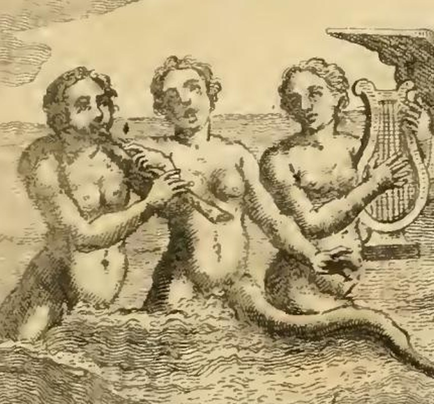
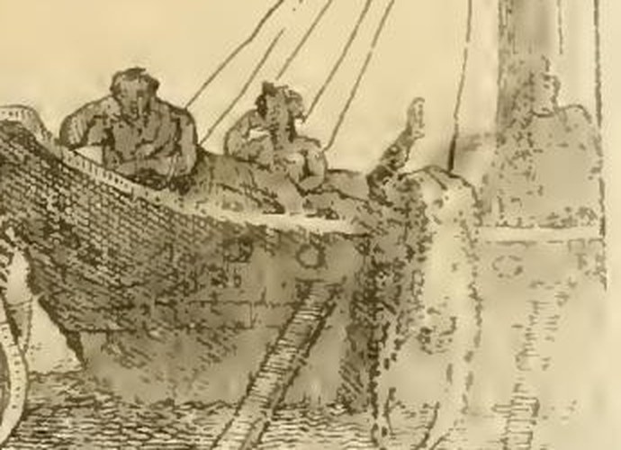

# 세이렌(SIRENE) — 오를란디의 도상 지시문

> **Q.** 오를란디는 '세이렌(Sirene)'을 어떻게 그리게 했는가?
>
> **A.** 바다 속 세 명의 아름다운 처녀로, 허리 아래는 물고기 또는 새의 몸이며 어깨에 날개를 붙여도 좋다. 하나는 피리를 불고, 하나는 리라를 들고, 하나는 노래한다. 같은 바다에 배 한 척을 그려 사람들이 일부는 잠들고, 일부는 잠들려 하고, 일부는 물에 빠지는 모습을 함께 담는다.

출처: `08 Monsters and Muses.md` → `### SIRENE.` / 표제 아래 서명은 **"Dell' Abate Cesare Orlandi"**. 즉 이 항목은 체사레 리파(Cesare Ripa)의 원문이 아니라, 18세기 페루자 증보판(1764~67)의 편집자 **오를란디 신부**가 직접 새로 쓴 항목이다. 바로 뒤에 이어지는 「MUSE(무사)」 항목이 "Di Cesare Ripa"로 서명된 것과 대비된다.

*판화 하단: 왼쪽에 도안자 서명("…lo Grandi inv."), 가운데 표제 `Sirene`, 오른쪽에 판각자 서명.*

---

## 1. 원문 지시문과 판화 대조

오를란디의 지시문(원문 그대로, 장음 s가 f처럼 인쇄된 옛 활자체):

> "**I figureranno nel mare tre belliffime Donzelle**, che dal mezzo in giu **le terminano in pefce, ovvero in uccello**; e loro fi potranno anche **aggiungere le ali agli omeri**, come piace a Natal Conte, ed a molti altri Poeti. **Una di effe terrà alla bocca una piva, o flauto. L' altra avrà in mano una Lira. La terza fi dipingerà in atto di cantare.** Si dipingerà altresì nello ftello mare **un Naviglio**, fu cui fi ammirino alcuni Uomini, **parte dormienti, parte in atto di addormirfi, e parte rovinare da esso in acqua**."

지시문의 각 항목이 판화에서 어떻게 실현(또는 선택적으로 생략)되었는지 하나씩 보면:

| 오를란디의 지시 | 판화에서 관찰되는 것 | 일치 여부 |
|---|---|---|
| 바다 속(nel mare) | 세 인물 모두 허리~배까지 물결선에 잠겨 있고, 잔물결 해칭이 화면 하단 전체를 덮는다 | ○ |
| 아름다운 처녀 셋(tre belliffime Donzelle) | 상반신 나체의 젊은 여성 세 명이 좌·중·우로 나란히 | ○ |
| 하반신은 물고기 **또는** 새 | 오른쪽 인물의 비늘 돋은 뱀 같은 꼬리가 물 밖으로 길게 휘어 나와 갈라진 지느러미로 끝난다 → **물고기 쪽을 택함** | ○(물고기) |
| 어깨에 날개를 붙여도 좋다(선택) | 세 인물의 어깨에 날개가 없다. 오른쪽 리라 든 인물 뒤의 뾰족한 삼각형 검은 형태는 날개가 아니라 **배의 뱃머리(rostrum)** 다 | △ 선택지 미채택 |
| 한 명은 피리/플루트를 입에 | 왼쪽 인물이 두 손으로 관악기를 입에 대고 있고, 관대가 중앙 인물의 가슴 앞을 가로지른다 | ○ |
| 한 명은 리라를 손에 | 오른쪽 인물이 두 개의 굽은 뿔과 팽팽한 현이 보이는 고전형 **리라**를 왼팔로 안고 오른손으로 받친다 | ○ |
| 한 명은 노래하는 자세 | **중앙** 인물이 고개를 살짝 들고 입을 벌린 채 아무 악기도 들지 않았다(지시문에선 "세 번째"지만 화면 배치는 가운데) | ○ |

세부 확대에서 확인되는 점:
- **왼쪽 = 피리(piva o flauto)**: 두 손으로 관을 잡고 입술에 붙였다. 관이 앞으로 길게 뻗어 중앙 인물의 몸을 지나간다.
- **중앙 = 노래**: 입이 뚜렷하게 벌어져 있고 손에 든 것이 없다. 세 인물 중 유일하게 "소리 자체"만으로 유혹하는 존재.
- **오른쪽 = 리라**: 현이 촘촘히 그어진 리라를 몸에 기대 세우고, 그 아래로 비늘 꼬리가 이어진다.
- 화면 맨 왼쪽 배경에는 **작은 돛배 한 척이 수평선에**, 그 아래 물속에는 **또 하나의 꼬리지느러미**가 솟아 있어, 이 바다 전체가 세이렌의 영역임을 암시한다. 오른쪽 아래 물 위에도 지느러미/불가사리 모양의 형태가 하나 더 보인다.

## 2. 배와 뱃사람들 — 세 가지 파멸 단계

배는 세이렌 오른쪽에 크게, 뱃전(선체 해칭)과 사다리, 돛대 밧줄까지 그려져 있다. 그 위의 사람들이 정확히 오를란디가 요구한 **세 단계**를 보여준다.

1. **잠든 자(dormienti)** — 왼쪽 남자: 뱃전에 상체를 걸치고 고개를 늘어뜨린 채 완전히 무너져 있다.
2. **잠들려 하는 자(in atto di addormirsi)** — 그 옆의 남자: 앉아서 고개를 기울이고 손을 머리 쪽으로 올린, 졸음에 넘어가는 순간의 자세.
3. **물에 빠지는 자(rovinare in acqua)** — 뱃전 오른쪽: 다리·발이 위로 치솟은 채 몸이 배 밖으로 뒤집혀 물로 떨어지고 있다.

오를란디 본인의 해설(원문 요지):

- **Naviglio(배)** = "인간의 삶(l'umana vita)". 분별과 지혜로 다스리지 않으면 큰 위험에 노출된 상태.
- **잠들려 하는 자** = 자기 자신을 지나치게 믿어 기회(유혹)를 피하지 않고, 어리석게 그것을 시험해 보다가 난파의 위험에 스스로를 놓는 사람.
- **잠든 자** = 악덕의 품에 몸을 맡긴 사람. 기만적인 잠의 거짓 단맛에서 깨어나지 못해, 그 잠에서 곧 **영원한 죽음**으로 넘어간다.
- **물에 빠지는 자** = 자기 악덕을 신뢰해 파멸로 끌려간 불행한 자들. 그 돌이킬 수 없는 추락이 우리에게 "잘못과 마주치는 일은 피해야 하고, 이미 그 품에 있다면 곧바로 벗어나야 한다"고 가르친다.

또한 오를란디는 이 배가 **오디세우스 일화나 특정 난파 사건의 재현이 아님**을 명시한다: 감각의 아첨뿐 아니라 "우리 연약한 인간성에 위험한 모든 종류의 유혹"으로 인해 사람이 겪는 여러 위험을 뜻하게 하려고 자기 재량으로 배를 덧붙였다는 것이다("il Naviglio, che mi è piaciuto di figurare appresso, non tanto allude a ciò che si racconta di Ulisse…").

## 3. 왜 하필 '셋'인가 — 이름의 알레고리

세이렌이 셋인 것은 감각이 부딪혀 침몰하는 **세 개의 암초**를 뜻한다. 오를란디는 클레아르코스 계열의 이름 전승(Leucosia, Ligia, Partenope)에 각각을 배정한다.

| 이름 | 어원 | 뜻하는 암초 |
|---|---|---|
| **Partenope** | 그리스어 "얼굴·모습(aspetto)" 계열 | **눈(gli occhi)** — 사랑이 몰래 들어오는 문. "oculi sunt in amore duces"(프로페르티우스), "Ut vidi, ut perii"(베르길리우스) |
| **Ligia** | ligeios(낭랑한) / ligyra(달콤하게) 또는 *ligando*(묶다), *illiciendo*(꾀다) | **말(le parole)** — "Verba ligant homines", 말이 사람을 묶어 제안한 것을 실행하게 만든다 |
| **Leucosia** | 그리스어 leukon(흰) | **아름다움 = 교제(il commercio)** — 흰빛은 인간 미의 핵심 요소이며, 마음을 끌어 방종의 늪에 빠뜨리는 힘 |

그래서 세이렌 전체의 뜻은 한 문장으로: **"Per le Sirene viene significato l'ingannevol piacere del Senso"** — 세이렌은 **감각의 기만적인 쾌락**을 뜻한다. 여성의 아름다움만큼 감각을 끄는 것이 없고, 거기에 아첨하는 우아함과 요염한 애교가 겹칠 때 관능적 사랑이 이끄는 기만과 파멸이 드러나기 때문이다. 나아가 많은 이들은 세이렌이 음욕뿐 아니라 **아첨(adulazione)·오만(superbia)·나태(ozio)**까지 가리킨다고 본다(『오디세이아』 12권에서 세이렌이 오디세우스에게 거짓 찬사와 헛된 약속을 늘어놓는 대목이 아첨의 근거로 인용된다).

## 4. 배경 지식(항목 본문에서 다루는 문헌)

- **혈통·이름**: 아켈로오스와 칼리오페의 딸, 혹은 테르프시코레·멜포메네·스테로페의 딸이라는 설이 갈린다. 나탈레 콘티는 Aglaope, Pisinoe, Thelxiope로, 케릴로스는 Thelxiope·Molpe·Aglaophone로 부른다. 어깨 날개 옵션도 "나탈레 콘티와 많은 시인들이 좋아하는 대로"라는 근거가 붙는다.
- **나폴리**: 플리니우스·솔리누스·베르길리우스·실리우스·스트라본에 따라, 세이렌 **파르테노페**가 그 근처에서 죽었기에 도시가 처음 '파르테노페'로 불렸고, 파괴·재건 후 '새 도시'라는 뜻의 **나폴리(Napoli)** 가 되었다. 다른 세이렌 **레우코시아**에서는 레우코시아 섬 이름이 나왔다.
- **오디세우스와 오르페우스**: 세이렌의 화음에 끌린 뱃사람들이 시칠리아 암초에 부딪혀 죽었고, 노래를 듣고도 자유롭게 떠나는 자가 나타나면 세이렌은 죽는 운명이었다. 오디세우스는 키르케의 조언대로 자신을 돛대에 묶고 동료의 귀를 밀랍으로 막아 살아남았고(호메로스 『오디세이아』 인용), 다른 전승에서는 **오르페우스**가 키타라로 노래를 압도해 물리쳤다(아폴로니오스 『아르고나우티카』 4권 인용). 패한 세이렌들은 절망해 바다에 몸을 던져 바위로 변했다.
- **실재 논쟁**: 대부분의 저술가는 세이렌을 순전한 시적 창작으로 보지만, 실재하는 **바다 괴물**이라 주장한 이들도 있다. 항목은 사키니 신부가 전한 마나르 섬에서 그물로 16마리(암 9, 수 7)를 잡았다는 보고, 프리슬란트에서 잡혀 여러 해 사람들과 살며 실 잣기까지 배웠다는 세이렌, 노르웨이·덴마크에서 수사·수녀·주교처럼 보이는 물고기를 잡았다는 올라우스 마그누스의 기록까지 나열한다.
- **합리화 해석**: 세르비우스·팔라이파토스·도리온 등은 세이렌이 실은 **바닷가에 살며 고운 목소리로 노래해 뱃사람을 유혹하고 재산을 삼킨 세 창녀**였다고 전한다 — 암초보다 이들에게서 더 비참하게 난파했다는 것이다.

## 5. 암기 요령

- **3인 = 3악기 배치**: 피리(입) · 노래(입만) · 리라(손) → 유혹의 수단이 모두 **소리**.
- **3인 = 3암초**: 눈(Partenope) · 말(Ligia) · 교제/아름다움(Leucosia).
- **배 위의 3단계**: 졸려 함 → 잠듦 → 추락. 곧 "위험을 얕봄 → 악덕에 몸을 맡김 → 파멸".
- 하반신은 **물고기 또는 새**(둘 다 허용), 어깨 날개는 **선택**. 실제 판화는 물고기 꼬리 + 날개 없음.
