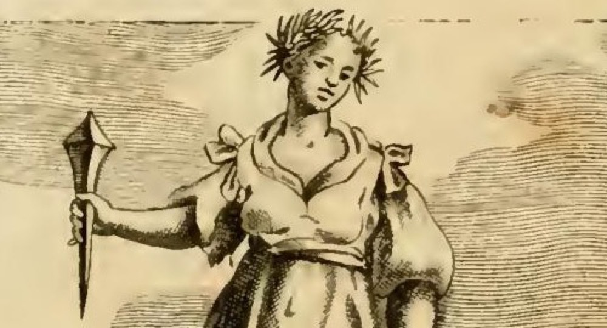

# 받은 은혜에 대한 감사의 기억 (Memoria Grata de' benefici ricevuti)

> **Q.** 카스텔리니가 그린 '받은 은혜에 대한 감사의 기억(Memoria Grata)'의 도상은?
>
> **A.** 열매 달린 노간주나무(ginepro) 가지 관을 쓴 우아한 젊은 여인이 손에 큰 못을 들고 사자와 독수리 사이에 서 있다.

이 카드는 **도상 전체의 구성을 묻는 개관 카드**다. 네 요소의 세부 근거(노간주나무의 세 가지 이유, 큰 못의 격언, 안드로클레스와 사자, 독수리 일화 2건)는 뒤따르는 카드들에서 각각 다루므로, 여기서는 **전체 지도**만 잡는다.

---

## 1. 한눈에 보는 네 요소

| 요소 | 그림에서 보이는 모습 | 뜻하는 바 (한 줄) |
|---|---|---|
| **노간주나무 관** (ramo di ginepro folto di granella) | 바늘잎이 방사형으로 뻗은 성긴 관, 이마·관자놀이 쪽에 작고 둥근 열매(granella) | 좀도 늙음도 타지 않고 잎도 지지 않으며 열매가 기억에 좋음 → **잊히지 않는 기억** |
| **큰 못** (un gran chiodo) | 오른손에 쥔 큰 대못. 넓적한 머리가 위, 뾰족한 끝이 아래를 향함 | 격언 *Clavo trabali figere beneficium* → 은혜를 **대못으로 박아 고정**함 |
| **사자** (Leone) | 여인의 오른쪽(보는 이의 왼쪽) 땅 위에 정면으로 앉아 있음 | 안드로클레스(Androdo)의 사자 → **땅짐승**의 보은 |
| **독수리** (Aquila) | 여인의 왼쪽(보는 이의 오른쪽), 날개를 반쯤 펴고 여인을 올려다봄 | 뱀에서 구해준 추수꾼을 살린 독수리 → **하늘새**의 보은 |

판화 아래 판각 서명은 `C.M. del. / Memoria grata de' Beneficj riceuti`로 되어 있다. 구도를 보면 **여인이 정확히 화면 중앙**, 사자와 독수리가 좌우 발밑에 대칭으로 놓여 삼각 구도를 이룬다 — 원문의 *"Stia in mezzo di un Leone, ed un'Aquila"*(사자와 독수리 **가운데** 서 있게 하라)를 문자 그대로 옮긴 배치다.

확대해 보면 두 가지가 분명해진다. 첫째, 머리 위의 것은 월계관 같은 매끈한 잎이 아니라 **찌르는 바늘잎이 사방으로 뻗은 가지**이고 그 사이에 작은 구슬 같은 열매가 박혀 있다(노간주 열매 = juniper berry). 둘째, 못은 손톱만 한 못이 아니라 **팔뚝 길이의 대못**이며, 넓적한 머리를 위로 두고 뾰족한 끝을 아래로 향하게 주먹으로 감싸 쥐고 있다 — 지금 막 내리쳐 박으려는 자세다. 못을 쥔 팔은 몸에서 떨어뜨려 가슴 높이로 들어 올려, 이 지물이 도상의 핵심임을 강조한다.

---

## 2. 원문 (카스텔리니)

제목·저자 표기:

> **MEMORIA GRATA** / De' benefici ricevuti / *Di Gio. Zaratino Castellini.*

도상 규정(prescription) 부분 — 원문 철자를 현대 표기로 정리:

> Una graziosa Giovane incoronata, con ramo di ginepro folto di granella. Tenga in mano un gran chiodo. Stia in mezzo di un Leone, ed un'Aquila.

직역:

> 열매가 촘촘히 달린 노간주나무 가지로 관을 쓴 우아한 젊은 여인. 손에는 큰 못을 들게 하라. 사자와 독수리 사이에 서 있게 하라.

원문은 이어서 각 지물의 근거를 순서대로 풀어낸다(아래는 뒤 카드들이 다룰 내용의 목차 격 요약).

1. **노간주 관 — 세 가지 이유**
   - ① 좀이 먹지 않고 늙지 않는다. 플리니우스: *Cariem, & vetustatem non sentit iuniperus.* → 큰 기억은 망각의 좀을 먹지 않고 늙지 않으므로 **젊은 여인**으로 그린다.
   - ② 잎이 결코 떨어지지 않는다 → 받은 은혜를 마음에서 떨어뜨리지 말아야 한다.
   - ③ 노간주 열매를 증류한 것, 노간주 재로 끓인 세정수가 기억에 좋다(구알테로의 기억술 라틴 논고, 카스토레 두란테).
   - 키케로의 표현 *Cui sum obstrictus memoria beneficii sempiterna*(그에게 나는 은혜의 영원한 기억으로 묶여 있다)에서 '영원한(sempiterna)'을 끌어와, 영원한 나무로 꼽히는 노간주가 그 상징이 될 수 있다고 못박는다.
2. **큰 못** — 에라스무스 『아다지아』류 격언집의 *Clavo trabali figere beneficium*, "서까래 못으로 은혜를 박아 고정하다". 은혜에 대해 가져야 할 **끈질긴 기억(tenace memoria)**을 뜻한다.
3. **사자** — 아울루스 겔리우스가 전하는 그리스 사가(史家) 아피온의 증언. 로마 대경기장(Circo Massimo) 맹수 사냥 구경거리에 던져진 노예 안드로도(Androdo, 아일리아누스는 Androcle)를, 예전에 발의 가시를 빼주어 치료받았던 사자가 알아보고 개처럼 꼬리를 흔들며 손발을 핥았다. 군중은 *Hic est leo hospes hominis, hic est homo medicus leonis*("이는 사람의 손님인 사자요, 이는 사자의 의사인 사람이다")라고 외쳤고 안드로도는 사면되어 사자를 선물로 받았다.
4. **독수리** — 두 일화. ① 페르가몬의 크라테스가 전하는 이야기: 추수꾼이 낫으로 뱀에 목이 감겨 질식하던 독수리를 구해주자, 나중에 그 독수리가 날아와 날개로 물병을 쳐서 떨어뜨렸고 — 그 물을 마신 동료들은 즉사했다(독이 든 물이었다). ② 플리니우스(10권): 트라키아 세스토스의 처녀가 기른 독수리가 잡은 새를 그녀에게 가져다 바쳤고, 그녀가 죽자 화장용 장작더미에 스스로 날아들어 함께 불탔다.

원문의 맺음:

> 사자는 **땅짐승의 왕**이고 독수리는 **공중의 여왕**임을 생각하면, 사람이 고귀하고 도량이 크고 관대할수록 받은 은혜에 대한 감사의 기억을 더 잘 보존한다는 결론에 이른다.

마지막 줄은 상호참조 — *"De' Fatti, vedi Gratitudine"*(관련 일화는 '감사(Gratitudine)' 항목을 보라). 즉 이 항목에는 다른 항목들처럼 붙는 '역사적 사실/우화' 부록이 없고, 이미 본문 안에 사자·독수리 일화가 들어 있다.

---

## 3. 왜 '카스텔리니'라고 표기하나 — 증보자의 존재

『Iconologia』는 체사레 리파(Cesare Ripa)의 저작이지만, 우리가 오늘 보는 방대한 항목 대부분은 **후대 판본에서 불어난 것**이다.

- 1593년 로마 초판은 삽화 없는 텍스트, 1603년판에서 목판 삽화가 붙는다.
- **조반니 차라티노 카스텔리니(Giovanni Zaratino Castellini, 1570 로마 – 1641)** 의 증보가 처음 들어간 것은 **1613년 시에나 판**이다. 이후 파도바 토치(Tozzi) 간행의 1618년판에서 300여 개 이미지가 추가되고, 리파가 직접 관여한 마지막 판인 **1625년판은 사실상 카스텔리니가 전면 개정**했다(표지에도 그의 이름이 오른다). 1630년판, 그리고 사후 1645년 베네치아판도 그의 편집 계보에 있다.
- 이 자산이 된 판본은 **체사레 오를란디(Cesare Orlandi) 편, 페루자 1764–67년판 제4권(Tomo Quarto)** 이다. 오를란디판의 특징은 **항목마다 저자를 명기**하는 것 — 그래서 이 항목 머리에는 `Di Gio. Zaratino Castellini`, 바로 뒤 '상업(Mercatura)' 항목에는 `Dell'Abate Cesare Orlandi`가 붙어 있다.

요컨대 "카스텔리니가 그린"이라는 표기는 **이 도상이 리파 원저가 아니라 증보 항목**임을 가리킨다. 그래서 앞의 두 'Memoria' 항목(리파 계열)과 문체·구성이 눈에 띄게 다르다. 카스텔리니 항목은 고전 인용을 촘촘히 쌓고 격언집(Adagia)까지 끌어와 각 지물을 논증하는 방식이라, 리파 본래 항목보다 훨씬 길고 문헌학적이다.

---

## 4. 왜 '젊고 우아한' 여인인가

앞선 항목 **Memoria**(기억 일반)의 여인은 `Donna di mezza età` — **중년 여성**이었다. 아리스토텔레스 『기억과 상기론』을 근거로, 기억력은 노년(잊어버림)과 유년(아직 배운 게 없음) 사이의 **완숙한 나이**에 가장 좋다는 논리였다.

반면 Memoria Grata는 `Una graziosa Giovane` — **우아한 젊은 여인**이다. 근거가 다르다. 노간주나무가 좀먹지도 늙지도 않는다는 성질을 사람으로 옮긴 것이므로("così la gran Memoria per tempo alcuno non sente il tarlo dell'obblivione, né mai s'invecchia, però la figuriamo giovane"), **감사의 기억은 시간이 지나도 삭지 않고 늘 갓 생긴 것처럼 생생하다**는 뜻이 된다. 감사란 힘 있고 즉각적인 정서라는 함의이기도 하다. 도상학적으로 정리하면:

- 중년 = 능력의 **정점**(기억력이라는 자연의 재능)
- 젊음 = 시간에 **불변**(은혜를 향한 감사가 늙지 않음)

즉 나이 표시가 '언제 가장 잘 되는가' → '얼마나 오래 유지되는가'로 전환된 것이다.

---

## 5. 사자와 독수리를 좌우 대칭으로 놓은 이유

카스텔리니는 두 동물을 배치한 이유를 한 문장으로 밝힌다: *"questi animali, ancorché privi di ragione, hanno mostrato di tener grata memoria de' benefizi ricevuti"* — **이성이 없는 짐승조차** 받은 은혜를 감사히 기억함을 보여주었기 때문이다.

여기서 구성의 논리가 나온다.

- **땅에서 하나(사자), 하늘에서 하나(독수리)** 를 골라 좌우에 세운다 → 창조 세계의 두 영역을 다 덮어, "보은은 인간만의 덕이 아니다"를 **논증적으로** 보인다.
- 동시에 둘은 각 영역의 **최상위**다. 사자는 육상 동물의 왕, 독수리는 공중의 여왕. 그래서 결론이 한 단계 더 나아간다 — 짐승도 하는 일이니 인간은 부끄러워하라(a fortiori 질책)에서, **가장 고귀한 짐승들이 하는 일이므로 고귀함과 보은은 같이 간다**(고귀할수록 감사한다)로 뒤집힌다.
- 그림에서 이 위계가 그대로 읽힌다. 두 동물은 여인에게 위협적으로 그려지지 않고, 특히 독수리는 **고개를 들어 여인을 올려다보는** 순종적 자세다. 맹수와 맹금이 나란히 발밑에 순하게 있는 배치는 이 여인이 사자·독수리를 굴복시킨 것이 아니라, **셋이 같은 덕을 공유하는 동료**라는 뜻이 된다.

---

## 6. 세 'Memoria' 항목 한 줄 대조

같은 책 같은 대목에 'Memoria'가 셋 연달아 나오는데, 개념이 각각 다르다.

| 항목 | 지물 | 다루는 개념 |
|---|---|---|
| **Memoria** ① | 보석함 머리장식 · 오른손으로 오른쪽 귓불을 잡음 · 검은 개 · 검은 옷 | **기억이라는 능력** — 감각이 준 형상을 굳게 보존하는 그릇("학문의 궤"). 귓불은 플리니우스의 "기억의 자리", 검은 개는 기억력 좋은 동물(오디세우스를 알아본 개) |
| **Memoria** ② | 두 얼굴 · 오른손에 펜, 왼손에 책 · 검은 옷 | **기억의 훈련과 용도** — 두 얼굴은 과거를 붙잡아 미래의 신중함(Prudenza)에 쓴다는 뜻, 펜과 책은 읽기·쓰기로 기억이 완성됨 |
| **Memoria Grata** ③ | 노간주 관 · 큰 못 · 사자 · 독수리 · 젊은 여인 | **감사의 기억** — 능력이 아니라 **윤리적 의무**. 무엇을 기억할 수 있는가가 아니라 *은혜를 잊지 않을 것*이 주제 |

①②는 인식 능력(faculty)에 대한 알레고리이고, ③은 **덕(virtue)** 에 대한 알레고리다. 그래서 ③만 지물이 전부 "잊지 않음"의 강도(영원한 나무, 대못)와 "보은의 사례"(사자, 독수리)로 채워져 있고, 검은색(견고함)·귓불(기억의 좌소)처럼 기억 능력을 가리키는 기호는 하나도 없다. 마지막 상호참조가 `Gratitudine`(감사) 항목으로 연결되는 것도 이 항목이 기억론이 아니라 **감사론**에 속함을 보여준다.

---

## 7. 암기 요령

원문 순서(관 → 못 → 사자·독수리)를 그대로 따라가면 문장이 만들어진다.

> **머리**엔 늙지 않는 나무(노간주) → **손**엔 은혜를 박는 대못 → **발밑**엔 땅과 하늘의 보은 증인(사자·독수리) → 그러니 **젊게** 그린다.

즉 위에서 아래로 "머리 - 손 - 발밑" 세 층으로 나누고, 젊음은 관(노간주)의 부산물로 딸려 나온다고 기억하면 네 요소가 빠짐없이 재구성된다.

---

### 출처

- 원문: `04 Mechanics to the Month in General.md` — MEMORIA GRATA de' benefici ricevuti, Di Gio. Zaratino Castellini (Cesare Orlandi 편 『Iconologia』, 페루자 1764–67, Tomo Quarto)
- 판화: `Iconologia (Cesare Ripa)/_page_101_Picture_3.jpeg` (본 폴더 `fig-1.jpeg`, 부분 확대 `fig-2.jpeg`)
- 판본 계보 관련: [Iconologia di Cesare Ripa — Edizioni 1593-1625](https://cesareripa.wordpress.com/edizioni-1593-1625/), [Le edizioni del 1593-1625](https://limes.cfs.unipi.it/allegorieripa/le-edizioni-del-1593-1625/), [Ripa/Castellini, Iconologia (Venezia 1645) — Heidelberg digi](https://digi.ub.uni-heidelberg.de/diglit/ripa1645)
