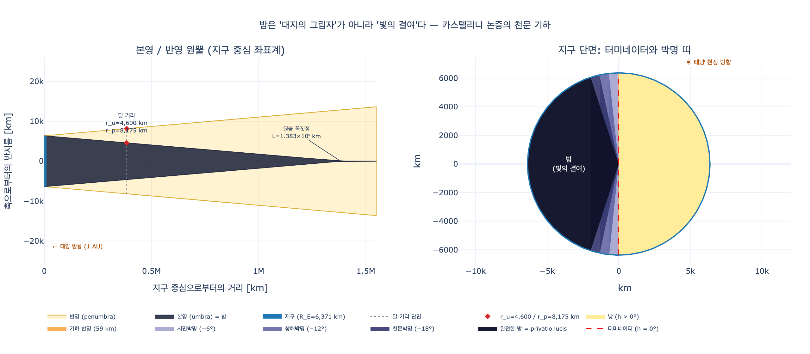

# 카스텔리니의 '밤(Notte)' 논고 — 어원과 본질

## 한눈에

체사레 리파 『이코놀로지아』의 **Notte(밤)** 항목에는 후대 편집자 **조반니 차라티노 카스텔리니**(Giovanni Zaratino Castellini, 1570?~1641?)가 붙인 긴 부록이 실려 있다. 그 부록은 도상 설명(양귀비 관, 검은 큰 날개, 별 수놓은 검은 옷, 팔에 안긴 흰 아기=잠 / 검은 아기=죽음)에 앞서 **밤이란 무엇인가**를 어원학과 자연철학 두 갈래로 따진다.

| 항목 | 내용 |
|---|---|
| 어원 | *Nox* ← *nocere*(해치다). 눈을 해쳐 **보는 행위(actus videndi)** 를 빼앗고 사물의 **색을 감추기** 때문 |
| 통설 | 밤 = **대지의 그림자**(*ombra della terra*), 그래서 밤은 '대지의 딸' |
| 카스텔리니 | 통설을 **세 갈래로 반박**. 밤은 그림자가 아니라 **빛의 결여(privatio lucis)** 이며, 그림자의 *결과*가 아니라 *원인* |

출처: `.fm/assets/10 Nobility to Obligation.md` 161~179행(페루자 1764–67 이탈리아어판 제4권, "Di Gio. Zaratino Castellini" 절). 이 지면의 판화는 assets에 추출되어 있지 않다.

---

## (a) *Nox* ← *nocere* 어원 — 그리고 그것이 틀린 이유

### 카스텔리니가 제시한 두 갈래 근거

원문:

> *Notte, dicesi dal **nocere**, perchè noce agli occhi, **privandoli della sua perfezione, cioè dell'atto del vedere**; perciocché occulta il colore delle cose, delle quali l'occhio si diletta.*
> (밤은 '해치다'에서 왔다고 한다. 눈을 해쳐 눈의 완전성 곧 **보는 행위**를 빼앗기 때문이며, 눈이 즐기는 사물의 **색을 감추기** 때문이다.)

여기서 이미 결정적인 어휘가 나온다 — **privare(빼앗다)**. 카스텔리니는 어원 단계에서부터 밤을 "무언가를 덧붙이는 것"이 아니라 "무언가를 **빼앗는 것**"으로 정의한다. 이 프레임이 곧 뒤의 세 반박을 떠받치는 지렛대가 된다. 아리스토텔레스 광학에서 **빛은 투명체(diaphanum)의 현실태**, **어둠은 그 현실태의 결여**이므로(『영혼론』 II.7, 418b), 눈에서의 결여(보지 못함)와 매체에서의 결여(어두움)는 같은 구조다.

논고 뒷부분에서 카스텔리니는 두 번째 근거를 **바로(Varro)** 에게서 끌어온다:

> *Nox (ut **Catulus** ait) quod omnia, nisi interveniat Sol, pruina obriguerint, quod nocet, Nox.*
> (카툴루스가 말하듯, 태양이 개입하지 않으면 만물이 서리에 얼어붙고 그 서리가 해를 끼치므로 '밤'이다.)

즉 ① 시각을 해친다, ② 서리·습한 밤공기로 몸을 해친다(그는 뒤에서 "밤에 병자가 더 괴로워하고 더 많이 죽는다"까지 덧붙인다), ③ 어둠이 파렴치를 낳는다(*Tenebrae verecundiam diminuunt* — 성 바실리우스; *Sub nocte omnia sunt suspecta* — 성 암브로시우스). 세 겹으로 *nocere*를 정당화하는 셈이다.

### 실제 어원 — 이것은 민간어원(paretymology)이다

| 구분 | *nox* | *noceō* |
|---|---|---|
| 조어 | Proto-Italic \*nok(ʷ)ts | Proto-Italic \*nokeje- |
| 인도유럽어 어근 | **\*nókʷt-** '밤' | **\*nek-** '죽음, 사라짐' |
| 동원어 | 그리스어 νύξ/νυκτός, 산스크리트 nákt(am), 히타이트 nekuz, 고트어 nahts, 고대영어 niht > **night**, 리투아니아어 naktìs, 교회슬라브어 noštь | 라틴어 *nex*(횡사), *necō*(죽이다), *noxa/noxius*, *innocēns*, *perniciēs*; 그리스어 νέκυς·νεκρός(시체) |

두 어근은 별개다. *nox*의 어근은 **순음화 연구개음 \*kʷ**를 가진 명사 어근이고, *noceō*는 \*nek-의 사역형(\*nok-éye- "죽게/해롭게 하다")이다. 겉보기 n–k 유사성은 우연이다. *nox*는 인도유럽어 전역에 걸친 최고(最古) 층위의 기본 어휘로, 라틴어 내부에서 동사로부터 파생될 수 있는 단어가 아니다.

*Nox a nocendo* 유형의 설명은 **바로 → 이시도루스**(『어원론』: *Nox a nocendo dicta, eo quod oculis noceat*) **→ 파피아스 → 중세·르네상스 백과사전**으로 이어진 표준 학설이었다. 즉 카스텔리니는 개인의 착각이 아니라 1,600년 묵은 전통을 그대로 받은 것이다. 고대 어원학은 음운 대응 법칙(19세기 성립) 대신 **의미의 적절함**을 기준으로 삼았고, 어원은 사물의 본성을 알려 주는 통로로 여겨졌다. 그래서 이 '틀린 어원'이 오히려 논증의 출발점 노릇을 한다 — **"해친다=빼앗는다"라는 어원 해석이 "밤=결여"라는 존재론적 결론을 예비한다.**

---

## 통설: 밤은 '대지의 그림자'다

카스텔리니는 반박 대상을 인용 계보로 정확히 세워 놓는다.

| 전거 | 내용 |
|---|---|
| **보카치오** 『신들의 계보』 | *Ex incerto Patre dicit Paulus Noctem Terrae fuisse filiam* — 밤은 아버지 미상, 대지의 딸 |
| **수이다스**(Suda) | *Nox est umbra terrae, non qualibet tamen, sed ea cuius Sol causa est, quando est sub terra…* — 밤은 대지의 그림자, 그러나 아무 그림자가 아니라 **태양이 지하에 있을 때** 그 반구에 생기는 그림자 |
| **키케로** 『신들의 본성에 관하여』 | *Ipsa umbra terrae Soli officiens noctem efficit* — 태양을 가로막는 대지의 그림자 자체가 밤을 만든다 |
| **바르톨로메우스 앙글리쿠스** 『사물의 속성에 관하여』 | *Causatur Nox ab umbra terrae* — 밤은 대지의 그림자에 의해 야기된다 |

이 통설의 인과 사슬은 **대지 → 그림자 → 밤**이다. 카스텔리니는 이 사슬을 "*se si ha da penetrare nelle sottigliezze*(정밀하게 파고들자면)"라며 세 번 끊는다.

---

## (b) 세 반박 — 아리스토텔레스 원인론으로 읽기

배경 장치 셋을 먼저 정리해 두면 논증이 훤히 보인다.

1. **4원인**: 질료인(*materialis*) / 형상인(*formalis*) / 작용인(*efficiens*) / 목적인(*finalis*).
2. **결핍(στέρησις, privatio)**: 아리스토텔레스가 『자연학』 I권에서 생성의 세 원리(형상·질료·결핍) 중 하나로 세운 것. 결핍은 *ens rationis*여서 **스스로 작용하지 못한다**(*non ens non agit*).
3. **결핍 vs 부정(negatio)**: 부정은 단순 부재(돌은 눈멀지 않았다), 결핍은 **그 형상을 가질 소질이 있는 주체에서의 부재**(사람은 눈멀 수 있다). 어둠은 *투명체*라는 적합한 주체에서의 결핍이므로 부정이 아니라 결핍이다.

### 반박 ① — 작용인은 그림자가 아니라 '불투명하고 조밀한 대지의 몸'

> *l'ombra della terra non è causa efficiente della Notte, ma piuttosto immediatamente **il corpo opaco e denso della terra**, che ci toglie la vista del Sole tramontato; però dissero coloro che la Notte è figlia della terra: **se fosse effetto dell'ombra, saria figlia dell'ombra, e nipote della terra**.*

**논지**: 그림자는 그 자체가 이미 결핍이다. 결핍은 작용하지 못하므로 작용인이 될 수 없다. 실제로 태양을 가리는 것은 대지의 **불투명성(opacitas)과 조밀함(densitas)** — 즉 대지라는 물체의 실재하는 성질이다. 그림자는 그 차폐의 *결과 영역*일 뿐 차폐의 *행위자*가 아니다.

**보강 논증(계보학적 귀류법)**: 전통은 밤을 한결같이 "**대지의** 딸"이라 불렀다. 그런데 밤이 그림자의 결과라면 밤은 '**그림자의** 딸이자 대지의 **손녀**'여야 한다. 전통의 계보와 통설의 인과가 어긋난다 → 통설이 한 단계를 잘못 끼워 넣었다. 신화 계보를 인과 도식의 검산으로 쓰는, 전형적인 르네상스 우의학의 논법이다.

**원인론 위치**: 작용인의 **직접성(causa proxima)** 을 바로잡는 수정. 대지의 몸 = 근접 작용인, 그림자 = 부수적 결과.

### 반박 ② — 오히려 '진 태양'이 밤의 원인

> *la Notte è piuttosto effetto dell'**istesso Sole tramontato**. Il Sole colla **venuta ed assistenza** sua fa il giorno, colla **partenza e privazione della sua luce** fa la Notte…*

**논지**: 낮의 원인이 태양의 **임재(assistentia)** 라면, 밤의 원인은 같은 태양의 **부재(partenza)** 다. 하나의 동일한 작용자가 있음/없음으로 두 결과를 낸다. 여기서 카스텔리니는 스콜라적으로 완전히 정확한 지점을 짚는다 — **결핍의 원인은 형상의 원인을 제거하는 것**(*causa privationis est remotio causae formae*)이며, 이는 **per accidens 원인**이다. 태양은 빛의 per se 원인이고, 진 태양은 어둠의 per accidens 원인이다.

**보강 논증(기하학)**: 바르톨로메우스 앙글리쿠스에 따르면 광원이 차폐체보다 크면 그림자는 뾰족한 원뿔이 된다 — *Ex quo patet, quod cum Sol sit maior terra facit **umbram conoidem***. 그러니 원뿔 그림자의 도형을 만드는 것도 태양이다. **그림자의 원인이 태양이면, 그림자를 매개로 밤의 원인 또한 태양**이다. 통설이 중간항으로 내세운 그림자마저 태양에게 귀속되므로, 통설은 자기 전제로 무너진다.

키케로도 같은 편으로 끌어온다: *Sol ita movetur, ut cum terras larga luce compleverit, easdem modo his modo illis ex partibus opacet.*

**원인론 위치**: **제1작용인**(causa prima inter causas)으로의 소급. 그림자는 원인 사슬의 결과 쪽 말단으로 밀려난다.

### 반박 ③ — 밤은 그림자의 결과가 아니라 **원인**이다 (형상/결핍 논증)

카스텔리니가 가장 공들인 부분이다. 먼저 **그림자의 정의**를 세운다:

> *L'ombra non è altro che **privazione** del retto e principal transito e flusso del lume **in certa e determinata quantità**, cagionata in alcun corpo dall'interposizione di corpo opaco che si oppone al corpo luminoso.*
> (그림자란 불투명체의 개입으로 어떤 물체에 야기된, 빛의 직진 흐름의 **일정하고 규정된 양에서의** 결여다.)

핵심은 **"certa e determinata"**. 그림자도 결여지만, **크기와 도형이 규정된** 결여다.

> *contenendo essenzialmente l'ombra certa e determinata **figura**, che si rappresenta nel corpo ombreggiato, consiste ella in buona parte in detta figura; **ma la Notte non include necessariamente in se tal figura**… **dato che la terra non cagionasse alcun'ombra e figura, nientedimeno per la semplice tenebra e privazione del lume, sarebbe Notte**.*

**논증 구조**:

1. 그림자는 **특정한 도형(figura)** 을 본질(*essentia*)에 포함한다 — 도형이 그림자의 형상인의 일부다.
2. 밤은 그런 도형을 본질에 포함하지 **않는다**. 밤중에 대지가 공기 중에 원뿔 그림자를 드리우는 것은 사실이지만, **그 도형은 밤의 본질 밖(*fuori dell'essenza della Notte*)** 에 있다.
3. **반사실 검증**: 설령 대지가 아무 그림자도 도형도 만들지 않았다 해도, **단순한 어둠과 빛의 결여만으로 밤일 것이다.**
4. 그러므로 밤은 그림자보다 **외연이 넓은 보편항(*termine universale*)** 이다.
5. 결론: **밤 = 대지의 개입으로 인한 양 반구에서의 빛의 결여**(형상적으로 privatio). 그 결여가 **"일정한 차원과 도형으로 한정·축소될 때(*privazione contratta e ristretta alla differenza di certa dimensione e figura*)"** 비로소 그림자가 된다.
6. 따라서 인과 방향은 뒤집힌다 — **밤이 그림자의 원인**이다. 유(genus)가 종(species)에 앞서듯, 무규정 결여가 규정된 결여에 앞선다.

**원인론 위치**: 형상인/결핍의 층위. 그림자는 밤이라는 결여에 **양·도형이라는 종차(differentia)** 가 덧붙은 종이다. 이는 "결핍은 고유한 형상을 갖지 않는다"는 스콜라 원칙의 직접 응용이다 — 고유 형상이 없으니 고유 도형도 없다.

### 카스텔리니의 자기 완화 — 왜 이렇게 견해가 갈리는가

논증을 마친 뒤 그는 방법론적 반성을 덧붙인다. 원인 논쟁이 엉키는 이유는:

> 때로는 **다른 원인들의 원인**을 보고, 때로는 **원격 원인**, 때로는 **근접 원인**을 보며, 때로는 이 항(terminus)을 다른 항보다 앞세우고, **때로는 원인을 결과로, 결과를 원인으로 잡으며**, 여럿이 함께 한 사물을 이룰 때 어떤 이는 이 부분에, 어떤 이는 저 부분에 전체를 귀속시키기 때문이다.

그리고 화해를 제시한다: 밤이 진 태양의 결과든, 대지의 불투명한 몸의 결과든, 대지의 그림자의 결과든, 혹은 빛의 결여로서 그림자의 원인이든 — **어느 쪽이든 "밤은 그림자다"라고는 말할 수 있다.** 다만 **부분적으로(*parzialmente*)** 다. 밤이 그림자를 구성하는 항들 중 **하나**를 포함하고 있기 때문이다. 끝으로 플라톤 『티마이오스』를 인용해 대지가 낮과 밤 **양쪽**의 제작자(*diei noctisque effectricem*)라고 덧붙인다.

여기가 이 논고의 지적 미덕이다. 카스텔리니는 통설을 파괴하는 게 아니라 **인과 층위(근접/원격, per se/per accidens, 보편/특수)를 분리해 재배치**한다.

---

## (c) '빛의 결여(privatio lucis)'의 스콜라 철학적 지위

카스텔리니의 3번 논증은 즉흥적 착상이 아니라 스콜라 존재론의 표준 항목이다.

### 어둠은 실체가 아니다

| 층위 | 내용 |
|---|---|
| 아리스토텔레스 | 빛 = 투명체가 투명체인 한에서 갖는 **현실태(ἐνέργεια)**. 어둠 = 그 현실태의 **결여**(『영혼론』 II.7) |
| 토마스 아퀴나스 | *tenebrae*(어둠)는 **결핍의 교과서적 예시**로 반복 등장. 결핍은 *ens reale*가 아니다 — "*nulla privatio est ens*" |
| 창조론 | 하느님은 어둠을 **창조하지 않았다**. 창세기 1:4는 "빛을 어둠에서 **갈랐다**(*divisit*)"고만 한다. 어둠은 창조의 대상이 아니라 빛의 부재 영역 |

그러므로 "어둠은 무엇으로 만들어졌는가"는 잘못된 질문이다. 어둠은 **만들어지지 않고, 빛이 물러남으로써 남는다.** 이것이 카스텔리니가 "진 태양이 밤의 원인"이라 말할 수 있는 근거다.

### 악을 선의 결핍으로 보는 논의와의 평행

이 구조는 서양 신학의 가장 유명한 결핍 논증과 정확히 겹친다.

| | **악 (privatio boni)** | **밤 (privatio lucis)** |
|---|---|---|
| 존재 지위 | 악은 존재자가 아니다. 선의 부재 | 어둠은 존재자가 아니다. 빛의 부재 |
| 주체 | 선한 존재자 안에서만 가능 ("선할 수 있는 것만이 악할 수 있다") | 투명한 매체에서만 가능 |
| 원인 | **per se 작용인이 없다.** 아우구스티누스: *causa non efficiens sed **deficiens*** (『신국론』 XII.7) — 결핍적 원인 | per se 원인 없음. 태양의 **떠남**이라는 결핍적 원인 |
| 창조 | 신은 악을 창조하지 않았다 | 신은 어둠을 창조하지 않았다 |
| 표준 예시 | 아퀴나스의 **눈멂(caecitas)** — 시각이라는 마땅한 선의 결핍 | 카스텔리니의 *"눈에서 보는 행위를 빼앗는다"* — **바로 그 눈멂!** |
| 반대 학설 | **마니교**: 악을 빛과 맞선 **실체**로 봄 | 어둠을 능동적·실체적인 것으로 보는 관념 |

주목할 만한 대응: 아퀴나스가 결핍을 설명할 때 드는 대표 예시가 **눈멂**인데, 카스텔리니가 *nox ← nocere*를 풀 때 쓴 표현이 정확히 "**눈의 완전성 곧 보는 행위를 빼앗는다**"다. 두 사람이 같은 예시를 쓰고 있다. 아우구스티누스가 마니교의 '어둠 실체론'과 싸워 *privatio boni*를 세운 것과, 카스텔리니가 '그림자 실체론'(그림자가 밤을 *만든다*)과 싸워 *privatio lucis*를 세운 것은 **동일한 논법의 광학 버전**이다.

또 하나의 함의: 결핍은 스스로 작용하지 못하지만 **다른 것의 원인일 수는 있다**(*privatio ut causa*). 눈멂이 넘어짐의 원인이 되듯이. 밤이 그림자의 원인이라는 카스텔리니의 결론은 이 여지를 정확히 활용한 것이다.

---

## (d) 현대 천문학이 보는 밤 — 어디까지 맞고 어디서 갈라지는가

### 현대적 그림

- **밤의 진짜 작용인은 지구의 자전**(항성일 23h 56m 04s)이다. 태양과 대지의 불투명성은 밤의 **조건**(광원과 차폐체)이고, 밤낮의 **교대**를 일으키는 것은 자전이다. 카스텔리니에게는 이 항이 아예 없다 — 그는 태양이 "지하에 있다(*sotterra*)"는 지심적 언어로 서술한다.
- 밤의 기하학적 궤적은 **본영(umbra) 원뿔**이다. 태양 반지름 $R_S$, 지구 반지름 $R_E$, 거리 $d$에서
  $$L = \frac{R_E \, d}{R_S - R_E} \approx 1.383 \times 10^6\ \text{km}$$
  달 거리(384,400 km)에서 본영 반지름 약 **4,600 km**, 반영 반지름 약 **8,175 km** (월식 관측과 일치). 원뿔 반각은 약 **15.8′** — 극히 뾰족하다.
- 밤은 이 원뿔의 **안쪽**이며, 지표에서는 원뿔 밑면의 반구가 곧 밤 반구다.

### 정합: 카스텔리니가 옳았던 것

| 반박 | 현대적 평가 |
|---|---|
| ① 그림자는 작용자가 아니다 | **옳다.** 그림자는 기하학적 영역(region)이지 물리적 행위자가 아니다. 차폐를 하는 것은 지구의 **광학적 불투명성**이다 |
| ③ 도형은 밤의 본질이 아니다 | **정확하다.** 원뿔의 도형은 오직 $R_S$와 $d$가 정한다. 태양이 점광원이면 그림자는 **무한 원기둥**, 태양이 지구보다 작으면 **발산 원뿔**이 되어 도형이 완전히 뒤집히지만, "직사광이 0"이라는 사실은 한 번도 흔들리지 않는다 (→ `expy.py` 2절 계산) |
| 어둠은 실체가 아니다 | **옳다.** 물리학에 '어둠의 입자'나 '어둠의 광선'은 없다. 어둠은 광자속의 부재다. 현대 물리학은 마니교보다 아우구스티누스·카스텔리니 쪽이다 |

### 차이: 갈라지는 지점

1. **작용인의 정체.** 카스텔리니의 답(진 태양 또는 대지의 몸)은 둘 다 *조건*이다. 밤의 리듬을 만드는 것은 자전이며, 카스텔리니의 체계에는 그 자리가 없다.
2. **'밤은 이항적이 아니다'.** 결핍은 보통 있음/없음의 이분법인데, 실제 밤은 연속 스펙트럼이다. 순수 기하학적 반영 띠는 지표에서 **59 km**(태양 각반지름 16′의 두 배)에 불과한데, 천문박명 경계(태양 고도 −18°)는 터미네이터에서 **약 2,000 km**나 안쪽에 있다. 그 차이를 만드는 것은 그림자 도형이 아니라 **대기 산란으로 남는 간접광**이다. 우리가 체감하는 "밤이 되는 과정"의 대부분은 카스텔리니의 도형 논쟁 바깥에 있다.
3. **완전한 어둠은 없다.** 천문박명이 끝난 뒤에도 밤하늘에는 별빛, 대기광(airglow), 황도광, 은하광, 그리고 지구 자신의 열적외선 복사가 있다. "빛의 완전한 결여"는 이상적 한계값이지 관측 사실이 아니다.
4. **역설적 보강.** 그러나 3번 논증만은 현대 기하가 오히려 **강화**해 준다. 지구 자전축 기울기·궤도 이심률·태양 크기를 어떻게 바꿔도, 심지어 태양이 확장 광원이 아니게 되어 원뿔이 사라져도, "태양 반대편은 직사광을 받지 않는다"는 명제는 불변이다. **도형은 우연적(accidentale), 결여는 본질적(essenziale)** — 카스텔리니의 결론 그대로다.

---

## 정리

| 층위 | 통설 | 카스텔리니 | 현대 |
|---|---|---|---|
| 밤의 정의 | 대지의 그림자 | **빛의 결여**(privatio lucis) | 직사 태양복사의 부재 |
| 작용인 | 그림자 | 대지의 불투명한 몸 / 진 태양 | **지구 자전** + 지구의 불투명성 |
| 그림자와의 관계 | 그림자 → 밤 | **밤 → 그림자**(결여가 도형으로 한정된 것) | 그림자 원뿔 = 비조명 영역의 기하학적 궤적 |
| 도형(figura) | 밤의 본질 일부 | 본질 **밖** | $R_S, d$의 함수이며 우연적 |
| 어원 | *nox* ← *nocere* | *nox* ← *nocere* (수용) | **민간어원**; 실제로는 PIE \*nókʷt- |

논고 끝에서 카스텔리니는 균형을 잡는다. 밤이 *nocere*에서 왔다 해도 밤은 여전히 "괴로운 근심의 유익한 조절자, 잠과 휴식과 고요의 어머니이자 유모, **만물의 생성자(generatrice di tutte le cose)**"라는 것이다 — 오르페우스교 찬가의 밤 관념이며, 아리스토텔레스가 『형이상학』 12권에서 언급한 그 밤이다. 해치는 밤과 낳는 밤, 결여이면서 원리인 밤. 이 양가성이 도상(흰 아기 잠 / 검은 아기 죽음을 함께 안은 밤)으로 그대로 옮겨진다.

---

## 시각화

`expy.py`를 실행하면 표준 천문 상수로 본영/반영 원뿔의 길이와 단면을 계산하고, 태양 크기를 바꿔 "도형은 바뀌어도 밤은 그대로"임을 확인하고, 박명 띠 폭과 기하학적 반영 띠 폭을 비교한다.

