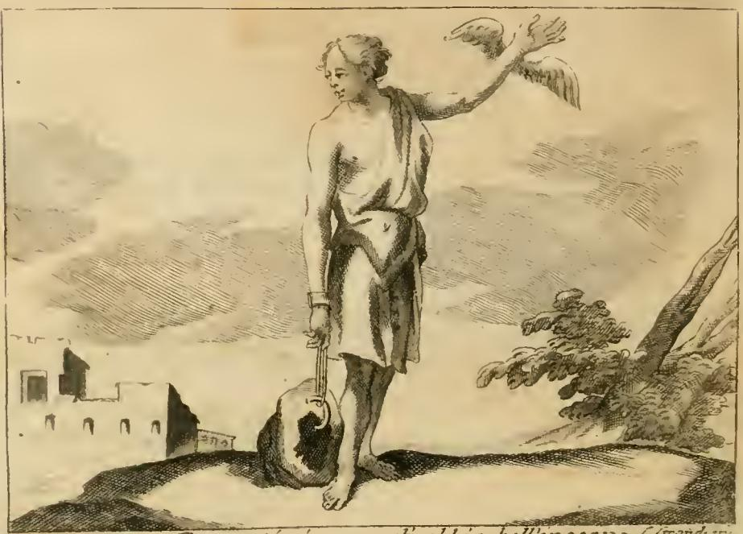

# 가난(Povertà) — 성경 사례: 부자와 라자로

## 이 항목이 실린 자리

체사레 리파 『이코놀로지아』 제4권 「POVERTA'」 항목은 여러 형태의 가난 의인상을 차례로 제시한 뒤, 관례대로 **FATTO STORICO SAGRO(성경적 사례)** — **FATTO STORICO PROFANO(세속 역사 사례)** — **FATTO FAVOLOSO(신화 사례)** 순으로 예화를 붙인다. 이 카드가 묻는 것은 그중 첫 번째, 성경 사례다.

## 핵심 답: 부자와 라자로 비유 (누가복음 16장)

원문은 "가난을 돌보지 않는 것이 하느님께 얼마나 거슬리는 일인지를 그리스도께서 다음 비유로 아주 분명히 밝히셨다"라는 문장으로 시작한다. 줄거리는 다음과 같다.

1. **부자** — 자주색 옷과 고운 모시(*si vestiva di porpora, e di bisso*)를 입고 **날마다 호화롭게 잔치를 벌였다**.
2. **라자로** — 온몸이 헌데투성이(*tutto ulcerato*)인 가난한 이가 그 부자의 **문 앞에 누워** 있었으나, 부자의 **상에서 떨어지는 부스러기조차** 얻어 굶주림을 달랠 수 없었다.
3. **개들** — 개들이 와서 라자로의 상처를 핥았다. 리파는 여기에 해석을 덧붙인다. 개들은 마치 감각이 있어 **부자의 인색함을 부끄럽게 만들려는 듯** 다가왔고, 라자로는 그 짐승들의 봉사를 고맙게 받아들였으니, 이는 **하느님이 누구를 통해 보내시든 그 위로를 받아들이라**는 가르침이라는 것이다.
4. **역전** — 하느님은 그토록 고통스러운 처지에서 견딘 인내에 관을 씌우고자 라자로를 세상에서 데려가셨다. 부자도 죽었고 제 죄로 **지옥의 영원한 벌**에 처해졌다.
5. **애원** — 부자가 눈을 들어 **아브라함의 품(nel seno di Abramo)** 에 있는 라자로를 보고 외친다. "아브라함 아버지여, 저를 불쌍히 여기시어 라자로를 보내 **손가락 끝에 물을 찍어 제 혀를 식히게** 해 주십시오. 이 불꽃의 열기에 지독히 시달리고 있습니다."
6. **아브라함의 답** — "얘야, 너는 **살아 있을 때 좋은 것을 누렸고** 라자로는 고통을 받았음을 기억하여라. 그러니 이제 라자로가 위로를 받고 네가 고통받는 것이 마땅하다."

리파가 붙인 교훈은 양방향이다. **가난한 이**는 라자로처럼 견딘 이 세상의 가난이 저 세상에서 좋은 것들의 원천이 됨을 새기고, **부유한 이**는 자기 행복을 가난한 이를 돕는 데 두지 않는 한 그 재산 속에서도 늘 가장 비참한 자임을 잊지 말라는 것이다. 출전은 본문 끝에 **Luca cap. 16**으로 명기되어 있다.

## 함께 실린 나머지 두 예화 (대조용)

- **세속 역사(FATTO STORICO PROFANO)**: 아테네의 라리온(Larione)은 극도로 가난했다. 숲에서 강도를 만났는데도 겁내기는커녕 웃으며 "당신들 헛짚었소"라고 했고, 이유를 묻자 "나는 벌거벗은 몸이라 두렵지 않아 웃는다"라고 답했다. 유베날리스의 경구 *Cantabit vacuus coram Latrone Viator*(빈털터리 나그네는 강도 앞에서도 노래한다)가 그에게 들어맞았다.
- **신화(FATTO FAVOLOSO)**: 에리시크톤(Erisittone)은 케레스에게 바쳐진 큰 참나무를 신성모독으로 베어 넘긴 뒤 채울 수 없는 굶주림에 사로잡혀, 최고 부자에서 재산이 하나도 남지 않는 비참한 가난으로 떨어졌고 끝내 제 딸을 팔아 먹을 것을 구하다가 굶어 죽었다(오비디우스 『변신 이야기』 8권).

## 판화: 「뛰어난 재능을 지닌 자의 가난」

이 장에 실린 도판은 라자로 장면을 그린 것이 아니라, 항목 첫머리의 의인상 **POVERTA' IN UNO CHE ABBIA BELL'INGEGNO(뛰어난 재능을 지닌 자의 가난)** 이다. 그림에서 실제로 확인되는 요소는 이렇다.

- **누추한 옷차림의 여인** — 한쪽 어깨만 걸친 짧고 해진 옷, 맨발. 리파의 정의 그대로 "인간이 삶을 지탱하고 덕을 얻는 데 필요한 것들의 결핍"이다.
- **오른손을 묶은 끈과 땅에 놓인 큰 돌** — 화면 아래쪽에서 여인의 오른손목이 끈으로 지면의 육중한 돌덩이에 묶여 있다. 자기 궁핍에 짓눌려 천한 처지에서 벗어나지 못하는 상태다.
- **위로 치켜든 왼손과 활짝 편 날개** — 손과 팔 사이에 날개가 매여 있고, 팔은 하늘을 향해 뻗어 있다. 덕의 어려운 높이를 향해 날아오르려는 재능 있는 가난한 자의 **열망**을 뜻한다.
- **대비 구도** — 한쪽은 하늘로 날아오르려 하고 다른 한쪽은 돌에 묶여 있는 이 상반된 몸짓이 도상의 핵심이다. 리파는 이 도상의 발명을 그리스인들의 공으로 돌린다. 배경 왼편의 허물어진 건물과 오른편의 나무는 황량한 처지를 거드는 배경이다.

부자와 라자로 이야기의 구조 — 문 앞에 누워 위를 향해 손을 뻗지만 상에서 떨어지는 부스러기조차 얻지 못하는 라자로 — 도 이 "치켜든 날개 vs 묶인 손"의 대비와 같은 심상을 공유한다.

## 같은 항목의 다른 가난 의인상들 (판화 없음)

- **집시 차림의 가난**: 목을 비틀고 구걸하는 자세의 여인, 머리 위에 할미새(codazinzola)를 얹는다. 발레리아노에 따르면 이집트인들은 극도의 가난한 사람을 나타낼 때 이 새를 그렸는데, 기력이 없어 제 둥지도 짓지 못하고 남의 둥지에 알을 낳는다고 여겼기 때문이다(리파는 정작 들판의 할미새는 제 둥지를 짓는다며 새를 혼동하지 말라고 주석을 단다). 집시로 그리는 이유는 재산도 가문도 즐거움도 희망도 없는, 그보다 더 비참한 부류를 찾을 수 없기 때문이다.
- **바위에 묶인 가난**: 벌거벗고 야윈 여인이 험한 바위 위에 앉아 손발이 묶인 채 **이빨로 끈을 풀려** 하고, 오른쪽 어깨를 **쇠똥구리**가 쏜다. 아리스토파네스 『플루토스』가 말하는 "필요한 만큼은 있는 가난"이 아니라 **먹고 살 것이 없는 궁핍**을 그린 것이다. 나지안조의 성 그레고리우스는 가난을 "많은 여정과 행위를 가로막는 여정"이라 했고, 이빨로 매듭을 푸는 몸짓은 "가난이 사람을 부지런하고 영민하게 만든다"는 속담과 테오크리토스가 디오판토스에게 한 말("예술을 깨우는 것은 오직 가난뿐")을 가리킨다. 쇠똥구리는 그 **자극(찌름)** 의 상징이다.
- **창백하고 광란하는 가난**: 아리스토파네스의 같은 희극에 따라 검은 옷을 입은 창백하고 광기 어린 여인. 창백함은 먹을 것이 모자라 혈색과 기운을 잃기 때문, 광기는 가난한 자의 말과 행동이 모두 미친 짓 취급을 받고 정신 나간 사람만큼도 신용을 얻지 못하기 때문, 검은색은 죽음과 언짢은 일의 전령으로서 가난이 성가시고 힘겹고 애통하고 비참한 것임을 알리기 때문이다.
- **도니(Doni)의 가난**: 마른 나뭇가지 위에 누운 여인, 몇 조각 누더기를 걸친 모습. 마른 가지는 스스로 열매를 맺지 못해 오직 태워질 용도로만, 즉 남의 필요와 변덕에 쓰이기 위해서만 값이 매겨지는 삶을 뜻한다. 그래서 공화국의 온갖 위험, 왕국의 온갖 고역, 도시의 온갖 부담이 곧바로 가난한 이들에게 목숨을 걸고 지워진다. 베르길리우스 『농경시』 1권 *Duris urgens in rebus egestas*(고된 일에 몰아붙이는 궁핍)를 인용한다.
- **영적 가난(Povertà di Spirito)**: 「첫 번째 참행복」 항목을 보라고 넘기며, 각주로 P. 리치의 도상을 소개한다. 창백하고 여윈 얼굴이지만 밝고 건강한 여인, 겉옷을 젖히고 어깨에 날개를 달고 하늘을 향해 얼굴을 든다. 하늘에는 보석 박힌 관이 보이고, 한 손에는 꽃다발, 다른 손에는 작은 빵을 들며, 네모난 돌 위에 서고 곁에는 보석과 돈이 가득한 풍요의 뿔이 놓인다(발밑에 두어 세속 재화의 경멸을 뜻한다).

## 암기 포인트

| 요소 | 부자 | 라자로 |
|---|---|---|
| 생전 | 자색 옷·고운 모시, 날마다 잔치 | 헌데투성이, 문 앞에 누움, 부스러기도 못 얻음 |
| 곁의 존재 | (도와주지 않음) | 개들이 상처를 핥음 |
| 사후 | 지옥의 불, 물 한 방울 애원 | 아브라함의 품 |
| 판결 | "너는 살아서 좋은 것을 받았다" | "라자로는 고난을 받았으니 이제 위로받는다" |

출전 표기: **Luca cap. 16** (누가복음 16:19–31).
