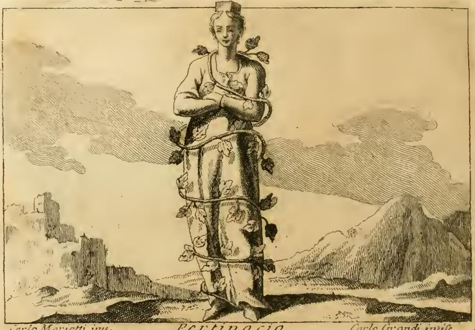
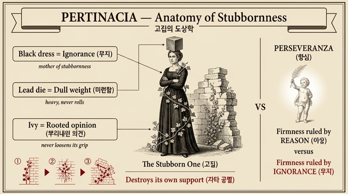

# 고집 (Pertinacia) — 체사레 리파의 의인화

## 카드 요약

**Q.** 리파는 '고집(Pertinacia)'을 어떻게 의인화했는가?

**A.** 검은 옷 위에 담쟁이가 자라나 뒤덮인 여인이 머리에 납 주사위를 이고 있다. 검은색은 완고함과 무지(고집의 어머니)를, 무겁고 움직이기 어려운 납 주사위는 그 미련함을 뜻한다. 담쟁이는 고집쟁이의 의견이 담쟁이처럼 뿌리내려 힘을 잃지 않고, 때로는 저를 지탱해 주던 벽 자체를 무너뜨리듯 저와 남을 함께 망가뜨림을 나타낸다.

## 판화 관찰

원전(『Iconologia』 4권, "PERTINACIA. Di Cesare Ripa" 항목)의 판화에서 실제로 확인되는 요소들:

- **여인과 검은(어두운) 긴 옷**: 여인은 정면을 향해 뻣뻣하게 서서 팔짱을 끼고 있다 — 자세 자체가 "움직이지 않겠다"는 완고함을 몸으로 보여준다.
- **온몸을 휘감은 담쟁이(edera)**: 덩굴이 발밑에서부터 몸을 나선형으로 여러 바퀴 감아 올라가 가슴과 어깨까지 뒤덮었다. 옷 "위에서 자라난" 식물이 사람을 결박하는 모양새다.
- **머리 위의 납 주사위(dado di piombo)**: 머리에 얹힌 네모난 육면체 덩어리. 관(冠)이 놓일 자리에 대신 놓인 "무거운 짐"이다.
- **배경 왼쪽의 무너진 성벽/폐허**: 담쟁이가 "저를 지탱해 주던 벽을 무너뜨린다"는 본문 설명을 배경 풍경으로 시각화한 것으로 읽힌다.

## 상징 해설 (원문 근거)

리파의 원문은 세 가지 도상 요소를 각각 이렇게 풀이한다.

### 1. 검은 옷 — 완고함·안정성·무지
> "Il color del vestimento significa fermezza, stabilità, ed ignoranza … e da questi effetti nasce la pertinacia."

검은색은 (좋은 뜻의) 굳건함이 아니라 **어두움(oscurità)으로 표시되는 고착과 무지**를 뜻하며, 바로 이 성질들에서 고집이 태어난다. 즉 고집은 "굳셈"의 타락형이다.

### 2. 납 주사위 — 무겁고 움직이기 어려운 미련함
> "…le si pone il dado di piombo in capo, il quale è grave e difficile da muoversi; ed il piombo è indizio dell'ignoranza … madre e nudrice della pertinacia."

- **주사위(정육면체)**: 어느 면으로 놓아도 똑같이 주저앉는, 구르지 않는 형태.
- **납**: 금속 중 가장 무겁고 둔한 것으로, 리파에게 납은 늘 **무지의 표지**다. 무지는 "고집의 어머니이자 유모(madre e nudrice)"라 불린다.
- 이것을 **머리에** 인다는 것은, 무지가 판단(머리)을 짓눌러 생각을 바꿀 수 없게 만든다는 뜻이다.

### 3. 담쟁이 — 뿌리내린 의견, 그리고 자타 공멸
> "L'edera … le opinioni degli ostinati negli animi loro fanno l'effetto che fa l'edera … la quale sebbene si radica, non perde il vigore; e … molte volte fa cadere in terra il luogo medesimo, sopra il quale si fomentava."

고집쟁이의 의견은 담쟁이처럼 마음속에 **한번 뿌리내리면 힘을 잃지 않는다**. 뽑아내려 애써도 소용없고, 심지어 **저를 받쳐 주던 벽(자기 자신, 그리고 주변 사람)을 무너뜨린다**. 담쟁이가 벽을 타고 올라 결국 그 벽을 붕괴시키듯, 고집은 고집쟁이 본인과 남을 함께 망가뜨린다.

## 대비: 항심(Perseveranza)과의 구별

같은 장에 실린 **항심(Perseveranza)** 항목이 좋은 대조가 된다. 리파는 키케로(『수사학』)를 인용해 이렇게 말한다.

> "la Perseveranza … si contrappone alla pertinacia, ed è una fermezza e stabilità perpetua del voler nostro, retta e governata dalla ragione."

| | 고집 (Pertinacia) | 항심 (Perseveranza) |
|---|---|---|
| 공통점 | 뜻을 굽히지 않음 (fermezza) | 뜻을 굽히지 않음 (fermezza) |
| 다스리는 것 | 무지 (납 = 어머니이자 유모) | **이성** (ragione) |
| 도상 | 검은 옷 + 납 주사위 + 담쟁이 | 종려 가지에 매달린 아이, 흑백 옷 + 아마란스 화관 |
| 결말 | 벽(자신·타인)을 무너뜨림 | 덕으로 나아감 |

즉 리파에게 "굳건함" 자체는 중립적이며, **이성이 다스리면 항심, 무지가 다스리면 고집**이 된다. 이 대비가 카드의 핵심을 기억하는 열쇠다.

## 암기 포인트

- **검정 = 무지·완고** (어두움 → 고집의 토양)
- **납 주사위 = 미련함** (무겁고 구르지 않음, 머리를 짓누름; 납 = 무지 = 고집의 어머니)
- **담쟁이 = 뿌리내린 의견** (뽑히지 않음 + 지탱해 주던 벽까지 무너뜨림 = 자타 공멸)
- 반대 개념: **항심(Perseveranza) = 이성이 다스리는 굳건함**

## 인포그래픽

