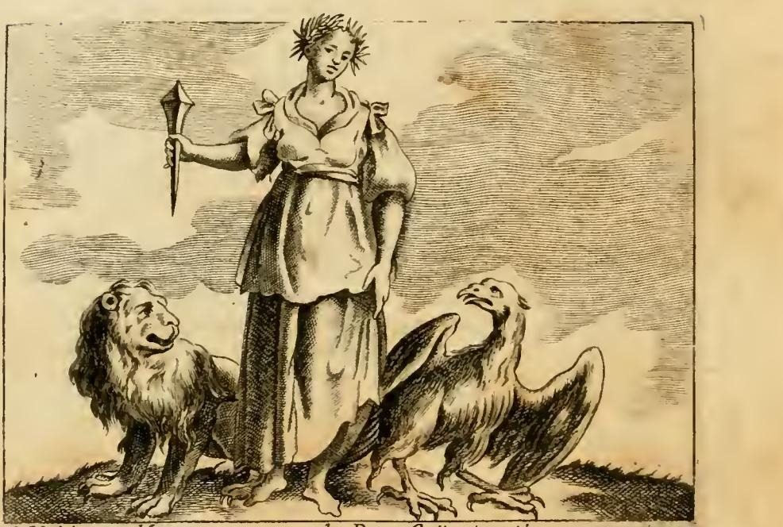
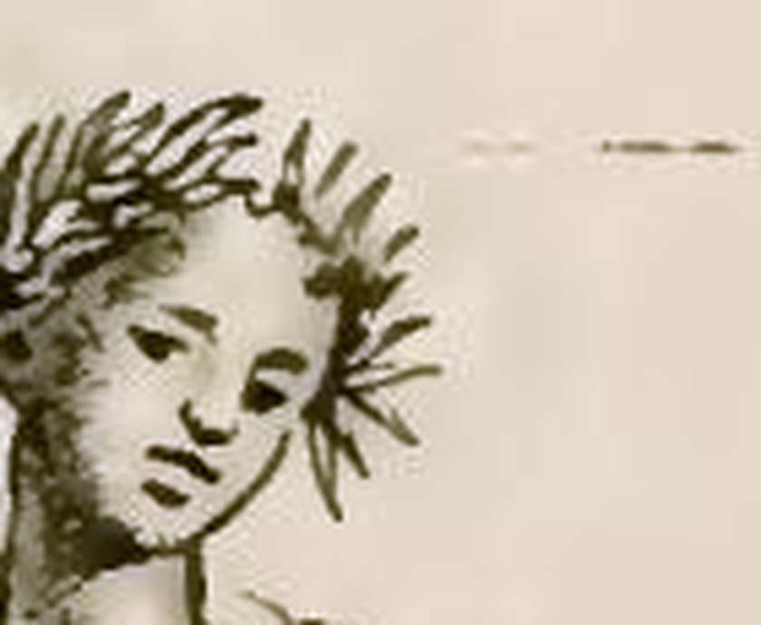

# 감사의 기억(Memoria Grata)의 노간주나무 관 — 세 가지 이유

> **Q.** 감사의 기억 도상에서 노간주나무 관의 세 가지 이유는?
>
> **A.** ① 노간주나무는 좀먹지 않고 늙지 않으니 감사의 기억도 망각의 좀을 타지 않는다(플리니우스). ② 잎이 지지 않는 나무이니 받은 은혜를 마음에서 떨어뜨리지 말아야 한다. ③ 그 열매와 재는 실제로 기억력을 강화한다고 여겨졌다.

## 0. 이 카드의 뼈대: 세 이유는 서로 다른 층위의 논증이다

암기용으로 셋을 나열해서 외우면 금방 섞인다. 실제로는 **논증의 종류가 셋 다 다르다.**

| # | 층위 | 노간주나무의 성질 | 기억으로의 이행 | 근거 |
|---|---|---|---|---|
| ① | **물성 논증** (재료의 내구성) | 심재가 좀먹지 않고 삭지 않음 | 감사의 기억도 "망각의 좀"을 타지 않음 | 플리니우스 『자연사』 |
| ② | **형태 논증** (눈에 보이는 형상) | 상록수여서 잎이 떨어지지 않음 | 받은 은혜를 마음에서 "떨어뜨리지" 않음 | 플리니우스 『자연사』 |
| ③ | **실효 논증** (약리 작용) | 열매·재가 뇌와 기억을 보함 | 은유가 아니라 실제로 기억력이 좋아짐 | 당대 의학서(가운데 "일 괄테로", 카스토레 두란테) |

①과 ②는 **유사(analogia)** 다. 물건의 성질을 정신의 성질로 옮기는 은유다. 그런데 ③에서 상징이 은유의 울타리를 넘어간다. "이 관을 쓴 인물이 기억을 뜻한다"가 아니라 "이 열매를 실제로 먹으면 기억이 좋아진다"로 밀고 들어가는 것이다. 표상(관)과 실물(약재)이 같은 인과 사슬 위에 놓인다.

이것이 르네상스 도상학의 결정적 특징이다. 알레고리가 **자연철학·본초학과 하나의 지식 체계를 공유**하고 있었다. 상징은 임의로 정한 약속이 아니라, 사물의 실제 본성(virtù, 덕성/효능)에서 흘러나오는 것으로 이해되었다. 그래서 리파의 항목은 시인의 인용과 의사의 처방을 나란히 쌓아 올린다. ①②만 있으면 시(詩)지만, ③이 붙는 순간 **자연학적 주장**이 된다.

## 1. 그림 읽기

카스텔리니가 지정한 지물이 판화에 그대로 배치되어 있다.

- **머리의 관** — 노간주나무 가지. 이 카드의 주제.
- **오른손의 큰 못(gran chiodo)** — 굵고 뭉툭한 대못이 손에 쥐어져 있다.
- **왼쪽의 사자, 오른쪽의 독수리** — 인물이 두 짐승 **사이에(in mezzo)** 서 있다. 짐승들은 인물을 올려다본다.
- 판화 하단 여백의 캡션: `C. M. del. / Memoria grata de' Beneficj riceuti`(감사의 기억, 받은 은혜에 대한). `del.`은 delineavit(그렸다)의 약자.

관을 확대하면 **가늘고 뾰족한 침엽(針葉) 다발이 방사상으로 뻗은 형태**가 분명히 보인다. 월계관처럼 넓적한 잎이 아니라, 바늘잎이 사방으로 삐죽하게 솟아 있다. 노간주나무(*Juniperus communis*)의 잎이 바로 세 장씩 돌려나는 뾰족한 바늘잎이므로, 판각공은 **잎의 형태로 수종을 식별시키려** 한 것이다.

다만 **열매(granella)는 이 판에서 뚜렷하게 식별되지 않는다.** 원문은 "열매가 촘촘히 달린(folto di granella) 노간주 가지"로 관을 명시하는데, 확대해 보아도 바늘잎 사이에 둥근 열매로 확정할 만한 형태가 잡히지 않는다(잎 다발 밑동의 몇몇 짙은 점이 그것일 가능성은 있으나 인쇄 상태로는 단정할 수 없다). 리파류 도상집에서 **처방된 텍스트와 실제 도판이 어긋나는 것은 흔한 일**이며, 여기서는 특히 문제가 된다. 세 번째 이유(③ 약효)가 걸려 있는 부위가 바로 열매인데, 그림은 ①②(재료·상록)를 담당하는 잎만 보여주는 셈이다. **세 번째 이유는 그림이 아니라 글로만 지탱된다.**

## 2. 원문(카스텔리니) 그대로

이 항목은 리파 본인이 아니라 **조반니 차라티노 카스텔리니(Giovanni Zaratino Castellini)** 가 증보한 것이다(원문 표기: *Di Gio. Zaratino Castellini*). 카스텔리니는 리파 사후 판본들에 다수의 항목을 보탠 증보자로, 논거를 문헌으로 촘촘히 쌓는 그의 스타일이 이 항목에도 그대로 나타난다.

### 2.1 도상 규정

> UNa graziosa Giovane incoronata, con ramo di ginepro folto di granella. Tenga in mano un gran chiodo. Stia in mezzo di un Leone, ed un' Aquila.

우아한 젊은 여인이 **열매가 촘촘히 달린 노간주나무 가지로 관을 쓰고** 있다. 손에는 큰 못을 들고, 사자와 독수리 사이에 서 있다.

### 2.2 세 가지 이유 (핵심 대목)

> Incoronasi con ginepro, **per tre cagioni**: l'una, perché non si tarla e non s'invecchia mai. Plinio lib. 6.[*sic*] cap. 40. *Cariem, & vetustatem non sentit juniperus*: così la gran Memoria per tempo alcuno non sente **il tarlo dell'obblivione**, né mai s'invecchia, però la figuriamo giovane.
>
> La seconda perché al ginepro **non cadono mai le foglie**, come narra Plinio lib. \[X\]VI. cap. 21. così una persona non deve **lasciarsi cadere di mente** il beneficio ricevuto.
>
> La terza perché **le granella del ginepro stillate** con altri ingredienti, giovano alla memoria, e una **lavanda bollita con cenere di ginepro** parimente conferisce molto alla memoria, come tra gli altri Fisici insegna il Gualtero nel trattato latino della memoria artificiale.

번역:

> 노간주나무로 관을 쓰는 것은 **세 가지 이유** 때문이다. 첫째, 노간주나무는 좀먹지 않고 결코 늙지 않기 때문이다. 플리니우스 \[16\]권 40장: "노간주나무는 부패도 노후도 느끼지 않는다." 그와 같이 위대한 기억은 어느 시간에도 **망각의 좀**을 느끼지 않으며 결코 늙지 않는다. 그래서 우리는 이 인물을 **젊은 모습으로** 그린다.
>
> 둘째, 노간주나무는 **잎이 결코 떨어지지 않기** 때문이다. 플리니우스 \[16\]권 21장이 전하는 대로다. 그와 같이 사람은 받은 은혜를 **마음에서 떨어지게 두어서는 안 된다**.
>
> 셋째, 노간주나무 **열매를 다른 재료와 함께 증류한 것**이 기억에 유익하고, **노간주 재로 끓인 세척액(lavanda)** 또한 기억에 크게 이롭기 때문이다. 여러 의사들 가운데 특히 "일 괄테로"가 인공 기억술에 관한 라틴어 논고에서 그렇게 가르친다.

세부에서 놓치기 쉬운 두 가지.

- **"그래서 젊은 모습으로 그린다"** — ①의 논증은 관에서 끝나지 않고 **인물의 나이**까지 규정한다. 노간주가 늙지 않으니 감사의 기억도 늙지 않고, 그래서 인물이 *giovane*(젊은이)여야 한다. 판화의 얼굴이 소녀에 가까운 것은 이 때문이다.
- **③은 두 가지 조제법이다** — (ㄱ) 열매를 다른 재료와 함께 **증류(stillate)** 한 것, (ㄴ) **재(cenere)를 끓인 세척액**. 후자는 마시는 약이 아니라 머리를 씻는 외용제로 보는 것이 자연스럽다(당대 기억술 논고들은 머리를 덥히고 건조시키는 외용 처방을 즐겨 실었다). 카드 답변의 "열매와 재"가 정확히 이 둘이다.

### 2.3 이어지는 보강: 카스토레 두란테와 키케로

> Castore Durante medesimamente conferma, che **le bacche del ginepro confortano il cervello, e fanno buona memoria**, la quale conservar si deve circa li benefici ricevuti, ed esser sempiterna; epiteto dato dall'Oratore, dicendo: *Cui sum obstrictus memoria beneficii sempiterna*, di cui legitimamente può essere simbolo il ginepro, **annoverato tra le piante eterne**.

> 카스토레 두란테도 마찬가지로 **노간주 열매가 뇌를 보하고 좋은 기억을 만든다**고 확인한다. 그 기억은 받은 은혜에 대해 보존되어야 하며 **영원(sempiterna)** 해야 한다. 이는 웅변가(키케로)가 붙인 수식어로, 그는 "나는 은혜에 대한 영원한 기억으로 묶여 있다"고 말한다. 그러므로 **영원한 식물로 헤아려지는** 노간주나무가 그 정당한 상징이 될 수 있다.

- **카스토레 두란테(Castore Durante, 1529–1590)** — 교황 식스투스 5세의 시의(侍醫)를 지낸 의사·본초학자. 『Herbario Nuovo』(1585)와 『Il Tesoro della Sanità』의 저자로, 당대 이탈리아에서 약초 효능의 표준 참조서였다. ③을 "기억술 논고"만이 아니라 **정통 본초학 권위**로 이중 보강한 것이다.
- **키케로 인용** — *Pro Plancio*의 구절이다(원문은 "cui non sim obstrictus memoria benefici sempiterna", 내가 은혜의 영원한 기억으로 묶이지 않은 이가 없다). 카스텔리니는 여기서 **sempiterna(영원한)** 라는 한 단어를 고리로 삼아, 키케로가 기억에 붙인 형용사와 "영원한 식물(piante eterne)"이라는 식물 분류를 맞물린다. 논증의 이음쇠가 형용사 하나라는 점이 리파류 도상학의 전형적 수법이다.

### 2.4 문헌 인용의 교정

원문의 플리니우스 인용 표기는 **손봐야 한다.**

| 원문 표기 | 실제 | 확인 |
|---|---|---|
| `Plinio lib. 6. cap. 40` | **16권** (6은 오식/판독 오류) | 『자연사』 16권 §212: "*Cariem vetustatemque non sentiunt cupressus, cedrus, hebenus, lotus, buxum, taxus, **iuniperus**, oleaster, olea…*" |
| `Plinio lib. [판독불가]. cap. 21` | **16권** | 『자연사』 16권 §79–80: "*Silvestrium generis folia non decidunt abieti, larici, pinastro, **iunipero**, cedro, terebintho, buxo, ilici, aquifolio, suberi, taxo, tamarici.*" |

- 플리니우스 **6권은 아시아·아프리카 지리**를 다루므로 목재 이야기가 나올 수 없다. 6→16의 오식이 확실하다.
- 두 인용이 **모두 16권**이라는 점이 중요하다. 16권은 『자연사』의 **수목편**으로, ①(내구성)과 ②(상록)이 같은 책의 서로 다른 대목이다. 즉 카스텔리니는 한 권의 백과사전에서 두 가지 성질을 뽑아 두 층위의 논증을 만든 것이다.
- 장(章) 번호(40장, 21장)는 당대 판본의 장 구분이며, 현대 표준판에서는 각각 16권 §212(78~79장)와 §79–80(33장)에 해당한다. **장 번호가 틀린 것이 아니라 판본이 다른 것**이므로 그대로 두고 절 번호를 병기하는 편이 낫다.
- 원문 인용문은 플리니우스의 복수형 문장("…들은 느끼지 않는다")을 노간주나무 단수형(*non sentit juniperus*)으로 고쳐 쓴 것이다. 목록 중 한 항목을 뽑아 격언처럼 다듬는, 당대의 통상적 인용 방식이다.

## 3. 배경 ①: 노간주나무는 실제로 썩지 않는가

논증의 출발점이 사실인지부터 확인할 필요가 있다. **대체로 사실이다.**

- 노간주나무(*Juniperus* 속, 이탈리아어 **ginepro**, 라틴어 *iuniperus*)의 **심재(心材)** 에는 향이 강한 정유와 페놀성 화합물이 풍부해, **방충·방부성이 뛰어나다.** 백향목(cedar)·측백나무(cypress)·주목(taxus)·회양목(buxus)과 함께 고대에 "썩지 않는 목재"군으로 묶였다.
- 그래서 고대에 **관(棺), 궤·상자, 신상, 지붕 서까래 등 오래 버텨야 하는 곳**에 쓰였다. 플리니우스가 위 목록을 제시한 문맥 자체가 목재의 내구성(materia aeterna) 논의다. 향나무·삼나무 궤에 옷을 보관해 좀을 막는 관습은 근대까지 이어졌다(지금의 시더 우드 방충 블록이 같은 원리다).
- 요컨대 "좀이 안 먹는 나무"라는 전제는 **실용 목공 지식**이었다. 카스텔리니는 시적 비유를 발명한 것이 아니라, **누구나 아는 목재 상식**을 기억의 은유로 전용했다. 이것이 은유의 설득력을 만든다.

## 4. 배경 ②: '망각의 좀(il tarlo dell'obblivione)'이라는 은유

- **tarlo**(좀·나무벌레; *tignola*는 옷좀나방)는 이탈리아어에서 문자 그대로의 해충이면서, **"속을 파먹는 것"** 이라는 비유로 굳은 단어다(*il tarlo del dubbio* = 의심의 좀, 곧 사람을 갉아먹는 의심).
- 은유의 구조는 정확한 대응이다.

  | 목재의 세계 | 기억의 세계 |
  |---|---|
  | 나무 | 기억 |
  | 좀이 안쪽부터 파먹음 | 망각이 기억을 잠식함 |
  | 겉은 멀쩡한데 속이 비어 있음 | 은혜를 기억한다고 믿으면서 실은 잊음 |
  | 방부성 목재는 애초에 좀이 붙지 않음 | 참된 감사의 기억은 잠식되지 않음 |

- 특히 좋은 점은 **망각이 사건이 아니라 과정**으로 그려진다는 것이다. 은혜를 한순간에 "잊어버리는" 것이 아니라, 좀이 파먹듯 서서히 비어간다. 배은망덕은 결심이 아니라 **방치의 결과**라는 도덕적 함의가 여기서 나온다. 그렇기 때문에 처방은 "기억하라"가 아니라 **"좀이 붙지 않는 재질이 되라"** 가 된다.
- 뒤에 나오는 **큰 못(gran chiodo)** 도 같은 목재 계열의 이미지다. *Clavo trabali figere beneficium*(은혜를 서까래 못으로 박아 고정하다)라는 격언에서 온 것으로, 목재 은유가 관(좀)에서 지물(못)로 이어진다. **좀먹지 않는 나무에 대못으로 은혜를 박아두는 형상** — 하나의 목공 이미지가 항목 전체를 관통한다.

## 5. 배경 ③: 상록(sempreverde)의 도상학

② 논증이 서 있는 자리를 넓혀 보면 이렇다.

- 서양 상징에서 **상록수 = 불멸·항구성·변하지 않는 충절**이라는 연결은 매우 오래되고 견고하다. 근거는 관찰이다. 낙엽수가 죽은 것처럼 보이는 겨울에도 상록수는 초록을 유지하므로, **죽음이 미치지 못하는 것**의 자연적 표지가 된다.
- 위계와 배역이 있다.
  - **월계수(laurus)** — 승리·영예·시인의 관. 게다가 벼락을 맞지 않는다고 여겨져 특권적 지위.
  - **감람나무(olea)** — 평화·화해. 상록이면서 열매가 유용.
  - **측백/사이프러스(cupressus)** — 죽음과 영속을 동시에. 무덤의 나무.
  - **상록 참나무(ilex)·회양목·주목** — 항구성·견고함.
  - **노간주(ginepro)** — 위 목록의 **화려한 자리에는 없다.** 플리니우스의 상록 목록에서 노간주는 *silvestrium genus*(야생·산지 수종)에 속한다. 산·황무지에서 자라는 거친 나무다.
- **그래서 노간주는 이 항목에 오히려 적합하다.** 월계관은 이미 승리·영예에 임자가 있어 감사의 기억에 쓸 수 없다. 노간주는 (ㄱ) 상록이면서 (ㄴ) 방부성 목재이고 (ㄷ) 약효 있는 열매를 달고 (ㄹ) 도상학적으로 **아직 비어 있는 자리**였다. 세 층위의 논증을 한 나무에 모을 수 있는 후보가 사실상 노간주뿐이었다는 뜻이다.
- 같은 코퍼스가 노간주의 "산지 수종" 성격을 그대로 쓰는 대목도 있다. 리파의 **님프(Ninfe)** 항목에서 **오레아디(Oreadi, 산의 님프)는 노간주로 화관을 쓰며**, 숲의 님프들은 "노간주·떡갈나무·백향목 등 야생 나무의 열매 달린 가지"를 손에 든다(원문: *Sono inghirlandate di ginepro*). 감사의 기억에서 노간주가 **영원성**의 기호라면, 님프 항목에서는 **산·야생**의 기호다. 같은 식물이 문맥에 따라 다른 성질을 활성화한다.

## 6. 배경 ③계속: 노간주 열매의 약용 전통과 '기억력' 주장의 출처

노간주 열매(juniper berry, 식물학적으로는 열매가 아니라 육질의 구과)의 전통 약용은 **문서로 잘 확인된다.**

- **소화·구풍(carminative)·이뇨** — 고대 이집트 파피루스부터 근세 본초서까지 일관되게 등장하는 주된 용도. 위를 덥히고 가스를 내리며 소변을 통하게 한다. 진(gin)이 노간주 열매로 향을 내는 것도 본래 **약용 증류주**에서 출발한 것이다.
- **훈증(燻蒸)에 의한 정화·역병 방지** — 노간주 가지·열매를 태워 짙은 수지성 연기로 공기를 정화한다는 관념이 히포크라테스 계열까지 올라가며, **흑사병 및 각종 역병 유행기의 표준적 훈증 재료**였다. 노간주는 훈증용 연료로 특별히 선호되었다.
- 위 두 갈래가 카스텔리니의 ③에 그대로 대응한다. **증류(stillate)** 는 약용 증류 전통, **재(cenere)** 는 훈증·소각 전통의 산물이다. 즉 그가 든 조제법은 즉흥적 발상이 아니라 **당대에 실재하던 두 조제 계열**이다.

그런데 **"기억력을 강화한다"는 특정 주장의 출처는 조심해서 다뤄야 한다.**

- 노간주의 정화·소화·이뇨 효능은 광범위한 문헌 근거가 있지만, **기억 강화**는 그 목록의 주된 항목이 아니다. 이 주장은 오히려 **"뇌를 덥히고 말리면 기억이 좋아진다"는 갈레노스식 체액·성질 이론**에서 파생한 것으로 보인다. 노간주는 성질상 **덥고 건조한(caldo e secco)** 약재로 분류되었고, 당대 이론에서 기억의 손상은 뇌의 **차고 습한** 상태 탓으로 설명되었다. 따라서 "덥고 건조한 약재 → 뇌를 보함 → 기억 개선"이라는 추론이 성립한다. 두란테의 *confortano il cervello*(뇌를 보한다)라는 표현이 정확히 이 이론 언어다.
- 카스텔리니가 지목한 **"il Gualtero, 인공 기억술에 관한 라틴어 논고"** 의 정체는 **이 자료만으로는 확정되지 않는다.** 16세기에는 기억술 논고에 식이·약물 처방을 함께 싣는 관행이 있었고, 가장 유력한 후보는 **굴리엘모 그라타롤리(Guglielmo Grataroli, 1516–1568)** 의 라틴어 저작 *De memoria reparanda, augenda servandaque*(기억을 회복·증진·보존함에 대하여, 1553)다. 기억을 돕는 음식·약물·생활 습관을 다루는, 정확히 이 유형의 책이다. 다만 이름이 *Gratarolus*이지 *Gualterus*가 아니어서, 표기 혼동인지 다른 저자(어떤 *Gualterus*)인지는 **미확인으로 남겨둔다.** 원문 표기를 근거로 단정하지 않는 편이 안전하다.
- 정리하면 ③의 **의학적 틀(뇌를 덥히는 약재가 기억을 돕는다)은 당대 표준 이론으로 확인되고**, ③의 **구체적 전거(Gualtero 논고)는 동정 불확실**하다.

## 7. 같은 코퍼스에서의 교차 확인: 노간주는 '망각'의 지물이기도 하다

이 카드를 가장 깊게 이해시키는 대목이 코퍼스 안에 있다. **리파/카스텔리니는 같은 책에서 노간주를 정반대 개념인 '망각(Obblivione)'에도 쓴다.** 그리고 스스로 그 모순을 지적하고 해명한다.

> Il ginepro è di sopra consegnato per corona **alla memoria de' benefizi ricevuti**, come dunque lo poniamo ora **in mano all' Obblivione**? Questa contrarietà non impedisce, che non si possa dare ad ambedue…

> 노간주나무는 앞서 **받은 은혜의 기억**에게 관으로 주어졌는데, 어찌하여 지금은 그것을 **망각의 손에** 쥐어주는가? 이 상반됨은 둘 모두에게 줄 수 있음을 막지 않는다…

해명의 논리:

- 한 동물이 여러 성질을 가지므로 여러 가지, 심지어 상반된 것의 상징이 될 수 있다. **사자는 관용과 격노, 짐승 같은 용맹과 악의, 지상의 권능과 천상의 권능을 모두 뜻한다. 용은 악의·신중함·오만·겸손·생명·노년·죽음·영원을 모두 뜻한다. 측백나무는 죽음과 영속을, 아몬드는 젊음과 노년을 뜻한다.**
- 식물은 **부위마다 효능이 다르다.** 껍질에 유익한 식물이 뿌리에서는 해로울 수 있고, 열매·잎·가지가 각기 다른 결과를 낳는다.
- 그리하여 결정적 문장: **"노간주 열매는 뇌와 기억에 이롭지만, 그 그늘은 무겁고 머리에 해롭다"**(*le bacche del ginepro conferiscono al cervello, ed alla memoria, ma l'ombra è grave, e nociva alla testa*). 노간주 그늘 아래 누우면 정신이 흐려지고 멍해지며 머리가 아프다는 것이다. 그래서 노간주 가지는 라틴 시인들이 말한 **레테의 가지(ramo leteo)** — 망각의 강 레테에서 온 이름 — 가 되고, 메데이아가 잠들지 않는 용에게 잠과 망각을 가져다준 가지가 된다(오비디우스 『변신』 7권).

이 교차 확인이 우리 카드에 되돌려주는 것:

1. **세 이유가 왜 셋이나 필요했는지**가 설명된다. 노간주는 애초에 양의적 식물이다. 그 그늘은 망각을 부른다. 그러므로 감사의 기억 편에 세우려면 **어느 부위·어느 성질을 활성화하는지 명시적으로 못 박아야** 한다. 세 이유는 장식이 아니라 **의미의 확정 절차**다.
2. ③이 유독 구체적인(증류액, 재로 끓인 세척액) 까닭도 여기 있다. 같은 나무의 **그늘**이 반대 효과를 낸다고 저자 스스로 인정하므로, ③은 반드시 **열매와 재**라고 부위를 특정해야 한다.
3. 도상학 일반 원리 하나를 얻는다. **상징의 의미는 사물이 아니라 사물의 특정 성질에 붙는다.** 노간주 = 기억이 아니라, 노간주의 *방부성·상록성·열매의 효능* = 기억이다.

## 8. 나머지 지물 한 줄 정리 (관과 함께 항목을 완성하는 것들)

관이 이 카드의 주제지만, 항목 전체의 짜임을 알면 관의 위치가 선명해진다.

- **큰 못** — 격언 *Clavo trabali figere beneficium*(은혜를 서까래 대못으로 박다). 받은 은혜를 **고정**시키는 기억의 완강함. 관(재질)과 못(고정)이 같은 목공 은유 계열.
- **사자** — 아울루스 겔리우스 『아티카 야화』 5권(원문은 3권으로 표기)에 전하는 **안드로클레스** 일화. 발에서 가시를 빼준 사람을 원형경기장에서 알아보고 해치지 않은 사자.
- **독수리** — 뱀에게 목이 감겨 죽어가던 것을 구해준 추수꾼이 독이 든 물을 마시려 할 때 날아와 그릇을 쳐 떨어뜨려 목숨을 구한 이야기. 및 트라키아 세스토스의 소녀를 기른 독수리가 소녀의 화장 장작더미에 스스로 뛰어들었다는 플리니우스의 일화.
- **결론부의 논리** — 사자는 땅짐승의 왕, 독수리는 하늘새의 여왕이다. 이성이 없는 짐승도 은혜를 기억하는데, 하물며 **더 고귀하고 도량 넓고 관대한 사람일수록 받은 은혜의 기억을 더 잘 간직한다.** 즉 감사는 교양이 아니라 **고귀함(nobiltà)의 지표**로 제시된다.
- 항목 끝의 상호 참조: *De' Fanti, vedi Gratitudine*(→ '감사' 항목 참조).

## 9. 암기 훅

- **잎·재질·열매** 세 부위로 외운다. 관을 위에서 아래로 훑듯이. **재질(안 썩는다) → 잎(안 떨어진다) → 열매(약이 된다).**
- 층위로 외운다. **은유 → 은유 → 실제.** 셋째만 성격이 다르다는 것이 이 카드의 핵심.
- 문장 하나로: **"좀 안 먹는 나무, 잎 안 지는 나무, 먹으면 머리 좋아지는 나무."**
- 함정 대비: 플리니우스 인용은 **두 곳 모두 16권**(원문 "6권"은 오식). "젊은 여인"으로 그리는 근거는 **첫째 이유**(늙지 않으므로)다.

---

### 참고

- 원본: `.fm/assets/04 Mechanics to the Month in General.md` — MEMORIA GRATA 항목(조반니 차라티노 카스텔리니)
- 교차 참조: `.fm/assets/11 Oblivion to Omnipotence of God.md` — OBBLIVIONE 항목(노간주 = 망각의 가지), `.fm/assets/09 Music to Nymphs.md` — 님프 항목(오레아디의 노간주 화관)
- 도판: `Iconologia (Cesare Ripa)/_page_101_Picture_3.jpeg`
- [Pliny, *Naturalis Historia* lib. XVI (LacusCurtius)](https://penelope.uchicago.edu/Thayer/L/Roman/Texts/Pliny_the_Elder/16*.html) — §79–80(상록), §212(부패하지 않는 목재)
- [Cicero, *Pro Cn. Plancio*](https://ganino.com/anteanus/m._tvlli_ciceronis_pro_cn._plancio_oratio) — *memoria benefici sempiterna*
- [Castore Durante (Wikipedia)](https://en.wikipedia.org/wiki/Castore_Durante), [*Herbario nuovo* 원본 스캔](https://archive.org/details/bub_gb_v7cQtey_AvwC)
- [Guglielmo Grataroli의 1555년 기억 상담 연구](https://www.sciencedirect.com/science/article/abs/pii/S1878776224001134) — "il Gualtero" 후보 관련(미확정)
- [Juniper mythology and folklore (Trees for Life)](https://treesforlife.org.uk/into-the-forest/trees-plants-animals/trees/juniper/juniper-mythology-and-folklore/), [Juniper Medicine & Incense](https://aromaticmedicineschool.com/juniper-medicine/) — 훈증·역병 방지 전통
