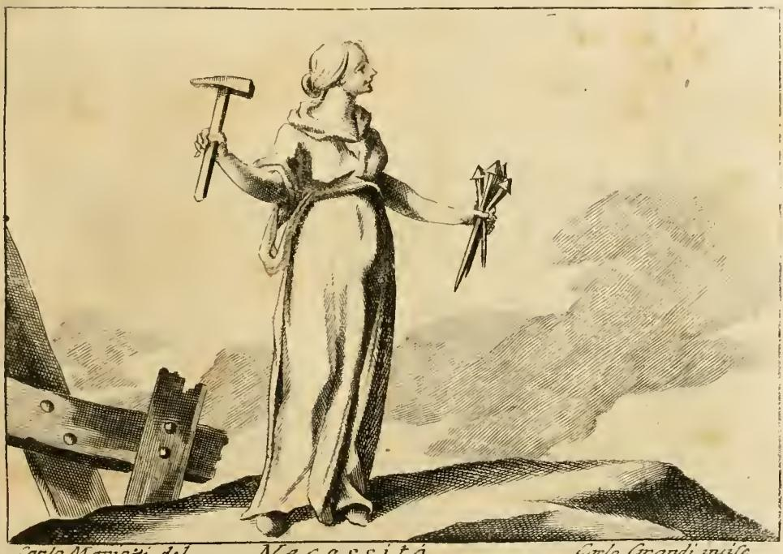

# 필연(Necessità) — 망치와 못을 든 여인

## 리파의 원문 처방

리파는 『이코놀로지아』(오를란디 판, 제4권) "NECESSITA" 항목을 아주 짧은 한 줄로 시작한다.

> "Donna, che nella mano destra tiene un martello, e nella sinistra un mazzo di chiodi."
> — 오른손에 망치를, 왼손에 못 한 다발을 든 여인.

그리고 곧바로 그 이유를 댄다.

> "Necessità è un essere della cosa, in modo che non possa stare altrimenti, e pone ovunque si ritrova un laccio indissolubile; e perciò si rassomiglia ad uno, che porta il martello da una mano, e dall'altra i chiodi; dicendosi volgarmente, quando non è più tempo da terminare una cosa con consiglio, esser fitto il chiodo."
> — 필연이란 사물이 **달리 있을 수 없는** 존재 방식이며, 자기가 있는 곳마다 **풀 수 없는 매듭**을 놓는다. 그래서 한 손에 망치, 다른 손에 못을 든 사람에 비유된다. 어떤 일을 이제는 숙고로 결정할 수 없게 되었을 때 흔히 "못이 박혔다"고 말하기 때문이다.

두 번째 이미지(별도 판화 없이 텍스트만)는 완전히 다른 계보다.

> "Donna sopra di un alto piedestallo, che tenga un gran fuso di Diamante, come si legge ne' scritti di Platone."
> — 높은 받침대 위의 여인이 커다란 **다이아몬드 물렛가락**을 들고 있는 모습. 플라톤의 글에 그렇게 적혀 있다.

여기에 오를란디의 각주가 붙어 고대 숭배를 요약한다: 필연은 고대 이교도에게 **신격**이었고 **포르투나의 딸**로 여겨졌으며, 온 우주가 그를 숭배했고, 그 권능이 어찌나 컸던지 **유피테르(Giove)조차 그에게 복종해야 했다**. 코린토스의 그 신전에는 **여사제 외에는 아무도 들어갈 수 없었고**, 어머니 포르투나와 함께 그려지며, **청동으로 된 손에 긴 쐐기(cavicchi)를 들고** 있었다.

## 판화에서 읽히는 것

카를로 마네티(Carlo Manetti) 도안, 카를로 그란디(Carlo Grandi) 판각. 관찰되는 지물이 원문 처방과 정확히 맞는다.

- **오른손의 망치**: 자루가 긴 대장간형 망치를 어깨 높이로 들어 올려, 방금 내리치려는 순간의 자세. 필연은 '설득'하지 않고 '박는다'.
- **왼손의 못 한 다발**: 낱개가 아니라 **다발**로 쥐고 있다는 점이 중요하다. 필연이 한 번 쓰고 끝나는 힘이 아니라 어디에나 못을 박을 수 있는 상시적 힘임을 뜻한다. 못머리가 굵고 축이 긴 대못 — 라틴어로 말하면 지붕보를 고정하는 **clavus trabalis**다.
- **왼쪽 아래의 목재 구조물**: 이미 **못(볼트머리)이 세 개 박힌 굵은 각재/보**가 화면 밖으로 걸쳐져 있다. 필연의 작업 결과물이자, "박힌 못은 다시 뽑히지 않는다"는 명제의 시각적 증거다. 즉 왼손의 다발이 '앞으로 박을 것', 이 목재가 '이미 박힌 것'이다.
- **높은 바위 언덕에 홀로 선 자세**: 두 번째 이미지의 "높은 받침대(alto piedestallo)"와 통하는 우월·불가항의 위치. 옆에 아무도 없다 — 필연에게는 동반자도 협상 상대도 없다.
- **옆얼굴의 무표정**: 호라티우스의 형용어 *saeva*(혹독한)를 도상으로 옮긴 것. 분노도 자비도 없는 얼굴.

## 1. 아리스토텔레스적 필연 — 왜 하필 망치와 못인가

리파의 정의문 "in modo che non possa stare altrimenti"는 아리스토텔레스의 필연 규정을 이탈리아어로 그대로 옮긴 것이다.

- 『형이상학』 Δ(5권) 5장(1015a34 이하): **"달리 있을 수 없는 것(τὸ μὴ ἐνδεχόμενον ἄλλως ἔχειν)을 우리는 필연적으로 그렇다고 말한다."**
- 『니코마코스 윤리학』 6권 3장: 학문적 인식(epistēmē)의 대상은 필연적으로 있는 것이며, 따라서 **영원하고 생성·소멸하지 않는다** — 즉 "달리 될 여지"가 없는 것.
- 『니코마코스 윤리학』 6권 2장·5장: 그래서 **숙고(bouleusis)의 대상이 아니다.** 아무도 이미 일어난 일이나 필연적인 일을 숙고하지 않는다.

리파의 "이제는 숙고(consiglio)로 일을 끝낼 수 없을 때"라는 구절이 바로 이 마지막 논점이다. 필연은 '선택지의 소멸'로 정의되며, 못은 그 소멸의 완벽한 물리적 은유다.

- 못은 **한 방향으로만** 들어간다(비가역성).
- 박히기 **전에는** 위치를 바꿀 수 있지만 박힌 **후에는** 못 바꾼다(숙고 가능성의 종결).
- 못은 두 개의 다른 것을 **되돌릴 수 없게 하나로 묶는다** → 리파의 "풀 수 없는 매듭(laccio indissolubile)". 끈으로 묶은 매듭은 풀 수 있지만 못은 뽑을 수 없다. 리파가 굳이 '매듭'이라 말하고 도상은 '못'으로 준 것은, 못이 매듭보다 더 강한 결박임을 보이려는 상향 조정이다.
- 망치는 그 결박을 집행하는 **외부의 힘**이다. 못은 스스로 박히지 않는다 — 필연은 사물의 내적 성향이 아니라 사물에 가해지는 강제라는 관념이 여기 담긴다.

## 2. 호라티우스 『송가』 1.35 — 리파 도상의 사실상의 출처

이 도상은 리파의 창작이 아니다. 안티움의 포르투나에게 바친 호라티우스 『송가』 1권 35편, 17–20행의 **그림 번역**이다.

> te semper anteit **saeva Necessitas**,
> **clavos trabalis et cuneos** manu
> gestans **aena**, nec severus
> **uncus** abest **liquidumque plumbum**.
>
> — 언제나 혹독한 필연이 너(포르투나)를 앞서가며, 청동 손에 **대못과 쐐기**를 들고 있고, 무자비한 **꺾쇠**도, **녹인 납**도 없지 않다.

네 가지 지물이 모두 석공·목공의 **비가역 고정 도구** 목록이다.

| 호라티우스의 지물 | 기능 | 필연의 의미 |
|---|---|---|
| clavi trabales (대못) | 보를 고정 | 되돌릴 수 없는 결정 |
| cunei (쐐기) | 틈에 박아 벌리거나 고정 | 되돌릴 수 없는 분리·압박 |
| uncus (꺾쇠·갈고리) | 돌과 돌을 물려 잡음 | 강제 연결 |
| liquidum plumbum (녹인 납) | 꺾쇠 구멍에 부어 굳힘 | 굳어버려 손댈 수 없음 |

리파는 이 네 개 중 **못**만 남기고, 못을 박는 데 필요한 도구인 **망치**를 짝으로 보충해 두 손을 채웠다. 오를란디의 각주가 필연의 **손이 청동(di bronzo)**이고 **긴 쐐기(cavicchi)**를 들었다고 적은 것은, 각주 필자가 호라티우스의 `manu … aena`와 `cuneos`를 직접 참조하고 있음을 드러낸다. 즉 본문 이미지와 각주가 같은 시행의 두 가지 독법이다.

그리고 결정적으로 호라티우스에서 필연은 **포르투나를 앞서가는(anteit)** 존재다. 각주가 필연을 "포르투나의 딸"이자 "어머니 포르투나와 함께 그려진다"고 한 것도 이 시적 짝짓기의 후대 산문화다. 다만 위계는 뒤집혀 있다 — 호라티우스에서는 필연이 앞장서는 상위자인데, 각주에서는 포르투나의 딸이 된다. 르네상스 도상학이 고대 자료를 계보화하면서 생긴 흔한 어긋남이다.

**로마의 실제 관습과의 연결**: 못을 박아 시간을 못 박는 의례가 실제로 있었다. 리비우스 7.3에 따르면 로마에서는 해마다 유피테르 신전에 **연년의 못(clavus annalis)**을 박아 흐른 해를 고정했고, 에트루리아 볼시니이의 운명 여신 **노르티아(Nortia)** 신전에서도 같은 일을 했다(유베날리스 10.74에 노르티아 언급). 에트루리아 도상에는 못과 망치를 든 운명의 정령 **아트르파(Atrpa)**가 나타난다. 필연을 못으로 표상하는 것은 문학적 비유이기 전에 **의례적 실천**이었던 것이다.

## 3. 플라톤 『국가』 10권 — 높은 받침대와 다이아몬드 물렛가락

리파의 두 번째 이미지가 명시적으로 "플라톤의 글에 읽히듯이"라고 밝히는 그 대목은 『국가』 10권 에르(Er) 신화, 616b–617d다.

- 에르가 본 우주의 축은 **아난케(Ἀνάγκη, 필연)의 물렛가락(ἄτρακτος)**이다. 하늘 전체를 꿰뚫는 빛의 기둥 양 끝에서 이 물렛가락이 늘어져 있고, 여덟 겹의 동심 소용돌이(항성천과 일곱 행성)가 그 회전판이다.
- **물렛가락의 축(ἠλακάτη)과 갈고리(ἄγκιστρον)는 아다마스(ἀδάμας)로 되어 있다.** 아다마스는 '굴복하지 않는 것'이라는 뜻의 최경도 물질로, 르네상스 라틴·이탈리아어 번역 전통에서 **diamante**(다이아몬드)로 옮겨졌다. 리파의 "gran fuso di Diamante"가 바로 그것이다. 어원 자체가 '길들일 수 없음'이므로 필연에게 가장 잘 맞는 재질이다.
- 아난케는 **왕좌에 앉아** 있고 물렛가락은 그 무릎 위에서 돈다. 그 곁에 세 딸 **모이라이 — 라케시스(제비), 클로토(짜는 여자), 아트로포스(돌이킬 수 없는 여자)** — 가 각자 왕좌에 앉아 회전을 돕고, 여덟 세이렌이 각 궤도의 음을 노래한다. 영혼들은 라케시스 앞에서 제비를 뽑아 다음 생을 고르고, 고른 뒤에는 클로토와 아트로포스의 손을 거쳐 **되돌릴 수 없게 확정된다**.
- 리파의 **"높은 받침대(alto piedestallo)"**는 플라톤의 왕좌를 르네상스 조상(彫像) 어법으로 바꾼 것이다. 우주의 축을 무릎에 얹은 존재이므로 다른 모든 것보다 높은 곳에 있어야 한다. 판화의 필연이 바위 언덕 정상에 서 있는 것도 같은 구도적 발상이다.
- 세 번째 딸의 이름 **아트로포스가 "돌이킬 수 없는"** 이라는 뜻이라는 점을 보면, 플라톤 계열의 물렛가락과 호라티우스 계열의 못은 **같은 관념의 두 도구**다. 실은 끊기면 다시 이을 수 없고, 못은 박히면 다시 뽑을 수 없다.

## 4. 유피테르도 복종한다 — 신들보다 상위인 필연

오를란디 각주의 "Giove stesso era astretto ad ubbidirla"는 고대 사유의 핵심 층을 건드린다. 그리스·로마 종교에서 **운명은 신들의 소관 아래 있지 않고 신들 위에 있다.**

- 호메로스에서 제우스조차 사랑하는 사르페돈의 죽음을 막지 못한다(『일리아스』 16권). 그는 저울을 들어 운명을 **확인**할 뿐 바꾸지 않는다.
- 아이스퀼로스 『결박된 프로메테우스』 515–518행: 제우스도 "정해진 운명(πεπρωμένη)"을 피할 수 없으며, 키를 잡은 것은 세 모이라와 에리뉘에스라고 프로메테우스가 말한다. 그리고 그 극의 첫 장면에서 프로메테우스를 바위에 **못 박는(!)** 것은 헤파이스토스이고, 그를 감독하는 인물이 **크라토스(권력)와 비아(폭력)**다. 못·망치·강제의 결합이 이미 고대 비극의 무대에 있다.
- 스토아 철학에서는 이것이 우주적 인과 연쇄(heimarmenē)로 체계화되고, 제우스는 그 연쇄와 사실상 동일시된다. 세네카 『섭리에 관하여』 5.8: "만물을 만든 그 창조자 자신도 자기 법에 따른다(ille ipse omnium conditor et rector … semper paret, semel iussit)."
- **숭배의 흔적**: 파우사니아스 『그리스 안내기』 2.4.6–7은 아크로코린토스로 올라가는 길에 헬리오스의 제단들을 지나면 **아난케와 비아(필연과 폭력)의 성소**가 있고, **"들어가지 않는 것이 관례다"**라고 적는다. 오를란디 각주의 "코린토스의 신전에는 여사제 외에 아무도 들어갈 수 없었다"는 서술이 바로 이 대목의 (여사제 조항을 덧붙인) 변형이다. 필연은 기도와 봉헌으로 교섭할 수 있는 신이 아니므로 **출입 자체가 금지된, 예배 불가능한 신성**이다 — 이 점이 로마 시대까지 필연의 독립 신전이 사실상 이 하나뿐인 이유이기도 하다.
- 아난케의 짝이 하필 **비아(폭력)**라는 점도 리파의 망치와 연결된다. 필연은 설득이 아니라 물리적 강제의 양태로 작동한다. 판화에서 망치는 그 폭력의 도구다.

## 5. "못이 박혔다" — 관용 표현의 계보

리파가 근거로 든 것은 학설이 아니라 속담이다: **"dicendosi volgarmente … esser fitto il chiodo"** (흔히 "못이 박혔다"고 말한다).

- **라틴어 원형**: `clavo trabali figere` / `trabali clavo figere`. 키케로 『베레스 탄핵』 2.5.53 — "ut hoc beneficium, quem ad modum dicitur, **trabali clavo figeret**" (이 은혜를 흔히 말하듯 **대못으로 박아** 두려고). 키케로 자신이 "quem ad modum dicitur(말하자면, 속담대로)"를 붙였다는 사실이 이것이 이미 기원전 1세기의 관용구였음을 보여준다. 의미는 "번복 불가능하게 확정하다".
- **파생 관용구**: `clavum figere`는 라틴 사전들이 "운명에 의해 불변하게 고정된 것"을 뜻하는 속담적 표현으로 등재한다. 리파의 이탈리아어 `fitto il chiodo`는 이 라틴 표현의 직역 계승이다.
- **성서 계열의 보강**: 「전도서」 12:11 "말씀들은 … 박은 못과 같다"(불가타 `quasi clavi in altum defixi`), 「이사야」 22:23 "그를 못처럼 단단한 곳에 박으리라". 르네상스 관객에게 못의 '확정성' 이미지는 고전과 성서 양쪽에서 익숙했다.
- **오늘날의 어감 비교**: 한국어의 **"쐐기를 박다"**는 흐름을 끊고 유리한 지점을 확보한다는 **공격적·전술적** 함의가 강하고 행위 주체가 사람이다. 반면 리파의 못은 **이미 벌어진 사태의 불가역성**을 가리키며, 주체는 사람이 아니라 필연 자체다. "쐐기를 박다"는 능동태, "못이 박혔다"는 수동태 — 이 문법적 차이가 곧 의미의 차이다. 오히려 한국어에서 가까운 것은 **"굳어졌다", "돌이킬 수 없게 되었다", "주사위는 던져졌다"**, 혹은 (다른 상실 감각이지만) 마음에 새겨져 지워지지 않는다는 뜻의 "못이 박히다" 쪽이다. 영어의 관용구로는 `nail it down`(확정하다), `the die is cast`, 그리고 관 뚜껑에 못을 박는다는 `the final nail in the coffin`이 이 계열의 현대적 잔존이다.

## 요약 표

| 요소 | 출처 | 의미 |
|---|---|---|
| 오른손 망치 | 리파의 보충(호라티우스에 없음) | 필연을 집행하는 외부적 강제력 |
| 왼손 못 다발 | 호라티우스 『송가』 1.35의 `clavi trabales` | 비가역적 고정, 풀 수 없는 매듭 |
| 아래쪽 못 박힌 목재 | 판화가의 서사적 보충 | 이미 확정된 사태 |
| "못이 박혔다" | 키케로 이래의 속담 `trabali clavo figere` | 숙고의 시효 만료 |
| 높은 받침대 | 플라톤 『국가』 616c의 아난케의 왕좌 | 우주 축을 무릎에 얹은 자의 위계 |
| 다이아몬드 물렛가락 | 『국가』 616c의 아다마스 물렛가락 | 굴복하지 않는 재질, 우주적 회전의 축 |
| 포르투나의 딸 | 호라티우스의 `te semper anteit`를 계보화 | 운수보다 앞서는/근본적인 것 |
| 유피테르도 복종 | 호메로스·아이스퀼로스·스토아 | 운명은 신들보다 상위 |
| 코린토스 신전 | 파우사니아스 2.4.6–7 (아난케·비아 성소) | 교섭 불가능해 출입조차 금지된 신성 |

## 참고

- Cesare Ripa, *Iconologia*(Cesare Orlandi 편, 페루자 1764–67), 제4권 "Necessità" 항 및 각주 — 본 카드의 원문
- Horace, *Carmina* 1.35.17–20 — [Perseus](https://www.perseus.tufts.edu/hopper/text?doc=Perseus:text:1999.02.0024:book%3D1:poem%3D35)
- Plato, *Republic* 10.616b–617d (에르 신화, 아난케의 물렛가락) — [Myth of Er](https://en.wikipedia.org/wiki/Myth_of_Er)
- Pausanias, *Description of Greece* 2.4.6–7 (아크로코린토스의 아난케·비아 성소) — [Theoi](https://www.theoi.com/Text/Pausanias2A.html), [Ananke](https://www.theoi.com/Protogenos/Ananke.html)
- Cicero, *In Verrem* 2.5.53 (`trabali clavo figeret`) — [Attalus](https://www.attalus.org/cicero/verres25.html), [Lewis & Short, *clavus*](https://www.perseus.tufts.edu/hopper/text?doc=Perseus:text:1999.04.0059:entry%3Dclavus)
- Aristotle, *Metaphysica* 1015a; *Ethica Nicomachea* VI.2–3
