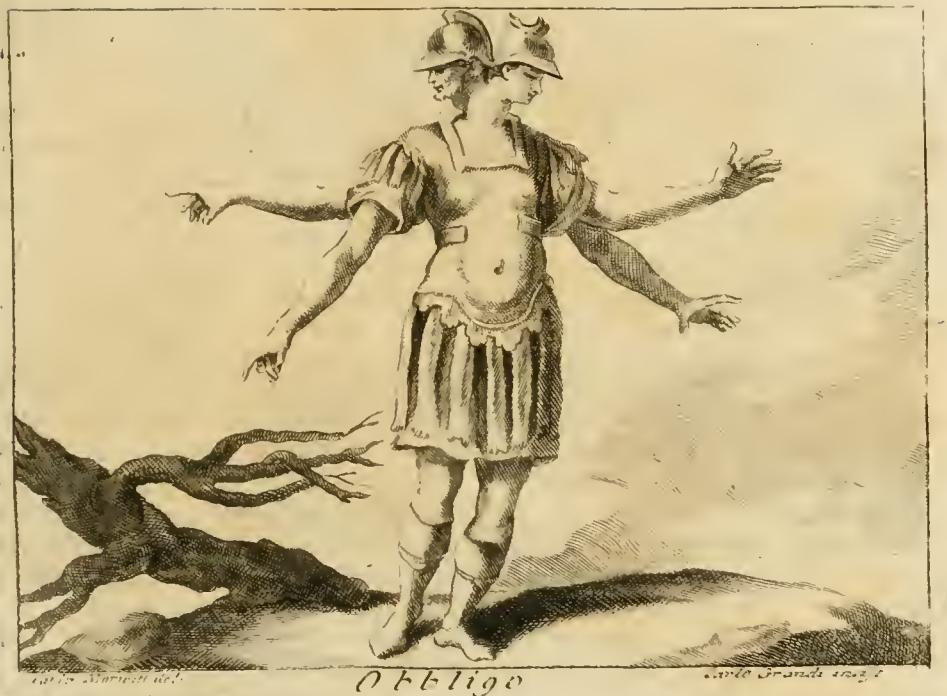
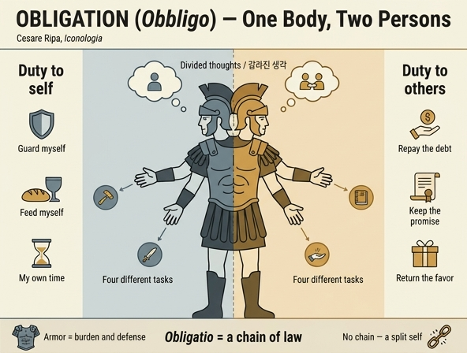

# 리파의 '의무(Obbligo)' — 머리 둘, 팔 넷의 무장한 남자

## 카드

**Q.** 리파는 '의무(Obbligo)'를 어떻게 의인화했는가?

**A.** 머리 둘, 팔 넷, 손 넷을 가진 무장한 남자다. 의무를 진 사람은 두 인격을 감당해야 하기 때문인데, 하나는 자기 자신을 돌보는 인격이고 다른 하나는 남에게 의무를 다하는 인격이다. 두 머리는 갈라진 마음의 생각들을, 네 팔은 서로 다른 활동들을 뜻한다.

---

## 1. 리파 원문

출처는 `10 Nobility to Obligation.md`의 마지막 항목 `OBBLIGO`(line 411~421). 18세기 이탈리아어 판본 스캔의 OCR이라 장음 s(ſ)가 f로 읽힌 자리가 많다. 정규화하면 이렇다.

> **OBBLIGO** — Di Cesare Ripa
>
> [U]omo armato con due teste, quattro braccia, e quattro mani, per mostrare, che l'Uomo obbligato **sostiene due persone**: l'una per attendere a se medesimo, l'altra per soddisfare altrui.
>
> Si dipinge con quattro braccia, e due teste, significandosi per **queste** i *pensieri dell'animo spartiti*, e per **quelle** le *operazioni diverse*.
>
> De' Fatti, vedi **Promessa**, **Debito**, ec.

번역: "머리 둘, 팔 넷, 손 넷을 가진 무장한 남자. 의무를 진 사람은 두 인격을 **감당한다(sostiene)**는 것을 보이기 위함이다. 하나는 자기 자신을 돌보기 위한 인격, 다른 하나는 남을 만족시키기 위한 인격이다. // 팔 넷과 머리 둘로 그리는데, 이것(머리)으로는 **갈라진 마음의 생각들**을, 저것(팔)으로는 **서로 다른 활동들**을 뜻한다. // 사례는 '약속', '부채' 항목을 보라."

원문 읽기에서 짚어둘 점 세 가지.

- **지시사가 교차한다.** 리파는 "팔 넷과 머리 둘"이라 쓴 뒤 `per queste`(이것들) → 생각, `per quelle`(저것들) → 활동으로 배분한다. 이탈리아어에서 `queste`는 가까운 것, 즉 방금 언급한 `teste`(머리)를 가리키므로 **머리=생각 / 팔=활동**이 된다. 카드의 답이 이 독법이다.
- **`sostiene`가 핵심 동사다.** '두 인격을 가진다'가 아니라 '**떠받친다·짊어진다**'다. 라틴어 `personam sustinere`(역할을 감당하다)의 그대로 옮김이며, 뒤(4절)에서 볼 키케로적 어법이다. 의무는 소유가 아니라 하중이다.
- **`armato`(무장)에는 이유가 붙지 않는다.** 이 항목에서 리파가 근거를 대는 지물은 **머리와 팔뿐이다.** 갑옷·투구가 왜 의무의 표지인지는 **본문이 설명하지 않는다.** 이 점은 리파의 다른 항목들(예: 바로 앞 Obbedienza의 십자고상·멍에·모토는 하나하나 이유가 달려 있다)과 대조적이다. 따라서 아래 3절의 무장 해석은 모두 **추정**으로 표시한다.

---

## 2. 판화와 텍스트 대응

`_page_254_Picture_3.jpeg`가 이 카드의 판화다. 하단 여백에 `Obbligo` 캡션이 있고, 좌우 아래 모서리에 도안자/각자(刻者) 서명이 있으나 스캔에서 일부만 판독된다(오른쪽은 `…Grandi inc.` 계열로 보인다). 같은 페이지의 `_page_254_Picture_7.jpeg`는 잎·꽃 모양의 **장식 컷(cul-de-lampe)**일 뿐 도상과 무관하므로 복사하지 않았다.

| 리파 텍스트 | 판화에서 실제로 보이는 것 |
|---|---|
| **due teste** (머리 둘) | 하나의 몸통·어깨에서 목 두 개가 **나란히** 솟고, 각각 볏 달린 투구를 따로 쓴다. 두 얼굴은 측면상으로 **서로 반대 방향(왼쪽/오른쪽)을 본다.** |
| **quattro braccia / quattro mani** (팔 넷·손 넷) | 좌우 각 두 팔, 합 넷. 왼쪽 위 팔은 바깥으로 뻗어 **집게손가락으로 왼쪽을 가리키고**, 왼쪽 아래 팔은 **손끝을 아래로** 내린다. 오른쪽 위 팔은 **손바닥을 펴 위로**, 오른쪽 아래 팔은 **손바닥을 펴 아래로** 향한다. 팔은 모두 맨살이다. |
| **armato** (무장) | 고대 로마 병사 복장. 볏 투구, 짧은 퍼프 소매, 근육형 흉갑(lorica musculata — 배꼽까지 보여 맨몸처럼 보인다), 가죽 술 치마(pteruges), 종아리 각반과 부츠. 중세 기사 갑주가 아니라 **골동 취향의 병사**다. |
| — (리파 언급 없음) | 배경: 나무 없는 낮은 언덕과 빈 하늘. 왼쪽 아래에 **잎 없이 뒤틀린 큰 고목 줄기**가 쓰러져 있다. |

**텍스트와 어긋나거나 텍스트를 넘어서는 지점**

1. **네 손이 아무것도 들지 않았다.** 리파가 손을 팔과 따로 세어놓았지만 지물은 하나도 지정하지 않았고, 판화도 도구를 주지 않았다. 대신 **네 손이 네 방향으로 갈라져 각기 다른 손짓**을 한다 — `operazioni diverse`(서로 다른 활동)를 도구가 아니라 **방향의 분산**으로 옮긴 셈이다. 두 손이 가리키고 두 손이 펼쳐진 것은 각각 '지시'와 '수용/제공'으로 읽을 여지가 있으나 리파가 그렇게 말하지는 않는다.
2. **사슬이 없다.** 3절에서 보듯 `obligatio`의 법적 정의 자체가 '사슬(vinculum)'인데, 리파도 각자도 **족쇄·끈·멍에를 쓰지 않았다.** 묶임을 밖에서 채우는 대신 **몸을 둘로 겹치는 방식**으로 표현한 것이 이 도상의 선택이다.
3. **두 머리가 등을 맞대지 않았다.** 야누스형(back-to-back, 혹은 한 얼굴 뒤에 또 한 얼굴)이 아니라 **한 몸통 위에 목 둘이 병렬**한다. 두 시선이 서로 **등지고 반대쪽으로** 향한다는 점이 `pensieri spartiti`(갈라진 생각)의 시각적 등가물이다.
4. **자세가 균형 잡기다.** 네 팔이 벌어져 있고 발밑은 고르지 않은 흙바닥이다. 정면을 응시하는 정적인 덕의 자세가 아니라 **하중을 나눠 버티는 자세**로 보인다.
5. **고목**은 리파가 지정하지 않은 각자의 배경 채움이다. 판화 관습에서 고목은 고난·소모를 함축하기는 하지만, 여기서 그것이 의도된 의미라고 단정할 근거는 본문에 없다.

---

## 3. 다두·다비(多頭多臂) 도상의 계보 — 리파는 어디에 서는가

몸을 겹쳐 그리는 도상은 서구에 여러 계보가 있고, 각각 **다르게 작동한다.**

**(1) 야누스(Ianus) — 완전성으로서의 둘.** 로마의 문·문턱·전환·시작의 신. 그리스에 대응 신이 없는 순수 로마 신으로, 두 얼굴이 반대 방향을 본다(4면상 `Ianus Quadrifrons`도 있다). 1월(January)의 어원이고 모든 시작과 희생의 개시에 불린다. 르네상스 도상학에서 야누스의 두(또는 세) 얼굴은 **프루덴티아(Prudentia)의 속성**으로 흡수된다 — 과거의 기억, 현재의 통찰, 미래의 예견. 뒤러의 세속적 프루덴티아도 야누스 얼굴에 거울과 컴퍼스를 든다. 즉 야누스형 다면은 **한 정신의 시야가 완전해진 것**, 결핍이 아니라 우월이다.

**(2) 게리온·브리아레오스 — 힘으로서의 다수.** 게리온은 몸 셋(혹은 머리 셋)의 거인, 브리아레오스는 팔 백·머리 오십의 헤카톤케이레스 중 하나다. 플라톤이 남긴 비유가 이 계보의 논리를 압축한다 — "게리온이나 브리아레오스의 몸을 타고났다면 창 백 개를 던질 수 있어야 한다." 여기서 팔이 많다는 것은 **동시에 더 많이 할 수 있는 능력**이며, 후대(19세기 정치 만평까지)에도 브리아레오스는 **집중된 다중 위력**의 알레고리로 쓰인다. 반대로 베르길리우스는 브리아레오스를 지하계의 괴물들 사이에 두므로, 이 계보에는 **괴물성**의 함의도 붙어 있다.

**(3) 인도 도상의 다비 신상 — 서구 유입 경로.** 다팔 신상이 유럽에 알려진 통로는 여행기와 지리서다. 루도비코 데 바르테마(1503년 여행, 1510년 간행)가 캘리컷의 'deumo'(dêvan)를 기술하고, 제바스티안 뮌스터 『Cosmographia』(1544)와 뒤이어 린스호턴 『Itinerario』(1596)에 판화로 실린다. 다만 이 초기 인쇄 도상들은 3층 왕관·괴물 같은 입·무서운 눈 같은 **악마화된 얼굴 특징**을 강조하며, **팔의 다수성이 두드러진 특징으로 확인되지는 않는다.** 유럽에서 다비 신상이 도상학적으로 익숙해지는 것은 대체로 17~18세기(발데우스, 키르허, 피카르 계열)다. 리파(초판 1593, 도판 1603~)는 인도 신상을 전거로 **전혀 언급하지 않으며**, 이 카드의 도상이 그쪽에서 왔다고 말할 근거는 없다. 시대적으로 통로가 존재했다는 사실만 적어둔다.

**판정.** 리파의 용법은 (1)도 (2)도 아니다.

- 야누스와 다르게, 두 머리는 하나의 시야를 완성하지 않는다. **서로 반대쪽을 보며 생각이 `spartiti`(갈라져) 있다.** `spartire`는 '분배하다·쪼개다'다 — 통합이 아니라 분할이다.
- 게리온·브리아레오스와 다르게, 네 팔은 **더 많은 일을 해낼 능력의 과시가 아니다.** 리파가 팔에 붙인 뜻은 `operazioni diverse`, 즉 **성격이 다른 여러 갈래의 일**이고, 판화의 네 손은 무기 하나 들지 않은 채 서로 다른 방향으로 흩어진다. 팔이 넷이어도 몸은 하나이므로 자원은 늘지 않는다.

요컨대 이것은 **능력의 과시가 아니라 분열의 표현**이다. 여분의 지체(肢體)는 여분의 힘이 아니라 **여분의 주인**을 뜻한다. 몸 하나에 채권자가 둘 있는 상태를 도해한 것이므로, 신화적 괴물이라기보다 **개념 도해(diagram)에 가까운 알레고리**다.

---

## 4. 개념 구분 — `Obbedienza`(순종)와 `Obbligo`(의무)

이 장의 바로 앞 항목이 순종이라, 두 항목을 붙여 읽으면 차이가 선명하다.

**Obbedienza(순종, line 333~).** 리파의 지정: "고귀하고 정숙한 얼굴의 여인, **수도복** 차림. 왼손에 **십자고상**, 오른손에 **멍에**, 모토는 `SUAVE`." 그리고 리파는 이유를 명시한다 — "순종은 **본성상 덕(di sua natura virtù)**이다. 자기 자신의 욕구(propri appetiti)를 **자발적으로(spontaneamente)**, 선을 위하여 타인의 의지에 굴복시키는 데 있기 때문이다." 얼굴이 고귀한 것은 고귀한 자들이 정직함을 더 사랑하고 이성의 벗이며 순종이 이성에서 나오기 때문이고, 십자고상과 수도복은 종교적 순종의 칭송을, 멍에의 모토 `SUAVE`는 「마태복음」 11:30("내 멍에는 쉽고")을 가리킨다.

**대조표**

| | Obbedienza(순종) | Obbligo(의무) |
|---|---|---|
| 성별·형상 | 여인, 몸 하나 | 남자, 머리 둘·팔 넷 |
| 복장 | 수도복 | 무장(고대 병사) |
| 지물 | 십자고상, 멍에 + 모토 `SUAVE` | **없음** (빈 손 넷) |
| 리파의 규정 | "본성상 **덕**" | 덕이라는 말이 **없다** |
| 발생 | 자발적(spontaneamente) | 약속·부채에서 발생(→ `vedi Promessa, Debito`) |
| 방향 | 상급자의 의지에 자기 욕구를 굴복 | 자기 돌봄 ↔ 타인 만족의 **양방 견인** |
| 묶임의 형상 | 멍에 — 밖에서 씌우지만 **쉽다(suave)** | 몸의 이중화 — 안에서 **쪼갠다** |

즉 순종은 **주체가 스스로 취하는 성향(덕/하비투스)**이고, 의무는 **채무·은혜·계약이 만든 관계적 부담**이다. 순종에서는 굴복시킬 대상이 '자기 욕구' 하나뿐이므로 인격은 하나로 남는다. 의무에서는 상대가 정당한 **청구권자**로 남아 있으므로 인격이 둘로 늘어난다. 리파가 순종에는 도덕적 상찬을 붙이면서 의무에는 붙이지 않고, 사례를 '약속'과 '부채' 항목으로 넘긴 것도 같은 방향이다 — 의무는 덕의 초상이 아니라 **구조의 기술**이다.

### 어원과 로마법

`obbligo` < 라틴어 `obligatio` < `ob-`(향하여, 둘러) + `ligare`(묶다). `ligare`는 `ligamentum`(인대), `ligature`(결속)와 같은 뿌리다. 그래서 '의무를 진다'는 말은 어원상 **묶인다**는 말이다.

로마법은 이 은유를 정의로 못 박았다. 유스티니아누스 『법학제요(Institutiones)』 3.13 서두(pr.):

> **Obligatio est iuris vinculum, quo necessitate adstringimur alicuius solvendae rei, secundum nostrae civitatis iura.**
>
> "채무(의무)란 **법의 사슬(vinculum iuris)**이니, 그것에 의해 우리는 우리 국가의 법에 따라 어떤 급부를 이행할 필요로써 **결박된다**."

핵심 낱말이 `vinculum`이다. 이는 죄수의 **족쇄**를 가리키는 말이고(`in vincula` = 투옥), 동사 `adstringere`는 '단단히 조여 매다'다. 로마법은 채무자를 문자 그대로 **묶인 자**로 상상한다. (이 정의는 가이우스 계열 전승을 거쳐 『법학제요』에 실렸고, 서구 근대 채권법의 출발점으로 인용된다.)

여기서 도상의 선택이 흥미로워진다. 사슬이라는 강력한 관용 이미지가 손에 있었는데도 리파는 **사슬을 쓰지 않았다.** 사슬은 '한 사람이 붙들려 있다'는 그림이지만, 리파가 그리려던 것은 '한 사람이 **둘로 나뉘어** 있다'는 그림이다. 사슬 대신 몸의 이중화를 택한 것이 바로 이 항목의 개념적 논점이다. (반면 앞의 순종은 `giogo`, 멍에 — 역시 결박이지만 **끌려가는 방향이 하나**인 결박이다.)

---

## 5. '두 인격(due persone)' — 키케로적 배경과 왜 긴장인가

`sostiene due persone`의 `persona`는 근대적 '개인'이 아니라 **연극의 가면 → 맡은 역할**이다. 라틴어 관용구가 `personam gerere/sustinere`(역할을 지다/감당하다)이고, 리파의 `sostenere`는 이 `sustinere`의 직역이다.

**키케로 『의무론(De officiis)』의 역할론.** 1권 107~121에서 키케로는 모든 사람이 네 개의 `persona`를 진다고 본다 — ① 인간 공통의 이성적 본성, ② 각자의 개별적 기질, ③ 우연과 상황(`casus aut tempus`), ④ 스스로 택한 삶의 방식·직업. 적절한 행위(`officium`)란 이 인격들에 딸린 요구에 부합하는 것이다. 중요한 것은 키케로가 **인격들이 충돌할 때의 계량 규칙을 제시하지 않는다**는 점이다(연구자들이 이 이론의 불안정성을 지적하는 지점이다). 리파의 '두 인격'이 키케로의 4인격설을 그대로 옮긴 것은 아니지만, **한 사람이 여러 역할을 동시에 '감당한다'는 어법과, 그 역할들이 서로 당길 수 있다는 구도**는 정확히 이 키케로-스토아 전통의 것이다.

**은혜의 반환 의무(gratia referenda).** 키케로 『의무론』 1.47: `nullum enim officium referenda gratia magis necessarium est` — "은혜를 갚는 것보다 더 필수적인 의무는 없다." 이어서 그는 헤시오도스가 빌린 것을 이자까지 얹어 갚으라 했으니, 청하지도 않은 호의를 받은 자는 더더욱 **받은 것보다 많이 돌려주는 기름진 밭을 본받아야** 한다고 말한다. 여기에 이 도상의 긴장이 구조적으로 들어 있다. 반환해야 할 양이 받은 양보다 크다면, `soddisfare altrui`(남을 만족시키기)와 `attendere a se medesimo`(자기를 돌보기)는 **같은 유한한 자원을 두고 경쟁한다.**

**그래서 왜 평온한 덕이 아니라 긴장 상태인가.**

1. **채권자가 밖에 남아 있다.** 덕은 습성이 되면 안정된다. 순종은 자기 욕구를 한 번 굴복시키면 멍에가 `suave`해진다. 반면 의무의 상대는 내 안으로 흡수되지 않는 **제3자의 청구권**이다. 갚기 전까지 요구는 계속 서 있다.
2. **심의 중심이 둘이다.** 두 머리는 눈이 넷이어서 좋은 것이 아니라, **결정을 내리는 곳이 둘**이어서 문제다. 판화에서 두 얼굴이 서로 등지고 반대 방향을 보는 것이 이 사태의 그림이다.
3. **손이 이미 남에게 가 있다.** 네 손이 비어 있고 사방으로 흩어진 것은, 이 사람의 활동이 이미 서로 다른 주인들에게 배정되어 자기 뜻대로 쓸 손이 남지 않았다는 뜻으로 읽힌다.
4. **무장 — 이유는 리파가 대지 않는다.** 앞서 밝힌 대로 본문에 근거가 없으므로 아래는 **모두 추정**이다. (i) 의무를 진 자는 법적 추심에 노출된 자이므로 **방어 태세**에 있다. (ii) 갑옷은 몸에 얹힌 **하중** 자체다 — `sostiene`(짊어진다)와 어울린다. (iii) 병사의 선서(`sacramentum`)는 로마 문화에서 가장 전형적인 구속력 있는 약정이므로, **무장한 자 = 서약으로 묶인 자**의 환유일 수 있다. 어느 쪽이든 갑옷은 평화가 아니라 **전시(戰時) 상태**를 함축한다 — 안락한 덕의 초상과는 반대다.

---

## 6. 장(章) 안에서의 위치

이 파일이 담은 장은 `Nobiltà` → `Nocumento`(해악) → `Notte`(밤, 4부 구성) → `Obbedienza` → `Obbligo` 순서다. 우선 확인해둘 것은 이 배열이 **알파벳 순 사전 배열**이라는 점이다 — 리파가 논증을 설계해 이런 순서를 만든 것이 아니다. 그럼에도 앞뒤 세 항목을 나란히 놓으면 개념의 무게중심이 이동하는 것이 보인다. `Nobiltà`는 **존재의 상태**다: 무거운 의복, 창과 미네르바 소상(小像), 혹은 머리의 별과 손의 홀 — 학문이나 무공으로 얻어 몸에 지니는 **위격**이며, 지물이 화려하고 인물은 정적이다. `Obbedienza`는 **의지의 작용**이다: 자기 욕구를 자발적으로 굴복시키는 덕이고, 십자고상·멍에·모토라는 지물이 그 방향을 지시한다. `Obbligo`에 오면 지물이 전부 사라진다. 상찬어도, 모토도, 종교적 참조도 없고, 남는 것은 무장한 몸이 둘로 겹쳐진 형상뿐이다. 존재(있음) → 의지(원함) → **채무(빚짐)**로, 그리고 장식된 덕의 초상에서 **평가 없는 구조 도해**로 내려온 것이다. 결정적으로 이 항목에는 리파가 다른 항목마다 붙이던 `Fatto Storico Sacro / Profano / Favoloso`(성서·세속·신화 사례)가 **하나도 없다.** 대신 `vedi Promessa, Debito`라는 상호참조 한 줄로 끝난다. 장의 마지막 항목이 자기 예시를 갖지 못하고 '약속'과 '부채' 쪽으로 개념을 넘겨버리는 것 — 이것이 리파가 의무를 놓은 자리다. 고귀함이 자기에게 속한 것이고 순종이 자기가 내주는 것이라면, 의무는 **이미 남의 것이 되어버린 자기**이며, 그래서 도덕의 언어가 아니라 계약의 언어로 넘어간다.

---

## 인포그래픽

---

## 참고

- Cesare Ripa, *Iconologia*, 「OBBLIGO」 및 「OBBEDIENZA」 — 자산 파일 `10 Nobility to Obligation.md` line 333~421, 판화 `_page_250_Picture_2.jpeg`(Obbedienza), `_page_254_Picture_3.jpeg`(Obbligo)
- [Justinian, *Institutiones* 3.13 (Latin Library)](https://www.thelatinlibrary.com/justinian/institutes3.shtml) — `obligatio est iuris vinculum…`
- [Obligatio est iuris vinculum (it.wikipedia)](https://it.wikipedia.org/wiki/Obligatio_est_iuris_vinculum)
- [Cicero, *De officiis* 1.47 (Perseus)](https://www.perseus.tufts.edu/hopper/text?doc=Perseus%3Atext%3A2007.01.0047%3Abook%3D1%3Asection%3D47) — `nullum enim officium referenda gratia magis necessarium est`
- [Machek, "Using Our Selves: the Stoic Four-personae Theory in *De Officiis* I"](https://www.degruyterbrill.com/document/doi/10.1515/apeiron-2015-0057/html?lang=en) — 4인격설과 충돌 문제
- [Janus (greekmythology.com)](https://www.greekmythology.com/Myths/Roman/Janus/janus.html), [야누스 얼굴과 프루덴티아](https://jungianjournal.ca/index.php/jjss/article/download/124/93/227)
- [Geryon (theoi)](https://www.theoi.com/Gigante/GiganteGeryon.html), [Briareus (theoi)](https://www.theoi.com/Titan/HekatonkheirBriareos.html) — 플라톤의 "게리온이나 브리아레오스" 비유
- [Deumo of Calicut, Münster *Cosmographia* 1544](https://www.alamy.com/english-god-deumo-demus-or-deumus-of-calicut-from-cosmographia-1544-by-sebastian-mnster-deumo-is-also-described-by-ludovico-verthema-in-1503-sailors-first-came-to-face-with-the-idol-of-deumo-at-calicut-on-the-malabar-coast-and-they-concluded-it-to-be-the-god-of-calicut-it-is-described-that-the-ruler-of-calicut-zamorin-has-a-image-of-deumo-in-his-temple-sebastian-mnster-1488-1552-was-a-german-cartographer-cosmographer-and-hebrew-scholar-whose-cosmographia-1544-cosmography-was-the-earliest-german-description-of-the-world-and-a-major-work-in-the-revival-of-geographic-tho-image184852082.html) — 인도 신상의 서구 유입 초기 사례(다비 특징은 미확인)
