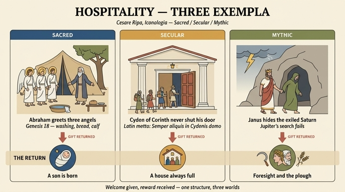

# 「환대(OSPITALITÀ)」의 세 가지 사례 — 성경·세속·신화

## 0. 질문과 답

**Q.** '환대' 항목의 성경·세속·신화 사례는?

**A.**
- **성경(FATTO STORICO SAGRO)**: 백 세의 아브라함이 천막 앞에서 세 나그네(천사)를 맞아 발을 씻기고 음식을 대접했고, 그들은 이듬해 사라가 아들을 낳으리라 약속했다(창세기 18장).
- **세속(FATTO STORICO PROFANO)**: 코린토스의 키돈은 문을 닫는 법이 없어 "키돈의 집엔 언제나 손님이 있다"는 속담이 생겼다.
- **신화(FATTO FAVOLOSO)**: 유피테르에게 쫓긴 사투르누스를 이탈리아 왕 야누스가 숨겨 극진히 대접하자, 사투르누스는 보답으로 그에게 예지력(과거와 미래를 보는 두 얼굴)과 농사법을 주었다.

---

## 1. 왜 세 개인가 — 오를란디 판의 편집 틀

이 3분 구성은 '환대' 항목만의 특징이 아니라, 우리가 읽고 있는 판본 전체에 반복되는 **편집 장치**다.

체사레 리파(Cesare Ripa)의 『이코놀로지아』 초판(로마 1593)은 원래 알레고리 인물의 **묘사(descrizione)와 그 근거 해설**만으로 이루어져 있었다. 18세기에 체사레 오를란디(Cesare Orlandi)가 페루자에서 낸 5권짜리 주석 증보판(1764–67)은 각 항목 끝에 규격화된 부록 블록을 덧붙였다.

| 표제 | 뜻 | 출처의 성격 |
|---|---|---|
| `FATTO STORICO SAGRO` | 성스러운 역사적 사실 | 성경(구약·신약), 성인전 |
| `FATTO STORICO PROFANO` | 세속의 역사적 사실 | 그리스·로마 및 근세 역사, 격언집 |
| `FATTO FAVOLOSO` | 신화적 사실 | 그리스·로마 신화, 신화 편람 |

의도는 명확하다. 하나의 덕(virtù)을 **계시(성경) · 역사(세속) · 신화**라는 세 권위의 층위에서 동시에 입증하는 것이다. 이는 르네상스 이래 예화집(*officina*, *theatrum*, *polyanthea*) 편찬의 표준 문법이었고, 화가·조각가에게는 "이 덕을 그려야 할 때 쓸 수 있는 장면 세 개"의 목록으로 기능했다.

같은 장에 보이는 `Come rappresentata nell'Edizione del Sig. Boudard`(부아르 씨 판본에서 표현된 방식) 역시 오를란디가 덧붙인 비교란으로, 장바티스트 부아르(J.-B. Boudard)의 『Iconologie』(파르마 1759)를 참조한 것이다.

또 하나 눈여겨볼 점은 **세 사례가 모두 "환대 → 보답"이라는 동일한 서사 구조**를 갖는다는 것이다. 리파/오를란디의 환대는 일방적 자선이 아니라, 낯선 이를 받아들인 자에게 반드시 되돌아오는 **호혜(reciprocity)의 회로**로 제시된다. 이는 본문의 알레고리 도상 자체가 "쏟아 붓는 풍요의 뿔(cornucopia)"을 든 여인인 것과 짝을 이룬다 — 비워도 마르지 않는다.

---

## 2. FATTO STORICO SAGRO — 마므레의 세 손님 (창세기 18장)

### 2.1 원문과 번역

> **FATTO STORICO SAGRO.**
>
> Era giunto all'età di cent'anni Abramo, ed ai novanta Sara sua moglie, senzacché avesse potuto avere da quella figliuolo alcuno. In quest'età sedendo un dì di mezzo giorno sull'ingresso della sua tenda, si vidde tre Uomini assai vicini (erano questi tre Angioli), e comecché il suo cuor pietoso non lasciava passare alcuno senza offerirgli l'ospizio, andò loro subito incontro, e salutandoli con sommo ossequio li pregò a riposarsi, e permettergli che lavasse loro i piedi, e loro desse poi da mangiare. Il che avendo i celesti Pellegrini accettato, Abramo corse frettolosamente da Sara, acciocché preparasse il mangiare ai suoi Ospiti. Eseguì il tutto Sara; e quelli dopo aver mangiato, domandarono ad Abramo della sua moglie, e sentito ch'ella era nella sua tenda, l'assicurarono che all'Anno venturo al loro ritorno, nella medesima stagione Sara avrebbe partorito un figlio; come in effetti seguì. *Genesi cap. 18.*

**번역:** 아브라함은 백 세, 그의 아내 사라는 아흔 살에 이르렀으나 아직 그녀에게서 아들을 얻지 못했다. 그 나이에 어느 날 한낮 자기 천막 입구에 앉아 있다가, 아주 가까이에 세 사람이 있는 것을 보았다(이들은 세 천사였다). 그의 경건한 마음은 누구도 잠자리를 권하지 않고 지나가게 두는 법이 없었으므로, 곧바로 그들에게 달려 나가 지극한 예를 갖추어 인사하고, 쉬어 가시라고, 그들의 발을 씻게 해 달라고, 그리고 음식을 대접하게 해 달라고 청했다. 하늘의 순례자들이 이를 받아들이자 아브라함은 서둘러 사라에게 달려가 손님들의 음식을 준비하게 했다. 사라가 모든 것을 해냈고, 그들은 먹고 나서 아브라함에게 그의 아내에 대해 물었으며, 그녀가 천막 안에 있다는 말을 듣고는 **이듬해 자기들이 돌아올 때 같은 계절에 사라가 아들을 낳으리라**고 확언했다. 실제로 그렇게 되었다. 창세기 18장.

### 2.2 불가타 원문 대조

오를란디의 요약은 불가타(Vulgata Clementina) 창세기 18장을 거의 그대로 압축한 것이다. 핵심 구절들:

| 절 | 라틴어(Vulgata) | 뜻 |
|---|---|---|
| 18:1 | *Apparuit autem ei Dominus in convalle Mambre sedenti in ostio tabernaculi sui in ipso fervore diei.* | 주님께서 마므레 골짜기에서, 한낮의 뙤약볕에 천막 문에 앉아 있는 그에게 나타나셨다. |
| 18:2 | *…apparuerunt ei tres viri stantes prope eum: quos cum vidisset, cucurrit in occursum eorum de ostio tabernaculi, et adoravit in terram.* | 세 사람이 그 곁에 서 있는 것이 보였다. 그는 보자마자 천막 문에서 달려 나가 맞이하고 땅에 엎드려 절했다. |
| 18:4 | *afferam pauxillum aquae, et **lavate pedes vestros**, et requiescite sub arbore.* | 물을 조금 가져올 터이니 **발을 씻으시고** 나무 아래서 쉬십시오. |
| 18:5 | *Ponamque **buccellam panis**, et confortate cor vestrum.* | **빵 한 조각**을 내오겠으니 기운을 차리십시오. |
| 18:6–7 | *Accelera, **tria sata similae** commisce, et fac subcinericios panes. Ipse vero ad armentum cucurrit, et tulit inde **vitulum tenerrimum et optimum**.* | 어서 **고운 밀가루 세 스아**를 반죽해 화덕빵을 구워라. 그는 가축 떼로 달려가 **아주 연하고 좋은 송아지**를 골랐다. |
| 18:8 | *Tulit quoque **butyrum et lac**, et vitulum quem coxerat, et posuit coram eis: ipse vero stabat iuxta eos sub arbore.* | 그는 **버터와 젖**과 요리한 송아지를 가져다 그들 앞에 놓고, 자신은 나무 아래 그들 곁에 서 있었다. |
| 18:10 | *Revertens veniam ad te tempore isto, vita comite, et **habebit filium Sara uxor tua**.* | 내가 이맘때에 반드시 너에게 돌아오리니, **네 아내 사라가 아들을 얻으리라**. |
| 18:14 | *Numquid Deo quidquam est difficile?* | 하느님께 어려운 일이 있겠느냐? |

**환대의 세부가 곧 도상의 세부다.** 미술가에게 필요한 것은 "아브라함이 친절했다"가 아니라 그릴 수 있는 사물들이다 — 한낮의 천막 입구, 상수리나무, 대야와 씻는 발, 화덕빵, 송아지, 버터와 젖, 그리고 서서 시중드는 주인. 오를란디가 굳이 *발 씻김·음식 준비*를 열거한 것은 화가를 위한 목록이기 때문이다.

### 2.3 나이의 사소한 불일치

오를란디는 "아브라함 백 세, 사라 아흔"이라 했지만, 성경 연대로는 이 장면 당시 아브라함은 **아흔아홉**(창세 17:1, 17:17)이고 이삭이 태어났을 때 백 세다(창세 21:5). 예화집이 수치를 반올림해 극적 대비("백 세인데 아들을 얻다")를 강화한 전형적 사례다.

### 2.4 해석사 — 히브리서 13:2에서 루블료프까지

**(1) 히브리서 13:2 — 환대의 신학적 정식**

> *Hospitalitatem nolite oblivisci: per hanc enim latuerunt quidam, **angelis hospitio receptis**.*
> "손님 대접하기를 잊지 마십시오. 그렇게 하다가 어떤 이들은 자기도 모르는 사이에 **천사들을 손님으로 맞아들였습니다**."

이 한 구절이 아브라함 장면을 **모든 환대 알레고리의 원형**으로 고정시켰다. 낯선 이는 언제든 천사일 수 있으므로, 환대는 도덕이 아니라 **분별 불가능성 앞의 태도**가 된다. 리파 본문 자체도 같은 논리로 마태 25:40을 인용한다: *Quod uni ex minimis meis fecistis, mihi fecistis*("너희가 내 형제 중 가장 작은 이에게 해 준 것이 곧 나에게 해 준 것이다"). 즉 손님 안에 그리스도가 숨어 있다.

**(2) 세 사람 → 삼위일체**

교부들은 "세 사람이 나타났는데 아브라함은 **한 분**께 말했다"(*tres vidit et unum adoravit*)는 서술의 어긋남에 주목했다. 아우구스티누스 이래 서방에서는 이를 삼위일체의 예표로 읽었고, 동방에서는 이 장면을 **필록세니아 투 아브라암(Φιλοξενία τοῦ Ἀβραάμ, '아브라함의 환대')**이라 불렀다. 리파 본문에 인용된 아우구스티누스의 말 — *Hospitalitatis officio ad Christi cognitionem venimus*("환대의 직무를 통해 우리는 그리스도를 알게 된다") — 역시 이 계보에 있다.

**(3) 도상 계보**

- 산타 마리아 마조레(로마, 5세기) 모자이크: 아브라함·사라·식탁·송아지가 모두 등장하는 서사형.
- 산 비탈레(라벤나, 6세기) 모자이크: 세 천사가 식탁에 앉고 아브라함이 송아지를 바치는 형식.
- **안드레이 루블료프, 「삼위일체」(c. 1425–27, 트레티야코프 미술관)**: 서사적 요소(아브라함·사라·천막·요리)를 **모두 제거**하고 세 천사와 성찬의 잔만 남긴 극단적 압축. 환대 장면이 서사에서 순수 신학 도상으로 전환된 결정적 지점이다. 잔 하나를 세 천사가 둘러싼 원환 구도는 '대접받는 손님'이 곧 '스스로를 내어 주는 신'임을 보여 준다.

즉 **환대 이야기 → 천사 손님(히브 13:2) → 삼위일체 도상**이라는 해석의 사다리가 있고, 리파/오를란디는 그 사다리의 첫 칸을 알레고리 예화로 재활용한 셈이다.

---

## 3. FATTO STORICO PROFANO — 코린토스의 키돈

### 3.1 원문과 번역

> **FATTO STORICO PROFANO.**
>
> Cidone da Corinto fu a' suoi tempi così pietoso ricevitore di Peregrini, e forastieri, che non furono mai le sue porte serrate a chiunque del suo ebbe bisogno. Di qui è, che per aver sempre avuto qualche peregrino sotto al suo tetto, venne in proverbio la sua singolare magnanima ospitalità:
>
> > **Semper aliquis in Cydonis domo.**
>
> *Astolfi, Off[icina] [i]stor[ica] lib. 2. cap. 9.*

**번역:** 코린토스의 키돈은 당대에 순례자와 이방인을 어찌나 경건하게 맞이했던지, 그의 것을 필요로 하는 이라면 누구에게도 문이 닫힌 적이 없었다. 이로부터, 언제나 그의 지붕 아래 누군가 나그네가 있었기에, 그의 유별나게 도량 넓은 환대가 속담이 되었다: **"키돈의 집에는 언제나 누군가 있다."** — 아스톨피, 『역사의 공방』 2권 9장.

### 3.2 전거 추적

**(1) 오를란디의 직접 출처**는 조반니 펠리체 아스톨피(Giovanni Felice Astolfi)의 『Della officina istorica』(베네치아, 1602년 초판 이후 여러 판)다. 덕과 악덕별로 고금의 예화를 분류해 놓은 전형적인 17세기 예화 사전으로, 오를란디의 `FATTO STORICO PROFANO` 란은 상당 부분 이런 편람에서 조달된다. 즉 오를란디는 고전 원전을 직접 뒤진 것이 아니라 **예화집을 재인용**하고 있다.

**(2) 그 위층은 에라스뮈스의 『아다기아(Adagia)』다 — 확인됨.** 이 속담은 실제로 에라스뮈스 『아다기아』에 표제어로 실려 있으며(**Adagia II.ii.15**), 르네상스 라틴어 교육을 통해 널리 유통되었다. 1621년 런던에서 나온 라틴어–영어 대역 발췌본 『Adagia in Latine and English, containing five hundred proverbs』에서 실제 인쇄된 모습은 다음과 같다:

> *Haud unquam arcet ostium.* — **He keepeth a good house.**
> *Semper aliquis in Cydonis domo.* — **He never wanteth good cheer.**
> *Fores habent tritas ut pastorum casae.* — **His gate is as open as the Church style.**

주목할 점: 대역본은 이 속담을 **"문을 결코 막지 않는다"(Haud unquam arcet ostium)**와 **"목동의 오두막처럼 문지방이 닳았다"(Fores habent tritas ut pastorum casae)** 사이에 배치했다. 즉 에라스뮈스 계열 전통에서 이 항목은 *인물 일화*가 아니라 **'문이 늘 열려 있는 집'이라는 관용 표현군**의 하나였다. 오를란디(그리고 아스톨피)의 서술 — "그의 문은 결코 닫힌 적이 없었다(non furono mai le sue porte serrate)" — 는 이 이웃 속담들의 뜻을 그대로 흡수한 것이다.

**(3) 더 위층은 그리스 속담집(파로이미오그라포이)이다.** 라틴어 형태는 그리스어 원형 *ἀεί τις ἐν Κύδωνος*("언제나 누군가가 키돈의 집에")의 번역이며, 제노비오스·디오게니아노스 등의 속담 모음을 거쳐 에라스뮈스에게 전해졌다. 키돈은 코린토스 사람으로 관대한 접대의 대명사였다는 것 외에 알려진 바가 거의 없다 — **속담이 인물을 남기고 인물의 나머지는 사라진** 경우다.

### 3.3 편집 논리상의 의미

성경 사례가 "손님이 신일 수 있다"는 **수직적 보상**을 말한다면, 키돈 사례의 보상은 훨씬 세속적이고 사회적이다: **명성(fama)과 속담이 되는 이름**. 그리고 "언제나 누군가 있다"는 표현 자체가 보답의 형태다 — 문을 열어 둔 집은 결코 비지 않는다.

---

## 4. FATTO FAVOLOSO — 사투르누스와 야누스

### 4.1 원문과 번역

> **FATTO FAVOLOSO.**
>
> Perseguitato da Giove suo figlio, Saturno si rifugiò appresso Giano Re d'Italia, il quale non solo ricevé con tutta la cortesia questo suo ospite, ma l'onorò eziandio soprammodo, ed ebbe somma cura che stesse ben celato ne' suoi Stati, onde vane riuscissero le ricerche, che Giove ne faceva. Saturno per mostrarsi grato a così generosa ospitalità, dotò Giano di rara prudenza, e gli partecipò il gran dono della Profezia, per cui egli indovinava ed il passato, ed il futuro. Di più gl'insegnò l'Agricoltura, ed il modo di dirozzare i popoli.
>
> *Macrobio. Ammiano Marcell[ino]. Natal Conte ec.*

**번역:** 자기 아들 유피테르에게 쫓긴 사투르누스는 이탈리아의 왕 야누스에게 피신했다. 야누스는 이 손님을 온갖 정중함으로 맞아들였을 뿐 아니라 지극히 예우했고, 그가 자기 나라 안에 잘 숨어 있도록 각별히 배려하여 유피테르의 수색이 헛되게 만들었다. 사투르누스는 그토록 관대한 환대에 감사를 표하고자 **야누스에게 드문 예지(prudenza)를 부여하고, 과거와 미래를 점칠 수 있는 예언의 큰 선물을 나누어 주었다. 나아가 그에게 농경과, 백성을 교화하는 법을 가르쳤다.** — 마크로비우스, 암미아누스 마르켈리누스, 나탈레 콘티 등.

### 4.2 고전 전거 (1) — 오비디우스 『파스티』 1권

『파스티』 1권에서 야누스는 1인칭으로 직접 증언한다:

> *hac ego Saturnum memini tellure receptum:*
> *caelitibus regnis a Iove pulsus erat.* (Fasti 1.235–236)
>
> "나는 사투르누스가 **이 땅에서 영접받았음**을 기억한다. 그는 유피테르에게 하늘의 왕국에서 쫓겨났던 것이다."

여기서 라티움이 *Saturnia tellus*라 불리게 된 유래, 곧 로마의 '황금시대' 신화가 나온다. 사투르누스는 숨은 신(*latere*에서 *Latium*을 끌어내는 어원 유희가 이 전통과 결부된다)이며, 야누스의 은닉은 그 어원을 서사화한 것이다.

야누스의 두 얼굴에 대해서도 같은 권이 설명한다:

> *Iane biceps, anni tacite labentis origo,*
> *solus de superis qui tua terga vides* (Fasti 1.65–66)
> "두 머리의 야누스여, 소리 없이 흘러가는 한 해의 시작이여, 신들 가운데 홀로 **자기 등을 보는** 이여."

> *omnis habet geminas, hinc atque hinc, ianua frontes,*
> *e quibus haec populum spectat, at illa Larem* (Fasti 1.135–136)
> "모든 문(ianua)은 이쪽저쪽 두 얼굴을 가지니, 하나는 사람들을 보고 다른 하나는 집안의 신을 본다."

**중요한 점:** 오비디우스에게 두 얼굴은 **문(ianua)의 본성**에서 나오는 것이지 사투르누스의 선물이 아니다. 야누스는 애초에 문·시작·경계의 신이다.

### 4.3 고전 전거 (2) — 마크로비우스 『사투르날리아』 1권

> *Post ad Ianum solum regnum redactum est, qui creditur **geminam faciem praetulisse, ut quae ante quaeque post tergum essent intueretur**: quod procul dubio ad prudentiam regis sollertiamque referendum est, qui et praeterita nosset et futura prospiceret…* (Sat. 1.7.20)
>
> "그 뒤 왕국은 야누스에게만 돌아갔는데, 그는 **앞뒤를 함께 볼 수 있도록 두 얼굴을 앞세웠다**고 여겨진다. 이는 의심할 바 없이 과거를 알고 미래를 내다본 왕의 예지(prudentia)와 총명함에 돌려야 할 것이다…"

> *Hic igitur Ianus, cum **Saturnum classe pervectum excepisset hospitio** et **ab eo edoctus peritiam ruris** ferum illum et rudem ante fruges cognitas victum in melius redegisset, **regni eum societate muneravit**.* (Sat. 1.7.21)
>
> "그리하여 이 야누스는, **배를 타고 건너온 사투르누스를 손님으로 맞아들이고**, **그에게서 농사의 기술을 배워** 곡물을 알기 전의 거칠고 야만적이던 삶을 개선한 뒤, **왕국을 함께 다스리도록 그를 예우했다**."

여기에 오를란디가 든 세 요소가 모두 있다: **환대(excepisset hospitio) · 농경 전수(peritiam ruris) · 과거와 미래를 보는 두 얼굴(quae ante quaeque post tergum / praeterita et futura)**.

### 4.4 오를란디는 무엇을 바꾸었나 — '보답'으로의 재배치

마크로비우스와 오를란디를 나란히 놓으면 **인과의 방향이 재조립**되어 있음이 보인다.

| 요소 | 마크로비우스 (Sat. 1.7.20–21) | 오를란디 (Iconologia, Ospitalità) |
|---|---|---|
| 두 얼굴 / 예지 | 야누스 **자신의** 왕적 prudentia를 상징. 사투르누스와 무관. | 사투르누스가 **환대의 답례로 준 선물**. |
| 농경 | 야누스가 사투르누스에게서 배움 (교류) | 사투르누스가 **답례로 가르쳐 줌** (보상) |
| 왕국 공유 | **야누스가** 사투르누스를 예우해 준 것 | 언급 없음 (보답의 방향과 충돌하므로 탈락) |
| 은닉 모티프 | 없음(마크로비우스는 도피자 서사를 이렇게 강조하지 않음) | **강조** — 유피테르의 수색을 헛되게 함 |

즉 오를란디는 두 신 사이의 **상호적 문명 전수 서사**를, **"환대한 자가 보상받는다"는 단선적 도덕 구조**로 다시 짰다. 야누스의 가장 유명한 시각적 속성(두 얼굴)과 사투르누스의 가장 유명한 속성(낫·농경·황금시대)이 나란히 '환대의 대가'로 재배치되면서, 독자는 **로마 신화에서 가장 알아보기 쉬운 두 아이콘이 곧 환대의 보상 목록**이 되는 효과를 얻는다. 예화집이 원전을 다루는 전형적 방식이다 — 정확성보다 **도덕적 도식의 선명함**이 우선한다.

오를란디가 함께 든 전거들:
- **마크로비우스** 『사투르날리아』 1.7 — 위 인용.
- **암미아누스 마르켈리누스** — 야누스를 이탈리아의 옛 왕이자 이중 얼굴의 신으로 언급하는 대목.
- **나탈레 콘티(Natale Conti)** 『Mythologiae』(베네치아 1567) — 16세기의 표준 신화 편람. 리파 시대 화가·문인이 신화를 조회하던 실질적 창구였고, 고전 전거들을 이미 도덕화해 정리해 두었다. **오를란디의 방향 전환은 상당 부분 콘티류 편람을 경유한 결과로 보아야 한다.**

---

## 5. 세 사례를 하나로 — '환대 → 보답'의 공통 구조

| | 주인(환대하는 자) | 손님(정체가 숨겨진 자) | 보답 |
|---|---|---|---|
| **성경** | 아브라함 (100세, 자식 없음) | 세 나그네 = 세 천사 | **아들 이사악의 탄생** — 불가능한 것의 성취 |
| **세속** | 코린토스의 키돈 | 이름 없는 수많은 나그네 | **결코 비지 않는 집 / 속담이 된 이름** — 명성 |
| **신화** | 이탈리아 왕 야누스 | 쫓기는 신 사투르누스 | **두 얼굴의 예지 + 농경** — 지혜와 문명 |

세 층위 모두에서 **손님은 자신이 무엇인지 밝히지 않고 온다**(천사인 줄 모르는 나그네 / 이름 없는 이방인 / 정체를 숨겨야 하는 도망자). 그리고 세 층위 모두에서 **보답은 주인이 요구하지 않은 것**이다. 이것이 리파 본문 도상의 핵심 소품인 **쏟아 붓는 코르누코피아**와 정확히 맞물린다. 리파는 환대의 인물을 이렇게 그리게 했다:

> *Starà colle braccia aperte in atto di ricevere altrui. Colla destra mano terrà un cornucopia, con dimostrazione di vuotarlo…*
> "남을 맞이하는 자세로 두 팔을 벌리고 서 있을 것. 오른손에는 **쏟아 비우는 시늉을 하는** 풍요의 뿔을 들 것…"

비우는 몸짓이 곧 채워지는 원리다. 세 예화는 그 원리의 세 가지 증명이다.

---

## 6. 시험 대비 포인트

- 표제 세 개의 순서와 이름을 라틴계 이탈리아어 그대로 기억: **SAGRO(성) → PROFANO(세속) → FAVOLOSO(신화)**.
- 성경: 창세기 **18장**, 아브라함 **백 세**·사라 **아흔**, 세 나그네=**천사**, 행위 = **발 씻김 + 음식**, 보답 = **이듬해 사라의 출산**.
- 세속: **코린토스의 키돈**, 속담 **"Semper aliquis in Cydonis domo"**(키돈의 집엔 언제나 손님이 있다), 에라스뮈스 『아다기아』 II.ii.15 수록, 오를란디의 직접 출처는 **아스톨피 『역사의 공방』 2권 9장**.
- 신화: **유피테르 → 사투르누스 도피 → 야누스가 숨겨 줌**, 보답 = **예언(과거·미래를 보는 두 얼굴) + 농사법**, 전거 = **마크로비우스 / 암미아누스 / 나탈레 콘티**.
- 혼동 주의: 오비디우스·마크로비우스 원전에서 야누스의 두 얼굴은 **문(ianua)의 본성 또는 왕의 예지**이지 사투르누스의 선물이 아니다. '선물'로 만든 것은 **오를란디판의 도덕적 재배치**다.

---

## 7. 참고

- Cesare Ripa / Cesare Orlandi (ed.), *Iconologia*, Perugia 1764–67, "OSPITALITÀ" 항목.
- Vulgata Clementina, *Genesis* 18; *Ad Hebraeos* 13:2.
- Ovidius, *Fasti* I.65–66, 135–136, 235–236.
- Macrobius, *Saturnalia* I.7.20–21.
- Erasmus, *Adagia* II.ii.15; *Adagia in Latine and English* (London 1621), fol. 34.
- Giovanni Felice Astolfi, *Della officina istorica*, lib. II, cap. 9.
- Natale Conti, *Mythologiae*, Venezia 1567.

---

## 인포그래픽

