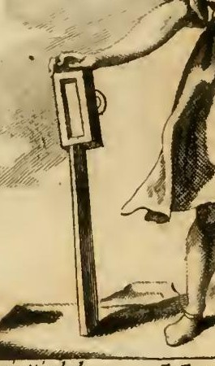
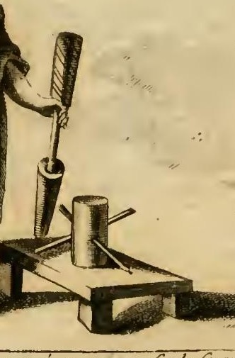
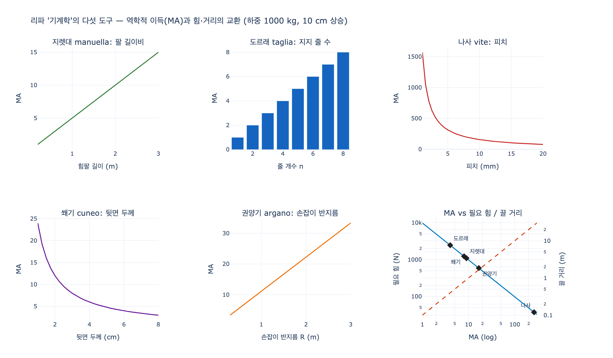
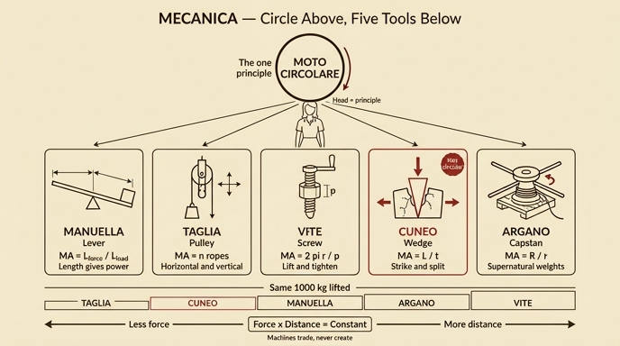

# '기계학(Mecanica)' 도상 — 머리 위의 원과 다섯 가지 도구

## 질문

'기계학' 도상에서 머리 위의 원과 다섯 가지 도구는 무엇을 뜻하는가?

## 답

- **원(circolo)**: 기계적 작동이 대부분 **원운동(moto circolare)** 에서 나옴을 뜻한다.
- **지렛대(manuella)**: 길이에 비례해 원운동으로 무게를 드는 도구 — 아리스토텔레스 『기계학』이 언급.
- **도르래(taglia)**: 수평·수직 어느 방향으로도 큰 무게를 끌고 올리는 도구.
- **나사(vite)**: 앞선 도구들보다 더 쉽게, 원운동으로 들어 올리고 조이는 도구.
- **쐐기(cuneo)**: 타격을 받아 단단한 것을 쪼개고 벌리는 도구.
- **권양기(argano)**: 중심 아래에 놓여 원운동으로 초자연적인 무게를 끄는 도구.

---

## 1. 원본 도상


리파의 지시문(원문):

> DOnna di età virile, veſtita di abito ſuccinto, con un circolo in cima del capo diritto in alto. Che colla deſtra mano tenga una manuella, e la taglia, e colla ſiniſtra la vite, ed il cuneo; ed in terra l'argano.
>
> (장년의 여인. 걷어 올린 짧은 옷을 입고, 머리 위에 원을 곧게 세워 얹었다. 오른손에는 **지렛대**와 **도르래**를, 왼손에는 **나사**와 **쐐기**를 들고, 땅에는 **권양기**가 놓여 있다.)

판화에서 실제로 확인되는 요소:

| 도상 요소 | 그림에서 보이는 모습 | 위치 |
|---|---|---|
| 원 (circolo) | 머리카락 위에 곧게 세워진 둥근 고리 모양 머리 장식 | 머리 정수리 |
| 지렛대 + 도르래 (manuella + taglia) | 긴 곧은 막대 끝에 직사각형 활차 틀(안에 홈과 작은 고리)이 달린 물건 | 화면 왼쪽, 오른손 |
| 나사 (vite) | 사선 음영으로 나사산이 표현된 축이 원통형 암나사(너트)에 박혀 있고, 위쪽에 돌리는 손잡이 | 화면 오른쪽, 왼손 |
| 쐐기 (cuneo) | 나사 옆 아래로 뾰족하게 좁아지는 원뿔·삼각 형태 | 나사 밑 |
| 권양기 (argano) | 나무 대(臺) 위에 세운 원통 드럼, 그 위쪽을 가로지르는 여러 개의 손잡이 막대 | 땅바닥(대 위) |

### 세부 1 — 지렛대와 도르래



여인의 오른손이 잡은 긴 막대 자체가 **manuella**(손으로 돌리거나 미는 지렛대·크랭크 막대)이고, 그 위에 얹힌 직사각형 틀이 **taglia**(활차 블록, block and tackle)다. 틀 안의 세로 홈은 바퀴(sheave)가 도는 자리이고 옆의 작은 고리는 밧줄을 걸거나 매다는 고정점이다. "수평(Orizonte)으로도 수직(verticale)으로도" 쓴다는 원문 설명은 바로 이 블록을 어디에 매달든 방향을 바꿔 힘을 전달할 수 있다는 뜻이다.

### 세부 2 — 나사, 쐐기, 권양기



- 왼손이 쥔 **막대는 나사를 돌리는 손잡이**이고, 그 아래 나사산이 새겨진 축이 원통형 몸통에 박혀 있다 → **vite**(나사, 스크루 잭·프레스의 원리).
- 나사 왼쪽 아래로 뾰족하게 좁아지는 원뿔 형태가 **cuneo**(쐐기)다.
- 나무 받침대 위 원통 드럼에 손잡이 막대들이 십자로 꽂힌 것이 **argano**(권양기/캡스턴). 원문의 "moto circolare messo sotto il luogo del centro"(중심 아래에 놓인 원운동)는 이 드럼이 **바닥에 놓여 축을 중심으로 돌면서** 밧줄을 감아 당긴다는 뜻이다.

---

## 2. 왜 '원'이 기계학의 표지인가

리파의 문장:

> Le ſi pone in cima del capo il circolo ſopraddetto, per dimoſtrare le operazioni meccaniche, che per lo più derivano dal moto circolare.
> (머리 위에 원을 얹은 것은, 기계적 작동이 대부분 원운동에서 유래함을 보이기 위함이다.)

이는 리파 자신의 착상이 아니라 **아리스토텔레스 계열 『기계학(Mechanica)』의 제1원리**를 그대로 옮긴 것이다. 그 책은 "기계의 놀라움은 모두 원의 성질로 환원된다"고 선언하고, 원 위의 점들이 **같은 시간에 서로 다른 거리를 지난다**(중심에서 멀수록 빠르다)는 사실을 모든 역학적 이득의 근원으로 삼는다.

- 같은 축에 매인 두 점 $A$(반지름 $R$), $B$(반지름 $r$)는 같은 각속도 $\omega$로 돌지만 이동 거리는 $R\theta$ 대 $r\theta$로 다르다.
- 따라서 일 $W = F \cdot s$ 가 보존되려면 $F_A R = F_B r$, 즉

$$MA = \frac{F_{\text{하중}}}{F_{\text{입력}}} = \frac{R}{r}$$

머리 위 원은 곧 "**지렛대·권양기·나사가 모두 이 하나의 관계에서 파생한다**"는 이론적 선언이다. 그래서 원은 손에 든 도구들처럼 **개별 기계**가 아니라, 그 위에 있는 **상위 원리**로서 머리 위에 놓인다. 손은 도구(실행), 머리는 원리(이론)라는 배치다.

리파가 앞부분에서 기계학을 "**수학적 학문(산술·기하·측량)의 이론을 매개로 손으로 작동하는 기술**"이라고 정의한 것도 같은 구조다. 기계학은 순수 이론도 순수 육체노동도 아니라 **이론이 손을 통해 실현되는 기술**이며, 그래서 도상은 "장년의 여인"(경험과 이성이 함께 갖춰진 나이)이고 "걷어 올린 짧은 옷"(방해 없이 움직일 수 있는 작업 복장)을 입는다.

---

## 3. 다섯 도구를 하나씩

### (1) 지렛대 (manuella / leva)

> la manuella è ſtromento compartito, mediante la ſua lunghezza, ad alzare col moto circolare, peſo a lei commiſurabile; di ciò ne fa menzione Ariſtotele nel libro delle Meccaniche.
> (지렛대는 **그 길이에 따라 나뉘어**, 원운동으로 그에 상응하는 무게를 들어 올리는 도구다. 아리스토텔레스가 『기계학』에서 이를 언급한다.)

핵심어가 **"길이에 비례(mediante la sua lunghezza)"** 다. 받침점(중심)에서 힘점까지의 길이 $L_f$ 와 하중점까지의 길이 $L_l$ 의 비가 그대로 이득이 된다.

$$MA_{\text{lever}} = \frac{L_f}{L_l}$$

지렛대의 두 끝은 **같은 원의 서로 다른 반지름 위**를 움직인다 — 그래서 리파는 굳이 "원운동으로(col moto circolare)"라고 쓴다. 지렛대는 원운동 원리의 **가장 벌거벗은 형태**다. 리파가 유일하게 출처(아리스토텔레스)를 명시한 도구이기도 하다.

### (2) 도르래 (taglia)

> la taglia è quella che ſerve per Orizonte, e per verticale, per tirare, ed alzare ogni gran peſo.
> (도르래는 수평으로도 수직으로도 쓰여, 온갖 큰 무게를 끌고 올린다.)

도르래의 두 기능이 명확히 갈린다.

- **방향 전환**: 고정 도르래는 이득이 1이지만 힘의 방향을 바꾼다 → 원문의 "수평·수직" 이 부분.
- **힘의 분배**: 움직 도르래를 겹치면 하중을 지지하는 줄 개수 $n$ 만큼 힘이 나뉜다.

$$MA_{\text{pulley}} = n \quad (\text{하중을 지지하는 줄의 수})$$

"taglia"는 단일 바퀴가 아니라 **활차 블록(block and tackle)** 을 뜻하는 말이므로, 도상의 직사각형 틀은 여러 바퀴를 담는 케이스로 그려진 것이다.

### (3) 나사 (vite)

> con maggior facilità de' ſuddetti ſtromenti opera circolarmente ad alzare medeſimamente ogni ponderoſa macchina, ed ancora per ſtringere, ed alzare, conforme l'occaſione.
> (앞선 도구들보다 **더 쉽게** 원운동으로 무거운 기계를 들어 올리고, 경우에 따라 **조이는** 데도 쓴다.)

두 가지가 강조된다.

- **"더 쉽게(con maggior facilità)"**: 나사는 이득이 압도적으로 크다. 한 바퀴 돌려 원주 $2\pi r$ 만큼 손을 움직이면 하중은 피치 $p$ 만큼만 올라간다.

$$MA_{\text{screw}} = \frac{2\pi r}{p}$$

- **"조인다(stringere)"**: 들어 올리기(잭)와 압착하기(프레스·바이스)가 같은 원리라는 인식. 인쇄기·기름틀·와인 프레스가 모두 나사였던 시대의 감각이다.

나사는 사실 **경사면(빗면)을 원통에 감은 것**이고, 손잡이 원운동이 축방향 직선운동으로 바뀌므로 "원운동에서 나온다"는 도상의 주장에 정확히 부합한다.

### (4) 쐐기 (cuneo)

> il cuneo è quello, che facilmente percoſſo dal colpo, apre, sforza, e divide ogni ſolida durezza.
> (쐐기는 타격을 받으면 손쉽게 단단한 것을 열고, 밀어젖히고, 쪼갠다.)

다섯 중 **유일하게 원운동이 아닌** 도구다. 쐐기는 빗면을 뒤집은 것으로, 축방향의 짧은 타격 거리를 옆방향의 큰 벌림 힘으로 바꾼다.

$$MA_{\text{wedge}} = \frac{L}{t} \quad (L: \text{쐐기 길이},\ t: \text{뒷면 두께})$$

또 쐐기만이 **"타격(colpo)"**, 즉 충격력을 동력으로 삼는다. 다른 넷은 서서히 누적하는 힘을 쓰고, 쐐기는 순간적인 힘을 쓴다. 리파의 동사 선택도 다르다 — 다른 도구는 "들어 올린다(alzare)/끈다(tirare)"인데 쐐기만 "쪼갠다(divide)". 기계학이 **무게를 옮기는 것**만이 아니라 **재료를 가르는 것**까지 포함함을 보여주는 항목이다.

### (5) 권양기 (argano)

> come ſtromento, che dal moto circolare meſſo ſotto il luogo del centro, tira, ed alza peſi ſoprannaturali.
> (중심의 자리 아래에 놓인 원운동으로, **초자연적인** 무게를 끌고 올리는 도구.)

- **"중심 아래에(sotto il luogo del centro)"**: 권양기(캡스턴/윈들러스)는 지면에 세워 수직축을 중심으로 도는 기계다. 사람은 긴 손잡이 막대(handspike)를 잡고 원 둘레를 돌고, 밧줄은 가느다란 드럼에 감긴다.

$$MA_{\text{capstan}} = \frac{R_{\text{손잡이}}}{r_{\text{드럼}}}$$

- **"초자연적인 무게(pesi soprannaturali)"**: 다섯 도구 중 가장 과장된 표현. 여러 사람이 동시에 붙을 수 있고 손잡이 반지름을 얼마든지 늘릴 수 있어, 실제로 오벨리스크 세우기·선박 인양·성벽 축조에 쓰인 최대 출력 기계였다. 그래서 도상에서 유일하게 **손에 들리지 않고 땅에 놓여** 있다 — 손으로 들 수 없는 규모의 기계라는 표현이다.

---

## 4. 전체 구조 한 장 정리

```
          ○  원 (circolo)  ── 원리: 모든 기계적 작동은 원운동에서
          │
        [머리]  ← 이론 (수학: 산술·기하·측량)
          │
   ┌──────┴───────┐
 오른손           왼손          땅
 ├ 지렛대 manuella  ├ 나사 vite   └ 권양기 argano
 └ 도르래 taglia    └ 쐐기 cuneo
   "길이에 비례"      "더 쉽게 / 조인다"   "초자연적 무게"
   "수평·수직"        "타격으로 쪼갠다"     "중심 아래 원운동"
```

원운동 계열 4종(지렛대·도르래·나사·권양기) + 타격/빗면 계열 1종(쐐기)로 갈리며, 힘의 크기 순서는 대체로 **지렛대 < 도르래 < 나사 < 권양기**(리파가 "더 쉽게", "초자연적"이라는 부사로 암시한 서열)다.

## 5. 암기 포인트

- 원 = **원리**(원운동), 손 = **도구**. 머리에 원리, 손에 실행.
- 도구별 키워드 한 단어씩: 지렛대 = **길이**, 도르래 = **방향(수평·수직)**, 나사 = **쉬움·조임**, 쐐기 = **타격·쪼갬**, 권양기 = **중심 아래·초자연적**.
- 유일한 인용: 지렛대에 **아리스토텔레스 『기계학』**.
- 유일한 비(非)원운동: **쐐기**.
- 유일하게 손에 없고 땅에 있는 것: **권양기**.

---

## 시각화



## 인포그래픽


