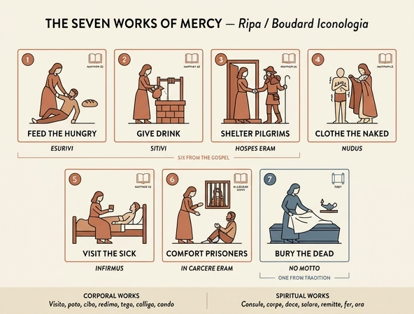

# 자비의 일곱 가지 행위 (Opere di Misericordia)

## 질문

'자비의 일곱 가지 행위(Opere di Misericordia)'는 어떻게 그려지는가?

## 한눈에 보는 답

> 일곱 개의 독립된 **여인상(Donna)** 으로 그려진다. 각 상은 하나의 행위를 수행하는 **동작 그 자체**가 지물(attribute)이며, 첫 여섯 상에는 마태복음 25:35-36의 라틴어 구절이 표어로 붙는다. 일곱째(죽은 이를 묻기)만은 마태복음에 없어 표어가 없다.

원문(페루자판 『Iconologia』 4권, 인쇄 276-277쪽)의 표제는 이 항목의 출처를 못박아 둔다.

```
OPERE DI MISERICORDIA,
Come figurate nell' Edizione di Parma del Sig: Boudard
(= 부다르 씨의 파르마판에 도상화된 방식대로)
```

즉 이 항목은 리파(Cesare Ripa)의 원저에 있던 것이 아니라, **장바티스트 부다르(Jean-Baptiste Boudard, 1710-1768)** 가 파르마에서 1759년에 낸 『Iconologie tirée de divers auteurs』(3권, 프랑스어·이탈리아어 대역, 권당 200여 점의 에칭)의 고안을 후대 편찬자가 **말로 옮겨 실은** 것이다. 그래서 이 항목에는 도판이 딸리지 않고 서술만 있다.

## 1. 일곱 행위 · 도상 · 라틴 표어

| # | 원문 표제 (이탈리아어) | 한국어 | 부다르식 도상 — 실제로 그려지는 장면 | 라틴 표어 | 성서 |
|---|---|---|---|---|---|
| 1 | *Dar da mangiare agli affamati* | 굶주린 이에게 먹을 것을 | 굶주려(per la fame) 땅에 쓰러진 빈자를, 극도의 탈진(estremo sfinimento)에서 일으켜 세우려 온 힘을 쓰는 여인 | ESURIVI, ET DEDISTIS MIHI MANDUCARE | 마 25:35 |
| 2 | *Dar da bere agli assetati* | 목마른 이에게 마실 것을 | **샘(fonte)에서 물을 길어** 빈자에게 주며, 그가 급히 목을 축이는 것을 보고 흡족해하는 여인 | SITIVI, ET DEDISTIS MIHI BIBERE | 마 25:35 |
| 3 | *Alloggiare i Pellegrini* | 순례자에게 숙소를 | **구호소(Spedale) 문턱**에 선 정숙한 여인(Donna modesta). 건물 외관 일부가 보이고, 여행에 지쳐 기진한 순례자의 **손을 잡아** 이끈다 | HOSPES ERAM, ET COLLEGISTIS ME | 마 25:35 |
| 4 | *Vestir gl' Ignudi* | 헐벗은 이에게 옷을 | 자애롭고 상냥한 표정(aria caritatevole ed affabile)으로 추위에 얼어붙은 헐벗은 빈자에게 **망토(mantello)를 덮어준다**. 빈자의 얼굴에는 감사가, 눈은 은인을 겸손히 올려다본다 | NUDUS, ET COOPERUISTIS ME | 마 25:36 |
| 5 | *Visitar gl' Infermi* | 병자를 방문하기 | 병으로 쇠약해져 **침상에 누운** 남자 옆에 **앉아**, 연민의 표정으로 바라보며 **마실 것을 건넨다** | INFIRMUS, ET VISITASTIS ME | 마 25:36 |
| 6 | *Visitare i Carcerati* | 갇힌 이를 방문하기 | **감옥의 공포(orrore di una carcere)** 속에 앉은 위엄 있는 부인(Matrona grave). 손발에 쇠사슬을 찬 채 바닥에 뻗은 죄수가 경청하고, 그에게 **마땅히 받는 형벌(supplizio meritato)을 기꺼이 견디라고 격려**한다 | IN CARCERE ERAM, ET VENISTIS AD ME | 마 25:36 |
| 7 | *Sepellire i Morti* | 죽은 이를 묻기 | **흰 아마포(bianco lino)로 시신을 감싸는** 여인. 옆에 **관(cassa)과 켜 놓은 등불(lume acceso)** 이 놓여 있다 | **없음** | (마태복음 밖) |

세부 주의점 두 가지:

- **6번은 '위로'라기보다 '권면'** 이다. 원문은 죄수를 달래는 것이 아니라 *anima un prigioniero a sopportare di buona voglia il supplizio meritato*(정당한 형벌을 흔쾌히 감수하도록 북돋운다)라고 적는다. 18세기 가톨릭 자선 담론에서 이 행위가 형벌의 정당성을 부정하지 않는 방식으로 재해석되었음을 보여준다. 전통 목록의 *redimere captivos*(포로를 속량함)가 여기서는 **감옥 방문**으로 바뀌어 있는 것도 같은 맥락이다.
- **7번에만 표어가 없다.** 마태복음 25장에 매장이 없기 때문이다("각각 마태복음 구절이 붙는다"고 외우면 이 한 칸이 틀린다.)

항목 서문에서 리파판 편찬자는 개별 표어들의 근거가 되는 대전제를 먼저 인용한다.

> *Amen dico vobis, quamdiu fecistis uni ex his fratribus meis minimis, mihi fecistis.*
> ("너희가 내 형제 중에 가장 작은 자 하나에게 한 것이 곧 내게 한 것이다." 마 25:40)

## 2. 왜 6 + 1 = 7인가

마태복음 25:35-36은 최후의 심판 장면에서 **여섯 가지**만 열거한다: 먹임 · 마시게 함 · 손님으로 받아들임 · 입힘 · 병자 방문 · 옥에 갇힌 자 방문.

일곱째 **매장**은 성경의 다른 계통에서 왔다.

- **토빗기(Tobias) 1:17-19, 2:3-9** — 토빗은 왕의 금령을 무릅쓰고 살해된 동족의 시신을 거두어 묻는다. 이것이 그의 대표적 의행(義行)으로 기록된다.
- 초기 교회의 순교자 매장 관행과 아우구스티누스의 *De cura pro mortuis gerenda*가 이를 자비의 의무로 정착시켰다.
- **7이라는 수 자체**가 매장을 불러들였다. 성령의 일곱 선물, 일곱 성사, 일곱 죄, 일곱 덕 등 중세 교리 도식은 칠수(七數) 체계였고, 여섯짜리 목록은 도식에 맞지 않았다.
- 토마스 아퀴나스 『신학대전』 II-II, q.32, a.2가 육체적 자비 일곱 항을 확정하며 암기용 육각운(hexameter)을 인용한다.

> **Visito, poto, cibo, redimo, tego, colligo, condo.**
> (방문하고 · 마시게 하고 · 먹이고 · 속량하고 · 덮어주고 · 거두어들이고 · 묻는다)

여기서 *condo*(묻는다)가 일곱째 자리를 채운다. 즉 **여섯은 복음서에서, 일곱째는 전통과 칠수 도식에서** 왔다.

## 3. 육체적 자비(corporalia) 대 영적 자비(spiritualia)

스콜라 신학은 자비의 행위를 몸을 돕는 것과 영혼을 돕는 것으로 나누고, 각각 일곱 항을 세웠다. 리파/부다르의 이 항목은 **육체적 일곱만** 도상화한다.

| | 육체적 자비 (opera corporalia) | 영적 자비 (opera spiritualia) |
|---|---|---|
| 대상 | 몸의 궁핍 (배고픔·목마름·헐벗음·질병·구금·죽음) | 영혼의 궁핍 (무지·의심·슬픔·죄) |
| 근거 | 마태 25:35-36 (6) + 토빗기 (1) | 복음 전반, 교부·스콜라 종합 |
| 암기 운문 | *Visito, poto, cibo, redimo, tego, colligo, condo* | *Consule, carpe, doce, solare, remitte, fer, ora* |
| 목록 | ① 먹이기 ② 마시게 하기 ③ 나그네 접대 ④ 입히기 ⑤ 병자 방문 ⑥ 갇힌 이 방문(속량) ⑦ 죽은 이 매장 | ① 의심하는 이에게 조언 ② 죄인을 훈계 ③ 무지한 이를 가르침 ④ 슬픈 이를 위로 ⑤ 모욕을 용서 ⑥ 괴롭히는 이를 참아냄 ⑦ 산 이와 죽은 이를 위해 기도 |
| 위계 | 하위 (아퀴나스: 영적 자비가 더 높다 — 영혼이 몸보다 귀하므로) | 상위 |
| 도상화 | 활발함 — 동작이 명확해 그림이 된다 | 드묾 — 추상적이어서 지물화가 어렵다 |

**핵심**: 육체적 자비가 미술사에서 압도적으로 많이 그려진 이유는 신학적 우위 때문이 아니라 **가시성** 때문이다. '빵을 건네는 손'은 그릴 수 있지만 '의심하는 이에게 조언함'은 그리기 어렵다. 부다르가 육체적 일곱만 인격화한 것도 이 제약의 결과다.

## 4. 도상 형식 — 왜 '일곱 여인상'인가


*(참고 도판. 페루자판 『Iconologia』 4권의 「기도(Orazione)」, Carlo Mariotti 그림 · Carlo Grandi 판각. 자비의 행위 항목 자체에는 이 판본에서 도판이 실리지 않았다 — 부다르판을 글로 옮긴 항목이기 때문이다.)*

위 도판에서 관찰되는 요소가 자비의 일곱 상에도 그대로 적용된다.

- **단독 여성 인물 + 지물의 결합**: 무릎 꿇은 여인 한 사람이 화면을 채우고, 손에 든 향로 하나가 개념('기도')을 지시한다. 자비의 일곱 상도 똑같이 여인 한 명 + 하나의 결정적 물건/동작(물동이 · 망토 · 흰 아마포)으로 성립한다.
- **화면 아래의 이름표**: 판화 하단에 *Orazione*라는 개념명이 새겨진다. 부다르판의 자비 도판도 같은 자리에 라틴 표어(*ESURIVI, ET DEDISTI...*)를 두어 그림과 성구를 붙여 놓는다.
- **여성형이라는 문법**: 라틴어·이탈리아어에서 추상명사가 대개 여성명사이므로(*misericordia*, *oratio*), 인격화는 관례적으로 여인상이 된다. 일곱 행위가 모두 *Donna*/*Matrona*로 지정된 것은 취향이 아니라 이 문법적 관례다.

**리파식 인격화 대 서사화의 차이**: 카라바조의 「자비의 일곱 행위」(1607, 나폴리 Pio Monte della Misericordia)는 일곱 행위를 **하나의 화면에 뒤엉킨 사건**으로 압축한다. 반면 부다르/리파판은 이를 **일곱 개의 분리된 표제 항목**으로 쪼개 각각에 표어를 달았다. 전자는 회화적 드라마, 후자는 **사전(dictionary) 형식** — 예술가가 필요한 한 항목만 뽑아 쓰도록 만든 참고용 목록이다. 이것이 『Iconologia』류 도상 사전의 기능이다.

## 5. 암기 실마리

- 6은 마태, 1은 토빗 — **"복음서 여섯, 전통 하나"**.
- 표어의 문형은 전부 **"나는 ~였다, 그리고 너희는 나에게 ~했다"**(1인칭 그리스도). 심판자가 수혜자와 자신을 동일시하는 마 25:40의 논리를 문장 구조가 반복한다.
- 지물 7종을 순서대로: **쓰러진 몸 → 물동이 → 문턱 → 망토 → 침상 → 쇠사슬 → 흰 아마포**. 배고픔에서 죽음으로, 생의 곤궁이 점점 심해지는 순서로 배열되어 있다.
- 함정 두 개: ⑦에는 라틴 표어가 없다 / ⑥은 '속량'이 아니라 '감옥 방문 + 형벌 감수 권면'이다.

## 인포그래픽


</content>
</invoke>
