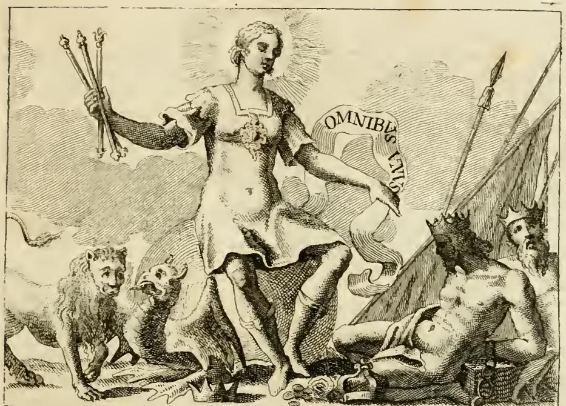

# 리파의 '가운데(Mezzo)' 의인화

> **질문** 리파는 '가운데(Mezzo)'를 어떻게 의인화했는가?
>
> **답** 장년 남자가 지구본 위에 서서 금빛 망토를 두르고 월계관을 썼으며, 오른손에 둘로 똑같이 나뉜 원을 들고 왼손 검지로 자기 배꼽을 가리키며, 머리 바로 위에 태양이 떠 있다.

출전: Cesare Ripa, *Iconologia*, **TOMO QUARTO, pp. 150–152**, 항목 `M E Z Z O` (앞 항목은 `METAFISICA`, 뒤 항목은 `MINACCE`).
원문 파일: `.fm/assets/06 Metaphysics to Worldly Monarchy.md` 13–73행.

---

## 1. 원문 도상 규정 (첫 문단)

> UOmo di età virile, che stia in piedi in bella attitudine sopra di un **Globo terrestre**, con un **manto di oro**, e che abbia in capo una **ghirlanda di lauro**, e che con la destra mano tenga con bella grazia un **circolo diviso in due parti eguali**, e con il dito indice della sinistra mano mostri il **bellico**, e sopra il capo sia per diretto un **Sole**.
> *(17행. 이 판본은 옛 이탈리아어 활자로 긴 s(ſ)가 f처럼 보인다 — `fignifica`=significa, `deftra`=destra 등.)*

번역: "**장년(età virile)**의 남자가 **지구본** 위에 아름다운 자세로 서 있다. **금빛 망토**를 입고 머리에는 **월계관**을 썼으며, 오른손으로 **둘로 똑같이 나뉜 원**을 우아하게 들고, 왼손 검지로는 **배꼽**을 가리키며, 머리 바로 위 수직선상에 **태양**이 있다."

### 지물 6가지 요약표

| 지물 | 위치 | 뜻하는 '가운데' |
|---|---|---|
| 장년(壯年)의 남자 | 몸 전체 | **인생의 중간** 나이 + 사덕(四德)의 절정 |
| 지구본 위에 서 있음 | 발밑 | **우주의 중심**인 지구 |
| 금빛 망토 + 월계관 | 옷·머리 | 완전함·덕의 값 = "덕은 중용에 있다" / 금 = 인체의 가운데인 **심장** |
| 둘로 똑같이 나뉜 원 | 오른손 | **춘추분권(적도)** = 천구를 이등분하는 선 |
| 배꼽을 가리키는 왼손 검지 | 왼손 | **인체의 중심점** |
| 머리 바로 위의 태양 | 머리 위 | **정오(mezzo giorno)** + **일곱 행성의 중간**에 있는 태양 |

암기 실마리: **아래(지구본) → 몸(장년·망토·월계관) → 손(원·배꼽) → 위(태양)** 로 훑으면 여섯 지물이 아래에서 위로 한 줄로 꿰인다. 그리고 모든 지물이 예외 없이 "중간/중심"이라는 한 가지 관념을 다른 층위(나이·우주·윤리·천문·해부·시간)에서 반복한다.

---

## 2. 리파가 정의한 'Mezzo'의 네 가지 의미 (19–31행)

리파는 도상을 설명하기 전에 먼저 이탈리아어 `mezzo`가 담고 있는 뜻을 나눈다. 도상은 이 네 가지를 한 몸에 담기 위한 장치다.

1. **수단·매개(instrumento)** — 무엇인가가 그것을 '통하여(per mezzo di)' 이루어지는 도구. 국소운동(moto locale)에서 세 가지를 고려하듯이: 출발점(*terminus a quo*), 도착점(*terminus ad quem*), 그리고 움직이는 것이 지나가는 **중간(mezzo)**.
2. **중용(mediocrità)** — 사물의 과잉(eccesso)과 결핍(difetto) 사이, 두 극단 모두에 관여하는 것. 아리스토텔레스 『니코마코스 윤리학』 2권: *Mediocritas est quaedam virtus medii, & perfecti indagatrix.* 마르티알리스 1권: *Illud quod medium est, inter utrumque probatur* ("중간에 있는 것이 양쪽 사이에서 인정받는다").
3. **똑같은 절반** — 어떤 것을 둘로 나누었을 때 서로 같은 두 부분.
4. **양 극단에서 등거리인 점** — 원의 **중심(Centro)**. 유클리드가 말하듯 중심에서 원주로 그은 모든 선은 서로 같다. 아리스토텔레스 『윤리학』 2권 6장의 정의: *Rei medium appello id quod aeque abest ab utraque extremitate* ("두 끝에서 똑같이 떨어져 있는 것을 나는 사물의 중간이라 부른다").

---

## 3. 지물별 해설 (33–73행)

### (1) 장년(età virile)으로 그리는 이유 — 33행
- 장년은 **우리 생애 햇수의 가운데**일 뿐 아니라, 몸과 마음에 속한 모든 덕의 **활력(vigore)** 이 그때 있기 때문이다.
- 몸으로는 이 나이에 **기질(temperamento)** 이 최고조에 있고,
- 마음으로는 이성이 이끄는 네 덕 — **용기(Fortezza)·지혜(Prudenza)·절제(Temperanza)·정의(Giustizia)** — 을 모두 발휘할 수 있으니, 이때 사람이 그 덕들에 대한 완전한 인식에 이르렀기 때문이다.

### (2) 지구본 위에 서 있는 이유 — 35–41행
- 지구가 자신의 **무거움(gravità)** 때문에 온 세계의 **중심이자 가운데**이기 때문이다.
- 그래서 지구는 늘 가장 낮은 곳, 곧 하늘에서 가장 먼 곳을 찾으며, 한 번 자리 잡으면 자연적으로 그 자리를 떠날 수 없다.
- 근거로 두 권위를 든다.
  - **마닐리우스**(『아스트로노미카』) 인용: 우주 자체가 매달려 있고 땅은 "공기의 가운데 빈 자리를 차지하여(*Est igitur tellus mediam sortita cavernam aeris*)" 깊이의 모든 방향에서 똑같이 떠 있다 — 달과 태양이 허공을 날듯 땅도 공중의 법칙을 본떠 매달려 있다.
  - **요하네스 데 사크로보스코** 『천구론(De Sphaera)』 1장: *quod autem terra in medio omnium teneatur immobiliter, cum sit summe gravis...* — 지구는 가장 무겁기에 만물의 가운데에 부동하게 놓이며, 무거운 것은 모두 자연적으로 중심을 향하고, 그 중심이란 곧 천구(firmamentum)의 가운데 점이다.

즉 이 발판은 단순한 지구 모형이 아니라 **아리스토텔레스–프톨레마이오스 우주론의 '중심'** 그 자체다.

### (3) 금빛 망토와 월계관 — 43–49행
- 두 지물은 (리파가 여러 번 말한 대로) **완전함(perfezione)** 과 **덕의 값(pregio della virtù)** 을 뜻하는데, 그 덕이 바로 **중용에 있다**.
- 헤시오도스: *Dimidium plus toto* — "**절반이 전체보다 크다**." 플라톤 『국가』도 이를 확인한다.
- 이유: 완전함은 **전체(tutto)** 가 아니라 **중간(Mezzo)** 에 있다. 전체는 극단까지 포함하고, 극단은 때때로 악덕이며 해롭기 때문이다.
- 게다가 **금(oro)** 자체도 '가운데'를 뜻할 수 있다. 대우주(Mondo grande)를 소우주(microcosmo)에 견줄 때, 특히 **파라켈수스주의자들**에 따르면 **은은 뇌, 금은 심장**이다. 해부학자들에 따르면 심장은 **사람의 가운데** 있고, 생명의 원리로서 거기서 모든 완전함과 신체의 대칭(simmetria)이 나온다. 아리스토텔레스의 표현으로 심장은 *Primum vivens, ultimum moriens*(가장 먼저 살고 가장 나중에 죽는 것)이다.

### (4) 오른손의 '둘로 똑같이 나뉜 원' — 51–55행
- 이는 **춘추분권(cerchio Equinoziale)**, 파라보스코가 말한 **분점 콜루르(Coluro Equinoziale)** 를 보이기 위한 것이다. 이 원은 세계의 극(Poli)을 지나며 **천구를 두 개의 같은 부분으로 나누고**, 지점(至點) 콜루르(Coluro del Solstizio)에서 똑같이 떨어져 있다.
- 리파가 붙이는 천문 설명:
  - 태양이 **게자리(Cancro)** 첫 점을 지나면 천정(Zenit, 우리 머리 위 하늘의 점)에 최대한 가까워져 **하지**,
  - **염소자리(Capricorno)** 시작에 닿으면 우리에게서 최대한 멀어져 **동지**,
  - **양자리(Ariete)** 시작에 닿으면 **춘분**, **천칭자리(Libra)** 에 닿으면 **추분**.
  - 그래서 이 원은 **적도(Equatore)** 라고도 불린다. 태양이 이 선을 지날 때 낮이 12시간, 밤도 12시간이기 때문이다. 인용 시구: *Hic duo Solstitia faciunt Cancer, Capricornus, / Sed noctes aequat Aries, & Libra diebus.*
- 또한 이 원은 **제1동자(primo mobile)의 띠(cingolo)** 라고도 불린다. **허리띠처럼** 천구를 두 같은 부분으로 나누기 때문이다.

### (5) 왼손 검지로 배꼽을 가리키는 이유 — 57행
- **피에리오 발레리아노** 『히에로글리피카』 34권: 사람의 **배꼽(bellico)** 은 온 몸의 가운데에 자리한다 — 다리를 벌려 세우든, 팔을 높이 벌리든, 정사각형 도형에 넣어 두든 마찬가지다.
- 이는 근거 없는 말이 아니라 최고의 해부학자들이 지적한 것이라며 이름을 든다: **바세오(Vassaeus)** 의 첫 해부도, **폼포니우스 가우리쿠스** 『인체의 대칭에 관하여(De hominis symmetria)』, 그리고 **갈레노스** 『신체 부분의 효용에 관하여』 15권 4장 및 『히포크라테스와 플라톤의 학설에 관하여』 4장.
- 갈레노스는 몸의 가운데가 심장인지 배꼽인지를 따지면서 **"심장은 가슴의 가운데, 배꼽은 온 몸의 가운데"** 라고 결론한다. → 그래서 (3)의 금=심장과 (5)의 배꼽이 모순 없이 함께 놓인다.

### (6) 머리 바로 위의 태양 — 59–73행
리파가 가장 길게 설명하는 지물로, 두 층의 뜻이 겹쳐 있다.

**(a) 정오(mezzo giorno)** — 59행
- 태양을 머리 위 **직선(per linea retta)** 상에 그리는 것은 우리 지평의 **정오**를 나타내기 위함이다. 태양이 **자오선(linea meridiana)** 을 지날 때, 사람이 어디에 있든 해의 어느 시기든 그때가 정오가 되며, 그 선은 하늘을 두 부분으로 나눈다.
- 이탈리아어에서 정오가 그대로 *mezzo giorno*(하루의 가운데)라는 점이 이 지물의 언어유희적 핵이다.

**(b) 일곱 행성의 가운데에 있는 태양** — 61–73행
- 태양은 **모든 행성의 가운데**에 있으므로 '가운데'의 최상의 상징이다. 프톨레마이오스(dict. 5, cap. 15)와 **알바테그니우스(al-Battānī, 50장)** 가 여러 근거로 증명하듯, 태양은 **달·수성·금성 위, 토성·목성·화성 아래**에 있다. 가운데 있으므로 다른 행성들의 **규칙이자 척도(regola e misura)** 다.
- 화성·목성·토성은 주전원(Epidico) 때문에 태양과 운동이 일치하고, 달·수성·금성은 그 원들로 태양과 운동을 맞춘다. 그러니 태양이 **두 가지 다른 운동을 조화시키기 위해** 가운데 있는 것이다.
- **알부마사르(Abū Maʿshar)** 의 또 다른 이유: 신은 태양을 토성 위에 두지 않았다 — 너무 멀어 하위 사물에 작용하지 못하고 땅이 차갑게 남았을 것이다. 달 위에 두었다면 동에서 서로 너무 느리게 움직였을 것이고, 땅에 너무 가까워 아래의 모든 것이 타 버렸을 것이다. 그러므로 **가운데 있어서 그 작용이 절제된다(azioni temperate)**.
- 그래서 오비디우스 『변신 이야기』 1권에서 포이보스가 태양 마차에 오르려는 파에톤에게 경고한 것도 이유가 있다:
  > *Altius egressus caelestia signa cremabis: / Inferius terras; **Medio tutissimus ibis**.*
  > "너무 높이 가면 하늘의 별자리를 태우고, 너무 낮으면 땅을 태울 것이다. **가운데로 가면 가장 안전하리라.**"
  → 이 구절이 항목 전체의 표어에 가깝다.
- 태양은 **왕(Re)** 이며 모든 행성의 **심장**이라 할 수 있다. 그래서 왕이 왕국의 가운데에, 심장이 동물의 가운데에 놓이듯, 모든 지체를 **똑같이 도울 수 있도록** 가운데 배치되었다.
- 리파는 여기서 "일곱 행성의 공화국"을 상상해 관직을 배분한다 — 암기용 곁가지로 재미있다.

| 행성 | 직책 | 이유 |
|---|---|---|
| 태양 | 왕(Re) | 모두의 가운데 |
| 토성 | 고문관(Consigliere) | 노령 |
| 목성 | 만인의 재판관(Giudice) | 관대함(magnanimità) |
| 화성 | 군대의 지휘관(Capitano di milizia) | — |
| 금성 | 가정의 어머니처럼 모든 재화의 분배자 | — |
| 수성 | 비서·서기관(Segretario e Cancelliere) | — |
| 달 | 대사(Ambasciatore) | 운행이 빨라 매달 전체를 돌며 왕을 섬김 |

- 끝으로 태양이 가운데 있는 것은 **빛의 저자이자 수여자(Autore e Datore della luce)** 로서 다른 모든 행성에 더 편하게 빛을 나눠주기 위함이다.

---

## 4. 왜 이 도상이 '중용'의 알레고리인가

이 항목의 논리는 하나의 낱말에 걸린 **여섯 층의 동형(同形) 구조**다.

```
윤리(과잉↔결핍)   → 중용     → 월계관·금빛 망토, 장년의 사덕
우주(하늘↔하늘)   → 지구     → 발밑의 지구본
천구(북극↔남극)   → 적도     → 오른손의 이등분된 원
인체(머리↔발)     → 배꼽     → 왼손 검지
인체(위↔아래)     → 심장     → 금(oro)
하루(일출↔일몰)   → 정오     → 머리 위 태양
행성(토성↔달)     → 태양     → 머리 위 태양
```

윤리적 중용이 곧 우주의 중심이고 인체의 중심이며 하루의 중심이라는 **르네상스 대우주–소우주 대응(macrocosm–microcosm)** 사고가 그림 한 장에 압축된 셈이다. `Medio tutissimus ibis`가 이 전부를 묶는 한 줄이다.

---

## 5. 판화에 관한 참고

`.fm/assets/06 Metaphysics to Worldly Monarchy.md`에는 **`M E Z Z O` 항목에 붙은 전면 판화가 남아 있지 않다.** 이 항목의 앞뒤 페이지에서 추출된 이미지(`_page_135_Picture_13.jpeg`, `_page_139_Picture_5.jpeg`)는 도상 판화가 아니라 장 머리·꼬리의 **장식 컷(vignette)** 이다. 이 판본에서 모든 항목에 판화가 붙어 있지는 않으며, MEZZO는 판화 없이 본문만 실린 항목이다.

### 비교: 같은 장의 '세속 군주정(Monarchia Mondana)'

**아래 그림은 MEZZO가 아니다.** 같은 장 끝(403행)에 실린 다른 항목의 판화인데, MEZZO와 지물 두 개(지구본, 태양의 광채)를 공유하면서 **뜻이 정반대**여서 대비용으로 유용하다.



- 그림에서 관찰되는 것: 왕관 대신 **태양광선(raggi simili a quelli del Sole)** 이 머리를 감싼 젊은 여성, 오른손에 **네 개의 홀(scettri)**, 가슴 가운데 다이아몬드 보석, 왼손 쪽에 `OMNIBUS UNUS`(만인에게 하나) 라 적힌 두루마리, 왼쪽에 사자와 뱀, 오른쪽에 관을 쓴 채 쇠사슬로 묶여 땅에 엎어진 포로들과 무기·나팔·깃발·재물.
- 원문(409행)에 따르면 이 여성은 지구본 위에 **앉아(a sedere sopra un Globo terrestre)** 있다.
- 대비 포인트: MEZZO는 지구본 위에 **서서** 그 중심성을 증명하고 태양을 **머리 위에 두어** 절제를 말하는데, Monarchia Mondana는 지구본을 **왕좌로 삼아 앉고** 태양의 광채를 **자기 왕관으로 삼아** 지배를 말한다. 같은 지물이 자세와 배치에 따라 '중용'과 '오만한 지배'로 갈린다.
