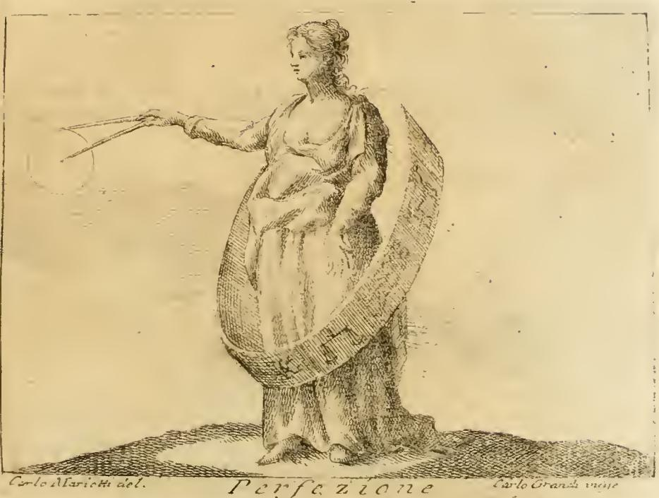

# 완전함 (Perfezione) — 피에르 레오네 카셀라의 도상

체사레 리파(Cesare Ripa)의 『이코놀로지아(Iconologia)』에 실린 항목으로, 이 「완전함(Perfezione)」 도상은 리파 본인이 아니라 **피에르 레오네 카셀라(Pier Leone Casella)** 가 고안한 것으로 명시되어 있다(원문: "Di Pier Leone Casella"). 카셀라(1540경~1620)는 아퀼라 출신의 인문학자·시인으로, 리파의 친구이자 협력자로서 『이코놀로지아』 증보판에 여러 알레고리 도상을 기고했다.

## 도상의 구성

원문 묘사: "Donna vestita di oro. Mostri le mammelle, e tutto il petto scoperto. Starà dentro al cerchio del Zodiaco, disegnando col compasso nella sinistra mano un circolo, il quale si scolpisca quasi finito."

- **금빛(황금) 옷을 입은 여인**
- **가슴과 젖가슴을 드러낸 모습**
- **황도대(조디악)의 원 안에 서 있음**
- **왼손에 든 컴퍼스로 원을 그리는 중** — 그 원은 "거의 완성된(quasi finito)" 상태로 새겨져야 한다

판화를 보면 여인이 커다란 타원형 띠(황도대) 안에 서 있고, 띠 표면에는 황도 12궁의 별자리 기호들이 새겨져 있다. 뻗은 손에 쥔 컴퍼스는 아직 닫히지 않은 호(弧)를 그리고 있어 "거의 완성된 원"이라는 지시를 그대로 보여준다. 하단 캡션에 "Perfezione"라는 제목과 함께 소묘가 카를로 마리에티(Carlo Marietti del.), 판각이 카를로 그란디(Carlo Grandi incise)임이 표기되어 있다(이는 헤르톨 판 『이코놀로지아』의 삽화 제작자 표기이며, 도상의 고안자는 카셀라이다).

## 각 요소의 의미

### 1. 금빛 옷 — 금속 중 으뜸인 금의 완전함
"Il vestimento di oro le si deve, per la perfezione, che ha fra tutti i metalli." 금은 모든 금속 가운데 가장 완전한 것이므로, 완전함의 의인상에는 황금 옷이 합당하다. (참고: 스캔 원문에는 OCR 오류로 "fra tutti i mali"라 되어 있으나 문맥상 "fra tutti i metalli"(모든 금속 중)가 맞다.)

### 2. 드러낸 가슴 — 주는 것이 받는 것보다 완전하다
드러낸 젖가슴과 가슴은 완전함의 매우 중요한 부분, 즉 **남을 먹이고(nutrire altrui) 자기 재산을 기꺼이 나누는 것**을 뜻한다. 은혜를 받는 것보다 **주는 것이 더 완전한 일**이기 때문이다. 그래서 무한한 완전함이신 하나님은 모든 피조물에게 주기만 하실 뿐, 피조물로부터 아무것도 받지 않으신다는 논리로 뒷받침된다.

### 3. 컴퍼스와 원 — 가장 완전한 도형
컴퍼스로 그리는 **원은 수학(기하학) 도형 가운데 완전한 형태**이다. 리파는 피에리오 발레리아노(Pierio Valeriano, 『Hieroglyphica』 39권)를 인용하며, 고대인들이 제사를 마친 뒤 희생 제물의 피를 그릇에 받아 제단에 **원을 그려 적셨고**, 이때 그리스어로 **"텔레이에스테(Teleiesthe, 끝마쳤다)"** 라는 신성한 말을 외쳤다고 전한다. 이 말이 곧 완전함의 표지였는데, 원이 **모든 방향에서 다른 어떤 도형보다 완전한 형태**이기 때문이다. 원이 "거의 완성된" 상태로 그려지는 것은 완전함이 완결을 향해 나아가는 행위임을 보여준다.

### 4. 황도대의 원 — 이성, 완전한 행위의 척도
여인을 둘러싼 **황도대(Zodiaco)의 원은 이성(ragione)의 상징**이며, 이성은 "완전한 행위들의 마땅하고 알맞은 척도(debita e convenevole misura delle azioni perfette)"이다. 태양이 황도대를 따라 한 치의 어긋남 없이 규칙적으로 운행하듯, 인간의 행위도 이성이라는 척도 안에서 이루어질 때 완전해진다는 뜻이다.

## 기억 포인트

| 요소 | 의미 |
|---|---|
| 금빛 옷 | 금 = 모든 금속 중 가장 완전한 것 |
| 드러낸 가슴 | 남을 먹이고 나눔 — 주는 것이 받는 것보다 완전함 (하나님은 주기만 하심) |
| 컴퍼스로 그리는 (거의 완성된) 원 | 원 = 가장 완전한 도형 (그리스어 "Teleiesthe = 끝마쳤다") |
| 황도대의 원 | 이성 = 완전한 행위의 척도 |

참고로 바로 뒤에 이어지는 항목 「배신(Perfidia)」은 리파 본인의 것("Di Cesare Ripa")으로 표기되어 있어, 이 「완전함」이 카셀라의 기고임이 대비되어 드러난다.
