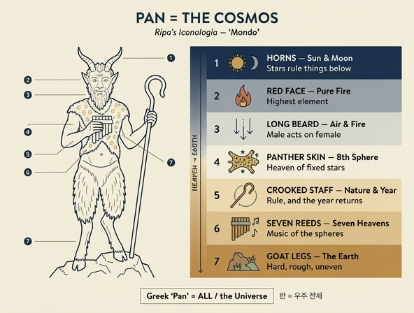

# 판(Pan) = 세계(Mondo): 도상 요소별 우주 상징

## 한 줄 요약

리파의 『이코놀로지아』에서 **"세계(Mondo)"는 판(Pan)의 모습으로 그려진다.** 그리스어 **Pan(πᾶν)이 곧 "전체·우주(l'Universo)"**를 뜻하기 때문이다. 따라서 판의 몸은 신화 속 목신이 아니라 **프톨레마이오스식 우주의 단면도**다. 머리(하늘)에서 발(대지)로 내려오면서 천체 → 불 → 공기 → 항성천 → 자연의 통치 → 천구의 음악 → 흙의 순서로 우주 구조가 읽힌다.

*Carlo Mariotti 그림 / Carlo Grandi 판각, 표제 "Mondo". 그림에서 실제로 확인되는 것: 이마 위로 하늘을 향해 솟은 두 뿔, 수염 난 염소 얼굴, 가슴과 어깨를 덮은 **얼룩무늬 짐승 가죽**, 오른손의 끝이 말려 굽은 **목자의 지팡이**, 왼손에 든 **여러 대의 갈대를 묶은 피리(시링크스)**, 허리 아래로 털이 덥수룩한 **염소 하반신과 갈라진 발굽**, 그리고 그가 딛고 선 **울퉁불퉁한 바위투성이 땅**이다.*

## 출처

원문(리파, 『이코놀로지아』 "MONDO" 항목, 아세트 파일 `07 The World and the Continents to Death.md` 첫머리)은 두 계보를 인용한다.

- **보카치오** 『이교 신들의 계보』 제1권 + **피에리오 발레리아노** 『히에로글리피카』: "염소 얼굴에 불붙은 듯 붉은 색, 이마에는 하늘을 바라보는 뿔, 가슴까지 늘어진 긴 수염, 옷 대신 표범 가죽이 가슴과 어깨를 감싸고, 한 손에는 끝이 목자 지팡이처럼 말린 막대, 다른 손에는 갈대 일곱 대로 만든 피리(fistola strumento di sette canne), 허리 아래는 털 많고 거친 염소의 모습."
- **실리우스 이탈리쿠스**의 시행: 짧은 꼬리를 흔들고, 소나무 관을 쓰고, 붉은 이마에서 짧은 뿔 두 개가 나오며, 염소처럼 길고 뻣뻣한 귀, 딱딱한 턱에서 가슴으로 흘러내리는 뻣뻣한 수염, 손에는 늘 목자의 막대, 옆구리는 겁 많은 사슴/표범의 **얼룩진 가죽**이 감싼다.

## 요소별 대응표

| 도상 요소 | 상징 | 원문 근거 |
|---|---|---|
| 하늘을 향한 두 뿔 | **해와 달** — 나아가 천체 전반과 그것이 지상 만물에 미치는 영향 | "per li corni … il Sole, e la Luna"; 보카치오는 하늘로 젖혀진 뿔이 "천체(corpi celesti)와 그것이 이 아래 세상에 미치는 효과"를 보인다고 함 |
| 붉게 달아오른 얼굴 | 다른 원소들 **위에 있는 순수한 불**, 천구(celesti sfere)와 맞닿는 경계 | "quel fuoco puro, che sta sopra gli altri elementi, in confine delle celesti sfere" |
| 가슴까지 내려온 긴 수염 | 위쪽 두 원소인 **공기와 불이 남성적 본성·힘**이며, 그 인상(작용)을 여성적 본성(아래쪽 원소인 물과 흙)에 내려보냄 | "i due elementi superiori, cioè l'aria, ed il fuoco, sono di natura e forza maschile, e mandano le loro impressioni di natura femminile" |
| 얼룩진 표범 가죽 | **여덟째 천구(ottava sfera)** — 온통 밝은 별로 뒤덮인 항성천. 동시에 사물의 본성에 속한 모든 것을 덮는 다양성 | "l'ottava sfera, tutta dipinta di chiarissime stelle"; 에우세비오스 『복음의 준비』 5권을 인용해 "천상 사물의 다양성" 때문에 표범(Pantera)의 얼룩 가죽을 취함 |
| 끝이 굽은 지팡이 | ① **자연의 통치** — 이성이 없는 것들까지 모두 다스려져 정해진 목적을 향하게 함 ② 굽어 **제 자신에게로 되돌아오는 한 해(l'Anno)**, 즉 순환하는 시간 | "La verga dimostri il governo della natura … si dimostra ancora per la verga ritorta l'Anno, il quale si ritorce in se stesso" |
| 갈대 일곱 대의 피리(시링크스) | **일곱 하늘(일곱 행성천)의 조화** — 이른바 천구의 음악 | 원문은 "판이 갈대를 밀랍으로 이어 붙이는 법을 처음 발견했다"(베르길리우스 『목가』 2)로 서술하고, 전통적 해석은 일곱 관 = 일곱 행성구의 하르모니아 |
| 허리 아래 염소 하반신(털·뻣뻣함) | **대지** — 단단하고 거칠며 온통 고르지 않고, 나무와 무수한 식물·풀로 덮인 땅 | "intendendosi perciò la terra, la qual è dura, aspra, e tutta disuguale, coperta di alberi, d'infinite piante, e di molt'erbe" |

## 왜 이 순서인가 — 위에서 아래로 읽는 우주

이 도상은 아리스토텔레스–프톨레마이오스 우주론을 **수직으로 세운 인체**에 옮겨 놓은 것이다.

1. **머리 위(뿔)** → 천체와 그 영향력(점성학적 작용)
2. **얼굴** → 달 아래 세계의 최상층인 순수한 불의 구역
3. **수염** → 상위 원소(불·공기)가 하위 원소(물·흙)로 내려가 작용을 새김 = 위에서 아래로의 인과
4. **몸통을 덮은 가죽** → 항성천(제8천)이 그 아래 모든 것을 감싸 덮음
5. **양손(지팡이·피리)** → 그 우주를 움직이는 **법칙**(자연의 통치·순환하는 해)과 **질서·비례**(천구의 음악)
6. **하반신** → 우주의 가장 낮고 거친 층, 대지

즉 **위쪽은 균질·질서·능동, 아래쪽은 거칠·불균질·수동**이라는 대비가 신체 상하로 그대로 옮겨져 있다. 판이 반신반수(半神半獸)인 이유도 여기 있다 — 우주 자체가 천상의 완전함과 지상의 조야함을 함께 지닌 하나의 몸이기 때문이다.

## 기억을 위한 장치

- **뿔–얼굴–수염**은 모두 "머리 부위" = **하늘 쪽 삼단**(천체 / 불 / 공기·불의 작용).
- **가죽**은 몸통을 감싼다 = 별들이 박힌 **껍질(제8천)**.
- **두 손에 든 것**은 도구 = 우주의 **운영 원리**(지팡이=통치와 순환, 피리=조화).
- **염소 다리**는 땅을 딛는다 = **대지**.
- 헷갈리기 쉬운 지점: 표범 가죽을 "야성"이 아니라 **별하늘**로, 굽은 지팡이를 "목축"이 아니라 **한 해의 순환**으로, 갈대 피리를 "목가적 음악"이 아니라 **일곱 행성구의 하르모니아**로 읽는 것이 리파식 독해다.

## 곁들여 알아두면 좋은 것

- 같은 "MONDO" 항목의 **두 번째 도상**은 완전히 다르다. 발을 굳게 딛고 여러 색의 긴 옷(=사원소와 거기서 생겨난 것들)을 입고 머리에 **황금 구체**(=하늘과 그 원운동, 황금은 창조주 건축가의 완전함)를 인 사람이다.
- 이집트인들은 세계를 **제 꼬리를 삼키는 뱀(우로보로스)**으로 그렸다고 원문은 덧붙인다. 비늘의 다양함 = 별, 무거움 = 땅, 미끄러움 = 물, 해마다 허물을 벗음 = 해마다 젊어지는 시간.
- 어원 놀이가 도상의 출발점이라는 점이 핵심이다. 스토아 학파 이래 그리스어 **Pan = "모든 것"**이라는 해석이 목신 판을 **우주의 알레고리**로 만들었고, 리파는 그 전통을 그대로 그림으로 굳혔다.

## 인포그래픽

