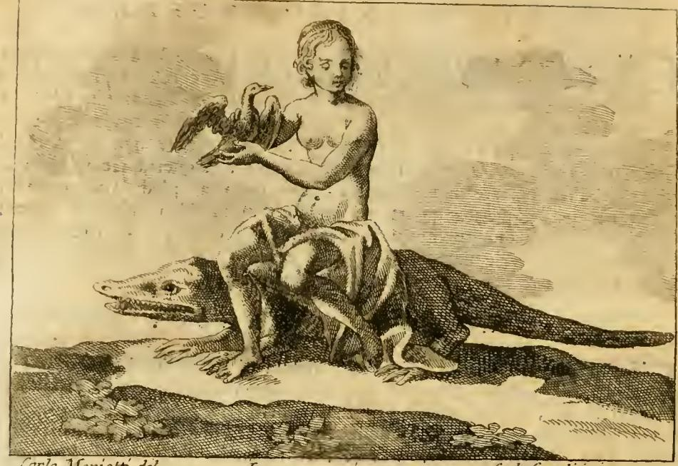

# 사치(Lusso) — 오를란디의 의인화

## 질문

오를란디는 '사치(Lusso)'를 어떻게 의인화했는가?

## 한눈에 보는 답

호화롭게 차려입은 **거인 남자**. 머리에 **왕관**, 관자놀이에 **날개**. **왼손의 풍요의 뿔**로 돈과 보석을 **낮고 초라한 오두막들** 위에 쏟아붓고, **오른손의 큰 망치**로 **웅장한 궁전들**을 부수고 있다. 발 앞에는 **꼬리를 활짝 편 공작**. 사치의 정의는 "옷·건축·연회·축제 등에서의 **과잉(superfluità)**".

*Cesare Ripa, 『Iconologia』 오를란디 증보판(Perugia, Costantini, 1764–67), 제4권 「LUSSO」 항목 도판. 도안 Carlo Spiridione Mariotti, 판각 Carlo Grandi — 판화 하단 좌우에 "Carlo Mariotti inv." / "Carlo Grandi sculp." 서명이 보인다.*

## 원문 (도상 규정)

> **UOmo pompofamente veſtito. Con corona reale in teſta, e le ali alle tempia. Sia di ſtatura giganteſca. Nella ſiniſtra mano abbia il corno di dovizia verſante denari, gioje ec. ſopra alcune baſſe, e rozze caſette. Colla deſtra ſoſtenga un grave maſtello, e ſtia in atto di gettare a terra alcuni magnifici Palazzi, che ſi vedranno rovinare. Avanti i piedi gli ſi ponga un Pavone colla coda ſpiegata.**
>
> 호화롭게 차려입은 남자. 머리에 왕관을 쓰고 관자놀이에 날개가 달렸다. 키는 거인 같아야 한다. 왼손에는 돈과 보석 등을 낮고 초라한 오두막들 위로 쏟아붓는 풍요의 뿔을 들고, 오른손으로는 무거운 망치를 받쳐 들어 몇몇 웅장한 궁전들을 땅에 내리쳐 무너지는 모습이 보이게 한다. 발 앞에는 꼬리를 활짝 편 공작을 놓는다.

정의도 원문에 명시되어 있다.

> **La propria, e vera definizione del Luſſo è: la ſuperfluità nel veſtire, fabbricare, banchettare, feſteggiare e ſimili.**
>
> 사치의 고유하고 참된 정의는 이것이다 — 옷 입기, 건축하기, 잔치하기, 축제 벌이기 및 그와 유사한 일에서의 **과잉(superfluità)**.

## 판화에서 실제로 관찰되는 것

fig-1을 보면 텍스트 규정이 그대로 옮겨져 있다.

- **18세기식 정장 남성**: 단추가 촘촘히 달린 긴 프록코트, 조끼, 반바지와 스타킹 — 리파 원본 판화의 고대풍 의상이 아니라 당대 유행하는 신사복이다. "pompoſamente veſtito(호화롭게 차려입은)"의 18세기적 번역이며, 사치가 먼 옛날 얘기가 아니라 지금 여기의 악덕이라는 신호다.
- **머리의 왕관과 관자놀이의 날개**: 왕관은 뾰족한 첨두형으로, 사치가 세상의 "주인·지배자·아니 폭군(Signore, Dominatore, ed anzi Tiranno)"이 되었음을 뜻한다. 날개는 머리 양옆에서 작게 솟아 있다.
- **오른손의 망치**: 높이 치켜든 손에 큰 망치가 들려 있고, 오른쪽으로 벽돌 건물의 코니스와 창틀이 이미 부서져 석재·목재 부재가 바닥에 흩어져 있다. 무너지는 궁전이 진행 중인 사건으로 그려졌다.
- **왼손에서 쏟아지는 재화**: 진주 목걸이·보석 사슬이 손에서 흘러내려, 왼쪽 아래의 낮고 조야한 상자 같은 구조물(초라한 오두막, "baſſe e rozze caſette")과 접시 위로 떨어진다. 판화에서는 뿔 형태가 코트에 겹쳐 다소 알아보기 어렵고 보석 줄기 자체가 강조되어 있다.
- **발 앞의 공작**: 꼬리를 완전히 펼친 공작이 남자의 오른쪽 다리 옆에 서 있다.
- **배경**: 왼쪽은 트인 풍경에 낮은 오두막과 작은 인물들, 오른쪽은 부서지는 대형 석조 건물 — 화면 좌우가 "낮은 것은 부유해지고 높은 것은 무너진다"는 대조를 이룬다.

## 각 지물의 의미 (원문의 자기 해석)

| 지물 | 원문 설명 | 뜻 |
|---|---|---|
| 거인 체구 + 왕가의 외모 | *in forma di Gigante, ed in apparenza reale* | 사치의 **비상한 힘(ſtraordinaria forza)**, 그리고 특히 오늘날 세상에서 자라나 **주인·지배자·폭군**이 되어버렸음 |
| 관자놀이의 날개 | *nato dalla capriccioſa Fantaſia degli Uomini* | 사치는 인간의 **변덕스러운 공상**에서 태어나 그 안에서만 존립하며, **규칙도 질서도 이성도 없이** 불어난다. 인간 사고의 **경박함(leggerezza)**을 날개로 그림자 지운 것 |
| 왼손의 풍요의 뿔 → 오두막 | 사치는 흔히 **평민·삯일꾼 계층의 행운** | 새 유행을 끊임없이 발명해 파는 장인·상인이 유행 애호가들의 돈을 받아 진흙탕에서 벗어나 단숨에 눈에 띄는 신분이 된다. 그러나 그들도 곧 제 처지를 잊고 자기가 만들어 팔던 그 과잉된 화려함에 빠져 **다시 넝마와 천함으로 되떨어진다**. 즉 부자는 가난해지고, 새 부자도 결국 몰락한다 |
| 오른손의 망치 → 궁전 | *il diſſipamento delle facoltà, l'eſtinzione delle migliori Famiglie, la rovina delle Città* | 재산의 탕진, **명문가의 절멸**, **도시의 파멸**. 실리우스 이탈리쿠스(『Punica』 15권) 인용: 신들의 분노도, 창칼도, 적군도, 몰래 스며든 **쾌락(voluptas)**이 영혼에 입히는 해악만큼은 못하다 |
| 꼬리 편 공작 | 피에리오 발레리아노 『Hieroglyphica』 24권 | 이 자세의 공작은 **낭비하는 자(Prodigo)와 허영꾼(Vanaglorioſo)**의 상형문자다. 다른 새의 꼬리는 비행 방향타나 운동 보조에 쓰이는데, 공작의 꼬리만은 그토록 크고 그토록 스스로에게 낭비적이며 **오직 색을 과시하기 위해서만** 주어졌다 |

## 짚어둘 세 가지

### 1) 이 항목은 리파가 아니라 오를란디의 것이다

원문에서 항목 표제 아래 저자가 **"Dell'Abate Cesare Orlandi(체사레 오를란디 신부의 것)"**로 명기되어 있다. 바로 다음 항목 「LUSSURIA」가 **"Di Cesare Ripa"**로 표시되는 것과 대비된다. 오를란디(1734–1779, 페루자)는 리파의 『Iconologia』를 페루자 코스탄티니 판(1764–67, 5권)으로 증보하며 자기 항목을 대거 추가한 편집자다. 즉 '사치'는 **리파 원본(1593/1603)에 없던 18세기 계몽기의 논쟁 주제**가 도상학 사전에 새로 들어온 사례다.

그 흔적이 항목 서술 자체에 남아 있다. 오를란디는 도상 설명("Vengiamo ora alla ſpiegazione della Figura")에 들어가기 **전에** 사치의 경제적 효용을 둘러싼 당대 논쟁을 길게 정리한다.

- **몽테스키외**: 『법의 정신』과 『페르시아인의 편지』(106편)를 근거로 사치 옹호 진영에 세운다 — 군주는 강력해지려면 신민이 향락 속에 살게 해야 하고, 생필품을 마련해주는 것과 **같은 주의로** 온갖 과잉을 마련해주어야 한다. 『법의 정신』 7권 4장(아우구스투스가 원로원의 여성 사치 규제 요구를 재치 있게 비웃은 일, 디오 카시우스 54권), 5권(티베리우스가 사치금지법 부활에 반대해 원로원에 보낸 편지, 타키투스 『연대기』), 20권 4장(군주국의 상업은 사치에 기초한다)도 인용된다.
- **볼테르**: 사치금지법은 정부의 시야가 좁고 관료가 산업을 진흥하기보다 금지하기를 쉬워한다는 증거일 뿐이라 했다(『풍속론』 100장). 시 작품에서는 사치가 **작은 국가는 망칠 수 있으나 큰 국가는 부유하게 한다**며 잉글랜드와 프랑스를 예로 든다.
- **오를란디의 반박**: 군주를 "제 신민을 파산시키는 자"로 만드는 논리는 이성에서 벗어났고, "신민을 무(無)로 만드는 주의"와 "생필품을 마련해주는 주의"가 어떻게 양립하냐고 반문한다. 핵심 반론은 **개념 혼동 지적**이다 — 옹호론자들은 **웅장함(magnificenza)·적정함(proprietà)·품격(decoro)·좋은 취향(buon gusto)**을 사치와 구별하지 않는다. 연수입 2만 스쿠도인 사람이 1만 5천을 쓰면 '웅장함'이지만, 1만인 사람이 그를 흉내내려 하면 그것은 웅장함이 아니라 **낭비·오만·광기**다. 사치는 곧 **superfluità**이며, 어느 쪽에서 보아도 언제나 악하고 규탄받아야 할 것이다.
- **달랑베르** 인용으로 마무리한다: 사치에 관한 도덕법은 상대적 필요에 관한 법보다 더 엄격해야 하며, "**사회의 단 한 구성원이라도 궁핍하고 그 궁핍이 알려져 있는 한, 사치는 인류에 대한 범죄다**". 그리고 "**사치는 공화국들의 독이며 폭군들의 전제(專制)의 도구다**"(『철학 원론』).

### 2) '여인'이 아니라 '거인 남성'이다 — 리파 관습의 이탈

리파의 의인화는 압도적으로 **여성 인물(Donna)**이다. 바로 뒤의 「Lussuria」도 "Una Giovane(젊은 여자)"로 시작한다. 그런데 「Lusso」는 "UOmo(남자)"이며, 게다가 **거인 체구**에 **왕관을 쓴 폭군**이다. 이는 사치를 개인의 도덕적 결함(부덕)이 아니라 **국가·사회를 짓밟는 정치적 세력**으로 규정한 데서 나온 선택이다. 원문의 "Signore, Dominatore, ed anzi Tiranno"와 달랑베르의 "폭군의 전제의 도구"가 정확히 왕관 쓴 거인 남성의 형상으로 번역된 것이다.

다만 오를란디의 서술에 리파식 여성혐오적 상투구가 남아 있는 것도 사실이다. 그는 피에리오를 따라 공작과 여성의 "놀라운 본성적 일치"를 말한 뒤, 귀부인은 공주처럼, 시민 여성은 귀부인처럼, 장인의 아내는 시민 여성처럼 보이려 하고 걸인 여성조차 제 신분의 한계를 넘는다고 쓰고, 로렌초 리피의 『Malmantile racquistato』(8곡 30연)를 인용한다 — "여자는 거만하고 허영에 차서 늘 과시를 생각하고 헛것을 꿈꾼다 / 얼굴이 마귀할멈 같아도 화려하고 부유하게 남들이 봐주기를 원한다". 즉 **의인화 인물은 남성이지만 도덕적 비난의 화살은 여성에게 돌리는** 이중 구조다.

### 3) Lusso(사치)와 Lussuria(음욕)는 별개 항목이다

두 낱말은 라틴어 *luxus*(과도·방종) / *luxuria*(무성함·방종)에서 갈라져 **어원이 얽혀** 있고, 실제로 오를란디의 Lusso 항목 끝 「FATTO FAVOLOSO」에서 프시케의 이야기를 쓰며 쿠피도의 "**luſſureggiante** genio(음탕한 성향)"라는 표현을 쓴다. 그러나 이 책에서 두 항목은 명확히 구분된다.

| | Lusso (사치) | Lussuria (음욕) |
|---|---|---|
| 저자 | **체사레 오를란디** | **체사레 리파** |
| 인물 | 호화롭게 차려입은 **거인 남자** | 거의 나체인 **젊은 여자** |
| 정의 | 옷·건축·연회·축제 등에서의 **과잉(superfluità)** | 법·자연의 준수도 질서·성별의 존중도 없는, **불타는 무절제한 육욕의 욕구** |
| 지물 | 왕관, 관자놀이 날개, 풍요의 뿔, 망치 | 곱슬거리게 꾸민 머리, 여러 색 천, **악어**에 앉아 **자고새**를 어루만짐 |
| 성격 | 경제적·정치적 악덕 (국가·가문·도시의 파멸) | 육체적·영혼의 악덕 (지옥의 길, 악행의 학교) |

*바로 뒤 항목 「LUSSURIA」("Di Cesare Ripa") 도판. 같은 책 같은 판화가들의 작업이지만 인물의 성별·복식·상징 동물이 완전히 다르다 — 악어는 이집트인들이 음욕의 표지로 삼았고(다산하며, 피에리오 발레리아노 25권에 따르면 그 오른쪽 턱뼈의 이가 팔에 매이면 음욕을 자극한다고 믿어졌다), 나체는 음욕이 영혼의 재화(덕·명예·기쁨·자유)와 육체의 재화(미·힘·민첩·건강), 나아가 운수의 재화(돈·보석·재산·가축)까지 흩어 없앤다는 뜻이다.*

## 항목 끝의 세 가지 예화(Fatti)

오를란디 증보판의 특징은 각 항목에 성경·역사·신화의 실례를 붙이는 것이다. Lusso에도 세 편이 있다.

- **FATTO STORICO SAGRO (성스러운 역사)**: **탕자의 비유**(루카 15장). 유산을 받아 잔치와 방탕에 흩어버린 뒤, 목숨을 잇기 위해 부정한 동물의 사육꾼이 되고 몇 알의 도토리가 가장 값진 음식이 되었다.
- **FATTO STORICO PROFANO (세속의 역사)**: **율리우스 카이사르**. 종신 독재관이 되기 전부터 사치에 극도로 탐닉했다. 빚더미였는데도 별장에 궁을 기초부터 지어 완성해놓고 마음에 온전히 차지 않는다는 이유로 큰 비용을 무시하고 **허물어버렸다**. 전쟁 중 야영지에서는 천막 안 발밑에 깔 **모자이크 바닥**을 짐승·새 등의 형상이 나오게 잔돌로 짜맞춘 것을 곳곳으로 실어 다니게 했다(수에토니우스 『카이사르의 생애』 45장).
- **FATTO FAVOLOSO (신화)**: **프시케**. 비상한 미모를 지녔으나 온갖 화려함과 향락에 극도로 탐닉한 젊은 공주. 쿠피도가 그녀를 사랑해 제피로스에게 시켜 아주 아름다운 곳으로 데려가게 하고, 그녀는 오래도록 그 신을 알아보지 못한 채 함께 지냈다. 마침내 정체를 알아내고 참모습을 보여달라 간청하자 쿠피도는 응하지 않고 사라졌다. 그녀의 오만한 허영을 늘 못마땅히 여겨 박해해온 베누스가 그녀를 죽게 했으나 유피테르가 쿠피도의 청으로 되살려 불사로 만들었다. **허영 때문에 그녀 주위를 나는 나비**와 함께 표현되며, 고대인들은 그녀를 향락(Voluttà)의 여신으로 여겼다(아풀레이우스 『황금 당나귀』).

## 암기 요령

**"왕관 쓴 거인이 한 손으로는 뿌리고 한 손으로는 때려부순다"** — 좌/우가 정확히 반대 방향으로 작동한다.

- **왼손 = 뿌리기**: 풍요의 뿔 → 돈·보석 → **낮은 오두막** (아래를 벼락부자로 만든다)
- **오른손 = 부수기**: 망치 → **웅장한 궁전** (위를 무너뜨린다)
- **머리 = 왕관 + 날개**: 폭군의 지배력 + 변덕스러운 공상·경박함
- **발 = 꼬리 편 공작**: 낭비와 허영, 오직 과시만을 위한 꼬리
- **정의 = superfluità**: 옷·건축·연회·축제 — **네 가지 영역의 과잉**

## 출처

- 원문: `.fm/assets/02 Letters to Lust.md` 「LUSSO」 항목 (Cesare Ripa, 『Iconologia』, 오를란디 증보판 제4권)
- 판화: `_page_58_Picture_3.jpeg`(Lusso), `_page_65_Picture_3.jpeg`(Lussuria)
- 판본 정보: [Wannenes Art Auctions — Ripa/Orlandi, Perugia: Costantini, 1764–67](https://wannenesgroup.com/lots/616-1860-ripa-cesare-1555-1622-iconologia-notabilmente-accresciuta-dimmagini-di-annotazioni-e-di-fatti-dallabate-cesare-orlandi-perugia-costantini-1764-67/), [Cesare Orlandi (Wikipedia)](https://en.wikipedia.org/wiki/Cesare_Orlandi), [Iconologia di Cesare Ripa — 판본 데이터베이스](https://limes.cfs.unipi.it/allegorieripa/)
