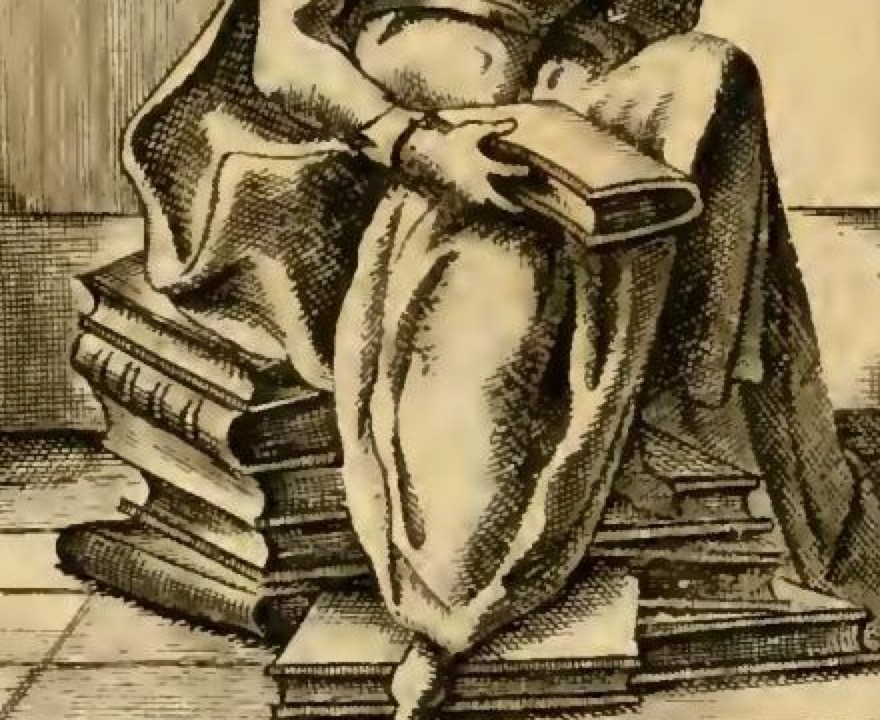

# '명상(Meditazione)' — 책 더미와 반쯤 덮인 책

**질문**: '명상' 도상에서 책 더미와 반쯤 덮인 책은 무엇을 뜻하는가?

**답**: 깔고 앉은 책 더미는 진리 탐구의 첫 원리들이 담긴 글에 기초한 꾸준한 작업을 뜻한다. 손가락을 끼운 반쯤 덮인 책은 읽은 지식 위에 성찰을 더해 좋고 완전한 견해를 굳히는 행위를 나타낸다.

---

## 1. 판화에서 실제로 보이는 것

확대 부분에서 확인되는 요소를 순서대로 보자.

- **엉덩이 아래**: 두툼한 2절판(folio) 책들이 책등이 아니라 **책배(fore-edge)를 앞으로 향한 채** 겹겹이 쌓여 있고, 그 위에 그대로 앉아 있다. 옆·앞으로 흘러내린 책 한두 권은 **발판**이 되어 맨발을 받치고 있다. 즉 책이 *펼쳐진 상태가 아니라 닫힌 채 가구처럼* 쓰이고 있다.
- **오른쪽 무릎 위**: 손에 들린 책은 **완전히 닫히지도, 완전히 펼쳐지지도 않았다.** 책배 쪽이 갈라져 벌어져 있고 그 틈으로 **손가락이 들어가 있다.** 책은 무릎에 얹혀 있을 뿐 눈은 그 책을 보고 있지 않다.
- **얼굴**: 시선은 책이 아니라 아래·안쪽으로 떨어져 있고, 왼손이 뺨을 받치고 있다(원문 "in atto di stare pensosa" = 생각에 잠긴 자세).

이 세 요소가 하나의 문장을 만든다: **읽은 것들 위에 앉아, 지금 읽던 책에서 눈을 떼고, 생각하는 중.**

## 2. 원문이 붙여 놓은 뜻

Ripa는 소지물마다 해설을 붙인다. 두 문장이 이 카드의 근거다.

> **Lo stare sedendo sopra i libri** ne può dinotare l'assiduità della sua propria operazione **fondata nelle scritture, le quali contengono i primi principi naturali**, colli quali principalmente si procede alla investigazione del vero.
>
> (책들 위에 앉아 있음은, **자연적 제1원리들을 담고 있는 글**에 **기초한** 자기 작업의 **항구성(assiduità)**을 나타낸다. 진리 탐구는 주로 그 원리들로부터 진행된다.)

> **Il tener il libro socchiuso** è per accennare, ch'ella fa le riflessioni sopra la cognizione delle cose, **per fermar le opinioni buone, e perfette**, dalle quali vien onore, e ancora bene.
>
> (**반쯤 덮은 책**을 들고 있음은, 사물에 대한 인식 위에 성찰을 행하여 **좋고 완전한 견해를 확정(fermare)하기** 위함을 가리킨다. 거기에서 명예와 선이 나온다.)

번역어 두 개를 눌러둘 만하다.

- **assiduità** = 지속·근면. 한 번의 통찰이 아니라 **끊이지 않는 작업**. 그래서 책은 '많이' 쌓여 있어야 한다.
- **fermare** = 멈추게 하다 / **고정하다**. 의견을 '가지는' 것이 아니라 흔들리던 의견을 **못 박아 굳히는** 동작이다. 명상의 산출물은 지식이 아니라 **확정된 판단**이다.

## 3. 핵심: 두 소지물은 하나의 대비쌍이다

두 물건은 따로 읽으면 둘 다 '책'일 뿐이지만, **위치가 다르다**는 점이 전부다.

|  | 깔고 앉은 책 더미 | 무릎 위 반쯤 덮인 책 |
|---|---|---|
| 상태 | 닫혀 있음, 쌓여 있음 | 닫히는 중, 손가락이 끼워짐 |
| 신체와의 관계 | **밑에 있다** (받쳐 준다) | **위에 있다** (다뤄지는 중) |
| 시간 | 과거 — 이미 다 읽은 것 | 현재 — 지금 진행 중 |
| 단계 | 축적된 **lectio**(읽기) | 벌어지고 있는 **meditatio**(되새김) |
| 기능 | 발판·기반·재료 | 작업 대상 |

수도원 독서 전통(*lectio divina*: lectio → meditatio → oratio → contemplatio)에서 **meditatio는 새 텍스트를 더 읽는 단계가 아니라, 읽은 것을 반복해 되새기는 단계**다. Ripa는 그 두 단계를 '책의 위치'로 갈라놓았다. 읽기가 **밑으로 내려가 앉을 자리가 되었을 때** 비로소 그 위에서 명상이 일어난다. 다 읽은 책은 더 이상 읽히지 않고 **높이를 주는 물건**이 된다.

Ripa 자신이 같은 항목 안에서 이 되새김을 다시 그린다. 바로 뒤 「죽음의 명상(Meditazione della Morte)」에서는 발치에 **풀을 입에 물고 되새김질하는(in segno di ruminare) 양**을 둔다. *ruminatio* = 명상의 고전적 은유이며, 반쯤 덮인 책은 그 되새김의 '책 버전'이다.

## 4. 왜 하필 '손가락을 끼운' 상태인가

이것이 이 도상에서 가장 정교한 부분이다. 화가가 선택할 수 있었던 상태는 셋이다.

1. **활짝 펼친 책** → 지금 *읽고 있다*. 그러면 이 인물은 명상이 아니라 「연구(Studio)」나 「학문」이 된다.
2. **완전히 덮인 책** → 다 끝났거나 아직 시작하지 않았다. 명상 중이라는 증거가 사라진다.
3. **손가락을 끼운 반쯤 덮인 책(libro socchiuso)** → **읽기를 멈췄지만 자리를 잃지 않았다.**

3번만이 "텍스트에서 눈을 뗐으나 텍스트를 떠나지는 않은" 중간 상태를 그릴 수 있다. 손가락은 **책갈피이자 시계**다.

- 책으로 **돌아갈 것**임을 보증한다(포기가 아니다).
- 동시에 **지금은 책 밖에 있다**는 것을 보증한다(단순 독서가 아니다).
- 그리고 이 멈춤이 **오래 지속되지 않는다**는 것까지 함축한다 — 손가락으로 낀 페이지는 원래 잠깐만 유지되는 자세다. 명상은 읽기의 흐름 안에 난 짧고 반복되는 틈이다.

여기에 뺨을 받친 왼손과 떨어진 시선이 붙으면 방향이 완성된다. **정보는 책에서 왔고, 지금 작업은 머릿속에서 벌어진다.** Ripa는 이 손동작을 두고 "생각의 무게(la gravità de' pensieri)"가 마음을 점령한 상태라고 설명하며, "우연이 아니라 완전하게 행하기 위해(per operare perfettamente, e non a caso)"라는 목적을 붙인다.

## 5. '첫 원리(primi principi)'가 왜 등장하는가

'책 위에 앉음 = 부지런함'만이라면 굳이 제1원리를 꺼낼 필요가 없다. Ripa가 이 말을 넣은 것은 **스콜라 인식론의 표준 구도**를 압축해 넣기 위해서다.

- 아리스토텔레스 『분석론 후서』 이후, **논증적 지식(scientia)은 그 자체로는 증명될 수 없는 자명한 제1원리에서 출발**한다. 그러지 않으면 근거의 무한 후퇴에 빠진다.
- 이 원리들은 추론으로 얻는 것이 아니라 지성이 곧바로 파악한다(*intellectus principiorum*, *habitus primorum principiorum*). 모순율, "전체는 부분보다 크다" 같은 것들이 예로 꼽힌다.
- **'자연적(naturali)'**이라는 수식어는 계시가 아니라 **자연적 이성의 빛**으로 알려지는 원리라는 뜻이다. 그래서 이 인물은 「영적 명상(Meditazione Spirituale)」과 구별된다. 그쪽은 무릎을 꿇고 눈을 감고 베일에 완전히 덮여 있으며, 책이 **없다**. 눈을 감음이 곧 가시적인 것으로부터의 이탈이기 때문이다.

즉 책 더미는 '내가 읽은 책이 많다'는 자랑이 아니라, **추론이 딛고 설 출발점들의 저장고**다. 앉는 자리가 곧 논증의 토대라는 시각적 농담이기도 하다. Ripa의 논리 순서를 그대로 옮기면:

> 글이 제1원리를 담는다 → 그 원리에서 진리 탐구가 출발한다 → 그 출발점 위에서 꾸준히(assiduità) 작업한다 → 그것이 '책 위에 앉음'이다.

## 6. 결론: 이 도상은 '독서'가 아니라 '독서 위에 세운 판단'이다

핵심 논지를 한 줄로 정리하면 이렇다.

**Ripa는 명상을 '많이 읽는 사람'이 아니라 '읽은 것을 자기 판단으로 굳히는 사람'으로 정의했고, 그 차이를 책의 개수가 아니라 책의 위치와 개폐 상태로 표현했다.**

- 아래(닫힌 다수) = 재료. 이미 몸의 일부가 되어 더 이상 보지 않아도 되는 것.
- 위(반쯤 닫힌 하나) = 작업. 아직 결론이 나지 않아 손가락을 빼지 못한 것.
- 그 사이에서 일어나는 일 = 성찰(*riflessioni*)이며, 산출물은 **fermate 된, 좋고 완전한 견해**다.

Ripa가 인용한 에피그램이 이 결론을 다시 확인해 준다.

> Felix, qui vitae curas exutus inanes, / **Exercet meditans nobile mentis opus.**
>
> (삶의 헛된 근심을 벗고, **명상하며 정신의 고귀한 일을 수행하는** 자는 행복하다.)

명상은 수동적 휴식이 아니라 *opus* — **수행되는 노동**이다. 그래서 이 인물은 잠들지 않고, 책을 놓지도 않는다.

---

### 한 줄 암기 장치

> **엉덩이 밑 = 다 읽은 것(기반), 무릎 위 손가락 = 지금 되새기는 것(작업).** 손가락은 "책으로 돌아갈 테지만 지금은 책 밖에서 생각 중"이라는 표시.
