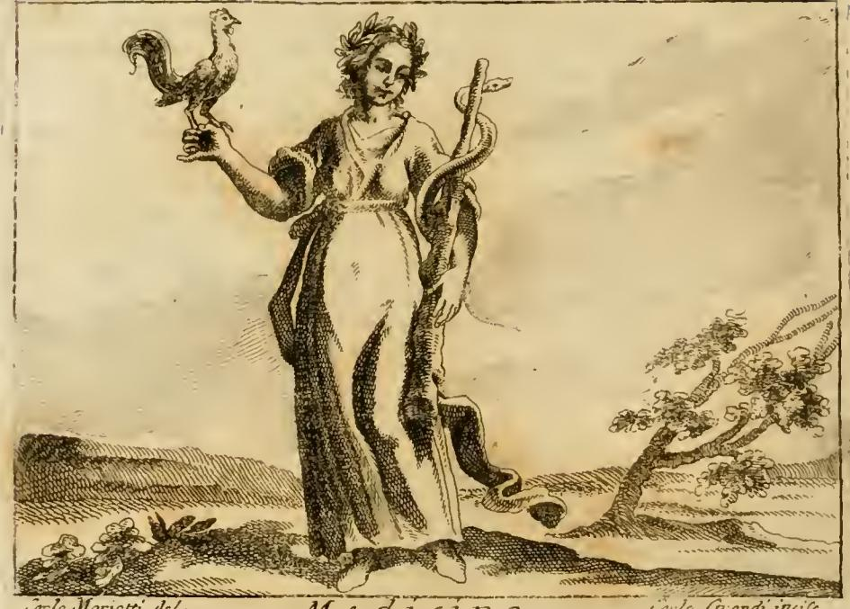

# 두 번째 '의학(Medicina)' 도상 — 시빌라 복장의 여인

> **Q.** 두 번째 '의학' 도상(시빌라 복장)의 요소들은 무엇을 뜻하는가?
>
> **A.** 초록 옷은 환자에게 주는 희망과 생명의 활력을, 계단을 내려가는 자세는 고귀한 관조에서 구체적 치료 행위로 내려감을 뜻한다. 오레가노 가지를 문 황새는 그 풀로 제 위장을 다스리는 새로 이집트인의 의학 상형문자였고, 태양은 심장의 자연적 힘을 돕고 약초에 효능을 불어넣는 존재다.

출처: `04 Mechanics to the Month in General.md` 의 `### Medicina.` 항목 (리파 『이코놀로지아』 토모 콰르토, 87쪽 부근). 같은 표제어 아래 **두 개의 도상**이 연달아 실려 있어 혼동하기 쉬우므로, 아래 1절에서 먼저 둘을 갈라놓는다.

---

## 1. 먼저: 첫 번째 도상과 헷갈리지 않기

리파는 'Medicina' 표제어에 서로 다른 두 인물상을 싣는다. **판화로 그려진 것은 첫 번째 도상뿐**이고, 시빌라 복장의 두 번째 도상은 텍스트로만 존재한다(2절 참고).



*리파 『이코놀로지아』 토모 콰르토, 93쪽 판화. 하단 서명은 `Carlo Marietti del. / Carlo Grandi incise`.*

그림에서 실제로 확인되는 것: 발까지 늘어지는 옷을 입고 정면을 향해 선 여인, **머리에 두른 잎사귀 관(월계관)**, 오른손을 들어 손바닥 위에 **수탉**을 올려 세웠고, 왼손으로는 몸 높이만큼 긴 **울퉁불퉁한 옹이 지팡이**를 세워 짚었으며 그 지팡이를 **뱀**이 나선으로 감아올라 머리를 어깨 높이까지 치켜들고 있다. 오른쪽 배경에는 옆으로 휘어 자란 나무(월계수로 읽힌다), 왼쪽 땅바닥에는 약초 몇 포기가 깔려 있다.

> 참고로 리파 본문은 첫 도상을 "**Donna attempata**"(나이 든 여인)라고 규정하는데, 판화의 얼굴은 그리 늙어 보이지 않는다. 리파의 *글*과 판각공의 *그림*이 어긋나는 흔한 경우이므로, 판화만 보고 도상 규정을 판단하지 말 것.

### 두 도상 대조표

| | **첫 번째 도상** (fig-1, 93쪽 판화) | **두 번째 도상** (시빌라 복장, 카드의 대상) |
|---|---|---|
| 의학의 규정 | **"Medicina è scienza"** — 의학은 **학문(scienza)** | **"E' arte la Medicina"** — 의학은 **기술(arte)** |
| 지식의 출처 | 신체의 생명·영양 작용을 넣고 빼내며 아는 지식 | **남의 병을 겪어 본 경험(sperienza)**에서 태어나 자연물에 관한 학문의 도움을 받음 |
| 나이·복장 | 나이 든 여인 / 복장 지정 없음 | 나이 지정 없음 / **초록색, 시빌라 풍** |
| 자세 | 정면으로 서 있음 | **계단 한 칸을 내려서는 동작** |
| 손에 든 것 | 오른손에 **수탉**, 왼손에 **뱀 감긴 옹이 지팡이** | 양손에 **약초 원재료(semplici medicinali)** |
| 곁에 둔 것 | (없음) | **태양**, **오레가노 가지를 문 황새** |
| 핵심 뜻 | 경계심(수탉·뱀) · 치유와 갱신(탈피) · 아폴론 계보(월계수) · 의학의 **어려움**(옹이) | 관조→행위의 하강 · 희망(초록) · 자연의 자기치료 모범(황새) · 천체가 주는 효능(태양) |

**한 줄 요약** — 첫 도상은 의학을 *아는 것*(scienza)으로, 둘째 도상은 의학을 *하는 것*(arte)으로 그린다. 카드가 묻는 요소들은 모두 이 '실행'이라는 축에 걸려 있다.

---

## 2. 두 번째 도상: 리파 원문의 규정

원문(구식 철자 정규화):

> **Donna, che stia in atto di scendere un grado di scala. Sarà vestita di verde, a foggia di Sibilla. Porterà nelle mani alcuni semplici medicinali. Avrà appresso un Sole, ed una Cicogna, la quale tenga in bocca un ramo di origano.**
>
> 계단 한 칸을 내려서는 동작을 취한 여인. 초록색으로, 시빌라 풍으로 옷을 입힐 것. 손에는 약초 원재료 몇 가지를 들 것. 곁에는 태양 하나와, 부리에 오레가노 가지를 문 황새 한 마리를 둘 것.

⚠️ **판화 없음.** 이 판본에서 두 번째 도상에 해당하는 도판은 실리지 않았다. 해당 항목 뒤에 붙은 이미지(`_page_95_Picture_6.jpeg`)는 **의학 도상이 아니라 장식 꼬리그림(tailpiece)** — 아라베스크 덩굴에 얹힌 좌우대칭 인어형 인물 둘과 가운데 가면 머리로 이루어진 무의미한 장식 컷이며, 그 아래 "MEDIO-"라는 캐치워드가 다음 항목 *Mediocrità*를 예고한다. 앞뒤 페이지의 `_page_92_Picture_6`(단지 모양 장식), `_page_96_Picture_7`(장식) 역시 같은 성격의 장식 컷이다. 따라서 이 카드는 **텍스트만으로 상을 재구성**해야 하고, 위 fig-1은 어디까지나 *대조용 첫 도상*이다.

---

## 3. 요소별 풀이 — 리파의 전거 (원문 근거)

각 항목은 리파가 직접 붙인 설명이다.

### (1) 계단을 내려서는 동작 — 관조에서 행위로

> **"Si fa che scende lo scalino, perché dalla contemplazione, che è cosa molto nobile, e molto alta, scende all'azione della cura, per mezzo di cose particolari."**
> 계단을 내려서게 만든 것은, 매우 고귀하고 매우 높은 것인 **관조(contemplazione)**로부터 **개별적인 것들을 매개로 치료의 행위(azione della cura)**로 내려오기 때문이다.

핵심은 "per mezzo di cose particolari"(개별적인 것들을 통해)다. 관조는 **보편**을 다루고, 치료는 언제나 **이 환자, 이 약초, 이 증상**이라는 개별을 다룬다. 즉 이 자세는 단순한 겸손의 표현이 아니라, 의학이 **보편 지식 → 개별 적용**으로 이행하는 학문이라는 규정이다. '내려간다'는 방향에 위계가 그대로 남아 있다는 점이 중요하다 — 리파는 관조가 *더 높다*고 명시하면서도, 의학의 정체성은 그 높은 자리에 머무는 데 있지 않고 **내려서는 그 동작**에 있다고 본다. 한 칸(un grado)만 내려서는 것도 의도적이다. 관조를 버리고 떠나는 게 아니라, 발 하나를 아래 칸에 얹은 중간 상태다.

### (2) 초록 옷 — 희망과 되살아나는 활력

> **"E' vestita di verde, per la speranza che porta seco agl'Infermi, e pel vigore che rende alla vita, che andava mancando."**
> 초록으로 입힌 것은 **병자들에게 가져다 주는 희망** 때문이며, 또한 **꺼져 가던 생명에 되돌려 주는 활력** 때문이다.

두 겹의 뜻이 겹쳐 있다. ① **희망** — 리파 색채 어휘에서 초록은 곧 희망이며, 그의 『희망(Speranza)』 항목 자체가 초록 옷을 입는다. 이 관례는 초록이 봄과 새싹의 색, 즉 '아직 오지 않은 결실을 약속하는 색'이라는 데서 온다. ② **활력** — 시들어 가던 초목이 다시 푸르러지는 이미지가 회복기 환자에게 겹쳐진다. 주의할 점은 초록이 *의사의* 자질이 아니라 **환자에게 발생하는 효과**를 가리킨다는 것이다. 리파는 "agl'Infermi"(병자들에게)라고 수혜자를 명시한다.

### (3) 오레가노 가지를 문 황새 — 이집트인의 의학 상형문자

> **"Coll'origano la Cicogna ajuta la debolezza del proprio stomaco, e però fu dagli Egizj adoperata nel modo detto, per geroglifico di Medicina."**
> 황새는 **오레가노로 제 위장의 허약함을 돕는다**. 그래서 이집트인들이 앞서 말한 방식으로 **의학의 상형문자(geroglifico di Medicina)**로 썼다.

리파는 곧바로 같은 계열의 사례 셋을 덧붙인다:

> **"A questo proposito usarono ancora l'uccello Ibi, il quale col rostro da se stesso si purga il ventre; come il Cervo, il quale dopo che ha ucciso il Camaleonte, smorza il veleno masticando le frondi dell'alloro, il che fa ancora la Colomba, per risanarsi nell'infermità."**
> 같은 취지로 **이비스(따오기)**도 썼는데, 이 새는 부리로 스스로 창자를 씻어낸다. **수사슴**은 카멜레온을 죽인 뒤 **월계수 잎**을 씹어 독을 가라앉히고, **비둘기**도 병에서 낫기 위해 같은 일을 한다.

여기서 논리를 놓치지 말 것. 황새가 의학의 기호가 되는 이유는 "약초를 안다"가 아니라 **"제 몸의 병을 스스로 알아보고 알맞은 약을 고른다"**는 데 있다. 즉 이 새들은 *환자이자 동시에 의사*다. 리파가 드는 네 사례(황새-오레가노, 이비스-부리, 수사슴-월계수, 비둘기)는 모두 **자연이 인간에게 먼저 보여 준 치료법**이라는 하나의 논지를 위한 것이다. 이는 앞서 "의학은 **경험에서 태어난 기술**"이라고 한 규정과 정확히 맞물린다 — 의술은 이론에서 연역된 게 아니라 관찰에서 습득된 것이다.

> 💡 **월계수의 이중 등장**: 첫 도상에서는 의사가 머리에 쓰는 **월계관**으로, 둘째 도상 설명에서는 사슴이 씹는 **해독약**으로 나온다. 리파에게 월계수는 아폴론의 나무(첫 도상: 아폴론은 "Inventum medicina meum est", 의학은 내 발명이라고 오비디우스 『변신』 1권에서 말한다)이면서 실제 약재이기도 하다.

### (4) 태양 — 심장의 열을 돕고 약초에 효능을 붓는다

> **"Il Sole mostra, che la virtù naturale del cuore è favorita dal calor di esso Sole, pel quale si mantiene, e conserva la sanità in tutte le membra del corpo, ed oltre a ciò molte virtù, e proprietà all'erbe infonde, per mezzo delle quali la Medicina si esercita."**
> 태양은 이를 보여 준다: **심장의 자연적 힘(virtù naturale del cuore)은 바로 그 태양의 열이 돕는 것**이며, 그 열로써 신체 모든 부위의 건강이 유지·보존된다. 나아가 태양은 **약초들에 많은 효능과 속성을 불어넣으니(infonde)**, 의학은 그것들을 매개로 행해진다.

태양이 **두 가지 일**을 한다는 점이 이 요소의 핵심이다.
- **몸 쪽으로**: 심장의 타고난 열을 북돋아 온몸의 건강을 지탱한다.
- **약재 쪽으로**: 약초에 치료 효능을 부어 넣는다.

그래서 태양은 (2)의 손에 든 **약초 원재료(semplici)**와 직접 연결된다. 손의 약초가 '왜 듣는가'에 대한 답이 곁의 태양인 것이다. 의사·환자·약재가 모두 하나의 태양 아래 놓이는 구조다.

### (5) 손에 든 약초 원재료 — 카드에 빠진 다섯 번째 요소

카드의 답에는 없지만 리파 원문은 "**Porterà nelle mani alcuni semplici medicinali**"(손에 약초 원재료 몇 가지를 들 것)를 명시한다. `semplice`는 **단일 약재**, 즉 조제 이전의 순수한 약초 하나하나를 가리키는 전문 용어다(복합 처방 `composto`의 반대). 같은 항목의 「우화적 사실(Fatto Favoloso)」에서 아스클레피오스가 "정원에서 평생을 보내며 **semplici에 대한 완전한 지식을 얻었다**"고 서술되는 것과 정확히 같은 단어다. 요소들 사이의 배선은 이렇게 정리된다:

```
관조 (높은 칸)
   │  계단을 한 칸 내려선다
   ▼
치료 행위 ── 손의 semplici(개별 약재) ◄── 태양이 효능을 부어 넣음
                     ▲                        │
                     │                        └─▶ 심장의 자연 열을 도움
              황새·이비스·사슴·비둘기
              (자연이 먼저 보여 준 용법)
                     
초록 옷 ──▶ 환자에게: 희망 + 되살아나는 활력
```

---

## 4. 추가 배경 (리파 원문에 없는 보충)

여기서부터는 리파가 직접 쓰지 않은 맥락이다. 시험 답안에 전거로 쓰지 말고 이해용으로만 볼 것.

### '시빌라 복장(a foggia di Sibilla)'이란

- 먼저 **표기 확인**: 이 판본 원문은 `a foggia di Sibilla`("시빌라 풍으로")다. 리파 판본에 따라 `in habito di Sibilla`로도 나타나므로, 인용할 때는 사용 중인 판본의 표기를 따를 것. 뜻은 같다.
- 시빌라(무녀)의 회화적 관습 복장은 **바닥까지 흐르는 넉넉한 통옷, 머리를 감싼 두건·터번 혹은 베일**이다. 미켈란젤로의 시스티나 예배당 시빌라들, 도메니키노·구에르치노의 시빌라 연작이 이 유형을 정착시켰다. 즉 이 지시는 **동시대 복식이 아닌, 시간에서 벗겨낸 예언자적 의상**을 입히라는 뜻이다.
- 왜 하필 시빌라인가에는 두 갈래 독법이 있다.
  1. **예후(prognosis)로서의 예언**: 시빌라는 아직 오지 않은 것을 말하는 자다. 의사의 고유 기능 중 하나가 병의 경과를 미리 말하는 **예후 판단**이며, 히포크라테스 『예후론(Prognosticon)』 이래 이는 의사 권위의 핵심이었다. 시빌라 복장은 이 '앞을 내다보는' 권위를 시각화한다.
  2. **아폴론 계보**: 시빌라는 아폴론의 여사제다. 그리고 리파는 **첫 번째** 도상에서 아폴론을 "의학의 발명자(inventore della Medicina)"로 명시했다. 따라서 시빌라 복장은 두 도상을 잇는 고리이기도 하다 — 첫 도상이 월계관으로 아폴론을 가리켰다면, 둘째 도상은 복장으로 같은 계보를 가리킨다.

### 황새·이비스 전승의 출처 계열

- **동물 자기치료(自療) 전승**: 아리스토텔레스 『동물지』 9권이 짐승들이 병들면 특정 풀을 찾는다는 관찰을 기록하고, 플리니우스 『자연사』와 아일리아노스 『동물의 본성』, 플루타르코스 『동물의 영리함에 관하여』가 이를 대량으로 증식시켰다. 리파의 네 사례는 이 창고에서 꺼낸 것이다.
- **이비스와 관장(灌腸)**: 플리니우스는 이집트인이 **부리로 물을 넣어 몸속을 씻어내는 따오기에게서 관장술을 배웠다**고 전한다. 리파의 "col rostro da se stesso si purga il ventre"는 이 대목을 거의 그대로 옮긴 것이다. 관장기(clyster)의 발명을 새에게 돌리는 이 이야기는 고대부터 근세 의학사 서술까지 반복 인용된다.
- **'이집트 상형문자'라는 틀**: 리파가 "geroglifico"라는 말을 쓰는 근거는 **호라폴론 『히에로글리피카』**(4세기경 저작, 1419/1422년 재발견, 1505년 인쇄)와 이를 확장한 **피에리오 발레리아노 『히에로글리피카』(1556)**다. 발레리아노의 이 사전이 리파 『이코놀로지아』의 직계 선행 작업이며, 리파가 동물 하나하나에 개념을 대응시킬 때 반복적으로 기대는 저수지다. 여기서 '상형문자'는 이집트학의 실제 문자 체계가 아니라 **르네상스가 상상한 상징 언어** — 사물이 곧 관념의 글자라는 관념 — 임을 유념할 것.

### 태양–심장 대응의 배경

- **생리학 쪽(갈레노스)**: 심장은 **타고난 열(calor innatus)**의 자리이며, 생명은 이 열의 유지와 같다. 리파의 "virtù naturale del cuore"는 이 계열의 표현이다.
- **점성의학 쪽**: 행성-신체 대응 도식에서 **태양은 심장과 순환·생명력을 지배한다**. 마크로비우스 『사투르날리아』가 태양을 "하늘의 심장(cor caeli)"이라 부른 이래, 대우주의 심장(태양)과 소우주의 심장(심장)이 상응한다는 구도가 통념으로 굳는다.
- **점성 약초학 쪽**: 피치노 『생명에 관한 세 권의 책』(특히 3권 *De vita coelitus comparanda*)은 약초·돌·색·음악이 각 행성의 힘을 담고 있으며 그것을 끌어와 몸에 쓸 수 있다고 체계화했다. 리파의 "약초에 효능을 불어넣는다(all'erbe infonde)"는 바로 이 사고방식 — 약초의 효력이 식물 안에서 저절로 생기는 게 아니라 **위에서 부어진다**는 발상 — 을 요약한 문장이다.

---

## 5. 암기용 정리

| 요소 | 뜻 (한 줄) | 걸려 있는 축 |
|---|---|---|
| 계단 한 칸 내려서기 | 고귀한 **관조**에서 개별적 **치료 행위**로 하강 | 보편 → 개별 |
| 초록 옷 | 병자에게 주는 **희망** + 꺼져 가던 생명의 **활력** | 환자에게 생기는 효과 |
| 시빌라 풍 복장 | 예언자적 권위 (예후 / 아폴론 계보) | 의사의 권위 |
| 손의 약초 원재료 | 치료를 매개하는 개별 **단일 약재(semplici)** | 수단 |
| 오레가노 문 황새 | **스스로** 알맞은 약을 쓰는 새 → 이집트인의 **의학 상형문자** | 경험에서 온 기술 |
| 태양 | ① **심장**의 자연 열을 도움 ② **약초**에 효능을 부어 넣음 | 우주적 근거 |

**혼동 방지 한 문장**: 월계관·수탉·뱀 지팡이는 **첫째**(의학 = scienza, 판화 있음), 계단·초록·시빌라·황새·태양은 **둘째**(의학 = arte, 판화 없음).

---

## 참고 자료

- 원본 텍스트: `../../assets/04 Mechanics to the Month in General.md` (`### Medicina.` 항목)
- 판화 원본: `../../assets/Iconologia (Cesare Ripa)/_page_93_Picture_3.jpeg` (첫 번째 도상)
- [Cesare Ripa — Wikipedia](https://en.wikipedia.org/wiki/Cesare_Ripa)
- [Ripa, *Iconologia* (Internet Archive)](https://archive.org/details/iconologia00ripa)
- [Horapollo — Wikipedia](https://en.wikipedia.org/wiki/Horapollo)
- [*The Hieroglyphics of Horapollo* — Princeton University Press](https://press.princeton.edu/books/paperback/9780691000923/the-hieroglyphics-of-horapollo)
- [An "enematic" saga — Hektoen International](https://hekint.org/2017/12/18/an-enematic-saga/) (플리니우스의 따오기–관장술 전승)
- [Marsilio Ficino: Magic, Astrology and the Planetary Hours](https://www.renaissanceastrology.com/ficinoplanetaryhours.html)
- [The evolution of the sibyl — L'Osservatore Romano](https://www.osservatoreromano.va/en/news/2023-01/dcm-001/the-evolution-of-the-sibyl.html)
