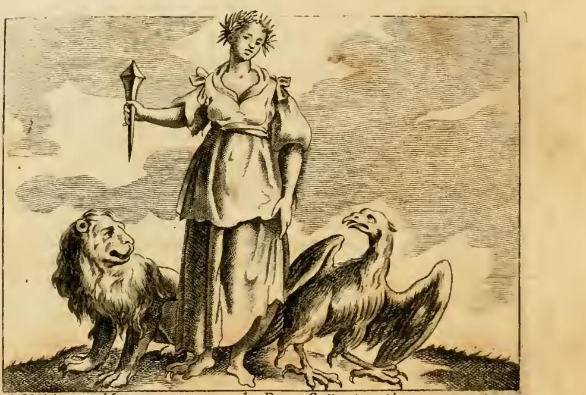
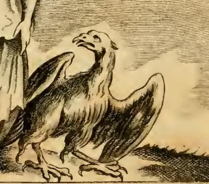

# 감사의 기억(MEMORIA GRATA)의 독수리 두 일화

> **Q.** 감사의 기억 도상에서 독수리에 얽힌 두 일화는?
>
> **A.** 하나는 뱀에 감겨 죽어가는 독수리를 낫으로 구해준 농부가 물을 마시려 하자 독수리가 날아와 그릇을 쳐서 엎었는데, 그 물을 마신 동료들이 모두 독으로 죽어 은혜 갚음임이 드러난 이야기다. 다른 하나는 트라키아 세스토스에서 처녀가 기른 독수리가 사냥한 새를 물어다 주다가, 처녀가 죽자 화장 불길에 스스로 날아들어 함께 탔다는 플리니우스의 기록이다.

---

## 1. 도상 먼저 — 여인은 사자와 독수리 **사이에** 선다

원문(조반니 자라티노 카스텔리니 항목)의 지시는 짧다.

> 노간주 열매가 촘촘히 달린 가지로 관을 쓴 우아한 젊은 여인. 손에 큰 **못**을 들고. **사자와 독수리 사이에** 서 있게 하라.
> (*UNa graziosa Giovane incoronata, con ramo di ginepro folto di granella. Tenga in mano un gran chiodo. Stia in mezzo di un Leone, ed un' Aquila.*)

판화에서 실제로 확인되는 것:

- **노간주 관** — 머리에 뾰족한 잔가지 다발이 얹혀 있다. 원문은 세 가지 이유를 든다. ① 노간주는 벌레 먹지도 늙지도 않으므로(*Cariem, et vetustatem non sentit iuniperus*) 큰 기억은 망각의 좀이 슬지 않는다 — 그래서 인물이 **젊은** 여인이다. ② 잎이 지지 않으므로 받은 은혜를 마음에서 떨어뜨리지 말라는 뜻. ③ 노간주 열매·재가 실제로 기억에 좋다는 당대 의학(구알테루스의 기억술 논고, 카스토레 두란테).
- **큰 못** — 오른손에 위로 들고 있다. 격언 *Clavo trabali figere beneficium*("받은 은혜를 대들보 못으로 박아두라")에서 온 지물로, 은혜를 못박아 고정하는 기억의 견고함을 뜻한다.
- **왼쪽(보는 이 기준)에 사자**, **오른쪽에 독수리** — 여인이 정확히 두 짐승 가운데 서서 축을 이룬다.

### 독수리는 어떻게 그려졌나

확대해 보면 독수리는 **땅에 두 발로 딛고 서서 날개를 반쯤 펼친 채, 목을 길게 빼고 고개를 왼쪽 위로 돌려 여인의 얼굴을 올려다보고** 있다. 부리는 약간 벌어져 있고 발톱은 넓게 벌려 지면을 붙잡았다. 즉 하늘의 왕조(王鳥)이면서도 날아가 버리지 않고, 몸은 지상에 붙인 채 시선만 은인을 향해 들어올린 자세다. 두 일화의 핵심 — **떠날 수 있는데 떠나지 않고 은인 쪽으로 돌아오는 새** — 가 이 자세 하나에 압축돼 있다. 왼쪽 사자도 정면을 향해 순한 얼굴로 앉아 있어, 둘 다 "이성 없는 짐승인데도 길들여진" 상태로 통일된다.

---

## 2. 원문 서술 그대로

원문은 사자와 독수리를 왜 함께 세우는지부터 밝힌다.

> 사자와 독수리 사이에 두는 것은, 이 동물들이 이성이 없음에도(*ancorchè privi di ragione*) 받은 은혜에 대해 감사의 기억을 지킬 줄 안다는 것을 보여주었기 때문이다.

그리고 **사자 = 안드로클루스 이야기**(앞 카드), **독수리 = 두 일화**를 잇는다.

### 일화 ① 독을 막은 독수리 (원문 축약역)

> 독수리에 관해서는, 아시아 칼코(카이코스) 강 인근 지방의 **그라테 페르가메노(페르가몬의 크라테스)**가 전한다. 목마른 **열여섯 명의 추수꾼**이 그중 한 사람을 물 뜨러 보냈는데, 그가 샘 가까이에서 긴 뱀이 목에 여러 번 감겨 질식당하고 있는 독수리를 발견했다. 그는 가지고 있던 **낫**으로 그 뱀을 토막 내고 독수리를 자유롭게 날려 보냈다. 이윽고 물을 가득 채운 그릇을 들고 돌아와 동료들에게 모두 마시게 하고 자기도 마시려 하자, 순간 그 독수리가 들이닥쳐 **날개로 그릇을 입에서 쳐서 땅에 떨어뜨렸다**. 추수꾼은 이것을 제가 풀어준 독수리의 배은망덕으로 여겼으나, 물을 마신 동료들이 즉시 쓰러져 죽는 것을 보았다. 곧 물에 독이 있었음을 깨닫고, 자신이 살아남은 것이 독수리에게 베푼 은혜에 대한 **감사의 보답(grata ricompensa)** 임을 알았다.

### 일화 ② 세스토스의 독수리 (원문 축약역)

> **플리니우스가 10권 (5)장**에서 전하는 사례도 이야기할 만하다. **트라키아의 도시 세스토(세스토스)** 에서 한 처녀가 독수리를 길렀는데, 그 독수리는 먹여준 은혜를 갚기 위해 자기가 잡은 새들을 처녀에게 가져다주었다. 처녀가 죽자, 그녀가 타고 있던 **바로 그 화장 불더미(Pira)** 속으로 독수리가 **스스로 날아들어** 처녀와 함께 타버렸다.

### 원문의 결론 — a fortiori 논법

> 이제 사자가 **육상 동물의 왕**이고 독수리가 **공중의 여왕**임을 생각한다면, 사람이 고귀하고 도량이 크고 관대할수록 받은 은혜에 대한 감사의 기억을 그만큼 더 잘 보존한다고 결론지을 수 있다.

즉 "짐승도 이러하니 하물며 사람은"이라는 논법에 **왕/여왕이라는 위계**를 겹쳐, 감사는 **고귀함의 지표**라는 명제를 끌어낸다. 사자와 독수리는 예시가 아니라 **논증의 두 축**이다.

---

## 3. 전거 확인 — 일화 ①: 아일리아누스, 크라테스, 스테시코로스

이 이야기의 실제 전승 경로는 카스텔리니의 표기보다 한 겹 복잡하다.

- **현존 출전은 아일리아누스 『동물의 특성에 관하여(De Natura Animalium)』 17권 37장**이다. 세부가 원문과 거의 그대로 일치한다: 뜨거운 햇볕 아래 추수하던 **열여섯 명**, 물 뜨러 간 한 사람, 낫과 물통, 뱀에게 덮쳤다가 실패해 오히려 똬리에 걸린 독수리.
- 아일리아누스에는 원문에 없는 두 가지 결정적 세부가 있다.
  1. **구해준 동기** — 그 농부는 독수리가 **제우스의 사자이자 시종**임을 알았기 때문에 구해주었다. 즉 처음부터 종교적 경외가 동기다.
  2. **독의 출처** — 토막 난 **뱀이 샘에 독을 토해놓았기** 때문에 물이 치명적이었다. 카스텔리니는 이 인과를 생략해 "물에 독이 있었다"로만 남겼는데, 그 결과 뱀→독→독수리의 고리가 끊겨 이야기가 덜 정교해졌다.
  3. 아일리아누스판에는 농부의 **항의 대사**도 있다. 그릇을 잃고 화가 나서 "목숨을 구해준 자에게 이렇게 갚느냐, 이게 공정한 일이냐, 앞으로 누가 선행에 마음을 쓰겠느냐"고 새를 나무라다가 뒤돌아 죽어가는 동료들을 본다. **오해 → 반전 → 재해석**의 3박자가 이 일화의 문학적 핵심인데, 카스텔리니는 "배은망덕으로 여겼으나"라는 한 구절로 이 대사를 압축했다.

### 카스텔리니의 출전 표기 문제

| 항목 | 원문(카스텔리니) 표기 | 실제 |
|---|---|---|
| 화자 | "**그라테 페르가메노**가 이야기한다(*narra*)" | 서사를 전하는 사람은 **아일리아누스**. **페르가몬의 크라테스**는 아일리아누스가 "이 이야기를 **스테시코로스**도 시로 노래했다"는 근거로 인용한 **증인**일 뿐, 이야기의 화자가 아니다 |
| "아시아 칼코 강 인근 지방" | 사건 장소처럼 읽힐 수 있게 붙어 있다 | 이는 **페르가몬의 위치 설명**(페르가몬은 소아시아 **카이코스**강 유역)이다. 사건 장소는 특정되지 않는다 |
| 최종 전거 | 없음 | 아일리아누스는 크라테스를 통해 **스테시코로스**(기원전 6세기 서정시인)를 "고대의 무게 있는 증인"으로 제시한다. 즉 계보는 **스테시코로스 → 크라테스 → 아일리아누스 → 카스텔리니** |

정리하면 카스텔리니는 **중간 인용자(크라테스)를 원저자로 승격시키고, 지명 설명구를 사건 배경처럼 붙였다**. 르네상스·바로크 도상학 편람에서 흔한 유형의 전거 압축 오류다.

---

## 4. 전거 확인 — 일화 ②: 플리니우스 『자연사』 10권

플리니우스 본문(현대 표준 편집 기준 **10권 6장 §18**)은 다음과 같다.

> 세스토스 시에서는 어느 독수리의 명성이 기려진다. 한 **처녀가 그 독수리를 길렀고**, 독수리는 감사를 갚아 **처음에는 새들을, 이어서는 큰 짐승들까지** 그녀에게 가져다주었다. 마침내 그녀가 죽었을 때, 독수리는 **불붙은 화장 장작더미에 스스로 몸을 던져** 그녀와 함께 타버렸다.

플리니우스에는 원문에 없는 **후속 조치**가 붙어 있다.

> 이 일 때문에 주민들은 그 자리에 **영웅 신당(heroon)** 을 세웠고, 그 새가 유피테르의 것이므로 그것을 **"유피테르와 처녀의 신당(Iovis et virginis)"** 이라 불렀다.

이 생략이 아깝다. **신당의 이름에 유피테르와 처녀가 나란히 들어간다**는 사실이야말로, 독수리의 자기희생이 단순한 동물 미담이 아니라 **신적 차원의 인증을 받은 감사**로 격상됨을 보여주는 대목이고, 뒤에 나오는 "독수리는 공중의 여왕" 결론과도 직결된다.

### 권·장 표기는 틀렸는가

- 카스텔리니는 "**Plinio nel cap. 5. del 10. lib.**"(10권 5장)로 적었다.
- 현대 편집본(랙햄 등)은 이 대목을 **10권 6장 §18**로 매긴다.
- 그러나 페르세우스/보스톡 번역본의 장 제목이 **"CHAP. 6. (5.) — 처녀의 화장 장작더미에 몸을 던진 독수리"** 로 병기되어 있는 데서 보듯, **구(舊) 장 구분에서는 이 장이 5장**이었다. 카스텔리니가 쓴 18세기 판본 계열의 번호 매김을 따른 것이므로 **단순 오류가 아니라 판본 차이**로 보아야 한다.
- **다만 인용할 때는 현대 표준인 `Plin. NH 10.6.18`을 쓰는 것이 안전하다.** 바로 앞 5장(§16)이 "가이우스 마리우스가 두 번째 집정관 때 독수리를 로마 군단의 표장으로 정했다"는 대목이라, 구번호 "5장"으로 찾으면 엉뚱한 곳에 닿을 수 있다.
- "**트라키아의**"라는 수식은 플리니우스 본문에 없지만 틀리지 않다. 세스토스는 헬레스폰토스 유럽 쪽 **트라키아 케르소네소스**에 있는 도시(크세르크세스 부교와 헤로·레안드로스 전설의 그 세스토스)다.
- 카스텔리니는 독수리가 가져다준 것을 **"새들"로만** 적었다. 플리니우스는 **새 → 큰 사냥감**으로 **선물이 커지는 점증**을 명시한다. 이 점증은 마지막 자기희생으로 이어지는 상승 곡선의 일부이므로, 생략되면 결말의 낙차가 줄어든다.

---

## 5. 왜 두 일화가 짝을 이루는가 — 보답의 강도 상승 배치

두 일화는 같은 얘기의 이본이 아니라, **한 계단씩 올라가도록 배열된 쌍**이다.

| 축 | 일화 ① 독을 막은 독수리 | 일화 ② 세스토스의 독수리 |
|---|---|---|
| 은혜의 성격 | **일회적 구조(救助)** — 낫 한 번 | **지속적 양육** — 여러 해의 먹임 |
| 관계의 온도 | 우연히 만난 낯선 사이 | 함께 산 정서적 유대 |
| 보답의 형태 | **위험을 막아 갚음(보호)** | **함께 죽어 갚음(헌신)** |
| 보답의 시점 | 은인이 **살아 있을 때**, 살리기 위해 | 은인이 **죽은 뒤**, 살릴 수 없을 때 |
| 보답의 비용 | 독수리는 아무것도 잃지 않는다 | **자기 목숨 전부** |
| 결과 | 은인 1명 생존 | 둘 다 소멸 → **신당으로 기념** |
| 감사의 논리 | 유용성(utile) — 갚음이 이익을 낳는다 | 순수성(honestum) — 갚음이 이익을 초월한다 |

즉 **① 갚음이 목숨을 구하는 단계 → ② 갚음이 목숨을 내놓는 단계**로 이동한다. 배치가 이 순서인 것도 우연이 아니다. ①은 "감사는 실제로 은인을 지켜준다"는 **효용의 증명**이고, ②는 "감사는 이익이 사라진 뒤에도 남는다"는 **순수함의 증명**이다. 그리고 ②의 마지막 문장("함께 타버렸다")이 곧바로 원문의 결론 문장 — "고귀·관대할수록 감사의 기억을 지킨다" — 로 이어진다. 최고 강도의 사례 직후에 명제를 놓는 수사 배치다.

여기서 **노간주 관과 못**의 의미가 완성된다. 노간주는 "썩지 않음", 못은 "박아 고정함", 세스토스 독수리는 "은인이 사라진 뒤에도 지속됨" — 셋 모두 **감사의 시간적 지속성**을 말한다. 이 알레고리의 제목이 그냥 '감사'가 아니라 **'감사의 기억(Memoria grata)'** 인 이유다. 문제는 은혜를 갚느냐가 아니라 **잊지 않느냐**다.

---

## 6. 사자(땅)와 독수리(하늘)의 좌우 구성

원문이 결론에서 밝힌 대로, 두 짐승은 **왕권의 두 영역**이다.

- **사자 = 육상 동물의 왕(Re degli animali terrestri)** — 좌측, 땅에 앉아 있다.
- **독수리 = 공중의 여왕(Regina degli aerei)** — 우측, 땅을 딛되 날개를 펼치고 위를 본다.

여인이 그 사이에 서므로 구도는 **땅 — 인간 — 하늘**의 수직 위계를 좌우로 눕혀 놓은 형태가 된다. 감사의 기억은 자연의 **전 영역**에 걸쳐 통용되는 법칙이고, 인간은 그 두 왕국 사이에 놓인 존재로서 양쪽 모두에게 배워야 한다는 뜻이다. 판화에서 사자는 정면을, 독수리는 여인을 올려다보므로, 시선이 여인에게 모여 인물이 축이 된다.

**독수리가 하필 '고귀한 감사'의 담지자로 적합했던 이유**는 몇 겹이다.

1. **유피테르의 새** — 플리니우스가 세스토스 신당을 "유피테르와 처녀의 신당"이라 부른 근거이고, 아일리아누스판에서 농부가 독수리를 구한 동기도 "제우스의 사자이자 시종"이라는 인식이었다. 즉 두 일화 모두 **독수리 뒤에 최고신이 서 있다.** 은혜를 갚는 새는 곧 **선행을 지켜보는 신의 대리인**이며, 아일리아누스판 농부의 항의 대사("선행을 살피고 지키는 제우스를 존중해 누가 남에게 선을 행하려 하겠는가")가 정확히 이 논리다.
2. **로마 군단의 표장** — 플리니우스 10권 5장 §16에 따르면 가이우스 마리우스가 두 번째 집정관 시절 독수리를 군단의 고유 표장으로 정했고, 그전까지 늑대·미노타우로스·말·멧돼지와 함께 다섯 표장 중 하나였던 것을 나머지를 폐하고 독수리만 전장에 세웠다. 따라서 독수리는 **국가·군대의 명예와 충성**을 이미 표상하고 있었다.
3. 결과적으로 독수리는 사자처럼 단순히 "힘센 짐승"이 아니라 **신성 + 공적 명예**를 함께 실은 기호이며, 카스텔리니가 감사를 "**nobile, magnanima, generosa**(고귀·도량·관대)"라는 귀족적 덕목으로 정의한 결론과 정확히 맞물린다.

---

## 7. 앞 카드(안드로클루스와 사자)와의 구조 대조

세 이야기는 모두 **은혜 → 간격 → 재인 → 보답**의 동일한 4박자를 밟는다. 카드 간 연결을 잡기에 좋은 표다.

| 단계 | 사자: 안드로클루스 | 독수리 ①: 독을 막음 | 독수리 ②: 세스토스 |
|---|---|---|---|
| **은혜** | 발에 박힌 가시를 뽑고 상처를 씻어줌 | 목에 감긴 뱀을 낫으로 토막 냄 | 여러 해 먹여 기름 |
| **간격** | 동굴 동거 3년 + 아프리카→로마 이송 | 몇 분~몇 시간(같은 날) | 양육 기간 전체(단절 없음) |
| **재인** | 대경기장 맹수형에서 눈을 마주치고 알아봄 — **쌍방 인지** | 독수리가 은인을 알아보고 날아옴 — **일방 인지**(사람은 오히려 오해) | 재인 불필요, 계속된 동거 |
| **보답** | 해치지 않고 꼬리 치며 손발을 핥음 | 그릇을 날개로 쳐서 엎어 목숨을 구함 | 화장 불에 스스로 뛰어들어 함께 탐 |
| **비용** | 없음 | 없음 | **자기 목숨** |
| **결말** | 안드로클루스 사면, 민회 결의로 사자를 하사받아 로마를 함께 산책. 구경꾼들이 외침: *Hic est Leo hospes hominis, hic est homo medicus Leonis*("이 사자가 사람을 손님으로 맞은 사자요, 이 사람이 사자를 치료한 사람이다") | 은인만 생존 | 신당 건립 |
| **전거** | 아울루스 겔리우스 『아티카의 밤』 **5권 14장**(알렉산드리아의 아피온 증언, 아피온은 목격자를 자칭) / 아일리아누스 **7권 48장** | 아일리아누스 **17권 37장**(← 크라테스 ← 스테시코로스) | 플리니우스 **10권 6장 §18** |

> **주의 — 원문의 전거 표기 오류**: 카스텔리니는 사자 일화를 "**아울루스 겔리우스 3권 24장**", 이름 이본을 "**아일리아누스 8권 48장**"으로 적었으나, 실제는 각각 **겔리우스 5권 14장**, **아일리아누스 7권 48장**이다. 겔리우스 5.14가 아피온의 『아이깁티아카』를 옮긴 것이라는 사실(따라서 "직접 눈으로 보았다"는 주장의 주체는 겔리우스가 아니라 아피온)도 원문 서술과 대조해 확인해 둘 만하다.

**대조의 요점**: 사자 이야기는 **간격이 극단적으로 길고**(3년, 대륙 이동) 그래서 "그렇게 오래 지나도 잊지 않았다"는 **기억의 지속**을 증명한다. 독수리 ①은 **간격이 짧은 대신 반전이 있어** "감사는 오해받을 수도 있다"는 **인식의 문제**를 다룬다. 독수리 ②는 간격도 반전도 없이 **비용만 극대화해** "감사의 순수함"을 증명한다. 세 이야기가 각각 **지속 · 인식 · 희생**이라는 다른 변수를 극단으로 밀어붙이므로, 셋을 합치면 '감사의 기억'이라는 개념의 세 면이 모두 채워진다.

---

## 8. 암기용 요약

- **독수리 일화 = 2개**: ①**뱀·낫·독물** ②**세스토스·처녀·화장 불**
- **전거 2개**: ① **아일리아누스 NA 17.37**(원문은 중간 인용자 **페르가몬의 크라테스**를 화자로 적음; 최종 증인은 **스테시코로스**) ② **플리니우스 NH 10.6.18**(원문 표기 "10권 5장"은 구 장 구분)
- **키워드 대비**: ① **16명의 추수꾼 / 낫 / 그릇을 엎다 / 보호** ② **처녀 / 새와 사냥감 / 불에 뛰어들다 / 헌신**
- **구도**: 사자(땅의 왕, 좌) — 여인(노간주 관 + 못) — 독수리(하늘의 여왕, 우, 여인을 올려다봄)
- **결론 문장**: 고귀·관대할수록 받은 은혜의 감사한 기억을 더 잘 보존한다.

---

### 참고 출처

- [Aelian, On Animals, Book 17 (attalus.org, 17.37)](https://www.attalus.org/translate/animals17.html)
- [Pliny, Natural History, Book 10 (Rackham 역, Wikisource — VI.18 세스토스, V.16 마리우스와 군단 표장)](https://en.wikisource.org/wiki/Natural_History_(Rackham,_Jones,_%26_Eichholz)/Book_10)
- [Pliny, Natural History 10.6 (Perseus, Bostock/Riley — 장 번호 "CHAP. 6. (5.)" 병기 확인)](https://www.perseus.tufts.edu/hopper/text?doc=Perseus%3Atext%3A1999.02.0137%3Abook%3D10%3Achapter%3D6)
- [Aulus Gellius, Attic Nights 5.14 (Perseus, 안드로클루스와 사자)](https://www.perseus.tufts.edu/hopper/text?doc=Gel.+5.14&lang=original)
- [Gellius, Attic Nights Book V (LacusCurtius)](https://penelope.uchicago.edu/Thayer/E/Roman/Texts/Gellius/5*.html)
- 원본: `04 Mechanics to the Month in General.md`, 「MEMORIA GRATA — De' benefici ricevuti, Di Gio. Zaratino Castellini」 항목
