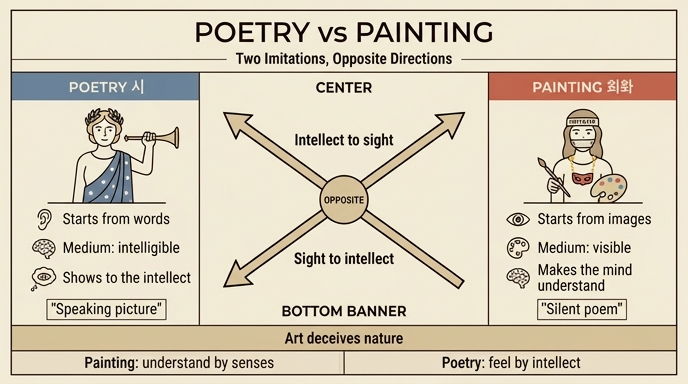

# 회화와 시의 모방 방식 차이 — "반대 방향으로 나아가는 모방"

## 이 카드가 나온 자리

체사레 리파(Cesare Ripa) 『이코놀로지아』 제4권, **PITTURA(회화)** 항목이다. 리파는 회화의 의인상을 묘사한 뒤 그 지물(持物)을 하나씩 풀이하는데, 그중 **금목걸이에 매달린 가면(maschera)** 을 설명하는 대목에서 "모방(imitazione)"을 논하다가 시(詩)와의 비교로 넘어간다. 카드의 답은 바로 이 문단(원문 기준 "Gli Antichi dimandavano imitazione…"로 시작하는 단락)을 요약한 것이다.

회화 의인상은 이마에 **`Imitatio`(모방)** 라는 글자가 새겨진 여인이다. 즉 리파에게 회화의 정체성 자체가 '모방'이며, 그 모방이 시의 모방과 어떻게 갈라지는지를 밝히는 것이 이 대목의 과제다.

## 1. 출발점 — 모방이 없으면 화가도 시인도 아니다

> 고대인들은 **비록 거짓이라 해도 실제로 일어난 어떤 진실을 길잡이 삼아 만들어진 이야기**를 '모방'이라 불렀다. 그들은 이 부분이 결여된 시인을 시인으로 치지 않았고, 마찬가지로 이것을 갖지 못한 화가도 화가로 칠 수 없다.

- 모방은 '현실의 복사'가 아니라 **진실을 실마리로 삼은 꾸밈**이다. 허구지만 근거가 있어야 한다.
- 그래서 회화는 **실재 사물의 모방**을 필요로 하며, 이를 가리키는 것이 목에 걸린 **가면**이다. 가면은 곧 "사람 얼굴의 초상"이기 때문이다.
- 가면이 **금사슬**에 매달린 것은, 모방이 회화와 **떼어낼 수 없이 결합**되어 있음을 뜻한다.

## 2. 유명한 격언 — "시는 회화 안에서 침묵하고, 회화는 시 안에서 말한다"

> *la Poesia tace nella Pittura, e la Pittura nella Poesia ragiona*

리파가 "그 흔한 말(quel detto triviale)"이라 부를 만큼 당대에 상투구였던 문장이다. 뿌리는 시모니데스의 "그림은 말 없는 시, 시는 말하는 그림"과 호라티우스의 *ut pictura poesis*(시는 그림처럼) 전통에 있다.

- **회화 = 침묵하는 시**: 그림 안에는 시가 들어 있지만 말을 하지 않는다.
- **시 = 말하는 그림**: 시 안에는 그림이 들어 있고, 그것이 말로 발화된다.
- 리파의 회화 의인상이 **입을 띠로 묶어 가리고 있는 것**(la bocca ricoperta)은 이 '침묵'과 정확히 겹친다. 리파 자신은 이를 침묵과 고독의 미덕으로도 풀지만, 도상 전체를 보면 "말하지 않는 예술"이라는 성격 규정과 자연스럽게 이어진다.

## 3. 핵심 — "모방 방식이 다르며, 서로 대립(oppositione)하며 나아간다"

리파의 문장을 풀어 옮기면 이렇다.

> 다만 둘은 **모방하는 방식**이 다르니, **서로 반대 방향으로 진행하기(procedendo per oppositione)** 때문이다. 시인이 자기 기술로써 **지성에게 거의 보이게 만드는 그 가시적 우연들(accidenti visibili)** 을, 시인은 **지성이 알아들을 수 있는 것들(accidenti intelligibili)** 을 매개로 삼아 그렇게 한다. 반면 화가는 그 가시적인 것들을 **먼저** 다루어, 그것들을 매개로 **정신이 그 의미된 바를 알아듣게** 만든다.

즉 두 예술은 **같은 두 항(감각적인 것 ↔ 지성적인 것)을 정반대 순서로 통과**한다.

| | 시(Poesia) | 회화(Pittura) |
|---|---|---|
| 출발 재료 | 지성적인 것 — 말·개념 | 감각적인 것 — 형상·색 |
| 매개(수단) | 알아들을 수 있는 것 (intelligibili) | 눈에 보이는 것 (visibili) |
| 도착 지점 | 지성 안에 **보이는 상**이 맺힘 | 정신이 **뜻**을 알아들음 |
| 방향 | 지성 → 봄 (말로 그린다) | 봄 → 지성 (그림으로 말한다) |
| 감각 채널 | 귀(들음) | 눈(봄) |

- 시인은 **보이지 않는 말**로 독자의 지성 안에 **장면을 보여준다**. 감각을 거치지 않고 곧장 지성에 '그림'을 띄운다.
- 화가는 **먼저 눈에 보게** 한 다음, 그 감각 경험을 통해 정신이 **의미를 알아듣게** 한다.
- 그래서 둘은 같은 목표(모방을 통한 즐거움)를 향하되, **화살표의 방향이 정반대**다. 리파가 쓴 단어 *oppositione*는 '반대·대치'이며, 수사학의 교차대구(키아스무스)처럼 두 예술이 X자로 엇갈리는 구조를 만든다.

## 4. 결론 — 기술이 자연을 속이는 두 가지 방식

> 이 두 직업에서 얻는 즐거움이란 다른 것이 아니라, **기술의 힘으로 거의 자연을 속이듯이**, 하나는 **감각으로 알아듣게(fa l'una intendere co' sensi)** 하고, 다른 하나는 **지성으로 느끼게(l'altra sentire coll'intelletto)** 하는 것이다.

여기서 리파는 동사를 일부러 뒤바꿔 놓는다. 이것이 이 대목의 백미다.

- **intendere(알아듣다·이해하다)** 는 원래 지성의 일인데 → **감각(sensi)** 에 붙였다. (회화)
- **sentire(느끼다·감각하다)** 는 원래 감각의 일인데 → **지성(intelletto)** 에 붙였다. (시)

즉 회화는 **감각으로 이해시키고**, 시는 **지성으로 느끼게 한다**. 각 예술이 제 능력 밖의 일을 해내는 이 '자리바꿈'이야말로 예술의 *inganno*(속임수)이자 즐거움의 원천이다. 자연이라면 눈으로는 보기만 하고 머리로는 생각만 할 텐데, 기술은 그 경계를 넘겨 자연을 속인다.

한 가지 덧붙이면, 이 '속임수'는 감춰져야 한다. 리파는 회화 의인상의 **발을 덮은 옷자락**을 두고, 밑그림의 비례와 원리는 완성작에서 감춰져야 하며 "웅변가가 기술 없이 말하는 척하는 것이 큰 기술이듯, 화가도 기술이 드러나 보이지 않게 그릴 줄 알아야 한다"고 말한다. 모방의 기술은 성공할수록 보이지 않는다.

## 5. 도상으로 보는 시(Poesia)

같은 권의 **POESIA(시)** 항목 판화는 위 대조의 '시' 쪽을 눈으로 확인하게 해준다.

그림에서 실제로 관찰되는 요소들:

- **월계관**: 늘 푸르고 벼락도 두려워하지 않는 월계수 — 시는 사람을 불멸케 하고 시간의 망각에서 지켜준다.
- **별이 박힌 하늘빛 겉옷**: 별들이 하늘에서 기원했다는 시인들의 말에 맞춘 것으로, 시의 **신성(神性)** 을 뜻한다. 플라톤을 따라 리파는 시를 "신적인 것들의 표현, 광기(furore)와 천상의 은총에 의해 정신 안에서 촉발된 것"으로 규정한다.
- **드러난 젖가슴**: 젖이 가득한 가슴은 시의 생명인 **착상과 창안의 풍요로움**을 뜻한다.
- **상기되고 골똘한 얼굴**: 시인의 영혼은 늘 광기에 가까운 빠른 움직임으로 가득 차 있다.
- **손에 든 나팔(트럼펫)과 발치의 현악기·활**: 리파의 본문에서는 세 날개 아이가 각각 리라와 플렉트럼, 시링크스(팬파이프), 트럼펫을 건네는데, 이는 **목가시·서정시·영웅시**라는 시의 세 갈래를 뜻한다. 판화가는 아이들을 생략하고 리파가 허용한 대로 악기만 배치했다.

주목할 대비: **시는 소리 나는 악기를 들고 입이 열려 있는 반면, 회화 의인상은 입이 띠로 묶여 있고 손에는 붓과 팔레트를 든다.** 도상 자체가 "회화는 침묵하고 시는 말한다"를 그대로 보여주는 셈이다.

(회화 Pittura 의인상의 판화는 이 자료 묶음에 이미지 파일이 추출되어 있지 않아 함께 싣지 못했다. 본문 묘사로는 검고 굵게 헝클어진 머리, 치켜 올라간 눈썹, 띠로 가린 입, 이마의 `Imitatio`, 금사슬에 걸린 가면, 붓과 팔레트, 발치의 화구, 발을 덮은 색 변하는 옷이다.)

## 6. 한 문장 요약

시와 회화는 똑같이 모방이지만 **통과 순서가 반대**다. 시인은 알아들을 수 있는 것(말)을 통해 지성에게 **보여주고**, 화가는 먼저 보게 한 뒤 정신이 **알아듣게** 한다. 그리하여 기술은 자연을 속여, 회화는 **감각으로 이해시키고** 시는 **지성으로 느끼게 한다**.

## 인포그래픽

