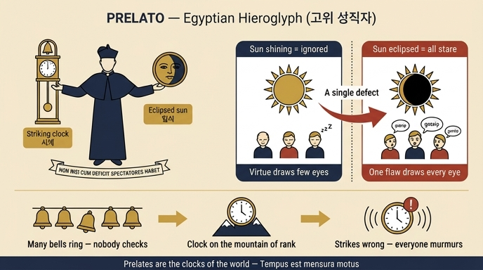

# 고위 성직자(PRELATO) — 이집트인의 상형문자

## 카드 요약

| 항목 | 내용 |
|---|---|
| 표제어 | PRELATO / PRELATURA (고위 성직자, 고위 성직) |
| 오른손 | **종을 치는 시계**(orologio da suonare) — 추가 달린 탑시계 |
| 왼손 | **일식에 든 태양**(Sole ecclissato) |
| 표어 | **NON NISI CUM DEFICIT SPECTATORES HABET** — "이지러질 때가 아니면 구경꾼을 얻지 못한다" |
| 출처 | Cesare Ripa, *Iconologia*, 「Practice to Providence」 편의 PRELATO 항목 |

## 원본 판화

판화(Carlo Marietti 그림 / Carlo Grandi 새김, 캡션 *Prelatura*)에서 실제로 확인되는 요소들:

- **가운데 인물**: 성직자 모자(비레타)와 무릎까지 내려오는 긴 법의를 걸친 남자. 고위 성직자의 위계를 드러내는 복장이다.
- **인물의 오른손(그림에서 왼쪽)**: 문자판과 종이 달린 **추시계**. 추와 진자가 밖으로 길게 늘어져 있어 "소리 내어 시간을 알리는" 공적 시계임이 강조된다.
- **인물의 왼손(그림에서 오른쪽)**: 사람 얼굴이 그려진 **태양 원반**. 광선 대부분이 짧게 잘려 있고 원반을 따라 표어가 둘러 새겨져 있다 — 판화의 명문은 `NON NISI CVM DEFICIT SPECTATOREM HABET`(본문 텍스트는 복수형 `SPECTATORES HABET`). 즉 태양이 온전히 빛나는 상태가 아니라 **가려진 상태**로 그려져 있다.
- **오른쪽 배경**: 종탑이 있는 **교회 건물**. 뒤에 이어지는 "도시의 종들 vs 시계" 비유(아래 참조)와 직접 연결되는 소품이다.

## 두 상징의 뜻

### 1) 일식 든 태양 — 결점이 생길 때만 시선이 쏠린다

리파의 설명 논리:

- 태양은 **가장 밝게 빛날 때(lucidissimo)** 아무도 올려다보지 않는다.
- 그러나 **일식이 들면(quando si ecclissa)** 모두가 놀라 쳐다본다.
- 고위 성직자도 마찬가지다. 아무리 훌륭해도(per ottimo che sia) 그를 본받고 칭송하려 바라보는 이는 **적다(pochi lo mirano)**.
- 반대로 어떤 결점(qualche difetto)으로 그가 "일식에 들어" 어두워지면, **모든 이의 눈이 경악과 함께 그에게로 돌아가 수군거린다(mormorano)** — 마치 일식 든 태양, 세상의 괴이한 조짐(un portento del Mondo)을 본 듯이.

그래서 표어가 성립한다: **"이지러질 때만 구경꾼이 있다."** 이 도상은 칭찬이 아니라 **경고**다 — 고위직의 명성은 비대칭적이어서, 선행은 눈에 띄지 않고 실수만 확대된다.

### 2) 종 치는 시계 — 세상의 표준시계이므로 조금만 틀려도 안다

리파는 시계 상징에 두 겹의 근거를 붙인다.

**(a) 성서적 근거.** 이사야 52:7 "산 위에 좋은 소식을 전하는 이의 발이 어찌 그리 아름다운가"(*Quam speciosi super montes pedes evangelizantis bona*)를 두고, 칠십인역(i settanta Interpreti)이 이 대목을 *sicut hora, vel sicut horologium super montes*("산 위의 시각처럼, 시계처럼")로 옮겼다고 리파는 전한다. 여기서 **고위 성직자 = 세상의 시계(orologi del Mondo)** 라는 등식이 나온다. 시계는 "모든 운동의 척도"이므로(*Tempus est mensura motus*, 시간은 운동의 척도라는 아리스토텔레스적 정식), 성직자 자신의 운동 곧 **행동과 습속이 극도로 규칙적이고 정확해야(regolarissimi e giustissimi)** 한다.

**(b) 도시의 종 vs 시계 비유.** 한 도시에 종이 여러 개 있어 매일 울려도, 그것이 정확히 울렸는지 화음이 맞았는지 아무도 따지지 않는다. 그러나 **시계**가 한 번 틀려서 엉뚱한 때에 울리거나, 두 번 칠 자리에 네 번 치면 즉시 모두가 놀라 관리자와 제작자를 흉본다. 이유는 하나다 — 그 종은 보통 종이 아니라 **모든 운동의 규범과 척도가 되는 시계**이기 때문. 판화 오른쪽의 종탑 교회가 바로 이 대비를 시각화한다.

**(c) 산 위에 놓인 시계.** 그러므로 고위 성직자는 "위계의 산 위에(sopra i monti delle dignità)" 놓여 모두에게 보이고 들리도록 세워진 시계다. 따라서 **정확히 울리고 곧게 걸어야** 한다. 리파는 클라우디아누스(『호노리우스 4차 집정관 찬가』)가 군주에게 한 말을 성직자에게 그대로 적용한다: "너는 온 땅의 중심에서 살고 있으며, 네 삶은 모든 백성에게 드러나 있음을 알라."

### 두 상징의 결합

| 상징 | 겨누는 곳 | 논지 |
|---|---|---|
| 일식 든 태양 | 세상의 **시선** | 잘할 때는 안 보고, 흠집 나면 다 본다 |
| 종 치는 시계 | 성직자의 **처신** | 그러니 척도답게 한 치도 틀리지 말라 |

앞의 상징이 "여론의 비대칭"이라는 **사실**을 말하고, 뒤의 상징이 그로부터 나오는 **의무**를 말한다. 같은 인물의 좌우 손에 놓인 두 물건이 하나의 논증(전제→결론)을 이루는 구성이다.

## 참고: P. Ricci의 다른 '프렐라투라' 도상

같은 항목 뒤에 리파는 P. 리치(P. Ricci)의 다른 의인화도 덧붙인다. 검은 중후한 옷을 입고 **머리에 태양**을 얹은 여인이 한 발을 앞으로 내딛고, 한 손에 **눈이 달린 지팡이(verga occhiuta)** 와 큰 **책**을 들며, 한쪽에는 **독수리와 사자**, 다른 쪽에는 덤비는 **용**을 지팡이로 물리치는 모습이다.

- 앞으로 내딛는 발 = 모두를 앞서는 고위 성직
- 눈 달린 지팡이 = 아래 사람들에 대한 극진한 감독
- 책 = 좋은 성직자에게 필수인 학식
- 독수리 = 신속하고 고결한 사려 / 사자 = 아량·강인함·정의
- 매 맞는 용 = 징계되어 규율로 되돌려진 악습과 무질서

이 두 번째 도상은 **카드가 묻는 "이집트인의 상형문자"가 아니다.** 카드 정답은 어디까지나 시계 + 일식 태양 + 표어 조합이다.

## 암기 포인트

- 손 구분: **오른손 = 시계(clock)**, **왼손 = 일식 태양(eclipse)**. "오른쪽은 시간, 왼쪽은 그늘".
- 표어 첫 단어 순서: **NON NISI CUM DEFICIT** — "…할 때가 아니면 아니다" → *deficit*(이지러진다)이 조건.
- 핵심 문장 한 줄: **"태양은 이지러질 때만 관중을 얻는다."**

## 인포그래픽

