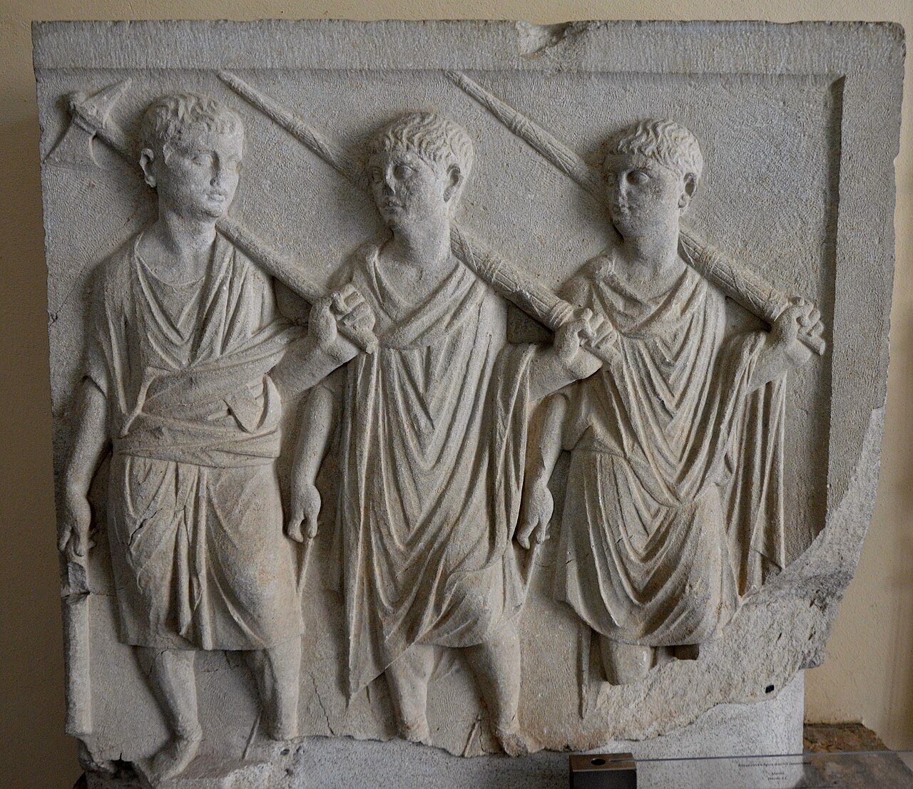

# 릭토르(Littori)의 파스케스(fasci) — 묶인 가지 다발과 도끼

> **Q.** 고대 로마 릭토르(Littori)의 파스케스(fasci)는 무엇이며 무엇을 상징하는가?

## 한눈에 보기

| 항목 | 내용 |
|---|---|
| 실물 | 자작나무(betulla) 가지를 다발로 묶고, 그 사이에 도끼를 끼워 **날이 밖으로 튀어나오게** 한 것 |
| 운반자 | **릭토르(lictor)** — 정무관을 앞서 걸으며 파스케스를 어깨에 메는 수행원 |
| 도덕적 의미 ① | 가지가 **묶여 있다** = 처벌에서 관리의 분노가 성급해서는 안 된다 (묶음을 푸는 시간이 곧 냉각 시간) |
| 도덕적 의미 ② | 정당한 이유 없이 **풀어서는 안 된다** |
| 처벌의 등급 | 교정 가능한 자 → 가지로 매질 / 교정 불가능한 자 → 도끼로 처형 |
| 릭토르 수(출처) | 독재관 24, 집정관 12, 속주 총독·법무관 6, 도시 법무관 2 |

---

## 1. 이 카드가 나온 자리: Iconologia의 「LEGGE」 항목 각주

카드의 내용은 리파(Cesare Ripa) 『Iconologia』의 **LEGGE(법)** 항목, 그중 **「Legge Civile(시민법)」** 도상에 붙은 **역주**에서 나왔다. 본문의 Legge Civile 기술은 이렇다.

> 앉아 있는 여인이 오른손에 **저울과 검**을 들고 있다. 저울의 한쪽 접시에는 **고대인이 사용한 릭토르의 파스케스 중 하나**가 놓이고, 다른 쪽 접시에는 **왕관**이 놓인다. 왼손에는 펼친 책을 들고 그 위에 **황제관**이 놓였으며, 책에는 이렇게 적혀 있다: *Imperatoriam maiestatem non solum armis decoratam, sed etiam legibus armatam esse oportet* (황제의 위엄은 무기로 장식되는 것만이 아니라 법으로 무장되어야 한다 — 유스티니아누스 『법학제요』 서문).

즉 **파스케스 = 강제력·형벌권**, **왕관 = 통치권**이 저울 양쪽에서 균형을 이루는 구도다. 파스케스는 여기서 "법이 실제로 때리고 벨 수 있는 힘"을 대표하는 물건으로 등장하고, 그 힘이 어떻게 절제되어야 하는지를 각주가 설명한다.

주의할 점: 이 판본에서 **Legge Civile 자체에는 독립 판화가 없다.** LEGGE 항목군에 실린 판화는 아래의 「Legge Naturale(자연법)」 한 장뿐이며, 여기에는 파스케스가 그려져 있지 않다(여인이 든 것은 곧은 **자[尺]**, 명문 `AEQVA LANX` = "고른 저울").

*Carlo Marotti del. / Carlo Grandi incise — 자산 폴더의 원본 판화 `_page_16_Picture_2.jpeg`.*

---

## 2. 파스케스의 실물

각주가 기술하는 재료는 **자작나무(betulla)** 가지다. 리파의 역주는 "프랑스에서 자라는, 놀랍도록 흰 빛깔에 매우 잘 휘어져서 회초리를 만들기에 가장 알맞은 나무이며, 로마인이 이것을 이탈리아로 옮겨 심어 파스케스를 만들었다"고 적는다.

이 서술의 출처는 **대(大)플리니우스 『박물지』 16권**의 자작나무 항목이다.

> *Gallica haec arbor mirabili candore atque tenuitate, terribilis magistratuum virgis…*
> ("갈리아의 이 나무는 놀라운 흰빛과 가늘기를 지녔고, **정무관의 회초리로서 무섭다**…")

일반적인 고전학 서술도 이와 일치하되, 자작나무 외에 **느릅나무(elm)** 가지도 쓰였다고 덧붙인다. 구조는 다음과 같다.

- 가지 다발을 **가죽끈으로 여러 군데 감아 묶는다**.
- 다발 **가운데에 도끼(securis)를 끼우고**, 쇠날이 다발 밖으로 **드러나 보이도록** 세운다. 각주의 표현대로 "쇠가 가지들 위로 솟아 보이게(il ferro si vedesse a quelle soprastare)".
- 릭토르는 이것을 **왼쪽 어깨에 메고** 정무관 앞을 걸었다.

**그림 출처(웹, 출처 판본의 판화가 아님):** 이울리아 콘코르디아(Iulia Concordia) 출토 로마 부조, 포르토그루아로 국립 콘코르디아 박물관. 사진 "Following Hadrian", Wikimedia Commons, CC BY-SA 2.0 — [파일 페이지](https://commons.wikimedia.org/wiki/File:Relief_from_Iulia_Concordia_depicting_three_lictors,_National_Museum_of_Concordia,_Portogruaro,_Italy.jpg). 출처 판본에 파스케스 판화가 없어 보충한 실물 참고 이미지다.

**그림에서 확인되는 것들**

- 세 인물 모두 **똑같은 자세**로 긴 다발을 왼쪽 어깨에 걸치고 오른손으로 붙잡고 있다 → 파스케스는 개인의 무기가 아니라 **직무 표장(insignia)**이라서 자세와 착장이 규격화되어 있다.
- 다발 표면에 **가로로 감긴 결속선**이 새겨져 있다 → 낱개의 가지가 아니라 **묶인 한 덩어리**라는 점이 조형의 핵심이며, 이것이 바로 아래 4절의 도덕적 의미가 걸리는 지점이다.
- 다발 끝에 **도끼날이 보이지 않는다** → 6절의 "도시 안에서는 도끼를 뺀다"는 관행과 부합하는 도상이다.
- 인물들이 무장 대신 **토가/파에눌라 차림에 맨손**이다 → 릭토르는 병사가 아니라 민정 정무관의 수행원이었다.

---

## 3. 릭토르는 누구였나

릭토르는 *imperium*(명령권)을 보유한 정무관에게 배속된 **공적 수행원**이다.

- 정무관 앞을 한 줄로 걸으며 길을 열고 군중을 통제했다(*submovere turbam*).
- 정무관의 호출·구인·체포를 집행했다.
- 그리고 **매질과 처형을 실제로 집행하는 손**이었다.

리파의 역주는 당대 독자를 위해 한 줄로 요약한다: **"릭토르의 직무는 오늘날의 비리(Birri, 포리·순검)의 직무와 같았다."** 즉 파스케스는 추상적 엠블럼이 아니라, 바로 옆에 실제 집행자가 딸린 **작동하는 도구**였다.

어원도 이 직무를 가리킨다. *lictor* 는 라틴어 **ligare(묶다)** 에서 온 것으로 보는데, 이는 다발을 묶는 일과 죄인을 묶는 일 양쪽에 걸린다.

---

## 4. 핵심: 묶여 있다는 것의 도덕적 독법

카드의 요점은 재료나 숫자가 아니라 **왜 묶어 두었는가**다. 리파의 역주는 이것을 **플루타르코스 『로마의 풍습에 관한 물음(Quaestiones Romanae)』 82** 에 돌린다. 플루타르코스의 물음은 "왜 정무관의 회초리는 도끼와 함께 다발로 묶여 운반되는가?"이고, 답은 두 겹이다.

**(1) 처벌은 느려야 한다**

정무관의 노여움은 *precipitosa*(성급함)여서는 안 된다. 이것이 단순한 비유가 아닌 이유는, 매질을 하려면 **릭토르가 먼저 다발의 끈을 풀어야** 했기 때문이다. 끈을 하나하나 푸는 물리적 시간이 곧 **강제된 지연**이 되어, 그 사이에 정무관의 격정이 식고 실제로 처벌 결정을 **번의(飜意)** 하는 일이 잦았다. 분노가 충동 그대로 손에 쥐어지지 않게 설계된 장치인 셈이다.

**(2) 정당한 이유 없이 풀지 않는다**

다발은 *senza giusto motivo*(정당한 동기 없이) 풀려서는 안 된다. 풀린 파스케스는 곧 형 집행의 개시를 뜻하므로, "묶여 있는 상태"가 정상이고 "풀기"가 예외이자 정당화를 요구하는 행위다.

**(3) 두 도구, 두 등급의 죄**

- **교정 가능한 자(che potevano esser corretti)** → **가지로 매질**(교정·훈계)
- **교정 불가능한 자(incorreggibili)** → **도끼로 처형**(제거)

하나의 물건 안에 **회초리(교정)와 도끼(절단)** 가 함께 들어 있다는 점이 중요하다. 파스케스는 "처벌"이라는 단일한 위협이 아니라, **죄의 치유 가능성에 따라 등급이 매겨진 형벌 체계**를 한 손에 요약한 도상이다.

---

## 5. 릭토르의 수 = imperium의 눈에 보이는 등급

행렬 앞의 릭토르 숫자를 세면 그 인물의 권한 등급이 즉시 읽혔다. 리파 역주의 숫자와 표준적 서술을 나란히 두면 이렇다.

| 직위 | 출처(리파 역주) | 표준적 서술 | 비고 |
|---|---|---|---|
| 독재관(Dittatore) | **24** | 24 | 집정관 두 명을 합한 것보다 우월함을 표시 |
| 집정관(Consoli) | **12** | 12 | 왕정기의 왕도 12로 전한다 |
| 속주 총독(Proconsoli)·속주 법무관(Pretori delle Provincie) | **6** | 법무관/속대리관 6 — 단, **전직 집정관 자격의 proconsul에게는 12** 로 보는 서술이 많다 | ⚠ 아래 설명 |
| 도시 법무관(Pretori delle Città) | **2** | 도시 안의 법무관 2 (군을 지휘할 때는 도끼 포함 6) | 일치 |
| 조영관(Aediles) | (언급 없음) | 2 | 출처에 없음 |
| 재무관(Quaestores) | (언급 없음) | 로마 시내에서는 0, 속주에서는 허용 | 출처에 없음 |
| 황제 | (언급 없음) | 본래 12, 도미티아누스 이후 24 | 출처에 없음 |

**⚠ 불일치 지점(임의로 봉합하지 말 것):** 리파의 역주는 *proconsuli* 와 속주 *pretori* 를 한데 묶어 6으로 처리한다. 그러나 표준적 서술에서는 6이라는 수가 **법무관급 권한(praetorian imperium)** 에 대응하며, 집정관급 권한을 위임받은 **proconsul 은 집정관과 같은 12** 를 거느리는 것으로 설명하는 경우가 흔하다. 카드의 답은 **출처(리파)의 배정을 그대로 외우되**, 표준 서술과 갈리는 대목이 여기임을 알고 있으면 된다. 나머지 세 숫자(24 / 12 / 2)는 표준 서술과 잘 맞는다.

---

## 6. 도시 안에서는 도끼를 뺐다 (출처가 언급하지 않는 중요 단서)

리파의 역주에는 없지만 파스케스 이해에 빠지면 안 되는 관행이다.

- 공화국 창건기 **P. 발레리우스 푸블리콜라**(전승상 기원전 509년)가 로마 시내에서 집정관의 파스케스에서 **도끼를 제거**하고, 또 두 집정관 중 한 사람만 릭토르를 앞세우게 했다고 전한다.
- 근거는 시민의 **provocatio ad populum**(민회에 대한 상소권)이다. 시내(*pomerium* 안)에서는 시민이 사형 판결에 항고할 수 있었으므로, **정무관이 즉결로 목을 벨 권한이 없다**는 사실을 도상에서 지워 보여준 것이다.
- 반면 **시외로 나가 군을 지휘할 때**는 도끼를 끼운 파스케스를 그대로 들었다. 군 지휘권 아래에서는 상소권이 미치지 않았다.
- 예외: **독재관은 시내에서도 도끼를 유지**했다. 24라는 릭토르 수와 함께, 상소권이 정지된 비상 권력임을 시각적으로 알린 것이다.

이 관행 덕분에 파스케스는 "권력의 상징"이면서 동시에 **권력의 한계를 표시하는 계기판**이 된다. 도끼가 있는지 없는지, 릭토르가 몇 명인지가 곧 그 순간 시민이 누리는 보호의 양이었다.

---

## 7. 말과 후대

- **fascis / fasces**: 라틴어 *fascis* 는 "다발·묶음"이라는 평범한 단어이고, *fasces* 는 그 복수형이다. 즉 이름 자체가 "묶음"이며, 4절의 도덕적 독법은 이 이름에 그대로 실려 있다. 이탈리아어 *fascio*, 여기서 파생된 *fascismo*(파시즘)가 20세기에 이 도상을 다시 끌어와 쓴 것도 같은 어근이다.
- **lictor < ligare(묶다)**: 다발을 묶는 자이자 죄인을 묶는 자.
- **법과 결속의 은유**: 낱개의 가지는 쉽게 부러지지만 묶으면 부러지지 않는다는 "단결" 독법도 후대에 널리 붙었다. 다만 **리파의 출처가 강조하는 것은 단결이 아니라 절제**다 — 묶음은 힘을 모으기 위한 것이 아니라, 힘을 **곧바로 쓰지 못하게 지연시키기** 위한 것이다. 카드가 묻는 것은 이쪽 독법이다.

---

## 8. 출처 원문 (Iconologia, LEGGE 항목 역주)

> *I fasci, che portavano i Littori, appresso i Romani erano alcune verghe … dell'Albero Betula, o Betulla, che è pianta che nasce nella Francia di una maravigliosa candidezza, pieghevole molto, ed attissima a formar delle verghe. I Romani la trasportarono in Italia, e di quelle formavano i fasci, che erano portati da' Littori. Di questi Littori se ne concedevano dodici a' Consoli, ai Proconsoli e Pretori delle Provincie sei; ai Pretori delle Città due; ed al Dittatore ventiquattro. Tra le dette verghe era legata la scure, in modo che il ferro si vedesse a quelle soprastare. Fu ciò dagli antichi istituito, secondo la tradizione di Plutarco ne' Problemi, per dimostrare nelle verghe strette e legate, che l'ira de' Magistrati nel punire non deve essere precipitosa, e che non dovevansi sciogliere senza giusto motivo. Quelli, che potevano esser corretti, erano battuti colle verghe; quelli poi, che si conoscevano incorreggibili erano feriti colla scure. L'officio de' Littori era lo stesso, che al presente quello de' Birri.*

(원본 텍스트는 18세기 인쇄체의 긴 s를 f로 읽은 OCR 상태이므로, 위 인용은 정자로 복원한 것이다. 원 파일: 자산 폴더 `01 Weariness to Pandering.md`.)

---

## 암기 앵커

> **"묶음은 시간을 벌기 위한 것."**
> 자작나무 가지 + 날이 밖으로 나온 도끼 → 릭토르가 어깨에 멘다 →
> 때리려면 **먼저 끈을 풀어야** 하고, 그 시간이 정무관의 분노를 식힌다 →
> 고칠 수 있으면 **가지**, 고칠 수 없으면 **도끼** →
> 숫자로 권한을 읽는다: **독재관 24 · 집정관 12 · 속주 6 · 도시 법무관 2**.

---

### 참고

- 플루타르코스, 『로마의 풍습에 관한 물음』 82 — [LacusCurtius 영역](http://penelope.uchicago.edu/Thayer/e/roman/texts/plutarch/moralia/roman_questions*/d.html)
- 대 플리니우스, 『박물지』 16권(자작나무) — [LacusCurtius](https://penelope.uchicago.edu/Thayer/L/Roman/Texts/Pliny_the_Elder/16*.html)
- Smith, *Dictionary of Greek and Roman Antiquities*, "Fasces" — [LacusCurtius](https://penelope.uchicago.edu/Thayer/E/Roman/Texts/secondary/SMIGRA*/Fasces.html)
- [Lictor — Livius.org](https://www.livius.org/articles/concept/lictor/) · [Lictor — Wikipedia](https://en.wikipedia.org/wiki/Lictor) · [Fasces — Britannica](https://www.britannica.com/topic/fasces)
