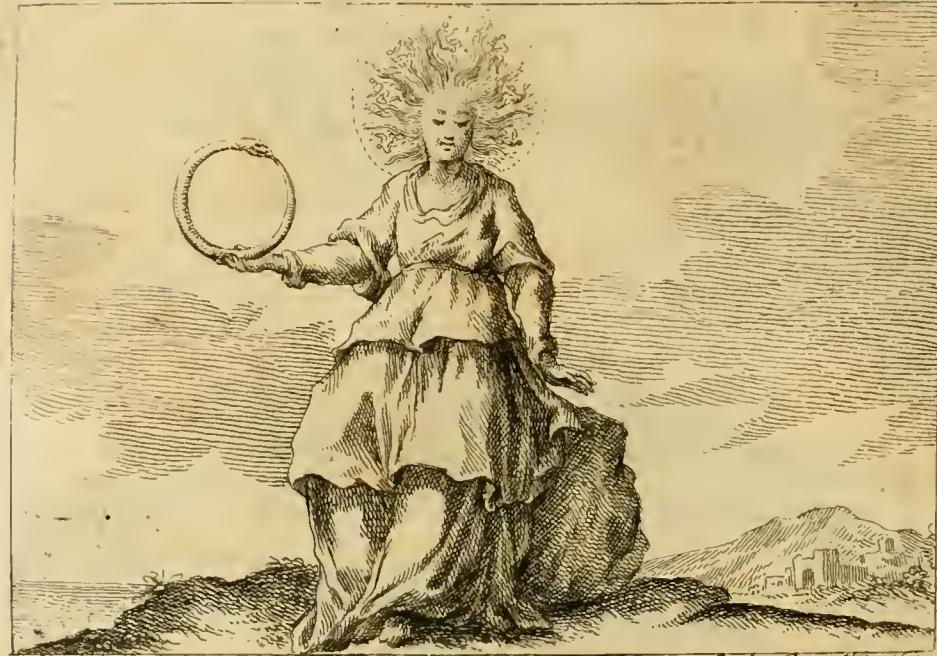

# 세계의 기계 (Macchina del Mondo)

## 질문

리파는 '세계의 기계(Macchina del Mondo)'를 어떻게 의인화했는가?

## 답

머리 둘레에 일곱 행성의 궤도가 돌고 머리카락 대신 불꽃이 타오르는 여인이다. 옷은 세 부분·세 색으로 나뉘는데, 가슴 쪽은 구름 있는 하늘색, 가운데는 물결 있는 청색, 발까지는 산·도시·성이 그려진 초록색이며, 손에는 제 꼬리를 문 채 원을 이룬 뱀을 든다.

---

## 원본 판화



판화에서 실제로 확인되는 것들:

- **불꽃 머리카락**: 머리에서 사방으로 뻗어 나온 것은 머리카락이 아니라 물결치듯 굽은 불꽃 혀들이다.
- **일곱 행성의 궤도**: 그 불꽃 다발 바깥으로 점선의 원호가 후광처럼 머리를 감싸며 돌고 있다. 흑백 판화라 일곱 개를 세기는 어렵지만, 텍스트가 말하는 "머리 둘레를 도는 일곱 행성의 궤도(i giri de sette Pianeti)"를 점선 궤도로 옮긴 것이다.
- **우로보로스**: 오른손을 앞으로 뻗어 들고 있는 것이 제 꼬리를 입에 문 뱀의 고리다. 손에 잡힌 채 완전한 원을 이루고 있어, 원 자체가 상징의 핵심임을 보여준다.
- **세 겹으로 나뉜 옷**: 가슴을 덮는 상의, 허리에서 갈라지는 중간 단, 발까지 내려오는 긴 치맛단이 뚜렷하게 세 층으로 구분된다. 채색본에서는 이 세 층이 각각 하늘색·청색·초록색이 되지만, 판화에서는 층마다 다른 밀도의 해칭(치맛단은 비늘처럼 촘촘한 교차 해칭)으로 색의 차이를 대신한다.
- **배경이 옷의 프로그램을 되풀이한다**: 하늘 전체가 가로 해칭의 구름으로 덮여 있고, 오른쪽 아래에는 언덕과 그 위의 성벽·건물 무리(산·도시·성)가 그려져 있다. 즉 인물의 옷에 압축된 세계가 인물이 서 있는 풍경에서도 한 번 더 반복된다.

---

## 원문(이탈리아어)과 대응

> Donna, che abbia intorno al capo i giri de sette Pianeti; ed in luogo di capelli saranno fiamme di fuoco. Il suo vestimento sarà compartito in tre parti, e di tre colori. Il primo che cuopre il petto, e parte del corpo sarà azzurro, con nuvoli. Il secondo ceruleo, con onde di acqua. Il terzo fino a piedi, sarà verde con Monti, Città, e Castelli. Terrà in una mano la Serpe rivolta in circolo, che si tenga la coda in bocca.

| 요소 | 원문 | 대응 |
|---|---|---|
| 머리 둘레 | i giri de sette Pianeti | 일곱 행성의 궤도 = 천구(天球)의 회전 |
| 머리카락 | in luogo di capelli … fiamme di fuoco | 불의 원소 |
| 옷 1단 (가슴·상체) | azzurro, con nuvoli | 구름 있는 하늘색 = 공기 |
| 옷 2단 (가운데) | ceruleo, con onde di acqua | 물결 있는 청색 = 물 |
| 옷 3단 (발까지) | verde con Monti, Città, e Castelli | 산·도시·성이 있는 초록 = 흙(대지) |
| 손 | Serpe rivolta in circolo … coda in bocca | 우로보로스 = 순환하는 시간·자기충족 |

## 리파 자신의 해설

리파는 도상을 나열한 뒤 곧바로 두 가지 의미를 붙인다.

**1) 뱀의 원 = 세계의 자기충족성과 순환운동.**

> "세계는 스스로에 의해 스스로를 먹여 살리고, 자기 안에서 자기 자신에 의해 돌아간다. 언제나 절제되고 질서 있는 운동으로, 시작은 끝을 뒤따르고 끝은 다시 자신의 시작으로 돌아온다. 이 때문에 일곱 행성도 함께 그려진다."

- 우주는 외부에서 연료를 공급받지 않는 자족적 기계다(`da se stesso, e per se stesso si nutrisce`).
- 그 운동은 무작위가 아니라 **temperato e ordinato**(절제되고 질서 있는) 운동이다 — '기계(macchina)'라는 말이 규칙적 작동을 함축한다.
- 시작과 끝이 맞물리는 원환적 시간을 뱀의 고리가, 그 규칙적 주기성을 행성 궤도가 각각 표현한다. 그래서 우로보로스와 일곱 궤도는 같은 뜻을 두 번 말하는 장치다.

**2) 불꽃과 옷의 세 색 = 4원소.**

> "머리 위의 불과 옷의 색은 네 원소를 뜻하니, 이는 저 거대한 보편적 기계의 더 작은 부분들이다."

즉 위에서 아래로 **불 → 공기 → 물 → 흙** 순서로 배열된 고전적 원소 위계가 인물의 신체를 따라 수직으로 쌓여 있다. 머리에서 발끝까지 훑어 내려가는 것이 곧 우주의 단면도를 위에서 아래로 읽는 것이 된다. 그리고 그 4원소는 우주 전체가 아니라 그것의 "더 작은 부분들(le parti minori)"일 뿐이라는 단서가 붙는다 — 원소계 위에 행성 천구가 얹혀야 비로소 '세계의 기계' 전체가 된다.

## 우로보로스에 대한 리파의 다른 설명 (교차 참조)

같은 책의 **MONDO(세계)** 항목(피에리오 발레리아노의 『상형문자 주해』를 따른 판본)에서 리파는 이 뱀 상징을 더 자세히 풀어 놓는다. 이집트인들이 '세계'를 쓰려 할 때 제 꼬리를 삼키는 뱀을 그렸는데,

- 뱀의 몸에 새겨진 **여러 종류의 비늘**은 세계의 별들을 뜻하고,
- 이 동물이 **무겁다**는 점에서 대지의 거대함을,
- **미끄럽다**는 점에서 물과의 유사성을,
- **해마다 늙은 껍질을 벗는다**는 점에서 시간이 세계를 매년 갱신해 다시 젊어지게 함을,
- **제 몸을 먹이로 삼는다**는 점에서 세계 안의 모든 것이 신의 섭리로 통치됨을 뜻한다.

이 해설을 겹쳐 읽으면, Macchina del Mondo의 손에 들린 고리 하나에 이미 별·흙·물·시간의 순환이 함께 접혀 있음을 알 수 있다. 참고로 MONDO 항목의 의인화는 이 카드의 도상과 **다르다**: 그쪽은 여러 색의 긴 옷을 입고 머리에 황금 천구를 얹은 **남성상**이다(황금 구체 = 하늘과 그 원운동, 여러 색 옷 = 4원소). 혼동하지 않도록 주의.

## 외우기 위한 정리

머리부터 발끝까지 **위에서 아래로** 읽으면 그대로 우주 구조다.

```
머리 둘레  … 일곱 행성의 궤도      (천구)
머리카락   … 불꽃                  (불)
가슴 쪽    … 하늘색 + 구름         (공기)
가운데     … 청색 + 물결           (물)
발까지     … 초록 + 산·도시·성     (흙)
손         … 꼬리를 문 뱀의 원      (영원한 순환 / 자기충족)
```
