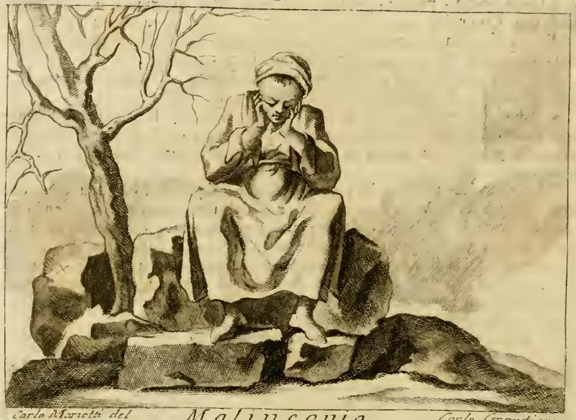

# 우울(Malinconia) — 리파의 의인화

> **질문** 리파는 '우울(Malinconia)'을 어떻게 의인화했는가?
>
> **답** 슬프고 고통스러운 표정의 노파가 장식 없는 남루한 옷을 입고 바위에 앉아, 팔꿈치를 무릎에 대고 두 손으로 턱을 괸 모습이다. 곁에는 바위들 사이 잎사귀 없는 나무가 서 있다.

---

## 1. 원본 도판

『이코놀로지아』 제4권 「MALINCONIA」 항목의 도판이다. 그림에서 실제로 확인되는 요소를 답안과 하나씩 맞춰 보면:

| 그림에서 보이는 것 | 리파 원문의 지시 |
|---|---|
| 머리를 천으로 감싼 **늙은 여인**이 홀로 앉아 있다 | `Donna vecchia` (노파) |
| 고개를 푹 숙이고 눈을 내리깐 **침울한 얼굴** | `mesta, e dogliosa` (슬프고 고통스러운) |
| 장식·자수·보석이 전혀 없는 **헐렁한 자루 같은 옷**, 맨발이 드러난다 | `di brutti panni vestita, senz'alcun ornamento` (남루한 옷, 장식 없음) |
| 넓적한 **바위 덩어리 위에 걸터앉아** 있고, 발밑에도 바위가 깔려 있다 | `Starà a sedere sopra un sasso` (바위에 앉아) |
| **팔꿈치를 무릎에 얹고**, 두 손을 뺨·턱 아래에 붙여 머리를 받치고 있다 | `con gomiti posati sopra i ginocchi, ed ambe le mani sotto il mento` |
| 왼쪽에 **잎이 하나도 없는 마른 나무**가 바위 틈에서 솟아 있다 | `un albero senza fronde, e fra i sassi` (바위들 사이 잎 없는 나무) |
| 배경은 흐릿하게 비어 있어 인물의 고립이 강조된다 | — (원문에 지시 없음, 판화가의 처리) |

> 참고: 원문은 나무가 "곁에(accanto)" 있다고만 하고 좌우를 지정하지 않는다. 판화 재현본은 좌우가 뒤집혀 실리는 경우가 있으므로 나무의 좌/우 위치는 암기 포인트가 아니다. 판 아래에는 화가·판각자 서명(`Carlo Marietti del.` / `Carlo Grandi`)과 표제 `MALINCONIA`가 있다.

---

## 2. 리파의 원문과 번역

아래 이탈리아어는 자산 텍스트(18세기 판, 페루자 『TOMO QUARTO』)를 옮긴 것이다. 원본은 긴 s(ſ)를 쓰기 때문에 OCR에서 `f`로 읽히는데(`fopra un fallo` → `sopra un sasso`), 여기서는 현대 표기로 정규화했다.

### (1) 도상 지시 — 답안의 근거 문장

> **Donna vecchia, mesta, e dogliosa, di brutti panni vestita, senz'alcun ornamento. Starà a sedere sopra un sasso, con gomiti posati sopra i ginocchi, ed ambe le mani sotto il mento: e vi sarà accanto un albero senza fronde, e fra i sassi.**
>
> "슬프고 고통에 찬 노파가, 남루한 천을 걸치고 아무런 장식도 없다. 바위 위에 앉되 팔꿈치는 무릎에 얹고 두 손은 턱 아래에 받친다. 그 곁에는 잎이 없는 나무가 바위들 사이에 있다."

### (2) 겨울 나무의 비유

> **Fa la malinconia dell'Uomo quegli effetti istessi, che fa la forza del vento negli alberi, e nelle piante, i quali agitati da diversi venti, tormentati dal freddo, e ricoperti dalle nevi, appariscono secchi, sterili, nudi, e di vilissimo prezzo… Vanno essi sempre col pensiero nelle cose difficili, le quali se gli fingono presenti, e reali; il che mostrano i segni della mestizia, e del dolore.**
>
> "우울은 사람에게, 바람의 힘이 나무와 초목에 일으키는 것과 똑같은 결과를 낸다. 여러 바람에 흔들리고 추위에 시달리며 눈에 덮인 나무들은 마르고, 열매 없고, 헐벗고, 아주 값없어 보인다. … 우울한 이들은 늘 어려운 일만 생각하며 그것을 이미 닥친 현실인 양 상상하는데, 그 표시가 바로 **슬픔(mestizia)과 고통(dolore)의 징표**다."

→ **표정**이 왜 "슬프고 고통스러운"지의 근거. 실제로 닥치지 않은 불행을 미리 실재하는 것으로 상상하는 상태다.

### (3) 왜 '노파'인가

> **Vecchia si dipinge, perciocché è ordinario de' Giovani essere allegri, ed i Vecchi malinconici: però ben disse Virgilio nel 6. / "Pallentes habitant morbi, tristisque senectus."**
>
> "노파로 그리는 것은, 젊은이는 유쾌하고 노인은 우울한 것이 통례이기 때문이다. 베르길리우스가 제6권에서 잘 말했다 — **'창백한 질병들과 슬픈 노년이 거기 산다.'**"

인용은 『아이네이스』 6권 275행, 저승 입구에 도열한 의인화된 재앙들(질병·노년·공포·죽음)의 목록이다.

### (4) 왜 '남루하고 장식 없는 옷'인가

> **È mal vestita, e senza ornamento, per la conformità degli alberi senza foglie, e senza frutti; non alzando mai tanto l'animo il Malinconico, che pensi a procurarsi le comodità, per stare in continua cura di sfuggire, o provveder a' mali, che s'immagini esser vicini.**
>
> "잎도 열매도 없는 나무와 **부합하도록(conformità)** 헐벗게 입고 장식이 없다. 우울한 사람은 자기 몸의 안락을 챙길 만큼 기운을 내는 일이 없고, 다가온다고 상상하는 재앙을 피하거나 대비하는 근심에만 계속 매여 있기 때문이다."

→ **옷과 나무는 같은 뜻을 두 번 말하는 짝**이다. 헐벗은 옷 = 잎 없는 나무.

### (5) 왜 '바위'인가

> **Il sasso medesimamente ove si posa dimostra, che il Malinconico è duro, sterile di parole, e di opere, per sé, e per gli altri; come il sasso, che non produce erba, né lascia, che la produca la terra, che gli sta sotto…**
>
> "앉아 있는 바위 역시 우울한 사람이 **딱딱하고(duro)**, 자신에게도 남에게도 **말과 행위가 불모(sterile)**임을 보여준다. 바위는 풀을 내지 않고, 제 아래 땅이 풀을 내는 것도 막기 때문이다."

### (6) 반전 — 겨울이 지나면

> **…ma sebbene pare oziosa al tempo del suo Verno nelle azioni Politiche, al tempo nondimeno della Primavera, che si scuopre nelle necessità degli Uomini sapienti, i Malinconici sono trovati, ed esperimentati sapientissimi, e giudiziosissimi.**
>
> "그러나 정치적 활동의 '겨울'에는 게을러 보여도, 지혜로운 사람이 필요해지는 '봄'이 오면 우울한 이들이야말로 **가장 지혜롭고 가장 판단력 있는** 자로 발견되고 증명된다."

항목 끝에는 `De' Fatti, vedi Affanno`("실례는 '고뇌(Affanno)' 항목을 보라")라는 상호 참조가 붙는다.

---

## 3. 4체액설 — 이 도상을 결정한 논리

고대 의학(히포크라테스–갈레노스)의 4체액설은 혈액(sanguis)·점액(phlegma)·황담즙(flava bilis)·흑담즙(atra bilis / μέλαινα χολή)을 성질의 짝으로 배치한다.

| 체액 | 기질 | 성질 | 원소 | 계절 | 연령 |
|---|---|---|---|---|---|
| 혈액 | 다혈(sanguine) | 따뜻+습함 | 공기 | 봄 | 유년 |
| 황담즙 | 담즙(choleric) | 따뜻+건조 | 불 | 여름 | 청년 |
| **흑담즙** | **우울(melancholic)** | **차가움+건조함** | **흙(terra)** | **가을·겨울** | **노년** |
| 점액 | 점액(phlegmatic) | 차가움+습함 | 물 | 겨울 | 노년 |

`melancholia`라는 말 자체가 그리스어 **μέλας(검은) + χολή(담즙)** = "검은 담즙"이다. 리파의 도상 요소는 이 **"차갑고 건조함(frigidum et siccum)"** 한 축에서 거의 기계적으로 연역된다.

- **노파** — 노년은 체액론에서 열과 습기가 빠져나간 시기, 곧 차갑고 건조한 나이다. 그래서 우울은 청년이 아니라 노인의 얼굴을 가진다. (2)의 베르길리우스 인용이 이 연결을 권위로 못 박는다.
- **바위** — 흑담즙에 대응하는 원소는 **흙**이고, 흙 중에서도 가장 차갑고 건조하고 무거운 극한이 돌이다. 풀을 못 내는 불모성 = 흑담즙의 생성력 없음. 앉을 자리가 방석이 아니라 돌인 것도 온기의 부재다.
- **잎 없는 나무** — 흑담즙의 계절은 가을·겨울이다. 추위와 건조가 수액을 거두어 잎을 떨군 나무는 "차갑고 건조함"의 식물 버전이다. 리파는 (2)에서 우울의 작용을 아예 겨울바람의 작용과 **동일한 것(quegli effetti istessi)**이라고 선언한다.
- **남루하고 장식 없는 옷** — (4)에서 명시적으로 잎·열매 없는 나무와의 "부합"으로 설명된다. 건조·불모의 시각적 반복.
- **숙인 머리와 두 손으로 턱을 괸 자세** — 무거움(gravitas)·하강. 흑담즙은 가장 무거운 체액이어서 몸과 시선을 아래로 끌어내린다. 팔꿈치가 무릎에 닿고 머리가 손에 실린 이 접힌 자세는 "위로 향하는 기운(animo)을 결코 들어 올리지 않는다"는 (4)의 서술과 정확히 짝을 이룬다.

즉 **하나의 성질(차갑고 건조함)이 나이·재료·계절·자세 네 층위에서 반복 번역된 것**이 이 판화다. 도상을 요소별로 따로 외우기보다 "차갑고 건조함"에서 되풀어 내는 편이 빠르다.

---

## 4. 도상 전통 — 뒤러 「Melencolia I」(1514)와의 비교

머리를 손에 받친 자세는 리파의 발명이 아니라 중세부터 내려온 **멜랑콜리아의 정형 자세**다.

- 뒤러의 동판화 「Melencolia I」에서 날개 달린 여성 인물은 **돌계단(석조)에 앉아 왼주먹에 머리를 기댄** 채 침울한 표정을 짓고 있다. 이 자세는 사색으로의 침잠과 동시에 **행동 불능**을 나타내는 관습적 기호로 읽힌다.
- 이 관습의 뿌리는 중세 도덕신학의 **acedia(나태·영적 무기력)** 도상이다. 멜랑콜리아 기질은 7죄종의 하나인 나태(sloth)와 결부되어, 손으로 머리를 받치고 주저앉은 인물로 그려졌다.
- 뒤러 시대에는 여기에 르네상스 신플라톤주의의 재평가가 겹친다. 아그리파 『De occulta philosophia』(1531)는 멜랑콜리를 세 등급으로 나누고 상상력에 관계된 첫 등급을 예술가의 것으로 보았으며, 철학자·시인·예술가가 본질적으로 멜랑콜리커라는 관념이 퍼졌다. 그래서 뒤러의 판화는 우울을 **천재의 표지**로 해석한다.

**리파와의 대조점**

| | 뒤러 「Melencolia I」 | 리파 「Malinconia」 |
|---|---|---|
| 인물 | 날개 달린 젊은 여성(천사적 존재) | 날개 없는 **노파** |
| 앉은 자리 | 석조 계단 | **자연석(바위)** |
| 자세 | **한 손(왼주먹)**에 뺨을 기댐 | **두 손**을 턱 아래에 받치고 팔꿈치는 무릎에 |
| 주변 | 컴퍼스·다면체·모래시계·마방진 등 기하·측량 도구 다수 | **잎 없는 나무와 바위**뿐, 도구 없음 |
| 의미 축 | 창조적 천재의 좌절, 학문적 우울 | 체액론적 기질과 **불모·경직**, 다만 끝에서 "지혜로움"으로 반전 |

리파는 화려한 지물(attribute)을 걷어내고 **자연 상징(돌·마른 나무)과 육체의 자세**만으로 기질을 말한다는 점에서, 도구로 가득한 뒤러의 화면과 반대 방향의 절제를 보인다. 그러면서도 "봄이 오면 가장 지혜롭다"는 마지막 문단에서 뒤러가 속했던 **우울=지적 우월성**이라는 르네상스적 재평가와 같은 결론에 도착한다.

**리파 내부의 인접 도상** — 같은 책의 「생각(Pensier)」 항목은 `UOmo vecchio, pallido, magro, e malinconico… Avrà appoggiata la guancia sopra la sinistra mano`("늙고 창백하고 마르고 우울한 남자… 뺨을 왼손에 기대고 있다")로, 뒤러 쪽에 더 가까운 **한 손 버전**이다. 「Malinconia」의 변별점은 **두 손 + 팔꿈치를 무릎에** 라는 완전히 접힌 자세임을 함께 기억하면 두 항목이 섞이지 않는다.

---

## 5. 암기 정리

1. **누구** — 노파(vecchia), 슬프고 고통스러운 표정(mesta e dogliosa)
2. **무엇을 입고** — 남루한 천, 장식 전무(senz'alcun ornamento)
3. **어디에** — 바위 위에 앉아(sopra un sasso)
4. **어떤 자세** — 팔꿈치는 무릎에, **두 손**은 턱 아래
5. **곁에** — 바위들 사이 **잎 없는 나무**(albero senza fronde)

한 줄 열쇠: **"흑담즙 = 차갑고 건조함"** → 늙음 · 돌 · 겨울나무 · 접힌 몸.

---

### 출처

- 자산: `.fm/assets/03 Machine of the World to Marriage.md` 「ICONOLOGIA MALINCONIA」 항목 및 판화 `_page_77_Picture_2.jpeg`
- 인접 항목: `.fm/assets/15 Madness to Stubbornness.md` 「Pensier」
- [Melencolia I — Wikipedia](https://en.wikipedia.org/wiki/Melencolia_I)
- [Melencolia I — National Gallery of Art](https://www.nga.gov/artworks/6640-melencolia-i)
- [Albrecht Dürer, Melencolia I, 1514 — Kemper Art Museum](https://www.kemperartmuseum.wustl.edu/research/artwork-essays/durer-albrecht-melencolia-i-1514)
- [Malinconia 1611 — Allegorie di Cesare Ripa (Univ. di Pisa)](https://limes.cfs.unipi.it/allegorieripa/malinconia-1611/)
- [Representing the atra bilis: the 'Said' and 'Unsaid' of the Melancholic in Cesare Ripa's Iconologia](https://www.researchgate.net/publication/387355113_Representing_the_altra_bilis_the_'Said'_and_'Unsaid'_of_the_Melancholic_in_Cesare_Ripa's_Iconologia)
- [The Demon of Melancholy — Brown University Library](https://library.brown.edu/cds/melancholy/humanism.html)
