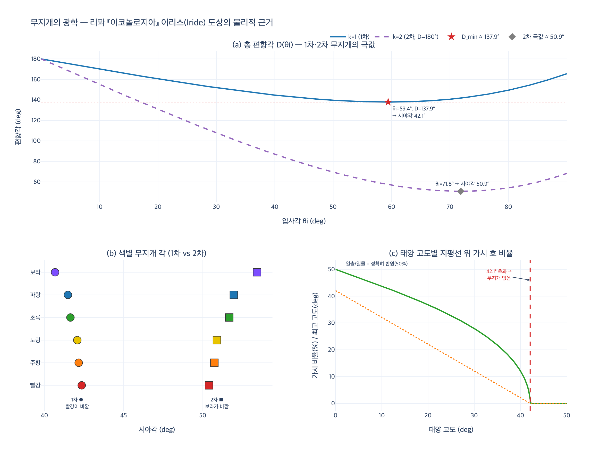

# 공기의 님프 이리스(Iride, 무지개)

> **Q.** 공기의 님프 이리스(Iride, 무지개)의 도상은?
>
> **A.** 자주·보라·파랑·초록의 여러 층 날개를 반원 모양으로 펼친 소녀로, 머리카락은 안개와 잔 물방울로 얼굴과 가슴에 흩어지고 무릎 아래는 구름에 가려 보이지 않으며 오른손에 청색 붓꽃(giglio ceruleo)을 든다. 무릎 아래가 안 보이는 것은 무지개가 완전한 원이 되지 못하기 때문이고, 잔 물방울 머리는 무지개에 꼭 필요한 가랑비를 뜻한다. 유노의 전령으로 비 또는 갬을 예고한다.

---

## 1. 원문 확인

이 카드는 『이코놀로지아』의 **NINFE DELL'ARIA(공기의 님프)** 절, 그 첫 항목 **Iride** 에서 나왔다.
공기의 님프 절은 `Iride` → `Serenità del Giorno`(낮의 갬) → `Serenità della Notte`(밤의 갬) → `Pioggia`(비) 순으로 이어지며,
바로 앞은 바다의 님프 **Nereidi**(반신반어) 항목이다. 즉 리파는 님프를 **물 → 공기**로 배열하고, 공기 님프의 맨 앞에 무지개를 놓았다.

### 1-1. 도상 규정(descrizione)

원문(18세기 판본, 인쇄·OCR 상태가 나쁜 부분은 대괄호로 보충):

> UNa Fanciulla colle ali ſpiegate in forma di un mezzo cerchio, le quali fieno di **diverſi ordini**, cioè di **porpora, pavonazzo, azzurro, verde**, e che le chiome ſieno ſparſe avanti il volto, il petto in forma di **nebbia, e gocciole minute di acqua**, che cadono per la perſona, fra le quali ſi vedano varj colori miſchiati del veſtimento; **dal ginocchio in giù da nuvole, ed aere caliginoſo coperta**; e colla mano deſtra tenga un **giglio ceruleo**.

번역:

> 날개를 **반원 모양**으로 펼친 소녀. 날개는 **여러 층(diversi ordini)**으로 되어 있어, 곧 **자주(porpora)·보라(pavonazzo)·파랑(azzurro)·초록(verde)**이다. 머리카락은 얼굴 앞으로 흩어져 있고, 가슴은 **안개와 잔 물방울** 모양이며 그것이 몸을 따라 떨어지는데, 그 사이로 옷의 여러 색이 섞여 보인다. **무릎 아래는 구름과 흐린 안개 낀 공기(aere caliginoso)로 덮여** 있다. 오른손에는 **청색 붓꽃(giglio ceruleo)**을 든다.

**놓치기 쉬운 세부 두 가지**

- 날개가 "여러 색"이 아니라 **`diversi ordini`(서로 다른 층·열)**로 되어 있다는 점. 깃털 열(row)마다 색이 다르다는 뜻이고, 이것이 무지개의 **색 띠(band)**를 도상으로 옮긴 장치다.
- 물방울 사이로 **"옷의 여러 색이 섞여 보인다"**. 즉 색은 날개에만 있는 게 아니라 물방울 커튼 뒤 옷에서도 어른거린다 — 무지개가 "물방울을 통해 보이는 색"이라는 관찰의 반영이다.

### 1-2. 해설(dichiarazione)에서 리파 본인이 붙인 우의

원문 해설부를 항목별로 정리하면 이렇다.

| 도상 요소 | 리파가 붙인 뜻 (원문 근거) |
|---|---|
| **소녀 + 날개** | 코르누투스(`Fornuto`, *De natura deorum* 1권)가 시인들이 이리스를 **"빠른 자, 신들 특히 유노(Giunone)의 전령"**이라 불렀다고 전한다. 그러므로 **날개 달린 소녀**로 그린다. |
| **전령이라는 성격** | "혹은 이렇게 말하고 싶다 — 그녀가 전령인 것은 **다가올 비 또는 갬(pioggia, o serenità)을 미리 알리는 자**이기 때문이다." |
| **날개의 색층** | "날개의 색면들은 **무지개에서 보이는 색들을 나타내기 위한 것**이다." |
| **안개·잔 물방울 머리카락** | "안개와 잔 물방울로 표현한 머리카락은 **그것 없이는 무지개가 생기지 않는 그 가랑비(minuta pioggia)를 보여 준다**." |
| **무릎 아래가 안 보임** | "이 도상이 무릎 아래로 보이지 않는 것은, **무지개가 결코 완전한 원(circolo perfetto)이 아니기 때문이다**." |
| **청색 붓꽃** | "손에 든 파란 백합(`giglio turchino`)은 **무지개가 지닌 여러 색 때문에 그녀에게 어울린다**. 그래서 그것은 **Iris**라 불린다." |

마지막 항목이 이 카드의 핵심 언어유희다(→ §4).

> **판본 주의.** 규정부에서는 `giglio **ceruleo**`(하늘색), 해설부에서는 `giglio **turchino**`(짙은 파랑)로 표기가 흔들린다. 같은 꽃을 가리키는 서로 다른 색 이름이며, 이 판본이 여러 세대의 증보를 겹쳐 쌓았음을 보여주는 흔적이다. 앞뒤 항목에 프랑스인 **Boudard**(J.-B. Boudard, *Iconologie*, Parma 1759)가 인용되고 본문에 `TOMO QUARTO`가 나오는 것으로 보아, 이 텍스트는 리파 원본(1593 초판, 1603 도판판)이 아니라 **체사레 오를란디(Cesare Orlandi)가 증보한 페루자 판(1764~67, 전 5권)** 계열이다.

### 1-3. 도판

이 절(공기의 님프)에는 **판화가 없다**. asset의 `09 Music to Nymphs.md`에서 이미지 참조는 378행에서 끝나고 Iride 항목은 484행부터 시작한다 — 그 사이에 도판이 없다. 마지막 참조 이미지(`_page_228_Picture_15.jpeg`)는 장식 띠(ornamental band)로, 이리스 도상이 아니다. 그래서 이 힌트에는 원본 도판을 싣지 않았다.

---

## 2. 이리스 신화 — 무지개는 "길"이다

### 2-1. 계보와 직무

- **헤시오도스 『신들의 계보』 780행 전후**: 이리스는 **타우마스(Thaumas, "놀라움")와 엘렉트라(Electra, "빛나는 자")의 딸**이며 하르피이아들의 자매다. 이름 자체가 "경이"와 "번쩍임"의 결합이다.
- 그래서 리파가 인용한 시구의 첫 단어가 **`Thaumantis proles`("타우마스의 자손")**이다.
- 호메로스에서 이리스는 주로 **제우스의 전령**이다(『일리아스』 2.786, 8.398, 24.77 등). 헤르메스가 신-인간 사이 전령이라면, 이리스는 **신-신, 특히 올림포스에서 지상으로 내려오는 하강 방향**의 전령이다.
- 후대(특히 로마 시)에서 이리스는 **유노(헤라)의 전속 시녀·전령**으로 고정된다. 리파의 "유노의 님프"는 이 로마적 전통을 따른다.

### 2-2. 핵심 관념: 무지개 = 하늘과 땅을 잇는 통로

무지개를 색현상이 아니라 **길(via)** 로 본 것이 고대의 발상이다. 리파가 직접 인용한 『아이네이스』 5권(5.606~610, 유노가 트로이아 함대를 태우라고 이리스를 보내는 장면)을 보라.

> Irim de caelo misit Saturnia Iuno
> Iliacam ad classem, ventosque aspirat eunti,
> multa movens necdum antiquum saturata dolorem.
> **illa viam celerans per mille coloribus arcum**
> nulli visa cito decurrit tramite virgo.
>
> (사투르누스의 딸 유노가 하늘에서 이리스를 트로이아 함대로 보내고, 가는 그에게 바람을 불어 주었다. …
> **그 처녀는 천 가지 색의 활(arcum)을 통해 길을 재촉하여**, 아무에게도 보이지 않고 빠른 지름길로 달려 내려갔다.)

`viam ... per arcum` — **호(arc)를 통과하는 길**이다. 무지개는 신이 내려오는 사면로(斜面路)이고, 이리스는 그 길 자체와 동일시된다.

### 2-3. 『아이네이스』 4권 — 디도의 죽음

카드에는 없지만 이리스 도상을 이해하는 데 가장 중요한 장면이다. 디도가 자결하고도 숨이 끊기지 않아 괴로워할 때, 유노가 이리스를 보낸다(4.693~705).

> Tum Iuno omnipotens longum miserata dolorem
> difficilisque obitus Irim demisit Olympo
> quae luctantem animam nexosque resolveret artus.
> …
> **Ergo Iris croceis per caelum roscida pennis,**
> **mille trahens varios adverso sole colores,**
> devolat et supra caput astitit. 'hunc ego Diti
> sacrum iussa fero teque isto corpore solvo.'
>
> (전능한 유노가 그 긴 고통과 힘겨운 죽음을 불쌍히 여겨, 발버둥치는 영혼과 얽힌 사지를 풀어 주도록 올림포스에서 이리스를 내려보냈다. …
> **그리하여 이리스는 사프란빛 날개로, 이슬에 젖어(roscida), 마주한 태양에서 천 가지 색을 끌어당기며** 하늘을 날아 내려와 머리 위에 섰다. "명령을 받아 나는 이것을 디스에게 봉헌하고, 그대를 이 몸에서 풀어 주노라.")

이 짧은 대목에 리파 도상의 **거의 모든 요소의 원형**이 있다.

| 베르길리우스 | 리파의 도상 |
|---|---|
| `roscida` (이슬에 젖은) | 안개와 **잔 물방울**로 된 머리카락, 몸을 따라 떨어지는 물방울 |
| `mille ... varios colores` (천 가지 다양한 색) | 여러 층(`diversi ordini`)의 색 날개 |
| `adverso sole` (**마주한 태양에서** 색을 끌어옴) | 무지개가 태양 **반대편**에 선다는 정확한 관찰. §6의 "태양 반대점(antisolar point)" 기하학이 바로 이것이다 |
| `pennis` (날개로) | 펼친 날개 |
| 유노가 보냄 / 죽음과 해방을 매개 | "유노의 전령", 비와 갬을 **예고**하는 자 |

특히 `adverso sole`는 대단하다. 시인은 광학을 몰랐지만 **무지개는 반드시 태양을 등지고 봐야 보인다**는 사실을 한 단어로 못박았다.

### 2-4. 창세기 9장의 무지개와의 대조

같은 현상을 놓고 히브리 전통은 정반대 방향의 의미를 부여했다.

> 내가 내 무지개를 구름 속에 두었나니 이것이 나와 세상 사이의 언약의 증거니라. …
> 무지개가 구름 사이에 있으리니 내가 보고 나와 … 모든 육체 있는 모든 생물 사이의 영원한 언약을 기억하리라. — 창세기 9:13~16

| | 그리스·로마 | 창세기 9장 |
|---|---|---|
| 무지개의 정체 | **길** — 신이 내려오는 통로 | **활(케셋, קֶשֶׁת)** — 신이 내려놓은 무기 |
| 방향 | 하늘 → 땅 (전령의 하강) | 하늘에 **걸어둔** 표지 (정지) |
| 기능 | **예고**: 비가 올지 갤지 알린다 (가변적) | **언약**: 다시는 홍수로 멸하지 않는다 (불변) |
| 인격성 | **인격신 이리스** = 무지개 자체 | 비인격 **징표**. 무지개는 신이 아니다 |
| 감정 | 유노의 분노·연민의 심부름 | 진노가 그친 표시 |

히브리어 `케셋`은 전쟁 활을 뜻하는 그 단어다. 즉 **"신이 활을 내려놓고 활시위를 땅이 아니라 하늘로 돌려놓았다"**는 무장해제의 이미지다. 그리스가 무지개를 **동사(내려오다)**로 읽었다면, 성서는 **명사(놓아둔 무기)**로 읽었다.

리파의 이리스는 어느 쪽인가? **그리스·로마 쪽이다.** 리파는 무지개를 언약의 증표가 아니라 **"비 또는 갬을 미리 알리는 자(prenuncia)"**, 곧 일기 예보관으로 정의한다. 실제로 이 판본에서 `Iride` 바로 다음에 오는 항목이 `Serenità del Giorno`(갬)와 `Pioggia`(비)다 — **편집 배열 자체가 "무지개는 비냐 갬이냐의 갈림길"이라는 해석을 보여 준다.** 다만 리파가 활동한 대항종교개혁기 이탈리아에서 화가가 그 무지개를 그릴 때, 감상자가 창세기의 언약을 겹쳐 읽는 것을 막을 방법은 없었다.

---

## 3. 도상 요소별 우의 — 하나씩

### (1) 반원으로 펼친 여러 층 날개

- **`in forma di un mezzo cerchio`(반원 모양)**: 새의 날개는 원래 좌우로 뻗지만, 이리스의 날개는 **위로 활처럼 휘어 반원을 그린다**. 인체 위에 무지개의 **호(arc)** 를 얹은 것이다.
- **`diversi ordini`(여러 층)**: 깃털을 여러 열로 나눠 열마다 다른 색을 칠한다. 무지개의 **색 띠**가 곧 날개의 깃털 열이 된다. 이는 리파 도상학의 전형적 번역 방식이다 — 자연현상의 **구조**(동심 색 띠)를 신체 부속의 **구조**(깃털 열)로 옮긴다.
- 왜 하필 날개인가? 이리스는 "빠른 전령"이다. 날개는 **속도**와 **색 띠**를 동시에 처리하는 일석이조의 지물이다.

### (2) 안개와 잔 물방울로 된 머리카락

- 리파의 설명은 놀랍도록 정확하다: **"그것 없이는 무지개가 생기지 않는 그 가랑비"**. 무지개의 필요조건이 **물방울**임을 명시한 것이다.
- 왜 **머리카락**인가? 머리카락은 얼굴 **앞으로** 흩어져 있다(`sparse avanti il volto`). 즉 관찰자와 얼굴 사이에 **물방울 커튼**이 놓인다. 무지개가 "물방울 커튼을 통해 본 태양광"이라는 구조를 도상으로 재현한 것이다. 그래서 그 사이로 "옷의 여러 색이 섞여 보인다".
- `nebbia`(안개)와 `gocciole minute`(잔 물방울)를 구분한 것도 정밀하다. 실제로 **물방울이 작아질수록** 색이 겹쳐 흐려지고 극한에서는 흰 무지개(fogbow)가 된다. 리파는 이유를 몰랐지만 "안개와 잔 물방울"을 함께 적었다.

### (3) 무릎 아래를 가린 구름과 흐린 공기

- 리파의 설명: **"무지개는 결코 완전한 원이 아니기 때문"**.
- 도상학적으로 이것은 매우 드문 장치다. 대부분의 의인상은 "무엇을 **가지고** 있는가"로 뜻을 만든다. 이리스는 **"무엇이 보이지 않는가"로 뜻을 만든다.** 결여(缺如) 자체가 지물인 것이다.
- 그 결여는 정확히 **지평선**에 대응한다. 무지개의 아래 절반은 땅에 가려 보이지 않고, 이리스의 아래 절반은 구름에 가려 보이지 않는다. **인체의 절단선 = 지평선.**
- `aere caliginoso`(흐린·연무 낀 공기)까지 덧붙인 것은, 무지개 아랫부분이 대기 중 연무 때문에 흐릿하게 사라져 가는 실제 모습의 반영이다.

### (4) 오른손의 청색 붓꽃 `giglio ceruleo`

리파의 논리는 **이중 언어유희**다.

1. **이름의 일치**: 그리스어 **ἶρις(iris)** 는 ① 무지개 ② **붓꽃**을 동시에 뜻한다. 붓꽃이 그 이름을 얻은 이유는 **꽃 색이 무지개처럼 다양하기** 때문이다. 리파의 문장 그대로: "무지개가 지닌 여러 색 때문에 그녀에게 어울린다. **그래서 그것은 Iris라 불린다**(onde è detto Iris)."
2. **색의 일치**: 그 붓꽃이 하필 **청색(ceruleo/turchino)** 이다. `ceruleo`는 라틴어 `caeruleus`(하늘빛)에서 왔다 — **하늘의 색**이다. 무지개는 하늘에 나타나는 것이고, 이리스는 하늘길을 달리는 자다.

즉 붓꽃 한 송이가 **이름(iris = 무지개 = 붓꽃)**과 **색(caeruleus = 하늘)** 두 층에서 도상을 붙들어 맨다. 르네상스 도상학이 사랑한 방식이다.

> **용어 주의.** `giglio`는 원래 **백합(lily)** 이다. 근세 이탈리아어에서 `giglio`는 붓꽃류까지 느슨하게 포괄해서 썼고(피렌체 시의 상징 `giglio`도 실은 붓꽃 계열이라는 설이 유력하다), 여기서 "파란 giglio"는 백합이 아니라 **푸른 붓꽃(Iris germanica 계열)**을 가리킨다. 백합에는 자연적인 파란 품종이 없다는 점이 결정적 근거다.

---

## 4. 색의 순서 문제 — 리파는 무지개 색을 잘못 적었나?

### 4-1. 대조

| | 순서 |
|---|---|
| **리파** | porpora(자주) · pavonazzo(보라) · azzurro(파랑) · verde(초록) — **4색** |
| **실제 1차 무지개** (바깥→안쪽) | 빨강 · 주황 · 노랑 · 초록 · 파랑 · 보라 — **연속 스펙트럼** |

두 가지가 어긋난다.

1. **빨강·주황·노랑이 없다.** 리파의 4색은 실제 무지개의 **안쪽 절반**에 몰려 있다.
2. **순서가 맞지 않는다.** 리파를 바깥→안쪽으로 읽으면 자주 → 보라 → 파랑 → **초록**인데, 실제로는 초록이 파랑·보라보다 **바깥**에 있다. 즉 마지막 두 항목이 뒤집혔다.

### 4-2. 변호할 여지

- 근세 이탈리아 염색 용어에서 **`porpora`** 는 오늘날의 '퍼플'보다 훨씬 붉다. 뮤렉스 조개 염료의 색으로, **붉은 자주~검붉은 자주** 범위다. 그러면 리파의 순서는 대략 **붉은자주 → 보라 → 파랑 → 초록**으로 읽히고, 적어도 "붉은 계열이 한쪽 끝, 초록이 반대쪽 끝"이라는 뼈대는 살아 있다.
- 애초에 리파의 나열이 **바깥→안쪽 순서를 주장한 것인지조차 텍스트에 없다.** "여러 층으로 되어 있으니, 곧 자주·보라·파랑·초록"이라고만 했다. **화가가 참조할 색 목록**일 뿐 관측 기록이 아니다.

### 4-3. 결정적 배경: 뉴턴 이전 유럽은 무지개 색을 3~4색으로 셌다

리파를 "틀렸다"고 하기 전에 알아야 할 색 인식사가 있다.

**아리스토텔레스 『기상학(Meteorologica)』 3권(372a 이하)**은 무지개에 **정확히 세 가지 색**만 있다고 단언한다.

- **φοινικοῦν (phoinikoun)** — 붉음 (자주빛 붉음)
- **πράσινον (prasinon)** — 초록 (부추빛 초록)
- **ἁλουργόν (halourgon)** — 보라 (바다 염료의 자주)

그리고 붉음과 초록 **사이**에 **ξανθόν(xanthon, 노랑)** 이 보일 때가 있지만, 그것은 진짜 색이 아니라 **대비에 의한 겉보기 효과**라고 처리한다(3권 4장, 375a). 이 "3색 + 겉보기 노랑" 도식이 **약 2000년간 유럽의 표준**이었다.

- 세네카, 대플리니우스를 거쳐 중세 백과사전에 그대로 계승된다.
- 그래서 중세·르네상스 회화의 무지개는 흔히 **3~4개의 넓은 색 띠**로 그려진다. 그림이 소박한 게 아니라, **당대의 이론이 3~4색이었다.**
- **뉴턴**이 1666년 프리즘 실험을 하고 1672년 「빛과 색에 관한 새 이론」을 발표한 뒤, 『광학(Opticks)』(1704)에서 **7색**(빨강·주황·노랑·초록·파랑·남색·보라)을 제시한다. 7이라는 숫자 자체가 물리적 필연이 아니라 **음계의 7음과의 유비**에서 나온 선택이었다.

**시대 관계를 못박아 두자.**

| 연도 | 사건 |
|---|---|
| 기원전 4세기 | 아리스토텔레스 『기상학』 — 무지개 3색 |
| 1304년경 | 프라이베르크의 테오도리쿠스 `De iride` — 굴절 2회 + 내부 반사 1회로 1차 무지개, 반사 2회로 2차 무지개를 정성적으로 설명 (선구적이나 널리 퍼지지 못함) |
| **1593 / 1603** | **리파 『이코놀로지아』 초판 / 도판판** ← **여기** |
| 1637 | **데카르트** 『기상학(Les Météores)』 8담화 — 물방울 광선 추적으로 1차 약 41°30′, 2차 약 51°54′ 계산. 단, **색의 원인은 설명 못 함** |
| 1666 / 1672 / 1704 | **뉴턴** — 프리즘 분산, 색은 백색광의 성분이라는 이론, 7색 |
| 1764~67 | 오를란디의 페루자 증보판(이 텍스트의 계열) — 그런데도 색 목록은 **손대지 않았다** |

즉 **리파는 뉴턴보다 70년 이상, 데카르트보다 30여 년 앞선다.** 리파가 6색이나 정확한 순서를 적을 수 있었을 리 없다. 그가 4색을 적은 것은 관찰 실패가 아니라 **아리스토텔레스 3색 전통에 하나를 더한, 당대로서는 오히려 세밀한 목록**이었다.

> 더 흥미로운 것은 위 연표의 마지막 줄이다. **데카르트와 뉴턴이 나온 뒤에 만들어진 1764~67년 증보판조차 색 목록을 고치지 않았다.** 도상학은 자연과학이 아니라 **문헌 전통**을 따르는 장르이기 때문이다. 리파가 인용하는 권위는 물방울이 아니라 코르누투스와 베르길리우스다.

---

## 5. 왜 무지개는 완전한 원이 될 수 없는가

리파의 문장 — "무지개는 **결코** 완전한 원이 아니다(non è mai circolo perfetto)" — 은 관찰로는 100% 옳고, 원리로는 **절반만** 옳다. 무지개는 **원래 완전한 원**이며, 지상의 관측자에게만 잘려 보인다.

### 5-1. 기하학

세 요소 — **태양, 물방울, 관측자** — 만으로 결정된다.

1. 태양광이 구형 물방울에 들어가 굴절 → 뒷면에서 1회 내부 반사 → 나오면서 다시 굴절.
2. 이 경로의 **총 편향각**은 입사각 $\theta_i$ 의 함수로
   $$D(\theta_i) = 180° + 2\theta_i - 4\theta_r,\qquad \sin\theta_i = n\sin\theta_r$$
3. $D$ 에는 **최소값**이 있다. 최소 근처에서는 $dD/d\theta_i \approx 0$ 이므로 **넓은 범위의 입사각이 거의 같은 방향으로 빛을 몰아준다** → 그 방향에만 빛이 쌓여 밝게 보인다(데카르트 광선).
4. $dD/d\theta_i = 0$ 을 풀면 $n\cos\theta_r = 2\cos\theta_i$, 정리하면
   $$\cos\theta_i = \sqrt{\frac{n^2-1}{3}}$$
   $n = 1.333$ 이면 $\theta_i \approx 59.41°$, $D_{\min} \approx 137.92°$.
5. 관측자가 재는 **시야각**은 $180° - D_{\min} \approx 42.1°$.

핵심: 이 조건은 **방향에만 걸린다.** 물방울이 어디 있느냐가 아니라, **"태양 반대 방향에서 42° 벌어진 방향"**이면 어디든 성립한다. 그 방향들의 집합은
$$\textbf{태양 반대점(antisolar point)을 축으로 하는 반각 42°의 원뿔}$$
이다. **원뿔이므로 그 단면은 완전한 원이다.**

### 5-2. 그런데 왜 반원 이하만 보이나

무지개의 중심(태양 반대점)은 **자기 그림자 머리 방향**, 즉 태양 고도 $h_\odot$ 만큼 **지평선 아래**에 있다. 원뿔의 반각을 $\alpha \approx 42.1°$ 라 하면 호의 최고점 고도는

$$h_{\text{top}} = \alpha - h_\odot$$

따라서

| 태양 고도 $h_\odot$ | 보이는 것 |
|---|---|
| $0°$ (일출·일몰) | 중심이 정확히 지평선 위 → **정확히 반원**, 최고점 고도 $42°$ |
| $20°$ | 원의 약 37% |
| $40°$ | 원의 약 12%, 최고점 고도 $2°$ (거의 땅에 붙은 조각) |
| $> \alpha \approx 42.1°$ | **원 전체가 지평선 아래 → 무지개 없음** |

그래서 무지개는 **아침과 저녁의 현상**이다. 한여름 정오처럼 태양이 42°보다 높으면 비가 와도 무지개를 볼 수 없다. 위도가 높은 곳(또는 겨울)은 태양이 낮게 뜨니 무지개 볼 기회가 오히려 많다.

**리파의 "무릎 아래"가 정확히 여기다.** 지평선이 원을 자르는 그 절단선이 이리스의 허리·무릎 선이 된다.

### 5-3. 그러나 원형 무지개는 실제로 존재한다

관측자 **아래에도** 물방울이 있으면 원뿔이 잘리지 않는다.

- **비행기**에서 아래 구름층을 향해 보면 **완전한 원형 무지개**(대개는 반각이 훨씬 작은 glory와 함께)가 보인다.
- **폭포, 분수, 잔디 스프링클러**: 물방울 커튼이 발밑까지 이어지므로 원형 호가 나타난다.
- **높은 산 정상, 열기구, 등대**에서도 관측 사례가 있다.

즉 **리파의 "결코(mai)"는 지상 보행자의 경험칙**이고, 원리적으로는 "지평선 때문에 잘린다"가 맞는 서술이다. 물론 1600년 무렵에는 발밑을 내려다볼 방법이 없었으니 `mai`가 당대의 정직한 관찰이었다.

### 5-4. 덧붙여 — 색이 갈라지는 이유와 2차 무지개

- 물의 굴절률은 파장에 따라 다르다(정상 분산). 빨강 $n \approx 1.331$, 보라 $n \approx 1.343$.
- 위 공식에서 $n$ 이 **크면** 무지개 각이 **작아진다**. 보라의 $n$ 이 가장 커서 보라 호가 가장 작고 → **보라가 안쪽, 빨강이 바깥쪽**.
- 계산해 보면 빨강 $42.36°$, 보라 $40.67°$ — **띠 전체 폭이 겨우 약 1.7°**다. 보름달 지름(약 0.5°)의 세 배 남짓. 리파가 4개의 넓은 색 띠를 상상한 것과 실제의 얇은 띠는 인상이 사뭇 다르다.
- **내부 반사를 2회** 하면 $D_2 = 360° + 2\theta_i - 6\theta_r$, 극값 조건 $\cos\theta_i = \sqrt{(n^2-1)/8}$ → 시야각 약 **50.9°**. 반사가 한 번 더 일어나므로 **색 순서가 반전**되어 **바깥이 보라, 안쪽이 빨강**이고, 반사 손실 때문에 훨씬 어둡다.
- 1차($42°$)와 2차($51°$) 사이 약 $8°$ 대역에는 어느 광선도 도달하지 못해 하늘이 유난히 어둡다 — **알렉산더의 어두운 띠(Alexander's dark band)**.

이 계산 전부를 `expy.py`에서 수치로 검증했다.

---

## 6. 한눈에 정리

| 리파의 도상 요소 | 리파가 밝힌 뜻 | 근대 광학의 대응 |
|---|---|---|
| 반원으로 펼친 날개 | (호 자체) | 태양 반대점 중심, 반각 $42.1°$ 원뿔 |
| 날개의 여러 색층 `diversi ordini` | "무지개에서 보이는 색들" | 파장별 굴절률 차이 → 색마다 다른 무지개 각 (총 폭 약 $1.7°$) |
| 안개·잔 물방울 머리카락 | "무지개에 꼭 필요한 가랑비" | 물방울이 곧 광학 소자(굴절-반사-굴절) |
| 무릎 아래를 가린 구름 | "무지개는 결코 완전한 원이 아니다" | 원뿔은 완전한 원이나 **지평선이 자름**. 태양 고도 $>42.1°$ 면 아예 안 보임 |
| 청색 붓꽃 `giglio ceruleo` | "무지개의 여러 색 때문에 어울린다 — 그래서 Iris" | (물리 아님) ἶρις = 무지개 = 붓꽃, `caeruleus` = 하늘빛 |
| 유노의 전령, 비·갬의 예고자 | 코르누투스, 베르길리우스 『아이네이스』 5권 | 무지개는 태양 반대편 강수 커튼의 신호 = 실제로 기상 정보 |

**외울 문장 하나.** 이리스의 몸은 **무지개의 물리를 위에서 아래로 잘라 놓은 도표**다 — 위쪽 날개는 **색 띠**, 가운데 머리카락은 **물방울**, 아래쪽 결여는 **지평선**.

---

## 시각화

- **(a)** 총 편향각 $D(\theta_i)$ 곡선과 극값. 1차는 $D_{\min} \approx 137.9°$(시야각 $42.1°$), 2차는 시야각 $50.9°$.
- **(b)** 색별 무지개 각. 1차(●)는 빨강이 바깥, 2차(■)는 보라가 바깥으로 **순서가 반전**된다.
- **(c)** 태양 고도별 지평선 위 가시 호 비율. 고도 $0°$ 에서 정확히 50%(반원), **$42.1°$ 를 넘으면 0%** — 리파의 "결코 완전한 원이 아니다"의 정량적 근거.
