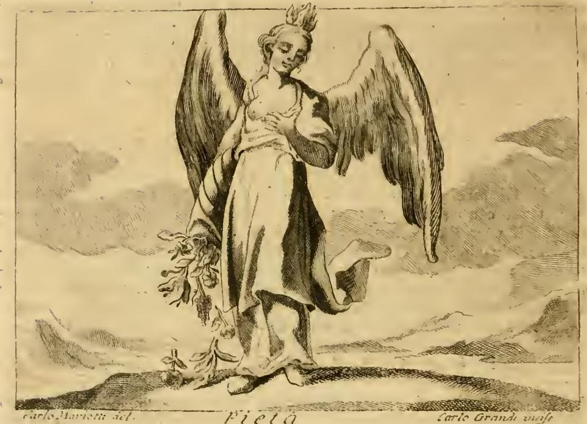

# 리파의 '경건(Pietà)' 의인화

## 카드 요약

**Q. 리파는 '경건(Pietà)'을 어떻게 의인화했는가?**

체사레 리파(Cesare Ripa)의 『이코놀로지아(Iconologia)』에서 경건은 다음과 같은 모습의 **아름다운 젊은 여인**으로 그려진다.

- **흰 피부, 큰 눈, 매부리코**의 아름다운 얼굴
- **어깨에 날개**
- **붉은 옷**
- **머리 꼭대기에서 타오르는 불꽃**
- **왼손은 심장 위에** 얹음
- **오른손으로 풍요의 뿔(코르누코피아)**을 기울여 삶에 유용한 것들을 쏟아냄

## 원본 판화

판화(카를로 마리오티 그림, 카를로 그란디 판각, 하단에 "Pietà" 표기)에서 카드의 요소들을 그대로 확인할 수 있다. 젊은 여인의 **머리 꼭대기에 작은 불꽃**이 솟아 있고, 등 뒤로 **큰 날개**가 펼쳐져 있으며, **왼손을 가슴(심장) 위에** 얹고 있다. 몸 옆으로는 나선형의 **풍요의 뿔**이 아래로 기울어져 꽃과 열매 등 갖가지 것들이 땅으로 쏟아지고 있다. (흑백 판화라 옷의 붉은색은 보이지 않지만, 본문은 붉은 옷이라고 명시한다.)

## 각 상징의 의미 (리파 본문의 설명)

| 요소 | 의미 |
|---|---|
| 흰 피부·큰 눈·매부리코 | 관상학자(filosofi fisionomisti)들이 경건한 성품을 이런 외모로 기술했기 때문 |
| **붉은 옷** | 경건은 **사랑(카리타스, Carità)의 동반자이자 자매**이므로, 카리타스에 어울리는 색인 붉은색을 입는다 |
| **날개** | 모든 덕 가운데 특히 경건이 "난다"고 말해지기 때문 — **하나님에게서 조국으로, 조국에서 친족으로, 친족에서 우리 자신에게로 끊임없이 날아다닌다** |
| 머리 위의 불꽃 | 하나님에 대한 사랑으로 **정신이 불붙어** 경건의 실천으로 나아감을 뜻함 — 경건은 본성상 하늘의 것들을 향해 타오른다 |
| 심장 위의 왼손 | 경건한 사람은 자신의 사랑을 **과시나 헛된 영광에 대한 욕심 없이**, 굳고 온전한 의도로 행한 살아있는 고귀한 행위로 드러낸다는 뜻. 리파는 베르길리우스가 아이네아스의 경건에 그림자가 드리우지 않도록 그의 경건한 행위가 밤의 어둠 속에서 행해졌다고 노래했다는 점을 든다 |
| **풍요의 뿔** | 경건의 일에서는 **세상의 재물을 아끼지 말아야 함**을 보여준다. 리파는 로마의 기근 때 아낌없이 베푼 파트리치오 파트리치(Patrizio Patrizi)를 모범 사례로 든다 |

## 배경 지식

- 여기서 Pietà는 미켈란젤로 조각의 '피에타(죽은 그리스도를 안은 성모)'가 아니라, 라틴어 **pietas** — 신·조국·부모·친족에 대한 경건한 의무와 사랑 — 의 의인화다. 리파는 같은 항목에서 키케로를 인용해 "경건함이란 하나님, 웃어른, 친족, 친구, 조국에 대해 우리가 가져야 할 경외"라고 정의한다.
- 『이코놀로지아』는 같은 장에 여러 대안적 도상도 함께 싣는다: 황새·제단 위의 칼·코끼리·아이와 함께 있는 여인, 티베리우스 메달의 좌상, 안토니누스 피우스가 그린 향로를 든 마트로나 등. 이 카드는 그중 **리파 자신의 대표 도상**(Di Cesare Ripa)을 다룬다.
- 암기 포인트: **붉은 옷 = 카리타스의 자매**, **날개 = 신→조국→친족→자신으로 나는 덕**, **불꽃 = 신의 사랑으로 타오르는 정신**, **심장 위 손 = 과시 없는 진실한 행위**, **풍요의 뿔 = 재물을 아끼지 않는 베풂**.
