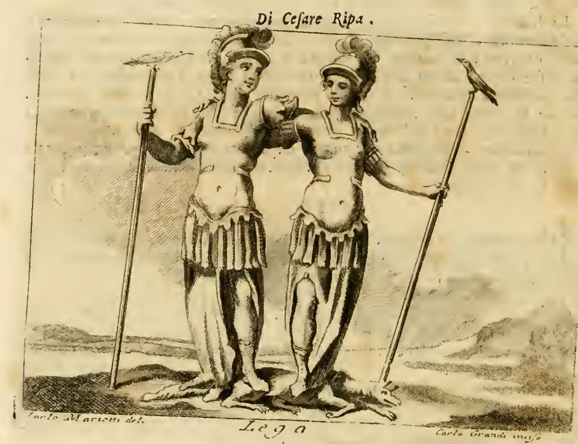

# 체사레 리파의 『이코놀로지아』란 무엇인가

## 한 줄 정의

『이코놀로지아(Iconologia)』는 **"추상적인 개념을 어떻게 그림으로 그릴 것인가"에 답하는 도상학 사전**이다. 정의(正義), 우정, 나태, 자연법 같은 눈에 보이지 않는 개념들을 각각 하나의 **의인화된 인물상(personification)** 으로 규정하고, 그 인물이 어떤 옷을 입고 무엇을 들고 어떤 동물을 곁에 두는지를 **알파벳 순으로** 정리한 책이다. 저자는 페루자 출신 기사(Cavaliere) 체사레 리파다.

원제가 그것을 그대로 말해 준다. 자산의 속표지에는 이렇게 찍혀 있다.

> **ICONOLOGIA DEL CAVALIERE CESARE RIPA PERUGINO**
> *Notabilmente accresciuta d'Immagini, di Annotazioni, e di Fatti* **DALL'ABATE CESARE ORLANDI**
> IN PERUGIA, MDCCLXVI — STAMPERIA DI PIERGIOVANNI COSTANTINI

"페루자 사람 기사 체사레 리파의 이코놀로지아 — 아바테 체사레 오를란디가 이미지·주석·사례로 크게 증보함, 페루자, 1766년."

## 누가, 언제 썼나

- **체사레 리파(Cesare Ripa, 약 1555–1622)**: 페루자 태생. 추기경 안톤 마리아 살비아티 가문의 집사·트린찬테(고기 써는 시종)로 일하며 인문학 소양을 쌓았고, 그 공으로 기사 작위를 받아 표지에도 "Cavaliere"로 적힌다. 직업 화가도 학자도 아닌 궁정 실무자가 쓴 책이라는 점이 이 책의 실용적 성격을 설명해 준다.
- **1593년 로마 초판**: 삽화가 **하나도 없는** 텍스트 사전이었다. 수백 개 표제어를 알파벳 순으로 배열하고, 각 개념을 어떻게 그릴지 말로만 지시했다.
- **1603년 제2판**: 여기서 처음으로 **151점의 목판 삽화**가 붙고 표제어도 684개로 대폭 늘었다. 이 판본이 이후 유럽 미술의 표준 참조서가 된다.
- 이후 이탈리아어판 9종, 프랑스어·독일어·네덜란드어·영어 등 번역판 8종이 나오며 17–18세기 내내 재판을 거듭했다.

## 자산이 담고 있는 판본 — 오를란디의 페루자판(1764–67)

이 카드의 자산은 리파의 원본이 아니라 **아바테 체사레 오를란디(1734–1779)가 증보한 페루자판 제4권(TOMO QUARTO)** 이다.

- 페루자, 피에르조반니 코스탄티니 인쇄소, 1764–1767년, 전 5권 2절판.
- 동판화 370점 이상. 대부분 **카를로 마리오티(Carlo Mariotti)가 밑그림(del./inv.), 카를로 그란디(Carlo Grandi)가 새김(incise/sculp.)** — 판화 하단 좌우 구석에 두 사람 이름이 그대로 찍혀 있다.
- 제4권은 이탈리아어 알파벳 순으로 **L에서 Q까지**를 담는다. Lascivia(음란) → Lassitudine(여름의 나른함) → Lealtà(성실) → Lega(동맹) → Legge Naturale(자연법) … 끝은 Prudenza(신중) → Pudicizia(정숙) → Puerizia(유년) → Punizione(징벌) → Purità(순수) → Querela a Dio → Quiete(정적).
- 권두에는 종교재판소 검열관들의 **APPROVAZIONI(출판 인가)** 가 실려 있다. "신앙과 미풍양속에 어긋나는 것이 없으므로 세상에 내놓을 만하다"는 승인문 두 편(1766년 5월 28일자)이 그것으로, 당대 출판 관행을 보여 준다.

## 한 항목이 어떻게 생겼나 — 실제 판화로 보기

리파식 항목의 정석은 **① 표제어 → ② 인물 묘사 지시문 → ③ 각 지물(attribute)의 상징적 근거 해설** 이라는 3단 구조다. 오를란디판은 여기에 **④ FATTO STORICO SAGRO(성서적 실화) / FATTO STORICO PROFANO(세속 실화) / FATTO FAVOLOSO(신화적 사례)** 를 덧붙였다. 항목 제목 아래 "**Di Cesare Ripa**"라고 적힌 것은 리파의 원문이고, 그 표기가 없는 항목은 후대 증보분이다.

### 예 1: 자연법(Legge Naturale)

지시문은 이렇다. "매우 아름다운 여인. 반쯤 벗은 몸에, 기교로 땋지 않고 자연스럽게 흘러내린 머리. 덜 정숙한 부위는 어린양 가죽으로 가린다. 아름다운 정원에 앉아, 손에 컴퍼스를 들고 **AEQUA LANCE**(공평한 저울로)라는 명문이 붙은 평행선을 긋는다. 그리고 자기 자신의 그림자를 왼손 검지로 가리킨다."

판화를 보면 지시문이 그대로 구현되어 있다. 화면 중앙에 반나체의 여인이 앉아 있고, 머리는 땋지 않은 채 어깨로 흘러내리며, 하반신은 양가죽으로 덮여 있다. 오른손에 쥔 긴 컴퍼스 옆에 **AEQVA LAN…** 이라는 글자가 새겨져 있고, 배경은 낮은 산울타리로 구획된 정원이며, 왼손은 옆으로 뻗어 나무 쪽을 가리킨다.

리파는 그 각각의 이유를 조목조목 댄다.

| 지물 | 상징적 근거 |
|---|---|
| 아름다운 여인 | 신이 만든 것은 모두 아름답고 완전하므로 (신명기 32장 "Dei perfecta sunt opera") |
| 반나체 + 땋지 않은 머리 | 자연법은 지극히 단순한 신이 만든 것이므로 **단순(semplice)** 하다 |
| 어린양 가죽 | 죄를 지은 인간에게 신이 입혀 준 가죽옷(창세기 3장), 곧 "창세부터 죽임당한 어린양" 그리스도의 예표 |
| 아름다운 정원 | 자연법이 처음 놓인 곳이 지상낙원이기 때문 |
| 컴퍼스와 평행선, AEQUA LANCE | "남에게 대접받고자 하는 대로 남을 대접하라"(마태복음 7장)는 **공평함** |
| 자기 자신의 그림자 | 자연법은 이웃을 나 자신과 같게(alter idem) 만든다는 뜻 |

즉 **그림 한 장이 곧 하나의 논증**이다. 화가는 이 지시만 따르면 "자연법"이라는 추상 개념을 관객이 읽어 낼 수 있는 형태로 그릴 수 있다.

### 예 2: 동맹(Lega)

"투구와 흉갑으로 무장한 두 여인이 서로 껴안고, 각자 손에 창(asta)을 하나씩 든다. 한쪽 창 위에는 **해오라기(arione/ardeola)**, 다른 쪽에는 **까마귀(cornacchia)** 가 앉아 있다. 두 여인의 발밑에는 **여우**가 뻗어 있다."

판화에서 실제로 확인되는 것들: 화면 위쪽에 "Di Cesare Ripa", 아래에 표제어 "Lega"가 새겨져 있고(항목 제목이 판화에도 반복된다), 투구를 쓴 두 여인이 팔을 걸어 껴안은 채 각자 긴 창을 짚고 서 있으며, 좌우 창끝에 각각 새 한 마리가 앉아 있다. 하단 좌우에는 "Carlo Mariotti del." / "Carlo Grandi incise" 서명이 있다.

근거는 고전 텍스트에서 끌어온다. 아리스토텔레스 『동물지』 9권과 플리니우스 『박물지』 10권 72장에 **해오라기와 까마귀는 서로 친구이며 공동의 적인 여우에 맞서 연합한다**는 기술이 있다. 그래서 두 새는 "공동의 적에 대항하는 동맹"의 상징이 되고, 발밑의 여우는 연합군이 쓰러뜨리려는 적이며, 창은 전쟁의 상형문자다. 리파는 여기에 실제 사례로 교황 비오 5세·스페인·베네치아의 대(對)투르크 신성동맹(Sacrum Foedus)까지 언급하고, 오를란디는 여호수아에 맞선 하솔 왕 야빈의 동맹(성서), 알바니 왕 메티우스 수페티우스의 배신(로마사), 테베를 친 일곱 장수(신화)를 사례로 붙였다.

## 왜 중요한가

- **화가·조각가를 위한 실무 매뉴얼**: 회화의 주문자와 제작자 사이의 공통 어휘집이었다. 궁전 천장화, 개선문, 축제 장식, 책의 권두화 등 "덕과 악덕과 도시와 강과 계절"을 인물로 그려야 하는 모든 작업에서 참조되었다.
- **광범위한 영향**: 피에트로 다 코르토나, 헤라르트 데 라이레세, 빌럼 판 미리스 등이 이 책을 사용했고, 페르메이르도 여기서 우의를 가져온 것으로 본다. 오늘날 바로크·로코코 회화의 알레고리를 **해독하는 열쇠**로 미술사에서 쓰인다.
- **지식의 집성**: 이집트 상형문자, 그리스·로마 고전, 성서, 교부, 중세 동물지, 알차티의 엠블럼서를 모두 끌어와 하나의 상징 체계로 묶은 백과사전적 작업이다. 위 두 항목에서도 플리니우스·아리스토텔레스·티투스 리비우스·호메로스·신명기·마태복음·알차티가 한꺼번에 인용된다.

## 정리

| 항목 | 내용 |
|---|---|
| 무슨 책인가 | 알레고리(우의) 개념의 의인화 도상 사전 |
| 배열 | 개념명 알파벳 순 |
| 저자 | 페루자의 기사 체사레 리파 (약 1555–1622) |
| 초판 / 삽화판 | 1593년 로마(무삽화) / 1603년(목판 151점, 표제어 684) |
| 자산 판본 | 체사레 오를란디 증보, 페루자 1764–67, 전 5권 — 여기 실린 것은 L~Q를 담은 제4권 |
| 독자 | 화가·조각가·시인·축제 기획자 등 추상 개념을 형상화해야 하는 모든 사람 |
| 항목 구조 | 인물 묘사 지시문 + 지물별 상징 근거 해설 (+ 오를란디판은 성서·역사·신화 사례) |

## 참고

- [Cesare Ripa — Wikipedia](https://en.wikipedia.org/wiki/Cesare_Ripa)
- [Iconologia, ouero, Descrittione di diuerse imagini (1603) — Internet Archive](https://archive.org/details/iconologiaouerod00ripa)
- [Iconologia del cavaliere Cesare Ripa, perugino (Orlandi 편, 1764–67) — Internet Archive](https://archive.org/details/iconologiadelcav00ripa)
- [Iconologia del cavaliere Cesare Ripa, perugino — NYPL Digital Collections](https://digitalcollections.nypl.org/collections/iconologia-del-cavaliere-cesare-ripa-perugino)
- [Cesare Orlandi — Wikipedia](https://en.wikipedia.org/wiki/Cesare_Orlandi)
- [Ripa, Cesare — Dictionary of Art Historians](https://arthistorians.info/ripacf/)
