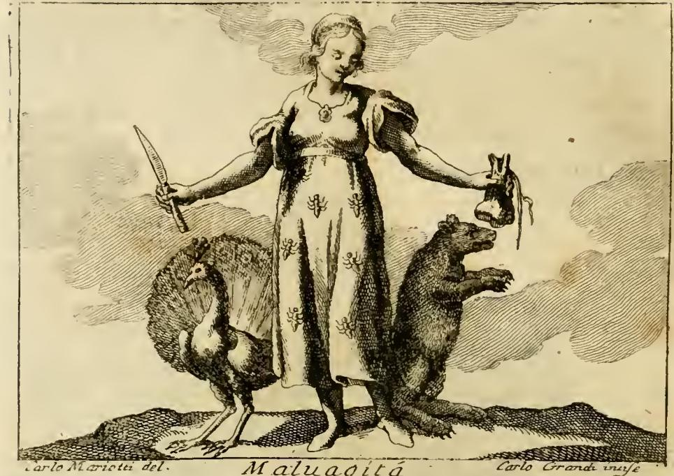

# '사악함(Malvagità)' — 거미 붙은 옷과 머리의 연기

## 카드

**질문** — '사악함' 도상에서 거미 붙은 옷과 머리의 연기는 무엇을 뜻하는가?

**답** — 거미는 약하고 가늘면서도 지나가는 파리를 잡는 속임수 그물을 짜는 동물로, 헛되고 교활한 음모에 몰두하는 사악한 자의 영혼을 뜻한다. 연기는 눈을 해치는 연기처럼 사악함이 그것을 행하는 자의 정신의 시야를 어두운 안개처럼 가림을 나타낸다.

---

## 1. 판화에서 실제로 보이는 것

이 도판은 좌우가 뒤집히지 않은 정상 상태다. 하단 명패의 `Maluagitá`, 좌하단 `Carlo Mariotti del.`, 우하단 `Carlo Grandi incise` 서명이 모두 정방향으로 읽히고, 지물의 좌우도 본문 기술과 일치한다(칼은 인물의 오른손, 주머니는 왼손, 공작은 인물의 오른쪽, 곰은 왼쪽).

관찰되는 요소를 본문과 대조하면 이렇다.

| 판화에서 보이는 것 | 원문 기술 | 판화 재현도 |
|---|---|---|
| **가운 전면에 흩뿌려진 작은 검은 벌레 모양 8~9개** | `veſtimento farà tutto conteſo di ragni` (옷 전체가 거미로 덮이되, **알아볼 수 있게** 그릴 것) | **명확히 보인다.** 다리가 뻗은 절지동물 형태로, 옷감의 무늬가 아니라 붙어 있는 거미로 읽힌다 |
| **머리 주위로 피어오르는 물결형 해칭** | `in cambio de' capelli avrà circondato il capo da un denſo, e gran fumo` (머리카락 대신 짙고 큰 연기가 머리를 둘러싼다) | **약하게만 보인다.** 앞머리가 그대로 남아 있고, 머리 위 연기는 배경 구름의 해칭과 뒤섞여 "머리카락을 대체한 연기"라는 원문 요구만큼 강하지 않다 |
| 오른손의 짧은 칼 | `coltello` — 잔혹함 | 명확 |
| 왼손의 끈으로 묶인 주머니 | `borſa ſtrettamente legata` — 탐욕 | 명확 |
| 꼬리를 펼친 공작 / 성난 곰 | 교만(superbia) / 분노(ira) | 명확 |

즉 이 카드가 묻는 두 표징 중 **거미는 판화의 주된 시각 정보**이고, **연기는 판화보다 텍스트에서 더 강하게 규정된다**. 화가가 노파의 극단적 추함(`vecchia, mora, di eſtrema bruttezza`)과 검은 피부도 상당히 완화해 젊고 단정한 여인으로 그렸는데, 연기 머리의 약화도 같은 완화의 일부로 보인다.

---

## 2. 거미: 원문과 번역

> Li ragni ſopra il veſtimento ſignificano la Malvagità, e la Malignità della vita noſtra eſſere ſimile al ragno, il quale eſſendo **debole, e tenuiſſimo**, teſſe certe **reti ingannevoli alle moſche**, che per là paſſano: così ſono gli animi de' malvagi, e ſcellerati, che ſi occupano a macchinare con **falſe, e vane opere** loro, alle quali ſono dediti.

**번역** — 옷 위의 거미들은 사악함을, 그리고 우리 삶의 악독함이 거미와 같음을 뜻한다. 거미는 **약하고 지극히 가늘면서도** 그곳을 지나가는 **파리를 잡는 속임수 그물을 짠다**. 사악하고 흉악한 자들의 영혼도 그와 같아, 자기가 몰두하는 **거짓되고 헛된 소업**을 꾸미는 데 매달린다.

리파가 이어 붙인 라틴 전거(원문의 OCR을 정리하면):

> Malignitatem vitæ noſtræ ſimilitudo declarat: aranea eſt animal debile ac tenuiſſimum, quod tranſeuntibus muſcis quædam retia doloſa contexit; ſicut animi illorum qui ſceleratis operibus dediti ſunt, inanibus et ſubdolis machinationibus occupantur.
> — 리파는 이를 **Cassiodorus**가 시편 구절 `Anni eorum ſicut Aranea`("그들의 해는 거미와 같이")를 주해한 대목으로 돌린다.

이 시편 구절은 불가타 시편 89(89:9, 히브리어 번호 90편)의 `anni noſtri ſicut aranea meditabuntur`("우리의 해는 거미처럼 헛되이 지나간다")이다. 즉 리파가 끌어온 전거 자체가 **거미 = 헛됨(inanitas)** 의 계열에 속한다. 라틴어 `inanibus et ſubdolis machinationibus`("헛되고 교활한 음모")라는 짝이 여기서 나온다 — 카드의 답에 있는 "헛되고 교활한 음모"가 정확히 이 표현이다.

### 이사야 59:5-6 — 옷 위의 거미라는 선택을 설명하는 축

리파는 이사야를 명시하지 않지만, "거미줄이 **옷**에 붙어 있다"는 도상 선택은 이 구절 없이는 잘 설명되지 않는다. 불가타:

> **Isa 59:5** — ova aspidum ruperunt, et **telas araneae texuerunt**: qui comederit de ovis eorum, morietur; et quod confotum est, erumpet in regulum.
> **Isa 59:6** — **telae eorum non erunt in vestimentum**, neque operientur operibus suis: opera eorum opera inutilia, et opus iniquitatis in manibus eorum.

**번역** — 그들은 독사의 알을 부화시키고 **거미줄을 짰다**. 그 알을 먹는 자는 죽고, 깨어진 알에서는 독사가 나온다. **그들의 거미줄로는 옷을 지을 수 없고**, 자기 소업으로 몸을 덮지도 못한다. 그들의 소업은 **쓸모없는 소업**이며, 그들의 손에는 불의의 소업이 있다.

여기서 세 겹이 맞물린다.

1. **직조(texuerunt) 은유** — 악인의 계략은 "짜여진 것", 즉 공들여 만든 인공물이다. 리파의 `teſſe`(짜다)와 같은 동사 계열.
2. **옷이 되지 못한다(non erunt in vestimentum)** — 그물은 옷으로 쓸 수 없다. 그런데 판화의 노파는 그 거미들을 **입고** 있다. 사악함은 자신의 계략을 자기 정체성으로, 자기를 가려 줄 옷으로 삼지만 그 옷은 몸을 덮지 못한다. 도상은 그 자기 기만을 시각화한다 — 노란빛 옷 자체도 리파가 `Malvagità, tradimento, aſtuzia, e mutazione di penſieri`(사악함, 배신, 교활, 마음의 변절)의 색이며 "어떤 덕에도 적용할 수 없고, 그 자체에 견고하고 실재하는 기초가 없는" 색이라 못박는다.
3. **쓸모없는 소업(opera inutilia)** — 리파의 `falſe, e vane opere`, 라틴어의 `inanibus`와 같은 지점. 계략은 성실하게 짜였으나 결과적으로 무익하다.

### '약함 + 교활함'이 왜 사악함의 핵심인가

리파가 거미에서 뽑아내는 술어는 딱 두 개다: `debole`(약함), `tenuiſſimo`(지극히 가늚). 그리고 그 약함이 곧바로 `reti ingannevoli`(속임수 그물)로 이어진다. 이 조합이 사악함(malvagità)을 다른 악덕과 구별한다.

- **힘으로 해치는 악은 잔혹함(Crudeltà)이다.** 그것은 정면에서 오고, 대상이 알아볼 수 있으며, 저항이나 도피의 대상이 된다. 판화의 칼이 담당하는 항목이다.
- **사악함은 힘이 없기 때문에 계략을 쓴다.** 거미는 파리보다 강하지 않다 — 오히려 몸은 더 연약하다. 거미가 이기는 것은 힘이 아니라 **파리가 지나갈 길목에 미리 놓인 보이지 않는 구조** 때문이다. 리파의 `che per là paſſano`("그곳을 지나가는")가 핵심이다. 함정은 사냥이 아니라 **대기**이며, 희생자의 정상적 이동 경로를 착취한다.
- 따라서 사악함의 위험은 크기가 아니라 **비대칭성**이다. 아무리 미약한 자도 계략을 통해 자기보다 강한 자를 해칠 수 있다. 리파가 이 표징을 여인 — 그것도 늙고 무력한 노파 — 에게 입힌 것은 우연이 아니다. 물리적으로 아무것도 할 수 없어 보이는 몸이 가장 위험할 수 있다는 것이 이 도상의 논지다.
- 동시에 약함은 **경멸의 근거**이기도 하다. 거미줄은 손짓 한 번에 찢어지고, 이사야의 말대로 옷이 되지 못한다. 사악함은 무섭지만 동시에 **가엾고 헛되다** — 두려움과 멸시를 한 몸에 받는 이중성이 `debole` 하나에서 나온다. 이것이 잔혹함이나 교만과 결정적으로 다른 지점이다.

---

## 3. 연기: 원문과 번역

> Il denſo, ed il gran fumo che gli eſce dal capo denota, che ſiccome il fumo fa danno agli occhi; così fa l' iniqua malvagità, **a chi l' uſa**, onde ſi può beniſſimo paragonare queſto peſſimo vizio al fumo, eſſendo come una **nebbia oſcura, la quale oſcura la viſta della mente**.
>
> Sicut fumus oculis: ſic iniquitas utentibus ea. Recte iniquitas fumo comparatur: quæ velut quadam ſæculari caligine, **aciem mentis obducit**. — libro 2. de Cain & Abel [암브로시우스]

**번역** — 머리에서 나오는 짙고 큰 연기는, 연기가 눈을 해치는 것과 같이 불의한 사악함이 **그것을 행하는 자에게** 해를 끼침을 나타낸다. 그래서 이 최악의 악덕을 연기에 비길 수 있는데, 그것이 **정신의 시야를 어둡게 하는 어두운 안개**와 같기 때문이다. — "연기가 눈에 그러하듯, 불의는 그것을 쓰는 자에게 그러하다. 불의를 연기에 비기는 것은 옳다. 그것은 세속의 어스름처럼 **정신의 예리한 시선을 덮어 버린다**."

번역상 놓치면 안 되는 두 단어.

- `a chi l' uſa` / `utentibus ea` — "그것을 **쓰는 자에게**". 피해자에게가 아니다. 문장의 목적어가 가해자다.
- `aciem mentis` — `acies`는 칼날·시력의 예리함을 동시에 뜻한다. 사악함은 정신을 없애는 것이 아니라 **날을 무디게 하고 초점을 흐린다**. 악인은 여전히 생각하지만 더 이상 정확히 보지 못한다.

머리카락 자리에 연기를 놓은 구성 자체가 논지를 담는다. 연기는 **머리 안에서 나와 머리 주위에 머문다.** 외부에서 온 안개가 아니라 자기가 태운 것의 산물이고, 그래서 가장 먼저 자기 눈을 가린다. 리파의 논리 순서를 따르면: 사악함을 행함 → 연기가 남 → 자기 시야가 흐려짐 → 판단이 더 나빠짐 → 더 사악하게 행함. 자기 강화 회로다.

이는 또 거미와 정면으로 맞물린다. 거미의 그물은 **정교한 계산**을 요구하는데, 연기 머리의 노파는 **정확히 볼 수 없다.** 스스로를 영리하다고 여기며 짜는 그물이 실제로는 `opera inutilia` — 쓸모없는 소업 — 인 이유가 여기 있다. 두 표징은 한 문장으로 이어진다: **눈이 가려진 자가 정밀함을 요구하는 함정을 짜고 있다.**

---

## 4. 대조표 — 연기(Malvagità)와 녹(Malignità)

두 알레고리는 같은 4권 안에서 이웃하며, 리파는 거미 항목에서 이미 `la Malvagità, e la Malignità`를 한 호흡으로 묶어 둔다. 두 표징이 같은 구조를 공유한다.

악독함(Malignità) 원문:

> DOnna brutta, pallida, veſtita del **color della ruggine** [...] i colori del veſtimento dimoſtrano, che ſiccome la **ruggine continuamente conſuma ogni metallo, ove ella ſi pone**, così il maligno non ceſſi mai colla peſſima ſua natura di danneggiare ogni opera lodevole, e virtuoſa.

**번역** — 추하고 창백한 여인, **녹빛 옷**을 입었다. [...] 옷의 색은, 녹이 **자기가 앉은 모든 금속을 끊임없이 삭히는** 것과 같이, 악독한 자도 그 최악의 본성으로 칭찬받을 만하고 덕스러운 모든 소업을 해치기를 결코 멈추지 않음을 보여 준다.

| | **연기 (fumo)** — 사악함 | **녹 (ruggine)** — 악독함 |
|---|---|---|
| 매체의 정체 | 태움의 부산물, 기체 | 산화의 부산물, 고체 표면층 |
| 발생 위치 | **머리에서** 나온다 (머리카락 대체) | **옷 색**으로 몸 전체를 덮는다 |
| 해치는 대상 | `a chi l' uſa` — **쓰는 자 자신의 눈** | `ove ella ſi pone` — **자기가 앉은 금속** |
| 손상의 성격 | 시야·판단의 마비 (`aciem mentis obducit`) | 실체의 소모 (`continuamente conſuma`) |
| 시간 구조 | 회로형 — 흐려진 판단이 다음 악행을 낳음 | 지속형 — `non ceſſi mai`, 멈추지 않는 잠식 |
| 전거 | 암브로시우스, De Cain et Abel II | 피에리오 발레리아노 *Hieroglyphica* 24 / 에제키엘 34 |
| 짝 동물 | 거미(공작·곰) | 메추라기(coturnice) |

**공통 구조 — 악덕은 대상보다 주체를 먼저 망친다.**

- 연기는 정의상 **자기 안에서 나온다.** 무엇을 가릴지 선택할 수 없고, 발생원에 가장 가까운 눈 — 자기 눈 — 을 필연적으로 먼저 덮는다.
- 녹은 정의상 **금속 자체가 변한 것이다.** 외부에서 온 공격자가 아니라 금속이 스스로 산화한 결과이며, 삭아 없어지는 것은 녹이 아니라 녹슨 금속이다.

두 비유는 모두 **악덕의 매체가 악덕의 담지자와 물질적으로 동일하다**는 점에서 성립한다. 그래서 해악의 방향은 밖이 아니라 안이다. 리파가 인용한 P. Ricci의 악독함 변형은 이 논지를 노골적으로 밀고 간다 — `Il pugnale rivolto al petto, denota, che il maligno offende anco ſe ſteſſo`("자기 가슴을 향한 단검은 악독한 자가 자기 자신도 해침을 뜻한다"), 그리고 `per giudizio di Dio, per lo più la ſaetta ritorna a ferire il maligno offenſore`("하느님의 심판으로, 화살은 대개 되돌아와 악독한 가해자를 맞힌다").

이 자기 파괴 구조가 거미로도 되돌아간다. 거미줄은 파리를 잡지만, 이사야의 판정대로 **정작 거미 자신의 옷은 되지 못한다**(`telae eorum non erunt in vestimentum`). 함정은 대상에게 작동하고, 무익함은 주체에게 남는다.

---

## 5. 도상 전체 지도

리파는 `il peccato non va mai ſolo, ma l' uno tira l' altro`("죄는 결코 홀로 가지 않고, 하나가 다른 하나를 끌어온다")고 밝히며 사악함을 **복수 악덕의 집합체**로 구성한다. 각 표징의 담당 항목:

| 표징 | 담당 악덕 |
|---|---|
| 노파(vecchia) | 노인이 만사를 나쁜 쪽으로 의심함 (아리스토텔레스 『수사학』 2권) |
| 검은 피부(mora) | 로마인이 검정을 파렴치하고 해로운 품행으로 삼음 (발레리아노 28권) |
| 극단적 추함 | `turpitudo eſt deformitas` — 파렴치한 행위의 추함 |
| 노란빛 옷 | 배신·교활·마음의 변절, 견고한 기초가 없는 색 |
| **거미** | **헛되고 교활한 음모 — 약함으로 짜는 함정** |
| **머리의 연기** | **행하는 자 자신의 정신의 시야를 가림** |
| 칼 | 잔혹함 (발레리아노 42권, 페르시아 왕 Ochus) |
| 묶인 주머니 | 탐욕 — 잔혹·기만·불화·배은·배신을 낳는 소유욕 |
| 공작 | 교만 — 자기 힘으로 모든 것을 할 수 있다고 여기며 신을 헤아리지 않음 |
| 곰 | 분노 — `l' intelletto in folle ardire accieca`("지성을 미친 만용으로 눈멀게 한다") |

마지막 항목의 `accieca`(눈멀게 한다)를 주목하면, 연기의 논리가 곰/분노 항목의 인용시에서 한 번 더 반복된다. **눈이 멀는 것**이 이 알레고리 전체를 꿰는 모티프다.

---

## 6. 요약

- **거미** = `debole + tenuiſſimo`인데도 그물을 짜는 존재. 힘이 아닌 **계략**으로 해치는 악의 형식이며, 짜인 것은 `inanibus et ſubdolis machinationibus` — 헛되고 교활한 음모다. 이사야 59:5-6이 그 그물이 "옷이 되지 못한다"고 판정하고, 시편 89:9(`anni noſtri ſicut aranea`)가 그 헛됨을 봉인한다.
- **연기** = 머리카락 자리에서 피어올라 **행하는 자 자신의 눈**을 덮는 부산물. `aciem mentis obducit` — 정신의 날을 무디게 한다.
- **둘의 결합** = 눈이 가려진 자가 정밀함을 요구하는 함정을 짜므로, 그 그물은 무익할 수밖에 없다.
- **악독함의 녹과 짝** = 연기와 녹은 모두 담지자 자신에서 발생하는 매체이므로, 악덕은 대상보다 주체를 먼저 망친다.

---

### 참고

- 출처 판본: Cesare Ripa, *Iconologia*, TOMO QUARTO, "MALVAGITÀ" (asset: `03 Machine of the World to Marriage.md`), 도판 `_page_79_Picture_2.jpeg` (Carlo Mariotti 원화 / Carlo Grandi 판각)
- 인접 항목: 같은 파일의 "MALIGNITÀ" (녹빛 옷 + 메추라기), 리파 자신의 참조 지시 `De' Fatti, vedi Crudeltà, Invidia, Perfidia`
- [Isaiah 59:5 (Vulgate) — Bible Study Tools](https://www.biblestudytools.com/vul/isaiah/59-5.html)
- [Isaiah 59:5 번역 대조 — Bible Study Tools](https://www.biblestudytools.com/isaiah/59-5-compare.html)
- [Psalm 89 (Vulgate) — Bible Study Tools](https://biblestudytools.com/vul/psalms/89.html)
- [*Anni nostri sicut aranea* (Orlando di Lasso) — ChoralWiki](https://www.cpdl.org/wiki/index.php/Anni_nostri_sicut_aranea_(Orlando_di_Lasso))
- [Ambrose, *Hexameron, Paradise, and Cain and Abel* (Fathers of the Church 42)](https://archive.org/details/saintambrosehexa0000unse)

주: 본문의 라틴어 인용은 원본 스캔 OCR에 손상이 있어 표준 철자로 복원했다. 암브로시우스 `De Cain et Abel` II권의 해당 문장은 리파의 귀속 표기를 그대로 옮긴 것이며, 원전 대조는 하지 못했다.
